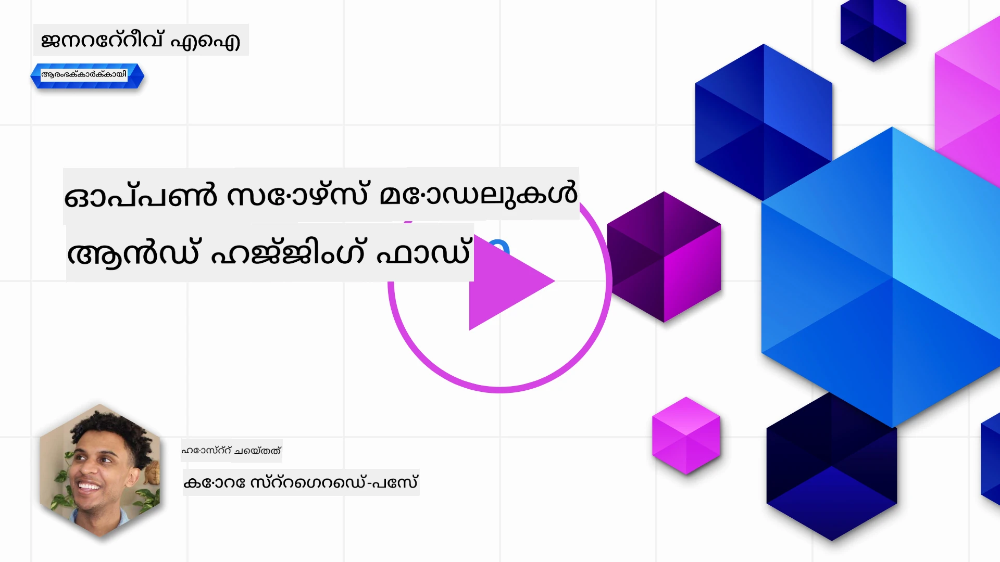
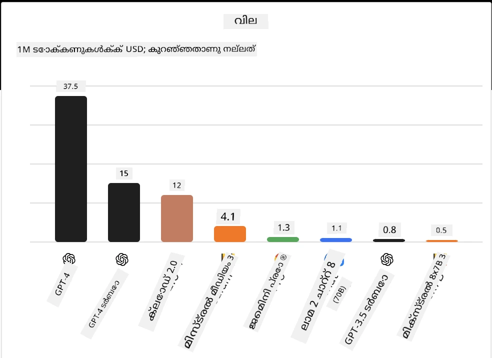
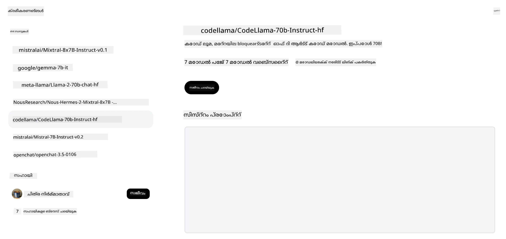
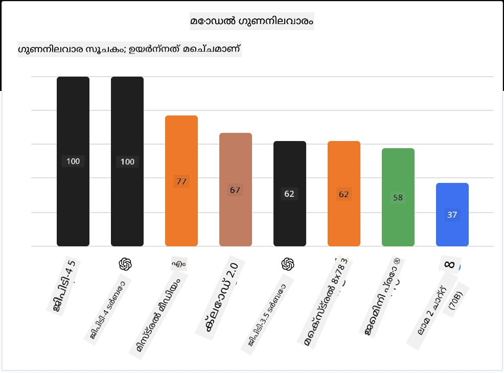

## പരിചയം

ഓപ്പൺ സോഴ്‌സ് LLM-കളുടെ ലോകം ആവേശകരവും സ്ഥിരമായി വികസിക്കുന്നതുമായതാണ്. ഓപ്പൺ സോഴ്‌സ് മോഡലുകളെക്കുറിച്ച് ആഴത്തിലുള്ള ഒരു ദൃഷ്ടികോണം നൽകുകയാണ് ഈ പാഠത്തിന്റെ ലക്ഷ്യം. പ്രോപ്രൈറ്ററി മോഡലുകൾ ഓപ്പൺ സോഴ്‌സ് മോഡലുകളുമായി എങ്ങനെ താരതമ്യം ചെയ്യുന്നു എന്ന വിവരങ്ങൾ അന്വേഷിക്കുന്നുവെങ്കിൽ, ["Exploring and Comparing Different LLMs" പാഠം](../02-exploring-and-comparing-different-llms/README.md?WT.mc_id=academic-105485-koreyst) കാണുക. ഫൈൻ-ട്യൂണിംഗ് വിഷയവും ഈ പാഠത്തിൽ ഉൾപ്പെടുന്നു, എന്നാൽ കൂടുതൽ വിശദമായ വിശദീകരണം ["Fine-Tuning LLMs" പാഠത്തിൽ](../18-fine-tuning/README.md?WT.mc_id=academic-105485-koreyst) ലഭ്യമാണ്.

## പഠന ലക്ഷ്യങ്ങൾ

- ഓപ്പൺ സോഴ്‌സ് മോഡലുകളുടെ മനസ്സിലാക്കൽ നേടുക
- ഓപ്പൺ സോഴ്‌സ് മോഡലുകളുമായി പ്രവർത്തിക്കുന്നതിനുള്ള ഗുണങ്ങൾ മനസ്സിലാക്കുക
- Hugging Face-ലും Azure AI Studio-യിലും ലഭ്യമായ ഓപ്പൺ മോഡലുകൾ അന്വേഷിക്കുക

## ഓപ്പൺ സോഴ്‌സ് മോഡലുകൾ എന്താണ്?

ഓപ്പൺ സോഴ്‌സ് സോഫ്റ്റ്‌വെയർ വിവിധ മേഖലകളിലെ സാങ്കേതികവിദ്യയുടെ വളർച്ചയിൽ നിർണായക പങ്ക് വഹിച്ചിട്ടുണ്ട്. ഓപ്പൺ സോഴ്‌സ് ഇൻഷിയേറ്റീവ് (OSI) [ഓപ്പൺ സോഴ്‌സ് ആയി കണക്കാക്കാനുള്ള 10 മാനദണ്ഡങ്ങൾ](https://web.archive.org/web/20241126001143/https://opensource.org/osd?WT.mc_id=academic-105485-koreyst) നിർവചിച്ചിട്ടുണ്ട്. സോഴ്‌സ് കോഡ് OSI അംഗീകരിച്ച ലൈസൻസിനടിയിൽ തുറന്നുപ്രകടിപ്പിക്കണം.

LLM-കളുടെ വികസനം സോഫ്റ്റ്‌വെയർ വികസനവുമായി സമാന ഘടകങ്ങൾ ഉള്ളതായിരുന്നാലും, പ്രക്രിയ പൂർണ്ണമായും ഒരുപോലെയല്ല. LLM-കളുടെ സാന്ദർഭ്യത്തിൽ ഓപ്പൺ സോഴ്‌സ് എന്ന നിർവചനത്തെക്കുറിച്ച് സമൂഹത്തിൽ വലിയ ചർച്ചകൾ ഉണ്ട്. ഒരു മോഡൽ പരമ്പരാഗത ഓപ്പൺ സോഴ്‌സ് നിർവചനത്തിന് അനുയോജ്യമായിരിക്കണമെങ്കിൽ താഴെ പറയുന്ന വിവരങ്ങൾ പൊതുവായി ലഭ്യമാകണം:

- മോഡൽ പരിശീലിപ്പിക്കാൻ ഉപയോഗിച്ച ഡാറ്റാസെറ്റുകൾ.
- പരിശീലനത്തിന്റെ ഭാഗമായ മുഴുവൻ മോഡൽ വെയ്റ്റുകൾ.
- മൂല്യനിർണയ കോഡ്.
- ഫൈൻ-ട്യൂണിംഗ് കോഡ്.
- മുഴുവൻ മോഡൽ വെയ്റ്റുകളും പരിശീലന മെട്രിക്കുകളും.

ഇപ്പോൾ ഈ മാനദണ്ഡങ്ങൾ പാലിക്കുന്ന മോഡലുകൾ കുറച്ചേ ഉള്ളൂ. [Allen Institute for Artificial Intelligence (AllenAI) സൃഷ്ടിച്ച OLMo മോഡൽ](https://huggingface.co/allenai/OLMo-7B?WT.mc_id=academic-105485-koreyst) ഈ വിഭാഗത്തിൽപ്പെടുന്നു.

ഈ പാഠത്തിൽ, എഴുതുന്ന സമയത്ത് മുകളിൽ പറയുന്ന മാനദണ്ഡങ്ങൾ പാലിക്കാത്തതിനാൽ മോഡലുകളെ "ഓപ്പൺ മോഡലുകൾ" എന്ന് വിളിക്കും.

## ഓപ്പൺ മോഡലുകളുടെ ഗുണങ്ങൾ

**ഉയർന്ന കസ്റ്റമൈസേഷൻ** - ഓപ്പൺ മോഡലുകൾ വിശദമായ പരിശീലന വിവരങ്ങളോടുകൂടി പുറത്തിറക്കപ്പെടുന്നതിനാൽ, ഗവേഷകരും ഡെവലപ്പർമാരും മോഡലിന്റെ ആന്തരിക ഘടകങ്ങൾ മാറ്റി രൂപപ്പെടുത്താൻ കഴിയും. ഇത് ഒരു പ്രത്യേക ജോലി അല്ലെങ്കിൽ പഠന മേഖലയ്ക്കായി ഫൈൻ-ട്യൂൺ ചെയ്ത ഉയർന്ന വിദഗ്ധതയുള്ള മോഡലുകൾ സൃഷ്ടിക്കാൻ സഹായിക്കുന്നു. ഉദാഹരണങ്ങൾ: കോഡ് ജനറേഷൻ, ഗണിത പ്രവർത്തനങ്ങൾ, ജീവശാസ്ത്രം.

**ചെലവ്** - ഈ മോഡലുകൾ ഉപയോഗിക്കുകയും വിനിയോഗിക്കുകയും ചെയ്യുന്നതിനുള്ള ടോക്കൺ അടിസ്ഥാന ചെലവ് പ്രോപ്രൈറ്ററി മോഡലുകളേക്കാൾ കുറവാണ്. ജനറേറ്റീവ് AI ആപ്ലിക്കേഷനുകൾ നിർമ്മിക്കുമ്പോൾ, നിങ്ങളുടെ ഉപയോഗത്തിനായി ഈ മോഡലുകളുമായി പ്രവർത്തിക്കുമ്പോൾ പ്രകടനവും വിലയും തമ്മിലുള്ള താരതമ്യം പരിശോധിക്കണം.

ഉറവിടം: Artificial Analysis

**ലവചികത** - ഓപ്പൺ മോഡലുകളുമായി പ്രവർത്തിക്കുന്നത് വിവിധ മോഡലുകൾ ഉപയോഗിക്കാനും അവ സംയോജിപ്പിക്കാനും നിങ്ങൾക്ക് ലവചികത നൽകുന്നു. ഉദാഹരണമായി [HuggingChat Assistants](https://huggingface.co/chat?WT.mc_id=academic-105485-koreyst) കാണാം, ഇവിടെ ഉപയോക്താവ് നേരിട്ട് യൂസർ ഇന്റർഫേസിൽ ഉപയോഗിക്കുന്ന മോഡൽ തിരഞ്ഞെടുക്കാം:

## വ്യത്യസ്ത ഓപ്പൺ മോഡലുകൾ അന്വേഷിക്കൽ

### Llama 2

[LLama2](https://huggingface.co/meta-llama?WT.mc_id=academic-105485-koreyst), മെറ്റാ വികസിപ്പിച്ച ഒരു ഓപ്പൺ മോഡലാണ്, ചാറ്റ് അടിസ്ഥാന ആപ്ലിക്കേഷനുകൾക്കായി ഒപ്റ്റിമൈസ് ചെയ്തതാണ്. വലിയ തോതിലുള്ള സംഭാഷണവും മനുഷ്യ പ്രതികരണവും ഉൾപ്പെടുത്തിയ ഫൈൻ-ട്യൂണിംഗ് രീതിയാണ് ഇതിന് കാരണം. ഈ രീതിയിലൂടെ മോഡൽ മനുഷ്യ പ്രതീക്ഷകളോട് കൂടുതൽ പൊരുത്തപ്പെടുന്ന ഫലങ്ങൾ നൽകുന്നു, ഇത് മികച്ച ഉപയോക്തൃ അനുഭവം നൽകുന്നു.

Llama-യുടെ ഫൈൻ-ട്യൂൺ ചെയ്ത ചില പതിപ്പുകൾ: [Japanese Llama](https://huggingface.co/elyza/ELYZA-japanese-Llama-2-7b?WT.mc_id=academic-105485-koreyst), ജാപ്പനീസ് ഭാഷയിൽ വിദഗ്ധതയുള്ളത്, [Llama Pro](https://huggingface.co/TencentARC/LLaMA-Pro-8B?WT.mc_id=academic-105485-koreyst), അടിസ്ഥാന മോഡലിന്റെ മെച്ചപ്പെടുത്തിയ പതിപ്പ്.

### Mistral

[Mistral](https://huggingface.co/mistralai?WT.mc_id=academic-105485-koreyst) ഉയർന്ന പ്രകടനവും കാര്യക്ഷമതയും ലക്ഷ്യമിട്ടുള്ള ഓപ്പൺ മോഡലാണ്. Mixture-of-Experts സമീപനം ഉപയോഗിക്കുന്നു, ഇത് വിദഗ്ധ മോഡലുകളുടെ ഒരു കൂട്ടം ഒരുമിച്ച് ചേർത്ത് ഒരു സിസ്റ്റമായി പ്രവർത്തിക്കുന്നു. ഇൻപുട്ട് അനുസരിച്ച് ചില മോഡലുകൾ മാത്രം തിരഞ്ഞെടുക്കപ്പെടുന്നു. ഇത് കണക്കുകൂട്ടൽ കൂടുതൽ ഫലപ്രദമാക്കുന്നു, കാരണം മോഡലുകൾ അവരുടെ വിദഗ്ധതയുള്ള ഇൻപുട്ടുകൾക്ക് മാത്രമേ പ്രതികരിക്കൂ.

Mistral-ന്റെ ഫൈൻ-ട്യൂൺ ചെയ്ത ചില പതിപ്പുകൾ: [BioMistral](https://huggingface.co/BioMistral/BioMistral-7B?text=Mon+nom+est+Thomas+et+mon+principal?WT.mc_id=academic-105485-koreyst), മെഡിക്കൽ മേഖലയ്ക്ക് കേന്ദ്രീകരിച്ച മോഡൽ, [OpenMath Mistral](https://huggingface.co/nvidia/OpenMath-Mistral-7B-v0.1-hf?WT.mc_id=academic-105485-koreyst), ഗണിത കണക്കുകൂട്ടലുകൾ നടത്തുന്നു.

### Falcon

[Falcon](https://huggingface.co/tiiuae?WT.mc_id=academic-105485-koreyst) ടെക്നോളജി ഇൻനൊവേഷൻ ഇൻസ്റ്റിറ്റ്യൂട്ട് (**TII**) സൃഷ്ടിച്ച LLM ആണ്. Falcon-40B 40 ബില്യൺ പാരാമീറ്ററുകളിൽ പരിശീലിപ്പിച്ച മോഡലാണ്, ഇത് കുറവ് കംപ്യൂട്ട് ബജറ്റിൽ GPT-3-നെക്കാൾ മികച്ച പ്രകടനം കാണിക്കുന്നു. FlashAttention ആൽഗോരിതവും മൾട്ടിക്വറി അറ്റൻഷനും ഉപയോഗിക്കുന്നതിനാൽ ഇൻഫറൻസ് സമയത്ത് മെമ്മറി ആവശ്യകത കുറയ്ക്കാൻ സാധിക്കുന്നു. ഈ കുറവായ ഇൻഫറൻസ് സമയത്താൽ Falcon-40B ചാറ്റ് ആപ്ലിക്കേഷനുകൾക്കായി അനുയോജ്യമാണ്.

Falcon-ന്റെ ഫൈൻ-ട്യൂൺ ചെയ്ത ചില പതിപ്പുകൾ: [OpenAssistant](https://huggingface.co/OpenAssistant/falcon-40b-sft-top1-560?WT.mc_id=academic-105485-koreyst), ഓപ്പൺ മോഡലുകളിൽ നിർമ്മിച്ച അസിസ്റ്റന്റ്, [GPT4ALL](https://huggingface.co/nomic-ai/gpt4all-falcon?WT.mc_id=academic-105485-koreyst), അടിസ്ഥാന മോഡലിനെക്കാൾ ഉയർന്ന പ്രകടനം നൽകുന്നു.

## എങ്ങനെ തിരഞ്ഞെടുക്കാം

ഓപ്പൺ മോഡൽ തിരഞ്ഞെടുക്കാൻ ഒരൊറ്റ ഉത്തരം ഇല്ല. ആരംഭിക്കാൻ നല്ല സ്ഥലം Azure AI Studio-യുടെ ടാസ്‌ക് ഫിൽട്ടർ ഫീച്ചർ ഉപയോഗിക്കുകയാണ്. ഇത് മോഡൽ പരിശീലിപ്പിച്ച ടാസ്‌കുകളുടെ തരം മനസ്സിലാക്കാൻ സഹായിക്കും. Hugging Face-യും ചില മെട്രിക്കുകൾ അടിസ്ഥാനമാക്കി മികച്ച പ്രകടനം കാഴ്ചവെക്കുന്ന LLM ലീഡർബോർഡ് പരിപാലിക്കുന്നു.

വിവിധ തരം LLM-കളെ താരതമ്യം ചെയ്യാൻ [Artificial Analysis](https://artificialanalysis.ai/?WT.mc_id=academic-105485-koreyst) മറ്റൊരു മികച്ച സ്രോതസ്സാണ്:

ഉറവിടം: Artificial Analysis

ഒരു പ്രത്യേക ഉപയോഗത്തിനായി പ്രവർത്തിക്കുമ്പോൾ, അതേ മേഖലയ്ക്ക് കേന്ദ്രീകരിച്ച ഫൈൻ-ട്യൂൺ ചെയ്ത പതിപ്പുകൾ തിരയുന്നത് ഫലപ്രദമാണ്. നിങ്ങളുടെ പ്രതീക്ഷകൾക്കും ഉപയോക്താക്കളുടെ പ്രതീക്ഷകൾക്കും അനുസരിച്ച് വിവിധ ഓപ്പൺ മോഡലുകൾ പരീക്ഷിച്ച് കാണുന്നത് മറ്റൊരു നല്ല പ്രാക്ടീസാണ്.

## അടുത്ത ഘട്ടങ്ങൾ

ഓപ്പൺ മോഡലുകളുമായി പ്രവർത്തനം വളരെ വേഗത്തിൽ ആരംഭിക്കാനാകും. ഇവിടെ ചർച്ച ചെയ്ത മോഡലുകൾ ഉൾപ്പെടുത്തിയ പ്രത്യേക Hugging Face ശേഖരം ഉൾപ്പെടുന്ന [Azure AI Foundry Model Catalog](https://ai.azure.com?WT.mc_id=academic-105485-koreyst) പരിശോധിക്കുക.

## പഠനം ഇവിടെ അവസാനിക്കുന്നില്ല, യാത്ര തുടരുക

ഈ പാഠം പൂർത്തിയാക്കിയ ശേഷം, നിങ്ങളുടെ ജനറേറ്റീവ് AI അറിവ് മെച്ചപ്പെടുത്താൻ [Generative AI Learning collection](https://aka.ms/genai-collection?WT.mc_id=academic-105485-koreyst) കാണുക!

---

<!-- CO-OP TRANSLATOR DISCLAIMER START -->
**അസൂയാ**:  
ഈ രേഖ AI വിവർത്തന സേവനം [Co-op Translator](https://github.com/Azure/co-op-translator) ഉപയോഗിച്ച് വിവർത്തനം ചെയ്തതാണ്. നാം കൃത്യതയ്ക്ക് ശ്രമിച്ചിട്ടുണ്ടെങ്കിലും, സ്വയം പ്രവർത്തിക്കുന്ന വിവർത്തനങ്ങളിൽ പിശകുകൾ അല്ലെങ്കിൽ തെറ്റുകൾ ഉണ്ടാകാമെന്ന് ദയവായി ശ്രദ്ധിക്കുക. അതിന്റെ മാതൃഭാഷയിലുള്ള യഥാർത്ഥ രേഖ അധികാരപരമായ ഉറവിടമായി കണക്കാക്കപ്പെടണം. നിർണായകമായ വിവരങ്ങൾക്ക്, പ്രൊഫഷണൽ മനുഷ്യ വിവർത്തനം ശുപാർശ ചെയ്യപ്പെടുന്നു. ഈ വിവർത്തനം ഉപയോഗിക്കുന്നതിൽ നിന്നുണ്ടാകുന്ന ഏതെങ്കിലും തെറ്റിദ്ധാരണകൾക്കോ തെറ്റായ വ്യാഖ്യാനങ്ങൾക്കോ ഞങ്ങൾ ഉത്തരവാദികളല്ല.
<!-- CO-OP TRANSLATOR DISCLAIMER END -->