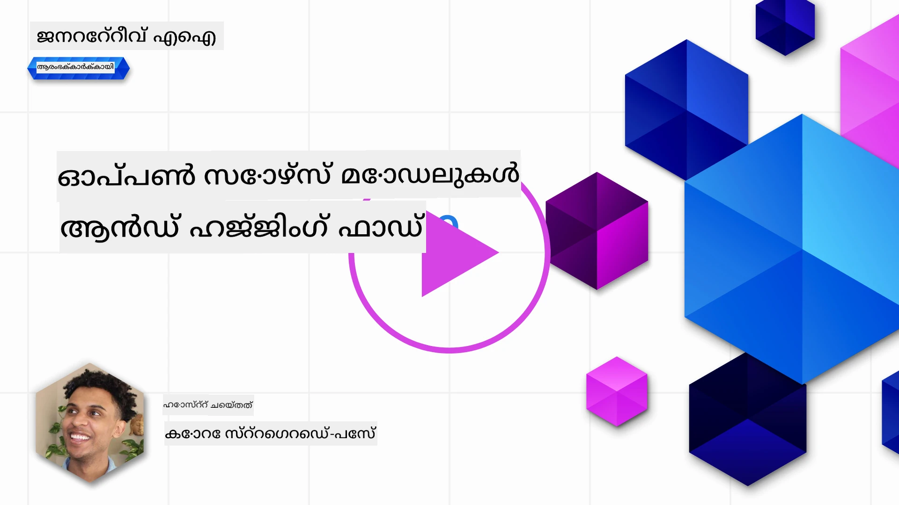
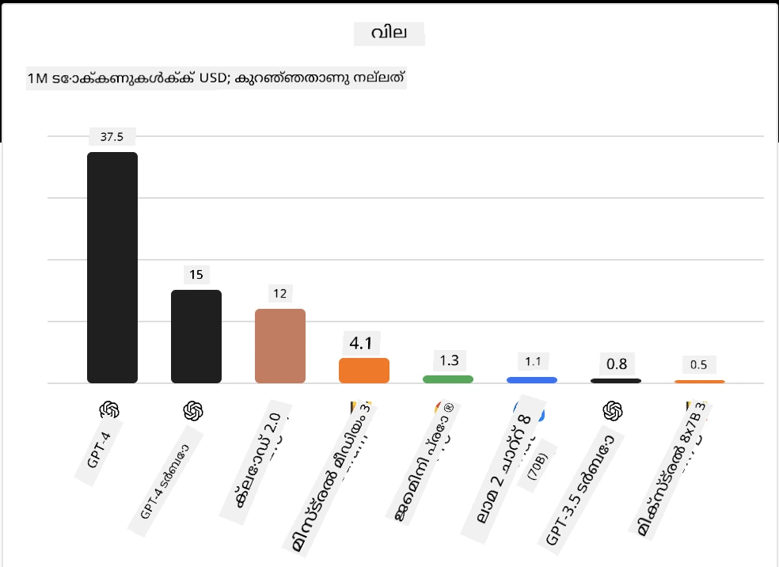
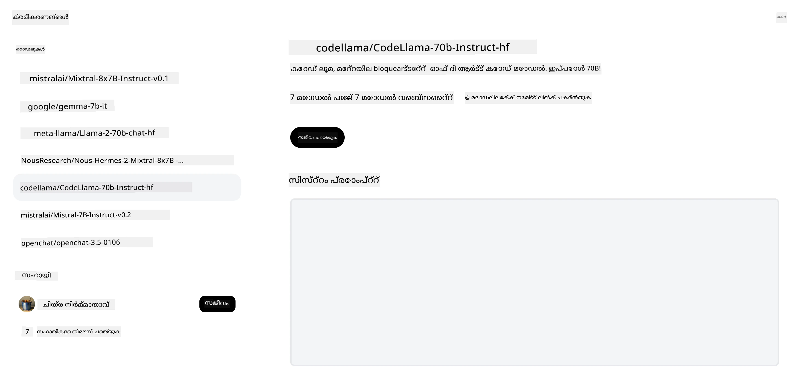
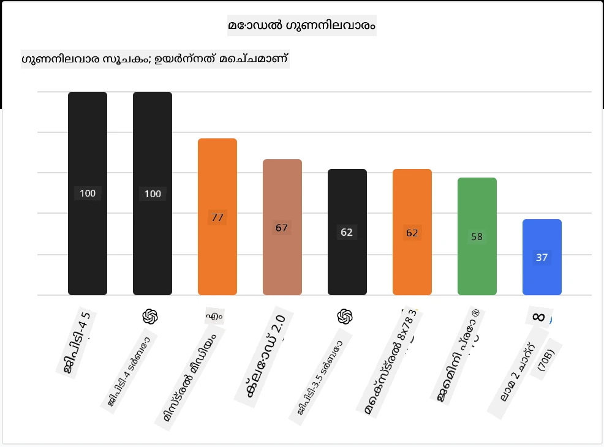

## പരിചയം

ഓപ്പൺ-സോഴ്‌സ് LLM-കളുടെ ലോകം रोमാഞ്ചകവും തുടർച്ചയായി വികസിക്കുകയും ചെയ്യുകയാണ്. ഈ പാഠത്തിന്റെ ലക്ഷ്യം ഓപ്പൺ സോഴ്‌സ് മോഡലുകളുടെ ആഴത്തിലുള്ള അവലോകനം നൽകുന്നതിനാണ്. നിങ്ങൾ പ്രൊപ്രൈറ്ററി മോഡലുകൾ ഓപ്പൺ സോഴ്‌സ് മോഡലുകളുമായി എങ്ങനെ താരതമ്യം ചെയ്യുന്നു എന്ന് അറിയാൻ ആഗ്രഹിക്കുന്നുവെങ്കിൽ, ["Exploring and Comparing Different LLMs" പാഠത്തിന്](../02-exploring-and-comparing-different-llms/README.md?WT.mc_id=academic-105485-koreyst) പോകൂ. ഈ പാഠം ഫൈൻ-ട്യൂണിംഗും പ്രതിപാദിക്കും, പക്ഷേ കൂടുതൽ വിശദീകരണം ["Fine-Tuning LLMs" പാഠത്തിൽ](../18-fine-tuning/README.md?WT.mc_id=academic-105485-koreyst) കണ്ടെത്താനാകും.

## പഠന ലക്ഷ്യങ്ങൾ

- ഓപ്പൺ സോഴ്‌സ് മോഡലുകളുടെ ബോധം നേടുക
- ഓപ്പൺ സോഴ്‌സ് മോഡലുകൾ ഉപയോഗിക്കുന്നതിന്റെ പ്രയോജനം മനസ്സിലാക്കുക
- Hugging Face-യിലും Microsoft Foundry മോഡൽ കാറ്റലോഗിലും ലഭ്യമായ ഓപ്പൺ മോഡലുകൾ അന്വേഷിക്കുക

## ഓപ്പൺ സോഴ്‌സ് മോഡലുകൾ എന്തൊക്കെയാണ്?

ഓപ്പൺ സോഴ്‌സ് സോഫ്റ്റ്വെയർ വിവിധ മേഖലകളിൽ സാങ്കേതികവിദ്യയുടെ വികാസത്തിൽ സുപ്രധാന വഹിച്ചിട്ടുണ്ട്. ഓപ്പൺ സോഴ്‌സ് ഇൻീഷിയേറ്റീവ് (OSI) [10 മാനദണ്ഡങ്ങൾ സോഫ്റ്റ്വെയറിനായി](https://web.archive.org/web/20241126001143/https://opensource.org/osd?WT.mc_id=academic-105485-koreyst) നിർവ്വചിച്ചിട്ടുണ്ട്, അവ ഓപ്പൺ സോഴ്‌സ് എന്ന നിലയിൽ തിരിച്ചറിയപ്പെടും. സോഴ്‌സ് കോഡ് OSI അംഗീകരിച്ച ലൈസൻസിനടിയിൽ തുറസ്സായി പങ്ക് വരണം.

LLM-കളുടെ വികസനം സോഫ്റ്റ്വെയർ വികസനത്തെപ്പോലെ തന്നെയിരിക്കുന്നുവെങ്കിലും, പ്രക്രിയ പൂർണ്ണമായും ഒരുപോലെയല്ല. ഇതു കൊണ്ട് LLM-കളുടെ സാന്ദർഭ്യത്തിൽ ഓപ്പൺ സോഴ്‌സ് എന്ന നിർവചനത്തെക്കുറിച്ച് സമുദായത്തിൽ ചർച്ചകൾ ഉയർന്നു. പാരമ്പര്യ ഓപ്പൺ സോഴ്‌സ് നിർവചനത്തിനു അനുസൃതമായി ഒരു മോഡൽ ഉണ്ടാകണമെങ്കിൽ താഴെപ്പറയുന്ന വിവരങ്ങൾ പൊതുവെ ലഭ്യമായിരിക്കണം:

- മോഡൽ പരിശീലിപ്പിക്കാൻ ഉപയോഗിച്ച ഡാറ്റാസെറ്റുകൾ
- പരിശീലനത്തിന്റെ ഭാഗമായ മുഴുവൻ മോഡൽ വെയിറ്റുകൾ
- മൂല്യനിർണ്ണയ കോഡ്
- ഫൈൻ-ട്യൂണിംഗ് കോഡ്
- മുഴുവൻ മോഡൽ വെയിറ്റുകളും പരിശീലന മെട്രിക്ക്സും

ഈ മാനദണ്ഡം പാലിക്കുന്ന മോഡലുകൾ ഇന്നുൾപ്പിൽ വളരെ കുറവേ ഉള്ളു. [Allen Institute for Artificial Intelligence (AllenAI) സൃഷ്ടിച്ച OLMo മോഡൽ](https://huggingface.co/allenai/OLMo-7B?WT.mc_id=academic-105485-koreyst) ഇതിൽ ഒന്നാണ്.

ഈ പാഠത്തിൽ, ഈ മോഡലുകൾ "ഓപ്പൺ മോഡലുകൾ" എന്ന് പറയുകയും ചെയ്യുന്നതാണ്, കാരണം എഴുതിയപ്പോൾ വേണ്ട മാനദണ്ഡങ്ങൾക്കൊല്ലും അവർ പൊരുത്തപ്പെടാതെ പോകാമായിരിക്കും.

## ഓപ്പൺ മോഡലുകളുടെ പ്രയോജനങ്ങൾ

**അത്യന്തം ഇഷ്ടാനുസൃതമാക്കാവുന്നതാണ്** - ഓപ്പൺ മോഡലുകൾ വിശദമായ പരിശീലന വിവരങ്ങളോടുകൂടി പുറത്തുവിട്ടിരിക്കുന്നതിനാൽ ഗവേഷകർ, ഡെവലപ്പർമാർ മോഡലിന്റെ അകത്തളങ്ങൾ മാറ്റി ക്രമീകരിക്കാനാവും. ഇത് പ്രത്യേക പ്രവർത്തനത്തിൻറെ അല്ലെങ്കിൽ പഠന മേഖലയ്ക്കായി ഫൈൻ-ട്യൂൺ ചെയ്ത സുപ്രധാന മോഡലുകൾ സൃഷ്ടിക്കാൻ സഹായിക്കുന്നു. ഉദാഹരണങ്ങൾ: കോഡ് ജനറേഷൻ, കണക്കു പ്രവർത്തനങ്ങൾ, ജൈവശാസ്ത്രം എന്നിവ.

**ചെലവ്** - ഈ മോഡലുകൾ ഉപയോഗിക്കുകയും വിന്യാസപ്പെടുത്തുകയും ചെയ്യുന്നതിന് ടോക്കൺ അടിസ്ഥാനത്തിൽ ചെലവ് പ്രൊപ്രൈറ്ററി മോഡലുകളേക്കാൾ കുറവാണ്. ജനറേറ്റീവ് AI അപ്ലിക്കേഷനുകൾ നിർമിക്കുമ്പോൾ, നിങ്ങളുടെ ഉപയോഗ സാഹചര്യത്തിൽ മോഡലുകളുടെ പ്രകടനം സാക്ഷ്യപ്പെടുത്തുമ്പോൾ ചെലവിനെയും പരിഗണിക്കാൻ ശ്രദ്ധിക്കണം.

ഉറവിടം: Artificial Analysis

**സൗകര്യം** - ഓപ്പൺ മോഡലുകളുമായി പ്രവർത്തിക്കുന്നത് വിവിധ മോഡലുകൾ ഉപയോഗിക്കാനും അവ സംയോജിപ്പിക്കാനും സൗകര്യം നൽകുന്നു. ഉദാഹരണമായി [HuggingChat Assistants](https://huggingface.co/chat?WT.mc_id=academic-105485-koreyst) കാണാം, ഇവിടെ ഉപയോക്താവിന് UI-യിൽ നേരിട്ട് ഉപയോഗിക്കപ്പെടുന്ന മോഡൽ തിരഞ്ഞെടുക്കാനാകും:

## വ്യത്യസ്ത ഓപ്പൻ മോഡലുകൾ അന്വേഷിക്കുക

### ല്ലാമ 2

[Llama2](https://huggingface.co/meta-llama?WT.mc_id=academic-105485-koreyst), മെടാ വികസിപ്പിച്ച ഓപ്പൺ മോഡലാണ്, ഇത് സംഭാഷണ ആധാരിത അപ്ലിക്കേഷനുകൾക്ക് എളുപ്പത്തിൽ അനുയോജ്യമാണ്. വലിയ സംഭാഷണയും മനുഷ്യ പ്രതികരണവും ഉൾപ്പെടുത്തിയ ഫൈൻ-ട്യൂണിംഗ് രീതിയുടെ കാരണത്താൽ ഇത് സാധ്യമായി. ഈ രീതിയിലൂടെ മോഡൽ മനുഷ്യ പ്രതീക്ഷയോട് യോജിച്ച ഫലങ്ങൾ തയാറാക്കുന്നു, ഉപയോക്തൃ അനുഭവം മെച്ചപ്പെടുത്തുന്നു.

ല്ലാമയുടെ ഫൈൻ-ട്യൂൺ ചെയ്ത ചില ഉദാഹരണങ്ങൾ: [ജാപ്പനീസ് ല്ലാമ](https://huggingface.co/elyza/ELYZA-japanese-Llama-2-7b?WT.mc_id=academic-105485-koreyst), ഇത് ജാപ്പനീസ് ഭാഷയിൽ പ്രത്യേകതയുള്ളതും, [Llama Pro](https://huggingface.co/TencentARC/LLaMA-Pro-8B?WT.mc_id=academic-105485-koreyst), അടിസ്ഥാന മോഡലിന്റെ മെച്ചപ്പെടുത്തിയ പതിപ്പുമാണ്.

### മിസ്ട്രൽ

[Mistral](https://huggingface.co/mistralai?WT.mc_id=academic-105485-koreyst) ഉയർന്ന പ്രകടനത്തിലും ശേഷത്തിലും സാന്ദർഭ്യമുള്ള ഒരു ഓപ്പൺ മോഡലാണ്. ഇത് Mixture-of-Experts സമീപനം ഉപയോഗിക്കുന്നു, ഇതിൽ വിദഗ്ധ മോഡലുകളുടെ ഒരു സംഘം ഒന്നിലേറെ സിസ്റ്റമായി ചേർന്നു, ഇൻപുട്ടിനെ ആശ്രയിച്ച് ചില പ്രത്യേക മോഡലുകൾ തിരഞ്ഞെടുക്കപ്പെടുന്നു. ഇത് കണക്കുകൂട്ടൽ കൂടുതൽ ഫലപ്രദമാക്കുന്നു, കാരണം മോഡലുകൾ അതിൻറെ വിദഗ്ധതയുള്ള ഇൻപുട്ടുകൾക്ക് മാത്രം പ്രതികരിക്കുന്നു.

മിസ്ട്രലിന്റെ ഫൈൻ-ട്യൂൺ ചെയ്ത മാതൃകകൾ: [BioMistral](https://huggingface.co/BioMistral/BioMistral-7B?text=Mon+nom+est+Thomas+et+mon+principal?WT.mc_id=academic-105485-koreyst), മെഡിക്കൽ മേഖലയ്ക്കായി ലക്ഷ്യമിട്ടത്, [OpenMath Mistral](https://huggingface.co/nvidia/OpenMath-Mistral-7B-v0.1-hf?WT.mc_id=academic-105485-koreyst), ഗണിത കണക്കുകൂട്ടൽ നടത്തുന്നു.

### ഫാൽക്കൺ

[Falcon](https://huggingface.co/tiiuae?WT.mc_id=academic-105485-koreyst) ടെക്നോളജി ഇന്നൊവേഷൻ ഇൻസ്റ്റിറ്റ്യൂട്ട് (**TII**) വികസിപ്പിച്ച LLM ആണ്. Falcon-40B 40 ബില്യൺ പാരാമീറ്ററുകളിൽ പരിശീലിപ്പിച്ചിട്ടുണ്ട്, കുറവ് കംപ്യൂട്ട് ബഡ്ജറ്റിൽ GPT-3-നെക്കാൾ മികച്ച പ്രകടനം കാണിക്കുന്നു. FlashAttention ആൽഗോരിതം, മൾട്ടിക്വറി അറ്റൻഷൻ ഉപയോഗിച്ച് പെരുമാറ്റ സമയം കുറക്കാൻ ഇത് കഴിവുണ്ട്. ഇതുകൊണ്ട് Falcon-40B സംഭാഷണ അപ്ലിക്കേഷനുകൾക്കു അനുയോജ്യമാണ്.

ഫാൽക്കണിന്റെ ഫൈൻ-ട്യൂൺ ചെയ്ത ചില മാതൃകകൾ: തുറന്ന മോഡലുകളിലുടെ നിർമ്മിച്ച [OpenAssistant](https://huggingface.co/OpenAssistant/falcon-40b-sft-top1-560?WT.mc_id=academic-105485-koreyst), [GPT4ALL](https://huggingface.co/nomic-ai/gpt4all-falcon?WT.mc_id=academic-105485-koreyst) അടിസ്ഥാന മോഡലിനെക്കാൾ ഉയർന്ന പ്രകടനം നൽകുന്നത്.

## എങ്ങനെ തിരഞ്ഞെടുക്കണം

ഓപ്പൺ മോഡൽ തിരഞ്ഞെടുക്കുന്നതിന് ഒരൊറ്റ ഉത്തരം ഇല്ല. നല്ല തുടക്കം Microsoft Foundry മോഡൽ കാറ്റലോഗിന്റെ ടാസ്ക് ഫിൽട്ടർ ഉപയോഗിച്ച് തുടങ്ങുന്നത് ആണ്. ഇത് മോഡൽ പരിശീലിപ്പിച്ച പ്രവർത്തനങ്ങളറിയാൻ സഹായിക്കും. Hugging Face-യും ചില മാനദണ്ഡങ്ങൾ അടിസ്ഥാനമാക്കി മികച്ച പ്രകടനം കാണിക്കുന്ന മോഡലുകളുടെ LLM ലീഡർബോർഡ് സൂക്ഷിക്കുന്നു.

വ്യത്യസ്ത തരത്തിലുള്ള LLM-കളെ താരതമ്യം ചെയ്യുമ്പോൾ, [Artificial Analysis](https://artificialanalysis.ai/?WT.mc_id=academic-105485-koreyst) മറ്റൊരു നല്ല വിഭവമാണ്:

ഉറവിടം: Artificial Analysis

ഒരു പ്രത്യേക ഉപയോഗകേസ് പ്രവർത്തിക്കുമ്പോൾ, സമാനമായ മേഖലയിലേയ്ക്ക് фine-tuned പതിപ്പുകൾ തേടുന്നത് ഫലപ്രദമായിരിക്കും. നിങ്ങളുടെ കഴിവിനെയും ഉപയോക്താക്കളുടെ പ്രതീക്ഷകളെയും അടിസ്ഥാനമാക്കി ഒന്നിലധികം ഓപ്പൺ മോഡലുകൾ പരീക്ഷിക്കുക നന്നായ ടെക്നീക്കാണ്.

## അടുത്തിട്ടുള്ള ഘട്ടങ്ങൾ

ഓപ്പൺ മോഡലുകളുടെ മികച്ച വശം, ഇവയിൽ ത്വരിതമായി പ്രവർത്തനം ആരംഭിക്കാമെന്നതാണ്. ഈ പാഠത്തിൽ പറഞ്ഞ മോഡലുകൾ അടങ്ങിയ പ്രത്യേക Hugging Face ശേഖരം ഉൾപ്പെടുന്ന [Microsoft Foundry model catalog](https://ai.azure.com?WT.mc_id=academic-105485-koreyst) പരിശോധിക്കുക.

## പഠനം ഇതിലൊരുവേള അവസാനിക്കുന്നില്ല, യാത്ര തുടരുക

ഈ പാഠം പൂർത്തിയാക്കിയതിനു ശേഷം, നിങ്ങളുടെ Generative AI അറിവ് ഉയർത്താൻ [Generative AI Learning collection](https://aka.ms/genai-collection?WT.mc_id=academic-105485-koreyst) സന്ദർശിക്കുക!

---

<!-- CO-OP TRANSLATOR DISCLAIMER START -->
**അറിയിപ്പ്**:
ഈ രേഖ AI പരിഭാഷാ സേവനം [Co-op Translator](https://github.com/Azure/co-op-translator) ഉപയോഗിച്ച് പരിഭാഷപ്പെടുത്തിയതാണ്. ഞങ്ങൾ കൃത്യതയ്ക്കായി ശ്രമിക്കുന്നുവെങ്കിലും, ഓട്ടോമേറ്റഡ് പരിഭാഷകളിൽ പിഴവുകൾ അല്ലെങ്കിൽ തെറ്റായ വിവരങ്ങൾ ഉണ്ടാകാൻ സാധ്യതയുണ്ട്. അതിന്റെ സ്വാഭാവിക ഭാഷയിലുള്ള അസൽ രേഖയാണ് പ്രാമാണികമായ ഉറവിടമായി പരിഗണിക്കേണ്ടത്. നിർണായകമായ വിവരങ്ങൾക്ക്, പ്രൊഫഷണൽ മനുഷ്യ പരിഭാഷ ശുപാർശ ചെയ്യുന്നു. ഈ പരിഭാഷ ഉപയോഗിച്ച് ഉണ്ടാകുന്ന തെറ്റിദ്ധാരണകൾ അല്ലെങ്കിൽ തെറ്റായ വ്യാഖ്യാനങ്ങൾക്കായി ഞങ്ങൾ ഉത്തരവാദികളല്ല.
<!-- CO-OP TRANSLATOR DISCLAIMER END -->