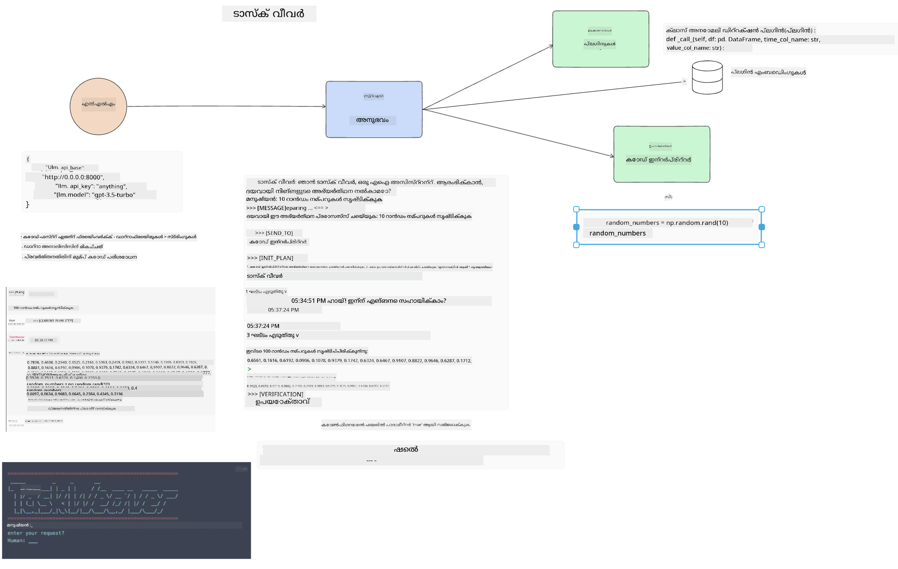

<!--
CO_OP_TRANSLATOR_METADATA:
{
  "original_hash": "8e8d1f6a63da606af7176a87ff8e92b6",
  "translation_date": "2025-12-19T19:59:52+00:00",
  "source_file": "17-ai-agents/README.md",
  "language_code": "ml"
}
-->
[](https://youtu.be/yAXVW-lUINc?si=bOtW9nL6jc3XJgOM)

## പരിചയം

AI ഏജന്റുകൾ ജനറേറ്റീവ് AI-യിലെ ഒരു രസകരമായ വികസനമാണ്, വലിയ ഭാഷാ മോഡലുകൾ (LLMs) അസിസ്റ്റന്റുകളിൽ നിന്ന് പ്രവർത്തനങ്ങൾ കൈകാര്യം ചെയ്യാൻ കഴിയുന്ന ഏജന്റുകളായി മാറാൻ സഹായിക്കുന്നു. AI ഏജന്റ് ഫ്രെയിംവർക്കുകൾ ഡെവലപ്പർമാർക്ക് LLM-കൾക്ക് ടൂളുകളും സ്റ്റേറ്റ് മാനേജ്മെന്റും ലഭ്യമാക്കുന്ന അപ്ലിക്കേഷനുകൾ സൃഷ്ടിക്കാൻ സഹായിക്കുന്നു. ഈ ഫ്രെയിംവർക്കുകൾ ദൃശ്യതയും മെച്ചപ്പെടുത്തുന്നു, ഉപയോക്താക്കളും ഡെവലപ്പർമാരും LLM-കൾ പദ്ധതിയിടുന്ന പ്രവർത്തനങ്ങൾ നിരീക്ഷിക്കാൻ കഴിയും, അതിലൂടെ അനുഭവ മാനേജ്മെന്റ് മെച്ചപ്പെടുത്തുന്നു.

ഈ പാഠം താഴെ പറയുന്ന മേഖലകൾ ഉൾക്കൊള്ളും:

- AI ഏജന്റ് എന്താണെന്ന് മനസ്സിലാക്കുക - AI ഏജന്റ് എന്താണ്?
- നാല് വ്യത്യസ്ത AI ഏജന്റ് ഫ്രെയിംവർക്കുകൾ പരിശോധിക്കുക - അവയെ പ്രത്യേകമാക്കുന്നത് എന്താണ്?
- ഈ AI ഏജന്റുകൾ വിവിധ ഉപയോഗ കേസുകളിൽ പ്രയോഗിക്കുക - എപ്പോൾ AI ഏജന്റുകൾ ഉപയോഗിക്കണം?

## പഠന ലക്ഷ്യങ്ങൾ

ഈ പാഠം കഴിഞ്ഞാൽ, നിങ്ങൾക്ക് കഴിയും:

- AI ഏജന്റുകൾ എന്താണെന്നും അവ എങ്ങനെ ഉപയോഗിക്കാമെന്നും വിശദീകരിക്കുക.
- ചില പ്രശസ്ത AI ഏജന്റ് ഫ്രെയിംവർക്കുകൾ തമ്മിലുള്ള വ്യത്യാസങ്ങൾ മനസ്സിലാക്കുക.
- AI ഏജന്റുകൾ എങ്ങനെ പ്രവർത്തിക്കുന്നുവെന്ന് മനസ്സിലാക്കി അവ ഉപയോഗിച്ച് അപ്ലിക്കേഷനുകൾ നിർമ്മിക്കുക.

## AI ഏജന്റുകൾ എന്താണ്?

AI ഏജന്റുകൾ ജനറേറ്റീവ് AI ലോകത്ത് വളരെ രസകരമായ ഒരു മേഖലയാണ്. ഈ ആവേശത്തോടൊപ്പം ചിലപ്പോൾ പദങ്ങൾക്കും അവയുടെ പ്രയോഗത്തിനും ആശയക്കുഴപ്പം ഉണ്ടാകാറുണ്ട്. സാധാരണയായി AI ഏജന്റുകൾക്ക് പരാമർശിക്കുന്ന പല ടൂളുകളും ഉൾക്കൊള്ളുന്ന ഒരു ലളിതമായ നിർവചനമായി ഞങ്ങൾ താഴെ പറയുന്നത് ഉപയോഗിക്കും:

AI ഏജന്റുകൾ വലിയ ഭാഷാ മോഡലുകൾ (LLMs) **സ്റ്റേറ്റ്**ക്കും **ടൂളുകൾ**ക്കും ആക്‌സസ് നൽകിക്കൊണ്ട് പ്രവർത്തനങ്ങൾ നിർവഹിക്കാൻ അനുവദിക്കുന്നു.


ഈ പദങ്ങൾ നിർവചിക്കാം:

**വലിയ ഭാഷാ മോഡലുകൾ** - ഈ കോഴ്സിൽ പരാമർശിക്കുന്ന മോഡലുകൾ, ഉദാഹരണത്തിന് GPT-3.5, GPT-4, Llama-2 എന്നിവ.

**സ്റ്റേറ്റ്** - LLM പ്രവർത്തിക്കുന്ന സാന്ദർഭം. LLM അതിന്റെ മുൻ പ്രവർത്തനങ്ങളുടെ സാന്ദർഭവും നിലവിലെ സാന്ദർഭവും ഉപയോഗിച്ച് അടുത്ത പ്രവർത്തനങ്ങൾ തീരുമാനിക്കുന്നു. AI ഏജന്റ് ഫ്രെയിംവർക്കുകൾ ഡെവലപ്പർമാർക്ക് ഈ സാന്ദർഭം എളുപ്പത്തിൽ കൈകാര്യം ചെയ്യാൻ സഹായിക്കുന്നു.

**ടൂളുകൾ** - ഉപയോക്താവ് അഭ്യർത്ഥിച്ച പ്രവർത്തനം LLM പദ്ധതിയിടുമ്പോൾ പൂർത്തിയാക്കാൻ LLM-ക്ക് ടൂളുകൾ ആക്‌സസ് വേണം. ഉദാഹരണത്തിന് ഡാറ്റാബേസ്, API, ബാഹ്യ അപ്ലിക്കേഷൻ അല്ലെങ്കിൽ മറ്റൊരു LLM!

ഈ നിർവചനങ്ങൾ നിങ്ങൾക്ക് മുന്നോട്ട് പോകാൻ നല്ല അടിസ്ഥാനമാകും. ഇപ്പോൾ ചില വ്യത്യസ്ത AI ഏജന്റ് ഫ്രെയിംവർക്കുകൾ പരിശോധിക്കാം:

## LangChain ഏജന്റുകൾ

[LangChain ഏജന്റുകൾ](https://python.langchain.com/docs/how_to/#agents?WT.mc_id=academic-105485-koreyst) മുകളിൽ നൽകിയ നിർവചനങ്ങളുടെ ഒരു നടപ്പാക്കലാണ്.

**സ്റ്റേറ്റ്** കൈകാര്യം ചെയ്യാൻ, ഇത് `AgentExecutor` എന്ന ബിൽറ്റ്-ഇൻ ഫംഗ്ഷൻ ഉപയോഗിക്കുന്നു. ഇത് നിർവചിച്ച `agent`-നും ലഭ്യമായ `tools`-നും സ്വീകരിക്കുന്നു.

`Agent Executor` ചാറ്റ് ചരിത്രം സൂക്ഷിച്ച് ചാറ്റിന്റെ സാന്ദർഭം നൽകുന്നു.


LangChain ഒരു [ടൂൾ കാറ്റലോഗ്](https://integrations.langchain.com/tools?WT.mc_id=academic-105485-koreyst) നൽകുന്നു, ഇത് നിങ്ങളുടെ അപ്ലിക്കേഷനിലേക്ക് ഇറക്കുമതി ചെയ്ത് LLM-കൾക്ക് ആക്‌സസ് നൽകാം. ഇവ കമ്മ്യൂണിറ്റിയും LangChain ടീമും നിർമ്മിച്ചവയാണ്.

നിങ്ങൾക്ക് ഈ ടൂളുകൾ നിർവചിച്ച് `Agent Executor`-ന് നൽകാം.

ദൃശ്യത AI ഏജന്റുകളെക്കുറിച്ച് സംസാരിക്കുമ്പോൾ മറ്റൊരു പ്രധാന ഘടകമാണ്. LLM ഏത് ടൂൾ ഉപയോഗിക്കുന്നു, എന്തുകൊണ്ടെന്ന് അപ്ലിക്കേഷൻ ഡെവലപ്പർമാർക്ക് മനസ്സിലാക്കേണ്ടത് അത്യന്താപേക്ഷിതമാണ്. അതിനായി LangChain ടീം LangSmith വികസിപ്പിച്ചിട്ടുണ്ട്.

## AutoGen

അടുത്ത AI ഏജന്റ് ഫ്രെയിംവർക്കാണ് [AutoGen](https://microsoft.github.io/autogen/?WT.mc_id=academic-105485-koreyst). AutoGen-ന്റെ പ്രധാന ശ്രദ്ധ സംഭാഷണങ്ങളിലാണ്. ഏജന്റുകൾ **സംഭാഷണയോഗ്യവും** **അനുകൂല്യപ്രദവുമാണ്**.

**സംഭാഷണയോഗ്യമായത്** - LLM-കൾ മറ്റൊരു LLM-യുമായി സംഭാഷണം ആരംഭിച്ച് തുടരാൻ കഴിയും, ഒരു പ്രവർത്തനം പൂർത്തിയാക്കാൻ. ഇത് `AssistantAgents` സൃഷ്ടിച്ച് അവയ്ക്ക് പ്രത്യേക സിസ്റ്റം സന്ദേശം നൽകിയാണ് ചെയ്യുന്നത്.

```python

autogen.AssistantAgent( name="Coder", llm_config=llm_config, ) pm = autogen.AssistantAgent( name="Product_manager", system_message="Creative in software product ideas.", llm_config=llm_config, )

```

**അനുകൂല്യപ്രദം** - ഏജന്റുകൾ LLM-കളായി മാത്രമല്ല, ഉപയോക്താവോ ടൂളോ ആയി നിർവചിക്കാം. ഡെവലപ്പറായി, നിങ്ങൾ `UserProxyAgent` നിർവചിക്കാം, ഇത് ഉപയോക്താവുമായി പ്രതികരണം കൈകാര്യം ചെയ്യുന്നു. ഈ പ്രതികരണം പ്രവർത്തനം തുടരാനോ നിർത്താനോ സഹായിക്കും.

```python
user_proxy = UserProxyAgent(name="user_proxy")
```

### സ്റ്റേറ്റ് & ടൂളുകൾ

സ്റ്റേറ്റ് മാറ്റാനും കൈകാര്യം ചെയ്യാനും, അസിസ്റ്റന്റ് ഏജന്റ് Python കോഡ് സൃഷ്ടിച്ച് പ്രവർത്തനം പൂർത്തിയാക്കുന്നു.

പ്രക്രിയയുടെ ഉദാഹരണം:


#### സിസ്റ്റം സന്ദേശത്തോടെ LLM നിർവചനം

```python
system_message="For weather related tasks, only use the functions you have been provided with. Reply TERMINATE when the task is done."
```

ഈ സിസ്റ്റം സന്ദേശം ഈ പ്രത്യേക LLM-ന് ഏത് ഫംഗ്ഷനുകൾ പ്രസക്തമാണെന്ന് നിർദ്ദേശിക്കുന്നു. AutoGen-ൽ നിങ്ങൾക്ക് വ്യത്യസ്ത സിസ്റ്റം സന്ദേശങ്ങളുള്ള AssistantAgents പലതും നിർവചിക്കാം.

#### ഉപയോക്താവ് ചാറ്റ് ആരംഭിക്കുന്നു

```python
user_proxy.initiate_chat( chatbot, message="I am planning a trip to NYC next week, can you help me pick out what to wear? ", )

```

ഉപയോക്താവ്_proxy (മനുഷ്യൻ) നൽകുന്ന ഈ സന്ദേശം ഏജന്റ് പ്രവർത്തനങ്ങൾ പരിശോധിക്കാൻ ആരംഭിക്കും.

#### ഫംഗ്ഷൻ പ്രവർത്തിപ്പിക്കുന്നു

```bash
chatbot (to user_proxy):

***** Suggested tool Call: get_weather ***** Arguments: {"location":"New York City, NY","time_periond:"7","temperature_unit":"Celsius"} ******************************************************** --------------------------------------------------------------------------------

>>>>>>>> EXECUTING FUNCTION get_weather... user_proxy (to chatbot): ***** Response from calling function "get_weather" ***** 112.22727272727272 EUR ****************************************************************

```

ആദ്യ ചാറ്റ് പ്രോസസ്സ് ചെയ്ത ശേഷം, ഏജന്റ് നിർദ്ദേശിച്ച ടൂൾ വിളിക്കും. ഈ ഉദാഹരണത്തിൽ `get_weather` എന്ന ഫംഗ്ഷനാണ്. നിങ്ങളുടെ ക്രമീകരണപ്രകാരം, ഈ ഫംഗ്ഷൻ സ്വയം പ്രവർത്തിപ്പിക്കപ്പെടാം അല്ലെങ്കിൽ ഉപയോക്തൃ ഇൻപുട്ട് അടിസ്ഥാനമാക്കി പ്രവർത്തിപ്പിക്കാം.

കൂടുതൽ പഠിക്കാൻ [AutoGen കോഡ് സാമ്പിളുകൾ](https://microsoft.github.io/autogen/docs/Examples/?WT.mc_id=academic-105485-koreyst) കാണാം.

## Taskweaver

അടുത്ത ഏജന്റ് ഫ്രെയിംവർക്കാണ് [Taskweaver](https://microsoft.github.io/TaskWeaver/?WT.mc_id=academic-105485-koreyst). ഇത് "കോഡ്-ഫസ്റ്റ്" ഏജന്റ് എന്നറിയപ്പെടുന്നു, കാരണം ഇത് `strings`-നൊപ്പം പൈത്തൺ DataFrames-ഉം കൈകാര്യം ചെയ്യുന്നു. ഇത് ഡാറ്റാ വിശകലനത്തിനും ജനറേഷനും വളരെ ഉപകാരപ്രദമാണ്. ഉദാഹരണത്തിന് ഗ്രാഫുകളും ചാർട്ടുകളും സൃഷ്ടിക്കലും, യാദൃച്ഛിക സംഖ്യകൾ സൃഷ്ടിക്കലും.

### സ്റ്റേറ്റ് & ടൂളുകൾ

സംഭാഷണത്തിന്റെ സ്റ്റേറ്റ് കൈകാര്യം ചെയ്യാൻ TaskWeaver `Planner` എന്ന ആശയം ഉപയോഗിക്കുന്നു. `Planner` ഒരു LLM ആണ്, ഉപയോക്താക്കളുടെ അഭ്യർത്ഥന സ്വീകരിച്ച് പൂർത്തിയാക്കേണ്ട പ്രവർത്തനങ്ങൾ നിശ്ചയിക്കുന്നു.

പ്രവർത്തനങ്ങൾ പൂർത്തിയാക്കാൻ `Planner`-ന് `Plugins` എന്ന ടൂൾസിന്റെ ശേഖരം ലഭ്യമാണ്. ഇത് Python ക്ലാസ്സുകളോ പൊതുവായ കോഡ് ഇന്റർപ്രിറ്ററോ ആയിരിക്കും. ഈ പ്ലഗിനുകൾ എമ്പെഡിംഗുകളായി സൂക്ഷിക്കപ്പെടുന്നു, അതിലൂടെ LLM ശരിയായ പ്ലഗിൻ കണ്ടെത്താൻ സഹായിക്കുന്നു.



അനോമലി ഡിറ്റക്ഷൻ കൈകാര്യം ചെയ്യുന്ന പ്ലഗിൻ ഉദാഹരണം:

```python
class AnomalyDetectionPlugin(Plugin): def __call__(self, df: pd.DataFrame, time_col_name: str, value_col_name: str):
```

കോഡ് പ്രവർത്തിപ്പിക്കുന്നതിന് മുമ്പ് പരിശോധിക്കുന്നു. Taskweaver-ൽ മറ്റൊരു സവിശേഷതയാണ് `experience`. ഇത് YAML ഫയലിൽ സംഭാഷണത്തിന്റെ സാന്ദർഭം ദീർഘകാലം സൂക്ഷിക്കുന്നു. ഇത് ക്രമീകരിച്ച് LLM മുൻ സംഭാഷണങ്ങൾ അടിസ്ഥാനമാക്കി ചില പ്രവർത്തനങ്ങളിൽ മെച്ചപ്പെടാൻ കഴിയും.

## JARVIS

അവസാന ഏജന്റ് ഫ്രെയിംവർക്കാണ് [JARVIS](https://github.com/microsoft/JARVIS?tab=readme-ov-file?WT.mc_id=academic-105485-koreyst). JARVIS-ന്റെ പ്രത്യേകത LLM സംഭാഷണത്തിന്റെ `സ്റ്റേറ്റ്` കൈകാര്യം ചെയ്യുകയും `ടൂളുകൾ` മറ്റ് AI മോഡലുകളായിരിക്കുകയും ചെയ്യുന്നു. ഓരോ AI മോഡലും പ്രത്യേക പ്രവർത്തനങ്ങൾ നിർവഹിക്കുന്ന പ്രത്യേക മോഡലുകളാണ്, ഉദാഹരണത്തിന് ഒബ്ജക്റ്റ് ഡിറ്റക്ഷൻ, ട്രാൻസ്ക്രിപ്ഷൻ, ഇമേജ് ക്യാപ്ഷനിംഗ്.


LLM, ഒരു പൊതുവായ മോഡലായി, ഉപയോക്താവിന്റെ അഭ്യർത്ഥന സ്വീകരിച്ച് പ്രത്യേക പ്രവർത്തനം തിരിച്ചറിയുകയും പൂർത്തിയാക്കാൻ ആവശ്യമായ ഡാറ്റ/ആർഗ്യുമെന്റുകൾ കണ്ടെത്തുകയും ചെയ്യുന്നു.

```python
[{"task": "object-detection", "id": 0, "dep": [-1], "args": {"image": "e1.jpg" }}]
```

LLM പിന്നീട് അഭ്യർത്ഥന പ്രത്യേക AI മോഡൽ വ്യാഖ്യാനിക്കാൻ കഴിയുന്ന രീതിയിൽ ഫോർമാറ്റ് ചെയ്യുന്നു, ഉദാഹരണത്തിന് JSON. AI മോഡൽ പ്രവചനം നൽകുമ്പോൾ LLM പ്രതികരണം സ്വീകരിക്കുന്നു.

പ്രവൃത്തി പൂർത്തിയാക്കാൻ പല മോഡലുകളും ആവശ്യമായാൽ, അവയുടെ പ്രതികരണങ്ങളും വ്യാഖ്യാനിച്ച് ഉപയോക്താവിന് മറുപടി നൽകാൻ ഒരുമിപ്പിക്കും.

താഴെ കാണുന്ന ഉദാഹരണം ഒരു ഉപയോക്താവ് ചിത്രത്തിലെ വസ്തുക്കളുടെ വിവരണം, എണ്ണം ചോദിക്കുമ്പോൾ എങ്ങനെ പ്രവർത്തിക്കും എന്ന് കാണിക്കുന്നു:

## അസൈൻമെന്റ്

AI ഏജന്റുകളെക്കുറിച്ച് പഠനം തുടരാൻ AutoGen ഉപയോഗിച്ച് നിർമ്മിക്കാം:

- ഒരു വിദ്യാഭ്യാസ സ്റ്റാർട്ടപ്പിന്റെ വിവിധ വകുപ്പുകളുമായി ബിസിനസ് മീറ്റിംഗ് സിമുലേറ്റ് ചെയ്യുന്ന അപ്ലിക്കേഷൻ.
- LLM-കൾക്ക് വ്യത്യസ്ത വ്യക്തിത്വങ്ങളും മുൻഗണനകളും മനസ്സിലാക്കാൻ സഹായിക്കുന്ന സിസ്റ്റം സന്ദേശങ്ങൾ സൃഷ്ടിക്കുക, ഉപയോക്താവിന് പുതിയ ഉൽപ്പന്ന ആശയം അവതരിപ്പിക്കാൻ സഹായിക്കുക.
- LLM പിന്നീട് ഓരോ വകുപ്പിൽ നിന്നുമുള്ള പിന്തുടരുന്ന ചോദ്യങ്ങൾ സൃഷ്ടിച്ച് ആശയം മെച്ചപ്പെടുത്തുകയും ഉൽപ്പന്ന ആശയം മെച്ചപ്പെടുത്തുകയും ചെയ്യണം.

## പഠനം ഇവിടെ അവസാനിക്കുന്നില്ല, യാത്ര തുടരുക

ഈ പാഠം പൂർത്തിയാക്കിയ ശേഷം, ഞങ്ങളുടെ [ജനറേറ്റീവ് AI പഠന ശേഖരം](https://aka.ms/genai-collection?WT.mc_id=academic-105485-koreyst) പരിശോധിച്ച് നിങ്ങളുടെ ജനറേറ്റീവ് AI അറിവ് ഉയർത്തുക!

---

<!-- CO-OP TRANSLATOR DISCLAIMER START -->
**അസൂയാപത്രം**:  
ഈ രേഖ AI വിവർത്തന സേവനം [Co-op Translator](https://github.com/Azure/co-op-translator) ഉപയോഗിച്ച് വിവർത്തനം ചെയ്തതാണ്. നാം കൃത്യതയ്ക്ക് ശ്രമിച്ചിട്ടുണ്ടെങ്കിലും, സ്വയം പ്രവർത്തിക്കുന്ന വിവർത്തനങ്ങളിൽ പിശകുകൾ അല്ലെങ്കിൽ തെറ്റുകൾ ഉണ്ടാകാമെന്ന് ദയവായി ശ്രദ്ധിക്കുക. അതിന്റെ മാതൃഭാഷയിലുള്ള യഥാർത്ഥ രേഖ അധികാരപരമായ ഉറവിടമായി കണക്കാക്കപ്പെടണം. നിർണായക വിവരങ്ങൾക്ക്, പ്രൊഫഷണൽ മനുഷ്യ വിവർത്തനം ശുപാർശ ചെയ്യപ്പെടുന്നു. ഈ വിവർത്തനം ഉപയോഗിക്കുന്നതിൽ നിന്നുണ്ടാകുന്ന ഏതെങ്കിലും തെറ്റിദ്ധാരണകൾക്കോ വ്യാഖ്യാനക്കേടുകൾക്കോ ഞങ്ങൾ ഉത്തരവാദികളല്ല.
<!-- CO-OP TRANSLATOR DISCLAIMER END -->