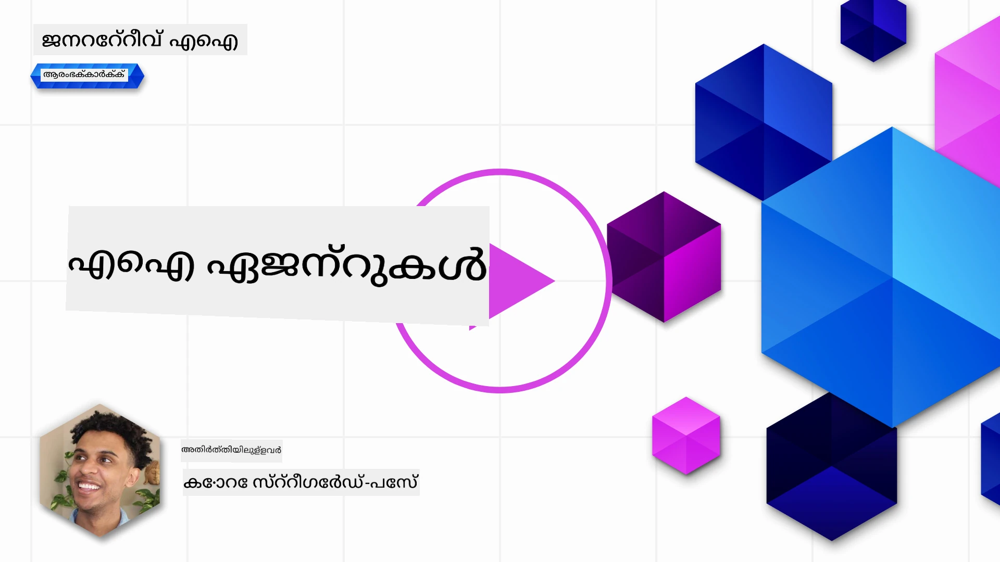
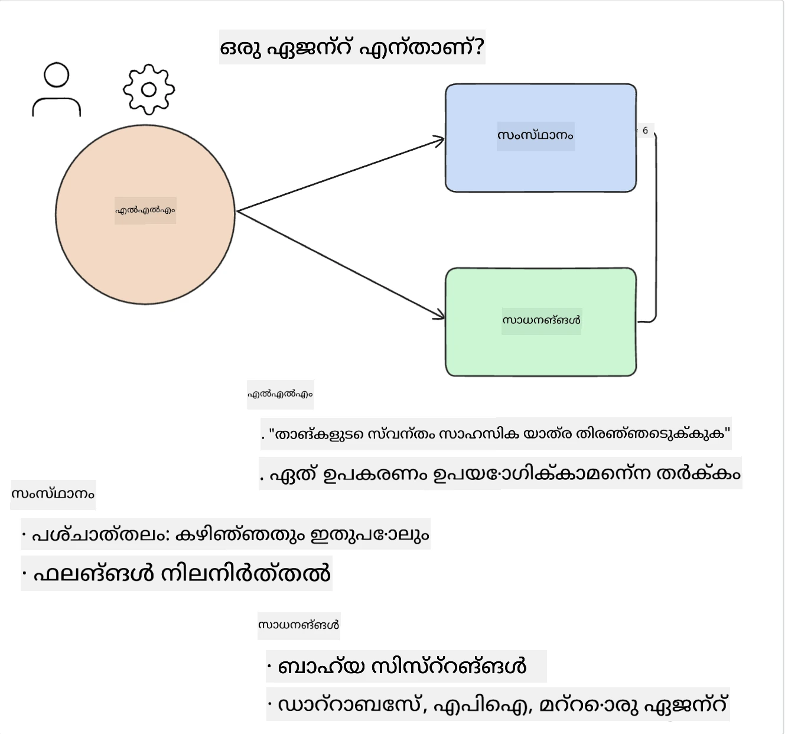
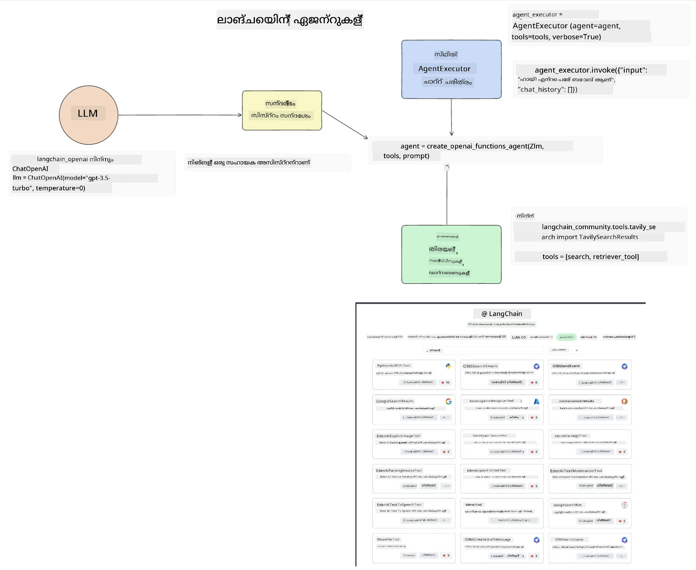
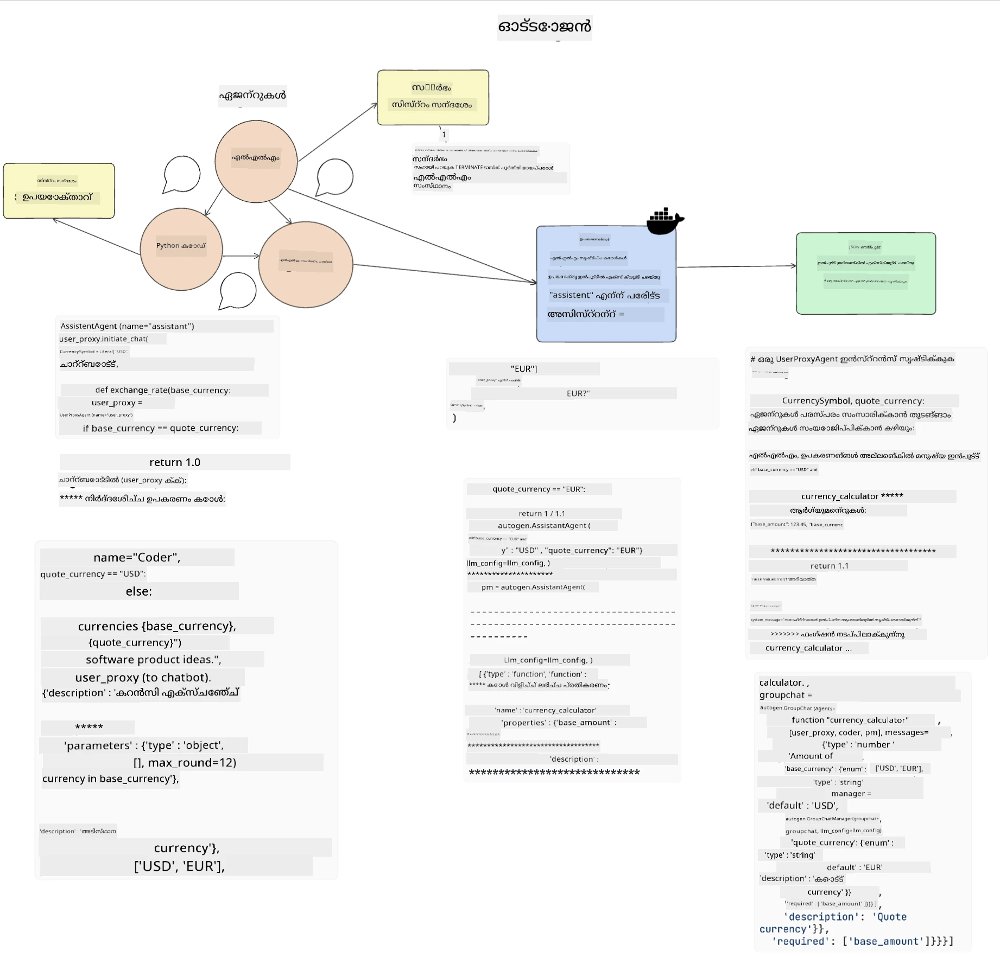
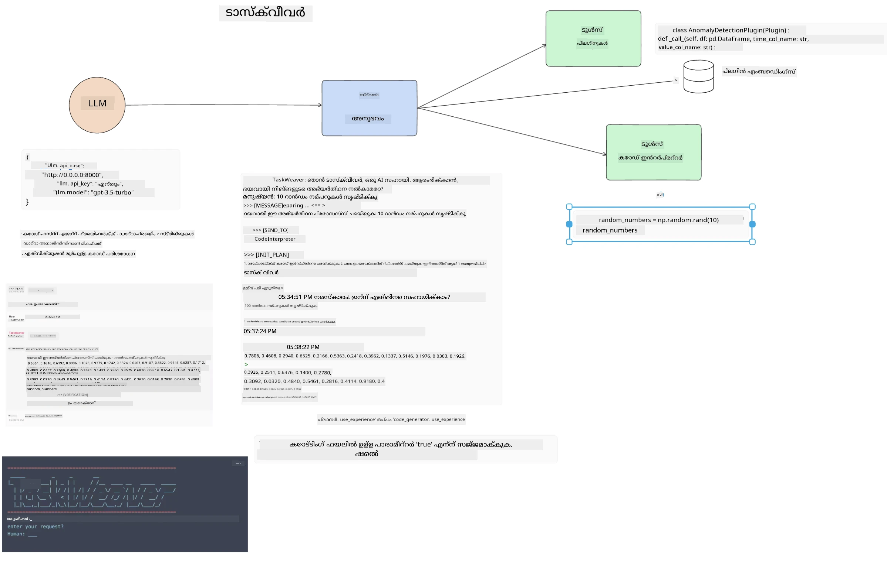
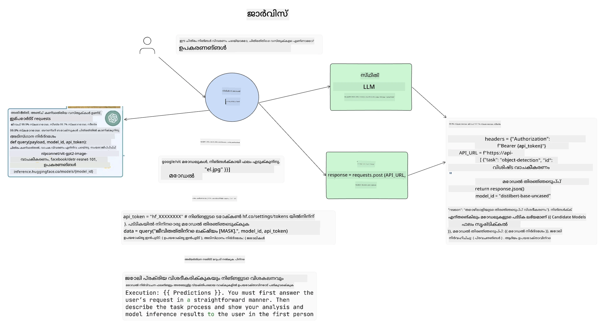

[](https://youtu.be/yAXVW-lUINc?si=bOtW9nL6jc3XJgOM)

## പരിചയം

AI ഏജന്റുമാർ ജനറേറ്റീവ് AIയിലെ ഒരു രസകരമായ വികസനം പ്രതിനിധീകരിക്കുന്നു, വലിയ ഭാഷാ മോഡലുകൾ (LLMs) അസിസ്റ്റന്റുകളിൽ നിന്ന് പ്രവർത്തനങ്ങൾ സ്വീകരിക്കാൻ ശേഷിയുള്ള ഏജന്റുകളായി മാറുന്നതിന് സഹായിക്കുന്നു. AI ഏജന്റ് ഫ്രെയിംവർക്കുകൾ ഡെവലപ്പർമാർക്ക് LLM-കൾക്ക് ടൂളുകളും സ്റ്റേറ്റ് മാനേജുമെൻറും നൽകുന്ന അപ്ലിക്കേഷനുകൾ സൃഷ്ടിക്കാൻ ഇട നൽകുന്നു. ഈ ഫ്രെയിംവർക്കുകൾ ഉപയോഗിച്ച് LLM-കൾ ആസൂത്രണം ചെയ്ത പ്രവർത്തനങ്ങൾ ഉപയോക്താക്കളും ഡെവലപ്പർമാർക്കും നിരീക്ഷിക്കാൻ പ്രാപ്തിയുണ്ടാക്കി, അനുഭവ മാനേജുമെന്റും മെച്ചപ്പെടുത്തുന്നു.

പाठം താഴെപ്പറയുന്ന മേഖലകൾ ഉൾക്കൊള്ളും:

- AI ഏജന്റ് എന്താണെന്ന് മനസ്സിലാക്കുക - AI ഏജന്റ് എന്താണ് നിഷ്കർഷണം?
- നാല് വ്യത്യസ്ത AI ഏജന്റ് ഫ്രെയിംവർക്കുകൾ അന്വേഷിക്കുക - ഇവയെന്തുകൊണ്ട് പ്രത്യേകമാണ്?
- വ്യത്യസ്ത ഉപയോഗ കേസുകളിൽ ഈ AI ഏജന്റ്‍ുകൾ പ്രാവർത്തികമാക്കുക - എപ്പോൾ AI ഏജന്റ്‍കൾ ഉപയോഗിക്കണം?

## പഠന ലക്ഷ്യങ്ങൾ

ഈ പാഠം പൂർത്തിയാക്കിയശേഷം, നിങ്ങൾക്ക് കഴിയും:

- AI ഏജന്റുമാർ എന്താണ് എന്നും അവ എങ്ങനെ ഉപയോഗിക്കാമെന്നും വിശദീകരിക്കുക.
- ചില പ്രശസ്ത AI ഏജന്റ് ഫ്രെയിംവർക്കുകളെക്കുറിച്ചുള്ള ഭിന്നതകൾ മനസ്സിലാക്കുക.
- AI ഏജന്റുകളുടെ പ്രവർത്തനം മനസ്സിലാക്കി അവ ഉപയോഗിച്ച് അപ്ലിക്കേഷനുകൾ നിർമ്മിക്കുക.

## AI ഏജന്റുമാർ എന്താണ്?

AI ഏജന്റുമാർ ജനറേറ്റീവ് AI-യുടെ ലോകത്ത് വളരെ രസകരമായ ഒരു മേഖലയാണ്. ഈ ആവേശത്തോടൊപ്പം ചിലപ്പോൾ പദങ്ങളും അവയുടെ പ്രയോഗവും സംബന്ധിച്ച ആശയക്കുഴപ്പം ഉണ്ടാകാറുണ്ട്. സാങ്കേതികമായും കൂടുതലും AI ഏജന്റുകളായി പരാമർശിക്കുന്ന ഉപകരണങ്ങളിലധികം ഉൾപ്പെടുത്തുന്നതായി ഈ നിർവചനത്തിൽ നാം ഉപയോഗിക്കും:

AI ഏജന്റ്‌കൾ വലിയ ഭാഷാ മോഡലുകൾക്ക് (LLMs) **സ്റ്റേറ്റ്**യും **ടൂളുകളും** നല്കി പ്രവർത്തനങ്ങൾ ചെയ്യാൻ അനുവദിക്കുന്നു.



ഈ പദങ്ങൾ വ്യാഖ്യാനിക്കാം:

**വലിയ ഭാഷാ മോഡലുകൾ** - ഈ കോഴ്സിൽ പരാമർശിക്കുന്ന മോഡലുകൾ, ഉദാഹരണത്തിന് GPT-3.5, GPT-4, Llama-2 മുതലായവ.

**സ്റ്റേറ്റ്** - LLM പ്രവർത്തിക്കുന്ന സാന്ദർഭ്യത്തെ ഇത് സൂചിപ്പിക്കുന്നു. LLM പൂർവ്വ പ്രവർത്തനങ്ങളുടെ സാന്ദർഭ്യവും നിലവിലെ സാന്ദർഭ്യവും ഉപയോഗിച്ച് തുടര്‍ നടപടികളുടെ തീരുമാനമെടുക്കുന്നു. AI ഏജന്റ് ഫ്രെയിംവർക്കുകൾ ഡെവലപ്പർമാർക്കു ഈ സാന്ദർഭ്യം സൂക്ഷിക്കാൻ സഹായിക്കുന്നു.

**ടൂളുകൾ** - ഉപയോക്താവ് അഭ്യർത്ഥിച്ചും LLM ആസൂത്രണം ചെയ്ത പ്രവർത്തനം പൂർത്തിയാക്കാൻ LLM-യ്ക്ക് ടൂളുകൾ ആവശ്യമുണ്ട്. ഉദാഹരണങ്ങൾ: ഡാറ്റാബേസ്, API, പുറംലോകാപ്ലിക്കേഷൻ, അല്ലെങ്കിൽ മറ്റൊരു LLM.

ഈ നിർവചനങ്ങൾ എങ്ങനെ ഇവ പ്രയോഗിക്കപ്പെടുന്നുവെന്നു മനസ്സിലാക്കാൻ ഒരു അടിസ്ഥാനാകാരം നൽകുമെന്നാണ് പ്രതീക്ഷ. വിവിധ AI ഏജന്റ് ഫ്രെയിംവർക്കുകൾ പരിശോധിക്കാം:

## LangChain ഏജന്റ്‍ുകൾ

[LangChain ഏജന്റ്‍ുകൾ](https://python.langchain.com/docs/how_to/#agents?WT.mc_id=academic-105485-koreyst) മുകളിലുള്ള നിർവചനങ്ങൾ നടപ്പിലാക്കുന്നതാണിത്.

**സ്റ്റേറ്റ്** നിയന്ത്രിക്കാൻ, `AgentExecutor` എന്ന ബിൽറ്റ്-ഇൻ ഫംഗ്ഷൻ ഉപയോഗിക്കുന്നു. ഇത് നിർവചിച്ച `agent`നും അതിനു ലഭ്യമായ `tools`നും സ്വീകരിക്കുന്നു.

`AgentExecutor` ചാറ്റ് ചരിത്രം സൂക്ഷിച്ച് ചാറ്റിന്റെ സാന്ദർഭ്യം നൽകുന്നു.



LangChain [ടൂളുകളുടെ കാറ്റലോഗ്](https://integrations.langchain.com/tools?WT.mc_id=academic-105485-koreyst) നൽകുന്നു, ഇതിൽ നിന്നു LLM ടൂളുകളിലേക്കു പ്രവേശനം ലഭിക്കും. ഇവ കമ്മ്യൂണിറ്റിയും LangChain ടീമും നിർമ്മിച്ചവയാണ്.

LM ക്ക് ടൂളുകൾ നിർവചിച്ച് `AgentExecutor`-ലേക്ക് അയയ്ക്കാം.

AI ഏജന്റുകളെക്കുറിച്ച് സംസാരിക്കുമ്പോൾ ദൃശ്യമായിരിക്കാം എന്നത് വളരെ പ്രധാനമാണ്. ഏത് ടൂളാണ് LLM ഉപയോഗിക്കുന്നത്, എന്തുകൊണ്ട് എന്നവ ഡെവലപ്പർമാർക്കു മനസ്സിലാകാൻ LangChain ടീം LangSmith വികസിപ്പിച്ചിട്ടുണ്ട്.

## AutoGen

അടുത്ത AI ഏജന്റ് ഫ്രെയിംവർക്കായ [AutoGen](https://microsoft.github.io/autogen/?WT.mc_id=academic-105485-koreyst) നാം പരിശോധിക്കാം. AutoGen-ന്റെ പ്രധാന ധ്യാനം സംഭാഷണമാണ്. ഏജന്റുമാർ **സംഭാഷണക്ഷമരും** ** acordo നുയയോഗിക്കരീതിയിലുള്ളവരുമാണ്**.

**സംഭാഷണക്ഷമ -** LLM-കൾ മറ്റൊരു LLM-യുമായി സംഭാഷണം ആരംഭിച്ച് തുടരാനും ആവശ്യമായ പ്രവർത്തനം പൂർത്തിയാക്കാനുമായി സംസാരിക്കാനും കഴിയും. ഇത് `AssistantAgents` സൃഷ്ടിച്ച് ഒരു പ്രത്യേക സിസ്റ്റം സന്ദേശം നൽകിയാണ് നടക്കുന്നത്.

```python

autogen.AssistantAgent( name="Coder", llm_config=llm_config, ) pm = autogen.AssistantAgent( name="Product_manager", system_message="Creative in software product ideas.", llm_config=llm_config, )

```

** acordo നുയയോഗിക്കക്വായറ -** ഏജന്റുമാർ LLM മാത്രമല്ല ഉപയോക്താവോ ടൂളോ ആയി നിർവചിക്കാം. ഡെവലപ്പറായി ഒരു `UserProxyAgent` നിർവചിച്ച് ഉപയോക്താവിന്റെ പ്രതികരണം സ്വീകരിച്ചുകൊണ്ട് പ്രവർത്തനം പൂർത്തിയാക്കുന്നതിന് സഹായിക്കാം. പ്രതികരണം പ്രവർത്തനത്തിന്റെ തുടർച്ച അല്ലെങ്കിൽ തതായി നിർത്തലാക്കാൻ കാരണമാകും.

```python
user_proxy = UserProxyAgent(name="user_proxy")
```

### സ്റ്റേറ്റ് മാനേജുമെന്റ് & ടൂളുകൾ

സ്റ്റേറ്റ് മാറ്റാനും നിയന്ത്രിക്കാനും അസിസ്റ്റന്റ് ഏജന്റ് പാലിക്കുന്ന പൈതൺ കോഡ് ജനറേറ്റ് ചെയ്യുന്നു.

പ്രക്രിയയുടെ ഒരു ഉദാഹരണം ഇങ്ങനെ:



#### സിസ്റ്റം സന്ദേശം ഉപയോഗിച്ച് LLM നിർവചനം

```python
system_message="For weather related tasks, only use the functions you have been provided with. Reply TERMINATE when the task is done."
```

ഈ സിസ്റ്റം സന്ദേശം ഈ പ്രത്യേക LLM-ന് വേണ്ടി ഏത് ഫംഗ്ഷനുകൾ ആവശ്യമാണ് എന്ന് അറിയിക്കുന്നു. AutoGen-ൽ വ്യത്യസ്ത സിസ്റ്റം സന്ദേശങ്ങളുള്ള ഒന്നിലധികം AssistantAgents നിർവചിക്കാം.

#### ഉപയോക്താവ് നൽകിയ സന്ദേശം ആരംഭിക്കുക

```python
user_proxy.initiate_chat( chatbot, message="I am planning a trip to NYC next week, can you help me pick out what to wear? ", )

```

user_proxy (മനുഷ്യൻ) നിൽ നിന്നുള്ള ഈ സന്ദേശം ഏജന്റ് പ്രതിപാദിക്കേണ്ട സാധ്യതാപൂർണമായ ഫംഗ്ഷനുകൾ പരിശോധിക്കുന്ന പ്രക്രിയ ആരംഭിക്കും.

#### ഫംഗ്ഷൻ നടപ്പാക്കൽ

```bash
chatbot (to user_proxy):

***** Suggested tool Call: get_weather ***** Arguments: {"location":"New York City, NY","time_periond:"7","temperature_unit":"Celsius"} ******************************************************** --------------------------------------------------------------------------------

>>>>>>>> EXECUTING FUNCTION get_weather... user_proxy (to chatbot): ***** Response from calling function "get_weather" ***** 112.22727272727272 EUR ****************************************************************

```

ആരംഭിക ചാറ്റ് പൂർത്തിയായപ്പോൾ, ഏജന്റ് നിർദ്ദേശിച്ച ടൂൾ വിളിക്കാൻ ഫംഗ്ഷൻ `get_weather` ആണ്. നിങ്ങളുടെ ക്രമീകരണാനുസൃതമായി ഈ ഫംഗ്ഷൻ സ്വയം നടപ്പാക്കപ്പെടാൻ അല്ലെങ്കിൽ ഉപയോക്തൃ ഇൻപുട്ടിൽ അടിസ്ഥാനമാക്കി നടപ്പാക്കാൻ കഴിയും.

ഇനിയും സ്റ്റാർട്ട് ചെയ്യാൻ [AutoGen കോഡ് സാമ്പിൾസിന്റെ പട്ടിക](https://microsoft.github.io/autogen/docs/Examples/?WT.mc_id=academic-105485-koreyst) കാണാം.

## Taskweaver

പിന്നീട് നോക്കേണ്ട AI ഏജന്റ് ഫ്രെയിംവർക്ക് [Taskweaver](https://microsoft.github.io/TaskWeaver/?WT.mc_id=academic-105485-koreyst) ആണ്. ഇത് "കോഡ്-ഫസ്റ്റ്" ഏജന്റായി അറിയപ്പെടുന്നു, കാരണം ഇത് `strings`-നൊപ്പം പൈതൺ DataFrames-ഉം കൈകാര്യം ചെയ്യുന്നു. ഈ പ്രവർത്തി ഡാറ്റ അനാലിസീസ്, ജനറേഷനു സഹായകമാണ്. ഉദാഹരണങ്ങൾ: ഗ്രാഫുകൾ, ചാർട്ടുകൾ സൃഷ്ടിക്കൽ, അനിശ്ചിത സംഖ്യകൾ സൃഷ്ടിക്കൽ.

### സ്റ്റേറ്റ് മാനേജുമെന്റ് & ടൂളുകൾ

TaskWeaver സംഭാഷണത്തിന്റെ സ്റ്റേറ്റ് നിയന്ത്രിക്കാൻ `Planner` എന്ന LLM ഉം ഉപയോഗിക്കുന്നു. ഉപയോക്താക്കളുടെ അഭ്യർത്ഥന സ്വീകരിച്ച് പൂർത്തിയാക്കേണ്ട ടാസ്കുകളും രേഖപ്പെടുത്തുന്നു.

ടാസ്കുകൾ പൂർത്തിയാക്കാൻ `Planner`-ന് ലഭിക്കുവാൻ `Plugins` എന്ന ടൂൾസെറ്റ് ഉപയോഗിക്കുന്നു. പൈതൺ ക്ലാസ്സുകൾ അല്ലെങ്കിൽ പൊതുവായ കോഡ് ഇന്റർപ്രിറ്റർ ആയിരിക്കും. പ്ലഗിനുകൾ എൻബെഡ്ഡിംഗ്സായി സൂക്ഷിക്കുന്നതിനാൽ LLM കൃത്യമായ പ്ലഗിൻ തെരയാം.



അക്രമ കണ്ടെത്തലിന് ഒരു പ്ലഗിൻ ഉദാഹരണം:

```python
class AnomalyDetectionPlugin(Plugin): def __call__(self, df: pd.DataFrame, time_col_name: str, value_col_name: str):
```

കോഡ് നടപ്പിലാക്കുന്നതിനു മുൻപു പരിശോധിക്കുന്നു. Taskweaver-ൽ മറ്റൊരു സവിശേഷതയാണ് `experience` എന്നത്. നാൾക്കാലത്തേക്ക് സംഭാഷണത്തിന്റെ സാന്ദർഭ്യം YAML ഫയലിൽ സൂക്ഷിക്കാൻ ഇത് ഉപയോഗിക്കുന്നു. ഇതിന്റെ സഹായത്തോടെ മുൻ സംഭാഷണങ്ങൾ കാണിച്ച് LLM ചില ടാസ്കുകളിലുള്ള പ്രവർത്തനം മെച്ചപ്പെടുത്തുന്നു.

## JARVIS

കൂടുതൽ പരിശോധിക്കാനുള്ള അവസാന AI ഏജന്റ് ഫ്രെയിംവർക്ക് [JARVIS](https://github.com/microsoft/JARVIS?tab=readme-ov-file&WT.mc_id=academic-105485-koreyst) ആണ്. JARVIS വിചിത്രമായതു LLM സംഭാഷണത്തിന്റെ `സ്റ്റേറ്റ്` നിയന്ത്രിക്കുന്നതും, `ടൂളുകൾ` ആയി മറ്റ് AI മോഡലുകൾ ഉപയോഗിക്കുന്നതുമാണ്. ഓരോ AI മോഡലും പ്രത്യേക കാര്യങ്ങൾ ചെയ്യുന്നതിന് രൂപകല്പന ചെയ്തതാണ്, ഉദാഹരണത്തിന് ദൃശ്യങ്ങൾ തിരിച്ചറിയൽ, ട്രാൻസ്ക്രിപ്ഷൻ, ചിത്ര വിന്യാസം.



LLM സാധാരണ ഉദ്ദേശമുള്ള മോഡൽ ആയതിനാൽ ഉപയോക്താവിന്റെ അഭ്യർത്ഥന സ്വീകരിച്ച് നിർദ്ദിഷ്ട ടാസ്കും ആവശ്യമായ ഡാറ്റ/അർഗ്യുമെന്റുകളും തിരിച്ചറിയുന്നു.

```python
[{"task": "object-detection", "id": 0, "dep": [-1], "args": {"image": "e1.jpg" }}]
```

അതിനു ശേഷം AI മോഡല് JSON പോലെയുള്ള രൂപത്തിലാക്കി സന്ദേശം സ്വരൂപിക്കുന്നു. ടാസ്കിനു AI മോഡൽ സിദ്ധാന്തം നൽകിയ ശേഷം LLM പ്രസ്തുത ഫലങ്ങൾ സ്വീകരിക്കുന്നു.

ഒരുകിൽ ടാസ്കിന് പല മോഡലുകളും വേണ്ടെങ്കിൽ അവയുടെ ഫലങ്ങളും വ്യാഖ്യാനിച്ച് ഒരുമിച്ച് ഉപയോക്‌താവിന് നൽകിയ പ്രതികരണം സൃഷ്ടിക്കുന്നു.

ഉദാഹരണമായി, ഉപയോക്താവ് ചിത്രത്തിലെ വസ്തുക്കളുടെ വിവരണം, എണ്ണത്തിന്റെ അഭ്യർത്ഥന നൽകുമ്പോൾ ഈ സിസ്റ്റം എങ്ങനെ പ്രവർത്തിക്കും എന്നത് കാണിക്കുന്നു:

## അസൈൻമെന്റ്

AI ഏജന്റ്മാരെ AutoGen ഉപയോഗിച്ച് വികസിപ്പിച്ച് നിങ്ങളുടെ പഠനം തുടരുക:

- ഒരു വിദ്യാഭ്യാസ സ്റ്റാർട്ടപ്പിലെ വിവിധ വകുപ്പുകൾക്കൊപ്പം ഒരു ബിസിനസ് യോഗം അനുകരിക്കുന്ന അപ്ലിക്കേഷൻ.
- LLM-കൾക്ക് വ്യത്യസ്ത വ്യക്തിത്വങ്ങളും മുൻഗണനകളും മനസ്സിലാക്കാൻ സഹായിക്കുന്ന സിസ്റ്റം സന്ദേശങ്ങൾ സൃഷ്ടിക്കുക, ഉപയോക്താവിന് പുതിയ ഉൽപ്പന്ന ആശയം അവതരിക്കാനായി പ്രാപ്തമാക്കുക.
- LLM അതിനുശേഷം ഓരോ വകുപ്പിന്റെയും ഫോളോ-അപ്പ് ചോദ്യങ്ങൾ സൃഷ്ടിച്ച് പിച്ചിന്റെയും ഉൽപ്പന്ന ആശയത്തിന്റെ മെച്ചപ്പെടുത്തലുകൾ നിർവഹിക്കുക.

## പഠനം ഇവിടെ അവസാനിക്കുന്നില്ല, യാത്ര തുടരുക

ഈ പാഠം പൂർത്തിയാക്കിയ ശേഷം, നിങ്ങളുടെ ജനറേറ്റീവ് AI വിജ്ഞാനം മെച്ചപ്പെടുത്താൻ ഞങ്ങളുടെ [ജെനറേറ്റീവ് AI പഠന ശേഖരം](https://aka.ms/genai-collection?WT.mc_id=academic-105485-koreyst) കാണുക!

---

<!-- CO-OP TRANSLATOR DISCLAIMER START -->
**അസംബന്ധമായ നോട്ടം**:
ഈ രേഖ AI തർജ്ജമ സേവനമായ [കോ-ഓപ്പ് ട്രാൻസ്ലേറ്റർ](https://github.com/Azure/co-op-translator) ഉപയോഗിച്ച് തർജ്ജമ ചെയ്തതാണ്. ഞങ്ങൾ കൃത്യത കാൾപ്പിച്ചുകൊണ്ടിരിക്കുമ്പോഴും, സ്വയമേധയാ തർജ്ജമകളിൽ പിഴവുകൾ അല്ലെങ്കിൽ അസാധുതകൾ ഉണ്ടാകാവുന്നതാണ്. അതിനാൽ, ഉപയോഗിക്കപ്പെടേണ്ട ആസൽ ഭാഷയിലെ മLizquez്റെ രേഖയെ അധികാരപരമായ ഉറവിടമായി പരിഗണിക്കണം. പ്രധാന വിവരങ്ങൾക്കായി പ്രൊഫഷണൽ മനുഷ്യ തർജ്ജമ നിർദ്ദേശിക്കുന്നു. ഈ തർജ്ജമ ഉപയോഗത്തിൽ നിന്നുണ്ടാകുന്ന തെറ്റിദ്ധാരണകൾക്കും വ്യാഖ്യാനങ്ങൾക്കുമായി ഞങ്ങൾ ഉത്തരവാദിത്വം വഹിക്കുന്നില്ല.
<!-- CO-OP TRANSLATOR DISCLAIMER END -->