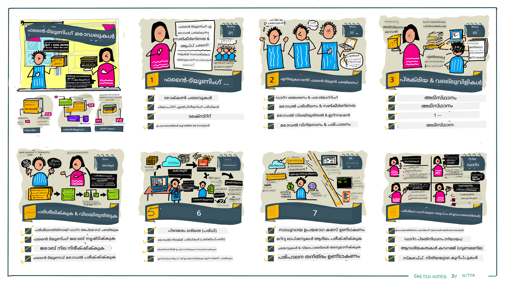

<!--
CO_OP_TRANSLATOR_METADATA:
{
  "original_hash": "807f0d9fc1747e796433534e1be6a98a",
  "translation_date": "2025-12-19T20:28:19+00:00",
  "source_file": "18-fine-tuning/README.md",
  "language_code": "ml"
}
-->

# നിങ്ങളുടെ LLM ഫൈൻ-ട്യൂണിംഗ്

ജനറേറ്റീവ് AI ആപ്ലിക്കേഷനുകൾ നിർമ്മിക്കാൻ വലിയ ഭാഷാ മോഡലുകൾ ഉപയോഗിക്കുന്നത് പുതിയ വെല്ലുവിളികളുമായി വരുന്നു. ഒരു പ്രധാന പ്രശ്നം മോഡൽ നൽകിയ ഉള്ളടക്കത്തിൽ (ഉത്തരം) ഗുണനിലവാരം (ശുദ്ധതയും പ്രസക്തിയും) ഉറപ്പാക്കലാണ്. മുമ്പത്തെ പാഠങ്ങളിൽ, നിലവിലുള്ള മോഡലിന് _പ്രോംപ്റ്റ് ഇൻപുട്ട്_ മാറ്റി പ്രശ്നം പരിഹരിക്കാൻ ശ്രമിക്കുന്ന പ്രോംപ്റ്റ് എഞ്ചിനീയറിംഗ്, റിട്രീവൽ-ഓഗ്മെന്റഡ് ജനറേഷൻ പോലുള്ള സാങ്കേതികവിദ്യകൾ ചർച്ച ചെയ്തു.

ഇന്നത്തെ പാഠത്തിൽ, **ഫൈൻ-ട്യൂണിംഗ്** എന്ന മൂന്നാമത്തെ സാങ്കേതികവിദ്യയെക്കുറിച്ച് സംസാരിക്കുന്നു, ഇത് _മോഡലിനെ തന്നെ അധിക ഡാറ്റ ഉപയോഗിച്ച് പുന:പരിശീലനം_ ചെയ്ത് വെല്ലുവിളി പരിഹരിക്കാൻ ശ്രമിക്കുന്നു. വിശദാംശങ്ങളിൽ നമുക്ക് കടക്കാം.

## പഠന ലക്ഷ്യങ്ങൾ

ഈ പാഠം മുൻകൂട്ടി പരിശീലിച്ച ഭാഷാ മോഡലുകൾക്ക് ഫൈൻ-ട്യൂണിംഗ് എന്ന ആശയം പരിചയപ്പെടുത്തുന്നു, ഈ സമീപനത്തിന്റെ ഗുണങ്ങളും വെല്ലുവിളികളും പരിശോധിക്കുന്നു, നിങ്ങളുടെ ജനറേറ്റീവ് AI മോഡലുകളുടെ പ്രകടനം മെച്ചപ്പെടുത്താൻ ഫൈൻ-ട്യൂണിംഗ് എപ്പോൾ എങ്ങനെ ഉപയോഗിക്കാമെന്ന് മാർഗ്ഗനിർദ്ദേശം നൽകുന്നു.

ഈ പാഠം അവസാനിക്കുമ്പോൾ, നിങ്ങൾക്ക് താഴെ പറയുന്ന ചോദ്യങ്ങൾക്ക് ഉത്തരം നൽകാൻ കഴിയണം:

- ഭാഷാ മോഡലുകൾക്ക് ഫൈൻ-ട്യൂണിംഗ് എന്താണ്?
- എപ്പോൾ, എന്തുകൊണ്ട് ഫൈൻ-ട്യൂണിംഗ് പ്രയോജനകരമാണ്?
- മുൻകൂട്ടി പരിശീലിച്ച മോഡൽ എങ്ങനെ ഫൈൻ-ട്യൂൺ ചെയ്യാം?
- ഫൈൻ-ട്യൂണിംഗിന്റെ പരിമിതികൾ എന്തെല്ലാം?

സജ്ജമാണോ? തുടങ്ങാം.

## ചിത്രീകരിച്ച ഗൈഡ്

നമുക്ക് കടക്കുന്നതിന് മുമ്പ് നാം എന്തെല്ലാം ഉൾക്കൊള്ളുമെന്ന് വലിയ ചിത്രം അറിയാൻ ആഗ്രഹിക്കുന്നുണ്ടോ? ഈ ചിത്രീകരിച്ച ഗൈഡ് പരിശോധിക്കുക, ഇത് ഫൈൻ-ട്യൂണിംഗിന്റെ അടിസ്ഥാന ആശയങ്ങളും പ്രേരണയും പഠിക്കുന്നതിൽ നിന്നു് പ്രക്രിയയും മികച്ച പ്രാക്ടീസുകളും മനസ്സിലാക്കുന്നതുവരെ പഠനയാത്രയെ വിവരിക്കുന്നു. ഇത് ഒരു ആകർഷകമായ വിഷയം ആകുന്നതിനാൽ, നിങ്ങളുടെ സ്വയം-നിർദ്ദേശ പഠനയാത്രയ്ക്ക് പിന്തുണ നൽകുന്ന അധിക ലിങ്കുകൾക്കായി [Resources](./RESOURCES.md?WT.mc_id=academic-105485-koreyst) പേജ് പരിശോധിക്കാൻ മറക്കരുത്!

## ഭാഷാ മോഡലുകൾക്ക് ഫൈൻ-ട്യൂണിംഗ് എന്താണ്?

നിർവചനപ്രകാരം, വലിയ ഭാഷാ മോഡലുകൾ ഇന്റർനെറ്റ് ഉൾപ്പെടെയുള്ള വൈവിധ്യമാർന്ന ഉറവിടങ്ങളിൽ നിന്നുള്ള വലിയ അളവിലുള്ള ടെക്സ്റ്റിൽ _മുൻകൂട്ടി പരിശീലനം_ ചെയ്യപ്പെട്ടവയാണ്. മുമ്പത്തെ പാഠങ്ങളിൽ പഠിച്ചതുപോലെ, ഉപയോക്താവിന്റെ ചോദ്യങ്ങൾക്ക് ("പ്രോംപ്റ്റുകൾ") മോഡലിന്റെ പ്രതികരണങ്ങളുടെ ഗുണനിലവാരം മെച്ചപ്പെടുത്താൻ _പ്രോംപ്റ്റ് എഞ്ചിനീയറിംഗ്_ , _റിട്രീവൽ-ഓഗ്മെന്റഡ് ജനറേഷൻ_ പോലുള്ള സാങ്കേതികവിദ്യകൾ ആവശ്യമാണ്.

ഒരു ജനപ്രിയ പ്രോംപ്റ്റ് എഞ്ചിനീയറിംഗ് സാങ്കേതികവിദ്യ മോഡലിന് പ്രതികരണത്തിൽ എന്ത് പ്രതീക്ഷിക്കാമെന്ന് കൂടുതൽ മാർഗ്ഗനിർദ്ദേശം നൽകുന്നതാണ്, അത് _നിർദ്ദേശങ്ങൾ_ (സ്പഷ്ട മാർഗ്ഗനിർദ്ദേശം) നൽകുകയോ _ചില ഉദാഹരണങ്ങൾ_ (അപ്രത്യക്ഷ മാർഗ്ഗനിർദ്ദേശം) നൽകുകയോ ചെയ്യുന്നു. ഇത് _ഫ്യൂ-ഷോട്ട് ലേണിംഗ്_ എന്നറിയപ്പെടുന്നു, പക്ഷേ ഇതിന് രണ്ട് പരിമിതികൾ ഉണ്ട്:

- മോഡൽ ടോക്കൺ പരിധികൾ നിങ്ങൾക്ക് നൽകാവുന്ന ഉദാഹരണങ്ങളുടെ എണ്ണം നിയന്ത്രിക്കുകയും ഫലപ്രാപ്തി കുറയ്ക്കുകയും ചെയ്യാം.
- മോഡൽ ടോക്കൺ ചെലവുകൾ ഓരോ പ്രോംപ്റ്റിനും ഉദാഹരണങ്ങൾ ചേർക്കുന്നത് ചെലവേറിയതാക്കുകയും സാന്ദ്രത കുറയ്ക്കുകയും ചെയ്യാം.

ഫൈൻ-ട്യൂണിംഗ് മെഷീൻ ലേണിംഗ് സിസ്റ്റങ്ങളിൽ സാധാരണ പ്രയോഗമാണ്, ഇവിടെ മുൻകൂട്ടി പരിശീലിച്ച മോഡൽ എടുത്ത് പുതിയ ഡാറ്റ ഉപയോഗിച്ച് പുന:പരിശീലനം നടത്തുന്നു, പ്രത്യേക ഒരു ടാസ്കിൽ പ്രകടനം മെച്ചപ്പെടുത്താൻ. ഭാഷാ മോഡലുകളുടെ സാഹചര്യത്തിൽ, നാം ഒരു പ്രത്യേക ടാസ്കിനോ ആപ്ലിക്കേഷൻ ഡൊമെയ്‌നിനോ വേണ്ടി മുൻകൂട്ടി പരിശീലിച്ച മോഡലിനെ _തിരഞ്ഞെടുത്ത ഉദാഹരണങ്ങളുടെ സെറ്റുമായി_ ഫൈൻ-ട്യൂൺ ചെയ്ത് ആ ടാസ്കിനോ ഡൊമെയ്‌നിനോ കൂടുതൽ കൃത്യവും പ്രസക്തവുമായ **കസ്റ്റം മോഡൽ** സൃഷ്ടിക്കാം. ഫൈൻ-ട്യൂണിംഗിന്റെ ഒരു ഉപകാരമാണ് ഫ്യൂ-ഷോട്ട് ലേണിംഗിന് ആവശ്യമായ ഉദാഹരണങ്ങളുടെ എണ്ണം കുറയ്ക്കുക - ടോക്കൺ ഉപയോഗവും ബന്ധപ്പെട്ട ചെലവുകളും കുറയ്ക്കുന്നു.

## എപ്പോൾ, എന്തുകൊണ്ട് മോഡലുകൾ ഫൈൻ-ട്യൂൺ ചെയ്യണം?

_ഈ_ സാഹചര്യത്തിൽ, ഫൈൻ-ട്യൂണിംഗ് എന്ന് പറയുമ്പോൾ, **മുൻകൂട്ടി പരിശീലന ഡാറ്റാസെറ്റിൽ ഉൾപ്പെടാത്ത പുതിയ ഡാറ്റ ചേർത്ത്** പുന:പരിശീലനം നടത്തുന്ന **സൂപ്പർവൈസ്ഡ്** ഫൈൻ-ട്യൂണിംഗ് ആണ് ഉദ്ദേശിക്കുന്നത്. ഇത്, മോഡൽ പുന:പരിശീലനം നടത്തുന്നത് യഥാർത്ഥ ഡാറ്റയിൽ, പക്ഷേ വ്യത്യസ്ത ഹൈപ്പർപാരാമീറ്ററുകളോടെ ചെയ്യുന്ന അൺസൂപ്പർവൈസ്ഡ് ഫൈൻ-ട്യൂണിംഗിൽ നിന്ന് വ്യത്യസ്തമാണ്.

മുൻഗണന നൽകേണ്ട പ്രധാന കാര്യം ഫൈൻ-ട്യൂണിംഗ് ഒരു പ്രഗത്ഭത ആവശ്യമായ സാങ്കേതിക വിദ്യയാണ്, ആവശ്യമായ ഫലങ്ങൾ നേടാൻ ഒരു നിശ്ചിത പരിജ്ഞാന നില ആവശ്യമാണ്. തെറ്റായി ചെയ്താൽ പ്രതീക്ഷിച്ച മെച്ചപ്പെടുത്തലുകൾ ലഭിക്കാതെ മോഡലിന്റെ പ്രകടനം കുറയാനും സാധ്യതയുണ്ട്.

അതിനാൽ, ഭാഷാ മോഡലുകൾ ഫൈൻ-ട്യൂൺ ചെയ്യുന്നത് "എങ്ങനെ" പഠിക്കുന്നതിന് മുമ്പ്, നിങ്ങൾ ഈ വഴി സ്വീകരിക്കേണ്ടത് "എന്തുകൊണ്ട്" ആണെന്ന്, ഫൈൻ-ട്യൂണിംഗ് പ്രക്രിയ "എപ്പോൾ" ആരംഭിക്കണമെന്ന് അറിയണം. ഈ ചോദ്യങ്ങൾ ചോദിച്ച് തുടങ്ങുക:

- **ഉപയോഗ കേസ്**: ഫൈൻ-ട്യൂണിംഗിന് നിങ്ങളുടെ _ഉപയോഗ കേസ്_ എന്താണ്? നിലവിലുള്ള മുൻകൂട്ടി പരിശീലിച്ച മോഡലിന്റെ ഏത് ഭാഗം മെച്ചപ്പെടുത്താൻ ആഗ്രഹിക്കുന്നു?
- **മാറ്റുവഴികൾ**: നിങ്ങൾ _മറ്റു സാങ്കേതികവിദ്യകൾ_ പരീക്ഷിച്ചിട്ടുണ്ടോ? അവ ഉപയോഗിച്ച് താരതമ്യത്തിനായി ഒരു അടിസ്ഥാനരേഖ സൃഷ്ടിക്കുക.
  - പ്രോംപ്റ്റ് എഞ്ചിനീയറിംഗ്: പ്രസക്തമായ പ്രോംപ്റ്റ് പ്രതികരണങ്ങളുടെ ഉദാഹരണങ്ങളോടെ ഫ്യൂ-ഷോട്ട് പ്രോംപ്റ്റിംഗ് പോലുള്ള സാങ്കേതികവിദ്യകൾ പരീക്ഷിക്കുക. പ്രതികരണങ്ങളുടെ ഗുണനിലവാരം വിലയിരുത്തുക.
  - റിട്രീവൽ ഓഗ്മെന്റഡ് ജനറേഷൻ: നിങ്ങളുടെ ഡാറ്റ തിരയൽ വഴി ലഭിച്ച ക്വറി ഫലങ്ങൾ പ്രോംപ്റ്റുകളിൽ ചേർക്കുക. പ്രതികരണങ്ങളുടെ ഗുണനിലവാരം വിലയിരുത്തുക.
- **ചെലവുകൾ**: ഫൈൻ-ട്യൂണിംഗിന്റെ ചെലവുകൾ തിരിച്ചറിയിച്ചിട്ടുണ്ടോ?
  - ട്യൂണബിലിറ്റി - മുൻകൂട്ടി പരിശീലിച്ച മോഡൽ ഫൈൻ-ട്യൂണിംഗിന് ലഭ്യമാണോ?
  - പരിശ്രമം - പരിശീലന ഡാറ്റ തയ്യാറാക്കൽ, മോഡൽ വിലയിരുത്തൽ & മെച്ചപ്പെടുത്തൽ.
  - കംപ്യൂട്ട് - ഫൈൻ-ട്യൂണിംഗ് ജോലികൾ നടത്താനും ഫൈൻ-ട്യൂൺ ചെയ്ത മോഡൽ വിന്യസിക്കാനും.
  - ഡാറ്റ - ഫൈൻ-ട്യൂണിംഗിന് ആവശ്യമായ ഗുണമേറിയ ഉദാഹരണങ്ങൾ ലഭ്യമാണോ?
- **ഗുണങ്ങൾ**: ഫൈൻ-ട്യൂണിംഗിന്റെ ഗുണങ്ങൾ സ്ഥിരീകരിച്ചിട്ടുണ്ടോ?
  - ഗുണനിലവാരം - ഫൈൻ-ട്യൂൺ ചെയ്ത മോഡൽ അടിസ്ഥാനരേഖയെക്കാൾ മെച്ചമാണോ?
  - ചെലവ് - പ്രോംപ്റ്റുകൾ ലളിതമാക്കുന്നതിലൂടെ ടോക്കൺ ഉപയോഗം കുറയ്ക്കുമോ?
  - വിപുലീകരണക്ഷമത - പുതിയ ഡൊമെയ്‌നുകൾക്കായി അടിസ്ഥാന മോഡൽ പുനർനിർമിക്കാൻ കഴിയുമോ?

ഈ ചോദ്യങ്ങൾക്ക് ഉത്തരം നൽകുമ്പോൾ, ഫൈൻ-ട്യൂണിംഗ് നിങ്ങളുടെ ഉപയോഗ കേസിന് ശരിയായ സമീപനമാണോ എന്ന് തീരുമാനിക്കാൻ കഴിയും. ഗുണങ്ങൾ ചെലവുകൾക്കു മുകളിൽ ആയിരിക്കണം എന്നതാണ് ഏറ്റവും നല്ലത്. തുടരുമെന്ന് തീരുമാനിച്ചാൽ, മുൻകൂട്ടി പരിശീലിച്ച മോഡൽ എങ്ങനെ ഫൈൻ-ട്യൂൺ ചെയ്യാമെന്ന് ആലോചിക്കാം.

നിർണ്ണയ പ്രക്രിയയെക്കുറിച്ച് കൂടുതൽ洞察ങ്ങൾക്കായി [To fine-tune or not to fine-tune](https://www.youtube.com/watch?v=0Jo-z-MFxJs) കാണുക.

## മുൻകൂട്ടി പരിശീലിച്ച മോഡൽ എങ്ങനെ ഫൈൻ-ട്യൂൺ ചെയ്യാം?

മുൻകൂട്ടി പരിശീലിച്ച മോഡൽ ഫൈൻ-ട്യൂൺ ചെയ്യാൻ, നിങ്ങൾക്ക് ആവശ്യമാണ്:

- ഫൈൻ-ട്യൂൺ ചെയ്യാനുള്ള മുൻകൂട്ടി പരിശീലിച്ച മോഡൽ
- ഫൈൻ-ട്യൂണിംഗിന് ഉപയോഗിക്കാനുള്ള ഡാറ്റാസെറ്റ്
- ഫൈൻ-ട്യൂണിംഗ് ജോബ് നടത്താനുള്ള പരിശീലന പരിസ്ഥിതി
- ഫൈൻ-ട്യൂൺ ചെയ്ത മോഡൽ വിന്യസിക്കാൻ ഹോസ്റ്റിംഗ് പരിസ്ഥിതി

## ഫൈൻ-ട്യൂണിംഗ് പ്രവർത്തനത്തിൽ

താഴെ കൊടുത്തിരിക്കുന്ന വിഭവങ്ങൾ തിരഞ്ഞെടുക്കപ്പെട്ട മോഡലും തിരഞ്ഞെടുത്ത ഡാറ്റാസെറ്റും ഉപയോഗിച്ച് യഥാർത്ഥ ഉദാഹരണത്തിലൂടെ നിങ്ങൾക്ക് ഘട്ടം ഘട്ടമായുള്ള ട്യൂട്ടോറിയലുകൾ നൽകുന്നു. ഈ ട്യൂട്ടോറിയലുകൾ പ്രവർത്തിപ്പിക്കാൻ, നിങ്ങൾക്ക് പ്രത്യേക പ്രൊവൈഡറിലെ അക്കൗണ്ട്, അനുയോജ്യമായ മോഡലുകളും ഡാറ്റാസെറ്റുകളും ലഭ്യമാകണം.

| പ്രൊവൈഡർ     | ട്യൂട്ടോറിയൽ                                                                                                                                                                       | വിവരണം                                                                                                                                                                                                                                                                                                                                                                                                                        |
| ------------ | ------------------------------------------------------------------------------------------------------------------------------------------------------------------------------ | ---------------------------------------------------------------------------------------------------------------------------------------------------------------------------------------------------------------------------------------------------------------------------------------------------------------------------------------------------------------------------------------------------------------------------------- |
| OpenAI       | [How to fine-tune chat models](https://github.com/openai/openai-cookbook/blob/main/examples/How_to_finetune_chat_models.ipynb?WT.mc_id=academic-105485-koreyst)                | ഒരു പ്രത്യേക ഡൊമെയ്‌നിനായി ("recipe assistant") `gpt-35-turbo` ഫൈൻ-ട്യൂൺ ചെയ്യുന്നത് പഠിക്കുക, പരിശീലന ഡാറ്റ തയ്യാറാക്കൽ, ഫൈൻ-ട്യൂണിംഗ് ജോബ് നടത്തൽ, ഫൈൻ-ട്യൂൺ ചെയ്ത മോഡൽ ഇൻഫറൻസ് ഉപയോഗിക്കൽ എന്നിവ ഉൾപ്പെടുന്നു.                                                                                                                                                                                                                                              |
| Azure OpenAI | [GPT 3.5 Turbo fine-tuning tutorial](https://learn.microsoft.com/azure/ai-services/openai/tutorials/fine-tune?tabs=python-new%2Ccommand-line?WT.mc_id=academic-105485-koreyst) | **Azure-ൽ** `gpt-35-turbo-0613` മോഡൽ ഫൈൻ-ട്യൂൺ ചെയ്യുന്നത് പഠിക്കുക, പരിശീലന ഡാറ്റ സൃഷ്ടിക്കുകയും അപ്‌ലോഡ് ചെയ്യുകയും, ഫൈൻ-ട്യൂണിംഗ് ജോബ് നടത്തുകയും, പുതിയ മോഡൽ വിന്യസിക്കുകയും ഉപയോഗിക്കുകയും ചെയ്യുക.                                                                                                                                                                                                                                                                 |
| Hugging Face | [Fine-tuning LLMs with Hugging Face](https://www.philschmid.de/fine-tune-llms-in-2024-with-trl?WT.mc_id=academic-105485-koreyst)                                               | ഈ ബ്ലോഗ് പോസ്റ്റ് [transformers](https://huggingface.co/docs/transformers/index?WT.mc_id=academic-105485-koreyst) ലൈബ്രറി & [Transformer Reinforcement Learning (TRL)](https://huggingface.co/docs/trl/index?WT.mc_id=academic-105485-koreyst]) ഉപയോഗിച്ച് ഒരു _ഓപ്പൺ LLM_ (ഉദാ: `CodeLlama 7B`) ഫൈൻ-ട്യൂൺ ചെയ്യുന്നത് വിശദീകരിക്കുന്നു, കൂടാതെ Hugging Face-ൽ ലഭ്യമായ ഓപ്പൺ [datasets](https://huggingface.co/docs/datasets/index?WT.mc_id=academic-105485-koreyst) ഉപയോഗിക്കുന്നു. |
|              |                                                                                                                                                                                |                                                                                                                                                                                                                                                                                                                                                                                                                                    |
| 🤗 AutoTrain | [Fine-tuning LLMs with AutoTrain](https://github.com/huggingface/autotrain-advanced/?WT.mc_id=academic-105485-koreyst)                                                         | AutoTrain (അഥവാ AutoTrain Advanced) Hugging Face വികസിപ്പിച്ച പൈത്തൺ ലൈബ്രറിയാണ്, ഇത് LLM ഫൈൻ-ട്യൂണിംഗ് ഉൾപ്പെടെ പല ടാസ്കുകൾക്കും ഫൈൻ-ട്യൂണിംഗ് അനുവദിക്കുന്നു. AutoTrain ഒരു നോ-കോഡ് പരിഹാരമാണ്, ഫൈൻ-ട്യൂണിംഗ് നിങ്ങളുടെ സ്വന്തം ക്ലൗഡിൽ, Hugging Face Spaces-ൽ അല്ലെങ്കിൽ ലോക്കലായി ചെയ്യാം. ഇത് വെബ്-ബേസ്ഡ് GUI, CLI, yaml കോൺഫിഗ് ഫയലുകൾ വഴി പരിശീലനം എന്നിവ പിന്തുണയ്ക്കുന്നു.                                                                               |
|              |                                                                                                                                                                                |                                                                                                                                                                                                                                                                                                                                                                                                                                    |

## അസൈൻമെന്റ്

മുകളിൽ കൊടുത്ത ട്യൂട്ടോറിയലുകളിൽ ഒന്നിനെ തിരഞ്ഞെടുക്കി അവ വഴി നടന്ന് പഠിക്കുക. _ഈ ട്യൂട്ടോറിയലുകളുടെ ഒരു പതിപ്പ് ഈ റിപോസിറ്ററിയിലെ Jupyter നോട്ട്ബുക്കുകളിൽ റഫറൻസിനായി പുനരാവർത്തനം ചെയ്യാം. ഏറ്റവും പുതിയ പതിപ്പുകൾക്കായി ദയവായി യഥാർത്ഥ ഉറവിടങ്ങൾ നേരിട്ട് ഉപയോഗിക്കുക_.

## മികച്ച ജോലി! നിങ്ങളുടെ പഠനം തുടരുക.

ഈ പാഠം പൂർത്തിയാക്കിയ ശേഷം, നിങ്ങളുടെ ജനറേറ്റീവ് AI അറിവ് മെച്ചപ്പെടുത്താൻ [Generative AI Learning collection](https://aka.ms/genai-collection?WT.mc_id=academic-105485-koreyst) പരിശോധിക്കുക!

അഭിനന്ദനങ്ങൾ!! ഈ കോഴ്സിന്റെ v2 സീരീസിലെ അവസാന പാഠം നിങ്ങൾ പൂർത്തിയാക്കി! പഠനവും നിർമ്മാണവും നിർത്തരുത്. \*\*ഈ വിഷയത്തിന് മാത്രമുള്ള അധിക നിർദ്ദേശങ്ങളുടെ പട്ടികക്കായി [RESOURCES](RESOURCES.md?WT.mc_id=academic-105485-koreyst) പേജ് പരിശോധിക്കുക.

നമ്മുടെ v1 സീരീസ് പാഠങ്ങളും കൂടുതൽ അസൈൻമെന്റുകളും ആശയങ്ങളും ഉൾപ്പെടുത്തി പുതുക്കിയിട്ടുണ്ട്. അതിനാൽ ഒരു മിനിറ്റ് എടുത്ത് നിങ്ങളുടെ അറിവ് പുതുക്കുക - കൂടാതെ [നിങ്ങളുടെ ചോദ്യങ്ങളും പ്രതികരണങ്ങളും പങ്കുവെക്കുക](https://github.com/microsoft/generative-ai-for-beginners/issues?WT.mc_id=academic-105485-koreyst) ഈ പാഠങ്ങൾ സമൂഹത്തിന് മെച്ചപ്പെടുത്താൻ സഹായിക്കാൻ.

---

<!-- CO-OP TRANSLATOR DISCLAIMER START -->
**അസൂയാ**:  
ഈ രേഖ AI വിവർത്തന സേവനം [Co-op Translator](https://github.com/Azure/co-op-translator) ഉപയോഗിച്ച് വിവർത്തനം ചെയ്തതാണ്. നാം കൃത്യതയ്ക്ക് ശ്രമിച്ചിട്ടുണ്ടെങ്കിലും, സ്വയം പ്രവർത്തിക്കുന്ന വിവർത്തനങ്ങളിൽ പിശകുകൾ അല്ലെങ്കിൽ തെറ്റുകൾ ഉണ്ടാകാമെന്ന് ദയവായി ശ്രദ്ധിക്കുക. അതിന്റെ മാതൃഭാഷയിലുള്ള യഥാർത്ഥ രേഖയാണ് പ്രാമാണികമായ ഉറവിടം എന്ന് പരിഗണിക്കേണ്ടതാണ്. നിർണായകമായ വിവരങ്ങൾക്ക്, പ്രൊഫഷണൽ മനുഷ്യ വിവർത്തനം ശുപാർശ ചെയ്യപ്പെടുന്നു. ഈ വിവർത്തനം ഉപയോഗിക്കുന്നതിൽ നിന്നുണ്ടാകുന്ന ഏതെങ്കിലും തെറ്റിദ്ധാരണകൾക്കോ തെറ്റായ വ്യാഖ്യാനങ്ങൾക്കോ ഞങ്ങൾ ഉത്തരവാദികളല്ല.
<!-- CO-OP TRANSLATOR DISCLAIMER END -->