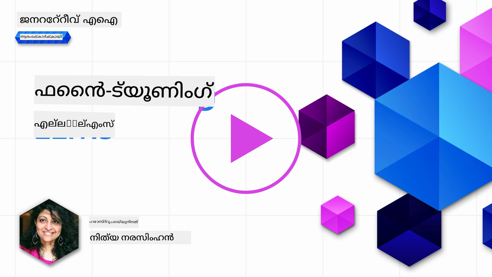
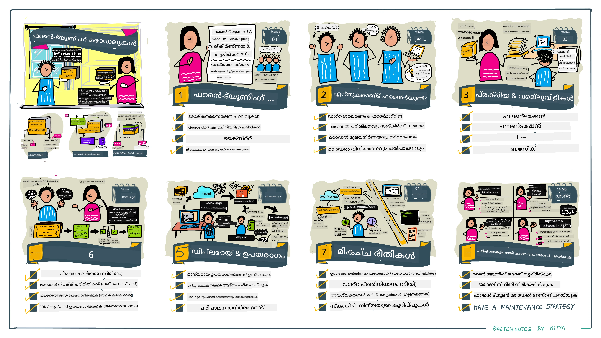

# നിങ്ങളുടെ LLM ഫൈനട്യൂണിങ്

ജനറേറ്റീവ് എഐ ആപ്ലിക്കേഷനുകൾ നിർമ്മിക്കാന്‍ വലിയ ഭാഷാ മോഡലുകൾ ഉപയോഗിക്കുന്നത് പുതിയ വെല്ലുവിളികള്‍ സൃഷ്ടിക്കുന്നുണ്ട്. പ്രധാന പ്രശ്നം മോഡലിന് ഉപയോക്തൃ അഭ്യർത്ഥനയ്ക്കുവേണ്ടിയുളള സൃഷ്ടിച്ച ഉള്ളടക്കത്തിലെ പ്രതികരണത്തിന്റെ ഗുണമേന്‍മ (ശുദ്ധിയും പ്രസക്തിയും) ഉറപ്പാക്കലാണ്. മുമ്പുള്ള പാഠങ്ങളിൽ, നിലവിലുള്ള മോഡലിലേക്ക് _പ്രോംപ്റ്റ് ഇൻപുട്ട്_ മാറ്റി പ്രശ്നം പരിഹരിക്കാൻ ശ്രമിക്കുന്ന പ്രോംപ്റ്റ് എഞ്ചിനീയറിംഗ്, റെട്രിവൽ-ഓഗ്മെൻറഡ് ജനറേഷൻ എന്നീ സാങ്കേതിക വിദ്യകൾ ഞങ്ങൾ ചര്‍ച്ച ചെയ്തിരുന്നു.

ഇന്നത്തെ പാഠത്തിൽ, ഒരു മൂന്നാം സാങ്കേതിക വിദ്യയായ **ഫൈൻ-ട്യൂണിംഗ്** അന്വേഷിക്കും, ഇത് _അധിക ഡാറ്റ ഉപയോഗിച്ച് മോഡൽ തന്നെ വീണ്ടും പരിശീലിപ്പിക്കുന്നത്_ വഴി വെല്ലുവിളി പരിഹരിക്കാൻ ശ്രമിക്കുന്നു. വിശദാംശങ്ങളിൽ ചതിയിടാം.

## പഠന ലക്ഷ്യങ്ങൾ

ഈ പാഠം മുൻകൂർ പരിശീലനം നേടിയ ഭാഷാ മോഡലുകൾക്കായി ഫൈന്‍-ട്യൂണിംഗ് എന്ന ആശയം പരിചയപ്പെടുത്തുന്നു, ഈ സമീപനത്തിന്റെ ഗുണങ്ങളെ ഉൾപ്പെടെയുള്ള വെല്ലുവിളികളും അന്വേഷിക്കുന്നു, നിങ്ങളുടെ ജനറേറ്റീവ് AI മോഡലുകളുടെ പ്രകടനം മെച്ചപ്പെടുത്താൻ ഫൈൻ-ട്യൂണിങ് എങ്ങനെ, എപ്പോള്‍ ഉപയോഗിക്കാമെന്ന് മാർഗനിർദേശങ്ങൾ നൽകുന്നു.

ഈ പാഠം അവസാനിക്കുന്നതോടെ, താഴെപ്പറയുന്ന ചോദ്യങ്ങൾക്ക് നിങ്ങൾ ഉത്തരം പറയാൻ സാദ്ധ്യമാകും:

- ഭാഷാ മോഡലുകൾക്കുള്ള ഫൈൻ ട്യൂണിംഗ് എന്താണ്?
- എപ്പോഴാണ്, എന്തുകൊണ്ട് ഫൈൻ ട്യൂണിംഗ് പ്രയോജനകരം?
- മുൻകൂർ പരിശീലനമുള്ള മോഡൽ എങ്ങനെ ഫൈൻ-ട്യൂൺ ചെയ്യാം?
- ഫൈൻ-ട്യൂണിങ്ങിന്റെ പരിമിതികൾ എന്തൊക്കെയാണ്?

സജ്ജമാണോ? തുടങ്ങാം.

## ചിത്രീകരിച്ച മാർഗ്ഗനിർദേശം

ഞങ്ങൾ പരിശോധിക്കാനിരിക്കുന്ന വസ്തുക്കൾക്കറുത്തിയെ മൊത്തം ദൃശ്യമായി കണ്ട് തയ്യാറാകണമെങ്കിൽ, ഈ ചിത്രീകരിച്ച മാർഗ്ഗനിർദേശം പരിശോധിക്കുക, ഇത് ഫൈൻ-ട്യൂണിങ്ങിന്റെ കോർ ആശയങ്ങൾ മുതൽ പ്രക്രിയയും മികച്ച പ്രയോഗ രീതി വരെ പഠനയാത്ര വിശദീകരിക്കുന്നു. അത് അന്വേഷിക്കാൻ ആകർഷകമായ വിഷയം ആണ്, അതിനാൽ നിങ്ങളുടെ സ്വയം മാർഗ്ഗനിർദേശ പഠന യാത്രയെ സഹായിക്കുന്ന അധിക ലിങ്കുകൾക്കായി [Resources](./RESOURCES.md?WT.mc_id=academic-105485-koreyst) പേജ് സന്ദർശിക്കാൻ മറക്കരുത്!

## ഭാഷാ മോഡലുകൾക്കുള്ള ഫൈന്‍-ട്യൂണിംഗ് എന്താണ്?

ഭാഷാ മോഡലുകൾ വലിയ തോതിൽ വ്യത്യസ്ത സ്രോതസ്സുകളില്‍ നിന്നുള്ള പലിശയുള്ള ടെക്സ്റ്റുകൾ ഉപയോഗിച്ച് _പൂർവ്വവിജ്ഞാനപരമായി പരിശീലിപ്പിച്ചവ_ ആണ് . മുമ്പത്തെ പാഠങ്ങളില്‍ പഠിച്ചതുപോലെ, ഉപയോക്തൃ ചോദ്യങ്ങളോട് ("പ്രോംപ്റ്റുകൾ") മോഡലിന്റെ പ്രതികരണത്തിന്റെ ഗുണനിലവാരം മെച്ചപ്പെടുത്തുവാന്‍ _പ്രോംപ്റ്റ് എഞ്ചിനീയറിംഗ്_ , _റെട്രിവൽ-ഓഗ്മെൻറഡ് ജനറേഷൻ_ പോലുള്ള സാങ്കേതികവിദ്യകൾ ആവശ്യമാണ്.

ഒരു പ്രചാരത്തിലുള്ള പ്രോംപ്റ്റ് എഞ്ചിനീയറിംഗ് രീതി മോഡലിന് പ്രതികരണത്തിൽ പ്രതീക്ഷിക്കപ്പെടുന്നതിനെക്കുറിച്ച് കൂടുതൽ മാർഗ്ഗനിർദേശം നൽകുന്നതാണ്, ഇത് _സൂചനകളും_ (സവിശേഷ മാർഗ്ഗനിർദേശം) അല്ലെങ്കിൽ _ചില ഉദാഹരണങ്ങൾ_ (അപരിചിത മാർഗ്ഗനിർദേശം) देकर ആയിരിക്കും. ഇത് _ഫ്യു-ഷോട്ട് ലേണിംഗ്_ എന്നറിയപ്പെടുന്നു, പക്ഷേ ഇതിന് രണ്ട് പരിമിതികള്‍ ഉണ്ട്:

- മോഡല്‍ ടോക്കൺ പരിധികൾ നൽകാവുന്ന ഉദാഹരണങ്ങളുടെ എണ്ണത്തെ പരിധിപെടുത്തും, ഫലപ്രാപ്തി കുറയും.
- മോഡല്‍ ടോക്കൺ ചെലവ് ഓരോ പ്രോംപ്റ്റിലും ഉദാഹരണങ്ങൾ ചേർക്കുന്നത് ദ്രവ്യമാകാൻ ഇടയാക്കുന്നു, സൗകര്യത കുറയുന്നു.

ഫൈൻ-ട്യൂണിംഗ് എന്നാണ് പറയുന്നു, മുൻകൂർ പരിശീലനം നേടിയ മോഡലിനെ പുതിയ ഡാറ്റ ഉപയോഗിച്ച് വീണ്ടും പരിശീലിപ്പിക്കുക, പ്രത്യേക ജോലി മെച്ചപ്പെടുത്തുന്നതിനായി. ഭാഷാ മോഡലുകളുടെ സന്ധർഭത്തിൽ, ഒരു നിശ്ചിത ജോലി അല്ലെങ്കിൽ പ്രയോഗ വ്യവസായത്തിനായി തിരഞ്ഞെടുത്ത ഉദാഹരണങ്ങൾ ഉപയോഗിച്ച് മുൻകൂർ പരിശീലനം നേടിയ മോഡൽ ഫൈൻ-ട്യൂൺ ചെയ്തുകൊണ്ട് **സ്വകാര്യ മോഡൽ** സൃഷ്ടിക്കാം, അത് ആ പ്രത്യേക ജോലി അല്ലെങ്കിൽ വ്യവസായം കൂടുതൽ കൃത്യവും പ്രസക്തവും ആക്കാം. ഫൈൻ-ട്യൂണിങ്ങിന്റെ ഒരു പക്കൽ ഗുണം ഫ്യു-ഷോട്ട് ലേണിംഗിന് ആവശ്യമായ ഉദാഹരണങ്ങളുടെ എണ്ണവും കുറയ്ക്കുന്നു - ടോക്കൺ ഉപയോഗവും ബന്ധപ്പെട്ട ചെലവും കുറക്കും.

## എപ്പോഴാണ് හා എന്തുകൊണ്ട് ഫൈൻ-ട്യൂണിംഗ് നടത്തണം?

_ഈ_ സന്ദർഭത്തിൽ ഫൈൻ-ട്യൂണിംഗ് വിശേഷിപ്പിക്കുമ്പോൾ, **പുതിയ ഡാറ്റ ചേർത്തുകൊണ്ട്** വീണ്ടും പരിശീലിപ്പിക്കുന്ന **പര്യവേക്ഷണ ഫൈൻ-ട്യൂണിംഗ്** ആണ് പറയുന്നത്. ഇത് പൂർവ്വ പരിശീലന ഡാറ്റയിൽ തന്നെ മറ്റ് ഹൈപ്പർപാരാമീറ്ററുകളുമായി പുനർപ്രശീലിക്കുന്ന അനപര്യവേക്ഷണ ഫൈൻ-ട്യൂണിംഗിൽ നിന്നു വ്യത്യാസമുണ്ട്.

മെച്ചപ്പെട്ട ഫലങ്ങൾ നേടാൻ വഴികാട്ടുന്ന ഒരു പരിചയസമ്പത്തിനു കീഴിൽ ഈ സാങ്കേതിക വിദ്യ ഉപയോഗിക്കുന്നത് ആവശ്യമാണ് എന്നു ഓർമ്മിക്കണം. തെറ്റായി ചെയ്താൽ പ്രതീക്ഷിച്ച മെച്ചങ്ങൾ ലഭിക്കാത്തത് മാത്രമല്ല, ലക്ഷ്യമിട്ട പ്രാവൃത്തി സംബന്ധമായ മോഡലിന്റെ പ്രകടനവും കുറയാം.

അതിനാൽ "എങ്ങനെ" ഫൈൻ-ട്യൂൺ ചെയ്യാമെന്ന് പഠിക്കുന്നതിന് മുമ്പ് "എന്തുകൊണ്ട്" ഈ വഴി സ്വീകരിക്കണമെന്നും "എപ്പോഴാണ്" ഫൈൻ-ട്യൂണിംഗ് ആരംഭിക്കേണ്ടത് എന്നും അറിയണം. നിങ്ങളെ നിങ്ങൾ തന്നെ ചോദിച്ച് തുടങ്ങുക:

- **ഉപയോഗം**: നിങ്ങളുടെ ഫൈൻ-ട്യൂണിംഗിനുള്ള _ഉപയോഗം_ എന്താണ്? നിലവിലുള്ള മുൻകൂർ മോഡലിൽ ഏതു വശം മെച്ചപ്പെടുത്തണമെന്ന് ആഗ്രഹിക്കുന്നു?
- **മാറ്റുപടികൾ**: ആവശ്യമായ ഫലങ്ങൾ നേടാൻ _മറ്റു സാങ്കേതിക വിദ്യകൾ_ പരീക്ഷിച്ചിട്ടുണ്ടോ? അവ ഉപയോഗിച്ച് നിർവചനം സൃഷ്ടിക്കുന്നതിനായി അടിസ്ഥാനരേഖ സൃഷ്ടിക്കുക.
  - പ്രോംപ്റ്റ് എഞ്ചിനീയറിംഗ്: പ്രസക്തമായ പ്രോംപ്റ്റ് മറുപടികളുടെ ഉദാഹരണങ്ങളുമായി കുറച്ചുദാഹരണങ്ങൾ കൊടുത്ത് ശ്രമിക്കുക. പ്രതികരണ ഗുണം വിലയിരുത്തുക.
  - റെട്രിവൽ ഓഗ്മെൻറഡ് ജനറേഷൻ: നിങ്ങളുടെ ഡാറ്റയിൽ തിരയൽ ഫലങ്ങൾ ചേർത്ത് പ്രോംപ്റ്റുകൾ വിപുലീകരിക്കുക. പ്രതികരണ ഗുണം വിലയിരുത്തുക.
- **ചെലവുകൾ**: ഫൈൻ-ട്യൂണിംഗിന്റെ ചെലവുകൾ തിരിച്ചറിയുന്നുണ്ടോ?
  - അനുരൂപത – ഫൈൻ-ട്യൂണിംഗിന് മുൻകൂർ മോഡൽ ലഭ്യമാണോ?
  - ശ്രമം – പരിശീലന ഡാറ്റ ഒരുക്കൽ, മോഡൽ വിലയിരുത്തൽ & മെച്ചപ്പെടുത്തൽ.
  - കംപ്യൂട്ട് – ഫൈൻ-ട്യൂണിംഗ് ജോലികൾ നടത്താനും ഫൈൻ-ട്യൂൺ ചെയ്ത മോഡൽ വിനിയോഗിക്കാനും.
  - ഡാറ്റ – ഫൈൻ-ട്യൂണിംഗ് ഫലപ്രാപ്തിക്ക് മതിയായ ഗുണമേന്മയുള്ള ഉദാഹരണങ്ങൾ സാന്ദ്രത.
- **ഗുണങ്ങൾ**: ഫൈൻ-ട്യൂണിങ്ങിന്റെ ഗുണങ്ങൾ സ്ഥിരീകരിച്ചിട്ടുണ്ടോ?
  - ഗുണമേന്മ – ഫൈൻ-ട്യൂൺ ചെയ്ത മോഡൽ അടിസ്ഥാനരേഖ കടന്നുവോ?
  - ചെലവ് – പ്രോംപ്റ്റുകൾ ലളിതമാക്കി ടോക്കൺ ഉപയോഗം കുറക്കുമോ?
  - വിപുലീകരണശേഷി – അടിസ്ഥാന മോഡൽ പുതിയ വ്യവസായങ്ങൾക്ക് പുനർപ്രയോഗം ചെയ്യാമോ?

ഈ ചോദ്യങ്ങൾക്ക് ഉത്തരം നൽകുന്നതിലൂടെ നിങ്ങളുടെ ഉപയോഗത്തിനായി ഫൈൻ-ട്യൂണിംഗ് അനുയോജ്യമായ മാര്‍ഗമാണോ എന്ന് തീരുമാനിക്കാം. ഗുണങ്ങൾ ചെലവുകൾക്കപ്പുറം ആയ പോരായ്മ മാത്രമാണ് സ്വീകരിക്കേണ്ടത്. തീരുമാനിച്ചതിന് ശേഷം, മുൻകൂർ മോഡൽ എങ്ങനെ ഫൈൻ-ട്യൂൺ ചെയ്യാമെന്ന് ആലോചിക്കാം.

നിർണ്ണയ പ്രക്രിയയെ കുറിച്ച് കൂടുതൽ അറിവ് വേണോ? [To fine-tune or not to fine-tune](https://www.youtube.com/watch?v=0Jo-z-MFxJs) വീഡിയോ കാണുക.

## മുൻകൂർ പരിശീലനം നേടിയ മോഡൽ എങ്ങനെ ഫൈൻ-ട്യൂൺ ചെയ്യാം?

മുൻകൂർ ട്രെയിനുചെയ്‌ത മോഡൽ ഫൈൻ-ട്യൂൺ ചെയ്യാൻ നിങ്ങൾക്കായി വേണം:

- ഫൈൻ-ട്യൂൺ ചെയ്യാനുള്ള മുൻകൂറ് മോഡൽ
- ഫൈൻ-ട്യൂണിംഗിനായി ഉപയോഗിക്കാനുള്ള ഡാറ്റാസെറ്റ്
- ഫൈൻ-ട്യൂണിംഗ് ജോലി നടത്താൻ പരിശീലന പരിസ്ഥിതി
- ഫൈൻ-ട്യൂൺ ചെയ്ത മോഡൽ വിനിയോഗിക്കാൻ ഹോസ്റ്റിംഗ് പരിസ്ഥിതി

## ഫൈൻ-ട്യൂണിംഗ് പ്രായോഗികമായി

താഴെയുള്ള റിസോഴ്സുകൾ തെരഞ്ഞെടുക്കിയ മോഡലും തിരഞ്ഞെടുത്ത ഡാറ്റാസെറ്റും ഉപയോഗിച്ചുള്ള യാഥാർത്ഥ്യ ഉദാഹരണങ്ങളിലൂടെ നിങ്ങൾക്കു പഠിക്കാനായി പടി പടിയായി ട്യൂട്ടോറിയലുകൾ നൽകുന്നു. ഈ ട്യൂട്ടോറിയലുകൾ പ്രവർത്തിപ്പിക്കാനായി, ബന്ധപ്പെട്ട പ്രൊവൈഡറിൽ അക്കൗണ്ട് ഉണ്ടായിരിക്കണം, കൂടാതെ മോഡലും ഡാറ്റാസെറ്റും ലഭ്യമാകണം.

| പ്രൊവൈഡർ      | ട്യൂട്ടോറിയൽ                                                                                                                                                                       | വിവരണം                                                                                                                                                                                                                                                                                                                                                                                                                         |
| ------------ | ------------------------------------------------------------------------------------------------------------------------------------------------------------------------------ | ---------------------------------------------------------------------------------------------------------------------------------------------------------------------------------------------------------------------------------------------------------------------------------------------------------------------------------------------------------------------------------------------------------------------------------- |
| OpenAI       | [How to fine-tune chat models](https://github.com/openai/openai-cookbook/blob/main/examples/How_to_finetune_chat_models.ipynb?WT.mc_id=academic-105485-koreyst)                | ഒരു പ്രത്യേക വ്യവസായത്തിനായി ("റസിപ്പി അസിസ്റ്റൻറ്റ്") `gpt-35-turbo` ഫൈൻ-ട്യൂണിംഗ് ചെയ്യുന്നത് പരിശീലന ഡാറ്റ തയ്യാറാക്കൽ, ഫൈൻ-ട്യൂണിംഗ് ജോലി നടത്തൽ, ഫൈൻ-ട്യൂൺ ചെയ്ത മോഡൽ ഉപയോഗിച്ച് ഇൻഫെറൻസ് നടത്തൽ തുടങ്ങി പഠിക്കുക.                                                                                                                                                                                                                      |
| Azure OpenAI | [GPT 3.5 Turbo fine-tuning tutorial](https://learn.microsoft.com/azure/ai-services/openai/tutorials/fine-tune?tabs=python-new%2Ccommand-line?WT.mc_id=academic-105485-koreyst) | **Azure-ൽ** `gpt-35-turbo-0613` മോഡൽ ഫൈൻ-ട്യൂൺ ചെയ്യുന്നതിനുള്ള സ്ഥാപന നടപടിക്രമങ്ങളും, പരിശീലന ഡാറ്റ സൃഷ്ടിച്ച് അപ്ലോഡ് ചെയ്യേണ്ടത്, ഫൈൻ-ട്യൂണിംഗ് ജോബ് നടത്തൽ, പുതിയ മോഡൽ വിനിയോഗിക്കൽ എന്നിവ പഠിക്കുക.                                                                                                                                                                                                                                       |
| Hugging Face | [Fine-tuning LLMs with Hugging Face](https://www.philschmid.de/fine-tune-llms-in-2024-with-trl?WT.mc_id=academic-105485-koreyst)                                               | ഈ ബ്ലോഗ് പോസ്റ്റ് ഒരു **ഒപ്പൺ LLM** (ഉദാ: `CodeLlama 7B`) ഫൈൻ-ട്യൂണിംഗ് പരിശ്രമം പരിചയപ്പെടുത്തുന്നു, ഇതിനായി [transformers](https://huggingface.co/docs/transformers/index?WT.mc_id=academic-105485-koreyst) ലൈബ്രറി & [Transformer Reinforcement Learning (TRL)](https://huggingface.co/docs/trl/index?WT.mc_id=academic-105485-koreyst) ഉപയോഗിച്ചു ഹഗ്ഗിംഗ് ഫെയ്സിൽ ഉള്ള [datasets](https://huggingface.co/docs/datasets/index?WT.mc_id=academic-105485-koreyst) ഉപയോഗിക്കുന്നു. |
|              |                                                                                                                                                                                |                                                                                                                                                                                                                                                                                                                                                                                                                                  |
| 🤗 AutoTrain | [Fine-tuning LLMs with AutoTrain](https://github.com/huggingface/autotrain-advanced/?WT.mc_id=academic-105485-koreyst)                                                         | AutoTrain (അഥവാ AutoTrain Advanced) ഹഗ്ഗിംഗ് ഫെയ്സ് വികസിപ്പിച്ചെടുത്ത പൈത്തൺ ലൈബ്രറിയാണ്, വിവിധ ജോലികൾക്കായി ഫൈൻ-ട്യൂണിംഗ് അനുവദിക്കുന്നു, പ്രത്യേകിച്ച് LLM ഫൈൻ-ട്യൂണിംഗ്. AutoTrain-ന് കോഡ് ഇല്ലാത്ത ഒരു പരിഹാരമാണ്, നിങ്ങളുടെ സ്വന്തം ക്ലൗഡിൽ, ഹഗ്ഗിംഗ് ഫെയ്സ് സ്പേസിൽ അല്ലെങ്കിൽ ലോക്കലായി ഉപയോഗിക്കാം. ഇത് വെബ്-ബേസ് GUI, CLI, YAML കോൺഫിഗ് ഫയലുകൾ വഴി പരിശീലനം ചെയ്യാൻ പിന്തുണയുണ്ട്.                                                                           |
|              |                                                                                                                                                                                |                                                                                                                                                                                                                                                                                                                                                                                                                                  |
| 🦥 Unsloth | [Fine-tuning LLMs with Unsloth](https://github.com/unslothai/unsloth)                                                         | Unsloth ഒരു ഓപ്പൺ സോഴ്‌സ് ഫ്രെയിംവർക്ക് ആണ്, LLM ഫൈൻ-ട്യൂണിങ്ങിനും റീ ഇൻഫോഴ്‌സ്‌മെന്റ് ലേണിംഗിനും പിന്തുണ നൽകുന്നു. Unsloth ലൊക്കൽ പരിശീലനം, മൂല്യനിർണ്ണയം, വിനിയോഗം സുഗമമാക്കുന്നു റെഡി ടു യൂസ് [ലേഖനപ്പുസ്തകങ്ങൾ](https://github.com/unslothai/notebooks) ഉപയോഗിച്ച്. ഇത് ടെക്സ്റ്റ്-ടു-സ്പീച്ച് (TTS), BERT, മൾട്ടിമോഡൽ മോഡലുകൾക്കും സഹായകമാണ്. ആരംഭിക്കാൻ അവരുടെ സുതാര്യമായ [Fine-tuning LLMs Guide](https://docs.unsloth.ai/get-started/fine-tuning-llms-guide) വായിക്കുക.                                   |
|              |                                                                                                                                                                                |                                                                                                                                                                                                                                                                                                                                                                                                                                  |
## അസൈൻമെന്റ്

മുകളിൽ നൽകിയ ട്യൂട്ടോറിയലുകളിൽ ഒന്നിനെ തെരഞ്ഞെടുത്ത് വിശദമായി പഠിക്കുക. _ഒരു റഫറൻസായി ഈ ട്യൂട്ടോറിയലുകളുടെ വേരിയന്റുകൾ ജുപൈറ്റർ നോട്ട്ബുക്കുകളിൽ ഈ റിപ്പോസിറ്ററി-യിൽ പ്രതിപാദിക്കാം. ഏറ്റവും പുതിയ പതിപ്പുകൾക്കായി ദയവായി മൗലിക ഉറവിടങ്ങൾ നേരിട്ടു ഉപയോഗിക്കുക_.

## മികച്ച ജോലി! നിങ്ങളുടെ പഠനം തുടരണം.

ഈ പാഠം പൂര്‍ത്തിയാക്കിയ ശേഷം, ഞങ്ങളുടെ [ജനറേറ്റീവ് AI പഠന ശേഖരം](https://aka.ms/genai-collection?WT.mc_id=academic-105485-koreyst) സന്ദർശിച്ച് നിങ്ങളുടെ Generative AI പരിജ്ഞാനത്തെ കൂടുതൽ മുന്നോട്ട് കൊണ്ടുപോകൂ!

അഭിനന്ദനങ്ങൾ!! ഈ കോഴ്‌സിന്റെ v2 സീരിസിലെ അവസാന പാഠം നിങ്ങൾ പൂർത്തിയാക്കി! പഠനവും സൃഷ്ടിയുമ് നിർത്തരുത്. \*\*ഈ വിഷയത്തിന് മാത്രമുള്ള അധിക നിർദ്ദേശസൂചികൾക്കായി [RESOURCES](RESOURCES.md?WT.mc_id=academic-105485-koreyst) പേജ് പരിശോധിക്കുക.

നമ്മുടെ v1 സീരിസ് പാഠങ്ങളും അസൈൻമെന്റുകളും കൂടുതൽ ഉൾപ്പെടുത്തി പുതുക്കിയിട്ടുണ്ട്. അതുകൊണ്ട് നിങ്ങളുടെ അറിവ് പുതുക്കാൻ ഒരു മിനിറ്റ് എടുത്ത് -- ദയവായി [നിങ്ങളുടെ ചോദ്യങ്ങളും അഭിപ്രായങ്ങളും](https://github.com/microsoft/generative-ai-for-beginners/issues?WT.mc_id=academic-105485-koreyst) പങ്കുവയ്ക്കൂ, സമൂഹത്തിനായി ഈ പാഠങ്ങൾ മെച്ചപ്പെടുത്തുന്നതിന് സഹായിക്കും.

---

<!-- CO-OP TRANSLATOR DISCLAIMER START -->
**തயാർപ്പറിയിപ്പ്**:  
ഈ ദസ്താവേജ് AI വിവർത്തന സേവനമായ [Co-op Translator](https://github.com/Azure/co-op-translator) ഉപയോഗിച്ച് വിവർത്തനം ചെയ്തതാണ്. ഞങ്ങൾ കൃത്യതക്ക് വേണ്ടി പരിശ്രമിച്ചെങ്കിലും, ത автомат ചെയ്ത വിവർത്തനങ്ങളിൽ പിഴവുകൾ അല്ലെങ്കിൽ അശുദ്ധതകൾ ഉണ്ടാകാമെന്ന് ദയവായി ശ്രദ്ധിക്കുക. യഥാർത്ഥ അംഗീകൃത ഭാഷയിലുള്ള വാചകം ആണ് പ്രാഥമിക ഉറവിടം. പ്രധാന വിവരങ്ങൾക്കായി, പ്രൊഫഷണൽ മാനവ വിവർത്തനം നിർദ്ദേശിക്കുന്നു. ഈ വിവർത്തനത്തിന്റെ ഉപയോഗം മൂലം ഉണ്ടാകുന്ന任何误解或误释 നാം ഉത്തരവാദികളല്ല.
<!-- CO-OP TRANSLATOR DISCLAIMER END -->