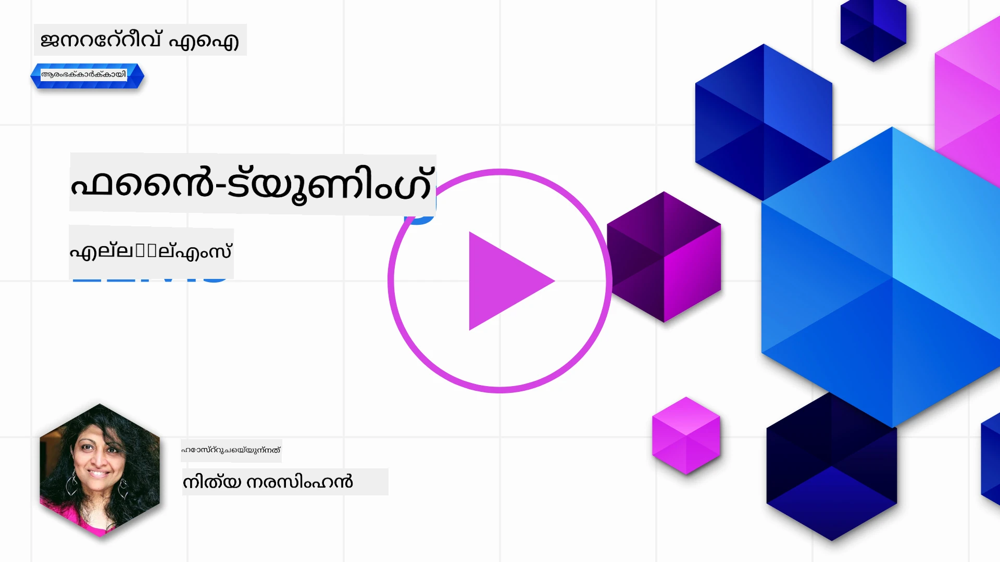
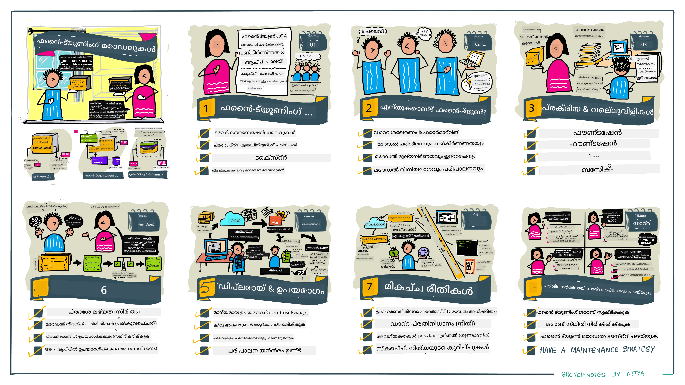

# നിങ്ങളുടെ LLM ഫൈൻ-ട്യൂണിംഗ്

ജെനറേറ്റീവ് AI അപ്ലിക്കേഷനുകൾ നിർമ്മിക്കാനായി വലിയ ഭാഷാ മോഡലുകൾ ഉപയോഗിക്കുന്നത് പുതിയ വെല്ലുവിളികളുമായി ಬರುತ್ತದೆ. ഒരു പ്രധാന പ്രശ്നം ഒരു വ്യക്തിഗത ഉപയോക്തൃ അഭ്യർത്ഥനയ്ക്ക് മോഡൽ സൃഷ്ടിക്കുന്ന ഉള്ളടക്കത്തിലെ പ്രതികരണത്തിന്റെ ഗുണമേന്മ (നിർവചനം, പ്രസക്തി) ഉറപ്പാക്കലാണ്. മുമ്പത്തെ പാഠങ്ങളിൽ, നിലവിലെ മോഡലിന് _പ്രോമ്പ്റ്റ് ഇൻപുട്ട്_ മാറ്റി എന്ന രീതിയിലൂടെ പ്രശ്നം പരിഹരിക്കാൻ ശ്രമിക്കുന്ന പ്രോംപ്റ്റ് എഞ്ചിനീയറിംഗ്, റിട്രീവൽ-ഓഗ്മെന്റഡ് ജനറേഷൻ പോലുള്ള സാങ്കേതികതകൾ ചര്‍ച്ച ചെയ്തിട്ടുണ്ട്.

ഇന്നത്തെ പാഠത്തിൽ, **ഫൈൻ-ട്യൂണിംഗ്** എന്ന മൂന്നാമത് സാങ്കേതികതയെ പരിഗണിക്കും, അത് _കൂടുതൽ ഡാറ്റ ഉപയോഗിച്ച് മോഡൽച്ചെയ്യുന്നതിലൂടെ_ വെല്ലുവിളി പരിഹരിക്കാൻ ശ്രമിക്കുന്നു. വിശദാംശങ്ങളിലേക്ക് ഇരിക്കാം.

## പഠന ലക്ഷ്യങ്ങൾ

ഈ പാഠം പ്രീ-ട്രെയിനുചെയ്ത ഭാഷാ മോഡല்களോടുള്ള ഫൈൻ-ട്യൂണിംഗ് ആശയം പരിചയപ്പെടുത്തുന്നു, ഈ സമീപനത്തിന്റെ ഗുണങ്ങളും വെല്ലുവിളികളും പരിശോധിക്കുന്നു, നിങ്ങളുടെ ജെനറേറ്റീവ് AI മോഡലുകളുടെ പ്രകടനം മെച്ചപ്പെടുത്താൻ ഫൈൻ-ട്യൂണിംഗ് എപ്പോഴും എങ്ങനെ ഉപയോഗിക്കാമെന്ന് മാർഗ്ഗനിർദ്ദേശം നൽകി.

ഈ പാഠം പൂർത്തിയാക്കിയപ്പോൾ, നിങ്ങൾക്ക് താഴെ പറയുന്ന ചോദ്യങ്ങൾക്ക് ഉത്തരം കണ്ടെത്താൻ കഴിയണം:

- ഭാഷാ മോഡലുകൾക്ക് ഫൈൻ-ട്യൂണിംഗ് എന്താണ്?
- ഫൈൻ-ട്യൂണിംഗ് എപ്പൊ, എന്തിന് ഉപകാരപ്പെടും?
- ഞാൻ ഫൈൻ-ട്യൂൺ ചെയ്യാൻ എങ്ങനെ പ്രീ-ട്രെയിനുചെയ്ത മോഡലും?
- ഫൈൻ-ട്യൂണിംഗിന്റെ പരിധികളേ 무엇들입니까?

സദ്യമാണ്? തുടങ്ങാം.

## ചിത്രീകരിച്ച മാർഗ്ഗനിർദ്ദേശം

നാം സംവർത്തിക്കാൻ പോകുന്ന കാര്യത്തിന്റെ വലിയ ദൃശ്യരൂപം അറിയാൻ ആഗ്രഹമുണ്ടോ? ഈ ചിത്രീകരിച്ച മാർഗ്ഗനിർദ്ദേശം പരിശോധിക്കുക, ഇത് പാഠഭാഗത്തിന്റെ പഠനയാത്രയെ വിവരണരൂപത്തിൽ അവതരിപ്പിക്കുന്നു - ഫൈൻ-ട്യൂണിംഗിന്റെ അടിസ്ഥാന ആശയങ്ങളും പ്രചോദനവും പഠിക്കുകയും പ്രക്രിയയും മികച്ച പ്രാക്ടീസുകളും മനസ്സിലാക്കുകയും ചെയ്യുക. അന്വേഷിക്കാൻ ആകർഷകമായ വിഷയം കൂടിയാണ്, അതിനാൽ നിങ്ങളുടെ സ്വയം എന്നിവ ലേണിംഗ് യാത്ര പിന്തുണയ്‌ക്കുന്ന കൂടുതൽ ലിങ്കുകൾക്കായി [Resources](./RESOURCES.md?WT.mc_id=academic-105485-koreyst) പേജ് മനസ്സിലാക്കുന്നത് മറക്കരുത്!

## ഭാഷാ മോഡലുകൾക്ക് ഫൈൻ-ട്യൂണിംഗ് എന്താണ്?

നിയമപ്രകാരം, വലിയ ഭാഷാ മോഡലുകൾ വിവിധ സ്രോതസ്സുകളിൽനിന്നും ഉള്ളടക്കം ശേഖരിച്ച് (_ഇന്റർനെറ്റ് ഉൾപ്പെടെ_) വലിയ അളവിലുള്ള ടെക്സ്റ്റിൽ _പ്രീ-ട്രെയിനുചെയ്ത_ അതാണ്. മുമ്പത്തെ പാഠങ്ങളിൽ പഠിച്ചതുപോലെ, ഉപയോക്താവിന്റെ ചോദ്യങ്ങളിൽ മോഡലിന്റെ പ്രതികരണങ്ങളുടെ ഗുണമേന്മ മെച്ചപ്പെടുത്താൻ _പ്രോമ്പ്റ്റ് എഞ്ചിനീയറിംഗ്_ , _റിട്രീവൽ-ഓഗ്മെന്റഡ് ജനറേഷൻ_ പോലുള്ള സാങ്കേതികതകൾ ആവശ്യമാണ്.

ഒരു പ്രശസ്ത പ്രോംപ്റ്റ്-എഞ്ചിനീയറിംഗ് സാങ്കേതികത, പ്രതികരണത്തിൽ പ്രതീക്ഷിക്കുന്നതെന്തെന്ന് മോഡലിന് കൂടുതൽ മാർഗ്ഗനിർദ്ദേശം നൽകുക, അത് _നിർദ്ദേശങ്ങൾ_ (സ്പഷ്ട മാർഗ്ഗനിർദ്ദേശം) നൽകുകയോ _ചില ഉദാഹരണങ്ങൾ_ (അസ്പഷ്ട മാർഗ്ഗനിർദ്ദേശം) നൽകുകയോ ചെയ്യാം. ഇത് _ഫ്യൂ-ഷോട്ട് ലേണിംഗ്_ എന്നറിയപ്പെടുന്നു, എന്നാല്‍ ഇതിന് രണ്ട് പരിധികളും ഉണ്ട്:

- മോഡൽ ടോക്കൺ പരിധികൾ നിങ്ങൾക്ക് നൽകാവുന്ന ഉദാഹരണങ്ങളുടെ എണ്ണം നിയന്ത്രിക്കാം, ഫലപ്രാപ്തി കുറയ്ക്കാം.
- മോഡൽ ടോക്കൺ ചെലവുകൾ ഓരോ പ്രോമ്പ്റ്റിനും ഉദാഹരണങ്ങൾ ചേർക്കാൻ ചെലവേറാൻ ഇടയാക്കും, ഇളവിന്റെ പരിധി ഉണ്ടാകും.

ഫൈൻ-ട്യൂണിംഗ് മെഷീൻ ലേണിങ്ങ് സിസ്റ്റത്തിൽ ഒരു സാധാരണ практика ആണ്, ഇതിൽ ഒരു പ്രീ-ട്രെയിനുചെയ്ത മോഡൽ എടുത്ത് ഒരു പ്രത്യേക പ്രവൃത്തി മെച്ചപ്പെടുത്താൻ പുതിയ ഡാറ്റ ഉപയോഗിച്ച് വീണ്ടും പരിശീലിപ്പിക്കുന്നത്. ഭാഷാ മോഡലുകളുടെ പശ്ചാത്തലത്തിൽ, ഒരു നൽകിയ പ്രവൃത്തിക്കും/അപ്ലിക്കേഷൻ ഡൊമൈനിനും വേണ്ടി ക്യൂറേറ്റ് ചെയ്ത ഉദാഹരണങ്ങളുടെ സെറ്റ് ഉപയോഗിച്ച് പ്രീ-ട്രെയിനുചെയ്ത മോഡൽ ഫൈൻ-ട്യൂൺ ചെയ്താൽ, ആ പ്രത്യേക പ്രവൃത്തിക്കും ഡൊമൈനിനും കൂടുതൽ കൃത്യവും പ്രസക്തമായ **കസ്റ്റം മോഡൽ** ഉണ്ടാക്കാം. ഫൈൻ-ട്യൂണിംഗിന്റെ ഒരു സൈഡ്-ബെനഫിറ്റ് അളവിൽ, ഫ്യൂ-ഷോട്ട് ലേണിങിന് ആവശ്യമുള്ള ഉദാഹരണങ്ങളുടെ എണ്ണവും കുറക്കാം - ടോക്കൺ ഉപയോഗവും ചെലവും കുറയ്ക്കുന്നു.

## ഫൈൻ-ട്യൂൺ ചെയ്യേണ്ടപ്പോളും എന്തിന്?

ഈ പരിസരത്തിൽ പറയുമ്പോൾ, നമ്മൾ സൂപ്പർവൈസ്ഡ് ഫൈൻ-ട്യൂണിംഗിനെ സൂചിപ്പിക്കുന്നു, അത് **പുതിയ ഡാറ്റ ചേർക്കുന്നതിലൂടെ** പുന:ശിക്ഷണം നടത്തുന്നതാണ്, ആ ഡാറ്റ പ്രഥമ പരിശീലന ഡാറ്റസെറ്റിന്റെ ഭാഗമല്ല. ഇത് ഒറിജിനൽ ഡാറ്റ ഉപയോഗിച്ച്, പക്ഷെ വ്യത്യസ്ത ഹൈപ്പർപാരാമീറ്ററുകൾ ഉപയോഗിച്ച് പുന:ശിക്ഷണം നടത്തുന്നതായ അസൂപ്പർവൈസ്ഡ് ഫൈൻ-ട്യൂണിംഗിൽ നിന്ന് വ്യത്യസ്തമാണ്.

മനസ്സിൽ വയ്ക്കേണ്ട പ്രധാന കാര്യം: ഫൈൻ-ട്യൂണിംഗ് ഒരു ഉയർന്ന തലത്തിലുള്ള സാങ്കേതികതയാണ്, ഫലപ്രാപ്തി നേടാൻ അതുമായി ബന്ധപ്പെട്ട കഴിവ് ആവശ്യമാണ്. തെറ്റായി ചെയ്താൽ പ്രതീക്ഷിച്ച മെച്ചപ്പെടുത്തലുകളൊന്നും ഉണ്ടാകാതെ, ലക്ഷ്യമായ ഡൊമെയിനിൽ മോഡലിന്റെ പ്രകടനം കൂടി തകർക്കാവുന്ന സാധ്യതയുണ്ട്.

അതുകൊണ്ട്, "എങ്ങനെ" ഫൈൻ-ട്യൂൺ ചെയ്യാമെന്നത് പഠിക്കുന്നതിനുമുമ്പ്, "എന്തിന്" ഇത് പ്രയോജനകരമാണ് എന്നും, ഈ പ്രക്രിയ "എപ്പോൾ" ആരംഭിക്കണമെന്ന് അറിയണം. നിങ്ങളുടെ അടുത്ത ചോദ്യങ്ങൾ ചൊല്ലിക്കോട്ടെ:

- **ഉപയോഗ കേസ്സ്**: ഫൈൻ-ട്യൂണിംഗിന് നിങ്ങളുടെ _ഉപയോഗ കേസ്സ്_ എന്താണ്? നിലവിലെ പ്രീ-ട്രെയിനുചെയ്ത മോഡലിൽ നിങ്ങൾ മെച്ചപ്പെടുത്തേണ്ട ഭാഗം യാതാ?
- **മറ്റ് മാർഗങ്ങൾ**: ആഗ്രഹിക്കുന്ന ഫലങ്ങൾ നേടാൻ _മറ്റു സാങ്കേതികതകൾ_ നിങ്ങൾ പരീക്ഷിച്ചുവോ? അവ ഉപയോഗിച്ച് ഒരു മിതമായ അടിസ്ഥാനമുണ്ടാക്കൂ.
  - പ്രോംപ്റ്റ് എഞ്ചിനീയറിംഗ്: പ്രസക്തമായ പ്രോമ്പ്റ്റ് പ്രതികരണ ഉദാഹരണങ്ങളുള്ള ഫ്യൂ ഷോട്ട് പ്രോംപ്റ്റിംഗ് പോലുള്ള സാങ്കേതികതകൾ പരീക്ഷിക്കൂ. പ്രതികരണങ്ങളുടെ ഗുണമേന്മ വിലയിരുത്തുക.
  - റിട്രീവൽ ഓഗ്മെന്റഡ് ജനറേഷൻ: നിങ്ങളുടെ ഡാറ്റ തിരച്ചിൽ വഴി ലഭിക്കുന്ന ഫലം പ്രോംപ്റ്റുകൾക്ക് കൂട്ടിച്ചേർക്കൂ. പ്രതികരണങ്ങളുടെ ഗുണമേന്മ വിലയിരുത്തുക.
- **ച്ചെലവുകൾ**: ഫൈൻ-ട്യൂണിംഗിന്റെ ചെലവുകൾ തിരിച്ചറിയാമോ?
  - ട്യൂണബിലിറ്റി - പ്രീ-ട്രെയിനുചെയ്ത മോഡൽ ഫൈൻ-ട്യൂണിംഗിന് ലഭ്യമാണ് എങ്കിൽ?
  - ശ്രമം - പരിശീലന ഡാറ്റ തയ്യാറാക്കൽ, മോഡൽ മൂല്യനിർണയം & വീണ്ടെടുത്തൽ.
  - കംപ്യൂട്ട് - ഫൈൻ-ട്യൂണിംഗ് ജോലികൾ നടത്താനും ഫൈൻ-ട്യൂൺ ചെയ്ത മോഡൽ വിന്യസിക്കാനും.
  - ഡാറ്റ - ഫൈൻ-ട്യൂണിംഗിന് ആവശ്യമായ ഗുണമേന്മയുള്ള ഉദാഹരണങ്ങളിലേക്കുള്ള ആക്‌സസ്.
- **ഗുണങ്ങൾ**: ഫൈൻ-ട്യൂണിംഗിന്റെ പ്രയോജനം സ്ഥിരീകരിച്ചുവോ?
  - ഗുണമേനം - ഫൈൻ-ട്യൂൺ ചെയ്ത മോഡൽ അടിസ്ഥാനപരമായ മോഡലിനെക്കാൾ മെച്ചമാണ്?
  - ചെലവ് - പ്രോംപ്റ്റുകൾ ലളിതമാക്കി ടോക്കൺ ഉപയോഗം കുറയ്ക്കുന്നുവോ?
  - വിപുലീകരണം - അടിസ്ഥാന മോഡൽ പുതിയ ഡൊമൈനുകൾക്ക് ഉപയോഗിക്കാമോ?

ഈ ചോദ്യങ്ങൾക്ക് ഉത്തരം കൊടുക്കുക, ഫൈൻ-ട്യൂണിംഗ് നിങ്ങളുടെ ഉപയോഗ കേസിനായി ശരിയായ സമീപനമാണോ എന്ന് തീരുമാനിക്കാം. ഗുണങ്ങൾ ചെലവുകൾക്കു മുകളില്‍ അല്ലെങ്കിൽ തുല്യമെങ്കിൽ ഇതു പ്രയോജനകരമാണ്. തീരുമാനിച്ചതിന് ശേഷം, _എങ്ങനെ_ പ്രീ-ട്രെയിനുചെയ്ത മോഡൽ ഫൈൻ-ട്യൂൺ ചെയ്യാമെന്ന് ആലോചിക്കാം.

കൂടുതൽ ഉൾക്കാഴ്ചകൾ അറിയാൻ [To fine-tune or not to fine-tune](https://www.youtube.com/watch?v=0Jo-z-MFxJs) കാണുക.

## ഒരു പ്രീ-ട്രെയിനുചെയ്ത മോഡൽ എങ്ങനെ ഫൈൻ-ട്യൂൺ ചെയ്യാം?

ഒരു പ്രീ-ട്രെയിനുചെയ്ത മോഡൽ ഫൈൻ-ട്യൂൺ ചെയ്യാൻ നിങ്ങൾക്ക് ആവശ്യമായത്:

- ഫൈൻ-ട്യൂൺ ചെയ്യാനുള്ള പ്രീ-ട്രെയിനുചെയ്ത മോഡൽ
- ഫൈൻ-ട്യൂണിംഗിനായി ഉപയോഗിക്കുന്ന ഡാറ്റാസെറ്റ്
- ഫൈൻ-ട്യൂണിംഗ് ജോബ് നടത്താൻ പരിശീലന പരിസ്ഥിതി
- ഫൈൻ-ട്യൂൺ ചെയ്ത മോഡൽ വിന്യസിക്കാൻ ഹോസ്റ്റിംഗ് പരിസ്ഥിതി

## പ്രവർത്തനത്തിലാണ് ഫൈൻ-ട്യൂണിംഗ്

താഴെ പറയുന്ന വിഭവങ്ങൾ തിരഞ്ഞെടുക്കപ്പെട്ട ഒരു മോഡൽ ഉപയോഗിച്ച് ക്യൂറേറ്റ് ചെയ്ത ഡാറ്റാസെറ്റുമായി യഥാർത്ഥ ഉദാഹരണത്തിലൂടെ നിങ്ങൾക്ക് ഘട്ടം ഘട്ടമായി പഠിപ്പിക്കുന്നു. ഈ ട്യൂട്ടോറിയലുകൾ പണിയാൻ, നിങ്ങൾക്ക് ആ പ്രൊവൈഡറിലെ അക്കൗണ്ട്, അനുയോജ്യമായ മോഡലുകളും ഡാറ്റാസെറ്റുകളും ആക്‌സസ് ഉണ്ടായിരിക്കണം.

| പ്രൊവൈഡർ     | ട്യൂട്ടോറിയൽ                                                                                                                                                                      | വിവരണം                                                                                                                                                                                                                                                                                                                                                                                                                              |
| ------------ | ------------------------------------------------------------------------------------------------------------------------------------------------------------------------------ | ---------------------------------------------------------------------------------------------------------------------------------------------------------------------------------------------------------------------------------------------------------------------------------------------------------------------------------------------------------------------------------------------------------------------------------- |
| OpenAI       | [How to fine-tune chat models](https://github.com/openai/openai-cookbook/blob/main/examples/How_to_finetune_chat_models.ipynb?WT.mc_id=academic-105485-koreyst)                | പ്രത്യേക ഡൊമെയിനായ ("recipe assistant") ഒരു `gpt-35-turbo` മോഡൽ എങ്ങനെ ഫൈൻ-ട്യൂൺ ചെയ്യാമെന്ന് പഠിക്കുക, പരിശീലന ഡാറ്റ തയ്യാറാക്കൽ, ഫൈൻ-ട്യൂണിംഗ് ജോബ് നടത്തൽ, ഫൈൻ-ട്യൂൺ ചെയ്‌തിരിക്കുന്ന മോഡൽ ഇൻഫറൻസ്‌ക്ക് ഉപയോഗിക്കുക.                                                                                                                                                                                                             |
| Azure OpenAI | [GPT 3.5 Turbo fine-tuning tutorial](https://learn.microsoft.com/azure/ai-services/openai/tutorials/fine-tune?tabs=python-new%2Ccommand-line&WT.mc_id=academic-105485-koreyst) | **Azure-ൽ** `gpt-35-turbo-0613` മോഡൽ ഫൈൻ-ട്യൂൺ ചെയ്യുന്നത് പഠിക്കുക; പരിശീലന ഡാറ്റ സൃഷ്ടിക്കുകയും അപ്‌ലോഡ് ചെയ്യുകയും, ഫൈൻ-ട്യൂണിംഗ് ജോബ് നടത്തുകയും, ഫൈൻ-ട്യൂൺ ചെയ്‌തിരിക്കുന്ന മോഡൽ വിന്യസിക്കുകയും ചെയ്യുക.                                                                                                                                                                                                                                |
| Hugging Face | [Fine-tuning LLMs with Hugging Face](https://www.philschmid.de/fine-tune-llms-in-2024-with-trl?WT.mc_id=academic-105485-koreyst)                                               | ഈ ബ്ലോഗ് പോസ്റ്റ് [_open LLM_ ഉദാഹരണമായി `CodeLlama 7B`]-യെ [transformers](https://huggingface.co/docs/transformers/index?WT.mc_id=academic-105485-koreyst) ലൈബ്രറിയും [Transformer Reinforcement Learning (TRL)](https://huggingface.co/docs/trl/index?WT.mc_id=academic-105485-koreyst) ഉപയോഗിച്ച്, Hugging Face-ലെ തുറന്ന [datasets](https://huggingface.co/docs/datasets/index?WT.mc_id=academic-105485-koreyst) ഉപയോഗിച്ച് ഫൈൻ-ട്യൂണിംഗിനെ കുറിച്ച് വിശദീകരിക്കുന്നു. |
|              |                                                                                                                                                                                |                                                                                                                                                                                                                                                                                                                                                                                                                                    |
| 🤗 AutoTrain | [Fine-tuning LLMs with AutoTrain](https://github.com/huggingface/autotrain-advanced/?WT.mc_id=academic-105485-koreyst)                                                         | AutoTrain (അഥവാ AutoTrain Advanced) Hugging Face വികസിപ്പിച്ച പൈതൺ ലൈബ്രറിയാണ്, ഇത് വിവിധ ടാസ്‌കുകൾക്കായി, LLM ഫൈൻ-ട്യൂണിംഗും ഉൾപ്പെടെ, ഫൈൻ-ട്യൂണിംഗ് സൗകര്യമുണ്ട്. AutoTrain ഒരു നോ-കോഡ് പരിഹാരമാണ്, നിങ്ങളുടെ സ്വന്തം ക്ലൗഡിലും, Hugging Face Spaces-ൽ അല്ലെങ്കിൽ പ്രാദേശികമായി ഫൈൻ-ട്യൂണിംഗ് നടത്താൻ കഴിയുന്നു. ഇതു വെബ് അധിഷ്ഠിത GUI, CLI, yaml കോൺഫിഗ് ഫയലുകൾ വഴി പരിശീലനം നല്‍കുന്നതും പിന്തുണയ്ക്കുന്നു.                                               |
|              |                                                                                                                                                                                |                                                                                                                                                                                                                                                                                                                                                                                                                                    |
| 🦥 Unsloth | [Fine-tuning LLMs with Unsloth](https://github.com/unslothai/unsloth)                                                         | Unsloth ഒരു ഓപ്പൺ-സോഴ്‌സ് ഫ്രെയിംവർക് ആണ്, ഇത് LLM ഫൈൻ-ട്യൂണിംഗ് കൂടാതെ റീ ഇൻഫോഴ്‌സ്‌മെന്റ് ലേണിംഗും (RL) പിന്തുണക്കുന്നു. Unsloth പ്രാദേശിക പരിശീലനം, മൂല്യനിർണയം, വിന്യാസം തുടങ്ങിയവയ്ക്ക് സുതാര്യമായ സാങ്കേതികതകൾ ഒരുക്കുന്നു, ഉപയോഗാർത്ഥ [നോട്ട്ബുക്കുകൾ](https://github.com/unslothai/notebooks) സജ്ജമുണ്ട്. കൂടാതെ ഇത് ടെക്സ്റ്റ്-ടു-സ്പീച്ച് (TTS), BERT, മൾട്ടിമോഡൽ മോഡലുകളെയും സഹായിക്കുന്നു. തുടങ്ങാൻ അവരുടെ ഘട്ടം ഘട്ടം [Fine-tuning LLMs Guide](https://docs.unsloth.ai/get-started/fine-tuning-llms-guide) വായിക്കുക.                                                                         |
|              |                                                                                                                                                                                |                                                                                                                                                                                                                                                                                                                                                                                                                                    |
## റിപ്പ задания

മുകളില്‍ പറഞ്ഞ ട്യൂട്ടോറിയലുകളിൽ ഒന്നിനെ തിരഞ്ഞെടുക്കുക, അവ വഴി യാത്ര നടത്തുക. _ഞങ്ങൾ ഈ ട്യൂട്ടോറിയലുകളുടെ പതിപ്പ് ജൂപിറ്റർ നോട്ട്‌ബുക്കുകളിൽ ഈ റിപൊസിറ്ററിയിൽ തിരിച്ച് സൃഷ്ടിക്കാം, മുമ്പിൽ പരാമർശം മാത്രം. ദയവായി പ്രാഥമിക സ്രോതസ്സുകൾ നേരിട്ടുള്ള അനുസരണമൂലിൾ ലഭിക്കാൻ ഉപയോഗിക്കുക_.

## നല്ല പ്രവർത്തി! നിങ്ങളുടെ പഠനം തുടരൂ.

ഈ പാഠം പൂർത്തിയാക്കിയതിന് ശേഷം, ഞങ്ങളുടെ [Generative AI Learning collection](https://aka.ms/genai-collection?WT.mc_id=academic-105485-koreyst) പരിശോധിച്ച് നിങ്ങളുടെ ജെനറേറ്റീവ് AI വിജ്ഞാനം കൂടുതൽ ഉയർത്തുക!

അഭിനന്ദനങ്ങൾ!! ഈ കോഴ്‌സിന്റെ v2 പരമ്പരയിലെ അവസാന പാഠം നിങ്ങൾ പൂർത്തിയാക്കി! പഠിക്കുക, നിർമ്മിക്കുക, പിന്നെ നിൽക്കരുത്. \*\*ഈ വിഷയം മാത്രം സംബന്ധിച്ച അധിക നിർദ്ദേശങ്ങൾക്കുള്ള പട്ടികക്കായി [RESOURCES](RESOURCES.md?WT.mc_id=academic-105485-koreyst) പേജ് കാണുക.

ഞങ്ങളുടെ v1 പരമ്പരയിലെ പാഠങ്ങളും കൂടുതൽ അസൈന്‍മെന്റുകളും ആശയങ്ങളും ചേർത്ത് പുതുക്കിയിട്ടുണ്ട്. കുട്ടിച്ച് നിങ്ങളുടെ അറിവ് പുതുക്കൂ - ഞങ്ങൾ ഈ പാഠങ്ങൾ സമൂഹത്തിന് മികച്ചതാക്കുന്നതിന് [ചോദ്യങ്ങളും അഭിപ്രായങ്ങളും പങ്കുവെക്കുക](https://github.com/microsoft/generative-ai-for-beginners/issues?WT.mc_id=academic-105485-koreyst).

---

<!-- CO-OP TRANSLATOR DISCLAIMER START -->
**അസൂയാനുനയം**:  
ഈ രേഖ [Co-op Translator](https://github.com/Azure/co-op-translator) എന്ന AI പരിഭാഷാ സേവനം ഉപയോഗിച്ച് പരിഭാഷപ്പെടുത്തിയതാണ്. ഞങ്ങൾതെറ്റുകളില്ലാത്തതിനു ശ്രമിക്കുന്നത് എങ്കിലും, സ്വയംകൃതമായ പരിഭാഷകളില്‍ പിഴവുകളും അ 정확താ കുറവുകളും ഉണ്ടാകാവുന്ന കാര്യം ശ്രദ്ധിക്കുക. സ原 പലിയിലെ പ്രാദേശിക ഭാഷയിലുള്ള മൊത്തം രേഖ അതിന്റെ അംഗീകൃത ഉറവിടമായി കണക്കാക്കിയിരിക്കണം. മുഖ്യമായ വിവരങ്ങൾക്ക് പ്രൊഫഷണൽ മനുഷ്യ പരിഭാഷ എടുക്കുന്നത് നിർദേശം ചെയ്യപ്പെടുന്നു. ഈ പരിഭാഷ ഉപയോഗിച്ചതിന് ഉണ്ടാകുന്ന തെറ്റിദ്ധാരണകള്‍ക്കും അര്‍ത്ഥതെറ്റുകള്‍ക്കുമായി ഞങ്ങൾ ഉത്തരവാദിത്വം വഹിച്ചില്ല.
<!-- CO-OP TRANSLATOR DISCLAIMER END -->