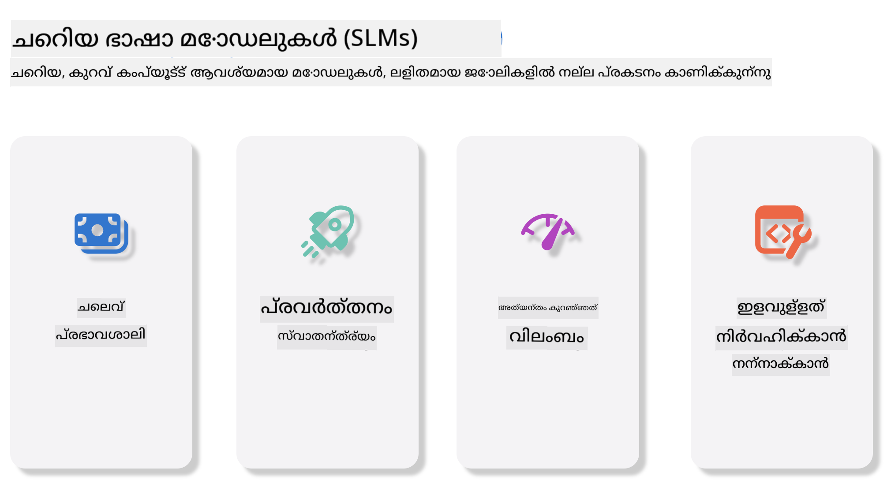

<!--
CO_OP_TRANSLATOR_METADATA:
{
  "original_hash": "124ad36cfe96f74038811b6e2bb93e9d",
  "translation_date": "2025-12-19T19:27:17+00:00",
  "source_file": "19-slm/README.md",
  "language_code": "ml"
}
-->
# ജനറേറ്റീവ് എഐക്കുള്ള ചെറിയ ഭാഷാ മോഡലുകളിലേക്ക് പരിചയം - തുടക്കക്കാർക്കായി
ജനറേറ്റീവ് എഐ പുതിയ ഉള്ളടക്കം സൃഷ്ടിക്കാൻ കഴിവുള്ള സിസ്റ്റങ്ങൾ സൃഷ്ടിക്കുന്നതിൽ കേന്ദ്രീകരിക്കുന്ന കൃത്രിമ ബുദ്ധിമുട്ടിന്റെ ഒരു ആകർഷകമായ മേഖലയാണ്. ഈ ഉള്ളടക്കം വാചകം, ചിത്രങ്ങൾ, സംഗീതം,甚至 മുഴുവൻ വെർച്വൽ പരിസ്ഥിതികൾ വരെ വ്യാപിച്ചിരിക്കും. ജനറേറ്റീവ് എഐയുടെ ഏറ്റവും രസകരമായ പ്രയോഗങ്ങളിൽ ഒന്നാണ് ഭാഷാ മോഡലുകളുടെ മേഖലം.

## ചെറിയ ഭാഷാ മോഡലുകൾ എന്താണ്?

ചെറിയ ഭാഷാ മോഡൽ (SLM) വലിയ ഭാഷാ മോഡലിന്റെ (LLM) ഒരു ചെറുതായുള്ള രൂപമാണ്, LLM-കളുടെ ആർക്കിടെക്ചറൽ സിദ്ധാന്തങ്ങളും സാങ്കേതിക വിദ്യകളും ഉപയോഗിച്ച്, എന്നാൽ ഗണിതശാസ്ത്രപരമായ ഭാരം വളരെ കുറവായിരിക്കുന്നു.

SLM-കൾ മനുഷ്യനുപോലെ വാചകം സൃഷ്ടിക്കാൻ രൂപകൽപ്പന ചെയ്ത ഭാഷാ മോഡലുകളുടെ ഒരു ഉപവിഭാഗമാണ്. GPT-4 പോലുള്ള വലിയ മോഡലുകളെ അപേക്ഷിച്ച്, SLM-കൾ കൂടുതൽ സങ്കുചിതവും കാര്യക്ഷമവുമാണ്, അതിനാൽ കംപ്യൂട്ടേഷൻ വിഭവങ്ങൾ പരിമിതമായ പ്രയോഗങ്ങൾക്ക് അനുയോജ്യമാണ്. ചെറിയ വലുപ്പത്തിലും, അവ വിവിധ തരം പ്രവർത്തനങ്ങൾ നടത്താൻ കഴിയും. സാധാരണയായി, SLM-കൾ LLM-കളെ കംപ്രസ് ചെയ്യുകയോ ഡിസ്റ്റിൽ ചെയ്യുകയോ ചെയ്ത് നിർമ്മിക്കപ്പെടുന്നു, അതിലൂടെ യഥാർത്ഥ മോഡലിന്റെ പ്രവർത്തനക്ഷമതയും ഭാഷാശാസ്ത്ര ശേഷികളും വലിയ തോതിൽ നിലനിർത്താൻ ലക്ഷ്യമിടുന്നു. മോഡൽ വലുപ്പം കുറയ്ക്കുന്നത് മൊത്തത്തിലുള്ള സങ്കീർണ്ണത കുറയ്ക്കുന്നു, അതിനാൽ SLM-കൾ മെമ്മറി ഉപയോഗത്തിലും കംപ്യൂട്ടേഷൻ ആവശ്യകതകളിലും കൂടുതൽ കാര്യക്ഷമമാകുന്നു. ഈ മെച്ചപ്പെടുത്തലുകൾക്കിടയിലും, SLM-കൾ വിവിധ സ്വാഭാവിക ഭാഷാ പ്രോസസ്സിംഗ് (NLP) പ്രവർത്തനങ്ങൾ നടത്താൻ കഴിയും:

- വാചക സൃഷ്ടി: സുസംബന്ധവും സാന്ദർഭികവുമായ വാചകങ്ങൾ അല്ലെങ്കിൽ പാരഗ്രാഫുകൾ സൃഷ്ടിക്കൽ.
- വാചക പൂർത്തീകരണം: നൽകിയ പ്രോംപ്റ്റ് അടിസ്ഥാനമാക്കി വാചകങ്ങൾ പ്രവചിക്കുകയും പൂർത്തിയാക്കുകയും ചെയ്യുക.
- വിവർത്തനം: ഒരു ഭാഷയിൽ നിന്നു മറ്റൊരു ഭാഷയിലേക്ക് വാചകം മാറ്റുക.
- സംഗ്രഹം: നീണ്ട വാചകങ്ങൾ ചുരുക്കി കൂടുതൽ എളുപ്പത്തിൽ വായിക്കാവുന്ന സംഗ്രഹങ്ങളാക്കി മാറ്റുക.

വലിയ മോഡലുകളുമായി താരതമ്യപ്പെടുത്തുമ്പോൾ ചില പ്രകടനമാറ്റങ്ങളും ആഴത്തിലുള്ള മനസ്സിലാക്കലിന്റെ കുറവുകളും ഉണ്ടാകാം.

## ചെറിയ ഭാഷാ മോഡലുകൾ എങ്ങനെ പ്രവർത്തിക്കുന്നു?
SLM-കൾ വൻമാത്രത്തിലുള്ള വാചക ഡാറ്റയിൽ പരിശീലിപ്പിക്കപ്പെടുന്നു. പരിശീലന സമയത്ത്, അവ ഭാഷയുടെ മാതൃകകളും ഘടനകളും പഠിച്ച്, വ്യാകരണപരവും സാന്ദർഭികവുമായ വാചകങ്ങൾ സൃഷ്ടിക്കാൻ കഴിവ് നേടുന്നു. പരിശീലന പ്രക്രിയയിൽ ഉൾപ്പെടുന്നത്:

- ഡാറ്റ ശേഖരണം: വിവിധ ഉറവിടങ്ങളിൽ നിന്നുള്ള വാചക ഡാറ്റാ സെറ്റുകൾ ശേഖരിക്കൽ.
- പ്രീപ്രോസസ്സിംഗ്: പരിശീലനത്തിന് അനുയോജ്യമായ രീതിയിൽ ഡാറ്റ ശുദ്ധീകരിക്കുകയും ക്രമീകരിക്കുകയും ചെയ്യുക.
- പരിശീലനം: മെഷീൻ ലേണിംഗ് ആൽഗോരിതങ്ങൾ ഉപയോഗിച്ച് മോഡലിനെ വാചകം മനസ്സിലാക്കാനും സൃഷ്ടിക്കാനും പഠിപ്പിക്കുക.
- ഫൈൻ-ട്യൂണിംഗ്: പ്രത്യേക പ്രവർത്തനങ്ങളിൽ മോഡലിന്റെ പ്രകടനം മെച്ചപ്പെടുത്താൻ ക്രമീകരിക്കൽ.

SLM-കളുടെ വികസനം, മൊബൈൽ ഉപകരണങ്ങൾ അല്ലെങ്കിൽ എഡ്ജ് കംപ്യൂട്ടിംഗ് പ്ലാറ്റ്ഫോമുകൾ പോലുള്ള വിഭവപരിമിതമായ പരിസ്ഥിതികളിൽ വിന്യസിക്കാൻ കഴിയുന്ന മോഡലുകളുടെ ആവശ്യകത കൂടുന്നതോടൊപ്പം പൊരുത്തപ്പെടുന്നു, കാരണം പൂർണ്ണ വലുപ്പമുള്ള LLM-കൾ അവരുടെ ഭാരമുള്ള വിഭവ ആവശ്യങ്ങൾ കാരണം പ്രായോഗികമല്ല. കാര്യക്ഷമതയിൽ ശ്രദ്ധ കേന്ദ്രീകരിച്ച്, SLM-കൾ പ്രകടനവും ലഭ്യതയും തമ്മിൽ സമതുലനം പുലർത്തുന്നു, വിവിധ മേഖലകളിൽ വ്യാപകമായ പ്രയോഗം സാധ്യമാക്കുന്നു.



## പഠന ലക്ഷ്യങ്ങൾ

ഈ പാഠത്തിൽ, SLM-യുടെ അറിവ് പരിചയപ്പെടുത്തുകയും അതിനെ Microsoft Phi-3-നൊപ്പം സംയോജിപ്പിച്ച് വാചക ഉള്ളടക്കം, ദൃശ്യവും MoE-വുമായ വ്യത്യസ്ത സാഹചര്യങ്ങൾ പഠിക്കാനാണ് ഞങ്ങൾ ലക്ഷ്യമിടുന്നത്.

ഈ പാഠം അവസാനിക്കുമ്പോൾ, നിങ്ങൾക്ക് താഴെ പറയുന്ന ചോദ്യങ്ങൾക്ക് ഉത്തരം നൽകാൻ കഴിയണം:

- SLM എന്താണ്
- SLM-നും LLM-നും തമ്മിലുള്ള വ്യത്യാസം എന്താണ്
- Microsoft Phi-3/3.5 കുടുംബം എന്താണ്
- Microsoft Phi-3/3.5 കുടുംബത്തെ എങ്ങനെ ഇൻഫറൻസ് ചെയ്യാം

സജ്ജമാണോ? തുടങ്ങാം.

## വലിയ ഭാഷാ മോഡലുകൾ (LLMs) ഉം ചെറിയ ഭാഷാ മോഡലുകൾ (SLMs) ഉം തമ്മിലുള്ള വ്യത്യാസങ്ങൾ

LLM-കളും SLM-കളും പ്രൊബബിലിസ്റ്റിക് മെഷീൻ ലേണിംഗിന്റെ അടിസ്ഥാന സിദ്ധാന്തങ്ങളിൽ നിർമ്മിക്കപ്പെട്ടവയാണ്, അവയുടെ ആർക്കിടെക്ചറൽ രൂപകൽപ്പന, പരിശീലന രീതി, ഡാറ്റ സൃഷ്ടി പ്രക്രിയകൾ, മോഡൽ മൂല്യനിർണയം എന്നിവയിൽ സമാന സമീപനങ്ങൾ പിന്തുടരുന്നു. എന്നാൽ, ഈ രണ്ട് മോഡലുകൾ തമ്മിൽ ചില പ്രധാന വ്യത്യാസങ്ങൾ ഉണ്ട്.

## ചെറിയ ഭാഷാ മോഡലുകളുടെ പ്രയോഗങ്ങൾ

SLM-കൾക്ക് വ്യാപകമായ പ്രയോഗങ്ങൾ ഉണ്ട്, അവയിൽ ചിലത്:

- ചാറ്റ്ബോട്ടുകൾ: ഉപഭോക്തൃ പിന്തുണ നൽകുകയും ഉപയോക്താക്കളുമായി സംഭാഷണ രീതിയിൽ ഇടപഴകുകയും ചെയ്യുക.
- ഉള്ളടക്കം സൃഷ്ടി: എഴുത്തുകാരെ ആശയങ്ങൾ സൃഷ്ടിക്കാനോ മുഴുവൻ ലേഖനങ്ങൾ രൂപകൽപ്പന ചെയ്യാനോ സഹായിക്കുക.
- വിദ്യാഭ്യാസം: വിദ്യാർത്ഥികൾക്ക് എഴുത്ത് അസൈൻമെന്റുകളിലും പുതിയ ഭാഷകൾ പഠിക്കലിലും സഹായിക്കുക.
- ആക്സസിബിലിറ്റി: ടെക്സ്റ്റ്-ടു-സ്പീച്ച് സിസ്റ്റങ്ങൾ പോലുള്ള വൈകല്യമുള്ള വ്യക്തികൾക്കുള്ള ഉപകരണങ്ങൾ സൃഷ്ടിക്കുക.

**വലുപ്പം**

LLM-കളും SLM-കളും തമ്മിലുള്ള പ്രധാന വ്യത്യാസം മോഡലുകളുടെ വലുപ്പത്തിലാണ്. ChatGPT (GPT-4) പോലുള്ള LLM-കൾ ഏകദേശം 1.76 ട്രില്യൺ പാരാമീറ്ററുകൾ ഉൾക്കൊള്ളാം, എന്നാൽ Mistral 7B പോലുള്ള ഓപ്പൺ സോഴ്‌സ് SLM-കൾ ഏകദേശം 7 ബില്യൺ പാരാമീറ്ററുകൾ മാത്രമാണ് ഉള്ളത്. ഈ വ്യത്യാസം പ്രധാനമായും മോഡൽ ആർക്കിടെക്ചറും പരിശീലന പ്രക്രിയകളും തമ്മിലുള്ള വ്യത്യാസങ്ങളാൽ ആണ്. ഉദാഹരണത്തിന്, ChatGPT എൻകോഡർ-ഡികോഡർ ഘടനയിൽ സ്വയം-ശ്രദ്ധ (self-attention) മെക്കാനിസം ഉപയോഗിക്കുന്നു, എന്നാൽ Mistral 7B ഡികോഡർ മാത്രം മോഡലിൽ സ്ലൈഡിംഗ് വിൻഡോ ശ്രദ്ധ ഉപയോഗിക്കുന്നു, ഇത് കൂടുതൽ കാര്യക്ഷമമായ പരിശീലനം സാധ്യമാക്കുന്നു. ഈ ആർക്കിടെക്ചറൽ വ്യത്യാസം മോഡലുകളുടെ സങ്കീർണ്ണതയിലും പ്രകടനത്തിലും വലിയ സ്വാധീനം ചെലുത്തുന്നു.

**അർത്ഥം**

SLM-കൾ സാധാരണയായി പ്രത്യേക മേഖലകളിൽ മികച്ച പ്രകടനത്തിനായി ഒപ്റ്റിമൈസ് ചെയ്യപ്പെട്ടവയാണ്, അതിനാൽ അവ വളരെ പ്രത്യേകതയുള്ളവയാണ്, എന്നാൽ വിവിധ അറിവ് മേഖലകളിൽ വ്യാപകമായ സാന്ദർഭിക മനസ്സിലാക്കൽ നൽകുന്നതിൽ പരിമിതമായിരിക്കാം. മറുവശത്ത്, LLM-കൾ മനുഷ്യനുപോലെ ബുദ്ധിമുട്ട് സിമുലേറ്റ് ചെയ്യാൻ ലക്ഷ്യമിടുന്നു. വൻ, വൈവിധ്യമാർന്ന ഡാറ്റാസെറ്റുകളിൽ പരിശീലിപ്പിച്ച LLM-കൾ വിവിധ മേഖലകളിൽ മികച്ച പ്രകടനം നൽകാൻ രൂപകൽപ്പന ചെയ്തവയാണ്, കൂടുതൽ വൈവിധ്യവും അനുയോജ്യതയും നൽകുന്നു. അതിനാൽ, LLM-കൾ സ്വാഭാവിക ഭാഷാ പ്രോസസ്സിംഗ്, പ്രോഗ്രാമിംഗ് തുടങ്ങിയ വ്യാപകമായ ഡൗൺസ്ട്രീം പ്രവർത്തനങ്ങൾക്ക് കൂടുതൽ അനുയോജ്യമാണ്.

**കമ്പ്യൂട്ടിംഗ്**

LLM-കളുടെ പരിശീലനവും വിന്യസനവും വലിയ കംപ്യൂട്ടേഷൻ വിഭവങ്ങൾ ആവശ്യപ്പെടുന്ന പ്രക്രിയകളാണ്, സാധാരണയായി വലിയ GPU ക്ലസ്റ്ററുകൾ ഉൾപ്പെടുന്നു. ഉദാഹരണത്തിന്, ChatGPT പോലുള്ള മോഡൽ പൂർത്തിയായി പരിശീലിപ്പിക്കാൻ ആയിരക്കണക്കിന് GPUകൾ ദീർഘകാലം ആവശ്യമായേക്കാം. മറുവശത്ത്, SLM-കൾ ചെറിയ പാരാമീറ്റർ എണ്ണമുള്ളതിനാൽ കംപ്യൂട്ടേഷൻ വിഭവങ്ങളുടെ കാര്യത്തിൽ കൂടുതൽ ലഭ്യമാണ്. Mistral 7B പോലുള്ള മോഡലുകൾ മിതമായ GPU ശേഷിയുള്ള പ്രാദേശിക യന്ത്രങ്ങളിൽ പരിശീലിപ്പിക്കുകയും പ്രവർത്തിപ്പിക്കുകയും ചെയ്യാം, എങ്കിലും പരിശീലനം പല GPUകളിൽ മണിക്കൂറുകൾക്കു നീണ്ടുനിൽക്കാം.

**പക്ഷപാതം**

LLM-കളിൽ പരിശീലന ഡാറ്റയുടെ സ്വഭാവം കാരണം പക്ഷപാതം ഒരു പ്രശ്നമാണ്. ഈ മോഡലുകൾ സാധാരണയായി ഇന്റർനെറ്റിൽ ലഭ്യമായ കച്ച ഡാറ്റയിൽ ആശ്രയിച്ചിരിക്കുന്നു, ഇത് ചില ഗ്രൂപ്പുകൾ കുറവായി പ്രതിനിധീകരിക്കപ്പെടുകയോ തെറ്റായ ലേബലിംഗ് ഉണ്ടാകുകയോ ഭാഷാശൈലി, ഭൂമിശാസ്ത്ര വ്യത്യാസങ്ങൾ, വ്യാകരണ നിയമങ്ങൾ എന്നിവയുടെ സ്വാധീനത്തിൽ ഭാഷാപക്ഷപാതം ഉണ്ടാകുകയോ ചെയ്യാം. കൂടാതെ, LLM-കളുടെ സങ്കീർണ്ണത ഈ പക്ഷപാതം അനാവശ്യമായി വർദ്ധിപ്പിക്കാം, ഇത് സൂക്ഷ്മമായ ഫൈൻ-ട്യൂണിംഗ് ഇല്ലാതെ ശ്രദ്ധിക്കപ്പെടാതെ പോകാം. മറുവശത്ത്, SLM-കൾ കൂടുതൽ നിയന്ത്രിതമായ, ഡൊമെയ്ൻ-സ്പെസിഫിക് ഡാറ്റാസെറ്റുകളിൽ പരിശീലിപ്പിക്കപ്പെട്ടതിനാൽ ഇത്തരം പക്ഷപാതങ്ങൾക്ക് കുറവാണ്, എങ്കിലും അവ പൂർണ്ണമായും ഒഴിവാക്കാനാകില്ല.

**ഇൻഫറൻസ്**

SLM-കളുടെ വലുപ്പം കുറവായതിനാൽ ഇൻഫറൻസ് വേഗത്തിൽ വലിയ നേട്ടം ലഭിക്കുന്നു, അവ പ്രാദേശിക ഹാർഡ്‌വെയറിൽ കാര്യക്ഷമമായി ഔട്ട്പുട്ട് സൃഷ്ടിക്കാൻ കഴിയും, വ്യാപകമായ പാരലൽ പ്രോസസ്സിംഗ് ആവശ്യമില്ലാതെ. മറുവശത്ത്, LLM-കൾ വലുപ്പവും സങ്കീർണ്ണതയും കാരണം അംഗീകരനീയമായ ഇൻഫറൻസ് സമയങ്ങൾ നേടാൻ വലിയ പാരലൽ കംപ്യൂട്ടേഷൻ വിഭവങ്ങൾ ആവശ്യപ്പെടുന്നു. ഒരേ സമയം നിരവധി ഉപയോക്താക്കൾ ഉപയോഗിക്കുമ്പോൾ LLM-കളുടെ പ്രതികരണ സമയം കൂടുതൽ മന്ദഗതിയാകും, പ്രത്യേകിച്ച് വ്യാപകമായി വിന്യസിക്കുമ്പോൾ.

സംഗ്രഹത്തിൽ, LLM-കളും SLM-കളും മെഷീൻ ലേണിംഗിന്റെ അടിസ്ഥാനത്തിൽ നിർമ്മിക്കപ്പെട്ടവയെങ്കിലും, മോഡൽ വലുപ്പം, വിഭവ ആവശ്യകത, സാന്ദർഭിക മനസ്സിലാക്കൽ, പക്ഷപാതം, ഇൻഫറൻസ് വേഗം എന്നിവയിൽ വലിയ വ്യത്യാസങ്ങൾ കാണിക്കുന്നു. ഈ വ്യത്യാസങ്ങൾ അവയുടെ വ്യത്യസ്ത ഉപയോഗ സാഹചര്യങ്ങൾക്ക് അനുയോജ്യമായതും, LLM-കൾ കൂടുതൽ വൈവിധ്യമാർന്നതും വിഭവഭാരമുള്ളതും, SLM-കൾ കുറവായ കംപ്യൂട്ടേഷൻ ആവശ്യകതയോടെ കൂടുതൽ ഡൊമെയ്ൻ-സ്പെസിഫിക് കാര്യക്ഷമത നൽകുന്നതുമായതും ആണ്.

***കുറിപ്പ്: ഈ അധ്യായത്തിൽ, Microsoft Phi-3 / 3.5 ഉപയോഗിച്ച് SLM പരിചയപ്പെടുത്തും.***

## Phi-3 / Phi-3.5 കുടുംബം പരിചയപ്പെടുത്തൽ

Phi-3 / 3.5 കുടുംബം പ്രധാനമായും വാചകം, ദൃശ്യവും ഏജന്റ് (MoE) പ്രയോഗ സാഹചര്യങ്ങൾ ലക്ഷ്യമിടുന്നു:

### Phi-3 / 3.5 ഇൻസ്ട്രക്റ്റ്

പ്രധാനമായും വാചക സൃഷ്ടി, ചാറ്റ് പൂർത്തീകരണം, ഉള്ളടക്കം വിവരങ്ങൾ എടുക്കൽ തുടങ്ങിയവയ്ക്ക്.

**Phi-3-മിനി**

3.8B പാരാമീറ്ററുള്ള ഭാഷാ മോഡൽ Microsoft Azure AI Studio, Hugging Face, Ollama എന്നിവയിൽ ലഭ്യമാണ്. Phi-3 മോഡലുകൾ തുല്യവും വലിയ വലുപ്പമുള്ള ഭാഷാ മോഡലുകളെ പ്രധാന ബഞ്ച്മാർക്കുകളിൽ (താഴെ കാണുന്ന ബഞ്ച്മാർക്ക് സംഖ്യകൾ, ഉയർന്ന സംഖ്യകൾ മികച്ചതാണ്) വളരെ മികവുറ്റതാക്കുന്നു. Phi-3-മിനി തുല്യ വലുപ്പമുള്ള മോഡലുകളെ ഇരട്ടിയോളം മറികടക്കുന്നു, Phi-3-സ്മോൾ, Phi-3-മീഡിയം മോഡലുകൾ GPT-3.5 ഉൾപ്പെടെയുള്ള വലിയ മോഡലുകളെ മറികടക്കുന്നു.

**Phi-3-സ്മോൾ & മീഡിയം**

7B പാരാമീറ്ററുകൾ മാത്രം ഉള്ള Phi-3-സ്മോൾ വിവിധ ഭാഷാ, തർക്കം, കോഡിംഗ്, ഗണിത ബഞ്ച്മാർക്കുകളിൽ GPT-3.5T-നെ മറികടക്കുന്നു.

14B പാരാമീറ്ററുള്ള Phi-3-മീഡിയം ഈ പ്രവണത തുടർന്നു Gemini 1.0 Pro-നെ മറികടക്കുന്നു.

**Phi-3.5-മിനി**

Phi-3-മിനിയുടെ അപ്ഗ്രേഡായി കരുതാം. പാരാമീറ്ററുകൾ മാറ്റമില്ലെങ്കിലും, 20+ ഭാഷകൾ (അറബിക്, ചൈനീസ്, ചെക്ക്, ഡാനിഷ്, ഡച്ച്, ഇംഗ്ലീഷ്, ഫിന്നിഷ്, ഫ്രഞ്ച്, ജർമ്മൻ, ഹീബ്രു, ഹംഗേറിയൻ, ഇറ്റാലിയൻ, ജാപ്പനീസ്, കൊറിയൻ, നോർവീജിയൻ, പോളിഷ്, പോർച്ചുഗീസ്, റഷ്യൻ, സ്പാനിഷ്, സ്വീഡിഷ്, തായ്, ടർക്കിഷ്, ഉക്രെയ്‌നിയൻ) പിന്തുണയ്ക്കുകയും ദീർഘ സാന്ദർഭിക പിന്തുണ ശക്തിപ്പെടുത്തുകയും ചെയ്യുന്നു.

3.8B പാരാമീറ്ററുള്ള Phi-3.5-മിനി തുല്യ വലുപ്പമുള്ള ഭാഷാ മോഡലുകളെ മറികടക്കുകയും ഇരട്ട വലുപ്പമുള്ള മോഡലുകളുമായി തുല്യമായ പ്രകടനം നൽകുകയും ചെയ്യുന്നു.

### Phi-3 / 3.5 ദൃശ്യങ്ങൾ

Phi-3/3.5-ന്റെ ഇൻസ്ട്രക്റ്റ് മോഡൽ Phi-യുടെ മനസ്സിലാക്കൽ കഴിവായി കരുതാം, Vision Phi-യ്ക്ക് ലോകം മനസ്സിലാക്കാനുള്ള കണ്ണുകളാണ്.

**Phi-3-വിഷൻ**

4.2B പാരാമീറ്ററുകൾ മാത്രം ഉള്ള Phi-3-വിഷൻ ഈ പ്രവണത തുടർന്നു Claude-3 Haiku, Gemini 1.0 Pro V പോലുള്ള വലിയ മോഡലുകളെ പൊതുവായ ദൃശ്യ തർക്കം, OCR, പട്ടികകളും രേഖാചിത്രങ്ങളും മനസ്സിലാക്കൽ പ്രവർത്തനങ്ങളിൽ മറികടക്കുന്നു.

**Phi-3.5-വിഷൻ**

Phi-3-വിഷന്റെ അപ്ഗ്രേഡാണ് Phi-3.5-വിഷൻ, ഇത് ബഹുചിത്ര പിന്തുണ ചേർക്കുന്നു. ഇത് ദൃശ്യത്തിൽ മെച്ചപ്പെടുത്തലായി കരുതാം, നിങ്ങൾക്ക് ചിത്രങ്ങൾ മാത്രമല്ല, വീഡിയോകളും കാണാനാകും.

Phi-3.5-വിഷൻ Claude-3.5 Sonnet, Gemini 1.5 Flash പോലുള്ള വലിയ മോഡലുകളെ OCR, പട്ടിക, ചാർട്ട് മനസ്സിലാക്കൽ പ്രവർത്തനങ്ങളിൽ മറികടക്കുന്നു, പൊതുവായ ദൃശ്യ അറിവ് തർക്കത്തിൽ തുല്യമാണ്. ബഹുഫ്രെയിം ഇൻപുട്ട് പിന്തുണയ്ക്കുന്നു, അതായത് നിരവധി ഇൻപുട്ട് ചിത്രങ്ങളിൽ തർക്കം നടത്തുന്നു.

### Phi-3.5-MoE

***Mixture of Experts (MoE)*** മോഡലുകൾ വളരെ കുറവ് കംപ്യൂട്ടേഷൻ ഉപയോഗിച്ച് പ്രീട്രെയിൻ ചെയ്യാൻ സാധ്യമാക്കുന്നു, അതായത് ഡെൻസ് മോഡലിനൊപ്പം ഉള്ള സമാന കംപ്യൂട്ട് ബജറ്റിൽ മോഡലിന്റെയും ഡാറ്റാസെറ്റിന്റെയും വലുപ്പം നിഗമനാത്മകമായി വർദ്ധിപ്പിക്കാം. പ്രത്യേകിച്ച്, MoE മോഡൽ പ്രീട്രെയിനിംഗിൽ അതിന്റെ ഡെൻസ് സമാനത്വത്തേക്കാൾ വേഗത്തിൽ സമാന ഗുണമേന്മ നേടണം.

Phi-3.5-MoE 16x3.8B വിദഗ്ധ മോഡ്യൂളുകൾ ഉൾക്കൊള്ളുന്നു. 6.6B സജീവ പാരാമീറ്ററുകൾ മാത്രം ഉള്ള Phi-3.5-MoE വലിയ മോഡലുകളെ തുല്യമായ തർക്കം, ഭാഷാ മനസ്സിലാക്കൽ, ഗണിതം എന്നിവയിൽ എത്തുന്നു.

നാം വ്യത്യസ്ത സാഹചര്യങ്ങളിൽ Phi-3/3.5 കുടുംബ മോഡലുകൾ ഉപയോഗിക്കാം. LLM-കളെ അപേക്ഷിച്ച്, Phi-3/3.5-മിനി അല്ലെങ്കിൽ Phi-3/3.5-വിഷൻ എഡ്ജ് ഉപകരണങ്ങളിൽ വിന്യസിക്കാം.

## Phi-3/3.5 കുടുംബ മോഡലുകൾ എങ്ങനെ ഉപയോഗിക്കാം

നാം Phi-3/3.5 വ്യത്യസ്ത സാഹചര്യങ്ങളിൽ ഉപയോഗിക്കാൻ ആഗ്രഹിക്കുന്നു. അടുത്തതായി, വ്യത്യസ്ത സാഹചര്യങ്ങളിൽ Phi-3/3.5 ഉപയോഗിക്കുന്നതിനെക്കുറിച്ച് പഠിക്കാം.


### ക്ലൗഡിന്റെ API-യുടെ ഇൻഫറൻസ് വ്യത്യാസം

**GitHub മോഡലുകൾ**

GitHub മോഡലുകൾ ഏറ്റവും നേരിട്ടുള്ള മാർഗമാണ്. GitHub മോഡലുകൾ വഴി Phi-3/3.5-ഇൻസ്ട്രക്റ്റ് മോഡലിലേക്ക് വേഗത്തിൽ പ്രവേശിക്കാം. Azure AI Inference SDK / OpenAI SDK-യുമായി സംയോജിപ്പിച്ച്, കോഡ് വഴി API-യിലേക്ക് പ്രവേശിച്ച് Phi-3/3.5-ഇൻസ്ട്രക്റ്റ് കോൾ പൂർത്തിയാക്കാം. പ്ലേഗ്രൗണ്ടിലൂടെ വ്യത്യസ്ത ഫലങ്ങൾ പരീക്ഷിക്കാനും കഴിയും.

- ഡെമോ: ചൈനീസ് സാഹചര്യങ്ങളിൽ Phi-3-മിനി, Phi-3.5-മിനി ഫലങ്ങളുടെ താരതമ്യം


**Azure AI സ്റ്റുഡിയോ**

അല്ലെങ്കിൽ, ദൃശ്യവും MoE മോഡലുകളും ഉപയോഗിക്കാൻ Azure AI സ്റ്റുഡിയോ ഉപയോഗിച്ച് കോൾ പൂർത്തിയാക്കാം. താൽപര്യമുണ്ടെങ്കിൽ, Phi-3 കുക്ക്ബുക്ക് വായിച്ച് Azure AI സ്റ്റുഡിയോ വഴി Phi-3/3.5 ഇൻസ്ട്രക്റ്റ്, വിഷൻ, MoE കോൾ എങ്ങനെ ചെയ്യാമെന്ന് പഠിക്കാം [ഈ ലിങ്ക് ക്ലിക്ക് ചെയ്യുക](https://github.com/microsoft/Phi-3CookBook/blob/main/md/02.QuickStart/AzureAIStudio_QuickStart.md?WT.mc_id=academic-105485-koreyst)

**NVIDIA NIM**

Azure, GitHub എന്നിവ നൽകുന്ന ക്ലൗഡ് അടിസ്ഥാനമാക്കിയ മോഡൽ കാറ്റലോഗ് പരിഹാരങ്ങളോടൊപ്പം, [NVIDIA NIM](https://developer.nvidia.com/nim?WT.mc_id=academic-105485-koreyst) ഉപയോഗിച്ച് ബന്ധപ്പെട്ട കോൾ പൂർത്തിയാക്കാം. Phi-3/3.5 കുടുംബത്തിന്റെ API കോൾ പൂർത്തിയാക്കാൻ NVIDIA NIM സന്ദർശിക്കാം. NVIDIA NIM (NVIDIA Inference Microservices) വിവിധ പരിസ്ഥിതികളിൽ, ക്ലൗഡുകൾ, ഡാറ്റ സെന്ററുകൾ, വർക്ക്‌സ്റ്റേഷനുകൾ ഉൾപ്പെടെ, എഐ മോഡലുകൾ കാര്യക്ഷമമായി വിന്യസിക്കാൻ സഹായിക്കുന്ന വേഗതയേറിയ ഇൻഫറൻസ് മൈക്രോസർവീസുകളുടെ ഒരു സമാഹാരമാണ്.

NVIDIA NIM-ന്റെ ചില പ്രധാന സവിശേഷതകൾ:

- **വിന്യാസ സൗകര്യം:** NIM ഒരു കമാൻഡ് ഉപയോഗിച്ച് എഐ മോഡലുകൾ വിന്യസിക്കാൻ അനുവദിക്കുന്നു, നിലവിലുള്ള പ്രവൃത്തിപദ്ധതികളിൽ എളുപ്പത്തിൽ സംയോജിപ്പിക്കാൻ.
- **പ്രകടന മെച്ചപ്പെടുത്തൽ:** TensorRT, TensorRT-LLM പോലുള്ള NVIDIAയുടെ മുൻകൂട്ടി ഒപ്റ്റിമൈസ് ചെയ്ത ഇൻഫറൻസ് എഞ്ചിനുകൾ ഉപയോഗിച്ച് കുറഞ്ഞ വൈകിയിലും ഉയർന്ന ത്രൂപുട്ടും ഉറപ്പാക്കുന്നു.
- **സ്കെയിലബിലിറ്റി:** NIM കുബർനെറ്റിസിൽ ഓട്ടോസ്കെയിലിംഗ് പിന്തുണയ്ക്കുന്നു, വ്യത്യസ്ത ജോലിഭാരങ്ങൾ ഫലപ്രദമായി കൈകാര്യം ചെയ്യാൻ.
- **സുരക്ഷയും നിയന്ത്രണവും:** സംഘടനകൾ അവരുടെ ഡാറ്റയും ആപ്ലിക്കേഷനുകളും സ്വയം നിയന്ത്രിക്കുന്ന മാനേജുചെയ്യുന്ന ഇൻഫ്രാസ്ട്രക്ചറിൽ NIM മൈക്രോസർവീസുകൾ സ്വയം ഹോസ്റ്റ് ചെയ്ത് നിയന്ത്രണം നിലനിർത്താൻ കഴിയും.
- **സ്റ്റാൻഡേർഡ് APIകൾ:** NIM വ്യവസായ സ്റ്റാൻഡേർഡ് APIകൾ നൽകുന്നു, ചാറ്റ്ബോട്ടുകൾ, AI അസിസ്റ്റന്റുകൾ തുടങ്ങിയ AI ആപ്ലിക്കേഷനുകൾ എളുപ്പത്തിൽ നിർമ്മിക്കുകയും സംയോജിപ്പിക്കുകയും ചെയ്യാൻ സഹായിക്കുന്നു.

NIM NVIDIA AI എന്റർപ്രൈസിന്റെ ഭാഗമാണ്, ഇത് AI മോഡലുകളുടെ വിന്യാസവും പ്രവർത്തനക്ഷമതയും എളുപ്പമാക്കാൻ ലക്ഷ്യമിടുന്നു, NVIDIA GPUകളിൽ അവ കാര്യക്ഷമമായി പ്രവർത്തിക്കുമെന്ന് ഉറപ്പാക്കുന്നു.

- ഡെമോ: Nividia NIM ഉപയോഗിച്ച് Phi-3.5-Vision-API വിളിക്കൽ [[ഈ ലിങ്ക് ക്ലിക്ക് ചെയ്യുക](./python/Phi-3-Vision-Nividia-NIM.ipynb?WT.mc_id=academic-105485-koreyst)]


### പ്രാദേശിക പരിസ്ഥിതിയിൽ Phi-3/3.5 ഇൻഫറൻസ്
Phi-3 അല്ലെങ്കിൽ GPT-3 പോലുള്ള ഏതെങ്കിലും ഭാഷാ മോഡലുമായി ബന്ധപ്പെട്ട ഇൻഫറൻസ് എന്നത്, ലഭിക്കുന്ന ഇൻപുട്ട് അടിസ്ഥാനമാക്കി പ്രതികരണങ്ങൾ അല്ലെങ്കിൽ പ്രവചനങ്ങൾ സൃഷ്ടിക്കുന്ന പ്രക്രിയയെ സൂചിപ്പിക്കുന്നു. Phi-3-ന് നിങ്ങൾ ഒരു പ്രോംപ്റ്റ് അല്ലെങ്കിൽ ചോദ്യം നൽകുമ്പോൾ, അത് പരിശീലിപ്പിച്ച ഡാറ്റയിലെ പാറ്റേണുകളും ബന്ധങ്ങളും വിശകലനം ചെയ്ത് ഏറ്റവും സാധ്യതയുള്ള, പ്രസക്തമായ പ്രതികരണം നിർണ്ണയിക്കാൻ പരിശീലിച്ച ന്യൂറൽ നെറ്റ്‌വർക്കിനെ ഉപയോഗിക്കുന്നു.

**Hugging Face Transformer**  
Hugging Face Transformers ഒരു ശക്തമായ ലൈബ്രറിയാണ്, ഇത് സ്വാഭാവിക ഭാഷാ പ്രോസസ്സിംഗ് (NLP) ഉൾപ്പെടെ മറ്റ് മെഷീൻ ലേണിംഗ് ടാസ്കുകൾക്കായി രൂപകൽപ്പന ചെയ്തതാണ്. ഇതിന്റെ പ്രധാനപ്പെട്ട ചില കാര്യങ്ങൾ:

1. **പ്രീട്രെയിൻഡ് മോഡലുകൾ**: ടെക്സ്റ്റ് ക്ലാസിഫിക്കേഷൻ, നെയിംഡ് എന്റിറ്റി റെക്കഗ്നിഷൻ, ചോദ്യോത്തരങ്ങൾ, സംഗ്രഹം, വിവർത്തനം, ടെക്സ്റ്റ് ജനറേഷൻ തുടങ്ങിയ വിവിധ ടാസ്കുകൾക്കായി ഉപയോഗിക്കാവുന്ന ആയിരക്കണക്കിന് പ്രീട്രെയിൻഡ് മോഡലുകൾ നൽകുന്നു.

2. **ഫ്രെയിംവർക്ക് ഇന്റർഓപ്പറബിലിറ്റി**: PyTorch, TensorFlow, JAX എന്നിവ ഉൾപ്പെടെ പല ഡീപ് ലേണിംഗ് ഫ്രെയിംവർക്കുകളും പിന്തുണയ്ക്കുന്നു. ഇതിലൂടെ ഒരു ഫ്രെയിംവർക്കിൽ മോഡൽ ട്രെയിൻ ചെയ്ത് മറ്റൊന്നിൽ ഉപയോഗിക്കാം.

3. **മൾട്ടിമോഡൽ കഴിവുകൾ**: NLP പുറമേ, Hugging Face Transformers കമ്പ്യൂട്ടർ വിഷൻ (ഉദാ: ഇമേജ് ക്ലാസിഫിക്കേഷൻ, ഒബ്ജക്റ്റ് ഡിറ്റക്ഷൻ) ആൻഡ് ഓഡിയോ പ്രോസസ്സിംഗ് (ഉദാ: സ്പീച്ച് റെക്കഗ്നിഷൻ, ഓഡിയോ ക്ലാസിഫിക്കേഷൻ) ടാസ്കുകളും പിന്തുണയ്ക്കുന്നു.

4. **ഉപയോഗസൗകര്യം**: മോഡലുകൾ എളുപ്പത്തിൽ ഡൗൺലോഡ് ചെയ്ത് ഫൈൻ-ട്യൂൺ ചെയ്യാൻ APIകളും ടൂളുകളും നൽകുന്നു, തുടക്കക്കാരും വിദഗ്ധരും എളുപ്പത്തിൽ ഉപയോഗിക്കാവുന്നതാണ്.

5. **സമൂഹവും വിഭവങ്ങളും**: Hugging Face-ന് സജീവമായ ഒരു സമൂഹവും വ്യാപകമായ ഡോക്യുമെന്റേഷനും ട്യൂട്ടോറിയലുകളും ഗൈഡുകളും ഉണ്ട്, ഉപയോക്താക്കൾക്ക് ആരംഭിക്കാൻ സഹായിക്കുന്നു.  
[അധികൃത ഡോക്യുമെന്റേഷൻ](https://huggingface.co/docs/transformers/index?WT.mc_id=academic-105485-koreyst) അല്ലെങ്കിൽ അവരുടെ [GitHub റിപോസിറ്ററി](https://github.com/huggingface/transformers?WT.mc_id=academic-105485-koreyst).

ഇത് ഏറ്റവും സാധാരണമായി ഉപയോഗിക്കുന്ന രീതിയാണ്, പക്ഷേ GPU ആക്സിലറേഷൻ ആവശ്യമാണ്. കാരണം Vision, MoE പോലുള്ള രംഗങ്ങൾ വളരെ കണക്കുകൂട്ടലുകൾ ആവശ്യപ്പെടുന്നു, ക്വാണ്ടൈസേഷൻ ഇല്ലെങ്കിൽ CPUയിൽ ഇത് വളരെ പരിമിതമായിരിക്കും.


- ഡെമോ: Transformer ഉപയോഗിച്ച് Phi-3.5-Instuct വിളിക്കൽ [ഈ ലിങ്ക് ക്ലിക്ക് ചെയ്യുക](./python/phi35-instruct-demo.ipynb?WT.mc_id=academic-105485-koreyst)

- ഡെമോ: Transformer ഉപയോഗിച്ച് Phi-3.5-Vision വിളിക്കൽ [ഈ ലിങ്ക് ക്ലിക്ക് ചെയ്യുക](./python/phi35-vision-demo.ipynb?WT.mc_id=academic-105485-koreyst)

- ഡെമോ: Transformer ഉപയോഗിച്ച് Phi-3.5-MoE വിളിക്കൽ [ഈ ലിങ്ക് ക്ലിക്ക് ചെയ്യുക](./python/phi35_moe_demo.ipynb?WT.mc_id=academic-105485-koreyst)

**Ollama**  
[Ollama](https://ollama.com/?WT.mc_id=academic-105485-koreyst) നിങ്ങളുടെ മെഷീനിൽ വലിയ ഭാഷാ മോഡലുകൾ (LLMs) പ്രാദേശികമായി എളുപ്പത്തിൽ പ്രവർത്തിപ്പിക്കാൻ രൂപകൽപ്പന ചെയ്ത പ്ലാറ്റ്ഫോമാണ്. Llama 3.1, Phi 3, Mistral, Gemma 2 തുടങ്ങിയ മോഡലുകൾ പിന്തുണയ്ക്കുന്നു. മോഡൽ വെയിറ്റുകൾ, കോൺഫിഗറേഷൻ, ഡാറ്റ എന്നിവ ഒറ്റ പാക്കേജായി ബണ്ടിൽ ചെയ്ത് ഉപയോക്താക്കൾക്ക് മോഡലുകൾ ഇഷ്ടാനുസൃതമാക്കാനും സൃഷ്ടിക്കാനും എളുപ്പമാക്കുന്നു. macOS, Linux, Windows എന്നിവയ്ക്ക് ലഭ്യമാണ്. ക്ലൗഡ് സേവനങ്ങളിൽ ആശ്രയിക്കാതെ LLMs പരീക്ഷിക്കാനും വിന്യസിക്കാനും ഇത് മികച്ച ഉപകരണം ആണ്. Ollama ഏറ്റവും നേരിട്ടുള്ള മാർഗമാണ്, താഴെ കാണുന്ന സ്റ്റേറ്റ്മെന്റ് എക്സിക്യൂട്ട് ചെയ്യുക.


```bash

ollama run phi3.5

```


**GenAI-ക്കായി ONNX റൺടൈം**

[ONNX Runtime](https://github.com/microsoft/onnxruntime-genai?WT.mc_id=academic-105485-koreyst) ഒരു ക്രോസ്-പ്ലാറ്റ്ഫോം ഇൻഫറൻസ്, ട്രെയിനിംഗ് മെഷീൻ ലേണിംഗ് ആക്സിലറേറ്ററാണ്. Generative AI (GENAI)ക്കായി ONNX Runtime ഒരു ശക്തമായ ഉപകരണം ആണ്, വിവിധ പ്ലാറ്റ്ഫോമുകളിൽ ജനറേറ്റീവ് AI മോഡലുകൾ കാര്യക്ഷമമായി പ്രവർത്തിപ്പിക്കാൻ സഹായിക്കുന്നു.

## ONNX Runtime എന്താണ്?  
ONNX Runtime ഒരു ഓപ്പൺ സോഴ്‌സ് പ്രോജക്ട് ആണ്, മെഷീൻ ലേണിംഗ് മോഡലുകളുടെ ഉയർന്ന പ്രകടന ഇൻഫറൻസ് സാധ്യമാക്കുന്നു. Open Neural Network Exchange (ONNX) ഫോർമാറ്റിലുള്ള മോഡലുകൾ പിന്തുണയ്ക്കുന്നു, ഇത് മെഷീൻ ലേണിംഗ് മോഡലുകൾ പ്രതിനിധാനം ചെയ്യാനുള്ള സ്റ്റാൻഡേർഡാണ്. ONNX Runtime ഇൻഫറൻസ് ഉപഭോക്തൃ അനുഭവങ്ങൾ വേഗത്തിലാക്കുകയും ചെലവുകൾ കുറയ്ക്കുകയും ചെയ്യുന്നു, PyTorch, TensorFlow/Keras പോലുള്ള ഡീപ് ലേണിംഗ് ഫ്രെയിംവർക്കുകളും scikit-learn, LightGBM, XGBoost പോലുള്ള ക്ലാസിക്കൽ മെഷീൻ ലേണിംഗ് ലൈബ്രറികളും പിന്തുണയ്ക്കുന്നു. ONNX Runtime വിവിധ ഹാർഡ്‌വെയർ, ഡ്രൈവർ, ഓപ്പറേറ്റിംഗ് സിസ്റ്റങ്ങൾക്കൊപ്പം പൊരുത്തപ്പെടുന്നു, ഹാർഡ്‌വെയർ ആക്സിലറേറ്ററുകൾ ഉപയോഗിച്ച് മികച്ച പ്രകടനം നൽകുന്നു, ഗ്രാഫ് ഓപ്റ്റിമൈസേഷനും ട്രാൻസ്ഫോമുകളും ഉൾപ്പെടെ.

## Generative AI എന്താണ്?  
Generative AI എന്നത് പരിശീലിപ്പിച്ച ഡാറ്റയുടെ അടിസ്ഥാനത്തിൽ പുതിയ ഉള്ളടക്കം (ടെക്സ്റ്റ്, ചിത്രങ്ങൾ, സംഗീതം തുടങ്ങിയവ) സൃഷ്ടിക്കാൻ കഴിയുന്ന AI സിസ്റ്റങ്ങളെയാണ് സൂചിപ്പിക്കുന്നത്. ഉദാഹരണങ്ങൾ: GPT-3 പോലുള്ള ഭാഷാ മോഡലുകൾ, Stable Diffusion പോലുള്ള ഇമേജ് ജനറേഷൻ മോഡലുകൾ. ONNX Runtime for GenAI ലൈബ്രറി ONNX മോഡലുകൾക്കായി ജനറേറ്റീവ് AI ലൂപ്പ് നൽകുന്നു, ഇതിൽ ONNX Runtime ഇൻഫറൻസ്, ലോഗിറ്റ് പ്രോസസ്സിംഗ്, സെർച്ച്, സാമ്പ്ലിംഗ്, KV കാഷെ മാനേജ്മെന്റ് എന്നിവ ഉൾപ്പെടുന്നു.

## ONNX Runtime for GENAI  
ONNX Runtime for GENAI ONNX Runtime-ന്റെ കഴിവുകൾ വിപുലീകരിച്ച് ജനറേറ്റീവ് AI മോഡലുകൾക്ക് പിന്തുണ നൽകുന്നു. പ്രധാന സവിശേഷതകൾ:

- **വ്യാപകമായ പ്ലാറ്റ്ഫോം പിന്തുണ:** Windows, Linux, macOS, Android, iOS എന്നിവയിൽ പ്രവർത്തിക്കുന്നു.
- **മോഡൽ പിന്തുണ:** LLaMA, GPT-Neo, BLOOM തുടങ്ങിയ ജനപ്രിയ ജനറേറ്റീവ് AI മോഡലുകൾ പിന്തുണയ്ക്കുന്നു.
- **പ്രകടന ഓപ്റ്റിമൈസേഷൻ:** NVIDIA GPUകൾ, AMD GPUകൾ തുടങ്ങിയ ഹാർഡ്‌വെയർ ആക്സിലറേറ്ററുകൾക്കായി ഓപ്റ്റിമൈസേഷനുകൾ ഉൾക്കൊള്ളുന്നു.
- **ഉപയോഗസൗകര്യം:** ആപ്ലിക്കേഷനുകളിൽ എളുപ്പത്തിൽ സംയോജിപ്പിക്കാൻ APIകൾ നൽകുന്നു, കുറഞ്ഞ കോഡിൽ ടെക്സ്റ്റ്, ചിത്രങ്ങൾ, മറ്റ് ഉള്ളടക്കം സൃഷ്ടിക്കാൻ സാധിക്കും.
- ഉപയോക്താക്കൾക്ക് ഉയർന്ന തലത്തിലുള്ള generate() മെത്തഡ് വിളിക്കാം, അല്ലെങ്കിൽ മോഡൽ ഓരോ ഇറ്ററേഷനിലും ഒരു ടോക്കൺ സൃഷ്ടിച്ച് ലൂപ്പിൽ ഓടിക്കാം, ലൂപ്പ് ഉള്ളിൽ ജനറേഷൻ പാരാമീറ്ററുകൾ അപ്ഡേറ്റ് ചെയ്യാനും കഴിയും.
- ONNX റൺടൈം ഗ്രിഡി/ബീം സെർച്ച്, TopP, TopK സാമ്പ്ലിംഗ് എന്നിവയും ടോക്കൺ സീക്വൻസുകൾ സൃഷ്ടിക്കാൻ പിന്തുണയ്ക്കുന്നു, കൂടാതെ ആവർത്തന ശിക്ഷകൾ പോലുള്ള ലോഗിറ്റ് പ്രോസസ്സിംഗും ഉൾക്കൊള്ളുന്നു. കസ്റ്റം സ്കോറിംഗ് എളുപ്പത്തിൽ ചേർക്കാം.

## ആരംഭിക്കുന്നത്  
ONNX Runtime for GENAI ഉപയോഗിച്ച് ആരംഭിക്കാൻ, താഴെ പറയുന്ന ഘട്ടങ്ങൾ പിന്തുടരാം:

### ONNX Runtime ഇൻസ്റ്റാൾ ചെയ്യുക:  
```Python
pip install onnxruntime
```
### Generative AI എക്സ്റ്റൻഷനുകൾ ഇൻസ്റ്റാൾ ചെയ്യുക:  
```Python
pip install onnxruntime-genai
```
  
### മോഡൽ ഓടിക്കുക: Python-ൽ ഒരു ലളിതമായ ഉദാഹരണം:  
```Python
import onnxruntime_genai as og

model = og.Model('path_to_your_model.onnx')

tokenizer = og.Tokenizer(model)

input_text = "Hello, how are you?"

input_tokens = tokenizer.encode(input_text)

output_tokens = model.generate(input_tokens)

output_text = tokenizer.decode(output_tokens)

print(output_text) 
```
### ഡെമോ: ONNX Runtime GenAI ഉപയോഗിച്ച് Phi-3.5-Vision വിളിക്കൽ


```python

import onnxruntime_genai as og

model_path = './Your Phi-3.5-vision-instruct ONNX Path'

img_path = './Your Image Path'

model = og.Model(model_path)

processor = model.create_multimodal_processor()

tokenizer_stream = processor.create_stream()

text = "Your Prompt"

prompt = "<|user|>\n"

prompt += "<|image_1|>\n"

prompt += f"{text}<|end|>\n"

prompt += "<|assistant|>\n"

image = og.Images.open(img_path)

inputs = processor(prompt, images=image)

params = og.GeneratorParams(model)

params.set_inputs(inputs)

params.set_search_options(max_length=3072)

generator = og.Generator(model, params)

while not generator.is_done():

    generator.compute_logits()
    
    generator.generate_next_token()

    new_token = generator.get_next_tokens()[0]
    
    code += tokenizer_stream.decode(new_token)
    
    print(tokenizer_stream.decode(new_token), end='', flush=True)

```


**മറ്റുള്ളവ**

ONNX Runtime, Ollama റഫറൻസ് രീതികൾക്കൊപ്പം, വ്യത്യസ്ത നിർമ്മാതാക്കൾ നൽകുന്ന മോഡൽ റഫറൻസ് രീതികൾ അടിസ്ഥാനമാക്കി ക്വാണ്ടിറ്റേറ്റീവ് മോഡലുകളുടെ റഫറൻസ് പൂർത്തിയാക്കാം. ഉദാഹരണത്തിന് Apple MLX ഫ്രെയിംവർക്ക് Apple Metal-ഉം, Qualcomm QNN NPU-ഉം, Intel OpenVINO CPU/GPU-ഉം എന്നിവ. കൂടുതൽ ഉള്ളടക്കം [Phi-3 Cookbook](https://github.com/microsoft/phi-3cookbook?WT.mc_id=academic-105485-koreyst) ൽ ലഭ്യമാണ്.


## കൂടുതൽ

Phi-3/3.5 കുടുംബത്തിന്റെ അടിസ്ഥാനങ്ങൾ നാം പഠിച്ചു, പക്ഷേ SLM കുറിച്ച് കൂടുതൽ അറിയാൻ കൂടുതൽ അറിവ് ആവശ്യമാണ്. ഉത്തരങ്ങൾ Phi-3 Cookbook-ൽ കണ്ടെത്താം. കൂടുതൽ അറിയാൻ, ദയവായി [Phi-3 Cookbook](https://github.com/microsoft/phi-3cookbook?WT.mc_id=academic-105485-koreyst) സന്ദർശിക്കുക.

---

<!-- CO-OP TRANSLATOR DISCLAIMER START -->
**അസൂയാ**:  
ഈ രേഖ AI വിവർത്തന സേവനം [Co-op Translator](https://github.com/Azure/co-op-translator) ഉപയോഗിച്ച് വിവർത്തനം ചെയ്തതാണ്. നാം കൃത്യതയ്ക്ക് ശ്രമിച്ചെങ്കിലും, സ്വയം പ്രവർത്തിക്കുന്ന വിവർത്തനങ്ങളിൽ പിശകുകൾ അല്ലെങ്കിൽ തെറ്റുകൾ ഉണ്ടാകാമെന്ന് ദയവായി ശ്രദ്ധിക്കുക. അതിന്റെ മാതൃഭാഷയിലുള്ള യഥാർത്ഥ രേഖയാണ് പ്രാമാണികമായ ഉറവിടം എന്ന് കരുതേണ്ടതാണ്. നിർണായകമായ വിവരങ്ങൾക്ക്, പ്രൊഫഷണൽ മനുഷ്യ വിവർത്തനം ശുപാർശ ചെയ്യപ്പെടുന്നു. ഈ വിവർത്തനം ഉപയോഗിക്കുന്നതിൽ നിന്നുണ്ടാകുന്ന ഏതെങ്കിലും തെറ്റിദ്ധാരണകൾക്കോ തെറ്റായ വ്യാഖ്യാനങ്ങൾക്കോ ഞങ്ങൾ ഉത്തരവാദികളല്ല.
<!-- CO-OP TRANSLATOR DISCLAIMER END -->