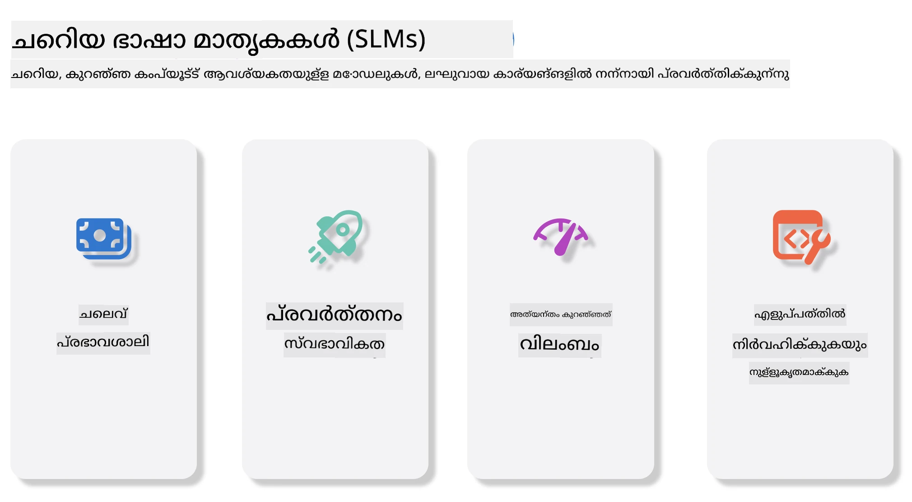
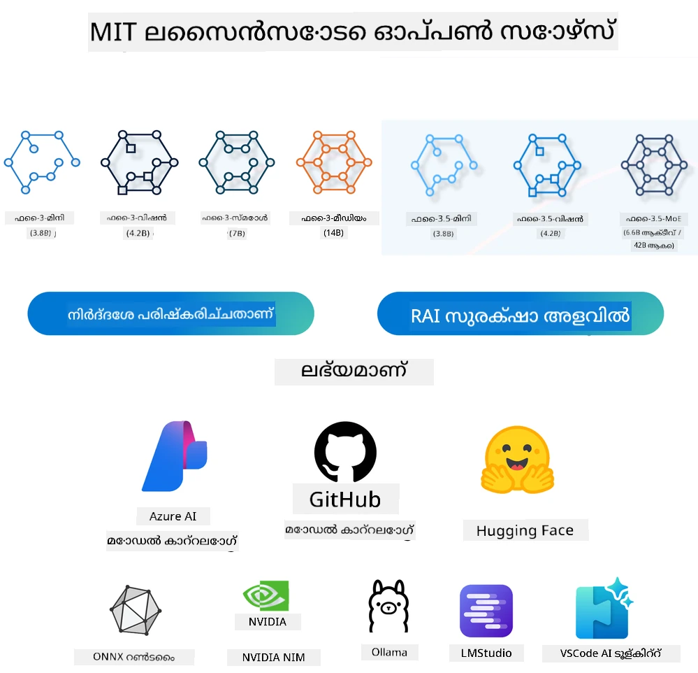
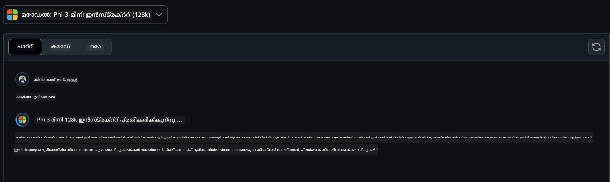
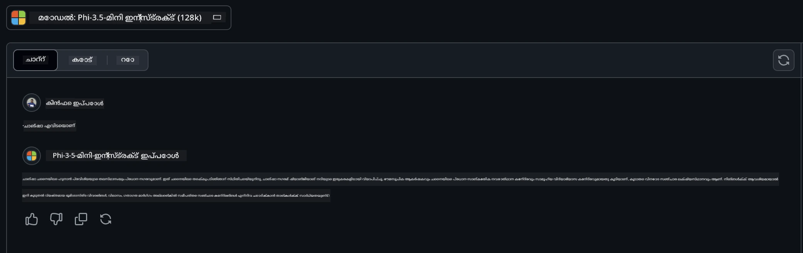

# ജനറേറ്റീവ് എഐക്ക് വേണ്ടി ചെറിയ ഭാഷ മോഡലുകളുടെ പരിചയം തുടക്കക്കാർക്കായി
ജനറേറ്റീവ് എഐ എന്നത് പുതിയ ഉള്ളടക്കം സൃഷ്ടിക്കാനാകുന്ന സിസ്റ്റങ്ങൾ നിർമ്മിക്കുന്നതിനുള്ള ആർട്ടിഫിഷ്യൽ ഇന്റലിജൻസ് എന്ന ഒരു ആകർഷകമായ മേഖലയാണ്. ഈ ഉള്ളടക്കം ടെക്സ്റ്റും ചിത്രങ്ങളും മുതൽ സംഗീതവും മുഴുവൻ വെർച്വൽ അന്തരീക്ഷങ്ങുകളും ഉൾക്കൊള്ളാം. ജനറേറ്റീവ് എഐയുടെ ഏറ്റവും ആവേശകരമായ പ്രയോഗങ്ങളിലൊന്ന് ഭാഷ മോഡലുകളുടെ മേഖലയിലാണ്.

## ചെറിയ ഭാഷ മോഡലുകൾ എന്തെല്ലാം?

ചെറിയ ഭാഷ മോഡൽ (SLM) എന്നത് വലിയ ഭാഷ മോഡൽ (LLM) ന്റെ 규모 കുറഞ്ഞ പതിപ്പാണ്, LLMകളുടെ പദ്ധതിപാരമ്പര്യങ്ങളും സാങ്കേതികവിദ്യകളും ഉപയോഗിക്കുന്നെങ്കിലും ഗണിതശാസ്ത്രപരമായ ആവശ്യകതകൾ വളരെ കുറവാണ്. 

SLMകൾ മനുഷ്യസ്‌നേഹപരമായ ടെക്സ്റ്റ് സൃഷ്ടിക്കാൻ രൂപകൽപ്പന ചെയ്ത ഭാഷ മോഡലുകളുടെ ഉപവിഭാഗമാണ്. GPT-4 പോലുള്ള വലിയ മഡലുകളിൽനിന്ന് വ്യത്യസ്തമായി, SLMകൾ അധികം കുറഞ്ഞ വലുപ്പമുള്ളതും കാര്യക്ഷമവുമായതിനാൽ കമ്പ്യൂട്ടിങ് വിഭവങ്ങൾ പരമിതമായ ഇടങ്ങളിൽ ഉപയോഗത്തിന് അനുയോജ്യമാണ്. അതിന്റെ ചെറിയ വലുപ്പത്തിനുപറമ്പര, അവ വിവിധ ജോലി നിർവഹിക്കാൻ കഴിയും. സാധാരണയായി SLMകൾ LLM-കൾ.compressചെയ്യുകയോ_distillചെയ്യുകയോ ചെയ്ത് നിർമ്മിക്കുന്നതാണ്, ഇതുവഴി ഒരു വലിയ ഭാഗം ലളിതവും ഭാഷാ കഴിവുകളുമുള്ള മഡൽ പ്രവർത്തനം നിലനിർത്താൻ കഴിയും. മോഡൽ വലുപ്പം കുറയ്ക്കുന്നതിലൂടെ സങ്കീർണ്ണത കുറഞ്ഞു, മെമ്മറി ഉപയോഗവും കംപ്യൂട്ടേഷൻ ആവശ്യകതയും കുറയുന്നു. ഈ മെച്ചപ്പെടുത്തലുകളുടെ പേരിൽ, SLMകൾ വേണ്ടി വരും വിപുലമായ നാച്വറൽ ലാംഗ്വേജ് പ്രോസസ്സിംഗ് (NLP) പ്രവർത്തനങ്ങൾ:

- ടെക്സ്റ്റ് സൃഷ്ടികരണം: സാന്ദർഭ്യപരവും സുതാര്യവുമായ വാക്യങ്ങൾ, പാരഗ്രാഫുകൾ സൃഷ്ടിക്കൽ.
- ടെക്സ്റ്റ് പൂർത്തിയാക്കൽ: നൽകിയ പ്രോમ્પ്റ്റിന്റെ അടിസ്ഥാനത്തിൽ വാക്യങ്ങൾ പ്രവചിക്കുകയും പൂർത്തിയാക്കുകയും ചെയ്യുക.
- വിവർത്തനം: ഒരു ഭാഷയിൽ നിന്ന് മറ്റൊരു ഭാഷയിലേക്ക് ടെക്സ്റ്റ് പരിവർത്തനം.
- സംക്ഷേപണം: നീണ്ട തലത്തിൽ ഉള്ള ടെക്സ്റ്റ് ചെറുതായി ദൃശ്യപ്പെടുത്തി ലളിതമാക്കുക.

വലുതായ മോഡലുകളുമായി താരതമ്യത്തിൽ ചില പ്രകടനമേറ്റവും വിവരണസ്സമ്പദ് കുറഞ്ഞതുമുണ്ടാവുകയുണ്ട്.

## ചെറിയ ഭാഷ മോഡലുകൾ എങ്ങനെ പ്രവർത്തിക്കുന്നു?
SLMകൾ വലുതായ ടെക്സ്റ്റ് ഡാറ്റസെറ്റുകളില്‍ പരിശീലിപ്പിക്കപ്പെടുന്നു. പരിശീലന സമയത്ത്, ഭാഷയുടെ പാറ്റേണുകളും ഘടനകളും പഠിച്ച്, വ്യാകരണപരവും സാന്ദർഭ്യപരവുമായ ടെക്സ്റ്റ് സൃഷ്ടിക്കാൻ കഴിയും. പരിശീലനം ചേരുന്നത്:

- ഡാറ്റ ശേഖരണം: വിവിധ ഉറവിടങ്ങളിൽ നിന്നും വലുതായ ടെക്സ്റ്റ് ഡാറ്റ ശേഖരിക്കൽ.
- മുൻപ്രോസസ്സിംഗ്: പരിശീലനത്തിന് അനുയോജ്യമായ രീതിയിൽ ഡാറ്റ ശുചീകരിക്കുകയും ക്രമീകരിക്കുകയും ചെയ്യുക.
- പരിശീലനം: മെഷീൻ ലേണിംഗ് ആൾഗോറിതങ്ങൾ ഉപയോഗിച്ച് മോഡലിനെ ടെക്സ്റ്റ് വിശദീകരണം പഠിപ്പിക്കുകയും സൃഷ്ടിക്കുകയും ചെയ്യുക.
- ഫൈൻ-ട്യൂണിംഗ്: പ്രത്യേക പ്രവർത്തനങ്ങളിൽ പ്രകടനം മെച്ചപ്പെടുത്താൻ മോഡൽ ക്രമീകരിക്കൽ.

SLM വികസനം കമ്പനികൾക്ക് മോഡലുകൾ കുറഞ്ഞ വിഭവങ്ങളുള്ള സാഹചര്യങ്ങളിലേക്കും, മൊബൈൽ ഉപകരണങ്ങളിലേക്കും, എഡ്ജ് കമ്പ്യൂട്ടിംഗ് പ്ലാറ്റ്ഫോമുകളിലേക്കും വിന്യസിക്കാൻ സാദ്ധ്യമാക്കുന്ന ആവശ്യകതയുമായി ചേർന്ന് വളരുന്നു. കാര്യക്ഷമതയിൽ ശ്രദ്ധ കേന്ദ്രീകരിച്ച്, SLMകൾ പ്രകടനം ആക്സസ്‌ബിലിറ്റിയുമായി യാഥാസ്ഥിതികമായി ചേർന്ന് വിപുലമായ പ്രയോഗങ്ങളെ സാധ്യമാക്കുന്നു.



## പഠന ലക്ഷ്യങ്ങൾ

ഈ പാഠത്തിൽ, നാം SLM-യുടെ അറിവ് പരിചയപ്പെടുത്തി, അത് Microsoft Phi-3ർക്കൊപ്പം സംയോജിപ്പിച്ചുകൊണ്ട് ടെക്സ്റ്റ് ഉള്ളടക്കം, കാഴ്ചപ്പാടുകൾ, MoE തുടങ്ങിയ വിവിധ സാഹചര്യങ്ങൾ പഠിക്കുകയാണ്.

ഈ പാഠം അവസാനിപ്പിച്ചാൽ, നിങ്ങള്ക്ക് ചുവടെ കൊടുത്തിരുന്ന ചോദ്യങ്ങൾക്ക് മറുപടി തരാൻ കഴിയും:

- SLM എന്താണ്?
- SLMക്കും LLMക്കും ഇടയിലുള്ള വ്യത്യാസം എന്താണ്?
- Microsoft Phi-3/3.5 കുടുംബം എന്താണ്?
- Microsoft Phi-3/3.5 കുടുംബത്തില്‍ നിന്ന് ഇന്ഫറൻസുകൾ എങ്ങനെ നടത്താം?

തയ്യാറാണോ? ആരംഭിക്കാം.

## വലിയ ഭാഷ മോഡലുകളും (LLMs) ചെറിയ ഭാഷ മോഡലുകൾ (SLMs) തമ്മിലുള്ള വ്യത്യാസങ്ങൾ

LLMകളും SLMകളും പ്രൊബബിലിസ്റ്റിക് മെഷീൻ ലേണിംഗ് അടിസ്ഥാനമാക്കിയുള്ള സിദ്ധാന്തങ്ങൾ അടിസ്ഥാനമാക്കി നിർമ്മിക്കപ്പെട്ടിരിക്കുന്ന අතර, അവയുടെ ആർക്കിടെക്ചർ ഡിസൈൻ, പരിശീലന രീതി, ഡാറ്റ സൃഷ്ടിക്കൽ പ്രക്രിയകൾ, മോഡൽ വിലയിരുത്തൽ രീതികൾ എന്നിവയിൽ സമാന സമീപനങ്ങൾ പിന്തുടരുന്നു. എങ്കിലും, അനേകം പ്രധാന ഘടകങ്ങൾ ഇവ രണ്ടിനെ വ്യത്യസ്തമാക്കുന്നു.

## ചെറിയ ഭാഷ മോഡലുകളുടെ പ്രയോഗങ്ങൾ

SLMകൾ വ്യാപകമായ പ്രയോഗങ്ങൾക്കായി ഉപയോഗിക്കപ്പെടുന്നു, ഉദാഹരണങ്ങൾ:

- ചാറ്റ്ബോട്ടുകൾ: ഉപഭോക്തൃ പിന്തുണ നൽകാനും ഉപയോക്താക്കളുമായി സംഭാഷണ രൂപത്തിൽ ഇടപഴകാനും.
- ഉള്ളടക്കം സൃഷ്ടിക്കൽ: എഴുത്തുകാർക്ക് ആശയങ്ങൾ ജനറേറ്റ് ചെയ്യുന്നതിൽ സഹായം നൽകാനോ മുഴുവൻ ലേഖനങ്ങളും തയാറാക്കാനോ.
- വിദ്യാഭ്യാസം: വിദ്യാർത്ഥികൾക്ക് എഴുതൽ അസൈൻമെന്റുകളിലും പുതിയ ഭാഷകൾ പഠിക്കുന്നതിലും സഹായം.
- ആക്സസിബിലിറ്റി: ദൃശ്യശേഷി കുറവുള്ള വ്യക്തികൾക്കായി ടെക്സ്റ്റ്-ടു-സ്പീച്ച് സിസ്റ്റങ്ങൾ പോലുള്ള ഉപകരണങ്ങൾ സൃഷ്ടിക്കൽ.

**വലിപ്പം**

LLMഉം SLMഉം തമ്മിലുള്ള പ്രധാന വ്യത്യാസം മോഡലുകളുടെ വലിപ്പത്തിലാണ്. ChatGPT (GPT-4) പോലുള്ള LLMകൾ ഏകദേശം 1.76 ട്രില്യൺ പാരാമീറ്ററുകൾ ഉൾക്കൊള്ളുന്നു, എന്നാൽ മിസ്ട്രാൽ 7B പോലുള്ള ഓപ്പൺ സോഴ്‌സ് SLMകൾ ഏകദേശം 7 ബില്യൺ പാരാമീറ്ററുകൾകൊണ്ട് രൂപകൽപ്പന ചെയ്തിട്ടുണ്ട്. ഈ വ്യത്യാസം മോഡൽ ആർക്കിടെക്ചറും പരിശീലന രീതികളും മൂലം ആണ്. ഉദാഹരണത്തിന്, ChatGPT എൻ‌കോഡർ-ഡീകോഡർ ഫ്രെയിംവർക്കിൽ സ്വയം-അറ്റൻഷൻ യന്ത്രം ഉപയോഗിക്കുന്നപ്പോൾ, മിസ്ട്രാൽ 7B ഒരു മറ്റ് ഡീകോഡർ-ഓൺലി മോഡലിൽ സ്ലൈഡിംഗ് വിൻഡോ അറ്റൻഷൻ ഉപയോഗിക്കുന്നതിനാൽ കാര്യക്ഷമമായ പരിശീലനം സാധ്യമാക്കുന്നു. ഈ ആർക്കിടെക്ചറൽ വ്യത്യാസം മോഡലിന്റെ സങ്കീർണ്ണതയും പ്രകടനവും ഗൗരവമായി ബാധിക്കുന്നു.

**അന്തർവിചാരം**

SLMകൾ പ്രത്യേക ഡൊമൈനുകളിൽ പ്രകടനത്തിന് സാധാരണയായി ഒതുക്കപ്പെട്ടിരിക്കുന്നു, അതിനാൽ അവ വ്യക്തമായ വിദഗ്ധമനായിട്ടുള്ളവയാണ്, എന്നാൽ വെള്ളമഞ്ഞിൽ പല മേഖലകളിലും വ്യാപകമായ പശ്ചാത്തല ബോധം ഉറപ്പാക്കുന്നതിൽ പരിമിതമാണ്. LLMകൾ മനുഷ്യസമ്മാനമുള്ള ബുദ്ധി അനുകരിക്കാൻ വലിയ ഡാറ്റാസെറ്റുകളിൽ പരിശീലിപ്പിച്ചിരിക്കുന്നു. LLMകൾ വ്യത്യസ്ത മേഖലകളിൽ നല്ല പ്രകടനം കാഴ്ചവയ്ക്കുവാൻ രൂപകൽപ്പന ചെയ്തിരുന്നതുകൊണ്ട് കൂടുതൽ വൈവിധ്യവും ആശ്ളേഷണവും ഉണ്ട്. അതിനാൽ, LLMകൾ പ്രകൃതിശാസ്ത്രം, പ്രോഗ്രാമിംഗ് തുടങ്ങിയ വിപുലമായ ഡൗൺസ്ട്രീം ജോലികൾക്കായി അനുയോജ്യമാണ്.

**കമ്പ്യൂട്ടിംഗ്**

LLM-കളുടെ പരിശീലനവും വിന്യാസവും വളരെ വിശാലമായ കമ്പ്യൂട്ടിംഗ് വിഭവങ്ങൾ ആവശ്യമാക്കുന്നു, സാധാരണയായി വലിയ GPU ക്ലസ്റ്ററുകൾ ഉപയോഗിക്കുന്നു. ഉദാഹരണമായി, ChatGPT പോലുള്ള മോഡൽ എളുപ്പത്തോടെ നിരവധി GPUകളിൽ മണിക്കൂറുകൾ വരെ പരിശീലിപ്പിക്കേണ്ടതുണ്ട്. മറുവശത്ത്, SLMകളുടെ കുറവായ പാരാമീറ്റർ കണക്കുകൾ കാരണം, ഇവ കമ്പ്യൂട്ടിംഗ് വിഭവങ്ങളിലും കുറഞ്ഞ അളവിലാണ് പരിശീലിക്കേണ്ടത്. മിസ്ട്രാൽ 7B പോലുള്ള മോഡലുകൾ കുറച്ച് GPU ശേഷിയുള്ള ആഭ്യന്തര യന്ത്രങ്ങളിലും പ്രവർത്തിപ്പിക്കാനുള്ള കഴിവ് കാണിക്കാം, എന്നിരുന്നാലും, പരിശീലനം ചില മണിക്കൂറുകൾ എടുക്കുന്നുണ്ട്.

**പക്ഷപാതം**

LLMകളിലെ പ്രശ്നങ്ങളിൽ പ്രധാനമായുള്ളത് പരിശീലന ഡാറ്റയുടെ സ്വഭാവം കാരണം ഉളവാകുന്ന പക്ഷപാതങ്ങളാണ്. ഈ മോഡലുകൾ വലുവായ ഇന്റർനെറ്റ് ടെക്സ്റ്റ് ഡാറ്റയിൽ ആശ്രയിക്കുന്നതുകൊണ്ടു ചില കൂട്ടായ്മകളും വിഭാഗങ്ങളും ഇതിലെ സാഹിത്യം വെറുതെ പ്രതിനിധീകരിക്കപ്പെടാതിരിക്കുകയും തെറ്റായ ലേബലിംഗുകളും തരളമായ ഭാഷാ പ്രായോഗികതകളും സംഭവിക്കാം. കൂടാതെ LLM ആർക്കിടെക്ചറുകളുടെ സങ്കീർണ്ണത ഈ പക്ഷപാതം വളർത്തുന്നതിന് ഇടയാകും. പകൃതിയിൽ, SLMകൾ കുറച്ച് നിർബന്ധിത, ഡൊമെയ്ൻ-നിബന്ധിത ഡാറ്റാസെറ്റുകളിൽ പരിശീലിപ്പിക്കപ്പെടുന്നതിനാൽ, ഇവയ്ക്ക് ഇത്തരം പക്ഷപാതങ്ങളിൽ കുറവ് ഉണ്ടാകാം, യഥാർത്ഥത്തിൽ അർത്ഥമാക്കുന്നത് അവർ മുഴുവനും ആക്ഷേപാരഹിതരല്ല.

**ഇന്ഫറൻസ്**

SLMകളുടെ ചെറിയ വലിപ്പം അവർക്കു ഉയർന്ന ഇന്ഫറൻസ് വേഗത നൽകുന്നു, കൂടാതെ പരമാവധി പരലൽ പ്രോസസ്സിംഗ് വേണ്ടാതെ ലൊക്കൽ ഹാർഡ്വെയറിൽ ഫലപ്രദമായി आउट്പുട്ട് സൃഷ്ടിക്കാൻ കഴിയും. LLMകൾക്ക് വലിപ്പവും സങ്കീർണ്ണതയും കൂടിയതിനാൽ, വേഗമുള്ള ഇന്ഫറൻസ് സാധ്യമാക്കാൻ വലിയ പാരലൽ കംപ്യൂട്ടിംഗ് വളരെ ആവശ്യമാണ്. ഒരേ സമയം ഒരുപാട് ഉപയോക്താക്കൾ ആയിരിക്കും ഉപയോഗിക്കുന്നത് എങ്കിൽ LLMകൾക്ക് ഫ്രല റിലീസ് സമയം കുറയ്ക്കാൻ കൂടുതൽ പ്രയാസമാണ്.

സംക്ഷിപ്തമായി, LLMകളും SLMകളും മെഷീൻ ലേണിംഗിൽ അടിസ്ഥാന സിദ്ധാന്തങ്ങൾ പങ്കിട്ടുനിന്നാലും, മോഡൽ വലിപ്പം, വിഭവ ആവശ്യകത, പശ്ചാത്തല ബോധം, പക്ഷപാതം, ഇന്ഫറൻസ് വേഗത എന്നിവയിൽ വലിയ വ്യത്യാസമുണ്ട്. ഈ വ്യത്യാസങ്ങൾ അവയുടെ വ്യത്യസ്ത ഉപയോഗ മേഖലകളില്‍ അനുയോജ്യതയെ പ്രതിഫലിപ്പിക്കുന്നു; LLMകൾ കൂടുതൽ വൈവിധ്യമാർന്ന ചിലവുകളുള്ളവയാണ്, SLMകൾ ഡൊമെയ്ൻ-സ്പെസിഫിക് കാര്യക്ഷമത കുറഞ്ഞ കമ്പ്യൂട്ടിംഗ് ആവശ്യങ്ങളോടെ നൽകുന്നു.

***കുറിപ്പ്: ഈ പാഠത്തിൽ, Microsoft Phi-3 / 3.5 ഉപയോഗിച്ച് SLM പരിചയപ്പെടുത്താൻ പോകുന്നു.***

## Phi-3 / Phi-3.5 കുടുംബം പരിചയപ്പെടുത്തൽ

Phi-3 / 3.5 കുടുംബം പ്രധാനമായും ടെക്സ്റ്റ്, കാഴ്ച, ഏജന്റ് (MoE) പ്രയോഗങ്ങളിലേക്കാണ് ലക്ഷ്യമിട്ടിരിക്കുന്നത്:

### Phi-3 / 3.5 ഇൻസ്‌ട്രക്ട് 

പ്രധാനമായും ടെക്സ്റ്റ് സൃഷ്ടിക്കൽ, ചാറ്റ് പൂർത്തിയാക്കൽ, ഉള്ളടക്കം വിവരങ്ങൾ തേടൽ തുടങ്ങിയതിനാണ്.

**Phi-3-മിനി**

3.8B പാരാമീറ്ററുകളുള്ള ഭാഷ മോഡൽ Microsoft Azure AI സ്റ്റുഡിയോ, Hugging Face, Ollama എന്നിവയിൽ ലഭ്യമാണ്. Phi-3 മോഡലുകൾ തുല്യവും വലുതുമായ വലുപ്പത്തിലുള്ള ഭാഷ മോഡലുകളേക്കാൾ സുപ്രധാനമായ ബഞ്ച്‌മാർക്ക് കണക്കുകളിൽ മികച്ച പ്രകടനം കാഴ്ചവയ്ക്കുന്നു (താഴെയുള്ള ബഞ്ച്‌മാർക്ക് നമ്പറുകൾ കാണുക, ഉയർന്ന നമ്പറുകൾ നല്ലതാണ്). Phi-3-മിനി സ്വന്തം വലിപ്പത്തേക്കാൾ ഇരട്ടി വലുപ്പത്തിലുള്ള മോഡലുകളെയും മറികടക്കുന്നു, Phi-3-സ്മോൾ, Phi-3-മീഡിയം വലിയ മോഡലുകൾ ഉൾപ്പെടെ GPT-3.5 നെ പോലും മറികടക്കും.

**Phi-3-സ്മോൾ & മീഡിയം**

7B പാരാമീറ്ററുകളോടെയുള്ള Phi-3-സ്മോൾ, വിവിദമായ ഭാഷാ, തർക്ക നിർണയ, കോഡിംഗ്, ഗണിത ബഞ്ച്‌മാർക്കുകളിൽ GPT-3.5T നെ പിന്നല്ലാതെ മിനു.

14B പാരാമീറ്ററുകളുള്ള Phi-3-മീഡിയം ഈ ട്രെൻഡ് തുടര്‍ന്നാണ്, Gemini 1.0 Pro നെ മറികടക്കുന്നു.

**Phi-3.5-മിനി**

Phi-3-മിനിയുടെ ഒരു അപ്ഗ്രേഡ് എന്നാണ് ഇത് കാണിക്കാം. പാരാമീറ്ററുകൾ മാറ്റമില്ലെങ്കിലും, മൾട്ടി-ഭാഷ പിന്തുണ വർദ്ധിപ്പിക്കുകയും (20+ ഭാഷകൾ: അറബി, ചൈനീസ്, ചെക്ക്, ഡാനിഷ്, ഡച്ച്, ഇംഗ്ലീഷ്, ഫിനീഷ്, ഫ്രഞ്ച്, ജർമൻ, ഹീബ്രു, ഹംഗേറിയൻ, ഇറ്റാലിയൻ, ജാപ്പനീസ്, കൊറിയൻ, നോർവീജിയൻ, പോളിഷ്, പോർച്ചുഗീസ്, റഷ്യൻ, സ്പാനിഷ്, സ്വീഡിഷ്, തായ്, തുരക്ക്, യൂക്രെയ്‌നിയൻ) ദീർഘ സാന്ദർഭ്യത്തിന് കൂടുതൽ ശക്തമായ പിന്തുണ നൽകുന്നു.

Phi-3.5-മിനി 3.8B പാരാമീറ്ററുകളോടെ തുല്യവലിപ്പത്തിലുള്ള ഭാഷ മോഡലുകളെ മറികടക്കുകയും ഇരട്ട വലുപ്പമുള്ള മോഡലുകളുമായും തുല്യമായി പ്രകടനം കാഴ്ചവയ്ക്കുകയും ചെയ്യുന്നു.

### Phi-3 / 3.5 കാഴ്ചപ്പാട്

Phi-3/3.5 ഇൻസ്‌ട്രക്ട് മോഡൽ Phi-യുടെ മനസ്സിലാക്കാനുള്ള കഴിവായി കണക്കാക്കാം, Vision മോഡൽ Phi-യ്ക്ക് ലോകത്തെ കാണാനുള്ള കണ്ണുകളാണ്.

**Phi-3-വിഷൻ**

Phi-3-വിഷൻ 4.2B പാരാമീറ്ററുകൾ മാത്രം ഉള്ളത്, ഈ ട്രെൻഡ് തുടർന്നും പ്രകടനം മെച്ചപ്പെടുത്തുകയും Claude-3 Haiku, Gemini 1.0 Pro V പോലുള്ള വലിയ മോഡലുകളെ സാധാരണ ദൃശ്യ കോടതി (Visual Reasoning) ജോലി, ഓസിആർ, പട്ടികകളും താളുകളും മനസ്സിലാക്കൽ ജോലികളിൽ മറികടക്കുകയും ചെയ്യുന്നു.

**Phi-3.5-വിഷൻ**

Phi-3-വിഷന്റെ അപ്ഗ്രേഡാണ് Phi-3.5-വിഷൻ, ഇത് മൾട്ടി-ഇമേജ് പിന്തുണ നൽകുന്നു. ഇത് കാഴ്ചയിൽ പുരോഗതി എന്നിങ്ങനെ കണക്കാക്കാം; ചിത്രങ്ങൾ മാത്രമല്ല, വീഡിയോകളും കാണാനാകും.

Phi-3.5-വിഷൻ Claude-3.5 Sonnet, Gemini 1.5 Flash പോലുള്ള വലിയ മോഡലുകളെ ഓസിആർ, പട്ടികകളും ചാർട്ടുകളും മനസ്സിലാക്കൽ ജോലികളിൽ മറികടക്കുന്നു, സാധാരണ ദൃശ്യമുള്ള ബോധം പ്രായോഗിക ജോലികളിലും തുല്യത നിലനിൽക്കും. മൾട്ടി-ഫ്രെയിം ഇൻപുട്ട് പിന്തുണയ്ക്കുന്നു, അതായത് ഒന്നുകൂടെ ഇൻപുട്ട് ചിത്രങ്ങളിൽ തിരിച്ചുള്ള തർക്ക നിർണയം നടത്താൻ കഴിയും.

### Phi-3.5-MoE

***എക്സ്‌പർട് മിശ്രിതം (MoE)*** മോഡലുകളെ പിന്നുത്ത് കുറച്ചുകമ്പ്യൂട്ടേഷൻ ചെലവിൽ പരിശീലിപ്പിക്കാൻ സഹായിക്കുന്നു, അതുകൊണ്ട് വലിയ മോഡലുകളോ ഡാറ്റാസെറ്റുകളോ ഒരേ കമ്പ്യൂട്ടിംഗ് ബഡ്ജറ്റിൽ വൻ തോതിൽ വ്യാപിപ്പിക്കാൻ കഴിയും. പ്രത്യേകിച്ചും, MoE മോഡൽ അതിന്റെ സാന്ദ്രതയേറിയ സമാന മോഡലിനെ അപേക്ഷിച്ച് വളരെക്കുറച്ച് സമയത്തേക്കും ഉയർന്ന ഗുണമേന്മയിൽ പരിശീലിക്കുന്നത് സാധ്യമാകുന്നു.

Phi-3.5-MoE 16x3.8B എക്സ്‌പർട് മോഡ്യൂളുകൾ അടങ്ങുന്നു. Phi-3.5-MoE 6.6B സജീവ പാരാമീറ്ററുകളോടുകൂടി വലിയ മോഡലുകളെ അപേക്ഷിച്ച് സമാന തർക്ക നിർണയ, ഭാഷാ മനസ്സിലാക്കൽ, ഗണിതത്തിലെ കഴിവ് കൈവരിക്കുന്നു.

നാം വിവിധ സാഹചര്യങ്ങൾ അടിസ്ഥാനമാക്കി Phi-3/3.5 കുടുംബം ഉപയോഗിക്കാം. LLMകളെക്കാൾ വ്യത്യസ്തമായി, Phi-3/3.5-മിനി അല്ലെങ്കിൽ Phi-3/3.5-വിഷൻ മാദ്ധ്യമങ്ങൾ എഡ്ജ് ഡിവൈസുകളിലും വിന്യസിക്കാം.

## Phi-3/3.5 കുടുംബ മോഡലുകൾ എങ്ങനെ ഉപയോഗിക്കാം

നാം Phi-3/3.5 വ്യത്യസ്ത സാഹചര്യങ്ങളിൽ ഉപയോഗിക്കണമെന്ന് ആശിക്കുന്നു. പിന്നീട്, എല്ലാ സാഹചര്യങ്ങളും അടിസ്ഥാനമാക്കി Phi-3/3.5 ഉപയോഗിക്കുന്ന വിധം കാണിക്കും.



### ക്ലൗഡ് APIs മുഖേന ഇന്ഫറൻസ്

**GitHub മോഡലുകൾ**

GitHub മോഡലുകൾ ഏറ്റവും നേരിട്ടുള്ള മാർഗമാണ്. GitHub മോഡലുകൾ വഴി Phi-3/3.5-ഇൻസ്‌ട്രക്ട് മോഡലിലേക്ക് വേഗത്തിൽ ലഭ്യമാകാം. Azure AI ഇന്ഫറൻസ് SDK / OpenAI SDKകൂടെ കോഡ് വഴി API വിളി പൂർത്തിയാക്കാം. പ്ലേഗ്രൗണ്ട് വഴി വിവിധ ഫലങ്ങൾ പരീക്ഷിക്കാനും കഴിയും.

- ഡെമോ: ചൈനീസ് സാഹചര്യങ്ങളിൽ Phi-3-മിനിയും Phi-3.5-മിനിയും പ്രകടന താരതമ്യം






**Azure AI സ്റ്റുഡിയോ**

Vision, MoE മോഡലുകൾ ഉപയോഗിക്കാൻ ആകുക എങ്കിൽ Azure AI സ്റ്റുഡിയോ വഴി വിളികൾ പൂർത്തിയാക്കാവുന്നതാണ്. പിടിച്ചുപറ്റാൻ ആഗ്രഹിക്കുന്നവർ Phi-3 കുക്ക്ബുക്കിൽ Phi-3/3.5 ഇൻസ്‌ട്രക്ട, വിഷൻ, MoE കീഴിൽ Azure AI സ്റ്റുഡിയോ ഉപയോഗിച്ച് വിളിക്കാൻ പഠിക്കാം [ഈ ലിങ്ക് ക്ലിക്ക് ചെയ്യുക](https://github.com/microsoft/Phi-3CookBook/blob/main/md/02.QuickStart/AzureAIStudio_QuickStart.md?WT.mc_id=academic-105485-koreyst)


**NVIDIA NIM**

Azure, GitHub നൽകുന്ന ക്ലൗഡ്-ഭേദഗതികളായ മോഡൽ കാറ്റലോഗ് പരിഹാരങ്ങളെ പുറമേ, [NVIDIA NIM](https://developer.nvidia.com/nim?WT.mc_id=academic-105485-koreyst) ഉപയോഗിച്ച് Phi-3/3.5 കുടുംബത്തിന്റെ API വിളികൾ സമ്പന്നമാക്കാം. NVIDIA NIM (NVIDIA ഇൻഫറൻസ് മൈക്രോസർവീസസ്) വ്യത്യസ്ത പരിസരങ്ങളിൽ, ആക്ലൗഡുകൾ, ഡാറ്റ സെന്ററുകൾ, വർക്ക്സ്റ്റേഷനുകൾ എന്നിവയിലായി എഐ മോഡലുകൾ കാര്യക്ഷമമായി വിന്യസിക്കാൻ സഹായിക്കുന്ന വേഗതയേറിയ ഇൻഫറൻസ് മൈക്രോസർവീസസുകളാണ്.

NVIDIA NIM ന്റെ ചില പ്രധാന സവിശേഷതകൾ താഴെ കൊടുക്കുന്നു:
- **സുലഭമായ വിന്യാസം:** NIM ഒരു കമാൻഡ് മാത്രം ഉപയോഗിച്ച് AI മോഡലുകൾ വിന്യസിക്കാൻ അനുവദിക്കുന്നു, ഇത് നിലവിലെ പ്രവൃത്തി പ്രവാഹങ്ങളിൽ എളുപ്പത്തിൽ സംയോജിപ്പിക്കാൻ കഴിയും.
- **സമർത്ഥമായ പ്രകടനം:** ഇത് TensorRT, TensorRT-LLM തുടങ്ങിയ NVIDIAയുടെ മുൻകൂർ ആപ്റ്റിമൈസ്ഡ് ഇൻഫറൻസ് എഞ്ചിനുകളെ ഉപയോഗപ്പെടുത്തി കുറഞ്ഞ ഡിലേയും ഉയർന്ന ത്രൂത്പുട്ടും ഉറപ്പാക്കുന്നു.
- **സ്കേയിലബിലിറ്റി:** NIM കുബർനീറ്റീസ് ഓട്ടോസ്കേയിലിംഗ് പിന്തുണയ്ക്കുന്നു, അതിലൂടെ വ്യത്യസ്ത workloads ഫലപ്രദമായി കൈകാര്യം ചെയ്യാം.
- **സുരക്ഷയും നിയന്ത്രണവും:** സംഘടനകൾ സ്വന്തം മേധാവിത്വത്തിലുള്ള ഇൻഫ്രാസ്ട്രക്ചറിൽ NIM മൈക്രോസർവിസുകൾ സെൽഫ്-ഹോസ്റ്റുചെയ്യുന്നതിലൂടെ അവരുടെ ഡാറ്റയും ആപ്ലിക്കേഷനുകളും നിയന്ത്രിക്കാവുന്നതാണ്.
- **സ്റ്റാൻഡേർഡ് APIകൾ:** NIM വ്യവസായ സ്റ്റാൻഡേർഡ് APIകൾ നൽകുന്നു, ചാറ്റ്ബോട്ടുകൾ, AI അസിസ്റ്റന്റുകൾ തുടങ്ങിയ AI ആപ്ലിക്കേഷനുകൾ എളുപ്പത്തിൽ നിർമ്മിക്കാനും സംയോജിപ്പിക്കാനും.

NIM NVIDIA AI Enterpriseയുടെ ഭാഗമാണ്, ഇത് AI മോഡലുകളുടെ വിന്യാസവും പ്രവർത്തനക്ഷമതയും എളുപ്പമാക്കുവാനും NVIDIA GPUs-ൽ ഫലപ്രദമായി പ്രവർത്തിക്കുവാനും ലക്ഷ്യമിടുന്നു.

- ഡെമോ: NVIDIA NIM ഉപയോഗിച്ച് Phi-3.5-Vision-API വിളിക്കൽ [[Click this link](./python/Phi-3-Vision-Nividia-NIM.ipynb?WT.mc_id=academic-105485-koreyst)]


### Phi-3/3.5 ലോക്കലായി ഓടിക്കൽ
Phi-3 അല്ലെങ്കിൽ GPT-3 പോലുള്ള ഭാഷാമോഡലുമായി ബന്ധപ്പെട്ട ഇൻഫറൻസ് എന്നത് നൽകിയ ഇൻപുട്ടിന്റെ അടിസ്ഥാനത്തിൽ പ്രതികരണങ്ങൾ അല്ലെങ്കിൽ പ്രവചനങ്ങൾ സൃഷ്‌ടിക്കുന്ന പ്രക്രിയയാണ്. നിങ്ങൾ Phi-3-ലേക്ക് ഒരു പ്രോംപ്റ്റ് അല്ലെങ്കിൽ ചോദ്യങ്ങൾ നൽകിയപ്പോൾ, ഇത് പരിശീലിപ്പിച്ചിരിക്കുന്ന ഡാറ്റയിലെ മാതൃകകളും ബന്ധങ്ങളും വിശകലനം ചെയ്ത് ഏറ്റവും സാധ്യതയുള്ള അനുയോജ്യമായ പ്രതികരണം നിമിത്തം ഒരുക്കുന്നു.

**Hugging Face Transformer**  
Hugging Face Transformers ഒരു ശക്തമായ ലൈബ്രറിയാണ്, പ്രകൃതിഭാഷാ പ്രോസസ്സിംഗിലും (NLP) മറ്റ് മെഷീൻ ലേണിംഗ് ടാസ്കുകളിലും ഉപയോഗിക്കുന്നതിനായി രൂപകൽപ്പന ചെയ്തിരിക്കുന്നു. ഇതിലെ ചില പ്രധാന കാര്യങ്ങൾ:

1. **മുൻപരിശീലിത മോഡലുകൾ:** ടെക്സ്റ്റ് വർഗീകരണം, നാമമാത്ര എന്റിറ്റി തിരിച്ചറിവ്, ചോദ്യ ഉത്തരം, സാരാംശം, പരിഭാഷ, ടെക്സ്റ്റ് ജനറേഷൻ തുടങ്ങിയ വിവിധ ടാസ്കുകൾക്കായി ഉപയോഗിക്കാവുന്ന ആയിരക്കണക്കിനം മുൻപരിശീലിത മോഡലുകൾ നൽകുന്നു.

2. **ഫ്രെയിംവർക്കുകൾ തമ്മിൽ ഒത്തുചേർന്നു പ്രവർത്തിക്കൽ:** PyTorch, TensorFlow, JAX പോലുള്ള വിവിധ ദീർഘ പഠന ഫ്രെയിംവർക്കുകൾ പിന്തുണയ്ക്കുന്നു. ഇത് ഒരേ മോഡൽ വേറൊരു ഫ്രെയിംവർക്കിൽ പരിശീലിപ്പിച്ച് മറ്റൊന്നിൽ ഉപയോഗിക്കാൻ അനുവദിക്കുന്നു.

3. **മൾട്ടിമോഡൽ കഴിവുകൾ:** NLPയ്ക്ക് പുറമേ, കംപ്യൂട്ടർ സൃഷ്ടി (ഉദാഹരണത്തിന് 이미지 വർഗീകരണം, വസ്തു കണ്ടെത്തൽ) ആക്യാന്റ് പ്രോസസ്സിംഗ് (ഉദാഹരണത്തിന് വാചാല തിരിച്ചറിവ്, ഓഡിയോ വർഗീകരണം) ടാസ്കുകളും പിന്തുണയ്ക്ക്.

4. **ഉപയോഗിക്കാൻ എളുപ്പം:** മോഡലുകൾ ഡൗൺലോഡ് ചെയ്ത് ഫൈൻ-ട്യൂൺ ചെയ്യാൻ എന്തെങ്കിലും പാഠങ്ങൾ നൽകുന്ന APIകൾക്കും, ടൂളുകൾക്കും കൂടി നിർദ്ദേശിക്കുന്നു.

5. **സമൂഹവും വസ്തുക്കളും:** Hugging Face-ന് സജീവമായ ഒരു സമൂഹവും വ്യാപകമായ ഡോക്യുമെന്റേഷനും ട്യൂട്ടോറിയലുകളുമുണ്ട്.

[ഓഫീഷ്യൽ ഡോക്യുമെന്റേഷൻ](https://huggingface.co/docs/transformers/index?WT.mc_id=academic-105485-koreyst) അല്ലെങ്കിൽ അവരുടെ [GitHub റിപ്പോസിറ്ററി](https://github.com/huggingface/transformers?WT.mc_id=academic-105485-koreyst) സന്ദർശിക്കാം.

GPU ആക്സിലറേഷൻ ആവശ്യമാണ്; പ്രത്യേകിച്ച് Vision, MoE പോലുള്ള സാഹചര്യങ്ങളിൽ പല കണക്കുകൂട്ടലുകളും ഉള്ളതിനാൽ CPU-യിൽ അമിതസമയം കടക്കും, ക്വാണ്ടൈസേഷൻ ഇല്ലെങ്കിൽ.

- ഡെമോ: Transformer ഉപയോഗിച്ച് Phi-3.5-Instruct വിളിക്കൽ [Click this link](./python/phi35-instruct-demo.ipynb?WT.mc_id=academic-105485-koreyst)

- ഡെമോ: Transformer ഉപയോഗിച്ച് Phi-3.5-Vision വിളിക്കൽ [Click this link](./python/phi35-vision-demo.ipynb?WT.mc_id=academic-105485-koreyst)

- ഡെമോ: Transformer ഉപയോഗിച്ച് Phi-3.5-MoE വിളിക്കൽ [Click this link](./python/phi35_moe_demo.ipynb?WT.mc_id=academic-105485-koreyst)

**Ollama**  
[Ollama](https://ollama.com/?WT.mc_id=academic-105485-koreyst) നിങ്ങളുടെ കമ്പ്യൂട്ടറിൽ വലിയ ഭാഷാമോഡലുകൾ (LLMs) ലോക്കലായി എളുപ്പത്തിൽ പ്രവർത്തിപ്പിക്കാൻ രൂപകൽപ്പന ചെയ്ത പ്ലാറ്റ്‌ഫോമാണ്. ഇത് Llama 3.1, Phi 3, Mistral, Gemma 2 തുടങ്ങി വിവിധ മോഡലുകൾ പിന്തുണയ്ക്കുന്നു. മോഡൽ ഭാരം, കോൺഫിഗറേഷൻ, ഡാറ്റ എന്നിവ ഒരേ പാക്കേജിൽ ഉൾപ്പെടുത്തുന്ന പാഠ്യപ്രക്രിയ ഉപയോഗിച്ച് ഉപയോക്താക്കൾക്ക് ഇഷ്ടാനുസൃതമായി മോഡലുകൾ സൃഷ്‌ടിക്കാനും അതിനൊപ്പം പരീക്ഷിക്കാനുമുള്ള സൗകര്യം നൽകുന്നു. MacOS, Linux, Windows-ലുള്ളവർക്കുള്ളത്. ക്ലൗഡ് സേവനങ്ങളിൽ ആശ്രയിക്കാതെ തന്നെ LLMs പരീക്ഷിക്കാനോ വിന്യസിക്കാനോ ഉള്ള മികച്ച ഉപകരണം. താഴെ കൊടുത്ത കമാൻഡ് മാത്രം പ്രവർത്തിപ്പിക്കാം.

```bash

ollama run phi3.5

```


**GenAIക്കായുള്ള ONNX Runtime**

[ONNX Runtime](https://github.com/microsoft/onnxruntime-genai?WT.mc_id=academic-105485-koreyst) ഒരു ബഹുരാഷ്ട്ര പ്ലാറ്റ്ഫോം ഇൻഫറൻസ് പരിശീലന മെഷീൻ ലേണിംഗ് ആക്സിലറേറ്ററാണ്. GenAIക്കായുള്ള ONNX Runtime (GENAI) വിവിധ പ്ലാറ്റ്‌ഫോമുകളിൽ സൃഷ്‌ടിപരമായ AI മോഡലുകൾ ഫലപ്രദമായി പ്രവർത്തിപ്പിക്കാൻ സഹായിക്കുന്ന ഒരു ശക്തമായ ഉപകരണമാണ്.

## ONNX Runtime എന്താണ്?  
ONNX Runtime ഒരു ഓപ്പൺ സോഴ്സ് പ്രോജക്ട് ആണ്, മെഷീൻ ലേണിംഗ് മോഡലുകളുടെ ഉയർന്ന പ്രകടന ഇൻഫറൻസ് സാധ്യമാക്കുന്നു. Open Neural Network Exchange (ONNX) ഫോർമാറ്റിൽ മോഡലുകൾ പിന്തുണയ്ക്കുന്നു, ഇത് മെഷീൻ ലേണിംഗ് മോഡലുകൾ പ്രതിനിധാനം ചെയ്യുന്നതിന് ഉദ്ദേശിച്ചിട്ടുള്ള സ്റ്റാൻഡേർഡാണ്. ONNX Runtime ഇൻഫറൻസ് ഉപഭോക്തൃ അനുഭവം വേഗത്തിൽ കൊണ്ടുവരാനും ചെലവ് കുറഞ്ഞതാക്കാനും सक्षम ആണ്, PyTorch, TensorFlow/Keras പോലുള്ള ഡീപ് ലേണിംഗ് ഫ്രെയിംവർക്കുകളും scikit-learn, LightGBM, XGBoost പോലുള്ള ക്ലാസിക്കൽ മെഷീൻ ലേണിംഗ് ലൈബ്രറികളും പിന്തുണയ്ക്കുന്നു. വ്യത്യസ്ത ഹാർഡ്‌വെയർ, ഡ്രൈവറുകൾ, ഓപ്പറേറ്റിങ്ങ് സിസ്റ്റങ്ങൾക്കും ഒത്തുകൂടുന്നു, കൂടാതെ ഹാർഡ്‌വെയർ ആക്സിലറേറ്ററുകൾ ഉപയോഗിച്ച് ഗ്രാഫ് മാറ്റങ്ങൾക്കും അനുകൂലത നൽകുന്നു.

## സൃഷ്‌ടിപരമായ AI എന്താണ്?  
സൃഷ്‌ടിപരമായ AI എന്നത് പരിശീലന ഡാറ്റയ്‌ക്കെതിരായുള്ള വിവരങ്ങൾ കാണിച്ചുകൊണ്ട് പുതിയ ഉള്ളടക്കം (ഉദാ: ടെക്സ്റ്റ്, ചിത്രങ്ങൾ, സംഗീതം) സൃഷ്ടിക്കാൻ കഴിയുന്ന AI സിസ്റ്റങ്ങളെയാണ് ഉറപ്പിക്കാൻ എന്നർത്ഥം. GPT-3 പോലുള്ള ഭാഷാമോഡലുകളും Stable Diffusion പോലുള്ള ഇമേജ് ജനറേഷൻ മോഡലുകളും ഉദാഹരണങ്ങളാണ്. ONNX Runtime for GenAI ലൈബ്രറി ONNX മോഡലുകൾക്കായി AI loops ഉം ഇൻഫറൻസ്, ലോജിറ്റ് പ്രോസസ്സിംഗ്, തിരച്ചിലും സാമ്പിംഗ്, KV cache മാനേജ്മെന്റ് ഉൾപ്പെടെയുള്ളവ സജ്ജമാക്കുന്നു.

## ONNX Runtime for GENAI  
ONNX Runtime for GENAI ONNX Runtime ന്റെ ശേഷി വിപുലീകരിച്ച് സൃഷ്‌ടിപരമായ AI മോഡലുകൾ പിന്തുണയ്‌ക്കുന്നു. പ്രധാന സവിശേഷതകൾ:

- **വ്യാപകമായ പ്ലാറ്റ്ഫോം പിന്തുണ:** Windows, Linux, macOS, Android, iOS തുടങ്ങിയവയിൽ പ്രവർത്തിക്കുന്നു.
- **മോഡൽ പിന്തുണ:** LLaMA, GPT-Neo, BLOOM എന്നിവയും മറ്റും ഉൾപ്പെടുന്ന നിരവധി ജനപ്രിയ സൃഷ്‌ടിപരമായ AI മോഡലുകൾ.
- **പ്രകടന ആപ്റ്റിമൈസേഷൻ:** NVIDIA GPUകൾ, AMD GPUകൾ തുടങ്ങിയ ഹാർഡ്‌വെയർ ആക്സിലറേറ്ററുകൾക്കുള്ള സ്പെഷ്യൽ ഓപ്ടിമൈസേഷനുകൾ.
- **ഉപയോഗത്തിൽ എളുപ്പ്:** APIകൾ വഴി എളുപ്പത്തിൽ ആപ്ലിക്കേഷനുകളിലേക്കുള്ള സംയോജനം, കുറഞ്ഞ കോഡോടെ ടെക്സ്റ്റ്, ചിത്രം തുടങ്ങിയവ സൃഷ്‌ടിക്കാൻ കഴിയും.
- ആണ്‌ ഉപയോക്താക്കൾ generate() എന്ന ഉയർന്ന തലമൊഴിയും മോഡൽ വളമ്പത്തിൽ ഓരോ തവണയുമുള്ള ടോക്കൺ സൃഷ്ടിയും പ്രവർത്തനവും നടത്താം, ആവശ്യമെങ്കിൽ ലൂപ്പിനുള്ളിൽ ജനറേഷൻ പാരാമീറ്ററുകൾ പുതുക്കാം.
- ONNX(Runtime) ഗ്രിഡി/ബീം സെർച്ച്, TopP, TopK സാമ്പിംഗ്, പുനരാവര്‍ത്തന ദണ്ഡങ്ങൾ പോലുള്ള ലോജിറ്റ് പ്രോസസ്സിംഗുകൾ പിന്തുണയ്ക്കുന്നു. അനുപാതിക സ്കോറിംഗ് ചേർക്കാനും കഴിയും.

## ആരംഭിക്കാൻ
ONNX Runtime for GENAI തുടങ്ങാനായി ചുവടെയുള്ള പ്രക്രിയകൾ പാലിക്കുക:

### ONNX Runtime ഇൻസ്റ്റാൾ ചെയ്യുക:  
```Python
pip install onnxruntime
```


### GenAI വിപുലീകരണങ്ങൾ ഇൻസ്റ്റാൾ ചെയ്യുക:  
```Python
pip install onnxruntime-genai
```


### ഒരു മോഡൽ ഓടിക്കുക: Python ഉദാഹരണം:  
```Python
import onnxruntime_genai as og

model = og.Model('path_to_your_model.onnx')

tokenizer = og.Tokenizer(model)

input_text = "Hello, how are you?"

input_tokens = tokenizer.encode(input_text)

output_tokens = model.generate(input_tokens)

output_text = tokenizer.decode(output_tokens)

print(output_text) 
```


### ഡെമോ: ONNX Runtime GenAI ഉപയോഗിച്ച് Phi-3.5-Vision വിളിപ്പിക്കൽ  
```python

import onnxruntime_genai as og

model_path = './Your Phi-3.5-vision-instruct ONNX Path'

img_path = './Your Image Path'

model = og.Model(model_path)

processor = model.create_multimodal_processor()

tokenizer_stream = processor.create_stream()

text = "Your Prompt"

prompt = "<|user|>\n"

prompt += "<|image_1|>\n"

prompt += f"{text}<|end|>\n"

prompt += "<|assistant|>\n"

image = og.Images.open(img_path)

inputs = processor(prompt, images=image)

params = og.GeneratorParams(model)

params.set_inputs(inputs)

params.set_search_options(max_length=3072)

generator = og.Generator(model, params)

while not generator.is_done():

    generator.compute_logits()
    
    generator.generate_next_token()

    new_token = generator.get_next_tokens()[0]
    
    output = tokenizer_stream.decode(new_token)
    
    print(tokenizer_stream.decode(new_token), end='', flush=True)

```


**മറ്റ് മാർഗങ്ങൾ**

ONNX Runtime, Ollama എന്നുവേണ്ടിയുള്ള സൂചനാ മാർഗ്ഗങ്ങളോട് കൂടാതെ, വ്യത്യസ്ത നിർമ്മാതാക്കളുള്ള മോഡൽ റഫറൻസുകളുടെ അടിസ്ഥാനത്തിൽ ക്വാണ്ടിറ്റേറ്റീവ് മോഡലുകളുടെ റഫറൻസ് പൂർത്തിയാക്കാം. ഉദാഹരണത്തിന് Apple MLX ഫ്രെയിംവർക്ക് Apple Metal-നൊപ്പം, Qualcomm QNN NPU-വുമായും, Intel OpenVINO CPU/GPU-വുമായും. കൂടുതൽ വിവരങ്ങൾ [Phi-3 Cookbook](https://github.com/microsoft/phi-3cookbook?WT.mc_id=academic-105485-koreyst)ൽ ലഭ്യമാണ്.

## കൂടുതൽ  
Phi-3/3.5 കുടുംബത്തിലെ അടിസ്ഥാനാംശങ്ങൾ നാം പഠിച്ചെങ്കിലും, SLM-നെ കുറിച്ച് കൂടുതൽ അറിയാൻ കൂടുതൽ അറിവുകൾ ആവശ്യമുണ്ട്. അതിനുള്ള ഉത്തരങ്ങൾ Phi-3 Cookbook-ൽ കണ്ടെത്താം. കൂടുതൽ അറിയാൻ [Phi-3 Cookbook](https://github.com/microsoft/phi-3cookbook?WT.mc_id=academic-105485-koreyst) സന്ദർശിക്കുക.

---

<!-- CO-OP TRANSLATOR DISCLAIMER START -->
**റിയാഘാടനം**:  
ഈ രേഖ AI പരിഭാഷ സേവനം [Co-op Translator](https://github.com/Azure/co-op-translator) ഉപയോഗിച്ച് പരിഭാഷപ്പെടുത്തിയതാണ്. നാം ശരിയായ വിവർത്തനത്തിനായി ശ്രമിച്ചെങ്കിലും, സ്വയംപ്രവർത്തി പരിഭാഷയിൽ പിഴവുകൾ അല്ലെങ്കിൽ അസംഘടിതത്വങ്ങൾ ഉണ്ടാകാം എന്ന് ദയവായി മനസ്സിലാക്കുക. ജാതിഭാഷയിൽ ഉള്ള ഒറിജിനൽ രേഖ സാധുവായ കരുതപ്പെടേണ്ടതാണ്. പ്രധാന വിവരങ്ങൾക്കായി പ്രൊഫഷണൽ മനുഷ്യ പരിഭാഷ നിർദ്ദേശിക്കുന്നു. ഈ പരിഭಾಷ ഉപയോഗിക്കാൻ ഉണ്ടാകുന്ന തെറ്റിദ്ധാരണകൾക്കോ വ്യാഖ്യാനക്കുറവുകൾക്കോ നാം ബാധ്യസ്ഥരാകില്ല.
<!-- CO-OP TRANSLATOR DISCLAIMER END -->