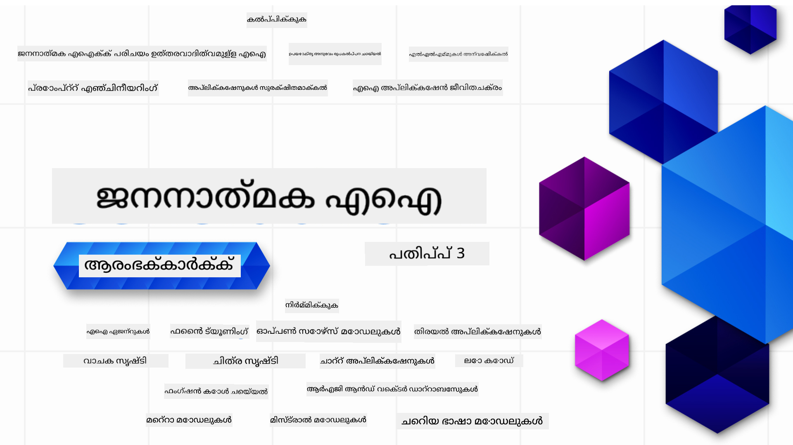

<!--
CO_OP_TRANSLATOR_METADATA:
{
  "original_hash": "4d022651f0c17151c68255e41a68e4ed",
  "translation_date": "2025-12-21T14:55:13+00:00",
  "source_file": "README.md",
  "language_code": "ml"
}
-->

### 21 പാഠങ്ങൾ — ജനറേറ്റീവ് എഐ ആപ്ലിക്കേഷനുകൾ നിർമ്മിക്കാൻ തുടങ്ങാൻ നിങ്ങൾക്കാവശ്യമായ എല്ലാമും പഠിപ്പിക്കുന്നു

### 🌐 ബഹുഭാഷാ പിന്തുണ

#### GitHub Action വഴി പിന്തുണ (സ്വയംചാലിതവും എല്ലായ്പ്പോഴും പുതുക്കപ്പെട്ടവയും)

<!-- CO-OP TRANSLATOR LANGUAGES TABLE START -->
[അറബി](../ar/README.md) | [ബംഗാളി](../bn/README.md) | [ബൾഗേറിയൻ](../bg/README.md) | [ബർമീസ് (മ്യാൻമാർ)](../my/README.md) | [ചൈനീസ് (സിംപ്ലിഫൈഡ്)](../zh/README.md) | [ചൈനീസ് (പരമ്പരാഗതം, ഹോങ്കോങ്)](../hk/README.md) | [ചൈനീസ് (പരമ്പരാഗതം, മക്കവ്)](../mo/README.md) | [ചൈനീസ് (പരമ്പരാഗതം, തായ്‍വാൻ)](../tw/README.md) | [ക്രോആഷ്യൻ](../hr/README.md) | [ചെക്ക്](../cs/README.md) | [ഡാനിഷ്](../da/README.md) | [ഡച്ച്](../nl/README.md) | [എസ്റ്റോണിയൻ](../et/README.md) | [ഫിന്നിഷ്](../fi/README.md) | [ഫ്രഞ്ച്](../fr/README.md) | [ജർമ്മൻ](../de/README.md) | [ഗ്രീക്ക്](../el/README.md) | [ഹെബ്രു](../he/README.md) | [ഹിന്ദി](../hi/README.md) | [ഹംഗേറിയൻ](../hu/README.md) | [ഇന്തോനേഷ്യൻ](../id/README.md) | [ഇറ്റാലിയൻ](../it/README.md) | [ജാപ്പനീസ്](../ja/README.md) | [കന്നഡ](../kn/README.md) | [കൊറിയൻ](../ko/README.md) | [ലിത്വേനിയൻ](../lt/README.md) | [മലേൽ](../ms/README.md) | [മലയാളം](./README.md) | [മരാത്തി](../mr/README.md) | [നെപ്പാളി](../ne/README.md) | [നൈജീരിയൻ പിഡ്ജിൻ](../pcm/README.md) | [നോർവീജിയൻ](../no/README.md) | [പെർഷ്യൻ (ഫാർസി)](../fa/README.md) | [പോളിഷ്](../pl/README.md) | [പോർചുഗീസ് (ബ്രസീൽ)](../br/README.md) | [പോർച്ചുഗീസ് (പോർച്ചുഗൽ)](../pt/README.md) | [പഞ്ചാബി (ഗുരുമുഖി)](../pa/README.md) | [റൊമേനിയൻ](../ro/README.md) | [റഷ്യൻ](../ru/README.md) | [സർബിയൻ (സിറിലിക്)](../sr/README.md) | [സ്ലോവാക്](../sk/README.md) | [സ്ലോവേനിയൻ](../sl/README.md) | [സ്പാനിഷ്](../es/README.md) | [സ്വാഹിലി](../sw/README.md) | [സ്വീഡിഷ്](../sv/README.md) | [ടാഗലോഗ് (ഫിലിപ്പീൻ)](../tl/README.md) | [തമിഴ്](../ta/README.md) | [తెలుగు](../te/README.md) | [തായ്](../th/README.md) | [തുർക്കിഷ്](../tr/README.md) | [ഉക്രെയ്‌നിയൻ](../uk/README.md) | [ഉർദു](../ur/README.md) | [വിയറ്റ്നാമീസ്](../vi/README.md)
<!-- CO-OP TRANSLATOR LANGUAGES TABLE END -->

# ആരംഭകർക്കുള്ള ജനറേറ്റീവ് എഐ (വർഷൻ 3) - ഒരു കോഴ്സ്

Microsoft Cloud Advocates ഒരുക്കിയ 21 പാഠങ്ങളുള്ള സമഗ്ര കോഴ്സിലൂടെ ജനറേറ്റീവ് എഐ ആപ്ലിക്കേഷനുകൾ നിർമ്മിക്കുന്നതിന്റെ അടിസ്ഥാനങ്ങൾ പഠിക്കുക.

## 🌱 തുടങ്ങൽ

ഈ കോഴ്സിൽ 21 പാഠങ്ങളുണ്ട്. ഓരോ പാഠവും തന്നെ ഒരു വിഷയം ഉൾക്കൊള്ളുന്നതുമാണ് — അതിനാൽ നിങ്ങൾക്ക് ഇഷ്ടമുള്ളത് എവിടെയൊന്നുമ آغازിക്കാം!

പാഠങ്ങൾ രണ്ട് തരത്തിലായാണ് ലേബൽ ചെയ്യപ്പെട്ടിരിക്കുന്നത്: ഒരു വശം Generative AI ആശയം വിശദീകരിക്കുന്ന "Learn" പാഠങ്ങൾ, മറ്റേതോട് ആശയം വിശദീകരിക്കുകയും സാധ്യമായാൽ **Python**യും **TypeScript**ഉം ഉപയോഗിച്ചുള്ള കോഡ് ഉദാഹരണങ്ങളും നൽകുന്ന "Build" പാഠങ്ങൾ.

.NET വികസനകാരെ<|vq_image_8839|><|vq_image_1182|><|vq_image_5189|><|vq_image_7394|><|vq_image_14955|><|vq_image_6320|><|vq_image_6002|><|vq_image_7715|><|vq_image_12074|><|vq_image_1292|><|vq_image_4844|><|vq_image_3218|><|vq_image_5301|><|vq_image_1342|><|vq_image_1870|><|vq_image_2871|><|vq_image_52|><|vq_image_8643|><|vq_image_13203|><|vq_image_8782|><|vq_image_1832|><|vq_image_12123|><|vq_image_11898|><|vq_image_9910|><|vq_image_5434|><|vq_image_598|><|vq_image_13728|><|vq_image_7602|><|vq_image_3821|><|vq_image_2929|><|vq_image_4197|><|vq_image_4980|><|vq_image_681|><|vq_image_15494|><|vq_image_4297|><|vq_image_13934|><|vq_image_11614|><|vq_image_12105|><|vq_image_9020|><|vq_image_13970|><|vq_image_6483|><|vq_image_6786|><|vq_image_6235|><|vq_image_11580|><|vq_image_8226|><|vq_image_11088|><|image_border_927|><|vq_image_11816|><|vq_image_12210|><|vq_image_3741|><|vq_image_191|><|vq_image_962|><|vq_image_8192|><|vq_image_1096|><|vq_image_6501|><|vq_image_13109|><|vq_image_6540|><|vq_image_11227|><|vq_image_7111|><|vq_image_6536|><|vq_image_14434|><|vq_image_14194|><|vq_image_7750|><|vq_image_14043|><|vq_image_11368|><|vq_image_2478|><|vq_image_286|><|vq_image_15477|><|vq_image_6250|><|vq_image_12965|><|vq_image_11817|><|vq_image_7157|><|vq_image_16206|><|vq_image_9597|><|vq_image_4836|><|vq_image_6247|><|vq_image_1264|><|vq_image_11898|><|vq_image_8782|><|vq_image_4560|><|vq_image_14318|><|vq_image_12600|><|vq_image_14760|><|vq_image_11558|><|vq_image_441|><|vq_image_14318|><|vq_image_441|><|vq_image_13867|><|vq_image_15353|><|vq_image_9992|><|vq_image_13310|><|vq_image_14657|><|vq_image_13639|><|vq_image_3170|><|vq_image_15820|>
## 🌱 ആരംഭിക്കാൻ എന്തെല്ലാം വേണം

### ഈ കോഴ്‌സ് കോഡ് പ്രവർത്തിപ്പിക്കാൻ, നിങ്ങൾക്ക് ഉപയോഗിക്കാവുന്നവയിൽ ഒന്ന്:
 - [Azure OpenAI Service](https://aka.ms/genai-beginners/azure-open-ai?WT.mc_id=academic-105485-koreyst) - **Lessons:** "aoai-assignment"
 - [GitHub Marketplace Model Catalog](https://aka.ms/genai-beginners/gh-models?WT.mc_id=academic-105485-koreyst) - **Lessons:** "githubmodels"
 - [OpenAI API](https://aka.ms/genai-beginners/open-ai?WT.mc_id=academic-105485-koreyst) - **Lessons:** "oai-assignment" 
   
- Python അല്ലെങ്കിൽ TypeScript അടിസ്ഥാനപരമായി അറിയാമാകുന്നത് സഹായകരമാണ് - \*അവിസ്മരണീയ തുടക്കക്കാർക്ക് ഈ [Python](https://aka.ms/genai-beginners/python?WT.mc_id=academic-105485-koreyst) आणि [TypeScript](https://aka.ms/genai-beginners/typescript?WT.mc_id=academic-105485-koreyst) കോഴ്സുകൾ നോക്കുക
- നിങ്ങളുടെ സ്വന്തം GitHub അക്കൗണ്ടിലേക്ക് ഈ മുഴുവൻ റീപോ [fork ചെയ്യാൻ](https://aka.ms/genai-beginners/github?WT.mc_id=academic-105485-koreyst) ഒരു GitHub അക്കൗണ്ട് വേണം

നിങ്ങളുടെ വികസന പരിസരം സജ്ജമാക്കാൻ സഹായിക്കാൻ ഞങ്ങൾ ഒരു **[Course Setup](./00-course-setup/README.md?WT.mc_id=academic-105485-koreyst)** പാഠം ഒരുക്കിയിട്ടുണ്ട്.

നിങ്ങൾക്ക് ഇതു പിന്നീട് എളുപ്പത്തിൽ കണ്ടെത്താൻ ഈ റീപോയ്‌ക്കു [സ്റ്റാർ (🌟) നൽകാൻ മറക്കരുത്](https://docs.github.com/en/get-started/exploring-projects-on-github/saving-repositories-with-stars?WT.mc_id=academic-105485-koreyst).

## 🧠 വിന്യസിക്കാൻ (Deploy) തയ്യാറാണോ?

കൂടുതൽ പ്രഗത്ഭമായ കോഡ് ഉദാഹരണങ്ങൾ നിങ്ങൾക്ക് വേണമെങ്കിൽ, ഞങ്ങളുടെ [ജനറേറ്റീവ് എഐ കോഡ് സാമ്പിളുകളുടെ ശേഖരം](https://aka.ms/genai-beg-code?WT.mc_id=academic-105485-koreyst) Python, TypeScript എന്നീ ഭാഷകളിൽ പരിശോധിക്കുക.

## 🗣️ മറ്റ് പഠനക്കാരെ കാണുക, പിന്തുണ നേടുക

ഈ കോഴ്സ് എടുത്ത് പഠിക്കുന്ന മറ്റ് ആളുകൾക്ക് സഖ്യമായും സഹായവും നൽകുന്ന [ആദികളമായ Azure AI Foundry Discord സർവറിൽ](https://aka.ms/genai-discord?WT.mc_id=academic-105485-koreyst) ചേർതിരിക്കുക.

പ്രശ്നങ്ങൾ ചോദിക്കാനാകും അല്ലെങ്കിൽ ഉൽപ്പന്നത്തിൽ ലഭ്യമായ ഫീഡ്ബാക്ക് പങ്കുവെക്കാൻ നമ്മുടെ GitHub上的 [Azure AI Foundry Developer Forum](https://aka.ms/azureaifoundry/forum) ഉപയോഗിക്കുക.

## 🚀 സ്റ്റാർട്ടപ്പ് ഉണ്ടാക്കുകയാണോ?

ഇന്ന് തന്നെ Azure ക്രെഡിറ്റുകളോടെ വികസനം തുടങ്ങാൻ എങ്ങനെ തുടങ്ങാമെന്ന് അറിയാൻ [Microsoft for Startups](https://www.microsoft.com/startups) സന്ദർശിക്കുക.

## 🙏 സഹായിക്കാനുള്ളത് ഉണ്ടോ?

നിങ്ങൾക്ക് നിർദ്ദേശങ്ങളോ അല്ലെങ്കിൽ വर्तമാനവിലാസപരമായ അല്ലെങ്കിൽ കോഡ് പിശകുകൾ കണ്ടെത്തിയോ? [ഒരു ഇഷ്യൂ ഉയർത്തൂ](https://github.com/microsoft/generative-ai-for-beginners/issues?WT.mc_id=academic-105485-koreyst) അല്ലെങ്കിൽ [ഒരു pull request സൃഷ്ടിക്കുക](https://github.com/microsoft/generative-ai-for-beginners/pulls?WT.mc_id=academic-105485-koreyst)

## 📂 ഓരോ പാഠത്തിലും ഉൾപ്പെടുന്നതുകൾ:

- വിഷയം പരിചയപ്പെടുത്തുന്ന ഒരു ചെറു വീഡിയോ
- README-യിൽ സ്ഥിതിചെയ്യുന്ന എഴുത്തായ പാഠം
- Azure OpenAI ഉം OpenAI API വും പിന്തുണയുള്ള Python, TypeScript കോഡ് സാമ്പിളുകൾ
- പഠനം തുടരാൻ അധിക വിഭവങ്ങളിലേക്കുള്ള ലിങ്കുകൾ

## 🗃️ പാഠങ്ങൾ

| #   | **പാഠം ലിങ്ക്**                                                                                                                              | **വിവരണം**                                                                                 | **വീഡിയോ**                                                                   | **കൂടുതൽ പഠനം**                                                             |
| --- | -------------------------------------------------------------------------------------------------------------------------------------------- | ----------------------------------------------------------------------------------------------- | --------------------------------------------------------------------------- | ------------------------------------------------------------------------------ |
| 00  | [കോഴ്സ് ക്രമീകരണം](./00-course-setup/README.md?WT.mc_id=academic-105485-koreyst)                                                                 | **പഠിക്കുക:** നിങ്ങളുടെ വികസന പരിസരം എങ്ങനെ ക്രമീകരിക്കാമെന്ന്                                        | വീഡിയോ ഉടൻ വരുന്നു                                                                 | [കൂടുതൽ പഠിക്കുക](https://aka.ms/genai-collection?WT.mc_id=academic-105485-koreyst) |
| 01  | [ജനറേറ്റീവ് എഐയും LLM-കളും പരിചയം](./01-introduction-to-genai/README.md?WT.mc_id=academic-105485-koreyst)                              | **പഠിക്കുക:** ജനറേറ്റീവ് എഐ എന്താണെന്ന് এবং വൻ ഭാഷാ മോഡലുകൾ (LLM-കൾ) എങ്ങനെ പ്രവർത്തിക്കുന്നു എന്നത് മനസ്സിലാക്കൽ       | [വീഡിയോ](https://aka.ms/gen-ai-lesson-1-gh?WT.mc_id=academic-105485-koreyst) | [കൂടുതൽ പഠിക്കുക](https://aka.ms/genai-collection?WT.mc_id=academic-105485-koreyst) |
| 02  | [വ്യത്യസ്ത LLM-കളെ അന്വേഷിക്കുകയും താരതമ്യപ്പെടുത്തുകയും ചെയ്യൽ](./02-exploring-and-comparing-different-llms/README.md?WT.mc_id=academic-105485-koreyst)             | **പഠിക്കുക:** നിങ്ങളുടെ ഉപയോഗകേസിന് ശരിയായ മോഡൽ എങ്ങനെ തിരഞ്ഞെടുക്കാം                                | [വീഡിയോ](https://aka.ms/gen-ai-lesson2-gh?WT.mc_id=academic-105485-koreyst)  | [കൂടുതൽ പഠിക്കുക](https://aka.ms/genai-collection?WT.mc_id=academic-105485-koreyst) |
| 03  | [ജനറേറ്റീവ് എഐ ഉത്തരവാദിത്വത്തോടെ ഉപയോഗിക്കൽ](./03-using-generative-ai-responsibly/README.md?WT.mc_id=academic-105485-koreyst)                           | **പഠിക്കുക:** ഉത്തരവാദിത്വപൂർണമായി ജനറേറ്റീവ് എഐ ആപ്ലിക്കേഷനുകൾ എങ്ങനെ നിർമ്മിക്കാമെന്ന്                                  | [വീഡിയോ](https://aka.ms/gen-ai-lesson3-gh?WT.mc_id=academic-105485-koreyst)  | [കൂടുതൽ പഠിക്കുക](https://aka.ms/genai-collection?WT.mc_id=academic-105485-koreyst) |
| 04  | [പ്രോംപ്റ്റ് എഞ്ചിനീയറിന്റെ അടിസ്ഥാനങ്ങൾ മനസ്സിലാക്കൽ](./04-prompt-engineering-fundamentals/README.md?WT.mc_id=academic-105485-koreyst)             | **പഠിക്കുക:** പ്രോംപ്റ്റ് എഞ്ചിനീയറിംഗിന്റെ മികച്ച രീതികളിൽ കൈകഴിവെടുപ്പ്                                           | [വീഡിയോ](https://aka.ms/gen-ai-lesson4-gh?WT.mc_id=academic-105485-koreyst)  | [കൂടുതൽ പഠിക്കുക](https://aka.ms/genai-collection?WT.mc_id=academic-105485-koreyst) |
| 05  | [ഉന്നത പ്രോംപ്റ്റുകൾ സൃഷ്ടിക്കൽ](./05-advanced-prompts/README.md?WT.mc_id=academic-105485-koreyst)                                                | **പഠിക്കുക:** നിങ്ങളുടെ പ്രോംപ്റ്റുകളുടെ ഫലം മെച്ചപ്പെടുത്താൻ പ്രോമ്പ്റ്റ് എഞ്ചിനീയറിംഗ് തന്ത്രങ്ങൾ എങ്ങനെ പ്രയോഗിക്കാമെന്ന്. | [വീഡിയോ](https://aka.ms/gen-ai-lesson5-gh?WT.mc_id=academic-105485-koreyst)  | [കൂടുതൽ അറിയുക](https://aka.ms/genai-collection?WT.mc_id=academic-105485-koreyst) |
| 06  | [ടെക്സ്റ്റ് ജനറേഷൻ ആപ്ലിക്കേഷനുകൾ നിർമ്മിക്കുക](./06-text-generation-apps/README.md?WT.mc_id=academic-105485-koreyst)                                | **നിർമിക്കുക:** Azure OpenAI / OpenAI API ഉപയോഗിച്ച് ഒരു ടെക്സ്റ്റ് ജനറേഷൻ ആപ്പ്                                | [വീഡിയോ](https://aka.ms/gen-ai-lesson6-gh?WT.mc_id=academic-105485-koreyst)  | [കൂടുതൽ അറിയുക](https://aka.ms/genai-collection?WT.mc_id=academic-105485-koreyst) |
| 07  | [ചാറ്റ് ആപ്ലിക്കേഷനുകൾ നിർമ്മിക്കുക](./07-building-chat-applications/README.md?WT.mc_id=academic-105485-koreyst)                                     | **നിർമിക്കുക:** ചാറ്റ് ആപ്ലിക്കേഷനുകൾ കാര്യക്ഷമമായി നിർമ്മിച്ച് സംയോജിപ്പിക്കുന്നതിനുള്ള തന്ത്രങ്ങൾ.               | [വീഡിയോ](https://aka.ms/gen-ai-lessons7-gh?WT.mc_id=academic-105485-koreyst) | [കൂടുതൽ അറിയുക](https://aka.ms/genai-collection?WT.mc_id=academic-105485-koreyst) |
| 08  | [സർച്ച് ആപ്ലിക്കേഷനുകളും വെക്ടർ ഡേറ്റാബേസുകളും നിർമ്മിക്കൽ](./08-building-search-applications/README.md?WT.mc_id=academic-105485-koreyst)                        | **നിർമിക്കുക:** ഡേറ്റാ തിരയുന്നതിനായി എംബെഡിങ്ങുകൾ ഉപയോഗിക്കുന്ന ഒരു തിരയൽ ആപ്ലിക്കേഷൻ.                        | [വീഡിയോ](https://aka.ms/gen-ai-lesson8-gh?WT.mc_id=academic-105485-koreyst)  | [കൂടുതൽ അറിയുക](https://aka.ms/genai-collection?WT.mc_id=academic-105485-koreyst) |
| 09  | [ഇമേജ് ജനറേഷൻ ആപ്ലിക്കേഷൻ നിർമ്മിക്കുക](./09-building-image-applications/README.md?WT.mc_id=academic-105485-koreyst)                        | **നിർമിക്കുക:** ഒരു ഇമേജ് ജനറേഷൻ ആപ്ലിക്കേഷൻ                                                       | [വീഡിയോ](https://aka.ms/gen-ai-lesson9-gh?WT.mc_id=academic-105485-koreyst)  | [കൂടുതൽ അറിയുക](https://aka.ms/genai-collection?WT.mc_id=academic-105485-koreyst) |
| 10  | [ലോ കോഡ് എഐ ആപ്ലിക്കേഷനുകൾ നിർമ്മിക്കൽ](./10-building-low-code-ai-applications/README.md?WT.mc_id=academic-105485-koreyst)                       | **നിർമിക്കുക:** ലോ കോഡ് ടൂളുകൾ ഉപയോഗിച്ച് ഒരു ജനറേറ്റീവ് എഐ ആപ്ലിക്കേഷൻ                                     | [വീഡിയോ](https://aka.ms/gen-ai-lesson10-gh?WT.mc_id=academic-105485-koreyst) | [കൂടുതൽ അറിയുക](https://aka.ms/genai-collection?WT.mc_id=academic-105485-koreyst) |
| 11  | [ഫംഗ്ഷൻ കോളിംഗുമായി പുറം ആപ്ലിക്കേഷനുകൾ സംയോജിപ്പിക്കൽ](./11-integrating-with-function-calling/README.md?WT.mc_id=academic-105485-koreyst) | **നിർമിക്കുക:** ഫംഗ്ഷൻ കോളിംഗ് എന്നത് എന്താണ്, ആപ്ലിക്കേഷനുകളിൽ ഇതിന്റെ ഉപയോഗ കേസുകൾ                          | [വീഡിയോ](https://aka.ms/gen-ai-lesson11-gh?WT.mc_id=academic-105485-koreyst) | [കൂടുതൽ അറിയുക](https://aka.ms/genai-collection?WT.mc_id=academic-105485-koreyst) |
| 12  | [എഐ ആപ്ലിക്കേഷനുകൾക്കായുള്ള UX രൂപകൽപ്പന](./12-designing-ux-for-ai-applications/README.md?WT.mc_id=academic-105485-koreyst)                         | **പഠിക്കുക:** ജനറേറ്റീവ് എഐ ആപ്ലിക്കേഷനുകൾ വികസിപ്പിക്കുമ്പോൾ UX ഡിസൈൻ സിദ്ധാന്തങ്ങൾ എങ്ങനെ പ്രയോഗിക്കാമെന്ന്         | [വീഡിയോ](https://aka.ms/gen-ai-lesson12-gh?WT.mc_id=academic-105485-koreyst) | [കൂടുതൽ അറിയുക](https://aka.ms/genai-collection?WT.mc_id=academic-105485-koreyst) |
| 13  | [നിങ്ങളുടെ ജനറേറ്റീവ് എഐ ആപ്ലിക്കേഷനുകൾ സുരക്ഷിതമാക്കൽ](./13-securing-ai-applications/README.md?WT.mc_id=academic-105485-koreyst)                         | **പഠിക്കുക:** എഐ സിസ്റ്റങ്ങളെ നേരിടുന്ന ഭീഷണികളും റിസ്കുകളും, ഈ സിസ്റ്റുകൾ സുരക്ഷിതമാക്കാനുള്ള മാര്‍ഗങ്ങളും.             | [വീഡിയോ](https://aka.ms/gen-ai-lesson13-gh?WT.mc_id=academic-105485-koreyst) | [കൂടുതൽ അറിയുക](https://aka.ms/genai-collection?WT.mc_id=academic-105485-koreyst) |
| 14  | [ജനറേറ്റീവ് എഐ ആപ്ലിക്കേഷൻ ലൈഫ്‌സൈക്കിൾ](./14-the-generative-ai-application-lifecycle/README.md?WT.mc_id=academic-105485-koreyst)           | **പഠിക്കുക:** LLM ലൈഫ്‌സൈക്കിൾയും LLMOps-ഉം മാനേജ് ചെയ്യാൻ ആവശ്യമായ ടൂളുകളും മെട്രിക്‌സുകളും                         | [വീഡിയോ](https://aka.ms/gen-ai-lesson14-gh?WT.mc_id=academic-105485-koreyst) | [കൂടുതൽ അറിയുക](https://aka.ms/genai-collection?WT.mc_id=academic-105485-koreyst) |
| 15  | [Retrieval Augmented Generation (RAG)യും വെക്ടർ ഡേറ്റാബേസുകളും](./15-rag-and-vector-databases/README.md?WT.mc_id=academic-105485-koreyst)        | **നിർമിക്കുക:** വെക്ടർ ഡേറ്റാബേസുകളിൽ നിന്ന് എംബെഡിങ്ങുകൾ തിരികെെടുക്കാൻ RAG ഫ്രെയിംവർക്കിനെ ഉപയോഗിച്ചുള്ള ഒരു അപ്ലിക്കേഷൻ  | [വീഡിയോ](https://aka.ms/gen-ai-lesson15-gh?WT.mc_id=academic-105485-koreyst) | [കൂടുതൽ അറിയുക](https://aka.ms/genai-collection?WT.mc_id=academic-105485-koreyst) |
| 16  | [ഓപ്പൺ സോഴ്‌സ് മോഡലുകളും Hugging Face](./16-open-source-models/README.md?WT.mc_id=academic-105485-koreyst)                                    | **നിർമിക്കുക:** Hugging Face-ൽ ലഭ്യമായ ഓപ്പൺ സോഴ്‌സ് മോഡലുകൾ ഉപയോഗിച്ചുള്ള ഒരു അപ്ലിക്കേഷൻ                    | [വീഡിയോ](https://aka.ms/gen-ai-lesson16-gh?WT.mc_id=academic-105485-koreyst) | [കൂടുതൽ അറിയുക](https://aka.ms/genai-collection?WT.mc_id=academic-105485-koreyst) |
| 17  | [എഐ ഏജന്റുകൾ](./17-ai-agents/README.md?WT.mc_id=academic-105485-koreyst)                                                                       | **നിർമിക്കുക:** ഒരു AI ഏജന്റ് ഫ്രെയിംവർക്കിനെ ഉപയോഗിച്ചുള്ള ഒരു അപ്ലിക്കേഷൻ                                           | [വീഡിയോ](https://aka.ms/gen-ai-lesson17-gh?WT.mc_id=academic-105485-koreyst) | [കൂടുതൽ അറിയുക](https://aka.ms/genai-collection?WT.mc_id=academic-105485-koreyst) |
| 18  | [LLM-കളുടെ ഫൈൻ-ട്യൂണിംഗ്](./18-fine-tuning/README.md?WT.mc_id=academic-105485-koreyst)                                                              | **പഠിക്കുക:** LLM-കളുടെ ഫൈൻ-ട്യൂണിംഗ് എന്താണ്, എന്തുകൊണ്ട് വേണം, എങ്ങനെ എന്നതിനെക്കുറിച്ച്                                            | [വീഡിയോ](https://aka.ms/gen-ai-lesson18-gh?WT.mc_id=academic-105485-koreyst) | [കൂടുതൽ അറിയുക](https://aka.ms/genai-collection?WT.mc_id=academic-105485-koreyst) |
| 19  | [SLM-കളുമായി നിര്‍മിക്കുന്നത്](./19-slm/README.md?WT.mc_id=academic-105485-koreyst)                                                              | **പഠിക്കുക:** ചെറിയ ഭാഷാ മോഡലുകൾ ഉപയോഗിച്ച് നിര്‍മ്മിക്കുന്നതിന്റെ ഗുണങ്ങൾ                                            | വീഡിയോ ഉടൻ ലഭിക്കും | [കൂടുതൽ അറിയുക](https://aka.ms/genai-collection?WT.mc_id=academic-105485-koreyst) |
| 20  | [Mistral മോഡലുകളുമായി നിര്‍മിക്കല്‍](./20-mistral/README.md?WT.mc_id=academic-105485-koreyst)                                                              | **പഠിക്കുക:** Mistral ഫാമിലി മോഡലുകളുടെ സവിശേഷതകളും വ്യത്യാസങ്ങളും                                           | വീഡിയോ ഉടൻ ലഭിക്കും | [കൂടുതൽ അറിയുക](https://aka.ms/genai-collection?WT.mc_id=academic-105485-koreyst) |
| 21  | [Meta മോഡലുകളുമായി നിര്‍മിക്കല്‍](./21-meta/README.md?WT.mc_id=academic-105485-koreyst)                                                              | **പഠിക്കുക:** Meta ഫാമിലി മോഡലുകളുടെ സവിശേഷതകളും വ്യത്യാസങ്ങളും                                           | വീഡിയോ ഉടൻ ലഭിക്കും | [കൂടുതൽ അറിയുക](https://aka.ms/genai-collection?WT.mc_id=academic-105485-koreyst) |

### 🌟 പ്രത്യേക നന്ദി

GitHub Actions-ഉം workflow-ഉം എല്ലാം സൃഷ്ടിച്ചതിന് [**John Aziz**](https://www.linkedin.com/in/john0isaac/) നോട് പ്രത്യേക നന്ദി

ഓരോ ലെസനിലുമും പഠനപരവും കോഡ് അനുഭവവും മെച്ചപ്പെടുത്താൻ പ്രധാന സംഭാവനകൾ നൽകിയതിനായി [**Bernhard Merkle**](https://www.linkedin.com/in/bernhard-merkle-738b73/) ന് നന്ദി. 

## 🎒 മറ്റ് കോഴ്സുകൾ

ഞങ്ങളുടെ ടീം മറ്റ് കോഴ്സുകളും ഒരുക്കുന്നു! പരിശോധിക്കുക:

<!-- CO-OP TRANSLATOR OTHER COURSES START -->
### LangChain

---

### Azure / Edge / MCP / ഏജന്റുകൾ

---
 
### Generative AI പരമ്പര

[-9333EA?style=for-the-badge&labelColor=E5E7EB&color=9333EA)](https://github.com/microsoft/Generative-AI-for-beginners-dotnet?WT.mc_id=academic-105485-koreyst)
[-C084FC?style=for-the-badge&labelColor=E5E7EB&color=C084FC)](https://github.com/microsoft/generative-ai-for-beginners-java?WT.mc_id=academic-105485-koreyst)
[-E879F9?style=for-the-badge&labelColor=E5E7EB&color=E879F9)](https://github.com/microsoft/generative-ai-with-javascript?WT.mc_id=academic-105485-koreyst)

---
 
### കോർ പഠനങ്ങൾ

---
 
### Copilot പരമ്പര

<!-- CO-OP TRANSLATOR OTHER COURSES END -->

## സഹായം

AI ആപ്പുകൾ നിർമ്മിക്കുമ്പോൾ നിങ്ങൾ കുടുങ്ങുകയാണെങ്കിൽ അല്ലെങ്കിൽ എന്തെങ്കിലും ചോദ്യങ്ങളുണ്ടെങ്കിൽ. MCP സംബന്ധിച്ച ചർച്ചകളിൽ മറ്റ് പഠനാർത്ഥികളുമായും പരിചയസമ്പന്നരായ ഡെവലപ്പർമാരുമായും ചേർന്ന് പങ്കെടുക്കുക. ഇവിടെ ചോദ്യങ്ങൾക്ക് സ്വാഗതം ഉണ്ടാകുന്ന, അറിവ് സ്വതന്ത്രമായി പങ്കിടുന്ന ഒരു പിന്തുണയുള്ള സമൂഹമാണ് ഇത്.

നിങ്ങൾക്ക് ഉൽപ്പന്ന പ്രതികരണമോ നിർമ്മിക്കുമ്പോഴുള്ള പിശകുകളോ ഉണ്ടെങ്കിൽ സന്ദർശിക്കുക:

---

<!-- CO-OP TRANSLATOR DISCLAIMER START -->
ഡിസ്ക്ലെയിംർ:
ഈ രേഖ AI വിവർത്തന സേവനമായ Co-op Translator (https://github.com/Azure/co-op-translator) ഉപയോഗിച്ച് വിവർത്തനം ചെയ്തതാണ്. ഞങ്ങൾ കൃത്യതയ്ക്ക് ശ്രമിച്ചാലും, ഓട്ടോമാറ്റഡ് വിവർത്തനങ്ങളിൽ പിശകുകൾ ഉണ്ടായേക്കാവുന്നതാണ്. മൂല രേഖയുടെ ഭാഷയിൽ ഉള്ള പതിപ്പാണ് അധികാരപരമായ ഉറവിടം എന്ന് പരിഗണിക്കുക. നിർണായകമായ വിവരങ്ങൾക്കായി പ്രൊഫഷണൽ മനുഷ്യ വിവർത്തനം ശുപാർശ ചെയ്യപ്പെടുന്നു. ഈ വിവർത്തനത്തിന്റെ ഉപയോഗത്തിൽ നിന്നുണ്ടാകുന്ന ഏതെങ്കിലും തെറ്റിദ്ധാരണകൾക്കോ തെറ്റായ വ്യാഖ്യാനങ്ങൾക്കോ ഞങ്ങൾക്ക് ഉത്തരവാദിത്വമില്ല.
<!-- CO-OP TRANSLATOR DISCLAIMER END -->