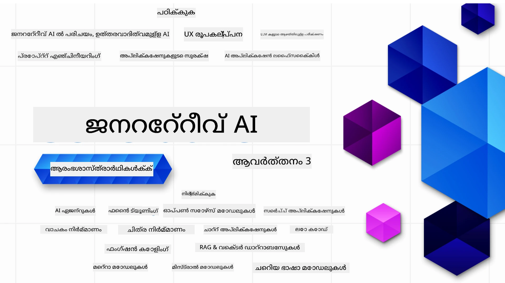

### Generative AI അപ്ലിക്കേഷനുകൾ നിർമ്മിക്കാൻ ആരംഭിക്കാൻ നിങ്ങൾ അറിയേണ്ടതെല്ലാം പഠിപ്പിക്കുന്ന 21 പാഠങ്ങൾ

[](https://github.com/microsoft/Generative-AI-For-Beginners/blob/master/LICENSE?WT.mc_id=academic-105485-koreyst)
[](https://GitHub.com/microsoft/Generative-AI-For-Beginners/graphs/contributors/?WT.mc_id=academic-105485-koreyst)
[](https://GitHub.com/microsoft/Generative-AI-For-Beginners/issues/?WT.mc_id=academic-105485-koreyst)
[](https://GitHub.com/microsoft/Generative-AI-For-Beginners/pulls/?WT.mc_id=academic-105485-koreyst)
[](http://makeapullrequest.com?WT.mc_id=academic-105485-koreyst)

[](https://GitHub.com/microsoft/Generative-AI-For-Beginners/watchers/?WT.mc_id=academic-105485-koreyst)
[](https://GitHub.com/microsoft/Generative-AI-For-Beginners/network/?WT.mc_id=academic-105485-koreyst)
[](https://GitHub.com/microsoft/Generative-AI-For-Beginners/stargazers/?WT.mc_id=academic-105485-koreyst)

[](https://discord.gg/nTYy5BXMWG)

### 🌐 ബഹുഭാഷാ പിന്തുണ

#### GitHub പ്രവർത്തനത്തിലൂടെ പിന്തുണ (സ്വയമേവയും എപ്പോഴും അപ്‌ടേറ്റ് ആണും)

<!-- CO-OP TRANSLATOR LANGUAGES TABLE START -->
[Arabic](../ar/README.md) | [Bengali](../bn/README.md) | [Bulgarian](../bg/README.md) | [Burmese (Myanmar)](../my/README.md) | [Chinese (Simplified)](../zh-CN/README.md) | [Chinese (Traditional, Hong Kong)](../zh-HK/README.md) | [Chinese (Traditional, Macau)](../zh-MO/README.md) | [Chinese (Traditional, Taiwan)](../zh-TW/README.md) | [Croatian](../hr/README.md) | [Czech](../cs/README.md) | [Danish](../da/README.md) | [Dutch](../nl/README.md) | [Estonian](../et/README.md) | [Finnish](../fi/README.md) | [French](../fr/README.md) | [German](../de/README.md) | [Greek](../el/README.md) | [Hebrew](../he/README.md) | [Hindi](../hi/README.md) | [Hungarian](../hu/README.md) | [Indonesian](../id/README.md) | [Italian](../it/README.md) | [Japanese](../ja/README.md) | [Kannada](../kn/README.md) | [Khmer](../km/README.md) | [Korean](../ko/README.md) | [Lithuanian](../lt/README.md) | [Malay](../ms/README.md) | [Malayalam](./README.md) | [Marathi](../mr/README.md) | [Nepali](../ne/README.md) | [Nigerian Pidgin](../pcm/README.md) | [Norwegian](../no/README.md) | [Persian (Farsi)](../fa/README.md) | [Polish](../pl/README.md) | [Portuguese (Brazil)](../pt-BR/README.md) | [Portuguese (Portugal)](../pt-PT/README.md) | [Punjabi (Gurmukhi)](../pa/README.md) | [Romanian](../ro/README.md) | [Russian](../ru/README.md) | [Serbian (Cyrillic)](../sr/README.md) | [Slovak](../sk/README.md) | [Slovenian](../sl/README.md) | [Spanish](../es/README.md) | [Swahili](../sw/README.md) | [Swedish](../sv/README.md) | [Tagalog (Filipino)](../tl/README.md) | [Tamil](../ta/README.md) | [Telugu](../te/README.md) | [Thai](../th/README.md) | [Turkish](../tr/README.md) | [Ukrainian](../uk/README.md) | [Urdu](../ur/README.md) | [Vietnamese](../vi/README.md)

> **പ്രാദേശികമായി ക്ലോൺ ചെയ്യാൻ ഇഷ്ടപ്പെടുന്നവർക്കായി?**
>
> 50+ ഭാഷാ ترجمات ഈ റിപ്പോസിറ്ററിക്ക് ഉൾപ്പെടുത്തിയതിനാൽ ഡൗൺലോഡ് വലുതാണ്. തർജ്ജമകളില്ലാതെ ക്ലോൺ ചെയ്യാൻ, sparse checkout ഉപയോഗിക്കുക:
>
> **Bash / macOS / Linux:**
> ```bash
> git clone --filter=blob:none --sparse https://github.com/microsoft/generative-ai-for-beginners.git
> cd generative-ai-for-beginners
> git sparse-checkout set --no-cone '/*' '!translations' '!translated_images'
> ```
>
> **CMD (Windows):**
> ```cmd
> git clone --filter=blob:none --sparse https://github.com/microsoft/generative-ai-for-beginners.git
> cd generative-ai-for-beginners
> git sparse-checkout set --no-cone "/*" "!translations" "!translated_images"
> ```
>
> ഇത് നിങ്ങളുടെ കോഴ്‌സ് പൂർത്തിയാക്കാൻ ആവശ്യമായ മുഴുവൻ വസ്തുക്കളും വളരെ വേഗത്തിൽ ഡൗൺലോഡ് ചെയ്യാൻ സഹായിക്കും.
<!-- CO-OP TRANSLATOR LANGUAGES TABLE END -->

# Generative AI for Beginners (പതിപ്പ് 3) - ഒരു കോഴ്‌സ്

Microsoft Cloud Advocates ഒരുക്കുന്ന 21 പാഠങ്ങളോടുകൂടിയ സമഗ്ര കോഴ്‌സിലൂടെ Generative AI അപ്ലിക്കേഷനുകൾ നിർമ്മിക്കുന്നതിന് അടിസ്ഥാനപരമായ കാര്യങ്ങൾ പഠിക്കുക.

## 🌱 ആരംഭിക്കുന്നത്

ഈ കോഴ്‌സിൽ 21 പാഠങ്ങളുണ്ട്. ഓരോ പാഠവും വിദഗ്ധ വിഷയം ഉൾക്കൊള്ളുന്നു, അതിനാൽ നിങ്ങൾ ഇഷ്ടമുള്ളവിധം ആരംഭിക്കാം!

പാഠങ്ങൾ "Learn" എന്ന അടിക്കുറിപ്പോടെ Generative AI ആശയം വിശദീകരിക്കുന്നു അല്ലെങ്കിൽ  സാധ്യമായപ്പോൾ **Python** ഉം **TypeScript** ഉം ഉപയോഗിച്ചുള്ള ഉള്ളടക്കം ഉൾക്കുന്ന "Build" പാഠങ്ങൾ ആയി വേർതിരിച്ചിരിക്കുന്നു.

.NET ഡെവലപ്പർമാർക്ക് വേണ്ടി [Generative AI for Beginners (.NET Edition)](https://github.com/microsoft/Generative-AI-for-beginners-dotnet?WT.mc_id=academic-105485-koreyst) കാണുക!

ഓരോ പാഠത്തിനുമുപരി "Keep Learning" എന്ന ഹെഡ്‌സെക്ഷനിൽ അധിക പഠന ഉപകരണങ്ങളും ഉൾപ്പെടുത്തിയിട്ടുണ്ട്.

## നിങ്ങൾക്ക് വേണ്ടത്
### ഈ കോഴ്സിന്റേ ഉള്ളടക്കം പ്രവർത്തിപ്പിക്കാൻ നിങ്ങൾക്ക് വ്യത്യസ്ത ഓപ്ഷനുകൾ ലഭ്യമാണ്: 
 - [Azure OpenAI Service](https://aka.ms/genai-beginners/azure-open-ai?WT.mc_id=academic-105485-koreyst) - **പാഠങ്ങൾ:** "aoai-assignment"
 - [GitHub Marketplace Model Catalog](https://aka.ms/genai-beginners/gh-models?WT.mc_id=academic-105485-koreyst) - **പാഠങ്ങൾ:** "githubmodels"
 - [OpenAI API](https://aka.ms/genai-beginners/open-ai?WT.mc_id=academic-105485-koreyst) - **പാഠങ്ങൾ:** "oai-assignment" 
   
- Python അല്ലെങ്കിൽ TypeScript അടിസ്ഥാന ജ്ഞാനം സഹായകരമാണ് - \*പൂർണ തുടക്കക്കാർക്ക് ഈ [Python](https://aka.ms/genai-beginners/python?WT.mc_id=academic-105485-koreyst) மற்றும் [TypeScript](https://aka.ms/genai-beginners/typescript?WT.mc_id=academic-105485-koreyst) കോഴ്‌സുകൾ നോക്കുക
- നിങ്ങളുടെGitHub അക്കൗണ്ടിലേക്ക് ഈ മുഴുവൻ റിപ്പോസിറ്ററി [fork ചെയ്യാൻ GitHub അക്കൗണ്ട്](https://aka.ms/genai-beginners/github?WT.mc_id=academic-105485-koreyst) ആവശ്യമാണ്

നമ്മൾ സഹായിക്കാൻ ഒരു **[കോഴ്‌സ് സെറ്റപ്പ്](./00-course-setup/README.md?WT.mc_id=academic-105485-koreyst)** പാഠം സൃഷ്ടിച്ചിട്ടുണ്ട്.

പിന്നീട് എളുപ്പം കണ്ടെത്താൻ ഈ റിപ്പോസിറ്ററി [താരകം (🌟) നൽകാൻ മറക്കാതെ ചെയ്യുക](https://docs.github.com/en/get-started/exploring-projects-on-github/saving-repositories-with-stars?WT.mc_id=academic-105485-koreyst).

## 🧠 വിനിയോഗത്തിന് തയ്യാറാണോ?

കൂടുതൽ പ്രാക്ടിക്കൽ കോഡ് സാമ്പിലുകൾക്ക്, ഞങ്ങളുടെ [Generative AI കോഡ് സാമ്പിളുകൾ](https://aka.ms/genai-beg-code?WT.mc_id=academic-105485-koreyst) Python ഉം TypeScript ഉം രണ്ട് ഭാഷകളിൽ ലഭ്യമാണ്.

## 🗣️ മറ്റ് learners-നെ കാണൂ, പിന്തുണ നേടൂ

ഈ കോഴ്‌സ് കടന്നുപോകുന്ന മറ്റ് learners-നെ കാണാനും ബന്ധപ്പെട്ടു സഹായം തേടാനും ഞങ്ങളുടെ [അധീകൃത Azure AI Foundry Discord സർവർ](https://aka.ms/genai-discord?WT.mc_id=academic-105485-koreyst) എ_join_ ചെയ്യുക.

അമേരിക്കൻ [Azure AI Foundry ഡെവലപ്പർ ഫോറത്തിൽ](https://aka.ms/azureaifoundry/forum) ചോദ്യങ്ങൾ ചോദിക്കാനും ഉത്പന്ന പ്രതികരണങ്ങൾ പങ്കുവെക്കാനും സാധിക്കും.

## 🚀 സ്റ്റാർട്ടപ്പ് ഉണ്ടാക്കുന്നുണ്ടോ?

[Microsoft for Startups](https://www.microsoft.com/startups) സന്ദർശിച്ച് ഇന്ന് തന്നെ Azure ക്രെഡിറ്റുകളുമായി തുടങ്ങാം.

## 🙏 സഹായിക്കാൻ ആഗ്രഹിക്കുന്നുണ്ടോ?

വ്യാകരണ പിശകുകളോ കോഡ് പിശകുകളോ കണ്ടെത്തിയോ സൂചനകൾ ഉണ്ടോ? [ഇഷ്യൂ ഉയർത്തൂ](https://github.com/microsoft/generative-ai-for-beginners/issues?WT.mc_id=academic-105485-koreyst) അല്ലെങ്കിൽ [പുൺഫ് അഭ്യർത്ഥന സമർപ്പിക്കുക](https://github.com/microsoft/generative-ai-for-beginners/pulls?WT.mc_id=academic-105485-koreyst)

## 📂 ഓരോ പാഠത്തിലും ഉണ്ടാക്കുന്നവ:

- വിഷയം പരിച്ചയപ്പെടുന്ന ചെറിയ വീഡിോ
- READMEയിൽ ഉള്ള എഴുത്തു പാഠം
- Azure OpenAI, OpenAI API പിന്തുണയ്ക്കുന്ന Python, TypeScript കോഡ് സാമ്പിളുകൾ
- പഠനം തുടർന്നുകൊടുക്കുന്ന അധിക വിഭവങ്ങളുടെ ലിങ്കുകൾ

## 🗃️ പാഠങ്ങൾ

| #   | **പാഠ ലിങ്ക്**                                                                                                                             | **വിവരണം**                                                                                  | **വീഡിയോ**                                                                   | **കൂടുതൽ പഠനം**                                                             |
| --- | ------------------------------------------------------------------------------------------------------------------------------------------- | --------------------------------------------------------------------------------------------- | ------------------------------------------------------------------------------ | ---------------------------------------------------------------------------- |
| 00  | [Course Setup](./00-course-setup/README.md?WT.mc_id=academic-105485-koreyst)                                                                  | **Learn:** എങ്ങനെ നിങ്ങളുടെ ഡെവലപ്‌മെന്റ് പരിസ്ഥിതി സജ്ജമാക്കാമെന്ന്                        | വീഡിയോ ഉടൻ വരുന്നു                                                             | [കൂടുതൽ അറിയുക](https://aka.ms/genai-collection?WT.mc_id=academic-105485-koreyst) |
| 01  | [Generative AI-വും LLMs-ഉം പരിചയപ്പെടൽ](./01-introduction-to-genai/README.md?WT.mc_id=academic-105485-koreyst)                                | **Learn:** Generative AI എന്താണെന്നും വലിയ ഭാഷാ മാതൃകകൾ എങ്ങനെ പ്രവൃത്തിക്കുന്നു എന്നും    | [വീഡിയോ](https://aka.ms/gen-ai-lesson-1-gh?WT.mc_id=academic-105485-koreyst)  | [കൂടുതൽ അറിയുക](https://aka.ms/genai-collection?WT.mc_id=academic-105485-koreyst) |
| 02  | [വിവിധ LLMs പരിശോധിക്കുകയും താരതമ്യം ചെയ്യുകയും ചെയ്യൽ](./02-exploring-and-comparing-different-llms/README.md?WT.mc_id=academic-105485-koreyst) | **Learn:** നിങ്ങളുടെ ഉപയോഗത്തിനായി ശരിയായ മോഡൽ എങ്ങനെ തിരഞ്ഞെടുക്കാം                        | [വീഡിയോ](https://aka.ms/gen-ai-lesson2-gh?WT.mc_id=academic-105485-koreyst)   | [കൂടുതൽ അറിയുക](https://aka.ms/genai-collection?WT.mc_id=academic-105485-koreyst) |
| 03  | [Generative AI ഉത്തരവാദിത്വത്തോടെ ഉപയോഗിക്കുമ്പോൾ](./03-using-generative-ai-responsibly/README.md?WT.mc_id=academic-105485-koreyst)               | **Learn:** Generative AI അപ്ലിക്കേഷനുകൾ ഉത്തരവാദിത്വത്തോടെ എങ്ങനെ നിർമ്മിക്കാം                | [വീഡിയോ](https://aka.ms/gen-ai-lesson3-gh?WT.mc_id=academic-105485-koreyst)   | [കൂടുതൽ അറിയുക](https://aka.ms/genai-collection?WT.mc_id=academic-105485-koreyst) |
| 04  | [പ്രാമ്പ്റ്റ് എഞ്ചിനീയറിങ് ഫണ്ടമെന്റലുകൾ മനസിലാക്കൽ](./04-prompt-engineering-fundamentals/README.md?WT.mc_id=academic-105485-koreyst)             | **കലിയ്ക്കുക:** ഹാൻഡ്‌സ്-ഓൺ പ്രാമ്പ്റ്റ് എഞ്ചിനീയറിങ് മികച്ച நடைമുറികൾ                                           | [വീഡിയോ](https://aka.ms/gen-ai-lesson4-gh?WT.mc_id=academic-105485-koreyst)  | [കൂടുതൽ അറിയുക](https://aka.ms/genai-collection?WT.mc_id=academic-105485-koreyst) |
| 05  | [അഡ്വാൻസ്ഡ് പ്രാമ്പ്റ്റുകൾ സൃഷ്ടിക്കൽ](./05-advanced-prompts/README.md?WT.mc_id=academic-105485-koreyst)                                                | **കലിയ്ക്കുക:** നിങ്ങളുടെ പ്രാമ്പ്റ്റുകളുടെ ഫലം മെച്ചപ്പെടുത്താൻ പ്രാമ്പ്റ്റ് എഞ്ചിനീയറിങ് സാങ്കേതികങ്ങൾ എങ്ങനെ ഉപയോഗിക്കാം എന്നത് | [വീഡിയോ](https://aka.ms/gen-ai-lesson5-gh?WT.mc_id=academic-105485-koreyst)  | [കൂടുതൽ അറിയുക](https://aka.ms/genai-collection?WT.mc_id=academic-105485-koreyst) |
| 06  | [ടെക്സ്റ്റ് ജനറേഷന്‍ ആപ്ലിക്കേഷനുകൾ സൃഷ്ടിക്കൽ](./06-text-generation-apps/README.md?WT.mc_id=academic-105485-koreyst)                                | **സൃഷ്‌ടിക്കുക:** അസ്യൂർ ഒപ്പൺഎഐ / ഒപ്പൺഎഐ എപിഐ ഉപയോഗിച്ച് ഒരു ടെക്സ്റ്റ് ജനറേഷൻ ആപ്പ്                                | [വീഡിയോ](https://aka.ms/gen-ai-lesson6-gh?WT.mc_id=academic-105485-koreyst)  | [കൂടുതൽ അറിയുക](https://aka.ms/genai-collection?WT.mc_id=academic-105485-koreyst) |
| 07  | [ചാറ്റ് ആപ്ലിക്കേഷനുകൾ സൃഷ്ടിക്കൽ](./07-building-chat-applications/README.md?WT.mc_id=academic-105485-koreyst)                                     | **സൃഷ്‌ടിക്കുക:** ചാറ്റ് ആപ്ലിക്കേഷനുകൾ കാര്യക്ഷമമായി നിർമ്മിക്കുകയും ഇന്റഗ്രേറ്റ് ചെയ്യുന്നതിന് സാങ്കേതികങ്ങൾ               | [വീഡിയോ](https://aka.ms/gen-ai-lessons7-gh?WT.mc_id=academic-105485-koreyst) | [കൂടുതൽ അറിയുക](https://aka.ms/genai-collection?WT.mc_id=academic-105485-koreyst) |
| 08  | [സേർച്ച് ആപ്ലിക്കേഷനുകൾ വെക്ടർ ഡാറ്റാബേസുകൾ സൃഷ്ടിക്കൽ](./08-building-search-applications/README.md?WT.mc_id=academic-105485-koreyst)                        | **സൃഷ്‌ടിക്കുക:** ഡാറ്റ തിരയാൻ എംബെഡിംഗുകൾ ഉപയോഗിക്കുന്ന ഒരു സേർച്ച് ആപ്ലിക്കേഷൻ                       | [വീഡിയോ](https://aka.ms/gen-ai-lesson8-gh?WT.mc_id=academic-105485-koreyst)  | [കൂടുതൽ അറിയുക](https://aka.ms/genai-collection?WT.mc_id=academic-105485-koreyst) |
| 09  | [ഇമേജ് ജനറേഷന്‍ ആപ്ലിക്കേഷനുകൾ സൃഷ്ടിക്കൽ](./09-building-image-applications/README.md?WT.mc_id=academic-105485-koreyst)                        | **സൃഷ്‌ടിക്കുക:** ഒരു ഇമേജ് ജനറേഷൻ ആപ്ലിക്കേഷൻ                                                       | [വീഡിയോ](https://aka.ms/gen-ai-lesson9-gh?WT.mc_id=academic-105485-koreyst)  | [കൂടുതൽ അറിയുക](https://aka.ms/genai-collection?WT.mc_id=academic-105485-koreyst) |
| 10  | [ലോ കോഡ് എഐ ആപ്ലിക്കേഷനുകൾ സൃഷ്ടിക്കൽ](./10-building-low-code-ai-applications/README.md?WT.mc_id=academic-105485-koreyst)                       | **സൃഷ്‌ടിക്കുക:** ലോ കോഡ് ഉപകരണം ഉപയോഗിച്ച് ഒരു ജനനാത്മക എഐ ആപ്ലിക്കേഷൻ                                     | [വീഡിയോ](https://aka.ms/gen-ai-lesson10-gh?WT.mc_id=academic-105485-koreyst) | [കൂടുതൽ അറിയുക](https://aka.ms/genai-collection?WT.mc_id=academic-105485-koreyst) |
| 11  | [ഫംഗ്ഷൻ കോൾ ചെയ്യലുമായി ബാഹ്യ ആപ്ലിക്കേഷനുകൾ ഇന്റഗ്രേറ്റ് ചെയ്യൽ](./11-integrating-with-function-calling/README.md?WT.mc_id=academic-105485-koreyst) | **സൃഷ്‌ടിക്കുക:** ഫംഗ്ഷൻ കോൾ ചെയ്യൽ എന്നത് എന്താണെന്നും ആപ്ലിക്കേഷനിൽ അത് എങ്ങനെ ഉപയോഗിക്കുന്നു എന്നതും                          | [വീഡിയോ](https://aka.ms/gen-ai-lesson11-gh?WT.mc_id=academic-105485-koreyst) | [കൂടുതൽ അറിയുക](https://aka.ms/genai-collection?WT.mc_id=academic-105485-koreyst) |
| 12  | [എഐ ആപ്ലിക്കേഷനുകൾക്ക് UX ഡിസൈൻ ചെയ്യൽ](./12-designing-ux-for-ai-applications/README.md?WT.mc_id=academic-105485-koreyst)                         | **കലിയ്ക്കുക:** ജനനാത്മക എഐ ആപ്ലിക്കേഷനുകൾ വികസിപ്പിക്കുമ്പോൾ UX ഡിസൈൻ സ 원ിയങ്ങൾ എങ്ങനെ പ്രയോഗിക്കാം         | [വീഡിയോ](https://aka.ms/gen-ai-lesson12-gh?WT.mc_id=academic-105485-koreyst) | [കൂടുതൽ അറിയുക](https://aka.ms/genai-collection?WT.mc_id=academic-105485-koreyst) |
| 13  | [ജനനാത്മക എഐ ആപ്ലിക്കഷനുകൾ സുരക്ഷിതമാക്കൽ](./13-securing-ai-applications/README.md?WT.mc_id=academic-105485-koreyst)                         | **കലിയ്ക്കുക:** എഐ സിസ്റ്റങ്ങളോട് നേരെയും അവ സംരക്ഷിക്കുന്നതിനു വേണ്ട രീതികളും ഭീഷണികളും            | [വീഡിയോ](https://aka.ms/gen-ai-lesson13-gh?WT.mc_id=academic-105485-koreyst) | [കൂടുതൽ അറിയുക](https://aka.ms/genai-collection?WT.mc_id=academic-105485-koreyst) |
| 14  | [ജനനാത്മക എഐ ആപ്ലിക്കേഷൻ ജീവിതചക്രം](./14-the-generative-ai-application-lifecycle/README.md?WT.mc_id=academic-105485-koreyst)           | **കലിയ്ക്കുക:** LLM ജീവിതചക്രവും LLMOps യും കൈകാര്യം ചെയ്യുന്നതിനുള്ള ഉപകരണങ്ങളും മാനദണ്ഡങ്ങളും                         | [വീഡിയോ](https://aka.ms/gen-ai-lesson14-gh?WT.mc_id=academic-105485-koreyst) | [കൂടുതൽ അറിയുക](https://aka.ms/genai-collection?WT.mc_id=academic-105485-koreyst) |
| 15  | [റിട്രീവൽ ഓഗ്മെന്റഡ് ജനറേഷൻ (RAG) ഉം വെക്ടർ ഡാറ്റാബേസുകളും](./15-rag-and-vector-databases/README.md?WT.mc_id=academic-105485-koreyst)        | **സൃഷ്‌ടിക്കുക:** വെക്ടർ ഡാറ്റാബേസുകളിൽ നിന്ന് എംബെഡിംഗുകൾ തിരിച്ചെടുക്കാൻ RAG ഫ്രെയിംവർക്ക് ഉപയോഗിക്കുന്ന ഒരു ആപ്ലിക്കേഷൻ  | [വീഡിയോ](https://aka.ms/gen-ai-lesson15-gh?WT.mc_id=academic-105485-koreyst) | [കൂടുതൽ അറിയുക](https://aka.ms/genai-collection?WT.mc_id=academic-105485-koreyst) |
| 16  | [ഓപ്പൺ സേർസ് മോഡലുകളും ഹഗ്ഗിംഗ് ഫേസും](./16-open-source-models/README.md?WT.mc_id=academic-105485-koreyst)                                    | **സൃഷ്‌ടിക്കുക:** ഹഗ്ഗിംഗ് ഫേസിൽ ലഭ്യമായ ഓപ്പൺ സോഴ്‌സ് മോഡലുകൾ ഉപയോഗിച്ച് ഒരു ആപ്ലിക്കേഷൻ                    | [വീഡിയോ](https://aka.ms/gen-ai-lesson16-gh?WT.mc_id=academic-105485-koreyst) | [കൂടുതൽ അറിയുക](https://aka.ms/genai-collection?WT.mc_id=academic-105485-koreyst) |
| 17  | [എഐ ഏജന്റുകൾ](./17-ai-agents/README.md?WT.mc_id=academic-105485-koreyst)                                                                       | **സൃഷ്‌ടിക്കുക:** ഒരു എഐ ഏജന്റ് ഫ്രെയിംവർക്ക് ഉപയോഗിക്കുന്ന ഒരു ആപ്ലിക്കേഷൻ                                           | [വീഡിയോ](https://aka.ms/gen-ai-lesson17-gh?WT.mc_id=academic-105485-koreyst) | [കൂടുതൽ അറിയുക](https://aka.ms/genai-collection?WT.mc_id=academic-105485-koreyst) |
| 18  | [LLMs ഫൈൻ-ട്യൂണിങ്ങ്](./18-fine-tuning/README.md?WT.mc_id=academic-105485-koreyst)                                                              | **കലിയ്ക്കുക:** LLMs ഫൈന്റ്റ്യൂണിങ്ങിന്റെ എന്താണ്, എന്തിനാണ്, എങ്ങനെ ചെയ്യുന്നതാണ് എന്നതിനെക്കുറിച്ച്                                            | [വീഡിയോ](https://aka.ms/gen-ai-lesson18-gh?WT.mc_id=academic-105485-koreyst) | [കൂടുതൽ അറിയുക](https://aka.ms/genai-collection?WT.mc_id=academic-105485-koreyst) |
| 19  | [SLMs ഉപയോഗിച്ച് സൃഷ്ടിക്കൽ](./19-slm/README.md?WT.mc_id=academic-105485-koreyst)                                                              | **കലിയ്ക്കുക:** ചെറു ഭാഷാ മോഡലുകൾ ഉപയോഗിച്ച് സൃഷ്ടിക്കുമ്പോൾ ലഭിക്കുന്ന ലാഭങ്ങൾ                                            | വാതിൽ ഉടൻ വരുന്നു | [കൂടുതൽ അറിയുക](https://aka.ms/genai-collection?WT.mc_id=academic-105485-koreyst) |
| 20  | [മിസ്റ്റ്രാൽ മോഡലുകൾ ഉപയോഗിച്ച് സൃഷ്ടിക്കൽ](./20-mistral/README.md?WT.mc_id=academic-105485-koreyst)                                                              | **കലിയ്ക്കുക:** മിസ്റ്റ്രാൽ കുടുംബ മോഡലുകളുടെ സവിശേഷതകളും വ്യത്യാസങ്ങളും                                           | വാതിൽ ഉടൻ വരുന്നു | [കൂടുതൽ അറിയുക](https://aka.ms/genai-collection?WT.mc_id=academic-105485-koreyst) |
| 21  | [മെറ്റാ മോഡലുകൾ ഉപയോഗിച്ച് സൃഷ്ടിക്കൽ](./21-meta/README.md?WT.mc_id=academic-105485-koreyst)                                                              | **കലിയ്ക്കുക:** മെറ്റാ കുടുംബ മോഡലുകളുടെ സവിശേഷതകളും വ്യത്യാസങ്ങളും                                           | വാതിൽ ഉടൻ വരുന്നു | [കൂടുതൽ അറിയുക](https://aka.ms/genai-collection?WT.mc_id=academic-105485-koreyst) |

### 🌟 പ്രത്യേക നന്ദി

എല്ലാ GitHub ആക്ഷനുകളും വർക്ക്‌ഫ്ലോകളും സൃഷ്ടിച്ചതിന് [**ജോൺ അസീസ്**](https://www.linkedin.com/in/john0isaac/) എന്ന വ്യക്തിക്ക് പ്രത്യേക നന്ദി

[**ബേണ്ഹാർഡ് മർക്ക്ലെ**](https://www.linkedin.com/in/bernhard-merkle-738b73/) ഓരോ പാഠത്തിനും ലേണർ അനുഭവവും കോഡ് അനുഭവവും മെച്ചപ്പെടുത്തുന്നതിന് നിർണായക സംഭാവനകൾ നൽകിയതിനും.

## 🎒 മറ്റ് കോഴ്സുകൾ

ഞങ്ങളുടെ ടീം മറ്റ് കോഴ്സുകളും നിർമ്മിക്കുന്നു! പരിശോധിക്കൂ:

<!-- CO-OP TRANSLATOR OTHER COURSES START -->
### LangChain
[](https://aka.ms/langchain4j-for-beginners)
[](https://aka.ms/langchainjs-for-beginners?WT.mc_id=m365-94501-dwahlin)
[](https://github.com/microsoft/langchain-for-beginners?WT.mc_id=m365-94501-dwahlin)
---

### Azure / Edge / MCP / ഏജന്റുകൾ
[](https://github.com/microsoft/AZD-for-beginners?WT.mc_id=academic-105485-koreyst)
[](https://github.com/microsoft/edgeai-for-beginners?WT.mc_id=academic-105485-koreyst)
[](https://github.com/microsoft/mcp-for-beginners?WT.mc_id=academic-105485-koreyst)
[](https://github.com/microsoft/ai-agents-for-beginners?WT.mc_id=academic-105485-koreyst)

---
 
### ജനറേറ്റീവ് എഐ പരമ്പര
[](https://github.com/microsoft/generative-ai-for-beginners?WT.mc_id=academic-105485-koreyst)
[-9333EA?style=for-the-badge&labelColor=E5E7EB&color=9333EA)](https://github.com/microsoft/Generative-AI-for-beginners-dotnet?WT.mc_id=academic-105485-koreyst)
[-C084FC?style=for-the-badge&labelColor=E5E7EB&color=C084FC)](https://github.com/microsoft/generative-ai-for-beginners-java?WT.mc_id=academic-105485-koreyst)
[-E879F9?style=for-the-badge&labelColor=E5E7EB&color=E879F9)](https://github.com/microsoft/generative-ai-with-javascript?WT.mc_id=academic-105485-koreyst)

---
 
### മുഖ്യ പഠന പ്രക്രിയ
[](https://aka.ms/ml-beginners?WT.mc_id=academic-105485-koreyst)
[](https://aka.ms/datascience-beginners?WT.mc_id=academic-105485-koreyst)
[](https://aka.ms/ai-beginners?WT.mc_id=academic-105485-koreyst)
[](https://github.com/microsoft/Security-101?WT.mc_id=academic-96948-sayoung)
[](https://aka.ms/webdev-beginners?WT.mc_id=academic-105485-koreyst)
[](https://aka.ms/iot-beginners?WT.mc_id=academic-105485-koreyst)
[](https://github.com/microsoft/xr-development-for-beginners?WT.mc_id=academic-105485-koreyst)

---
 
### കോപ്പിലോട്ട് പരമ്പര
[](https://aka.ms/GitHubCopilotAI?WT.mc_id=academic-105485-koreyst)
[](https://github.com/microsoft/mastering-github-copilot-for-dotnet-csharp-developers?WT.mc_id=academic-105485-koreyst)
[](https://github.com/microsoft/CopilotAdventures?WT.mc_id=academic-105485-koreyst)
<!-- CO-OP TRANSLATOR OTHER COURSES END -->

## സഹായം നേടുക

നിങ്ങള്‍ തടസ്സപ്പെടുകയോ എഐ അപ്ലിക്കേഷനുകള്‍ നിർമ്മിക്കുന്നതിനെക്കുറിച്ച് ഏതെങ്കിലും ചോദ്യം ഉണ്ടാകുകയോ ചെയ്താല്‍, MCP സംബന്ധിച്ച ചര്‍ച്ചകളില്‍ അനുഭവസമ്പന്നരായ ഡെവലപ്പര്‍മാരും പഠിച്ചുകൊണ്ടിരിക്കുന്നവര്‍ എല്ലാം ചേര്‍ക്കുക. ചോദ്യങ്ങള്‍ക്ക് സ്വാഗതം നല്‍കുന്ന, അറിവ് സ്വതന്ത്രമായി പങ്കുവെക്കുന്ന പിന്തുണയുള്ള ഒരു സമൂഹമാണ് ഇത്.

[](https://discord.gg/nTYy5BXMWG)

നിങ്ങളുടെ ഉല്‍പ്പന്ന പ്രതിപാദ്യം അല്ലെങ്കില്‍ സന്ദര്‍ശിക്കുന്നപ്പോള്‍ പിഴവുകള്‍ ഉണ്ടെങ്കില്‍ സന്ദര്‍ശിക്കുക:

[](https://aka.ms/foundry/forum)

---

<!-- CO-OP TRANSLATOR DISCLAIMER START -->
**അസ്വീകാരം**:  
ഈ പ്രമാണം AI അനുവാദം സേവനമായ [Co-op Translator](https://github.com/Azure/co-op-translator) ഉപയോഗിച്ച് വിവർത്തനം ചെയ്തതാണ്. ശരിയായി പരിഭാഷ ചെയ്യാനുള്ള ശ്രമം ചെയ്തെങ്കിലും, ഓട്ടോമേറ്റഡ് വിവർത്തനങ്ങളിൽ പിശകുകൾ അല്ലെങ്കിൽ തെറ്റായ വിവരം ഉണ്ടാകാൻ സാധ്യതയുണ്ട്. അതുകൊണ്ട്, അതിന്റെ മാതൃഭാഷയിലാണ് പ്രമാണം പ്രാമാണികമായ ഉറവിടമെന്ന് ശ്രദ്ധിക്കുക. അത്യാവശ്യ വിവരങ്ങൾക്ക്, പ്രൊഫഷണൽ മാന്‍വാലുള്ള വിവർത്തനം നിർദ്ദേശിക്കുന്നു. ഈ വിവർത്തനത്തിന്റെ ഉപയോഗത്തിൽ നിന്നുണ്ടാകുന്ന തെറ്റായ ആർത്ഥം അല്ലെങ്കിൽ തെറ്റിദ്ധാരണയ്ക്കായി ഞങ്ങൾ ഉത്തരവാദികളല്ല.
<!-- CO-OP TRANSLATOR DISCLAIMER END -->