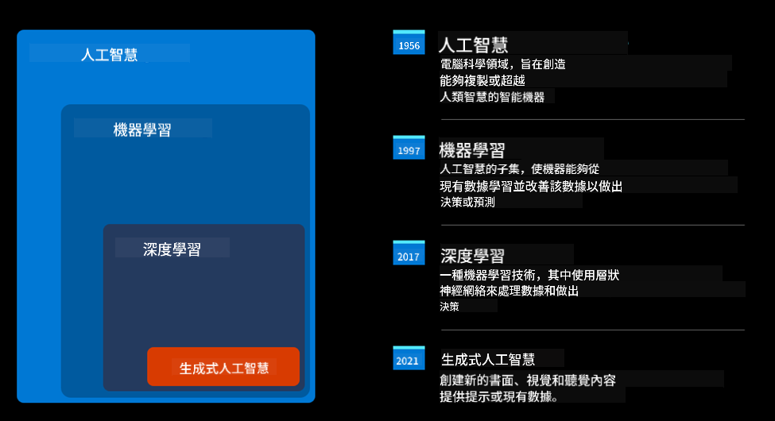
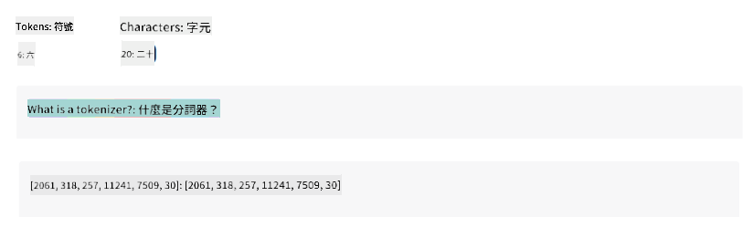
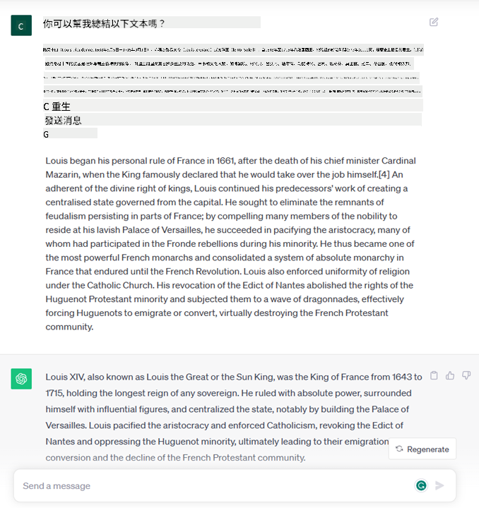
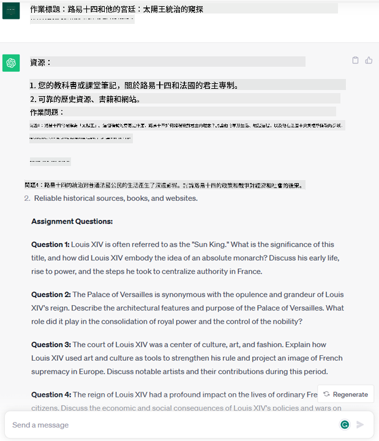
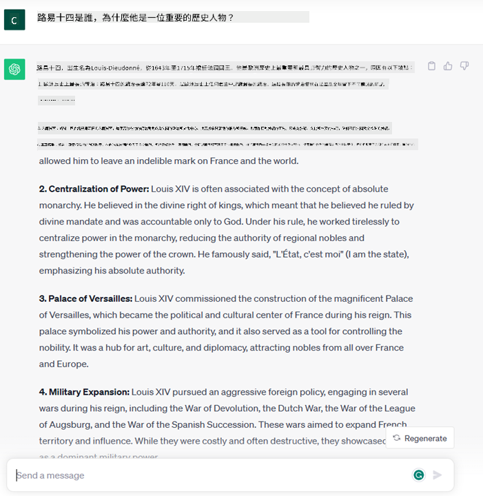
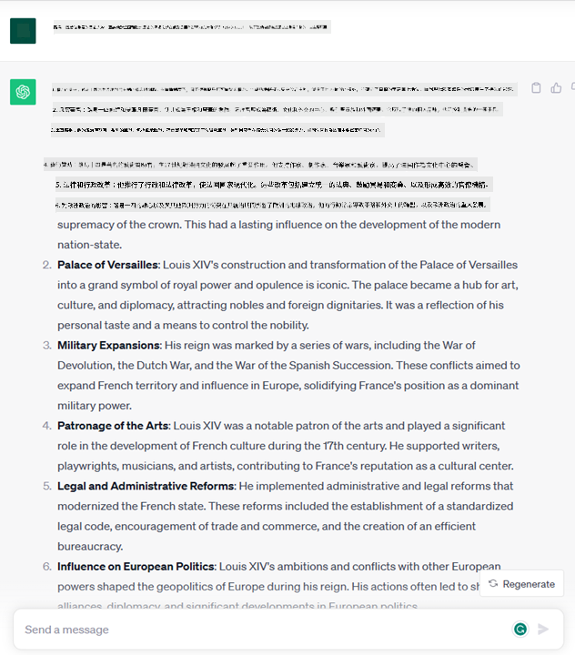
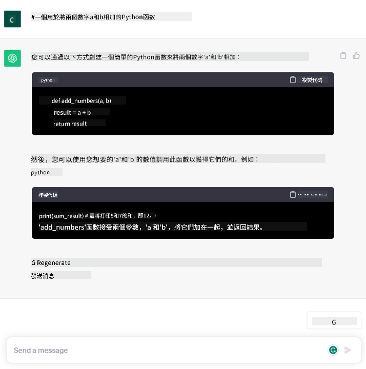

<!--
CO_OP_TRANSLATOR_METADATA:
{
  "original_hash": "f53ba0fa49164f9323043f1c6b11f2b1",
  "translation_date": "2025-06-25T09:40:20+00:00",
  "source_file": "01-introduction-to-genai/README.md",
  "language_code": "mo"
}
-->
# 生成式人工智慧與大型語言模型簡介

_(點擊上方圖片觀看本課程的影片)_

生成式人工智慧是一種能夠生成文本、圖像及其他類型內容的人工智慧。這項技術的卓越之處在於它使人工智慧普及化，任何人只需使用自然語言撰寫的文本提示，即可使用它。你不需要學習像Java或SQL這樣的語言來完成有意義的事情，只需要使用你的語言，說出你想要的內容，人工智慧模型就會給出建議。這種應用及其影響巨大，能在幾秒鐘內撰寫或理解報告、撰寫應用程式等等。

在本課程中，我們將探討我們的初創公司如何利用生成式人工智慧在教育領域開創新場景，以及如何應對其應用的社會影響和技術限制所帶來的不可避免的挑戰。

## 簡介

本課程將涵蓋：

- 商業場景簡介：我們的初創公司理念和使命。
- 生成式人工智慧及我們如何在當前技術環境中取得突破。
- 大型語言模型的內部運作。
- 大型語言模型的主要功能和實際使用案例。

## 學習目標

完成本課程後，你將了解：

- 什麼是生成式人工智慧以及大型語言模型如何運作。
- 如何利用大型語言模型滿足不同使用案例，尤其是教育場景。

## 場景：我們的教育初創公司

生成式人工智慧代表著人工智慧技術的巔峰，推動著曾被認為不可能的界限。生成式人工智慧模型具有多種功能和應用，但在本課程中，我們將探討它如何通過虛構的初創公司來革新教育。我們將稱這個初創公司為_我們的初創公司_。我們的初創公司在教育領域工作，擁有雄心勃勃的使命宣言：

> _提高全球學習的可及性，確保公平獲得教育，根據每個學習者的需求提供個性化學習體驗_。

我們的初創公司團隊知道，若不利用現代最強大的工具之一——大型語言模型（LLMs），我們將無法達成這一目標。

生成式人工智慧預計將革新我們今天的學習和教學方式，學生可以全天候使用虛擬教師獲得大量信息和示例，教師則能利用創新工具評估學生並提供反饋。

首先，讓我們定義一些基本概念和術語，這些將在整個課程中使用。

## 我們如何獲得生成式人工智慧？

儘管最近生成式人工智慧模型的公告引起了非凡的_炒作_，但這項技術已經經過數十年的發展，最早的研究工作可追溯到60年代。如今，我們已經達到了一個人工智慧具有類似人類認知能力的階段，比如像[OpenAI ChatGPT](https://openai.com/chatgpt)或[Bing Chat](https://www.microsoft.com/edge/features/bing-chat?WT.mc_id=academic-105485-koreyst)這樣的例子，它們使用GPT模型進行網路搜尋Bing對話。

回顧一下，最早的人工智慧原型由打字機聊天機器人組成，依賴於從一組專家提取並表示到計算機中的知識庫。知識庫中的答案由輸入文本中出現的關鍵字觸發。
然而，很快就發現使用打字機聊天機器人的方法不具備良好的擴展性。

### 統計方法的人工智慧：機器學習

90年代出現了一個轉折點，將統計方法應用於文本分析。這導致了新算法的發展——即機器學習——能夠從數據中學習模式而不需要明確編程。這種方法使機器能夠模擬人類語言理解：統計模型在文本-標籤配對上進行訓練，使模型能夠用預定義的標籤分類未知的輸入文本，代表信息的意圖。

### 神經網絡與現代虛擬助手

近年來，能夠處理更大數據量和更複雜計算的硬件技術進化，促進了人工智慧研究，導致了被稱為神經網絡或深度學習算法的先進機器學習算法的發展。

神經網絡（尤其是循環神經網絡——RNNs）顯著增強了自然語言處理，能夠以更有意義的方式表示文本的含義，重視句子中詞語的上下文。

這就是在新世紀的第一個十年誕生的虛擬助手的技術，這些助手非常擅長解釋人類語言，識別需求，並執行滿足需求的行動——例如用預定義的腳本回答或消耗第三方服務。

### 當今的生成式人工智慧

這就是我們如何來到今天的生成式人工智慧，可以看作是深度學習的一個子集。

經過人工智慧領域數十年的研究，一種新的模型架構——稱為_Transformer_——克服了RNNs的限制，能夠以更長的文本序列作為輸入。Transformer基於注意力機制，使模型能夠給予接收到的輸入不同的權重，‘更關注’最相關信息集中的地方，無論它們在文本序列中的順序如何。

大多數最近的生成式人工智慧模型——也稱為大型語言模型（LLMs），因為它們以文本輸入和輸出工作——確實基於這一架構。這些模型——在大量未標記數據上進行訓練，來自書籍、文章和網站等多種來源——的有趣之處在於它們可以適應各種任務，並生成語法正確的文本，具有創造性的外觀。因此，它們不僅顯著增強了機器‘理解’輸入文本的能力，而且使其能夠用人類語言生成原創的回應。

## 大型語言模型如何運作？

在下一章中，我們將探討不同類型的生成式人工智慧模型，但現在讓我們來看看大型語言模型如何運作，重點是OpenAI GPT（生成式預訓練Transformer）模型。

- **Tokenizer，文本轉數字**：大型語言模型接收文本作為輸入並生成文本作為輸出。然而，作為統計模型，它們處理數字比文本序列效果更好。這就是為什麼每個模型的輸入在使用核心模型之前都由tokenizer處理。Token是文本的一部分——由可變數量的字符組成，因此tokenizer的主要任務是將輸入分割成token數組。然後，每個token映射到一個token索引，即原始文本部分的整數編碼。

- **預測輸出token**：給定n個token作為輸入（最大n因模型而異），模型能夠預測一個token作為輸出。然後，這個token被納入下一次迭代的輸入中，形成擴展窗口模式，提供更好的用戶體驗，獲得一個（或多個）句子作為答案。這解釋了為什麼如果你曾經玩過ChatGPT，你可能注意到有時它看起來像是在句子中途停止。

- **選擇過程，概率分佈**：模型根據當前文本序列之後出現的概率選擇輸出token。這是因為模型根據其訓練預測所有可能‘下一個token’的概率分佈。然而，並不總是從結果分佈中選擇概率最高的token。這個選擇中加入了一定程度的隨機性，以使模型以非確定性方式行動——我們不會得到相同的輸入相同的輸出。這種隨機性是為了模擬創造性思考過程，可以通過稱為溫度的模型參數進行調整。

## 我們的初創公司如何利用大型語言模型？

現在我們對大型語言模型的內部運作有了更好的理解，讓我們看看一些它們能夠非常好地執行的最常見任務的實際例子，並關注我們的商業場景。
我們說大型語言模型的主要能力是_從頭生成文本，從自然語言撰寫的文本輸入開始_。

但什麼樣的文本輸入和輸出呢？
大型語言模型的輸入被稱為提示，而輸出被稱為完成，這個術語指的是模型生成下一個token以完成當前輸入的機制。我們將深入探討什麼是提示以及如何設計它以充分利用我們的模型。但現在，我們只說提示可能包括：

- **指令**指定我們期望模型輸出的類型。這個指令有時可能嵌入一些示例或額外數據。

  1. 文章、書籍、產品評論等的摘要，以及從非結構化數據中提取洞察力。
    
    
  
  2. 創意構思和設計文章、論文、作業或更多。
      
     

- **問題**，以與代理對話的形式提出。
  
  

- **文本完成**的一部分，隱含的是寫作協助的要求。
  
  

- 一段**程式碼**，要求解釋和記錄它，或者要求生成執行特定任務的程式碼片段的評論。
  
  

以上示例相對簡單，並非旨在全面展示大型語言模型的能力。它們旨在展示使用生成式人工智慧的潛力，尤其是在教育環境中，但不限於此。

此外，生成式人工智慧模型的輸出並不完美，有時模型的創造力可能會對其不利，導致輸出是人類用戶可以解釋為現實扭曲或可能冒犯的詞語組合。生成式人工智慧並不具備智能——至少在更全面的智能定義中，包括批判性和創造性推理或情感智能；它不是確定性的，也不值得信賴，因為虛構，例如錯誤的引用、內容和陳述，可能與正確的信息結合在一起，以令人信服和自信的方式呈現。在接下來的課程中，我們將處理所有這些限制，並看看我們可以做什麼來減輕它們。

## 作業

你的作業是更多地閱讀[生成式人工智慧](https://en.wikipedia.org/wiki/Generative_artificial_intelligence?WT.mc_id=academic-105485-koreyst)，並嘗試識別一個今天尚未應用生成式人工智慧的領域。其影響與“舊方法”有何不同，是否可以做以前無法做到的事情，或者是否更快？寫一篇300字的摘要，描述你的夢想人工智慧初創公司會是什麼樣子，並包含“問題”、“我如何使用人工智慧”、“影響”以及可選的商業計劃等標題。

如果你完成了這項任務，你甚至可能準備好申請微軟的孵化器，[Microsoft for Startups Founders Hub](https://www.microsoft.com/startups?WT.mc_id=academic-105485-koreyst)，我們提供Azure、OpenAI、指導等方面的信用，快來看看！

## 知識檢查

關於大型語言模型，哪些是正確的？

1. 每次都得到完全相同的回應。
1. 它完美地執行任務，擅長加法、生成有效程式碼等。
1. 儘管使用相同的提示，回應可能會有所不同。它也擅長提供某些東西的初稿，無論是文本還是程式碼。但你需要改進結果。

A: 3，LLM是非確定性的，回應會有所不同，然而，你可以通過溫度設置來控制其變化。你也不應期望它完美地執行任務，它是來幫你做繁重工作的，這通常意味著你得到一個好的初步嘗試，需要逐步改進。

## 做得好！繼續探索

完成本課程後，查看我們的[生成式人工智慧學習集合](https://aka.ms/genai-collection?WT.mc_id=academic-105485-koreyst)，繼續提升你的生成式人工智慧知識！

前往第二課，我們將探討如何[探索和比較不同的LLM類型](../02-exploring-and-comparing-different-llms/README.md?WT.mc_id=academic-105485-koreyst)！

**免責聲明**：
本文件使用 AI 翻譯服務 [Co-op Translator](https://github.com/Azure/co-op-translator) 進行翻譯。儘管我們努力確保準確性，請注意自動翻譯可能包含錯誤或不精確之處。原始文件的母語版本應被視為權威來源。對於關鍵信息，建議尋求專業人工翻譯。我們不對使用此翻譯所引起的任何誤解或誤釋承擔責任。