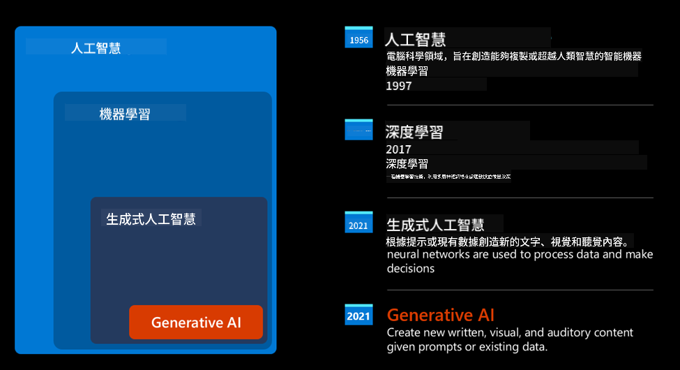
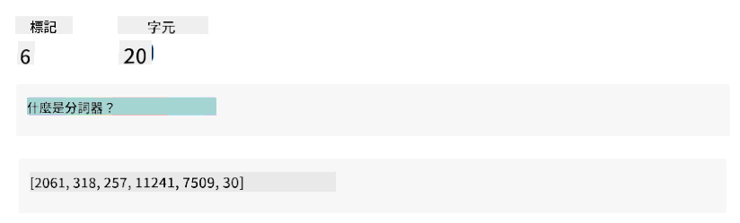
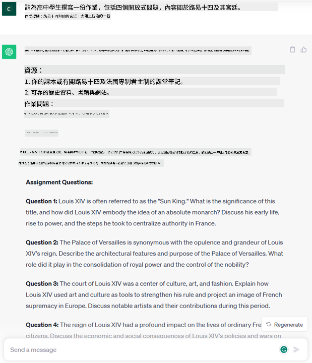
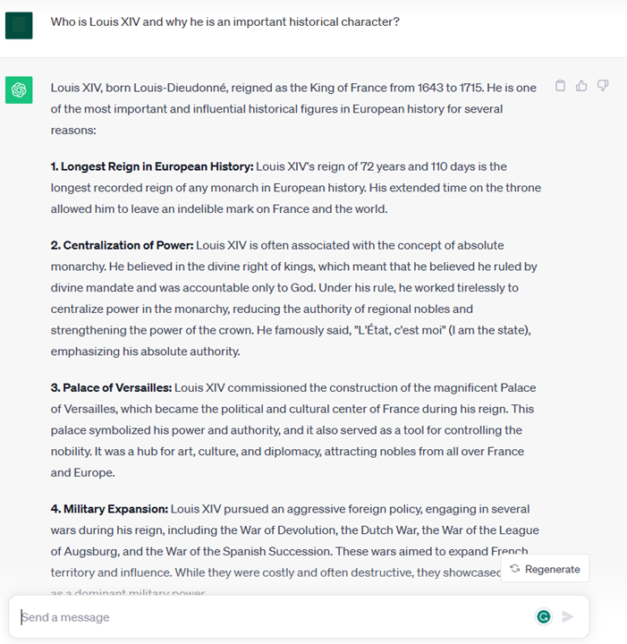

<!--
CO_OP_TRANSLATOR_METADATA:
{
  "original_hash": "f53ba0fa49164f9323043f1c6b11f2b1",
  "translation_date": "2025-07-09T07:44:25+00:00",
  "source_file": "01-introduction-to-genai/README.md",
  "language_code": "mo"
}
-->
# 生成式人工智慧與大型語言模型簡介

_(點擊上方圖片觀看本課程影片)_

生成式人工智慧是能夠產生文字、圖片及其他類型內容的人工智慧。它之所以成為一項了不起的技術，是因為它讓 AI 大眾化，任何人只要輸入簡單的文字提示，一句自然語言的句子，就能使用它。你不需要學習 Java 或 SQL 這類程式語言來完成有意義的工作，只要用自己的語言表達需求，AI 模型就會給出建議。這項技術的應用與影響非常廣泛，無論是撰寫或理解報告、撰寫應用程式等，都能在數秒內完成。

在本課程中，我們將探討我們的新創公司如何運用生成式 AI，開啟教育領域的新場景，以及如何面對其應用所帶來的社會影響與技術限制。

## 簡介

本課程將涵蓋：

- 商業場景介紹：我們的新創公司理念與使命。
- 生成式 AI 及我們如何進入現今的技術環境。
- 大型語言模型的內部運作原理。
- 大型語言模型的主要功能與實際應用案例。

## 學習目標

完成本課程後，你將了解：

- 什麼是生成式 AI，以及大型語言模型如何運作。
- 如何運用大型語言模型於不同應用場景，特別聚焦於教育領域。

## 場景：我們的教育新創公司

生成式人工智慧代表了 AI 技術的巔峰，突破了過去被認為不可能的界限。生成式 AI 模型具備多種能力與應用，但在本課程中，我們將透過一個虛構的新創公司，探討它如何革新教育。我們稱這家公司為 _我們的新創公司_。我們的新創公司專注於教育領域，懷抱著以下宏大使命：

> _提升全球學習的可及性，確保教育公平，並根據每位學習者的需求，提供個人化的學習體驗。_

我們團隊深知，若不運用現代最強大的工具之一——大型語言模型（LLMs），將無法達成這個目標。

生成式 AI 預計將徹底改變我們今天的學習與教學方式，學生能隨時隨地擁有虛擬教師，提供大量資訊與範例，教師則能利用創新工具評估學生並給予回饋。

首先，讓我們定義一些在課程中會用到的基本概念與術語。

## 生成式 AI 是怎麼來的？

儘管生成式 AI 模型最近引起了極大的 _熱潮_，但這項技術其實已經發展了數十年，最早的研究可追溯到 1960 年代。如今的 AI 已具備類似人類認知能力，例如對話功能，像是 [OpenAI ChatGPT](https://openai.com/chatgpt) 或 [Bing Chat](https://www.microsoft.com/edge/features/bing-chat?WT.mc_id=academic-105485-koreyst)（後者也使用 GPT 模型來支援 Bing 網頁搜尋對話）。

回顧過去，最早的 AI 原型是打字機式的聊天機器人，依賴從專家群體中萃取的知識庫，並以電腦形式呈現。知識庫中的回答會根據輸入文字中的關鍵字觸發。然而，很快就發現這種打字機式聊天機器人無法有效擴展。

### AI 的統計方法：機器學習

90 年代出現了轉捩點，開始將統計方法應用於文字分析，催生了機器學習這類新演算法，能從資料中學習模式，而不需明確編程。這種方法讓機器能模擬人類語言理解：透過訓練文字與標籤配對的統計模型，能將未知輸入文字分類為預先定義的意圖標籤。

### 神經網路與現代虛擬助理

近年來，硬體技術的進步使得處理更大量資料與更複雜運算成為可能，推動 AI 研究發展出先進的機器學習演算法，稱為神經網路或深度學習演算法。

神經網路（尤其是循環神經網路 RNN）大幅提升了自然語言處理能力，能更有意義地表達文字的意涵，重視句中詞彙的上下文。

這項技術支撐了新世紀初誕生的虛擬助理，能熟練理解人類語言、辨識需求並執行動作，例如用預設腳本回答或調用第三方服務。

### 現今的生成式 AI

這就是我們走到今日生成式 AI 的歷程，它可視為深度學習的一個子領域。

經過數十年的 AI 研究，一種稱為 _Transformer_ 的新模型架構突破了 RNN 的限制，能處理更長的文字序列。Transformer 基於注意力機制，讓模型能對輸入的不同部分賦予不同權重，專注於最重要的資訊，無論它們在文字序列中的位置。

大多數近期的生成式 AI 模型，也就是大型語言模型（LLMs），都是基於此架構。這些模型在大量未標記的多元資料（如書籍、文章、網站）上訓練，能適應各種任務，並產生語法正確且具創意的文字。它們不僅大幅提升機器「理解」輸入文字的能力，也能生成原創的回應。

## 大型語言模型如何運作？

接下來的章節我們會探討不同類型的生成式 AI 模型，但現在先來看看大型語言模型的運作原理，重點放在 OpenAI GPT（Generative Pre-trained Transformer）模型。

- **分詞器，文字轉數字**：大型語言模型以文字作為輸入並產生文字輸出，但作為統計模型，它們對數字比文字序列更有效率。因此，每個輸入都會先經過分詞器處理。分詞器的任務是將輸入文字切分成一串「詞元」（token），每個詞元包含可變數量的字元。接著，每個詞元會被映射成一個整數索引，作為原始文字片段的編碼。

- **預測輸出詞元**：給定 n 個詞元作為輸入（最大 n 依模型而異），模型能預測下一個詞元作為輸出。此詞元會被加入下一輪輸入中，形成擴展視窗模式，讓使用者能獲得一個或多個句子的回答。這也解釋了為什麼使用 ChatGPT 時，有時會感覺它在句子中途停止。

- **選擇過程，機率分布**：模型根據詞元在當前文字序列後出現的機率來選擇輸出詞元。模型會對所有可能的「下一個詞元」計算機率分布，基於訓練結果。然而，並非總是選擇機率最高的詞元。模型會加入一定程度的隨機性，使其行為非決定性——同一輸入不一定產生完全相同的輸出。這種隨機性模擬創意思考過程，可透過稱為溫度（temperature）的參數調整。

## 我們的新創公司如何運用大型語言模型？

了解大型語言模型的內部運作後，讓我們看看它們能執行的常見任務範例，並結合我們的商業場景。

大型語言模型的主要能力是 _從頭生成文字，起點是自然語言的文字輸入_。

那麼，輸入與輸出是什麼樣的文字呢？大型語言模型的輸入稱為提示（prompt），輸出稱為完成（completion），指模型生成下一個詞元以完成當前輸入的機制。我們將深入探討什麼是提示，以及如何設計提示以充分發揮模型效能。但目前先說，提示可能包含：

- 一個 **指令**，說明我們期望模型產生的輸出類型。指令有時會包含範例或額外資料。

  1. 文章、書籍、產品評論等的摘要，以及從非結構化資料中萃取洞見。
    
    
  
  2. 創意構思與撰寫文章、論文、作業等。
      
     

- 以對話形式向代理人提出的 **問題**。
  
  

- 一段需要 **補全的文字**，隱含請求寫作協助。
  
  

- 一段 **程式碼**，並請求解釋與文件說明，或是請求生成執行特定任務的程式碼片段。
  
  

以上範例相當簡單，並非要全面展示大型語言模型的能力，而是為了呈現生成式 AI 的潛力，尤其是在教育領域，但不限於此。

此外，生成式 AI 的輸出並非完美，有時模型的創意反而會造成輸出內容讓使用者感覺像是現實的迷惑，甚至可能冒犯人。生成式 AI 並非真正的智慧——至少不是包含批判性與創造性推理或情緒智慧的廣義智慧；它也非決定性，且不完全可靠，因為錯誤的引用、內容與陳述可能與正確資訊混合，且以具說服力且自信的方式呈現。在後續課程中，我們將探討這些限制，並了解如何減輕它們的影響。

## 作業

請閱讀更多關於[生成式 AI](https://en.wikipedia.org/wiki/Generative_artificial_intelligence?WT.mc_id=academic-105485-koreyst)的資料，並嘗試找出一個目前尚未使用生成式 AI 的領域。思考如果用生成式 AI 取代「舊有方式」，會帶來什麼不同的影響？你能做以前做不到的事嗎？還是速度更快？請撰寫一篇 300 字的摘要，描述你理想中的 AI 新創公司，並包含標題如「問題」、「我如何使用 AI」、「影響」，以及選擇性加入商業計畫。

完成此任務後，你甚至可以準備申請微軟的育成計畫 [Microsoft for Startups Founders Hub](https://www.microsoft.com/startups?WT.mc_id=academic-105485-koreyst)，我們提供 Azure、OpenAI、導師輔導等多項資源，歡迎了解！

## 知識檢測

關於大型語言模型，下列哪項正確？

1. 每次都會得到完全相同的回應。
2. 它能完美執行任務，擅長加法、產生可運作的程式碼等。
3. 即使使用相同提示，回應也可能不同。它擅長提供初稿，無論是文字或程式碼，但你需要進一步改進結果。

答案：3。大型語言模型是非決定性的，回應會有所變化，但你可以透過溫度參數控制變異度。你也不應期望它完美執行任務，它的目的是幫你完成繁重工作，通常能給你一個不錯的初稿，之後再逐步改進。

## 做得好！繼續前進

完成本課程後，請參考我們的[生成式 AI 學習資源集](https://aka.ms/genai-collection?WT.mc_id=academic-105485-koreyst)，持續提升你的生成式 AI 知識！
前往第二課，我們將探討如何[探索並比較不同類型的 LLM](../02-exploring-and-comparing-different-llms/README.md?WT.mc_id=academic-105485-koreyst)！

**免責聲明**：  
本文件係使用 AI 翻譯服務 [Co-op Translator](https://github.com/Azure/co-op-translator) 進行翻譯。雖然我們致力於確保準確性，但請注意，自動翻譯可能包含錯誤或不準確之處。原始文件的母語版本應視為權威來源。對於重要資訊，建議採用專業人工翻譯。我們不對因使用本翻譯而產生的任何誤解或誤釋負責。