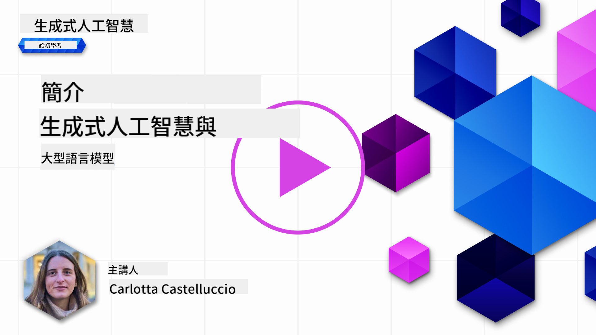
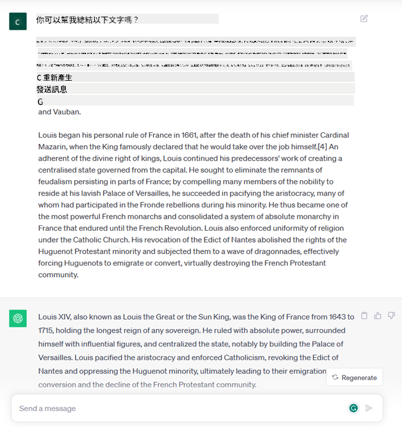

<!--
CO_OP_TRANSLATOR_METADATA:
{
  "original_hash": "bfb7901bdbece1ba3e9f35c400ca33e8",
  "translation_date": "2025-10-17T15:18:15+00:00",
  "source_file": "01-introduction-to-genai/README.md",
  "language_code": "mo"
}
-->
# 生成式人工智慧與大型語言模型簡介

_(點擊上方圖片觀看本課程影片)_

生成式人工智慧是一種能夠生成文字、圖像及其他類型內容的人工智慧技術。這項技術的驚人之處在於它使人工智慧更加普及化，任何人只需輸入一段自然語言的文字提示即可使用它。您不需要學習像 Java 或 SQL 這樣的程式語言來完成有價值的事情，只需使用您的語言，說出您的需求，AI 模型就能提供建議。其應用範圍和影響力非常巨大，您可以在幾秒鐘內撰寫或理解報告、撰寫應用程式等等。

在這份課程中，我們將探討我們的初創公司如何利用生成式人工智慧在教育領域開創新場景，以及如何應對其應用所帶來的社會影響和技術限制的挑戰。

## 簡介

本課程將涵蓋：

- 商業場景介紹：我們的初創公司理念與使命。
- 生成式人工智慧及其在當前技術環境中的定位。
- 大型語言模型的內部運作。
- 大型語言模型的主要功能及實際應用案例。

## 學習目標

完成本課程後，您將了解：

- 什麼是生成式人工智慧以及大型語言模型如何運作。
- 如何利用大型語言模型進行不同的應用，特別是聚焦於教育場景。

## 場景：我們的教育初創公司

生成式人工智慧代表了人工智慧技術的巔峰，突破了曾經被認為不可能的界限。生成式人工智慧模型擁有多種功能和應用，但在本課程中，我們將探討它如何通過一個虛構的初創公司徹底改變教育。我們將稱這個初創公司為 _我們的初創公司_。我們的初創公司專注於教育領域，其雄心勃勃的使命宣言是：

> _改善全球學習的可及性，確保公平的教育機會，並根據每位學習者的需求提供個性化的學習體驗。_

我們的初創公司團隊深知，若不利用現代最強大的工具之一——大型語言模型（LLMs），我們將無法實現這一目標。

生成式人工智慧預計將徹底改變我們今天的學習和教學方式，學生可以隨時隨地使用虛擬教師獲取大量信息和範例，而教師則能利用創新工具評估學生並提供反饋。

首先，讓我們定義一些基本概念和術語，這些將在整個課程中使用。

## 生成式人工智慧的誕生

儘管最近生成式人工智慧模型的發布引起了極大的 _熱潮_，但這項技術已經有數十年的發展歷史，最早的研究可以追溯到 1960 年代。我們現在處於人工智慧擁有類似人類認知能力的階段，例如 [OpenAI ChatGPT](https://openai.com/chatgpt) 或 [Bing Chat](https://www.microsoft.com/edge/features/bing-chat?WT.mc_id=academic-105485-koreyst) 展現的對話能力，後者也使用 GPT 模型進行網頁搜索和 Bing 對話。

回顧一下，最早的人工智慧原型是基於打字機的聊天機器人，依賴於從專家群體中提取的知識庫並將其表示到計算機中。知識庫中的答案由輸入文本中的關鍵字觸發。
然而，很快就發現這種基於打字機聊天機器人的方法並不具備良好的擴展性。

### 人工智慧的統計方法：機器學習

在 1990 年代，應用統計方法進行文本分析成為了一個轉折點。這導致了新算法的開發——即機器學習——能夠從數據中學習模式，而無需明確編程。這種方法使機器能夠模擬人類語言理解：統計模型在文本與標籤配對上進行訓練，使模型能夠用預定義的標籤分類未知的輸入文本，該標籤代表消息的意圖。

### 神經網絡與現代虛擬助手

近年來，硬體技術的進步使得能夠處理更大數據量和更複雜計算的設備得以問世，促進了人工智慧研究，進而開發出被稱為神經網絡或深度學習算法的高級機器學習算法。

神經網絡（特別是循環神經網絡 RNNs）顯著提升了自然語言處理能力，使得文本的意義能夠以更有意義的方式表示，並重視句子中單詞的上下文。

這項技術推動了本世紀第一個十年誕生的虛擬助手，它們非常擅長解釋人類語言，識別需求，並執行滿足需求的操作——例如用預定義的腳本回答或使用第三方服務。

### 現在的生成式人工智慧

這就是我們今天生成式人工智慧的誕生，它可以被視為深度學習的一個子集。

經過數十年的人工智慧領域研究，一種新的模型架構——稱為 _Transformer_——克服了 RNNs 的限制，能夠接受更長的文本序列作為輸入。Transformer 基於注意力機制，使模型能夠對接收到的輸入賦予不同的權重，‘更加關注’最相關信息集中的地方，而不受其在文本序列中的順序影響。

大多數最近的生成式人工智慧模型——也被稱為大型語言模型（LLMs），因為它們處理文本輸入和輸出——確實基於這種架構。這些模型的有趣之處在於，它們訓練於大量未標記的數據，來源包括書籍、文章和網站，並且可以適應多種任務，生成語法正確且具有一定創意的文本。因此，它們不僅極大地提升了機器‘理解’輸入文本的能力，還使其能夠以人類語言生成原創回應。

## 大型語言模型如何運作？

在下一章中，我們將探討不同類型的生成式人工智慧模型，但現在讓我們先了解大型語言模型的運作方式，重點是 OpenAI GPT（生成預訓練 Transformer）模型。

- **分詞器，將文本轉換為數字**：大型語言模型接收文本作為輸入並生成文本作為輸出。然而，作為統計模型，它們處理數字比文本序列更有效。因此，每個輸入在被核心模型使用之前都會通過分詞器進行處理。分詞器的主要任務是將輸入拆分為一系列的分詞（token），每個分詞由可變數量的字符組成。然後，每個分詞都會映射到一個分詞索引，即原始文本片段的整數編碼。

- **預測輸出分詞**：給定 n 個分詞作為輸入（最大 n 隨模型而異），模型能夠預測一個分詞作為輸出。該分詞然後被納入下一次迭代的輸入中，形成擴展窗口模式，提供更好的用戶體驗，生成一個（或多個）句子作為答案。這解釋了為什麼如果您曾使用過 ChatGPT，可能會注意到有時它似乎在句子中途停止。

- **選擇過程，概率分佈**：模型根據當前文本序列後出現的概率選擇輸出分詞。這是因為模型基於其訓練預測所有可能‘下一個分詞’的概率分佈。然而，並非總是選擇概率最高的分詞。這一選擇中加入了一定程度的隨機性，使模型以非確定性方式行事——對於相同的輸入，我們不會每次都得到完全相同的輸出。這種隨機性是為了模擬創造性思維的過程，可以通過模型參數“溫度”進行調整。

## 我們的初創公司如何利用大型語言模型？

現在我們對大型語言模型的內部運作有了更好的理解，讓我們看看它們能夠執行的最常見任務的一些實際例子，並聚焦於我們的商業場景。
我們提到，大型語言模型的主要功能是 _從零開始生成文本，基於自然語言撰寫的文本輸入_。

但什麼樣的文本輸入和輸出呢？
大型語言模型的輸入被稱為提示（prompt），而輸出被稱為完成（completion），這個術語指的是模型生成下一個分詞以完成當前輸入的機制。我們將深入探討什麼是提示以及如何設計提示以充分利用模型。但現在，我們先簡單說明提示可能包括：

- **指令**，指定我們期望模型生成的輸出類型。這些指令有時可能包含一些範例或額外數據。

  1. 對文章、書籍、產品評論等進行摘要，並從非結構化數據中提取洞察。
    
    
  
  2. 創意構思和設計文章、論文、作業等。
      
     

- **問題**，以與代理對話的形式提出。
  
  

- 一段 **待完成的文本**，隱含地要求提供寫作協助。
  
  

- 一段 **程式碼**，並要求解釋和記錄它，或者一段評論要求生成執行特定任務的程式碼。
  
  

以上示例相對簡單，並非旨在全面展示大型語言模型的能力。它們旨在展示使用生成式人工智慧的潛力，特別是在但不限於教育背景中。

此外，生成式人工智慧模型的輸出並不完美，有時模型的創造性可能會適得其反，導致輸出是人類用戶可能解讀為現實扭曲的詞語組合，或者可能具有冒犯性。生成式人工智慧並不智能——至少在更全面的智能定義中，包括批判性和創造性推理或情感智能；它不是確定性的，也不值得完全信任，因為錯誤的引用、內容和陳述可能與正確的信息結合在一起，以令人信服和自信的方式呈現。在接下來的課程中，我們將處理所有這些限制，並探討如何減輕它們。

## 作業

您的作業是進一步閱讀 [生成式人工智慧](https://en.wikipedia.org/wiki/Generative_artificial_intelligence?WT.mc_id=academic-105485-koreyst)，並嘗試識別一個目前尚未使用生成式人工智慧的領域，您希望在其中添加生成式人工智慧。與“舊方式”相比，影響會有什麼不同？您是否能夠完成以前無法完成的事情，或者是否能更快地完成？請撰寫一篇 300 字的摘要，描述您的夢想人工智慧初創公司，並包含像“問題”、“我如何使用人工智慧”、“影響”以及可選的商業計劃等標題。

如果您完成了這項任務，您甚至可能準備好申請微軟的孵化器 [Microsoft for Startups Founders Hub](https://www.microsoft.com/startups?WT.mc_id=academic-105485-koreyst)，我們提供 Azure、OpenAI、指導等方面的資源，快來了解更多吧！

## 知識檢測

關於大型語言模型，以下哪項是正確的？

1. 每次都會得到完全相同的回應。
2. 它能完美地完成任務，例如加法、生成可用的程式碼等。
3. 即使使用相同的提示，回應也可能有所不同。它也非常擅長提供某些東西的初稿，無論是文本還是程式碼。但您需要對結果進行改進。

A: 3，LLM 是非確定性的，回應可能會有所不同，但您可以通過溫度設置來控制其變化。您也不應期望它完美地完成所有事情，它的作用是幫助您完成繁重的工作，通常意味著您會得到一個良好的初步嘗試，然後需要逐步改進。

## 幹得好！繼續學習之旅

完成本課程後，請查看我們的 [生成式人工智慧學習合集](https://aka.ms/genai-collection?WT.mc_id=academic-105485-koreyst)，繼續提升您的生成式人工智慧知識！
前往第 2 課，我們將探討如何[探索和比較不同的 LLM 類型](../02-exploring-and-comparing-different-llms/README.md?WT.mc_id=academic-105485-koreyst)!

---

**免責聲明**：  
本文件已使用 AI 翻譯服務 [Co-op Translator](https://github.com/Azure/co-op-translator) 進行翻譯。儘管我們努力確保翻譯的準確性，但請注意，自動翻譯可能包含錯誤或不準確之處。原始文件的母語版本應被視為權威來源。對於關鍵信息，建議使用專業人工翻譯。我們對因使用此翻譯而引起的任何誤解或誤釋不承擔責任。