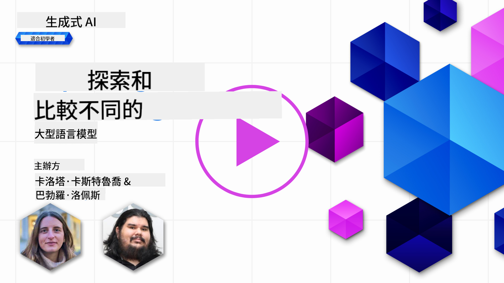
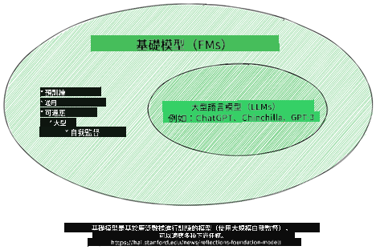
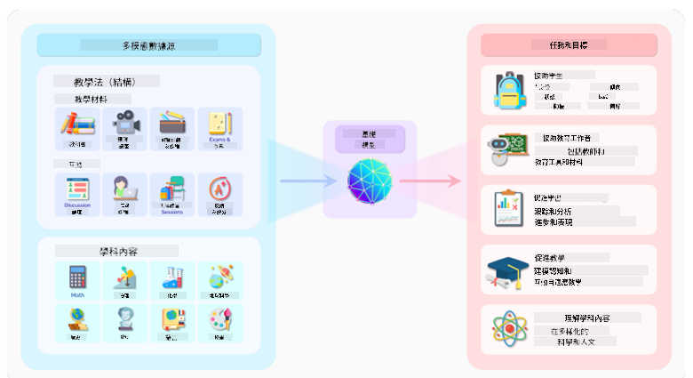
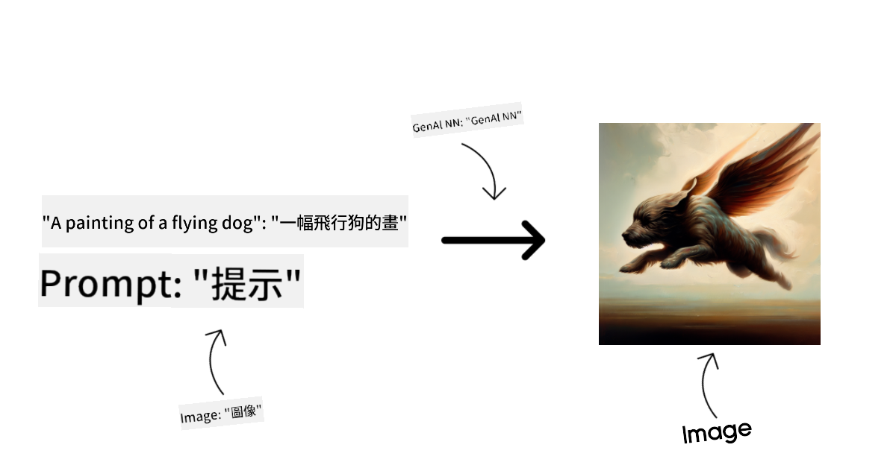
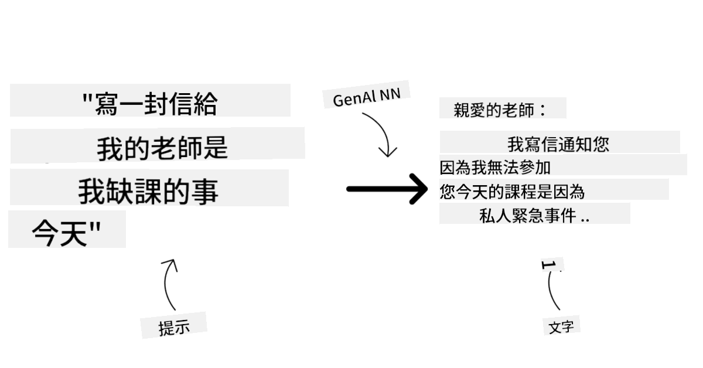
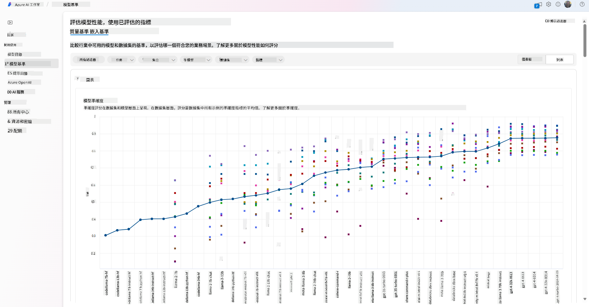
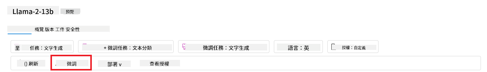
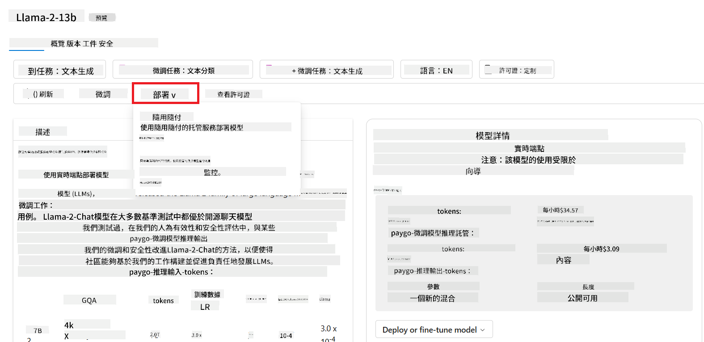
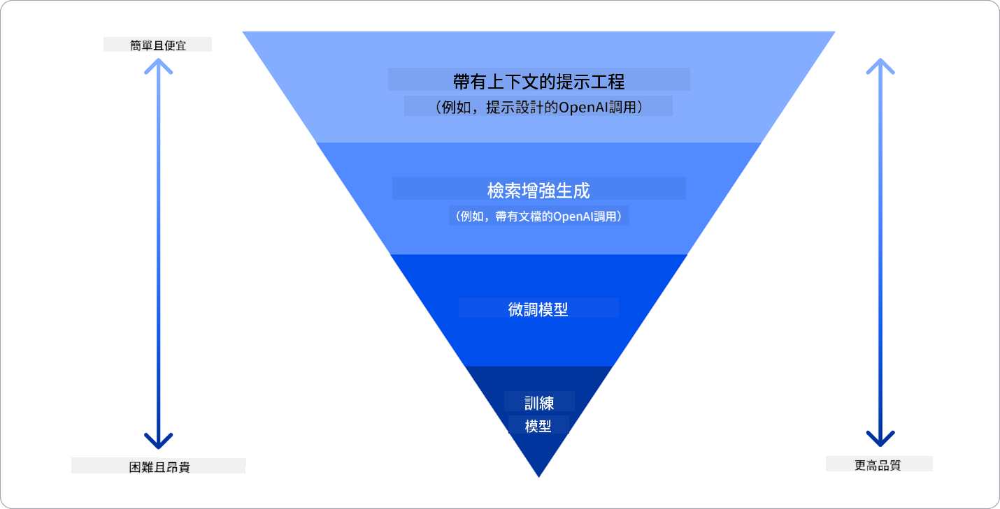

<!--
CO_OP_TRANSLATOR_METADATA:
{
  "original_hash": "e2f686f2eb794941761252ac5e8e090b",
  "translation_date": "2025-05-19T13:47:28+00:00",
  "source_file": "02-exploring-and-comparing-different-llms/README.md",
  "language_code": "mo"
}
-->
# Istera LLM dibe daftara xwe bidin

> _Ji bo tema vê derse wêneya jor click bikin_

Di dersa berê de, me dît ku AI Generative çawa dîmenê teknolîjiyê diguherîne, çawa Modelên Zimanê Mezin (LLM) dixebitin û çawa karîbar - wekî startup me - dikare wan li ser kesayêt xwe bikar bîne û mezin bibe! Di vê babetê de, em têne rastîn û di cîh de lêkera cûre-cûrên modelên zimanê mezin (LLM) da ku têgihiştinê li ser serhildanên wan û zayendên wan bibînin.

Gava dîrokê ya startup me ye ku modelên LLM yên heyî bibîne û têgihiştin ku kîjan ji bo kesayêt me têkildar in.

## Pêşkeftin

Ev ders têne bistînin:

- Cûre-cûrên LLM yên li dîmenê heyî.
- Biceribîn, iterate kirin û modelên cûre-cûr ji bo kesayêt xwe di Azure de bi hev re anîn.
- Çawa LLMek veguheztin.

## Hedefên Fêrbûnê

Piştî ku vê dersê qedandin, hûn dikarin:

- Modela rast ji bo kesayêt xwe hilbijêrin.
- Têgihiştin çawa modela xwe biceribînin, iterate bikin, û şanoya wan baş bikin.
- Zanîn çawa karîbar modelên veguhezin.

## Têgihiştin cûre-cûrên LLM

LLM dikarin bi piranî kategorîyan li ser binyadê xwe, daneyên fêrkirinê, û kesayêt xwe ve bibe. Têgihiştin vê cûreyê dê startup meyê alîkar bibe ku modela rast ji bo senaryo hilbijêre, û çawa têgihiştin, iterate bikin, û şanoya wan baş bikin.

Modelên LLM pir hene, hilbijartina modelê têgihiştin li ser kîjan karîbar hûn dixwazin wan bikar bînin, daneyên hûn, çi qas hûn amade ne ku têvî dayîn û zêdetir.

Li gorî ku hûn dixwazin modelên ji bo nivîsînê, dengê, vîdyo, çêkirina wêneyê û hwd., hûn dikarin modelê cûrê cuda hilbijêrin.

- **Deng û nasnameya axaftinê**. Ji bo vê armancê, modelên wîsper ne bijareke baş in ji ber ku ew modelên berfireh ne û li ser nasnameya axaftinê diçin. Ew di axaftinên pirane de fêr dikin û dikarin nasnameya axaftinê li zimanên cûrê cuda bikar bînin. Zêdetir fêr bibin li ser [modelên wîsper li vir](https://platform.openai.com/docs/models/whisper?WT.mc_id=academic-105485-koreyst).

- **Çêkirina wêneyê**. Ji bo çêkirina wêneyê, DALL-E û Midjourney du bijareya pir nasname ne. DALL-E ji aliyê Azure OpenAI ve pêşkêş dibe. [Zêdetir fêr bibin li ser DALL-E li vir](https://platform.openai.com/docs/models/dall-e?WT.mc_id=academic-105485-koreyst) û hwd. di Babeta 9ê ya vê dersê de.

- **Çêkirina nivîsê**. Pir modelên li ser çêkirina nivîsê fêr dikin û hûn pêşniyarên pirane hene ji bo GPT-3.5 heta GPT-4. Ew bi pîvanên cuda têvî dayînê têne pêşkêş kirin û GPT-4 herî guherbar e. Şayeste ye ku li ser [Azure OpenAI playground](https://oai.azure.com/portal/playground?WT.mc_id=academic-105485-koreyst) binirxînin kîjan modelên herî baş li ser pêşniyara we têne pêşkêş kirin.

- **Cudayîya modalan**. Heke hûn dixwazin pirane modalan bi pêşniyarên cuda bikar bînin, hûn dikarin modelên cûrê cuda hilbijêrin wekî [gpt-4 turbo with vision or gpt-4o](https://learn.microsoft.com/azure/ai-services/openai/concepts/models#gpt-4-and-gpt-4-turbo-models?WT.mc_id=academic-105485-koreyst) - modelên OpenAI ya herî dawî - ku dikarin zimanê nûçeyê bi têgihiştina wêneyê ve girêdan bikin, di navbera modalan bi pêşniyarên cuda de pêşnîyarkirin.

Hilbijartina modelê wate ye ku hûn hûn bûyînên bingehîn têgihiştin, lê di heman demê de ne yeter e. Pir caran hûn daneyên taybetî yên kompanya hûn hene ku hûn hewce ne modela LLMê li ser wan fêr bikin. Hene çand jî modelên cuda çê dikin, zêdetir li ser vê di babetên pêşîn de.

### Modelên Bingehîn ji ber modelên LLM

Termê Modela Bingehîn ji aliyê [lêkolînerên Stanford ve hatî afirandin](https://arxiv.org/abs/2108.07258?WT.mc_id=academic-105485-koreyst) û wekî modelê AI têne diyar kirin ku li gorî bûyerên taybetî, wekî:

- **Ew bi fêrkirina bêyî sarkêşî an fêrkirina bi sarkêşî fêr dikin**, wate ew di ser daneyên bê nişan an multi-modalan di fêr dikin, û ew ji nişanê an têgihiştina mirovê hewce ne.
- **Ew modelên pir mezin in**, ku li ser torên nervên pirenehînên pirane di fêr dikin.
- **Ew bûyerên bingehîn ji modelên din in**, wate ew dikarin wekî bingehîn ji modelên din têne bikar anîn, ku dikarin bi tune kirinê.

Çavkanî: [Rehberê Bingehîn ji bo Modelên Bingehîn û Modelên Zimanê Mezin | Babar M Bhatti | Medium](https://thebabar.medium.com/essential-guide-to-foundation-models-and-large-language-models-27dab58f7404)

Ji bo zêdetir piştrastina vê cudayiyê, bibînin ChatGPT wekî mînakê. Ji bo çêkirina berê ya ChatGPT, modelê ku GPT-3.5 wekî modelê bingehîn bikar têne anîn. Ev wate ye ku OpenAI daneyên taybetî ya sohbetê bikar anîn ku versiyona GPT-3.5 çêbikin ku di senaryoyên peyivînê de taybetî bû.

Çavkanî: [2108.07258.pdf (arxiv.org)](https://arxiv.org/pdf/2108.07258.pdf?WT.mc_id=academic-105485-koreyst)

### Modelên Open Source ji ber Modelên Taybetî

Şopandinên din yên ji bo kategorîkirina LLM jî têne bikar anîn.

Modelên open-source modelên ne ku ji aliyê giştî têne pêşkêş kirin û dikarin ji aliyê kîjan karîbar bikar bînin. Ew pir caran ji aliyê kompanya ku ew afirandin, an ji aliyê civata lêkolîneran têne pêşkêş kirin. Ew modelên têne bibînin, guherandin, û ji bo kesayêtên cûre-cûr têne taybetandin. Lê ew pir caran ji bo bikar anînê di pêşnîyarkirinê de ne mezin in, û dikarin wekî modelên taybetî ne performant in. Pêşniyarkirin ji bo modelên open-source dikare kêm bibe, û ew dikarin ne di meya dirêj de ne taybetî bûnin an ne di binyadê lêkolînên herî dawî de bûnin. Mînakên modelên open-source yên nasnamekê [Alpaca](https://crfm.stanford.edu/2023/03/13/alpaca.html?WT.mc_id=academic-105485-koreyst), [Bloom](https://huggingface.co/bigscience/bloom) û [LLaMA](https://llama.meta.com) ne.

Modelên taybetî modelên ne ku ji aliyê kompanya ku ew ne têne pêşkêş kirin. Ew modelên pir caran ji bo bikar anînê di pêşnîyarkirinê de têne taybetandin. Lê ew ne têne bibînin, guherandin, an taybetandin ji bo kesayêtên cûre-cûr. Hwd., ew pir caran ne bi belaş têne pêşkêş kirin, û dikarin xwerûya an têvî dayînê hewce bûn. Jî, bikarhêner ne kontrolê li ser daneyên ku ji bo fêrkirina modelê têne bikar anîn, ku wate ew hewce ne ku xwediyê modelê bişopîne ku ew ji bo taybetîya daneyên bişopîne û bişopîne. Mînakên modelên taybetî yên nasnamekê [modelên OpenAI](https://platform.openai.com/docs/models/overview?WT.mc_id=academic-105485-koreyst), [Google Bard](https://sapling.ai/llm/bard?WT.mc_id=academic-105485-koreyst) an [Claude 2](https://www.anthropic.com/index/claude-2?WT.mc_id=academic-105485-koreyst) ne.

### Embedding versus Çêkirina Wêneyê versus Çêkirina Nivîsê û Koda

LLM dikarin wekî kategorî li ser derketina wan têne kategorî kirin.

Embeddings modelên ne ku dikarin nivîsa teqîna nûmerîk bikar anîn, ku embedding têne gotin, ku wate nivîsa teqîna nûmerîk ya nivîsê têne nivîsandin. Embeddings dikarin bişopînin ku makinên têgihiştin li ser peywendiyên di navbera peyvên an cümleyên de bikin û dikarin wekî derketina modelên din, wekî modelên kategorî, an modelên ku ji bo dîmenên nûmerîk şanoyên baş hene, têne bikar anîn. Modelên embedding pir caran ji bo fêrkirina vegerînê têne bikar anîn, ku modelê wekî armancê taybetî ya modelê ku ji bo ew modelên ku fêrbûnên teqîna teqîna teqîna têne bikar anîn, û paşê giranên modelê (embeddings) ji bo karîbarên din têne bikar anîn. Mînak ji vê kategorîye [OpenAI embeddings](https://platform.openai.com/docs/models/embeddings?WT.mc_id=academic-105485-koreyst) ne.

Modelên çêkirina wêneyê modelên ne ku wêneyan çêdikin. Ew modelên pir caran ji bo guherandina wêneyê, çêkirina wêneyê, û vegerîna wêneyê têne bikar anîn. Modelên çêkirina wêneyê pir caran ji bo dîmenên mezin yên wêneyê, wekî [LAION-5B](https://laion.ai/blog/laion-5b/?WT.mc_id=academic-105485-koreyst), têne fêr kirin, û dikarin wêneyên nû çêbikin an wêneyên heyî biguherînin bi teknîkên inpainting, super-resolution, û colorization. Mînakên hwd. [DALL-E-3](https://openai.com/dall-e-3?WT.mc_id=academic-105485-koreyst) û [Stable Diffusion models](https://github.com/Stability-AI/StableDiffusion?WT.mc_id=academic-105485-koreyst) ne.

Modelên çêkirina nivîsê û koda modelên ne ku nivîs an koda çêdikin. Ew modelên pir caran ji bo têgihiştina nivîsê, vegerîn, û bersivdan têne bikar anîn. Modelên çêkirina nivîsê pir caran ji bo dîmenên mezin yên nivîsê, wekî [BookCorpus](https://www.cv-foundation.org/openaccess/content_iccv_2015/html/Zhu_Aligning_Books_and_ICCV_2015_paper.html?WT.mc_id=academic-105485-koreyst), têne fêr kirin, û dikarin nivîsa nû çêbikin, an bersivan bidin. Modelên çêkirina koda, wekî [CodeParrot](https://huggingface.co/codeparrot?WT.mc_id=academic-105485-koreyst), pir caran ji bo dîmenên mezin yên koda, wekî GitHub, têne fêr kirin, û dikarin koda nû çêbikin, an çewtîyan di koda heyî de çêbikin.

### Encoder-Decoder versus Encoder-only

Ji bo bîranîna cûrên cuda yên bingehînên LLM, em analogiyek bikar tînin.

Imkanê ku serokê hûnê we taskek ji bo nivîsarên xwendekarên binivîse. Hûn du hevkar hene; yek li ser çêkirina peyvên li hemberî wêne ye û yê din li ser vegerandinê ye.

Çêkerê peyvên di xebitandinê de wekî modelê Encoder-only ye, ew dikarin tema bibînin û bibînin çi hûn pêşnîyar kirin û paşê ew dikarin kursê li ser wêne çêbikin. Ew di çêkirina peyvên girêdayî û agahdar pir baş in, lê ew di têgihiştina tema û armancên fêrkirinê de ne baş in. Hene mînakên modelên Encoder ne modelên GPT family, wekî GPT-3.

Rehberê di çêkirina vegerandinê de wekî modelê Encoder-only ye, ew tema û bersivên li ser kursê têne vegerandin, li peyvên di navbera wan de têgihiştin û agahdar têne kirin, lê ew di çêkirina peyvên de ne baş in. Mînak ji modelê Encoder-only bernameyê BERT ye.

Imkanê ku hûn kesek jî hene ku dikare peyvên çêbikin û vegerandin, ev modelê Encoder-Decoder ye. Hene mînakên hwd. BART û T5 ne.

### Xizmet versus Model

Niha, em bi tenê di navbera xizmet û modelê de peyivîn bikar anîn. Xizmetê pêşnîyarek e ku ji aliyê Pêşkêşkarê Xizmeta Cloud têne pêşkêş kirin, û pir caran li ser modelên, daneyên, û hwd. têne pêşkêş kirin. Modelê bingehê xizmetê ye, û pir caran modelê bingehîn e, wekî LLM.

Xizmetên pir caran ji bo bikar anînê di pêşnîyarkirinê de têne taybetandin û pir caran hêsan in ku têne bikar anîn, bi şopandina GUI. Lê xizmetên pir caran ne bi belaş têne pêşkêş kirin, û dikarin xwerûya an têvî dayînê hewce bûn, di pêşnîyarkirinê de bişopîne. Mînak ji xizmetê pê
- Bandingkan tolok ukur di seluruh model dan dataset yang tersedia di industri untuk menilai mana yang memenuhi skenario bisnis, melalui panel [Model Benchmarks](https://learn.microsoft.com/azure/ai-studio/how-to/model-benchmarks?WT.mc_id=academic-105485-koreyst).

- Sesuaikan model dengan data pelatihan khusus untuk meningkatkan kinerja model dalam beban kerja tertentu, dengan memanfaatkan kemampuan eksperimen dan pelacakan dari Azure AI Studio.

- Sebarkan model pra-terlatih asli atau versi yang telah disesuaikan ke inferensi waktu nyata yang dikelola secara remote - komputasi terkelola - atau endpoint api tanpa server - [bayar sesuai penggunaan](https://learn.microsoft.com/azure/ai-studio/how-to/model-catalog-overview#model-deployment-managed-compute-and-serverless-api-pay-as-you-go?WT.mc_id=academic-105485-koreyst) - untuk memungkinkan aplikasi menggunakannya.

> [!NOTE]
> Tidak semua model dalam katalog saat ini tersedia untuk penyesuaian dan/atau penyebaran bayar sesuai penggunaan. Periksa kartu model untuk detail tentang kemampuan dan keterbatasan model.

## Meningkatkan Hasil LLM

Kami telah menjelajahi dengan tim startup kami berbagai jenis LLM dan Platform Cloud (Azure Machine Learning) yang memungkinkan kami membandingkan model yang berbeda, mengevaluasi mereka pada data uji, meningkatkan kinerja dan menyebarkannya pada endpoint inferensi.

Tetapi kapan mereka harus mempertimbangkan untuk menyempurnakan model daripada menggunakan yang pra-terlatih? Apakah ada pendekatan lain untuk meningkatkan kinerja model dalam beban kerja tertentu?

Ada beberapa pendekatan yang dapat digunakan bisnis untuk mendapatkan hasil yang mereka butuhkan dari LLM. Anda dapat memilih berbagai jenis model dengan tingkat pelatihan yang berbeda saat menyebarkan LLM dalam produksi, dengan tingkat kompleksitas, biaya, dan kualitas yang berbeda. Berikut adalah beberapa pendekatan berbeda:

- **Rekayasa prompt dengan konteks**. Idenya adalah memberikan konteks yang cukup saat Anda memberikan prompt untuk memastikan Anda mendapatkan respons yang Anda butuhkan.

- **Retrieval Augmented Generation, RAG**. Data Anda mungkin ada dalam database atau endpoint web misalnya, untuk memastikan data ini, atau subset darinya, disertakan pada saat memberikan prompt, Anda dapat mengambil data yang relevan dan menjadikannya bagian dari prompt pengguna.

- **Model yang disesuaikan**. Di sini, Anda melatih model lebih lanjut dengan data Anda sendiri yang membuat model lebih tepat dan responsif terhadap kebutuhan Anda tetapi mungkin mahal.

Sumber gambar: [Four Ways that Enterprises Deploy LLMs | Fiddler AI Blog](https://www.fiddler.ai/blog/four-ways-that-enterprises-deploy-llms?WT.mc_id=academic-105485-koreyst)

### Rekayasa Prompt dengan Konteks

LLM yang pra-terlatih bekerja sangat baik pada tugas bahasa alami yang umum, bahkan dengan memanggil mereka dengan prompt pendek, seperti kalimat untuk diselesaikan atau pertanyaan – yang disebut pembelajaran “zero-shot”.

Namun, semakin banyak pengguna dapat membingkai pertanyaan mereka, dengan permintaan dan contoh yang terperinci – Konteks – semakin akurat dan sesuai dengan harapan pengguna jawaban akan menjadi. Dalam kasus ini, kita berbicara tentang pembelajaran “one-shot” jika prompt hanya mencakup satu contoh dan “few-shot learning” jika mencakup beberapa contoh.
Rekayasa prompt dengan konteks adalah pendekatan paling hemat biaya untuk memulai.

### Retrieval Augmented Generation (RAG)

LLM memiliki batasan bahwa mereka hanya dapat menggunakan data yang telah digunakan selama pelatihan mereka untuk menghasilkan jawaban. Ini berarti bahwa mereka tidak tahu apa pun tentang fakta yang terjadi setelah proses pelatihan mereka, dan mereka tidak dapat mengakses informasi non-publik (seperti data perusahaan).
Ini dapat diatasi melalui RAG, sebuah teknik yang memperkuat prompt dengan data eksternal dalam bentuk potongan dokumen, mempertimbangkan batas panjang prompt. Ini didukung oleh alat basis data Vector (seperti [Azure Vector Search](https://learn.microsoft.com/azure/search/vector-search-overview?WT.mc_id=academic-105485-koreyst)) yang mengambil potongan yang berguna dari berbagai sumber data yang telah ditentukan dan menambahkannya ke Konteks prompt.

Teknik ini sangat membantu ketika bisnis tidak memiliki cukup data, cukup waktu, atau sumber daya untuk menyempurnakan LLM, tetapi masih ingin meningkatkan kinerja pada beban kerja tertentu dan mengurangi risiko fabrikasi, yaitu, mistifikasi realitas atau konten berbahaya.

### Model yang Disesuaikan

Penyesuaian adalah proses yang memanfaatkan pembelajaran transfer untuk ‘mengadaptasi’ model ke tugas hilir atau untuk menyelesaikan masalah tertentu. Berbeda dari pembelajaran few-shot dan RAG, ini menghasilkan model baru yang dihasilkan, dengan bobot dan bias yang diperbarui. Ini membutuhkan serangkaian contoh pelatihan yang terdiri dari satu input (prompt) dan output terkaitnya (penyelesaian).
Ini akan menjadi pendekatan yang disukai jika:

- **Menggunakan model yang disesuaikan**. Bisnis ingin menggunakan model yang disesuaikan yang kurang mampu (seperti model embedding) daripada model berkinerja tinggi, menghasilkan solusi yang lebih hemat biaya dan cepat.

- **Mempertimbangkan latensi**. Latensi penting untuk kasus penggunaan tertentu, jadi tidak mungkin menggunakan prompt yang sangat panjang atau jumlah contoh yang harus dipelajari dari model tidak sesuai dengan batas panjang prompt.

- **Tetap up to date**. Bisnis memiliki banyak data berkualitas tinggi dan label kebenaran dasar serta sumber daya yang diperlukan untuk mempertahankan data ini tetap up to date dari waktu ke waktu.

### Model Terlatih

Melatih LLM dari awal adalah tanpa ragu pendekatan yang paling sulit dan paling kompleks untuk diadopsi, membutuhkan jumlah data yang sangat besar, sumber daya yang terampil, dan kekuatan komputasi yang tepat. Opsi ini harus dipertimbangkan hanya dalam skenario di mana bisnis memiliki kasus penggunaan khusus domain dan sejumlah besar data yang berpusat pada domain.

## Pemeriksaan Pengetahuan

Apa yang bisa menjadi pendekatan yang baik untuk meningkatkan hasil penyelesaian LLM?

1. Rekayasa prompt dengan konteks
1. RAG
1. Model yang disesuaikan

A:3, jika Anda memiliki waktu dan sumber daya serta data berkualitas tinggi, penyesuaian adalah opsi yang lebih baik untuk tetap up to date. Namun, jika Anda ingin meningkatkan hal-hal dan Anda kekurangan waktu, ada baiknya mempertimbangkan RAG terlebih dahulu.

## 🚀 Tantangan

Baca lebih lanjut tentang bagaimana Anda dapat [menggunakan RAG](https://learn.microsoft.com/azure/search/retrieval-augmented-generation-overview?WT.mc_id=academic-105485-koreyst) untuk bisnis Anda.

## Kerja Hebat, Lanjutkan Pembelajaran Anda

Setelah menyelesaikan pelajaran ini, lihat koleksi [Pembelajaran AI Generatif](https://aka.ms/genai-collection?WT.mc_id=academic-105485-koreyst) kami untuk terus meningkatkan pengetahuan AI Generatif Anda!

Lanjutkan ke Pelajaran 3 di mana kita akan melihat bagaimana [membangun dengan AI Generatif secara Bertanggung Jawab](../03-using-generative-ai-responsibly/README.md?WT.mc_id=academic-105485-koreyst)!

I'm sorry, but I'm not familiar with a language called "mo." If you meant a specific language, could you please clarify or provide more details?