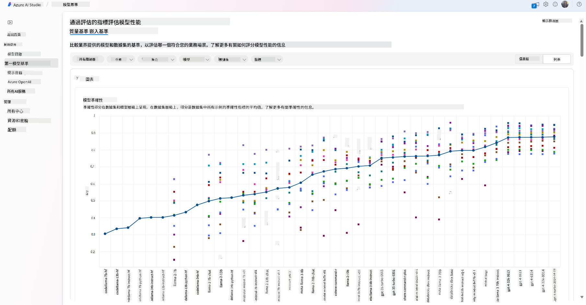
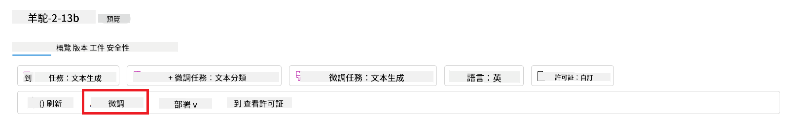
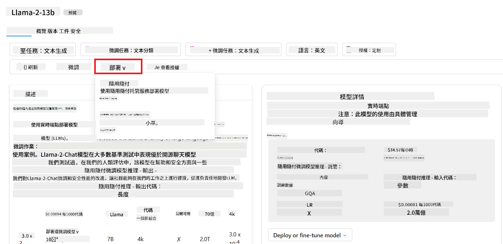
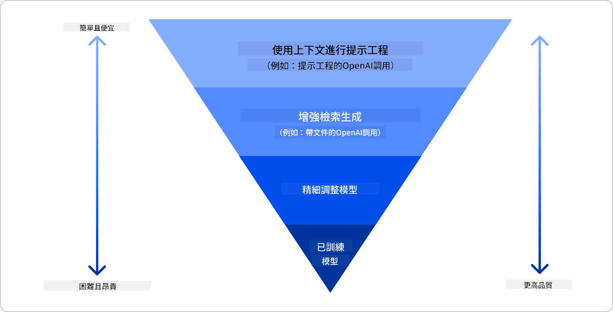

<!--
CO_OP_TRANSLATOR_METADATA:
{
  "original_hash": "e2f686f2eb794941761252ac5e8e090b",
  "translation_date": "2025-06-25T10:20:56+00:00",
  "source_file": "02-exploring-and-comparing-different-llms/README.md",
  "language_code": "mo"
}
-->
# 探索和比較不同的 LLM

> _點擊上方圖片觀看本課程的視頻_

在之前的課程中，我們已經了解了生成式人工智慧如何改變科技格局、大型語言模型 (LLMs) 的運作方式，以及像我們的創業公司如何將其應用於商業案例並成長！在本章中，我們將比較和對比不同類型的大型語言模型 (LLMs)，以了解它們的優缺點。

我們創業公司的下一步是探索當前 LLMs 的格局，並了解哪些適合我們的使用案例。

## 介紹

本課程將涵蓋：

- 當前格局中的不同類型的 LLMs。
- 在 Azure 中測試、迭代和比較不同模型以適應您的使用案例。
- 如何部署 LLM。

## 學習目標

完成本課程後，您將能夠：

- 選擇適合您使用案例的模型。
- 了解如何測試、迭代並改善模型的性能。
- 知道企業如何部署模型。

## 理解不同類型的 LLMs

LLMs 可以根據其架構、訓練數據和使用案例進行多種分類。理解這些差異將幫助我們的創業公司選擇適合情境的模型，並了解如何測試、迭代和改善性能。

有很多不同類型的 LLM 模型，您的選擇取決於您打算如何使用它們、您的數據、您願意支付的費用等。

根據您是否打算使用模型進行文本、音頻、視頻、圖像生成等，您可能會選擇不同類型的模型。

- **音頻和語音識別**。對於此目的，Whisper 類型模型是一個很好的選擇，因為它們是通用的，旨在進行語音識別。它訓練於多樣化的音頻，可以進行多語言語音識別。

- **圖像生成**。對於圖像生成，DALL-E 和 Midjourney 是兩個非常知名的選擇。DALL-E 由 Azure OpenAI 提供。

- **文本生成**。大多數模型都訓練於文本生成，您可以從 GPT-3.5 到 GPT-4 中選擇大量選擇。它們的成本不同，其中 GPT-4 是最昂貴的。

- **多模態**。如果您希望處理輸入和輸出中的多種類型數據，您可能想查看像 gpt-4 turbo with vision 或 gpt-4o 這樣的模型。

選擇模型意味著您獲得一些基本能力，但可能不夠。通常您有公司特定的數據需要告訴 LLM。關於如何處理這一點有幾種不同的選擇，更多內容在即將到來的部分中。

### 基礎模型與 LLMs

基礎模型一詞由 Stanford 研究人員提出並定義為符合某些標準的 AI 模型，例如：

- **它們使用無監督學習或自監督學習進行訓練**，意味著它們訓練於未標記的多模態數據，不需要人類註釋或標記數據進行訓練。
- **它們是非常大的模型**，基於訓練於數十億參數的非常深的神經網絡。
- **它們通常旨在作為其他模型的“基礎”**，意味著它們可以用作其他模型的起點，可以通過微調來實現。

為進一步澄清這一區別，讓我們以 ChatGPT 為例。要構建 ChatGPT 的第一個版本，使用了 GPT-3.5 作為基礎模型。

### 開源模型與專有模型

另一種分類 LLMs 的方式是它們是開源還是專有。

開源模型是向公眾開放的模型，任何人都可以使用。它們通常由創建它們的公司或研究社區提供。

專有模型是由公司擁有的模型，未向公眾開放。

### 嵌入、圖像生成與文本和代碼生成

LLMs 也可以根據它們生成的輸出進行分類。

嵌入是將文本轉換為數字形式的模型集合，稱為嵌入，是輸入文本的數字表示。

圖像生成模型是生成圖像的模型。

文本和代碼生成模型是生成文本或代碼的模型。

### 編碼器-解碼器與僅解碼器

為了談論 LLMs 的不同架構類型，我們來用一個類比。

想像你的經理給你一個為學生編寫測驗的任務。你有兩位同事，一位負責創建內容，另一位負責審核。

內容創建者就像僅解碼器模型，他們可以查看主題並查看你已經寫的內容，然後基於此編寫課程。

審核者就像僅編碼器模型，他們查看已編寫的課程和答案，注意它們之間的關係並理解上下文，但不擅長生成內容。

想像我們也可以有一個人可以創建和審核測驗，這是一個編碼器-解碼器模型。

### 服務與模型

現在，讓我們談談服務與模型之間的區別。服務是由雲服務提供商提供的產品，通常是模型、數據和其他組件的組合。

模型只是神經網絡，具有參數、權重等。

## 如何在 Azure 上測試和迭代不同模型以了解性能

一旦我們的團隊探索了當前的 LLMs 格局並識別出一些適合其場景的候選者，下一步就是在其數據和工作負載上進行測試。

[Azure AI Studio](https://learn.microsoft.com/azure/ai-studio/what-is-ai-studio?WT.mc_id=academic-105485-koreyst) 是一個為開發者設計的雲平台，旨在構建生成式 AI 應用並管理整個開發生命周期。

Azure AI Studio 中的模型目錄使用戶能夠：

- 在目錄中找到感興趣的基礎模型 - 無論是專有還是開源，通過任務、許可或名稱過濾。

- 查看模型卡，包括詳細的使用說明和訓練數據、代碼示例以及內部評估庫的評估結果。
- 比較業界中可用的模型和數據集的基準，以評估哪一個符合業務場景，通過[模型基準](https://learn.microsoft.com/azure/ai-studio/how-to/model-benchmarks?WT.mc_id=academic-105485-koreyst)面板。

- 在自定義訓練數據上微調模型，以提高模型在特定工作負載中的性能，利用 Azure AI Studio 的實驗和跟踪功能。

- 部署原始預訓練模型或微調版本到遠程實時推斷 - 管理計算 - 或無伺服器 API 端點 - [按需付費](https://learn.microsoft.com/azure/ai-studio/how-to/model-catalog-overview#model-deployment-managed-compute-and-serverless-api-pay-as-you-go?WT.mc_id=academic-105485-koreyst) - 以使應用程序能夠使用它。

> [!NOTE]
> 目錄中的所有模型目前並非都可用於微調和/或按需付費部署。查看模型卡以了解模型的能力和限制。

## 改進 LLM 結果

我們與初創團隊探索了不同種類的 LLM 和一個雲平台（Azure Machine Learning），使我們能夠比較不同的模型，在測試數據上評估它們，改善性能並在推斷端點上部署它們。

但何時應考慮微調模型而不是使用預訓練模型？是否有其他方法可以提高模型在特定工作負載上的性能？

企業可以使用多種方法從 LLM 中獲得所需結果。您可以在生產中部署 LLM 時選擇不同類型的模型，具有不同程度的訓練，並具有不同的複雜性、成本和質量。以下是一些不同的方法：

- **使用上下文的提示工程**。想法是提供足夠的上下文，當您提示時確保獲得所需的回應。

- **檢索增強生成，RAG**。例如，您的數據可能存在於數據庫或網絡端點中，以確保這些數據或其子集在提示時包含，您可以提取相關數據並將其作為用戶提示的一部分。

- **微調模型**。在這裡，您進一步在自己的數據上訓練模型，使模型更加精確和響應您的需求，但可能成本較高。

圖片來源：[企業部署 LLM 的四種方式 | Fiddler AI Blog](https://www.fiddler.ai/blog/four-ways-that-enterprises-deploy-llms?WT.mc_id=academic-105485-koreyst)

### 使用上下文的提示工程

預訓練的 LLM 在通用自然語言任務上表現非常好，即使只用一個簡短的提示，例如完成一個句子或回答一個問題——所謂的“零次學習”。

然而，使用者越能框定他們的查詢，提供詳細的請求和示例——上下文——答案將越準確且越接近使用者的期望。在這種情況下，如果提示只包含一個示例，我們稱之為“一次學習”，如果包含多個示例，則稱之為“少次學習”。使用上下文的提示工程是最具成本效益的啟動方法。

### 檢索增強生成 (RAG)

LLM 有一個限制，即它們只能使用在訓練期間使用的數據來生成答案。這意味著它們對訓練過程之後發生的事實一無所知，並且無法訪問非公開信息（例如公司數據）。
這可以通過 RAG 克服，這是一種增強提示的技術，使用外部數據以文檔片段的形式，考慮提示長度限制。這得到了向量數據庫工具（如 [Azure Vector Search](https://learn.microsoft.com/azure/search/vector-search-overview?WT.mc_id=academic-105485-koreyst)）的支持，這些工具從各種預定義數據源中檢索有用的片段並將它們添加到提示上下文中。

當企業沒有足夠的數據、足夠的時間或資源來微調 LLM，但仍希望提高特定工作負載的性能並減少虛構風險（即，現實的神秘化或有害內容）時，這種技術非常有幫助。

### 微調模型

微調是一個利用遷移學習的過程，用於“適應”模型到下游任務或解決特定問題。與少次學習和 RAG 不同，它產生了一個新的模型，具有更新的權重和偏差。它需要一組由單一輸入（提示）及其相關輸出（完成）組成的訓練示例。
如果：

- **使用微調模型**。企業希望使用微調的能力較低的模型（如嵌入模型）而不是高性能模型，從而得到更具成本效益和快速的解決方案。

- **考慮延遲**。延遲對於特定用例很重要，因此不能使用非常長的提示，或者模型應學習的示例數量不符合提示長度限制。

- **保持最新**。企業擁有大量高質量數據和真實標籤，以及隨時間推移保持這些數據更新所需的資源。

### 訓練模型

從零開始訓練 LLM 毫無疑問是最困難和最複雜的方法，需要大量的數據、熟練的資源和適當的計算能力。只有在企業擁有特定領域的用例和大量領域集中的數據的情況下，才應考慮此選擇。

## 知識檢查

改善 LLM 完成結果的好方法是什麼？

1. 使用上下文的提示工程
1. RAG
1. 微調模型

A:3，如果您有時間和資源以及高質量數據，微調是保持最新的更好選擇。然而，如果您希望改善事情而缺乏時間，值得首先考慮 RAG。

## 🚀 挑戰

閱讀更多有關如何[使用 RAG](https://learn.microsoft.com/azure/search/retrieval-augmented-generation-overview?WT.mc_id=academic-105485-koreyst)來支持您的業務。

## 出色的工作，繼續您的學習

完成本課程後，查看我們的[生成式 AI 學習集合](https://aka.ms/genai-collection?WT.mc_id=academic-105485-koreyst)，以繼續提升您的生成式 AI 知識！

前往第 3 課，我們將研究如何[負責任地構建生成式 AI](../03-using-generative-ai-responsibly/README.md?WT.mc_id=academic-105485-koreyst)！

**免責聲明**：  
本文檔是使用AI翻譯服務[Co-op Translator](https://github.com/Azure/co-op-translator)進行翻譯的。儘管我們努力確保準確性，但請注意，自動翻譯可能包含錯誤或不準確之處。應將原始語言的文件視為權威來源。對於關鍵信息，建議使用專業的人力翻譯。我們對因使用此翻譯而引起的任何誤解或誤釋不承擔責任。