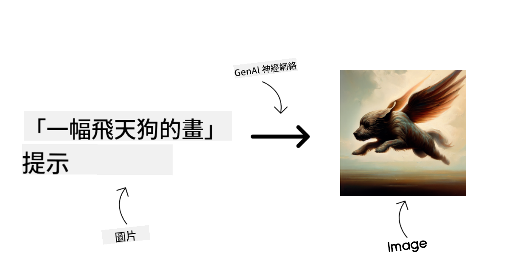
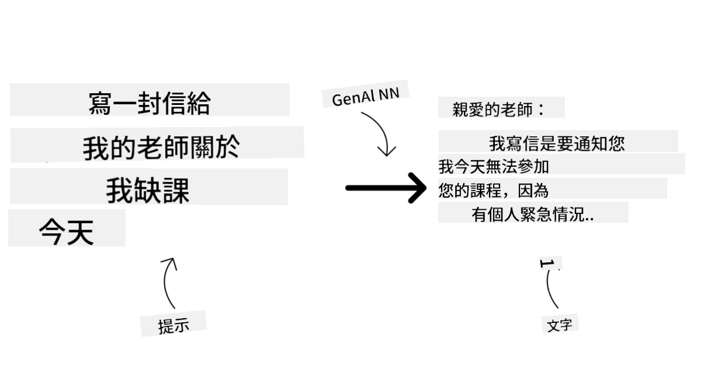
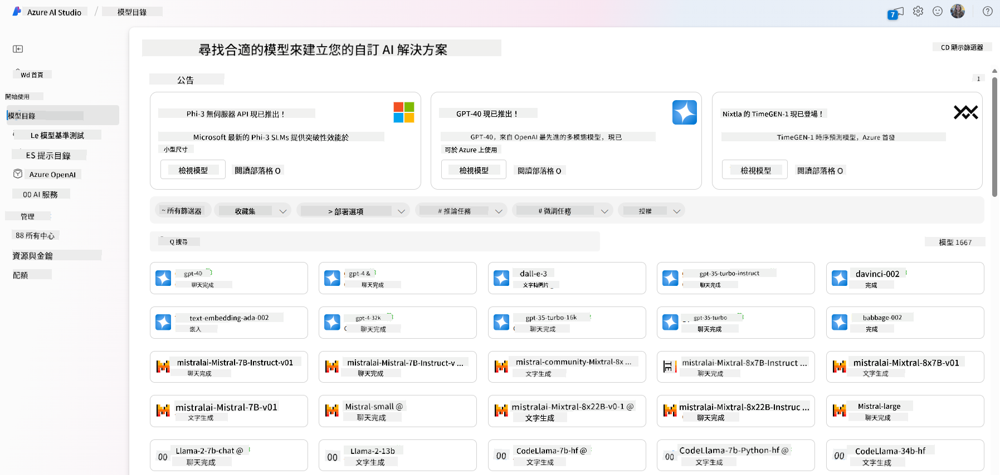
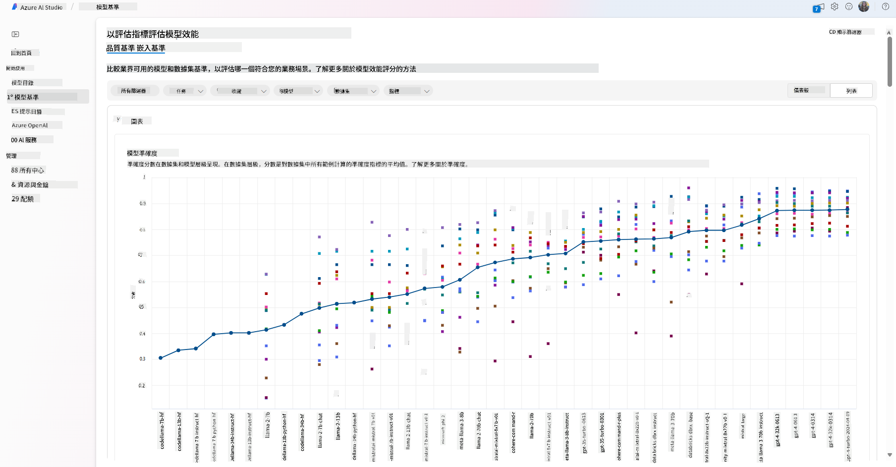
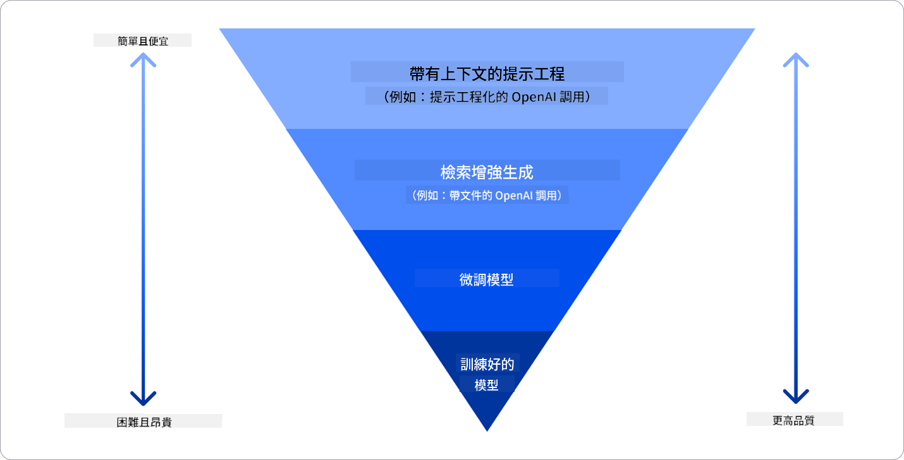

<!--
CO_OP_TRANSLATOR_METADATA:
{
  "original_hash": "6b7629b8ee4d7d874a27213e903d86a7",
  "translation_date": "2025-10-17T15:15:07+00:00",
  "source_file": "02-exploring-and-comparing-different-llms/README.md",
  "language_code": "mo"
}
-->
# 探索與比較不同的大型語言模型 (LLM)

> _點擊上方圖片觀看本課程影片_

在上一課中，我們了解了生成式人工智慧如何改變科技格局、大型語言模型 (LLM) 的運作方式，以及企業（例如我們的初創公司）如何將其應用於業務案例並實現成長！在本章中，我們將比較和對比不同類型的大型語言模型 (LLM)，以了解它們的優缺點。

我們初創公司的下一步是探索目前的 LLM 版圖，並了解哪些模型適合我們的業務需求。

## 簡介

本課程將涵蓋：

- 當前 LLM 的不同類型。
- 在 Azure 上測試、迭代和比較不同模型以符合您的業務需求。
- 如何部署 LLM。

## 學習目標

完成本課程後，您將能夠：

- 選擇適合您業務需求的模型。
- 了解如何測試、迭代並提升模型的性能。
- 知道企業如何部署模型。

## 了解不同類型的 LLM

LLM 可根據其架構、訓練數據和用途進行多種分類。了解這些差異將幫助我們的初創公司選擇適合的模型，並了解如何測試、迭代和提升性能。

LLM 有許多不同的類型，選擇模型取決於您的用途、數據、預算等因素。

根據您是否希望使用模型進行文本、音頻、視頻、圖像生成等，您可能會選擇不同類型的模型。

- **音頻和語音識別**。針對此用途，Whisper 類型的模型是一個很好的選擇，因為它們是通用型並專注於語音識別。它訓練於多樣化的音頻數據，能夠進行多語言語音識別。了解更多 [Whisper 類型模型](https://platform.openai.com/docs/models/whisper?WT.mc_id=academic-105485-koreyst)。

- **圖像生成**。在圖像生成方面，DALL-E 和 Midjourney 是兩個非常知名的選擇。DALL-E 由 Azure OpenAI 提供。[閱讀更多關於 DALL-E 的資訊](https://platform.openai.com/docs/models/dall-e?WT.mc_id=academic-105485-koreyst)，以及本課程第 9 章。

- **文本生成**。大多數模型都訓練於文本生成，您可以選擇從 GPT-3.5 到 GPT-4 的多種選擇。它們的成本各不相同，其中 GPT-4 是最昂貴的。值得探索 [Azure OpenAI playground](https://oai.azure.com/portal/playground?WT.mc_id=academic-105485-koreyst)，以評估哪些模型在能力和成本方面最符合您的需求。

- **多模態**。如果您希望處理多種類型的輸入和輸出數據，您可能需要研究像 [gpt-4 turbo with vision 或 gpt-4o](https://learn.microsoft.com/azure/ai-services/openai/concepts/models#gpt-4-and-gpt-4-turbo-models?WT.mc_id=academic-105485-koreyst) 這樣的模型——OpenAI 最新版本的模型——它們能夠結合自然語言處理與視覺理解，實現多模態界面的互動。

選擇模型意味著您獲得了一些基本功能，但這可能還不夠。通常您有公司特定的數據需要告訴 LLM。對此有幾種不同的方式，更多內容將在接下來的部分中介紹。

### 基礎模型與 LLM 的區別

基礎模型的術語由 [斯坦福研究人員提出](https://arxiv.org/abs/2108.07258?WT.mc_id=academic-105485-koreyst)，並定義為符合某些標準的人工智慧模型，例如：

- **使用無監督學習或自監督學習進行訓練**，意味著它們訓練於未標記的多模態數據，且不需要人工註解或標記數據。
- **它們是非常大的模型**，基於非常深的神經網絡，訓練於數十億個參數。
- **通常旨在作為其他模型的“基礎”**，意味著它們可以作為其他模型的起點，通過微調進一步構建。

圖片來源：[基礎模型與大型語言模型的基本指南 | 作者 Babar M Bhatti | Medium](https://thebabar.medium.com/essential-guide-to-foundation-models-and-large-language-models-27dab58f7404)

為了進一步澄清這一區別，讓我們以 ChatGPT 為例。要構建 ChatGPT 的第一版，使用了一個名為 GPT-3.5 的模型作為基礎模型。這意味著 OpenAI 使用了一些特定於聊天的數據，創建了一個專門針對對話場景（如聊天機器人）表現良好的 GPT-3.5 微調版本。

圖片來源：[2108.07258.pdf (arxiv.org)](https://arxiv.org/pdf/2108.07258.pdf?WT.mc_id=academic-105485-koreyst)

### 開源模型與專有模型

另一種分類 LLM 的方式是看它們是開源還是專有。

開源模型是公開提供給所有人的模型，任何人都可以使用。它們通常由創建它們的公司或研究社群提供。這些模型可以被檢查、修改和定制以適應 LLM 的各種用途。然而，它們並不總是針對生產使用進行優化，性能可能不如專有模型。此外，開源模型的資金可能有限，可能無法長期維護或更新最新研究。流行的開源模型包括 [Alpaca](https://crfm.stanford.edu/2023/03/13/alpaca.html?WT.mc_id=academic-105485-koreyst)、[Bloom](https://huggingface.co/bigscience/bloom) 和 [LLaMA](https://llama.meta.com)。

專有模型是由公司擁有且未公開提供的模型。這些模型通常針對生產使用進行優化。然而，它們不能被檢查、修改或定制以適應不同用途。此外，它們並不總是免費提供，可能需要訂閱或付費使用。此外，使用者無法控制用於訓練模型的數據，這意味著他們需要信任模型擁有者，確保對數據隱私和負責任使用人工智慧的承諾。流行的專有模型包括 [OpenAI 模型](https://platform.openai.com/docs/models/overview?WT.mc_id=academic-105485-koreyst)、[Google Bard](https://sapling.ai/llm/bard?WT.mc_id=academic-105485-koreyst) 或 [Claude 2](https://www.anthropic.com/index/claude-2?WT.mc_id=academic-105485-koreyst)。

### 嵌入式生成 vs 圖像生成 vs 文本與程式碼生成

LLM 也可以根據其生成的輸出進行分類。

嵌入式模型是一組可以將文本轉換為數值形式（稱為嵌入）的模型，這是一種輸入文本的數值表示。嵌入使機器更容易理解單詞或句子之間的關係，並且可以作為其他模型的輸入，例如分類模型或在數值數據上性能更好的聚類模型。嵌入模型通常用於遷移學習，模型為一個有大量數據的替代任務構建，然後模型權重（嵌入）被重新用於其他下游任務。此類模型的例子包括 [OpenAI 嵌入](https://platform.openai.com/docs/models/embeddings?WT.mc_id=academic-105485-koreyst)。

圖像生成模型是生成圖像的模型。這些模型通常用於圖像編輯、圖像合成和圖像翻譯。圖像生成模型通常訓練於大型圖像數據集，例如 [LAION-5B](https://laion.ai/blog/laion-5b/?WT.mc_id=academic-105485-koreyst)，可以用於生成新圖像或使用修補、超解析度和著色技術編輯現有圖像。例子包括 [DALL-E-3](https://openai.com/dall-e-3?WT.mc_id=academic-105485-koreyst) 和 [Stable Diffusion 模型](https://github.com/Stability-AI/StableDiffusion?WT.mc_id=academic-105485-koreyst)。

文本與程式碼生成模型是生成文本或程式碼的模型。這些模型通常用於文本摘要、翻譯和問答。文本生成模型通常訓練於大型文本數據集，例如 [BookCorpus](https://www.cv-foundation.org/openaccess/content_iccv_2015/html/Zhu_Aligning_Books_and_ICCV_2015_paper.html?WT.mc_id=academic-105485-koreyst)，可以用於生成新文本或回答問題。程式碼生成模型，如 [CodeParrot](https://huggingface.co/codeparrot?WT.mc_id=academic-105485-koreyst)，通常訓練於大型程式碼數據集，例如 GitHub，可以用於生成新程式碼或修復現有程式碼中的錯誤。

### 編碼器-解碼器 vs 僅解碼器

要討論 LLM 的不同架構類型，我們可以用一個比喻來說明。

假設您的經理給您一個任務，要求您為學生編寫一份測驗。您有兩位同事，一位負責創建內容，另一位負責審核。

內容創建者就像僅解碼器模型，他可以查看主題並根據您已經寫的內容編寫課程。他們非常擅長撰寫引人入勝且信息豐富的內容，但不太擅長理解主題和學習目標。僅解碼器模型的例子包括 GPT 系列模型，例如 GPT-3。

審核者就像僅編碼器模型，他查看已編寫的課程和答案，注意它們之間的關係並理解上下文，但不擅長生成內容。僅編碼器模型的例子包括 BERT。

想像一下，我們也可以有一個既能創建又能審核測驗的人，這就是編碼器-解碼器模型。例子包括 BART 和 T5。

### 服務 vs 模型

現在，我們來談談服務與模型的區別。服務是由雲服務提供商提供的產品，通常是模型、數據和其他組件的組合。模型是服務的核心組件，通常是基礎模型，例如 LLM。

服務通常針對生產使用進行優化，並且通常比模型更容易使用，通過圖形用戶界面。然而，服務並不總是免費提供，可能需要訂閱或付費使用，以利用服務擁有者的設備和資源，優化成本並輕鬆擴展。服務的例子包括 [Azure OpenAI Service](https://learn.microsoft.com/azure/ai-services/openai/overview?WT.mc_id=academic-105485-koreyst)，它提供按使用量付費的計費方式，意味著使用者根據使用服務的多少按比例收費。此外，Azure OpenAI Service 在模型功能之上提供企業級安全性和負責任的人工智慧框架。

模型僅僅是神經網絡，包括參數、權重等。允許公司在本地運行，但需要購買設備、構建可擴展的結構並購買許可證或使用開源模型。像 LLaMA 這樣的模型可以使用，但需要計算能力來運行模型。

## 如何在 Azure 上測試和迭代不同模型以了解性能

當我們的團隊探索了當前 LLM 的版圖並確定了一些適合其場景的候選模型後，下一步就是在其數據和工作負載上測試它們。這是一個通過實驗和測量進行的迭代過程。
我們在前面段落中提到的大多數模型（例如 OpenAI 模型、開源模型如 Llama2，以及 Hugging Face transformers）都可以在 [Azure AI Studio](https://ai.azure.com/?WT.mc_id=academic-105485-koreyst) 的 [模型目錄](https://learn.microsoft.com/azure/ai-studio/how-to/model-catalog-overview?WT.mc_id=academic-105485-koreyst) 中找到。

[Azure AI Studio](https://learn.microsoft.com/azure/ai-studio/what-is-ai-studio?WT.mc_id=academic-105485-koreyst) 是一個雲端平台，專為開發者設計，用於構建生成式 AI 應用並管理整個開發生命周期——從實驗到評估——將所有 Azure AI 服務整合到一個便捷的圖形化界面中。Azure AI Studio 的模型目錄使使用者能夠：

- 在目錄中找到感興趣的基礎模型——無論是專有模型還是開源模型，並根據任務、許可證或名稱進行篩選。為了提高搜索效率，這些模型被組織成不同的集合，例如 Azure OpenAI 集合、Hugging Face 集合等。

- 查看模型卡，包括詳細的用途描述和訓練數據、代碼範例以及內部評估庫中的評估結果。

- 通過 [模型基準](https://learn.microsoft.com/azure/ai-studio/how-to/model-benchmarks?WT.mc_id=academic-105485-koreyst) 面板比較行業內可用的模型和數據集基準，以評估哪個模型最符合業務場景。

- 利用 Azure AI Studio 的實驗和追蹤功能，使用自定義訓練數據微調模型，以提高模型在特定工作負載中的性能。

- 部署原始的預訓練模型或微調版本到遠程實時推理——管理計算資源——或無伺服器 API 端點——[按需付費](https://learn.microsoft.com/azure/ai-studio/how-to/model-catalog-overview#model-deployment-managed-compute-and-serverless-api-pay-as-you-go?WT.mc_id=academic-105485-koreyst)——以便應用程序能夠使用它。

> [!NOTE]
> 目錄中的所有模型目前並不都支持微調和/或按需付費部署。請查看模型卡以了解模型的功能和限制。

## 提升 LLM 結果

我們的初創團隊探索了不同類型的 LLM 和一個雲端平台（Azure Machine Learning），使我們能夠比較不同模型、在測試數據上進行評估、提升性能並將其部署到推理端點。

那麼，什麼時候應該考慮微調模型而不是使用預訓練模型？是否有其他方法可以提升模型在特定工作負載上的性能？

企業可以採用多種方法來從 LLM 中獲得所需的結果。在生產環境中部署 LLM 時，可以選擇不同程度訓練的模型，這些模型具有不同的複雜性、成本和質量。以下是一些不同的方法：

- **帶上下文的提示工程**。這個方法的核心是提供足夠的上下文，以確保獲得所需的回應。

- **檢索增強生成（RAG）**。例如，您的數據可能存在於數據庫或網絡端點中，為了確保這些數據或其子集在提示時被包含，可以提取相關數據並將其作為使用者提示的一部分。

- **微調模型**。這種方法是基於您的數據進一步訓練模型，使模型更精確並更符合您的需求，但可能成本較高。

圖片來源：[企業部署 LLM 的四種方式 | Fiddler AI Blog](https://www.fiddler.ai/blog/four-ways-that-enterprises-deploy-llms?WT.mc_id=academic-105485-koreyst)

### 帶上下文的提示工程

預訓練的 LLM 在通用自然語言任務上表現非常出色，即使只用簡短的提示（例如完成句子或回答問題）——這被稱為“零樣本”學習。

然而，使用者越能框定自己的查詢，提供詳細的請求和示例——即上下文——回應就越準確且越符合使用者的期望。在這種情況下，如果提示中僅包含一個示例，我們稱之為“一樣本”學習；如果包含多個示例，則稱為“少樣本”學習。
帶上下文的提示工程是啟動的最具成本效益的方法。

### 檢索增強生成（RAG）

LLM 的局限性在於它只能使用訓練過程中使用的數據來生成答案。這意味著它對訓練過程後發生的事實一無所知，也無法訪問非公開信息（例如公司數據）。
這可以通過 RAG 技術來克服，該技術通過文檔片段的形式增強提示，考慮到提示長度的限制。這得益於向量數據庫工具（例如 [Azure Vector Search](https://learn.microsoft.com/azure/search/vector-search-overview?WT.mc_id=academic-105485-koreyst)），它能從預定義的數據源中檢索有用的片段並將其添加到提示上下文中。

當企業沒有足夠的數據、時間或資源來微調 LLM，但仍希望提升特定工作負載的性能並降低虛構風險（即對現實的扭曲或有害內容）時，這種技術非常有幫助。

### 微調模型

微調是一個利用遷移學習的過程，用於“適應”模型以完成下游任務或解決特定問題。與少樣本學習和 RAG 不同，它會生成一個新模型，並更新權重和偏差。它需要一組訓練示例，包括單一輸入（提示）及其相關輸出（完成）。
以下情況下，微調是首選方法：

- **使用微調模型**。企業希望使用微調的能力較低的模型（例如嵌入模型）而不是高性能模型，從而實現更具成本效益且快速的解決方案。

- **考慮延遲**。延遲對特定用例非常重要，因此無法使用非常長的提示或示例數量超出提示長度限制。

- **保持更新**。企業擁有大量高質量數據和真實標籤，以及維護這些數據隨時間更新的資源。

### 訓練模型

從零開始訓練 LLM 無疑是最困難且最複雜的方法，需要大量數據、專業資源和適當的計算能力。只有在企業擁有領域特定的用例和大量領域中心數據的情況下，才應考慮此選項。

## 知識檢查

什麼是提升 LLM 完成結果的好方法？

1. 帶上下文的提示工程
1. RAG
1. 微調模型

A:3，如果您有時間、資源和高質量數據，微調是保持更新的更好選擇。然而，如果您希望提升性能但缺乏時間，值得首先考慮 RAG。

## 🚀 挑戰

深入了解如何為您的業務 [使用 RAG](https://learn.microsoft.com/azure/search/retrieval-augmented-generation-overview?WT.mc_id=academic-105485-koreyst)。

## 出色的工作，繼續學習

完成本課程後，請查看我們的 [生成式 AI 學習集合](https://aka.ms/genai-collection?WT.mc_id=academic-105485-koreyst)，繼續提升您的生成式 AI 知識！

前往第 3 課，我們將探討如何 [負責任地使用生成式 AI](../03-using-generative-ai-responsibly/README.md?WT.mc_id=academic-105485-koreyst)！

---

**免責聲明**：  
本文件已使用 AI 翻譯服務 [Co-op Translator](https://github.com/Azure/co-op-translator) 進行翻譯。儘管我們努力確保翻譯的準確性，但請注意，自動翻譯可能包含錯誤或不準確之處。原始文件的母語版本應被視為權威來源。對於關鍵信息，建議使用專業人工翻譯。我們對因使用此翻譯而引起的任何誤解或誤釋不承擔責任。