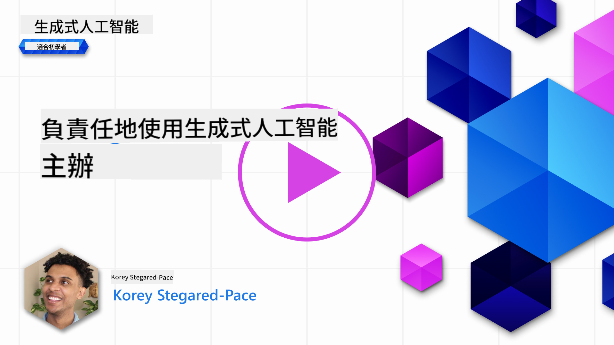
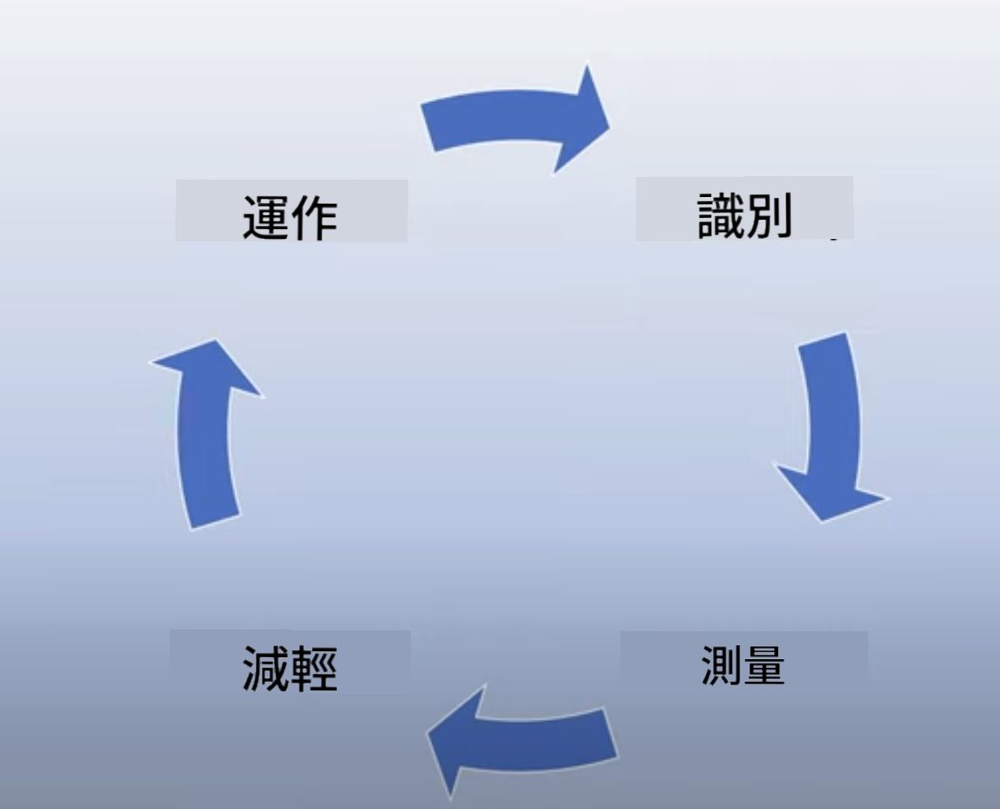
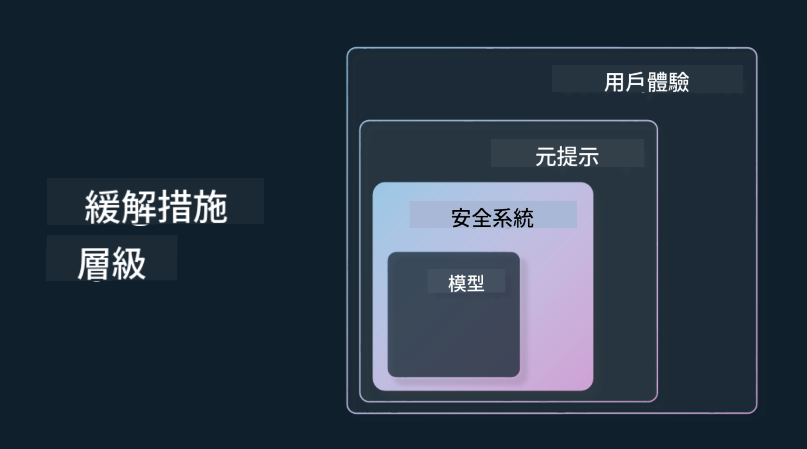

<!--
CO_OP_TRANSLATOR_METADATA:
{
  "original_hash": "13084c6321a2092841b9a081b29497ba",
  "translation_date": "2025-06-25T11:14:09+00:00",
  "source_file": "03-using-generative-ai-responsibly/README.md",
  "language_code": "mo"
}
-->
# 負責任地使用生成式 AI

> _點擊上方圖片觀看本課程影片_

AI，尤其是生成式 AI，確實讓人著迷，但你需要考慮如何負責任地使用它。你需要考慮如何確保輸出公平、無害等。本章旨在提供上述背景，告訴你需要考慮什麼，以及如何採取積極步驟來改善你的 AI 使用。

## 介紹

本課程將涵蓋：

- 為什麼在構建生成式 AI 應用程式時應優先考慮負責任的 AI。
- 負責任的 AI 的核心原則以及它們如何與生成式 AI 相關。
- 如何通過策略和工具將這些負責任的 AI 原則付諸實踐。

## 學習目標

完成本課程後，你將了解：

- 在構建生成式 AI 應用程式時，負責任的 AI 的重要性。
- 何時在構建生成式 AI 應用程式時思考並應用負責任的 AI 的核心原則。
- 可以使用哪些工具和策略來實踐負責任的 AI 概念。

## 負責任的 AI 原則

生成式 AI 的興奮度前所未有地高。這種興奮吸引了許多新開發者、關注和資金到這個領域。雖然這對於任何希望使用生成式 AI 構建產品和公司的個人來說非常積極，但我們也必須負責任地前進。

在整個課程中，我們專注於構建我們的初創公司和 AI 教育產品。我們將使用負責任的 AI 原則：公平性、包容性、可靠性/安全性、安全性與隱私、透明性和問責性。通過這些原則，我們將探索它們如何與我們在產品中使用生成式 AI 相關。

## 為什麼應優先考慮負責任的 AI

在構建產品時，採取以人為中心的方法，考慮用戶的最佳利益，會帶來最佳結果。

生成式 AI 的獨特之處在於它能為用戶創造有用的答案、信息、指導和內容。這可以在不需要許多手動步驟的情況下完成，可能帶來非常驚人的結果。若沒有適當的規劃和策略，也可能不幸地對你的用戶、產品和整個社會造成一些有害結果。

讓我們來看看一些（但不是全部）潛在的有害結果：

### 幻覺

幻覺是指當 LLM 生成的內容完全無意義或根據其他信息來源我們知道是事實錯誤的情況。

例如，我們為初創公司構建了一個功能，允許學生向模型提問歷史問題。一名學生提出問題 `Who was the sole survivor of Titanic?`

模型生成了如下回應：

> _(來源：[Flying bisons](https://flyingbisons.com?WT.mc_id=academic-105485-koreyst))_

這是一個非常自信和詳細的回答。不幸的是，這是不正確的。即使進行最少量的研究，人們也會發現泰坦尼克號災難有不止一位倖存者。對於剛開始研究這個主題的學生來說，這個回答可能具有足夠的說服力而不被質疑，並被當作事實對待。這樣的結果可能導致 AI 系統不可靠，並對我們初創公司的聲譽造成負面影響。

隨著任何給定 LLM 的每次迭代，我們看到在減少幻覺方面的性能改善。即使有這種改善，作為應用程序構建者和用戶，我們仍需要意識到這些限制。

### 有害內容

我們在前面部分討論了當 LLM 生成不正確或無意義的回應時。另一個需要注意的風險是當模型回應有害內容。

有害內容可以定義為：

- 提供指導或鼓勵自我傷害或對某些群體造成傷害。
- 仇恨或貶低的內容。
- 指導計劃任何類型的攻擊或暴力行為。
- 提供如何找到非法內容或進行非法行為的指導。
- 顯示色情內容。

對於我們的初創公司，我們希望確保我們擁有適當的工具和策略，以防止這類內容被學生看到。

### 缺乏公平性

公平性被定義為“確保 AI 系統不受偏見和歧視，並公平地對待每個人”。在生成式 AI 的世界中，我們希望確保模型的輸出不加強對邊緣化群體的排斥性世界觀。

這類輸出不僅對於為用戶構建積極的產品體驗具有破壞性，還會對社會造成進一步的傷害。作為應用程序構建者，我們應始終在構建生成式 AI 解決方案時考慮廣泛且多樣的用戶群。

## 如何負責任地使用生成式 AI

現在我們已經確定了負責任生成式 AI 的重要性，讓我們來看看可以採取的四個步驟，以負責任地構建我們的 AI 解決方案：

### 衡量潛在危害

在軟件測試中，我們測試用戶在應用程序上的預期操作。同樣地，測試用戶最有可能使用的多樣化提示集是一種衡量潛在危害的好方法。

由於我們的初創公司正在構建教育產品，準備一份與教育相關的提示列表會很好。這可以涵蓋某個科目、歷史事實以及有關學生生活的提示。

### 減輕潛在危害

現在是時候找到方法來防止或限制模型及其回應所造成的潛在危害。我們可以從四個不同的層面來看：

- **模型**。選擇適合用例的模型。像 GPT-4 這樣更大更複雜的模型在應用於更小更特定的用例時可能會造成更多有害內容的風險。使用你的訓練數據進行微調也能減少有害內容的風險。

- **安全系統**。安全系統是一組工具和配置，用於服務模型的平台上，以幫助減輕危害。這方面的一個例子是 Azure OpenAI 服務上的內容過濾系統。系統還應檢測越獄攻擊和不必要的活動，例如來自機器人的請求。

- **元提示**。元提示和基礎是我們可以根據某些行為和信息指導或限制模型的方法。這可以使用系統輸入來定義模型的某些限制。此外，提供更相關於系統範圍或領域的輸出。

也可以使用像檢索增強生成（RAG）這樣的技術，使模型僅從選定的可信來源中提取信息。這門課程後面有一課是關於[構建搜索應用程序](../08-building-search-applications/README.md?WT.mc_id=academic-105485-koreyst)

- **用戶體驗**。最後一層是用戶直接通過我們應用程序的界面以某種方式與模型互動。在這種方式下，我們可以設計 UI/UX 來限制用戶可以發送給模型的輸入類型以及顯示給用戶的文本或圖像。在部署 AI 應用程序時，我們還必須透明地告訴用戶我們的生成式 AI 應用程序能做什麼和不能做什麼。

我們有一整課專門講解[設計 AI 應用程序的 UX](../12-designing-ux-for-ai-applications/README.md?WT.mc_id=academic-105485-koreyst)

- **評估模型**。與 LLM 一起工作可能具有挑戰性，因為我們並不總是能夠控制模型所訓練的數據。無論如何，我們應始終評估模型的性能和輸出。衡量模型的準確性、相似性、基礎性和輸出的相關性仍然很重要。這有助於向利益相關者和用戶提供透明度和信任。

### 運營負責任的生成式 AI 解決方案

圍繞你的 AI 應用程序建立運營實踐是最後階段。這包括與初創公司的其他部分如法律和安全合作，以確保我們符合所有監管政策。在推出之前，我們還希望制定交付、處理事件和回滾計劃，以防止對用戶造成任何傷害。

## 工具

雖然開發負責任的 AI 解決方案的工作似乎很多，但這是非常值得努力的工作。隨著生成式 AI 領域的增長，更多的工具將成熟，幫助開發者有效地將責任整合到他們的工作流程中。例如，[Azure AI 內容安全](https://learn.microsoft.com/azure/ai-services/content-safety/overview?WT.mc_id=academic-105485-koreyst)可以通過 API 請求幫助檢測有害內容和圖像。

## 知識檢查

要確保負責任的 AI 使用，你需要關心哪些事情？

1. 答案是否正確。
1. 有害使用，確保 AI 不被用於犯罪目的。
1. 確保 AI 沒有偏見和歧視。

A: 2 和 3 是正確的。負責任的 AI 幫助你考慮如何減輕有害影響和偏見等。

## 🚀 挑戰

閱讀 [Azure AI 內容安全](https://learn.microsoft.com/azure/ai-services/content-safety/overview?WT.mc_id=academic-105485-koreyst)並看看你可以採用哪些用於你的使用。

## 出色的工作，繼續學習

完成本課程後，請查看我們的[生成式 AI 學習集合](https://aka.ms/genai-collection?WT.mc_id=academic-105485-koreyst)，以繼續提升你的生成式 AI 知識！

前往第 4 課，我們將探討[提示工程基礎](../04-prompt-engineering-fundamentals/README.md?WT.mc_id=academic-105485-koreyst)！

**免責聲明**：
本文件已使用 AI 翻譯服務 [Co-op Translator](https://github.com/Azure/co-op-translator) 進行翻譯。儘管我們努力追求準確性，但請注意，自動翻譯可能包含錯誤或不準確之處。應將原始文件的母語版本視為權威來源。對於關鍵信息，建議使用專業人工翻譯。我們不對因使用此翻譯而引起的任何誤解或誤釋負責。