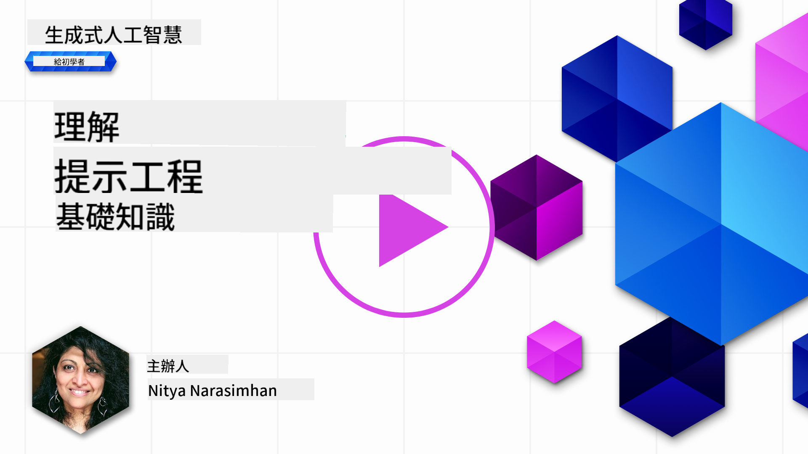
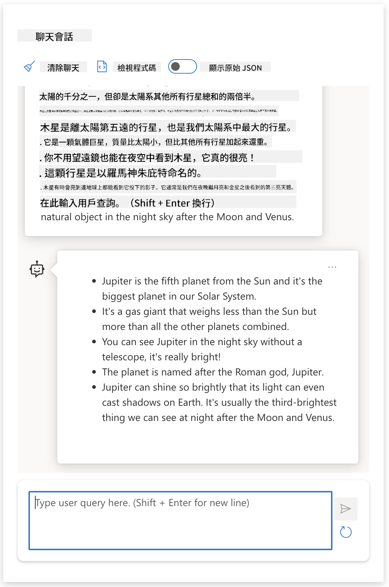
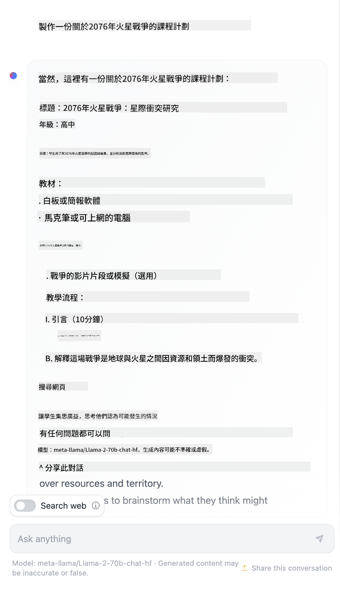

<!--
CO_OP_TRANSLATOR_METADATA:
{
  "original_hash": "dcbaaae026cb50fee071e690685b5843",
  "translation_date": "2025-08-26T14:42:43+00:00",
  "source_file": "04-prompt-engineering-fundamentals/README.md",
  "language_code": "mo"
}
-->
# 提示工程基礎

[](https://aka.ms/gen-ai-lesson4-gh?WT.mc_id=academic-105485-koreyst)

## 前言
本單元會介紹在生成式 AI 模型中，撰寫有效提示的基本概念與技巧。你如何向 LLM 提問也很重要。精心設計的提示能讓回覆品質更好。但到底什麼是 _提示_ 和 _提示工程_？又要怎麼優化送給 LLM 的提示 _輸入_？這些問題，我們會在本章和下一章一起探討。

_生成式 AI_ 能根據使用者需求創造新內容（例如文字、圖片、音訊、程式碼等）。它是透過像 OpenAI 的 GPT（"Generative Pre-trained Transformer"）系列這種大型語言模型訓練而成，能理解自然語言和程式碼。

現在，使用者可以用聊天這種熟悉的方式與模型互動，不需要技術背景或專業訓練。這些模型是 _以提示為基礎_ 的——使用者輸入文字（提示），AI 回覆（完成）。然後可以反覆「和 AI 聊天」，多輪對話，不斷調整提示，直到回覆符合預期。

「提示」已經成為生成式 AI 應用的主要 _程式介面_，告訴模型要做什麼，也影響回覆品質。「提示工程」是一個快速成長的領域，專注於 _設計與優化_ 提示，讓回覆能穩定且高品質地大量產生。

## 學習目標

這堂課會讓你了解什麼是提示工程、為什麼重要，以及如何針對特定模型和應用目標設計更有效的提示。我們會認識提示工程的核心概念和最佳實踐，並介紹一個互動式 Jupyter Notebooks「沙盒」環境，讓你看到這些概念如何應用在真實案例。

學完本課程，你將能：

1. 說明什麼是提示工程，以及它的重要性。
2. 描述提示的組成部分及其用途。
3. 學習提示工程的最佳做法和技巧。
4. 把學到的技巧應用在真實案例，並用 OpenAI 端點實作。

## 關鍵詞彙

Prompt Engineering：設計和優化輸入，指引 AI 模型產生理想輸出的實務。
Tokenization：把文字轉換成模型能理解和處理的小單位（token）的過程。
Instruction-Tuned LLMs：經過特定指令微調的大型語言模型（LLM），能提升回覆的準確性和相關性。

## 學習沙盒

目前提示工程比較像是一門藝術而非科學。最好的方式就是 _多練習_，用嘗試錯誤的方法，結合領域專業、推薦技巧和針對模型的優化。

這堂課附的 Jupyter Notebook 提供一個 _沙盒_ 環境，讓你邊學邊試，或在最後的程式挑戰時練習。執行練習時，你需要：

1. **Azure OpenAI API 金鑰**——已部署 LLM 的服務端點。
2. **Python 執行環境**——Notebook 執行所需。
3. **本機環境變數**——_請先完成 [SETUP](./../00-course-setup/02-setup-local.md?WT.mc_id=academic-105485-koreyst) 步驟，準備好環境_。

Notebook 內有 _入門_ 練習，但也鼓勵你自己加上 _Markdown_（說明）和 _Code_（提示請求）區段，試更多例子或想法，培養設計提示的直覺。

## 圖解導覽

想先掌握本課重點再開始嗎？可以參考這份圖解導覽，幫你快速了解主要主題和每個部分的重點。課程地圖會帶你從認識核心概念和挑戰，到用提示工程技巧和最佳實踐來解決。注意，導覽中的「進階技巧」會在下一章詳細介紹。


## 我們的新創任務

接下來，來談談 _這個主題_ 和我們新創目標——[把 AI 創新帶進教育](https://educationblog.microsoft.com/2023/06/collaborating-to-bring-ai-innovation-to-education?WT.mc_id=academic-105485-koreyst)——的關聯。我們想打造 AI 驅動的 _個人化學習_ 應用，所以來想想不同使用者會怎麼「設計」提示：

- **管理者** 可能請 AI _分析課程資料，找出教學內容的缺口_。AI 可以摘要結果或用程式碼視覺化。
- **教師** 可能請 AI _針對特定對象和主題產生教案_。AI 能依指定格式建立個人化教案。
- **學生** 可能請 AI _輔導他們學習困難科目_。AI 可以用適合他們程度的課程、提示和範例引導。

這只是冰山一角。可以看看 [Prompts For Education](https://github.com/microsoft/prompts-for-edu/tree/main?WT.mc_id=academic-105485-koreyst)——由教育專家整理的開源提示庫——了解更多可能性！_試著在沙盒或 OpenAI Playground 執行這些提示，看看結果！_

<!--
LESSON TEMPLATE:
This unit should cover core concept #1.
Reinforce the concept with examples and references.

CONCEPT #1:
Prompt Engineering.
Define it and explain why it is needed.
-->

## 什麼是提示工程？

我們一開始就把 **提示工程** 定義為 _設計與優化_ 文字輸入（提示），讓模型針對特定應用目標產生穩定且高品質回覆（完成）的過程。可以把它想成兩個步驟：

- _設計_ 針對特定模型和目標的初始提示
- _反覆優化_ 提示，提升回覆品質

這本質上是需要使用者直覺和努力的嘗試錯誤過程，才能得到最佳結果。那為什麼這麼重要？要回答這個問題，先認識三個概念：

- _Tokenization_：模型如何「看」提示
- _Base LLMs_：基礎模型如何「處理」提示
- _Instruction-Tuned LLMs_：模型如何理解「任務」

### Tokenization

LLM 會把提示視為 _一串 token_，而不同模型（或同一模型不同版本）可能會用不同方式把同一提示分割成 token。因為 LLM 是用 token（不是原始文字）訓練的，提示如何被分割成 token，會直接影響生成回覆的品質。

想了解 tokenization 怎麼運作，可以試試像 [OpenAI Tokenizer](https://platform.openai.com/tokenizer?WT.mc_id=academic-105485-koreyst) 這類工具。把你的提示貼上去，看看它怎麼轉成 token，注意空白和標點怎麼處理。這個例子用的是舊版 LLM（GPT-3），如果用新版模型，結果可能會不同。


### 概念：基礎模型

提示被分割成 token 後，["Base LLM"](https://blog.gopenai.com/an-introduction-to-base-and-instruction-tuned-large-language-models-8de102c785a6?WT.mc_id=academic-105485-koreyst)（或稱基礎模型）的主要功能就是預測下一個 token。LLM 用大量文字資料訓練，對 token 之間的統計關係很敏感，可以有信心地做預測。注意，它們並不理解提示或 token 的 _意義_，只是看到可以「補完」的模式，然後預測下一個 token。它們會一直預測下去，直到被使用者終止或達到預設條件。

想看提示補完怎麼運作嗎？把上面的提示輸入 Azure OpenAI Studio 的 [_Chat Playground_](https://oai.azure.com/playground?WT.mc_id=academic-105485-koreyst)，用預設設定。系統會把提示當成資訊請求，你會看到一個符合情境的回覆。

但如果使用者想要符合某些條件或任務目標的特定內容呢？這時就需要 _指令微調_ 的 LLM。


### 概念：指令微調 LLM

[Instruction Tuned LLM](https://blog.gopenai.com/an-introduction-to-base-and-instruction-tuned-large-language-models-8de102c785a6?WT.mc_id=academic-105485-koreyst) 是在基礎模型上，透過範例或輸入/輸出配對（例如多輪「訊息」）進行微調，這些配對會包含明確指令，AI 回覆時會嘗試遵循這些指令。

這會用像 RLHF（Reinforcement Learning with Human Feedback）等技術，訓練模型 _遵循指令_ 和 _從回饋中學習_，讓回覆更適合實際應用，也更貼近使用者目標。

來試試看——把上面的提示再輸入一次，但這次把 _system message_ 換成以下指令：

> _請將你收到的內容摘要給二年級學生。結果請用一段文字加 3-5 個重點。_

你會發現結果現在更貼近目標和格式。教師可以直接把這個回覆用在課堂簡報裡。



## 為什麼需要提示工程？

現在知道 LLM 如何處理提示了，來談談 _為什麼_ 需要提示工程。原因在於目前的 LLM 有不少挑戰，讓 _穩定且一致的回覆_ 變得不容易，如果不花心思設計和優化提示。例如：

1. **模型回覆有隨機性。** _同一個提示_，不同模型或版本可能產生不同回覆。甚至同一模型，不同時間也可能結果不同。_提示工程技巧能幫我們減少這些變化，提供更好的防護。_

1. **模型可能捏造內容。** 模型雖然用 _大量但有限_ 的資料訓練，對訓練範圍外的知識不了解。結果可能產生不正確、虛構，甚至和已知事實矛盾的回覆。_提示工程技巧能幫助使用者發現並減少這類捏造，例如要求 AI 提供來源或推理。_

1. **模型能力會有差異。** 新一代模型功能更強，但也有獨特的特性、成本和複雜度。_提示工程能幫我們建立最佳實踐和流程，抽象掉差異，並用可擴展、無縫的方式適應不同模型需求。_

來 OpenAI 或 Azure OpenAI Playground 實際看看：

- 用同一個提示，試不同 LLM 部署（例如 OpenAI、Azure OpenAI、Hugging Face）——你有發現差異嗎？
- 用同一個提示，重複在 _同一個_ LLM 部署（例如 Azure OpenAI playground）執行——這些差異又是怎麼產生的？

### 捏造內容範例

在這門課裡，我們用 **「捏造」** 來描述 LLM 因訓練限制或其他因素，偶爾會產生事實錯誤資訊的現象。你可能在文章或論文裡看過 _「幻覺」_ 這個詞。不過我們強烈建議用 _「捏造」_，避免把機器行為誤認成人類特質，也符合 [負責任 AI 指南](https://www.microsoft.com/ai/responsible-ai?WT.mc_id=academic-105485-koreyst) 的用語，避免在某些情境下用到可能冒犯或不包容的詞。

想體驗捏造內容嗎？可以設計一個提示，要求 AI 產生不存在主題的內容（確定訓練資料裡沒有）。例如——我試過這個提示：
> **提示：** 請撰寫一份關於2076年火星戰爭的課程計劃。

# 課程計劃：2076年火星戰爭

## 課程目標
- 了解2076年火星戰爭的起因、過程與影響
- 分析戰爭對地球與火星社會的長遠影響
- 培養批判性思考與歷史分析能力

## 課程大綱

### 一、導入活動
- 問題討論：你認為人類在火星建立殖民地後，會面臨哪些衝突？
- 小組分享：想像火星戰爭可能的場景

### 二、背景介紹
- 火星殖民地的發展歷程
- 地球與火星之間的政治、經濟關係
- 2076年前的緊張局勢

### 三、戰爭爆發
- 主要事件時間線
- 重要人物與組織介紹
- 關鍵戰役與技術創新

### 四、戰爭影響
- 火星社會的變化
- 地球的政治與經濟調整
- 科技進步與倫理爭議

### 五、課堂活動
- 分組角色扮演：模擬火星戰爭談判
- 分析歷史文件與新聞報導
- 發表個人觀點：戰爭是否可以避免？

### 六、總結與反思
- 回顧火星戰爭的主要教訓
- 討論未來人類星際關係的可能發展

## 評量方式
- 小組報告
- 個人心得寫作
- 課堂參與與討論表現

## 延伸閱讀與資源
- 推薦書籍、影片與網站
- 歷史檔案與虛構文學作品

<!--
這份課程計劃適合中學或大學歷史、社會科學課程使用。可根據學生程度調整內容深度。
-->
網路搜尋顯示，雖然有一些關於火星戰爭的虛構作品（例如電視劇或小說），但沒有發生在2076年的。常識也告訴我們，2076年是「未來」的年份，因此不可能與真實事件有關。

那麼，當我們用不同的LLM供應商來執行這個提示時，會發生什麼事呢？

> **回應 1**：OpenAI Playground（GPT-35）


> **回應 2**：Azure OpenAI Playground（GPT-35）


> **回應 3**：Hugging Face Chat Playground（LLama-2）



如預期，每個模型（或模型版本）因為隨機性和能力差異，產生的回應都略有不同。例如，有的模型針對國中生，有的則假設對象是高中生。但三個模型都產生了可能讓不知情的使用者相信事件真實發生的回應。

像 _metaprompting_ 和 _temperature configuration_ 這類提示工程技巧，或許能在某種程度上減少模型的虛構內容。新的提示工程「架構」也會把新工具和技術無縫整合進提示流程中，以減輕或減少這些現象。

## 案例研究：GitHub Copilot

讓我們用一個案例來結束這一節，看看提示工程在真實世界解決方案中的應用：[GitHub Copilot](https://github.com/features/copilot?WT.mc_id=academic-105485-koreyst)。

GitHub Copilot 是你的「AI 程式夥伴」——它能把文字提示轉換成程式碼補全，並整合進你的開發環境（例如 Visual Studio Code），帶來流暢的使用體驗。根據下方一系列部落格的說明，最早的版本是基於 OpenAI Codex 模型——工程師很快就意識到需要微調模型並發展更好的提示工程技巧，以提升程式碼品質。到了七月，他們[推出了比 Codex 更強的 AI 模型](https://github.blog/2023-07-28-smarter-more-efficient-coding-github-copilot-goes-beyond-codex-with-improved-ai-model/?WT.mc_id=academic-105485-koreyst)，讓建議速度更快。

建議你依序閱讀這些文章，了解他們的學習歷程。

- **2023年5月** | [GitHub Copilot 更懂你的程式碼了](https://github.blog/2023-05-17-how-github-copilot-is-getting-better-at-understanding-your-code/?WT.mc_id=academic-105485-koreyst)
- **2023年5月** | [GitHub 內部：與 Copilot 背後的 LLM 合作](https://github.blog/2023-05-17-inside-github-working-with-the-llms-behind-github-copilot/?WT.mc_id=academic-105485-koreyst)
- **2023年6月** | [如何為 GitHub Copilot 撰寫更好的提示](https://github.blog/2023-06-20-how-to-write-better-prompts-for-github-copilot/?WT.mc_id=academic-105485-koreyst)
- **2023年7月** | [.. GitHub Copilot 用更強的 AI 模型超越 Codex](https://github.blog/2023-07-28-smarter-more-efficient-coding-github-copilot-goes-beyond-codex-with-improved-ai-model/?WT.mc_id=academic-105485-koreyst)
- **2023年7月** | [開發者的提示工程與 LLM 指南](https://github.blog/2023-07-17-prompt-engineering-guide-generative-ai-llms/?WT.mc_id=academic-105485-koreyst)
- **2023年9月** | [如何打造企業級 LLM 應用：GitHub Copilot 的經驗](https://github.blog/2023-09-06-how-to-build-an-enterprise-llm-application-lessons-from-github-copilot/?WT.mc_id=academic-105485-koreyst)

你也可以瀏覽他們的[工程部落格](https://github.blog/category/engineering/?WT.mc_id=academic-105485-koreyst)，看看更多像[這篇](https://github.blog/2023-09-27-how-i-used-github-copilot-chat-to-build-a-reactjs-gallery-prototype/?WT.mc_id=academic-105485-koreyst)一樣，展示這些模型和技巧如何實際應用於真實世界專案的文章。

---

## 提示建構

我們已經了解為什麼提示工程很重要——現在來看看提示是如何「建構」的，這樣我們才能評估不同技巧，設計出更有效的提示。

### 基本提示

先從最基本的提示開始：只是一段純文字輸入，沒有其他上下文。舉個例子——當我們把美國國歌的開頭幾個字送到 OpenAI 的 [Completion API](https://platform.openai.com/docs/api-reference/completions?WT.mc_id=academic-105485-koreyst) 時，它會立刻「補全」接下來的歌詞，展現出基本的預測行為。

| 提示（輸入）         | 補全（輸出）                                                                                                                        |
| :------------------- | :---------------------------------------------------------------------------------------------------------------------------------- |
| Oh say can you see   | 看起來你正在輸入「The Star-Spangled Banner」的歌詞，也就是美國的國歌。完整歌詞如下...                                               |

### 複雜提示

現在，讓我們在基本提示上加入上下文和指示。[Chat Completion API](https://learn.microsoft.com/azure/ai-services/openai/how-to/chatgpt?WT.mc_id=academic-105485-koreyst) 讓我們可以把複雜提示建構成一組「訊息」：

- 輸入/輸出配對，反映「使用者」輸入和「助理」回應。
- 系統訊息，用來設定助理的行為或個性。

請求現在變成下方這種形式，_tokenization_ 會有效擷取上下文和對話中的相關資訊。此時，改變系統上下文對補全品質的影響，可能跟使用者輸入一樣大。

```python
response = openai.chat.completions.create(
    model="gpt-3.5-turbo",
    messages=[
        {"role": "system", "content": "You are a helpful assistant."},
        {"role": "user", "content": "Who won the world series in 2020?"},
        {"role": "assistant", "content": "The Los Angeles Dodgers won the World Series in 2020."},
        {"role": "user", "content": "Where was it played?"}
    ]
)
```

### 指令型提示

在上面的例子中，使用者的提示只是單純的文字查詢，可以被解讀為一個資訊請求。透過「指令型」提示，我們可以用文字更詳細地指定任務，給 AI 更明確的指引。舉例來說：

| 提示（輸入）                                                                                                                                                                                                                         | 補全（輸出）                                                                                                        | 指令類型            |
| :----------------------------------------------------------------------------------------------------------------------------------------------------------------------------------------------------------------------------------- | :------------------------------------------------------------------------------------------------------------------- | :------------------ |
| 請寫一段關於南北戰爭的描述                                                                                                                                                                                                           | _回傳一個簡單段落_                                                                                                  | 簡單                |
| 請寫一段關於南北戰爭的描述。請提供重要日期和事件，並說明其意義                                                                                                                               | _回傳一個段落，接著列出重要事件日期及說明_                                                                         | 複雜                |
| 請用一段話描述南北戰爭。請用三個項目列出重要日期及其意義，再用三個項目列出重要歷史人物及其貢獻。請將結果以 JSON 檔案格式回傳。                                                               | _回傳更詳細的內容，格式為可直接複製貼上的 JSON，可依需求驗證_                                                       | 複雜，有格式         |

## 主要內容

在上述例子中，提示還是相當開放，讓 LLM 自行決定哪些訓練資料相關。透過「主要內容」設計模式，輸入文字會分成兩部分：

- 指令（動作）
- 相關內容（影響動作的資訊）

舉例來說，指令是「請用兩句話摘要這段內容」。

| 提示（輸入）                                                                                                                                                                                                                                                                                                                                                                                                                                                                                                                                                                                                                                                                                      | 補全（輸出）                                                                                                                                                                                                                                                                             |
| :-------------------------------------------------------------------------------------------------------------------------------------------------------------------------------------------------------------------------------------------------------------------------------------------------------------------------------------------------------------------------------------------------------------------------------------------------------------------------------------------------------------------------------------------------------------------------------------------------------------------------------------------------------------------------------------------------- | :-------------------------------------------------------------------------------------------------------------------------------------------------------------------------------------------------------------------------------------------------------------------------------------- |
| Jupiter is the fifth planet from the Sun and the largest in the Solar System. It is a gas giant with a mass one-thousandth that of the Sun, but two-and-a-half times that of all the other planets in the Solar System combined. Jupiter is one of the brightest objects visible to the naked eye in the night sky, and has been known to ancient civilizations since before recorded history. It is named after the Roman god Jupiter.[19] When viewed from Earth, Jupiter can be bright enough for its reflected light to cast visible shadows,[20] and is on average the third-brightest natural object in the night sky after the Moon and Venus. <br/> **Summarize this in 2 short sentences** | Jupiter 是太陽系第五顆行星，也是最大的一顆，並以其在夜空中明亮著稱。它以羅馬神朱比特命名，是一顆氣體巨星，質量是其他所有行星總和的兩倍半。 |

主要內容區塊可以用不同方式來提升指令效果：

- **範例**——不用明講要模型做什麼，而是給它一些範例，讓它自己歸納出規則。
- **提示語（Cues）**——在指令後面加上一個「提示語」，引導模型產生更相關的回應。
- **範本（Templates）**——這是可重複使用的「食譜」，有變數可根據不同情境填入資料。

我們來看看這些技巧的實際應用。

### 使用範例

這種做法是用主要內容「餵給模型」一些期望輸出的範例，讓它自己歸納出規則。根據範例數量，可以分為 zero-shot、one-shot、few-shot 等提示。

提示現在包含三個部分：

- 任務描述
- 幾個期望輸出的範例
- 新範例的開頭（成為隱含的任務描述）

| 學習類型   | 提示（輸入）                                                                                                                                        | 補全（輸出）         |
| :--------- | :-------------------------------------------------------------------------------------------------------------------------------------------------- | :------------------ |
| Zero-shot  | "The Sun is Shining". Translate to Spanish                                                                                                          | "El Sol está brillando".    |
| One-shot   | "The Sun is Shining" => ""El Sol está brillando". <br> "It's a Cold and Windy Day" =>                                                               | "Es un día frío y ventoso". |
| Few-shot   | The player ran the bases => Baseball <br/> The player hit an ace => Tennis <br/> The player hit a six => Cricket <br/> The player made a slam-dunk => | Basketball                  |
|            |                                                                                                                                                     |                       |

可以看到，zero-shot 需要明確指令（「Translate to Spanish」），但 one-shot 只要範例，模型就能推斷任務。few-shot 則是多給幾個範例，讓模型不用額外指令也能更精確地推論。

### 提示語（Cues）

另一種主要內容技巧是給模型「提示語」而不是範例。這時，我們用一小段反映期望回應格式的文字，給模型一個「起頭」，讓它順著這個方向繼續。

| 提示語數量 | 提示（輸入）                                                                                                                                                                                                                                                                                                                                                                                                                                               | 補全（輸出）                                                                                                                                                                                                                                                                                       |
| :--------- | :--------------------------------------------------------------------------------------------------------------------------------------------------------------------------------------------------------------------------------------------------------------------------------------------------------------------------------------------------------------------------------------------------------------------------------------------------------- | :------------------------------------------------------------------------------------------------------------------------------------------------------------------------------------------------------------------------------------------------------------------------------------------------ |
| 0          | Jupiter is the fifth planet from the Sun and the largest in the Solar System. It is a gas giant with a mass one-thousandth that of the Sun, but two-and-a-half times that of all the other planets in the Solar System combined. Jupiter is one of the brightest objects visible to the naked eye in the night sky, and has been known to ancient civilizations since before recorded history.

**摘要這段內容**                                       | 木星是太陽系裡最大、離太陽第五遠的行星。它是一顆氣體巨星，質量約為太陽的千分之一，但比其他所有行星加起來還重。古代文明很早就發現了木星，而且在夜空中很容易用肉眼看到。 |
| 1              | 木星是太陽系裡離太陽第五遠的行星，也是最大的一顆。它是一顆氣體巨星，質量約為太陽的千分之一，但比太陽系其他所有行星加起來還重兩倍半。木星是夜空中最亮的天體之一，用肉眼就能看到，早在有記錄之前的古代文明就已經認識它了。 <br/>**摘要這段內容** <br/> 我們學到的是木星 | 是太陽系裡離太陽第五遠的行星，也是最大的一顆。它是一顆氣體巨星，質量約為太陽的千分之一，但比其他所有行星加起來還重兩倍半。用肉眼很容易看到，古代就已經認識它了。                        |
| 2              | 木星是太陽系裡離太陽第五遠的行星，也是最大的一顆。它是一顆氣體巨星，質量約為太陽的千分之一，但比太陽系其他所有行星加起來還重兩倍半。木星是夜空中最亮的天體之一，用肉眼就能看到，早在有記錄之前的古代文明就已經認識它了。 <br/>**摘要這段內容** <br/> 我們學到的三個重點:         | 1. 木星是太陽系裡離太陽第五遠的行星，也是最大的一顆。 <br/> 2. 它是一顆氣體巨星，質量約為太陽的千分之一...<br/> 3. 木星自古以來就能用肉眼看到 ...                                                                       |
|                |                                                                                                                                                                                                                                                                                                                                                                                                                                                              |                                                                                                                                                                                                                                                                                                           |

### 提示模板

提示模板是一種_預先定義好的提示配方_，可以儲存並重複使用，讓大量用戶體驗更一致。最簡單的形式，就是像[OpenAI這個範例](https://platform.openai.com/examples?WT.mc_id=academic-105485-koreyst)一樣，收集一組提示範例，包含互動提示元件（使用者和系統訊息）以及 API 請求格式，方便重複利用。

更進階的形式像[LangChain這個範例](https://python.langchain.com/docs/concepts/prompt_templates/?WT.mc_id=academic-105485-koreyst)，它包含_佔位符_，可以用各種來源（使用者輸入、系統情境、外部資料等）動態替換，生成提示。這讓我們能建立可重複使用的提示庫，程式化地大規模推動一致的用戶體驗。

最後，模板的真正價值在於能建立並發佈_提示庫_，針對特定應用領域優化提示模板，讓回應更貼近目標用戶。例如 [Prompts For Edu](https://github.com/microsoft/prompts-for-edu?WT.mc_id=academic-105485-koreyst) 就是很好的例子，專門整理教育領域的提示庫，強調課程規劃、課綱設計、學生輔導等重點。

## 支援內容

如果我們把提示建構想成有指令（任務）和目標（主要內容），那麼_次要內容_就是我們額外提供的背景，**用來影響輸出**。它可以是調整參數、格式指示、主題分類等，幫助模型_微調_回應，符合用戶目標或期待。

舉例來說：假設有一份課程目錄，包含詳細的中繼資料（名稱、描述、等級、標籤、講師等）：

- 我們可以定義指令：「請摘要 2023 秋季課程目錄」
- 用主要內容提供幾個期望的輸出範例
- 用次要內容指定最重要的五個「標籤」

這樣，模型就能依照範例格式摘要，但如果某個結果有多個標籤，就能優先顯示次要內容指定的五個標籤。

---

<!--
課程模板：
這個單元要涵蓋核心概念 #1。
用範例和參考資料加強概念。

概念 #3：
提示工程技巧。
有哪些基本的提示工程技巧？
用練習題說明。
-->

## 提示最佳實踐

現在我們知道提示可以怎麼_建構_，接下來要思考如何_設計_，才能符合最佳實踐。可以分成兩部分：正確的_心態_和正確的_技巧_。

### 提示工程心態

提示工程是一種反覆試驗的過程，記住三個大原則：

1. **領域知識很重要。** 回應的準確性和相關性取決於應用或用戶所在的_領域_。運用你的直覺和專業知識，進一步**客製化技巧**。例如，在系統提示裡定義_領域專屬的人格_，或在使用者提示裡用_領域專屬模板_。提供反映領域情境的次要內容，或用_領域專屬的線索和範例_引導模型產生熟悉的用法。

2. **模型理解很重要。** 我們知道模型本質上是隨機的。但不同模型的實作也會因訓練資料（預訓練知識）、功能（API 或 SDK）、優化內容（程式碼、圖片、文字）而異。了解你用的模型的優缺點，善用這些知識來_優先排序任務_或建立_客製化模板_，發揮模型的最大效能。

3. **反覆修正與驗證很重要。** 模型和提示工程技巧都在快速演進。身為領域專家，你可能有其他情境或標準，適用於你的應用但不一定適用於大眾。用提示工程工具和技巧「快速啟動」提示建構，然後用自己的直覺和專業反覆修正和驗證結果。記錄你的心得，建立**知識庫**（例如提示庫），讓其他人能以此為新基準，加速未來的迭代。

## 最佳實踐

以下是 [OpenAI](https://help.openai.com/en/articles/6654000-best-practices-for-prompt-engineering-with-openai-api?WT.mc_id=academic-105485-koreyst) 和 [Azure OpenAI](https://learn.microsoft.com/azure/ai-services/openai/concepts/prompt-engineering#best-practices?WT.mc_id=academic-105485-koreyst) 專家推薦的常見最佳做法。

| 做法                              | 原因                                                                                                                                                                                                                                               |
| :-------------------------------- | :------------------------------------------------------------------------------------------------------------------------------------------------------------------------------------------------------------------------------------------------ |
| 評估最新模型                      | 新一代模型通常功能更強、品質更好，但可能成本更高。評估其影響，再決定是否要遷移。                                                                                |
| 分開指令與背景                    | 看看你的模型/服務商是否有_分隔符_，能更清楚區分指令、主要和次要內容。這有助於模型更準確地分配權重。                                                         |
| 具體明確                          | 多給一點細節，例如背景、期望結果、長度、格式、風格等。這能提升回應的品質和一致性。把配方記錄在可重複使用的模板裡。                                                          |
| 詳細描述，用範例說明              | 模型對「示範」方式反應更好。先用 `zero-shot`（只給指令，不給範例），再用 `few-shot`（給幾個期望的範例）微調。可以用類比。 |
| 用線索引導完成                    | 給模型一些開頭詞或片語，幫助它往你想要的方向發展。                                                                                                               |
| 重複強調                          | 有時需要對模型重複說明。可以在主要內容前後都給指令，或同時給指令和線索。反覆修正和驗證，找出最有效的方法。                                                         |
| 順序很重要                        | 呈現資訊給模型的順序會影響結果，連範例的順序也會有「新近偏誤」。多試幾種排列，找出最適合的。                                                               |
| 給模型「退路」                    | 如果模型無法完成任務，給它一個_備用_回應。這能降低模型產生錯誤或虛構回應的機率。                                                         |
|                                   |                                                                                                                                                                                                                                                   |

如同所有最佳實踐，_實際效果會因模型、任務和領域而異_。請把這些當作起點，反覆修正，找到最適合自己的方法。隨著新模型和工具出現，持續檢討你的提示工程流程，重視流程的可擴展性和回應品質。

<!--
課程模板：
這個單元如果適用，應該提供程式挑戰

挑戰：
連結到一份 Jupyter Notebook，只有程式註解，程式碼區塊是空的。

解答：
連結到 Notebook 的一份副本，已填入提示並執行，展示一個範例。
-->

## 作業

恭喜你完成這堂課！現在是用真實範例來測試這些概念和技巧的時候了！

這次作業會用 Jupyter Notebook，裡面有互動練習題。你也可以自己加 Markdown 或程式碼區塊，探索更多想法和技巧。

### 開始之前，請 fork 這個 repo，然後

- （推薦）啟動 GitHub Codespaces
- （或）把 repo clone 到本機，用 Docker Desktop 執行
- （或）用你喜歡的 Notebook 執行環境開啟 Notebook

### 接著，設定你的環境變數

- 把 repo 根目錄的 `.env.copy` 檔案複製成 `.env`，然後填入 `AZURE_OPENAI_API_KEY`、`AZURE_OPENAI_ENDPOINT` 和 `AZURE_OPENAI_DEPLOYMENT`。詳細做法請回到[學習沙盒區段](../../../04-prompt-engineering-fundamentals/04-prompt-engineering-fundamentals)。

### 然後，開啟 Jupyter Notebook

- 選擇執行核心。如果用前兩種方式，直接選 dev container 提供的 Python 3.10.x 預設核心即可。

一切準備好就能開始練習了。這裡沒有_標準答案_，重點是用反覆試驗探索各種可能，培養對模型和應用領域的直覺。

_所以這堂課沒有程式解答段落，Notebook 會有標題為「我的解答：」的 Markdown 區塊，展示一個範例供參考。_

 <!--
課程模板：
用摘要和自學資源收尾。
-->

## 知識檢查

以下哪一個提示比較符合合理的最佳實踐？

1. Show me an image of red car
2. Show me an image of red car of make Volvo and model XC90 parked by a cliff with the sun setting
3. Show me an image of red car of make Volvo and model XC90

A: 2，因為它不只說明「要什麼」，還具體描述（不只是任何車，而是特定品牌和型號），也交代了整體場景。3 也不錯，因為描述也很完整。

## 🚀 挑戰

試試看用「線索」技巧，提示：Complete the sentence "Show me an image of red car of make Volvo and "。看看模型怎麼回應，你會怎麼改進？

## 很棒！繼續學習

想了解更多提示工程相關概念嗎？可以到[進階學習頁面](https://aka.ms/genai-collection?WT.mc_id=academic-105485-koreyst)找到更多資源。

接下來到第五課，我們會探討[進階提示技巧](../05-advanced-prompts/README.md?WT.mc_id=academic-105485-koreyst)！

---

**免責聲明**：  
本文件已使用 AI 翻譯服務 [Co-op Translator](https://github.com/Azure/co-op-translator) 進行翻譯。雖然我們力求準確，但請注意自動翻譯可能包含錯誤或不準確之處。原始語言的文件應視為具權威性的來源。對於重要資訊，建議採用專業人工翻譯。我們不對因使用本翻譯而產生的任何誤解或誤釋承擔責任。