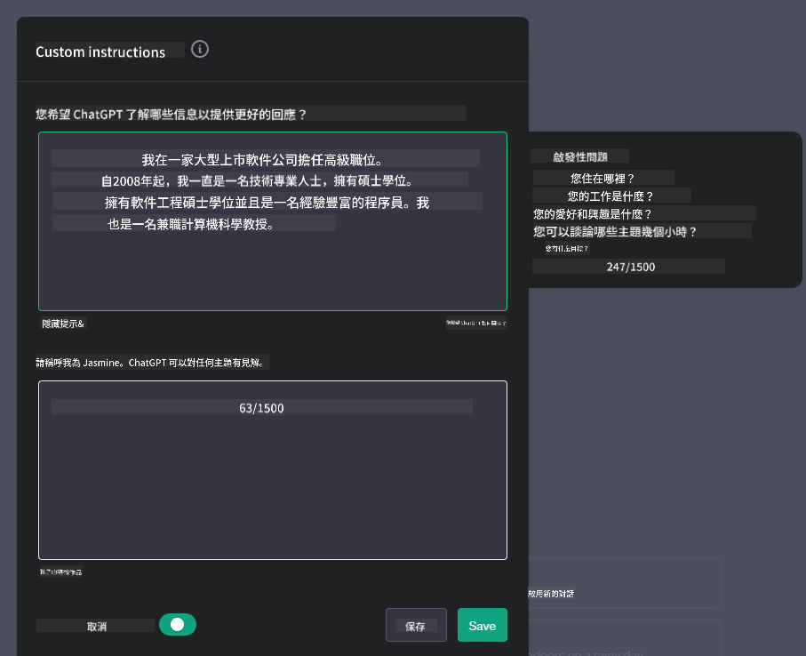
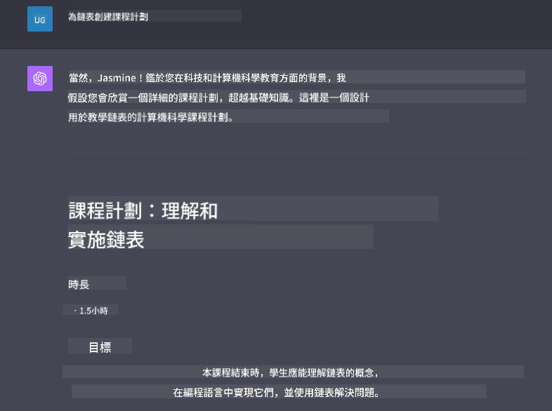

<!--
CO_OP_TRANSLATOR_METADATA:
{
  "original_hash": "ea4bbe640847aafbbba14dae4625e9af",
  "translation_date": "2025-06-25T15:11:40+00:00",
  "source_file": "07-building-chat-applications/README.md",
  "language_code": "mo"
}
-->
# 構建生成式 AI 驅動的聊天應用程式

[](https://aka.ms/gen-ai-lessons7-gh?WT.mc_id=academic-105485-koreyst)

> _(點擊上方圖片觀看本課程影片)_

現在我們已經了解如何構建文本生成應用程式，讓我們來看看聊天應用程式。

聊天應用程式已經融入我們的日常生活，不僅僅是用於休閒對話的工具。它們是客戶服務、技術支持，甚至是高級諮詢系統的重要組成部分。您很可能不久前就從某個聊天應用程式獲得了一些幫助。隨著我們將更先進的技術如生成式 AI 整合到這些平台中，複雜性和挑戰也隨之增加。

我們需要回答的一些問題是：

- **構建應用程式**。我們如何有效地構建並無縫整合這些 AI 驅動的應用程式以滿足特定的使用案例？
- **監控**。一旦部署，我們如何監控並確保應用程式在功能和遵循[負責任 AI 的六大原則](https://www.microsoft.com/ai/responsible-ai?WT.mc_id=academic-105485-koreyst)方面運行在最高質量水平？

隨著我們進入一個由自動化和無縫人機互動定義的時代，了解生成式 AI 如何改變聊天應用程式的範圍、深度和適應性變得至關重要。本課程將探討支持這些複雜系統的架構方面，深入研究為特定領域任務微調它們的方法，並評估確保負責任 AI 部署的指標和考量。

## 簡介

本課程涵蓋：

- 高效構建和整合聊天應用程式的技術。
- 如何應用自訂和微調到應用程式。
- 有效監控聊天應用程式的策略和考量。

## 學習目標

在本課程結束時，您將能夠：

- 描述將聊天應用程式構建和整合到現有系統中的考量。
- 為特定使用案例自訂聊天應用程式。
- 確定有效監控和維護 AI 驅動的聊天應用程式質量的關鍵指標和考量。
- 確保聊天應用程式負責任地利用 AI。

## 將生成式 AI 整合到聊天應用程式中

通過生成式 AI 提升聊天應用程式不僅僅是讓它們更智能；而是優化其架構、性能和用戶界面，以提供優質的用戶體驗。這涉及調查架構基礎、API 整合和用戶界面考量。本節旨在為您提供一個全面的路線圖，無論您是將它們插入現有系統還是構建為獨立平台。

在本節結束時，您將具備有效構建和整合聊天應用程式所需的專業知識。

### 聊天機器人還是聊天應用程式？

在我們深入構建聊天應用程式之前，讓我們比較一下“聊天機器人”和“AI 驅動的聊天應用程式”，它們具有不同的角色和功能。聊天機器人的主要目的是自動化特定的對話任務，例如回答常見問題或跟踪包裹。它通常由基於規則的邏輯或複雜的 AI 算法控制。相比之下，AI 驅動的聊天應用程式是一個更廣泛的環境，旨在促進各種形式的數字通信，例如人類用戶之間的文本、語音和視頻聊天。其定義特徵是整合了生成式 AI 模型，模擬細緻入微的人類對話，根據各種輸入和上下文提示生成回應。生成式 AI 驅動的聊天應用程式可以進行開放域討論，適應不斷變化的對話上下文，甚至生成創意或複雜的對話。

下表概述了關鍵差異和相似之處，以幫助我們了解它們在數字通信中的獨特角色。

| 聊天機器人                       | 生成式 AI 驅動的聊天應用程式        |
| -------------------------------- | ---------------------------------- |
| 以任務為中心且基於規則           | 上下文感知                         |
| 通常整合到更大的系統中           | 可能託管一個或多個聊天機器人       |
| 限於程式化功能                   | 整合生成式 AI 模型                 |
| 專門化和結構化互動               | 能夠進行開放域討論                 |

### 使用 SDK 和 API 利用預構建功能

構建聊天應用程式時，一個很好的第一步是評估現有的資源。使用 SDK 和 API 構建聊天應用程式是一種有利的策略，原因多種多樣。通過整合文檔齊全的 SDK 和 API，您正在戰略性地定位您的應用程式以實現長期成功，解決可擴展性和維護問題。

- **加速開發過程並減少開銷**：依賴預構建的功能而不是自己建造它們的昂貴過程，讓您可以專注於應用程式的其他方面，例如業務邏輯。
- **更好的性能**：當從頭構建功能時，您最終會問自己“它如何擴展？此應用程式是否能夠處理突如其來的用戶激增？” 維護良好的 SDK 和 API 通常對這些問題有內建的解決方案。
- **更容易的維護**：更新和改進更容易管理，因為大多數 API 和 SDK 只需在發布新版本時更新庫。
- **獲取尖端技術**：利用已經在大量數據集上進行微調和訓練的模型為您的應用程式提供自然語言能力。

訪問 SDK 或 API 的功能通常涉及獲得使用所提供服務的許可，這通常是通過使用唯一密鑰或身份驗證令牌來完成的。我們將使用 OpenAI Python 庫來探索這看起來是什麼樣子。您也可以在以下[OpenAI 筆記本](../../../07-building-chat-applications/python/oai-assignment.ipynb)或[Azure OpenAI Services 筆記本](../../../07-building-chat-applications/python/aoai-assignment.ipynb)中自行嘗試。

```python
import os
from openai import OpenAI

API_KEY = os.getenv("OPENAI_API_KEY","")

client = OpenAI(
    api_key=API_KEY
    )

chat_completion = client.chat.completions.create(model="gpt-3.5-turbo", messages=[{"role": "user", "content": "Suggest two titles for an instructional lesson on chat applications for generative AI."}])
```

上面的例子使用 GPT-3.5 Turbo 模型來完成提示，但請注意，在這之前設置了 API 密鑰。如果您沒有設置密鑰，將會收到錯誤。

## 用戶體驗 (UX)

一般的 UX 原則適用於聊天應用程式，但由於涉及機器學習的組件，以下一些額外的考量變得尤為重要。

- **處理歧義的機制**：生成式 AI 模型偶爾會生成模糊的答案。允許用戶要求澄清的功能在他們遇到此問題時可能會有所幫助。
- **上下文保留**：高級生成式 AI 模型具有在對話中記住上下文的能力，這可能是用戶體驗的必要資產。給用戶控制和管理上下文的能力改善了用戶體驗，但也引入了保留敏感用戶信息的風險。考慮存儲此信息的時間長短，例如引入保留政策，可以在上下文需求和隱私之間取得平衡。
- **個性化**：具有學習和適應能力的 AI 模型為用戶提供個性化體驗。通過用戶資料等功能定制用戶體驗，不僅讓用戶感到被理解，還有助於他們尋找特定答案，創造更高效和滿意的互動。

OpenAI 的 ChatGPT 中的“自訂指示”設置就是個性化的一個例子。它允許您提供關於您自己的信息，這可能是提示的重要上下文。以下是自訂指示的示例。



這個“個人資料”提示 ChatGPT 創建一個關於鏈表的課程計劃。請注意，ChatGPT 考慮到用戶可能會根據她的經驗需要更深入的課程計劃。



### 微軟的大型語言模型系統消息框架

[微軟提供了指導](https://learn.microsoft.com/azure/ai-services/openai/concepts/system-message#define-the-models-output-format?WT.mc_id=academic-105485-koreyst)來撰寫有效的系統消息，當從 LLMs 生成回應時，分為四個方面：

1. 定義模型的對象以及其能力和限制。
2. 定義模型的輸出格式。
3. 提供具體示例以展示模型的預期行為。
4. 提供額外的行為防護措施。

### 無障礙設計

無論用戶有視覺、聽覺、運動或認知障礙，設計良好的聊天應用程式應該能被所有人使用。以下列表分解了針對各種用戶障礙增強可訪問性的特定功能。

- **視覺障礙的功能**：高對比度主題和可調大小的文字，螢幕閱讀器兼容性。
- **聽覺障礙的功能**：文字轉語音和語音轉文字功能，音頻通知的視覺提示。
- **運動障礙的功能**：鍵盤導航支持，語音命令。
- **認知障礙的功能**：簡化的語言選項。

## 為特定領域語言模型進行自訂和微調

想像一個能夠理解您公司行話並預測其用戶基礎常見查詢的聊天應用程式。有幾種值得一提的方法：

- **利用 DSL 模型**。DSL 代表特定領域語言。您可以利用所謂的 DSL 模型，該模型在特定領域進行訓練以理解其概念和場景。
- **應用微調**。微調是使用特定數據進一步訓練模型的過程。

## 自訂：使用 DSL

利用特定領域語言模型 (DSL 模型) 可以通過提供專門的、上下文相關的互動來增強用戶參與。這是一個訓練或微調以理解和生成與特定領域、行業或主題相關文本的模型。使用 DSL 模型的選擇可能從從頭開始訓練一個，到通過 SDK 和 API 使用現有的模型。另一個選擇是微調，即採用現有的預訓練模型並使其適應特定領域。

## 自訂：應用微調

當預訓練模型在特定領域或特定任務中表現不佳時，通常會考慮進行微調。

例如，醫學查詢是複雜的，需要大量的上下文。當醫療專業人員診斷患者時，這是基於多種因素，如生活方式或既往病史，甚至可能依賴於最近的醫學期刊來驗證其診斷。在這樣細緻入微的情況下，通用 AI 聊天應用程式不能成為可靠的來源。

### 場景：醫療應用程式

考慮一個設計用來協助醫療從業人員的聊天應用程式，提供治療指南、藥物相互作用或最新研究成果的快速參考。

通用模型可能適合回答基本醫學問題或提供一般建議，但可能在以下方面遇到困難：

- **高度具體或複雜的案例**。例如，神經科醫生可能會問應用程式：“目前管理小兒藥物難治性癲癇的最佳實踐是什麼？”
- **缺乏最近的進展**。通用模型可能難以提供包含神經科學和藥理學最新進展的當前答案。

在這些情況下，使用專門的醫學數據集微調模型可以顯著提高其處理這些複雜醫學查詢的準確性和可靠性。這需要訪問大量且相關的數據集，以代表需要解決的領域特定挑戰和問題。

## 高質量 AI 驅動聊天體驗的考量

本節概述了“高質量”聊天應用程式的標準，其中包括捕獲可操作的指標和遵循負責任地利用 AI 技術的框架。

### 關鍵指標

為了保持應用程式的高質量性能，跟踪關鍵指標和考量至關重要。這些測量不僅確保應用程式的功能，還評估 AI 模型和用戶體驗的質量。以下是涵蓋基本、AI 和用戶體驗指標的列表。

| 指標                        | 定義                                                                                                                 | 聊天開發者的考量                                                         |
| --------------------------- | -------------------------------------------------------------------------------------------------------------------- | ------------------------------------------------------------------------ |
| **正常運行時間**            | 測量應用程式運行和可用的時間。                                                                                      | 您將如何最大限度地減少停機時間？                                         |
| **回應時間**                | 應用程式回應用戶查詢所花費的時間。                                                                                  | 您如何優化查詢處理以改善回應時間？                                       |
| **精確率**                  | 真正陽性預測與總陽性預測的比率                                                                                       | 您將如何驗證模型的精確率？                                               |
| **召回率（敏感性）**        | 真正陽性預測與實際陽性的比率                                                                                         | 您將如何測量和提高召回率？                                               |
| **F1 分數**                 | 精確率和召回率的調和平均數，平衡兩者之間的權衡。                                                                   | 您的目標 F1 分數是多少？您將如何平衡精確率和召回率？                     |
| **困惑度**                  | 測量模型預測的概率分布與數據的實際分布的一致程度。                                                                 | 您將如何最大限度地減少困惑度？                                           |
| **用戶滿意度指標**          | 測量用戶對應用程式的感知。通常通過調查收集。                                                                       | 您將多頻繁收集用戶反饋？您將如何根據反饋進行調整？                       |
| **錯誤率**                  | 模型在理解或輸出中犯錯誤的比率。                                                                                   | 您有哪些策略來降低錯誤率？                                               |
| **再訓練周期**              | 模型更新以納入新數據和見解的頻率。                                                                                 | 您將多頻繁地再訓練模型？什麼會觸發再訓練周期？                           |
| **異常檢測**                | 用於識別不符合預期行為的異常模式的工具和技術。                                                                     | 您將如何應對異常情況？                                                   |

### 在聊天應用程式中實施負責任 AI 實踐

微軟的負責任 AI 方法確定了應指導 AI 開發和使用的六大原則。以下是這些原則、其定義以及聊天開發者應考慮的事項和原因。

| 原則                      | 微軟的定義                                   | 聊天開發者的考量                                                        | 為什麼這很重要                                                                       |
| ------------------------- | -------------------------------------------- | ----------------------------------------------------------------------- | ----------------------------------------------------------------------------------- |
| 公平性                    | AI 系統應該公平對待所有人。                   | 確保聊天應用程式不會基於用戶數據進行歧視。                             | 建立用戶的信任和包容性；避免法律後果。                                               |
| 可靠性和安全性            | AI 系統應該可靠和安全地運行。                 | 實施測試和故障保護以最大限度地減少錯誤和風險。                         | 確保用戶滿意度並防止潛在危害。                                                       |
| 隱私和安全                | AI 系統應該是安全的並尊重隱私。               | 實施強大的加密和數據保護措施。                                         | 保護敏感用戶數據並遵守隱私法律。                                                     |


**免責聲明**：  
本文檔已使用 AI 翻譯服務 [Co-op Translator](https://github.com/Azure/co-op-translator) 進行翻譯。我們努力確保準確性，但請注意，自動翻譯可能包含錯誤或不準確之處。應將原始語言的文件視為權威來源。對於關鍵信息，建議使用專業人工翻譯。我們對使用此翻譯所產生的任何誤解或誤釋不承擔責任。