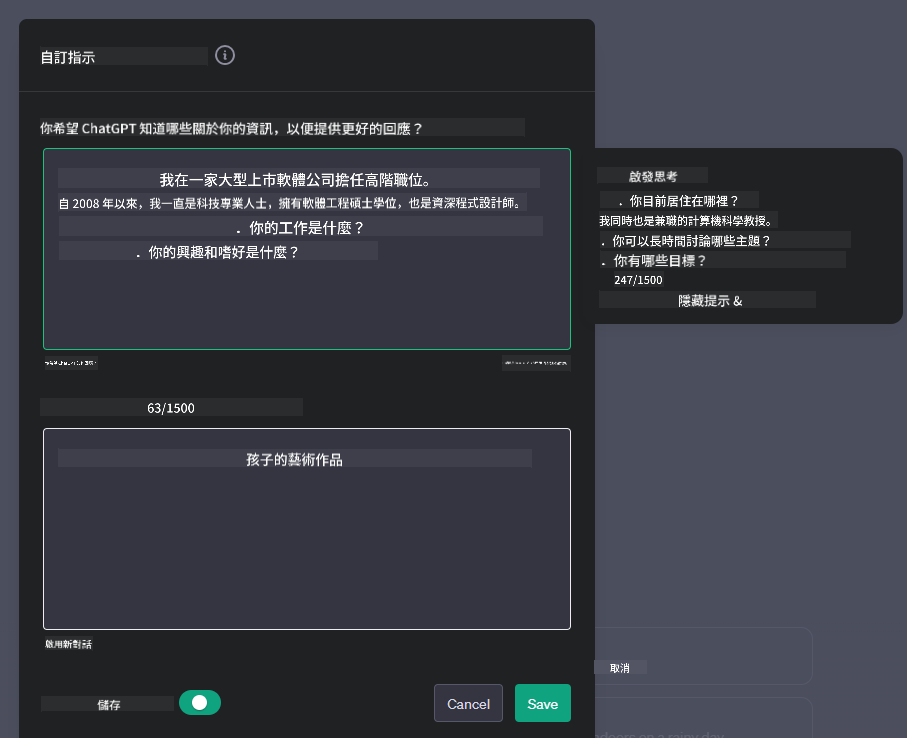
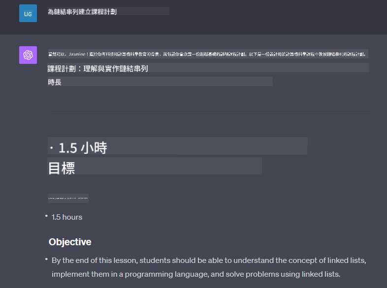

<!--
CO_OP_TRANSLATOR_METADATA:
{
  "original_hash": "ea4bbe640847aafbbba14dae4625e9af",
  "translation_date": "2025-07-09T12:18:28+00:00",
  "source_file": "07-building-chat-applications/README.md",
  "language_code": "mo"
}
-->
# 建立生成式 AI 驅動的聊天應用程式

[](https://aka.ms/gen-ai-lessons7-gh?WT.mc_id=academic-105485-koreyst)

> _(點擊上方圖片觀看本課程影片)_

既然我們已經了解如何建立文字生成應用程式，接下來讓我們來探討聊天應用程式。

聊天應用程式已融入我們的日常生活，不僅僅是用來閒聊。它們是客服、技術支援，甚至是複雜諮詢系統的重要組成部分。你很可能不久前就曾透過聊天應用程式獲得幫助。隨著我們將生成式 AI 等先進技術整合到這些平台中，系統的複雜度與挑戰也隨之增加。

我們需要回答的一些問題包括：

- **建立應用程式**。如何有效率地建置並無縫整合這些 AI 驅動的應用程式，以符合特定使用情境？
- **監控**。部署後，如何監控並確保應用程式在功能與遵守[負責任 AI 六大原則](https://www.microsoft.com/ai/responsible-ai?WT.mc_id=academic-105485-koreyst)方面都維持最高品質？

隨著我們邁入自動化與人機互動無縫結合的時代，理解生成式 AI 如何改變聊天應用程式的範圍、深度與適應性變得至關重要。本課程將探討支援這些複雜系統的架構面向，深入調整其以符合特定領域任務的方法，並評估確保負責任 AI 部署的指標與考量。

## 介紹

本課程涵蓋：

- 高效建置與整合聊天應用程式的技術。
- 如何對應用程式進行客製化與微調。
- 有效監控聊天應用程式的策略與考量。

## 學習目標

完成本課程後，你將能夠：

- 描述建置與整合聊天應用程式到現有系統時的考量。
- 針對特定使用情境客製化聊天應用程式。
- 辨識關鍵指標與考量，以有效監控並維持 AI 驅動聊天應用程式的品質。
- 確保聊天應用程式負責任地運用 AI。

## 將生成式 AI 整合到聊天應用程式中

提升聊天應用程式的智慧不僅是讓它們更聰明，更是優化其架構、效能與使用者介面，以提供優質的使用體驗。這包括探討架構基礎、API 整合與使用者介面設計。本節旨在為你提供一份全面的路線圖，協助你在將聊天應用程式接入現有系統或打造獨立平台時，順利應對這些複雜挑戰。

完成本節後，你將具備高效建構與整合聊天應用程式的專業知識。

### 聊天機器人還是聊天應用程式？

在深入建置聊天應用程式前，讓我們比較「聊天機器人」與「AI 驅動的聊天應用程式」兩者的不同角色與功能。聊天機器人的主要目的是自動化特定對話任務，例如回答常見問題或追蹤包裹，通常由規則邏輯或複雜的 AI 演算法控制。相較之下，AI 驅動的聊天應用程式是一個更廣泛的環境，設計用來促進多種數位溝通形式，如文字、語音及視訊聊天。其核心特色是整合生成式 AI 模型，模擬細膩且類似人類的對話，根據多樣的輸入與上下文線索產生回應。生成式 AI 驅動的聊天應用程式能進行開放領域討論，適應不斷變化的對話情境，甚至產生創意或複雜的對話內容。

下表列出兩者的主要差異與相似點，幫助我們理解它們在數位溝通中的獨特角色。

| 聊天機器人                             | 生成式 AI 驅動的聊天應用程式               |
| ------------------------------------- | ------------------------------------------ |
| 任務導向且基於規則                     | 具備上下文感知能力                         |
| 通常整合於較大型系統                   | 可能包含一個或多個聊天機器人               |
| 功能受限於預先程式設計                 | 採用生成式 AI 模型                         |
| 專門且結構化的互動                     | 能進行開放領域討論                         |

### 利用 SDK 和 API 的預建功能

在建置聊天應用程式時，評估現有資源是一個很好的起點。使用 SDK 和 API 來建構聊天應用程式是一種有利的策略，原因多樣。透過整合文件完善的 SDK 和 API，你的應用程式能在長期發展中更具競爭力，並解決擴展性與維護的問題。

- **加速開發流程並降低負擔**：依賴預建功能，避免自行開發昂貴且耗時的功能，讓你能專注於應用程式中更重要的部分，如商業邏輯。
- **更佳效能**：自行開發功能時，常會思考「系統如何擴展？能否應付突增的使用者？」良好維護的 SDK 和 API 通常內建解決方案。
- **維護更簡便**：大多數 API 和 SDK 只需更新函式庫版本即可輕鬆管理更新與改進。
- **接觸尖端技術**：利用經過微調且訓練於龐大資料集的模型，賦予應用程式自然語言處理能力。

使用 SDK 或 API 功能通常需要取得使用權限，通常透過唯一金鑰或認證令牌。我們將使用 OpenAI Python 函式庫示範其運作方式。你也可以在本課程的 [OpenAI 筆記本](python/oai-assignment.ipynb) 或 [Azure OpenAI 服務筆記本](python/aoai-assignment.ipynb) 中自行嘗試。

```python
import os
from openai import OpenAI

API_KEY = os.getenv("OPENAI_API_KEY","")

client = OpenAI(
    api_key=API_KEY
    )

chat_completion = client.chat.completions.create(model="gpt-3.5-turbo", messages=[{"role": "user", "content": "Suggest two titles for an instructional lesson on chat applications for generative AI."}])
```

上述範例使用 GPT-3.5 Turbo 模型完成提示，但請注意必須先設定 API 金鑰，否則會出現錯誤。

## 使用者體驗（UX）

一般的 UX 原則同樣適用於聊天應用程式，但由於涉及機器學習元件，以下幾點特別重要：

- **處理模糊性的機制**：生成式 AI 模型偶爾會產生模糊的回答。若用戶遇到此問題，提供請求澄清的功能會很有幫助。
- **上下文保留**：先進的生成式 AI 模型能記憶對話中的上下文，這對使用者體驗是重要資產。讓用戶能控制與管理上下文能提升體驗，但也帶來保留敏感資訊的風險。考慮資訊保存期限，例如引入保留政策，可在上下文需求與隱私間取得平衡。
- **個人化**：AI 模型具備學習與適應能力，能為用戶提供個人化體驗。透過用戶檔案等功能調整使用者體驗，不僅讓用戶感覺被理解，也有助於更有效率地找到特定答案，提升互動滿意度。

OpenAI ChatGPT 的「自訂指令」設定即是一個個人化的例子。它允許你提供關於自己的資訊，作為提示的重要上下文。以下是一個自訂指令範例。



這個「個人檔案」指令讓 ChatGPT 針對鏈結串列製作課程計畫。注意 ChatGPT 會考慮使用者可能希望根據其經驗獲得更深入的課程內容。



### 微軟的大型語言模型系統訊息框架

[微軟提供了撰寫有效系統訊息的指引](https://learn.microsoft.com/azure/ai-services/openai/concepts/system-message#define-the-models-output-format?WT.mc_id=academic-105485-koreyst)，用於生成大型語言模型（LLM）的回應，分為四個面向：

1. 定義模型的目標對象、能力與限制。
2. 定義模型的輸出格式。
3. 提供示範模型預期行為的具體範例。
4. 設定額外的行為守則。

### 無障礙設計

無論使用者有視覺、聽覺、肢體或認知障礙，設計良好的聊天應用程式都應該讓所有人都能使用。以下列出針對不同障礙類型提升無障礙性的具體功能：

- **視覺障礙功能**：高對比主題與可調整文字大小，螢幕閱讀器相容。
- **聽覺障礙功能**：文字轉語音與語音轉文字功能，音訊通知的視覺提示。
- **肢體障礙功能**：鍵盤導航支援，語音指令。
- **認知障礙功能**：簡化語言選項。

## 針對特定領域語言模型的客製化與微調

想像一個聊天應用程式能理解你公司的行話，並預測用戶常見的特定問題。有幾種值得一提的方法：

- **利用 DSL 模型**。DSL 指的是領域特定語言（Domain Specific Language）。你可以利用在特定領域訓練的 DSL 模型，理解該領域的概念與情境。
- **進行微調**。微調是使用特定資料進一步訓練模型的過程。

## 客製化：使用 DSL

利用領域特定語言模型（DSL 模型）能提升用戶參與度，提供專業且具上下文相關性的互動。這類模型是針對特定領域、產業或主題訓練或微調的。使用 DSL 模型的選項包括從零開始訓練，或透過 SDK 和 API 使用現有模型。另一種選擇是微調，即採用現有的預訓練模型，並針對特定領域進行調整。

## 客製化：進行微調

當預訓練模型在專業領域或特定任務上表現不足時，通常會考慮微調。

例如，醫療問題複雜且需要大量上下文。醫療專業人員診斷病患時，會根據生活習慣、既有疾病，甚至最新醫學期刊來驗證診斷。在這種細膩情境下，一般用途的 AI 聊天應用程式無法成為可靠來源。

### 情境：醫療應用程式

設想一款協助醫療人員快速查詢治療指引、藥物交互作用或最新研究成果的聊天應用程式。

一般用途模型可能足以回答基本醫療問題或提供一般建議，但可能難以應對：

- **高度專業或複雜案例**。例如，神經科醫師可能會問：「目前治療兒童藥物抗性癲癇的最佳實務是什麼？」
- **缺乏最新進展**。一般模型可能無法提供包含神經學與藥理學最新進展的答案。

在這些情況下，使用專門的醫療資料集微調模型，能顯著提升其處理複雜醫療問題的準確性與可靠性。這需要取得大量且具代表性的領域資料，涵蓋需解決的專業挑戰與問題。

## 高品質 AI 驅動聊天體驗的考量

本節說明「高品質」聊天應用程式的標準，包括可行指標的蒐集與負責任運用 AI 技術的框架。

### 關鍵指標

為維持應用程式的高品質表現，必須持續追蹤關鍵指標與考量。這些衡量不僅確保應用功能正常，也評估 AI 模型與使用者體驗的品質。以下列出基本、AI 與使用者體驗指標供參考。

| 指標                         | 定義                                                                                                               | 聊天開發者考量                                                         |
| ---------------------------- | ------------------------------------------------------------------------------------------------------------------ | ---------------------------------------------------------------------- |
| **運行時間（Uptime）**       | 測量應用程式可供使用者操作與存取的時間長度。                                                                     | 如何將停機時間降到最低？                                               |
| **回應時間**                 | 應用程式回覆使用者查詢所需的時間。                                                                                 | 如何優化查詢處理以縮短回應時間？                                       |
| **精確度（Precision）**      | 真陽性預測數與所有陽性預測數的比例。                                                                               | 如何驗證模型的精確度？                                                 |
| **召回率（Recall / 敏感度）** | 真陽性預測數與實際陽性數的比例。                                                                                   | 如何衡量並提升召回率？                                                 |
| **F1 分數**                  | 精確度與召回率的調和平均數，平衡兩者的權衡。                                                                       | 目標 F1 分數為何？如何平衡精確度與召回率？                             |
| **困惑度（Perplexity）**     | 測量模型預測的機率分布與實際資料分布的吻合程度。                                                                   | 如何降低困惑度？                                                       |
| **使用者滿意度指標**         | 測量使用者對應用程式的感受，通常透過調查收集。                                                                     | 多久收集一次使用者回饋？如何根據回饋調整？                             |
| **錯誤率**                   | 模型在理解或輸出時出錯的頻率。                                                                                     | 有哪些策略用以降低錯誤率？                                             |
| **再訓練週期**               | 模型更新以納入新資料與見解的頻率。                                                                                 | 多久進行一次再訓練？什麼情況觸發再訓練？                               |
| **異常檢測**               | 用於識別不符合預期行為的異常模式的工具和技術。                                      | 你會如何應對異常情況？                                                      |

### 在聊天應用中實施負責任的 AI 實踐

微軟的負責任 AI 方法確立了六項指導 AI 開發和使用的原則。以下是這些原則、定義，以及聊天開發者應該考慮的事項和為何必須重視它們。

| 原則                   | 微軟定義                                               | 聊天開發者應考慮的事項                                               | 為何重要                                                                                 |
| ---------------------- | ----------------------------------------------------- | -------------------------------------------------------------------- | ---------------------------------------------------------------------------------------- |
| 公平性                 | AI 系統應公平對待所有人。                              | 確保聊天應用不會基於用戶資料進行歧視。                              | 建立用戶信任與包容性；避免法律風險。                                                    |
| 可靠性與安全性         | AI 系統應可靠且安全地運作。                            | 實施測試和故障保護機制以降低錯誤和風險。                            | 確保用戶滿意度並防止潛在傷害。                                                          |
| 隱私與安全             | AI 系統應安全且尊重隱私。                              | 採用強加密和資料保護措施。                                          | 保護敏感用戶資料並遵守隱私法規。                                                        |
| 包容性                 | AI 系統應賦能所有人並促進參與。                        | 設計對多元用戶友善且易用的 UI/UX。                                  | 確保更多人能有效使用應用程式。                                                          |
| 透明度                 | AI 系統應易於理解。                                    | 提供清晰的文件和 AI 回應的推理說明。                                | 用戶若能理解決策過程，更容易信任系統。                                                  |
| 問責制                 | 人們應對 AI 系統負責。                                | 建立明確的審核和改進 AI 決策的流程。                                | 促進持續改進並在出錯時採取糾正措施。                                                    |

## 作業

請參考 [assignment](../../../07-building-chat-applications/python)，它將帶你完成一系列練習，從執行第一個聊天提示，到分類與摘要文本等。請注意，作業提供多種程式語言版本！

## 做得很好！繼續前進

完成本課程後，請查看我們的 [Generative AI Learning collection](https://aka.ms/genai-collection?WT.mc_id=academic-105485-koreyst)，持續提升你的生成式 AI 知識！

前往第 8 課，了解如何開始[建立搜尋應用程式](../08-building-search-applications/README.md?WT.mc_id=academic-105485-koreyst)！

**免責聲明**：  
本文件係使用 AI 翻譯服務 [Co-op Translator](https://github.com/Azure/co-op-translator) 進行翻譯。雖然我們致力於確保準確性，但請注意，自動翻譯可能包含錯誤或不準確之處。原始文件的母語版本應視為權威來源。對於重要資訊，建議採用專業人工翻譯。我們不對因使用本翻譯而產生的任何誤解或誤釋負責。