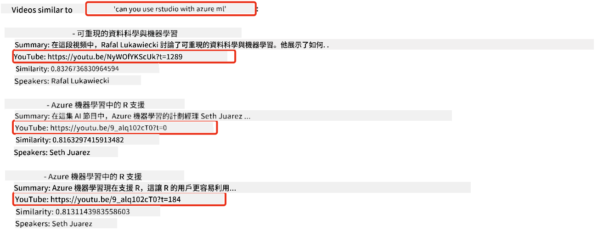
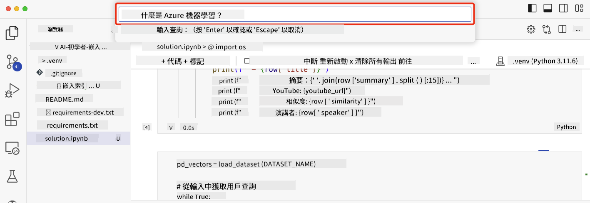

<!--
CO_OP_TRANSLATOR_METADATA:
{
  "original_hash": "58953c08b8ba7073b836d4270ea0fe86",
  "translation_date": "2025-10-17T15:12:20+00:00",
  "source_file": "08-building-search-applications/README.md",
  "language_code": "mo"
}
-->
# 建立搜尋應用程式

[](https://youtu.be/W0-nzXjOjr0?si=GcsqiTTvd7RKbo7V)

> > _點擊上方圖片觀看本課程的影片_

大型語言模型（LLMs）不僅僅用於聊天機器人和文字生成，還可以利用嵌入技術來建立搜尋應用程式。嵌入是數據的數值表示，也稱為向量，可用於進行語義搜尋。

在本課程中，您將為我們的教育初創公司建立一個搜尋應用程式。我們的初創公司是一家非營利組織，致力於為發展中國家的學生提供免費教育。我們擁有大量的 YouTube 教育影片，學生可以用來學習 AI。我們希望建立一個搜尋應用程式，讓學生可以透過輸入問題來搜尋相關的 YouTube 影片。

例如，學生可能會輸入「什麼是 Jupyter Notebooks？」或「什麼是 Azure ML」，搜尋應用程式將返回與問題相關的 YouTube 影片列表，更棒的是，搜尋應用程式還會提供影片中回答問題的具體時間點的連結。

## 課程介紹

在本課程中，我們將涵蓋以下內容：

- 語義搜尋與關鍵字搜尋的區別。
- 什麼是文字嵌入。
- 建立文字嵌入索引。
- 搜尋文字嵌入索引。

## 學習目標

完成本課程後，您將能夠：

- 區分語義搜尋和關鍵字搜尋。
- 解釋什麼是文字嵌入。
- 使用嵌入技術建立一個搜尋應用程式。

## 為什麼要建立搜尋應用程式？

建立搜尋應用程式將幫助您了解如何使用嵌入技術來搜尋數據。您還將學習如何建立一個搜尋應用程式，幫助學生快速找到所需資訊。

本課程包含 Microsoft [AI Show](https://www.youtube.com/playlist?list=PLlrxD0HtieHi0mwteKBOfEeOYf0LJU4O1) YouTube 頻道的影片文字記錄嵌入索引。AI Show 是一個教授 AI 和機器學習的 YouTube 頻道。嵌入索引包含截至 2023 年 10 月的所有影片文字記錄的嵌入。您將使用嵌入索引為我們的初創公司建立一個搜尋應用程式。搜尋應用程式會返回影片中回答問題的具體時間點的連結。這是一種幫助學生快速找到所需資訊的好方法。

以下是一個語義搜尋的範例，問題是「可以使用 rstudio 與 azure ml 嗎？」。查看 YouTube 的 URL，您會看到 URL 包含一個時間戳，指向影片中回答問題的具體位置。



## 什麼是語義搜尋？

您可能會好奇，什麼是語義搜尋？語義搜尋是一種利用查詢中詞語的語義或含義來返回相關結果的搜尋技術。

以下是一個語義搜尋的例子。假設您想買一輛車，可能會搜尋「我的夢想車」，語義搜尋能理解您不是在「夢想」一輛車，而是想尋找您的「理想」車。語義搜尋能理解您的意圖並返回相關結果。相反，關鍵字搜尋會字面上搜尋與車有關的夢想，通常返回不相關的結果。

## 什麼是文字嵌入？

[文字嵌入](https://en.wikipedia.org/wiki/Word_embedding?WT.mc_id=academic-105485-koreyst)是一種用於[自然語言處理](https://en.wikipedia.org/wiki/Natural_language_processing?WT.mc_id=academic-105485-koreyst)的文字表示技術。文字嵌入是文字的語義數值表示，用於以機器易於理解的方式表示數據。有許多建立文字嵌入的模型，在本課程中，我們將專注於使用 OpenAI 嵌入模型生成嵌入。

以下是一個例子，假設以下文字是 AI Show YouTube 頻道某一集的文字記錄：

```text
Today we are going to learn about Azure Machine Learning.
```

我們將文字傳遞給 OpenAI 嵌入 API，它會返回由 1536 個數字組成的嵌入，也就是向量。向量中的每個數字代表文字的不同方面。為簡潔起見，以下是向量中的前 10 個數字。

```python
[-0.006655829958617687, 0.0026128944009542465, 0.008792596869170666, -0.02446001023054123, -0.008540431968867779, 0.022071078419685364, -0.010703742504119873, 0.003311325330287218, -0.011632772162556648, -0.02187200076878071, ...]
```

## 嵌入索引是如何建立的？

本課程的嵌入索引是通過一系列 Python 腳本建立的。您可以在本課程的「scripts」文件夾中的 [README](./scripts/README.md?WT.mc_id=academic-105485-koreyst) 中找到腳本和指導說明。您不需要運行這些腳本即可完成本課程，因為嵌入索引已提供。

這些腳本執行以下操作：

1. 下載 [AI Show](https://www.youtube.com/playlist?list=PLlrxD0HtieHi0mwteKBOfEeOYf0LJU4O1) 播放列表中每個 YouTube 影片的文字記錄。
2. 使用 [OpenAI Functions](https://learn.microsoft.com/azure/ai-services/openai/how-to/function-calling?WT.mc_id=academic-105485-koreyst)，嘗試從文字記錄的前三分鐘中提取講者姓名。每個影片的講者姓名存儲在嵌入索引 `embedding_index_3m.json` 中。
3. 將文字記錄分塊為**三分鐘的文字片段**。片段包括約 20 個與下一片段重疊的詞語，以確保片段嵌入不被截斷並提供更好的搜尋上下文。
4. 將每個文字片段傳遞給 OpenAI Chat API，將文字摘要為 60 個詞語。摘要也存儲在嵌入索引 `embedding_index_3m.json` 中。
5. 最後，將片段文字傳遞給 OpenAI 嵌入 API。嵌入 API 返回一個由 1536 個數字組成的向量，表示片段的語義含義。片段及其 OpenAI 嵌入向量存儲在嵌入索引 `embedding_index_3m.json` 中。

### 向量資料庫

為了簡化課程，嵌入索引存儲在名為 `embedding_index_3m.json` 的 JSON 文件中，並加載到 Pandas DataFrame 中。然而，在生產環境中，嵌入索引通常存儲在向量資料庫中，例如 [Azure Cognitive Search](https://learn.microsoft.com/training/modules/improve-search-results-vector-search?WT.mc_id=academic-105485-koreyst)、[Redis](https://cookbook.openai.com/examples/vector_databases/redis/readme?WT.mc_id=academic-105485-koreyst)、[Pinecone](https://cookbook.openai.com/examples/vector_databases/pinecone/readme?WT.mc_id=academic-105485-koreyst)、[Weaviate](https://cookbook.openai.com/examples/vector_databases/weaviate/readme?WT.mc_id=academic-105485-koreyst) 等。

## 理解餘弦相似度

我們已經了解了文字嵌入，接下來需要學習如何使用文字嵌入來搜尋數據，特別是使用餘弦相似度找到與給定查詢最相似的嵌入。

### 什麼是餘弦相似度？

餘弦相似度是衡量兩個向量相似度的一種方法，您也會聽到它被稱為「最近鄰搜尋」。要執行餘弦相似度搜尋，您需要使用 OpenAI 嵌入 API 將查詢文字向量化。然後計算查詢向量與嵌入索引中每個向量的餘弦相似度。記住，嵌入索引對每個 YouTube 文字記錄片段都有一個向量。最後，按餘弦相似度排序結果，餘弦相似度最高的文字片段與查詢最相似。

從數學角度來看，餘弦相似度測量兩個向量在多維空間中投影的角度的餘弦值。這種測量很有用，因為即使兩個文檔因大小而在歐幾里得距離上相距甚遠，它們之間的角度可能較小，因此餘弦相似度較高。關於餘弦相似度公式的更多信息，請參閱 [餘弦相似度](https://en.wikipedia.org/wiki/Cosine_similarity?WT.mc_id=academic-105485-koreyst)。

## 建立您的第一個搜尋應用程式

接下來，我們將學習如何使用嵌入技術建立搜尋應用程式。該搜尋應用程式將允許學生透過輸入問題來搜尋影片。搜尋應用程式將返回與問題相關的影片列表，並提供影片中回答問題的具體時間點的連結。

此解決方案已在 Windows 11、macOS 和 Ubuntu 22.04 上使用 Python 3.10 或更高版本進行構建和測試。您可以從 [python.org](https://www.python.org/downloads/?WT.mc_id=academic-105485-koreyst) 下載 Python。

## 作業 - 建立搜尋應用程式，幫助學生

我們在本課程開始時介紹了我們的初創公司。現在是時候幫助學生建立一個搜尋應用程式來完成他們的評估。

在本次作業中，您將建立用於構建搜尋應用程式的 Azure OpenAI Services。您需要建立以下 Azure OpenAI Services。完成此作業需要一個 Azure 訂閱。

### 啟動 Azure Cloud Shell

1. 登錄 [Azure 入口網站](https://portal.azure.com/?WT.mc_id=academic-105485-koreyst)。
2. 選擇 Azure 入口網站右上角的 Cloud Shell 圖標。
3. 選擇 **Bash** 作為環境類型。

#### 建立資源群組

> 在這些指導中，我們使用名為「semantic-video-search」的資源群組，位於美國東部。
> 您可以更改資源群組的名稱，但在更改資源位置時，
> 請檢查 [模型可用性表](https://aka.ms/oai/models?WT.mc_id=academic-105485-koreyst)。

```shell
az group create --name semantic-video-search --location eastus
```

#### 建立 Azure OpenAI Service 資源

在 Azure Cloud Shell 中運行以下命令以建立 Azure OpenAI Service 資源。

```shell
az cognitiveservices account create --name semantic-video-openai --resource-group semantic-video-search \
    --location eastus --kind OpenAI --sku s0
```

#### 獲取端點和密鑰以在此應用程式中使用

在 Azure Cloud Shell 中運行以下命令以獲取 Azure OpenAI Service 資源的端點和密鑰。

```shell
az cognitiveservices account show --name semantic-video-openai \
   --resource-group  semantic-video-search | jq -r .properties.endpoint
az cognitiveservices account keys list --name semantic-video-openai \
   --resource-group semantic-video-search | jq -r .key1
```

#### 部署 OpenAI 嵌入模型

在 Azure Cloud Shell 中運行以下命令以部署 OpenAI 嵌入模型。

```shell
az cognitiveservices account deployment create \
    --name semantic-video-openai \
    --resource-group  semantic-video-search \
    --deployment-name text-embedding-ada-002 \
    --model-name text-embedding-ada-002 \
    --model-version "2"  \
    --model-format OpenAI \
    --sku-capacity 100 --sku-name "Standard"
```

## 解決方案

在 GitHub Codespaces 中打開 [解決方案筆記本](./python/aoai-solution.ipynb?WT.mc_id=academic-105485-koreyst)，並按照 Jupyter Notebook 中的指導進行操作。

當您運行筆記本時，系統會提示您輸入查詢。輸入框看起來像這樣：



## 做得好！繼續學習

完成本課程後，請查看我們的 [生成式 AI 學習系列](https://aka.ms/genai-collection?WT.mc_id=academic-105485-koreyst)，繼續提升您的生成式 AI 知識！

前往第 9 課，我們將探討如何[建立影像生成應用程式](../09-building-image-applications/README.md?WT.mc_id=academic-105485-koreyst)！

---

**免責聲明**：  
本文件已使用 AI 翻譯服務 [Co-op Translator](https://github.com/Azure/co-op-translator) 進行翻譯。儘管我們努力確保翻譯的準確性，但請注意，自動翻譯可能包含錯誤或不準確之處。原始文件的母語版本應被視為權威來源。對於關鍵信息，建議使用專業人工翻譯。我們對因使用此翻譯而產生的任何誤解或誤釋不承擔責任。