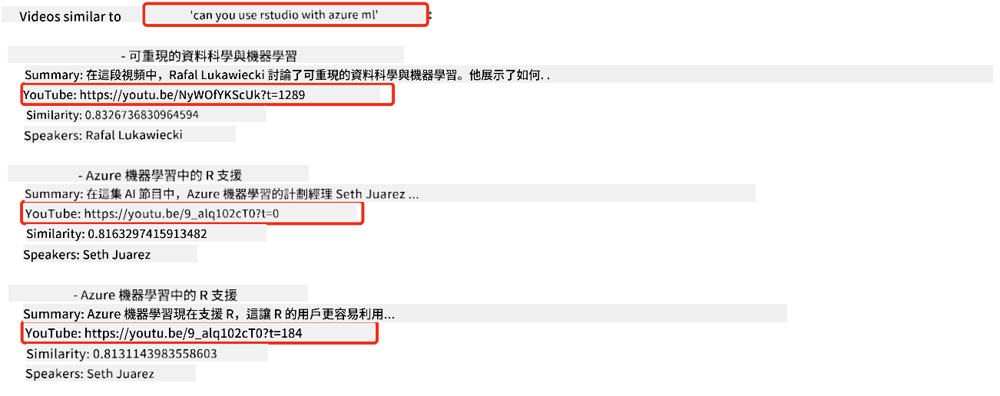
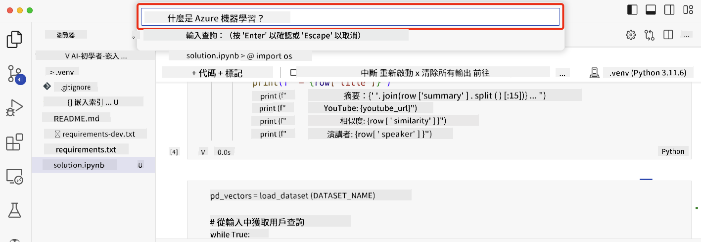

<!--
CO_OP_TRANSLATOR_METADATA:
{
  "original_hash": "d46aad0917a1a342d613e2c13d457da5",
  "translation_date": "2025-06-25T16:16:11+00:00",
  "source_file": "08-building-search-applications/README.md",
  "language_code": "mo"
}
-->
# 構建搜索應用程式

[](https://aka.ms/gen-ai-lesson8-gh?WT.mc_id=academic-105485-koreyst)

> > _點擊上方圖片觀看本課程視頻_

大型語言模型不僅限於聊天機器人和文本生成。還可以使用嵌入技術來構建搜索應用程式。嵌入是數據的數值表示，也被稱為向量，可以用於語義搜索。

在本課程中，你將為我們的教育初創公司構建一個搜索應用程式。我們的初創公司是一家非營利組織，為發展中國家的學生提供免費教育。我們的初創公司擁有大量的 YouTube 視頻，學生可以用來學習 AI。我們的初創公司希望構建一個搜索應用程式，允許學生通過輸入問題來搜索 YouTube 視頻。

例如，學生可能會輸入「什麼是 Jupyter 筆記本？」或「什麼是 Azure ML」，搜索應用程式將返回與問題相關的 YouTube 視頻列表，更棒的是，搜索應用程式將返回問題答案在視頻中的位置鏈接。

## 介紹

在本課程中，我們將涵蓋：

- 語義搜索與關鍵字搜索的區別。
- 什麼是文本嵌入。
- 創建文本嵌入索引。
- 搜索文本嵌入索引。

## 學習目標

完成本課程後，你將能夠：

- 區分語義搜索和關鍵字搜索。
- 解釋什麼是文本嵌入。
- 使用嵌入技術創建一個搜索數據的應用程式。

## 為什麼要構建搜索應用程式？

創建搜索應用程式將幫助你了解如何使用嵌入技術搜索數據。你還將學習如何構建一個可以幫助學生快速找到信息的搜索應用程式。

本課程包括 Microsoft [AI Show](https://www.youtube.com/playlist?list=PLlrxD0HtieHi0mwteKBOfEeOYf0LJU4O1) YouTube 頻道的視頻轉錄文本的嵌入索引。AI Show 是一個教你 AI 和機器學習的 YouTube 頻道。嵌入索引包含截至 2023 年 10 月的每個 YouTube 轉錄文本的嵌入。你將使用嵌入索引為我們的初創公司構建搜索應用程式。搜索應用程式返回問題答案在視頻中的位置鏈接。這是學生快速找到所需信息的好方法。

以下是問題「你能使用 RStudio 與 Azure ML 嗎？」的語義查詢示例。查看 YouTube 網址，你會看到網址包含一個時間戳，將你帶到視頻中問題答案的位置。



## 什麼是語義搜索？

你可能會想，什麼是語義搜索？語義搜索是一種使用查詢中詞語的語義或含義來返回相關結果的搜索技術。

這裡有一個語義搜索的例子。假設你想買車，你可能會搜索「我夢想的車」，語義搜索理解你不是`dreaming`一輛車，而是想買你的`ideal`車。語義搜索理解你的意圖並返回相關結果。相反，`keyword search`會字面上搜索有關車的夢想，通常返回不相關的結果。

## 什麼是文本嵌入？

[文本嵌入](https://en.wikipedia.org/wiki/Word_embedding?WT.mc_id=academic-105485-koreyst)是一種在[自然語言處理](https://en.wikipedia.org/wiki/Natural_language_processing?WT.mc_id=academic-105485-koreyst)中使用的文本表示技術。文本嵌入是文本的語義數值表示。嵌入用於以機器易於理解的方式表示數據。有許多模型可以用來構建文本嵌入，在本課程中，我們將專注於使用 OpenAI 嵌入模型生成嵌入。

這裡有一個例子，假設以下文本來自 AI Show YouTube 頻道的一個節目轉錄：

```text
Today we are going to learn about Azure Machine Learning.
```

我們將文本傳遞給 OpenAI 嵌入 API，返回由 1536 個數字組成的嵌入，也就是向量。向量中的每個數字代表文本的不同方面。為簡便起見，這裡是向量的前 10 個數字。

```python
[-0.006655829958617687, 0.0026128944009542465, 0.008792596869170666, -0.02446001023054123, -0.008540431968867779, 0.022071078419685364, -0.010703742504119873, 0.003311325330287218, -0.011632772162556648, -0.02187200076878071, ...]
```

## 嵌入索引是如何創建的？

本課程的嵌入索引是通過一系列 Python 腳本創建的。你可以在本課程的「scripts」文件夾中的[README](./scripts/README.md?WT.mc_id=academic-105485-koreyst)中找到腳本和說明。你不需要運行這些腳本來完成本課程，因為嵌入索引已經為你提供。

這些腳本執行以下操作：

1. 下載 [AI Show](https://www.youtube.com/playlist?list=PLlrxD0HtieHi0mwteKBOfEeOYf0LJU4O1) 播放列表中每個 YouTube 視頻的轉錄文本。
2. 使用 [OpenAI Functions](https://learn.microsoft.com/azure/ai-services/openai/how-to/function-calling?WT.mc_id=academic-105485-koreyst)，嘗試從 YouTube 轉錄文本的前 3 分鐘中提取講者姓名。每個視頻的講者姓名存儲在名為 `embedding_index_3m.json` 的嵌入索引中。
3. 然後將轉錄文本分塊為**3 分鐘的文本段**。段落包含來自下一段的約 20 個單詞重疊，以確保段落的嵌入不會被切斷，並提供更好的搜索上下文。
4. 然後將每個文本段傳遞給 OpenAI 聊天 API，將文本摘要為 60 個單詞。摘要也存儲在嵌入索引 `embedding_index_3m.json` 中。
5. 最後，將段落文本傳遞給 OpenAI 嵌入 API。嵌入 API 返回一個由 1536 個數字組成的向量，表示段落的語義含義。段落及其 OpenAI 嵌入向量存儲在嵌入索引 `embedding_index_3m.json` 中。

### 向量資料庫

為了簡化課程，嵌入索引存儲在名為 `embedding_index_3m.json` 的 JSON 文件中，並加載到 Pandas DataFrame 中。然而，在生產環境中，嵌入索引將存儲在向量資料庫中，如 [Azure 認知搜索](https://learn.microsoft.com/training/modules/improve-search-results-vector-search?WT.mc_id=academic-105485-koreyst)、[Redis](https://cookbook.openai.com/examples/vector_databases/redis/readme?WT.mc_id=academic-105485-koreyst)、[Pinecone](https://cookbook.openai.com/examples/vector_databases/pinecone/readme?WT.mc_id=academic-105485-koreyst)、[Weaviate](https://cookbook.openai.com/examples/vector_databases/weaviate/readme?WT.mc_id=academic-105485-koreyst)等。

## 理解餘弦相似度

我們已經學習了文本嵌入，下一步是學習如何使用文本嵌入搜索數據，特別是使用餘弦相似度找到給定查詢最相似的嵌入。

### 什麼是餘弦相似度？

餘弦相似度是兩個向量之間相似度的度量，你也會聽到這被稱為`nearest neighbor search`。要執行餘弦相似度搜索，你需要使用 OpenAI 嵌入 API 將查詢文本「向量化」。然後計算查詢向量與嵌入索引中每個向量之間的「餘弦相似度」。記住，嵌入索引對每個 YouTube 轉錄文本段都有一個向量。最後，按餘弦相似度對結果進行排序，餘弦相似度最高的文本段最接近查詢。

從數學角度來看，餘弦相似度測量兩個向量在多維空間中投影的角度的餘弦值。這種測量很有用，因為如果兩個文件因大小而在歐幾里得距離上相距較遠，它們仍可能有較小的角度，因此具有較高的餘弦相似度。關於餘弦相似度方程的更多信息，請參見[餘弦相似度](https://en.wikipedia.org/wiki/Cosine_similarity?WT.mc_id=academic-105485-koreyst)。

## 構建你的第一個搜索應用程式

接下來，我們將學習如何使用嵌入技術構建搜索應用程式。搜索應用程式將允許學生通過輸入問題來搜索視頻。搜索應用程式將返回與問題相關的視頻列表。搜索應用程式還將返回問題答案在視頻中的位置鏈接。

該解決方案已在 Windows 11、macOS 和 Ubuntu 22.04 上使用 Python 3.10 或更高版本進行構建和測試。你可以從 [python.org](https://www.python.org/downloads/?WT.mc_id=academic-105485-koreyst) 下載 Python。

## 作業 - 構建搜索應用程式，讓學生受益

我們在本課程開始時介紹了我們的初創公司。現在是時候讓學生構建一個搜索應用程式來進行他們的評估。

在本作業中，你將創建用於構建搜索應用程式的 Azure OpenAI 服務。你將創建以下 Azure OpenAI 服務。你需要一個 Azure 訂閱來完成本作業。

### 啟動 Azure Cloud Shell

1. 登錄到 [Azure 入口網站](https://portal.azure.com/?WT.mc_id=academic-105485-koreyst)。
2. 選擇 Azure 入口網站右上角的 Cloud Shell 圖標。
3. 選擇**Bash**作為環境類型。

#### 創建資源組

> 在這些說明中，我們使用位於美國東部的資源組「semantic-video-search」。
> 你可以更改資源組的名稱，但在更改資源位置時，
> 請查看[模型可用性表](https://aka.ms/oai/models?WT.mc_id=academic-105485-koreyst)。

```shell
az group create --name semantic-video-search --location eastus
```

#### 創建 Azure OpenAI 服務資源

在 Azure Cloud Shell 中運行以下命令以創建 Azure OpenAI 服務資源。

```shell
az cognitiveservices account create --name semantic-video-openai --resource-group semantic-video-search \
    --location eastus --kind OpenAI --sku s0
```

#### 獲取應用程式使用的端點和密鑰

在 Azure Cloud Shell 中運行以下命令以獲取 Azure OpenAI 服務資源的端點和密鑰。

```shell
az cognitiveservices account show --name semantic-video-openai \
   --resource-group  semantic-video-search | jq -r .properties.endpoint
az cognitiveservices account keys list --name semantic-video-openai \
   --resource-group semantic-video-search | jq -r .key1
```

#### 部署 OpenAI 嵌入模型

在 Azure Cloud Shell 中運行以下命令以部署 OpenAI 嵌入模型。

```shell
az cognitiveservices account deployment create \
    --name semantic-video-openai \
    --resource-group  semantic-video-search \
    --deployment-name text-embedding-ada-002 \
    --model-name text-embedding-ada-002 \
    --model-version "2"  \
    --model-format OpenAI \
    --sku-capacity 100 --sku-name "Standard"
```

## 解決方案

在 GitHub Codespaces 中打開[解決方案筆記本](../../../08-building-search-applications/python/aoai-solution.ipynb)並按照 Jupyter Notebook 中的說明進行操作。

運行筆記本時，系統將提示你輸入查詢。輸入框看起來像這樣：



## 幹得好！繼續你的學習

完成本課程後，查看我們的[生成式 AI 學習集合](https://aka.ms/genai-collection?WT.mc_id=academic-105485-koreyst)以繼續提升你的生成式 AI 知識！

前往第 9 課，我們將學習如何[構建圖像生成應用程式](../09-building-image-applications/README.md?WT.mc_id=academic-105485-koreyst)！

**免責聲明**：  
此文件是使用 AI 翻譯服務 [Co-op Translator](https://github.com/Azure/co-op-translator) 翻譯的。我們努力追求準確性，但請注意，自動翻譯可能包含錯誤或不準確之處。原文應被視為權威來源。對於關鍵資訊，建議尋求專業人工翻譯。我們對使用此翻譯所產生的任何誤解或誤釋不承擔責任。