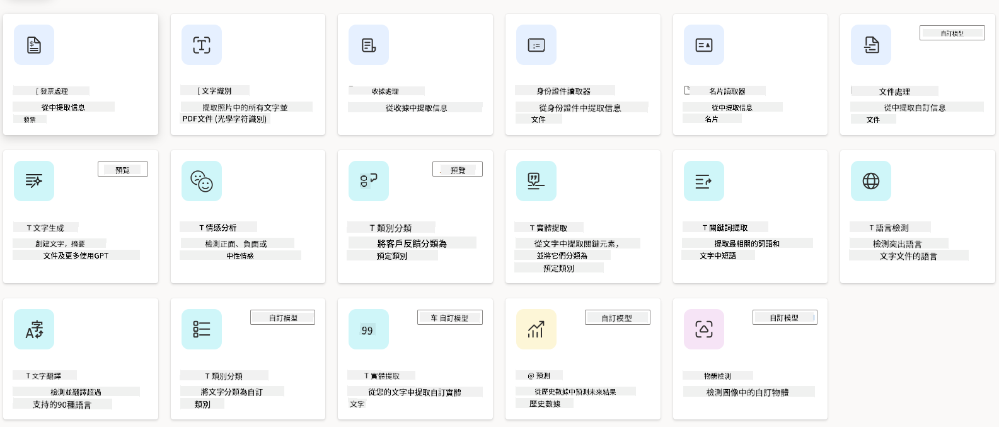
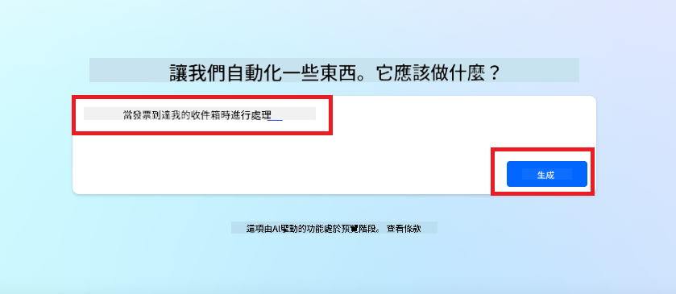
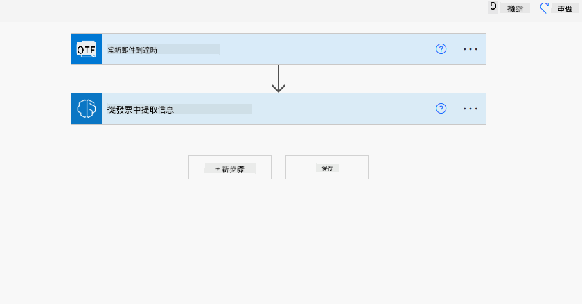
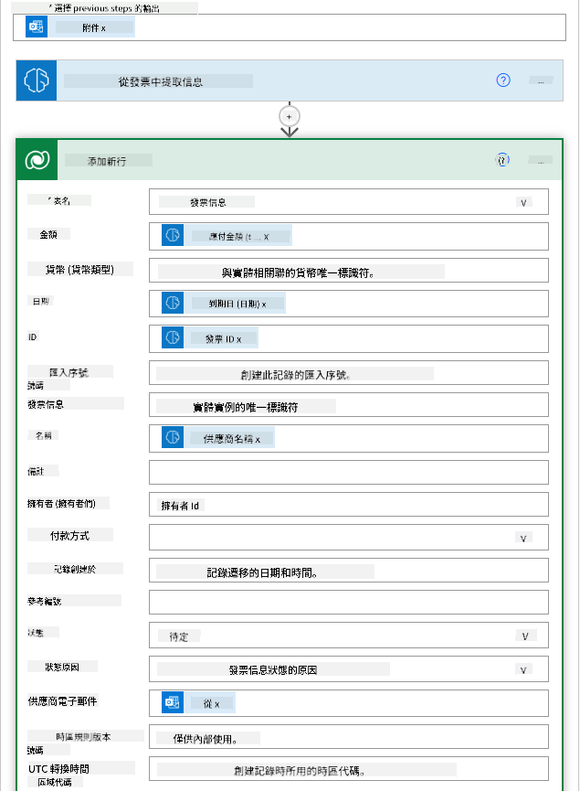
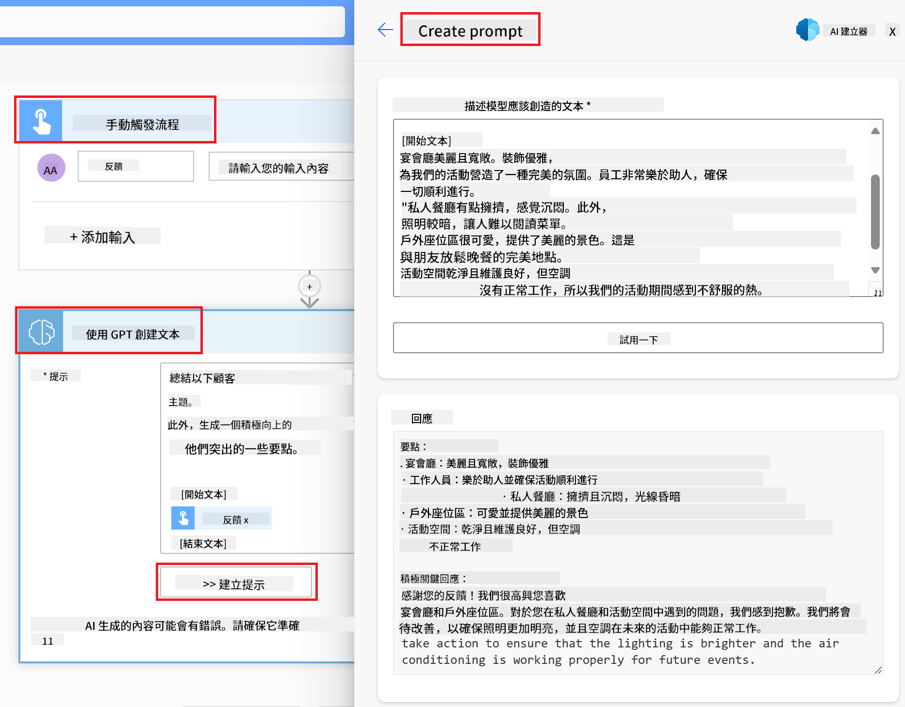

<!--
CO_OP_TRANSLATOR_METADATA:
{
  "original_hash": "f5ff3b6204a695a117d6f452403c95f7",
  "translation_date": "2025-06-25T18:04:58+00:00",
  "source_file": "10-building-low-code-ai-applications/README.md",
  "language_code": "mo"
}
-->
# 建立低代碼 AI 應用程式

## 介紹

現在我們已經學會如何建立影像生成應用程式，讓我們來談談低代碼。生成式 AI 可以應用於各種不同的領域，包括低代碼，但什麼是低代碼，並且我們如何將 AI 添加到其中？

透過使用低代碼開發平台，傳統開發者和非開發者都能更輕鬆地建立應用程式和解決方案。低代碼開發平台讓你能夠以很少或不需要撰寫代碼的方式來建立應用程式和解決方案。這是透過提供一個視覺化的開發環境實現的，讓你能夠拖放元件來建立應用程式和解決方案。這樣可以讓你更快地建立應用程式和解決方案，並且需要的資源更少。在本課程中，我們將深入探討如何使用低代碼以及如何透過 Power Platform 使用 AI 增強低代碼開發。

Power Platform 為組織提供了透過直觀的低代碼或無代碼環境讓團隊自行建立解決方案的機會。這種環境有助於簡化建立解決方案的過程。使用 Power Platform，解決方案可以在幾天或幾週內完成，而不是幾個月或幾年。Power Platform 由五個主要產品組成：Power Apps、Power Automate、Power BI、Power Pages 和 Copilot Studio。

本課程涵蓋：

- 在 Power Platform 中的生成式 AI 介紹
- Copilot 的介紹及其使用方法
- 使用生成式 AI 在 Power Platform 中建立應用程式和流程
- 使用 AI Builder 理解 Power Platform 中的 AI 模型

## 學習目標

在本課程結束時，你將能夠：

- 理解 Copilot 在 Power Platform 中的運作方式。

- 為我們的教育初創公司建立一個學生作業追蹤應用程式。

- 建立一個使用 AI 從發票中提取信息的發票處理流程。

- 在使用 GPT AI 模型創建文本時應用最佳實踐。

本課程中你將使用的工具和技術包括：

- **Power Apps**，用於學生作業追蹤應用程式，提供一個低代碼開發環境，用於建立應用程式以追蹤、管理和互動數據。

- **Dataverse**，用於存儲學生作業追蹤應用程式的數據，Dataverse 將提供一個低代碼數據平台來存儲應用程式的數據。

- **Power Automate**，用於發票處理流程，提供一個低代碼開發環境，用於建立自動化發票處理過程的工作流程。

- **AI Builder**，用於發票處理 AI 模型，使用預建的 AI 模型來處理我們初創公司的發票。

## Power Platform 中的生成式 AI

增強低代碼開發和應用程式的生成式 AI 是 Power Platform 的一個關鍵關注領域。目標是讓每個人都能建立 AI 驅動的應用程式、網站、儀表板並自動化流程，而不需要任何數據科學專業知識。這一目標是透過將生成式 AI 以 Copilot 和 AI Builder 的形式整合到 Power Platform 的低代碼開發體驗中實現的。

### 這是如何運作的？

Copilot 是一個 AI 助手，讓你能夠透過使用自然語言描述你的需求來建立 Power Platform 解決方案。你可以例如指示你的 AI 助手說明應用程式將使用哪些欄位，然後它會建立應用程式和底層數據模型，或者你可以指定如何在 Power Automate 中設置一個流程。

你可以在應用程式畫面中使用 Copilot 驅動的功能，讓用戶透過對話互動來發掘洞察。

AI Builder 是 Power Platform 中提供的一個低代碼 AI 功能，讓你能夠使用 AI 模型來幫助你自動化流程和預測結果。使用 AI Builder，你可以將 AI 引入到連接到 Dataverse 或各種雲端數據來源（如 SharePoint、OneDrive 或 Azure）的應用程式和流程中。

Copilot 可在所有 Power Platform 產品中使用：Power Apps、Power Automate、Power BI、Power Pages 和 Power Virtual Agents。AI Builder 可在 Power Apps 和 Power Automate 中使用。在本課程中，我們將重點介紹如何在 Power Apps 和 Power Automate 中使用 Copilot 和 AI Builder 為我們的教育初創公司建立解決方案。

### Power Apps 中的 Copilot

作為 Power Platform 的一部分，Power Apps 提供了一個低代碼開發環境，用於建立應用程式以追蹤、管理和互動數據。它是一套應用程式開發服務，具有可擴展的數據平台，並能夠連接到雲端服務和內部部署數據。Power Apps 允許你建立可在瀏覽器、平板電腦和手機上運行的應用程式，並可以與同事共享。Power Apps 透過簡單的介面讓用戶進入應用程式開發，使每個商業用戶或專業開發者都能建立自定義應用程式。應用程式開發體驗也透過 Copilot 的生成式 AI 得到增強。

Power Apps 中的 Copilot AI 助手功能讓你能夠描述你需要什麼樣的應用程式以及你希望應用程式追蹤、收集或顯示哪些信息。Copilot 會根據你的描述生成一個響應式 Canvas 應用程式。然後你可以自定義應用程式以滿足你的需求。AI Copilot 還會生成並建議一個 Dataverse 表格，包含你需要存儲的數據欄位以及一些示例數據。我們將在本課程稍後討論 Dataverse 是什麼以及如何在 Power Apps 中使用它。然後你可以使用 AI Copilot 助手功能透過對話步驟自定義表格。這一功能可從 Power Apps 主畫面中輕鬆獲得。

### Power Automate 中的 Copilot

作為 Power Platform 的一部分，Power Automate 讓用戶能夠在應用程式和服務之間創建自動化工作流程。它有助於自動化重複的業務流程，如通信、數據收集和決策批准。其簡單的介面允許各種技術能力的用戶（從初學者到經驗豐富的開發者）自動化工作任務。工作流程開發體驗也透過 Copilot 的生成式 AI 得到增強。

Power Automate 中的 Copilot AI 助手功能讓你能夠描述你需要什麼樣的流程以及你希望流程執行哪些操作。Copilot 會根據你的描述生成一個流程。然後你可以自定義流程以滿足你的需求。AI Copilot 還會生成並建議你需要執行的自動化任務的操作。我們將在本課程稍後探討什麼是流程以及如何在 Power Automate 中使用它們。然後你可以使用 AI Copilot 助手功能透過對話步驟自定義操作。這一功能可從 Power Automate 主畫面中輕鬆獲得。

## 作業：使用 Copilot 管理我們初創公司的學生作業和發票

我們的初創公司為學生提供線上課程。初創公司發展迅速，現在難以跟上課程的需求。初創公司聘請了你作為 Power Platform 開發者，幫助他們建立一個低代碼解決方案，以幫助他們管理學生作業和發票。他們的解決方案應能幫助他們透過應用程式追蹤和管理學生作業，並透過工作流程自動化發票處理過程。你被要求使用生成式 AI 開發該解決方案。

當你開始使用 Copilot 時，你可以使用 [Power Platform Copilot Prompt Library](https://github.com/pnp/powerplatform-prompts?WT.mc_id=academic-109639-somelezediko) 來開始使用提示。此庫包含一個提示列表，你可以使用它們來建立應用程式和流程與 Copilot。你也可以使用庫中的提示來獲得如何向 Copilot 描述你的需求的想法。

### 為我們的初創公司建立一個學生作業追蹤應用程式

我們初創公司的教育工作者一直在努力追蹤學生作業。他們一直使用電子表格來追蹤作業，但隨著學生人數的增加，這變得難以管理。他們要求你建立一個應用程式，幫助他們追蹤和管理學生作業。該應用程式應能讓他們新增新作業、查看作業、更新作業和刪除作業。該應用程式還應能讓教育工作者和學生查看已評分和未評分的作業。

你將使用 Copilot 在 Power Apps 中建立應用程式，按照以下步驟進行：

1. 瀏覽到 [Power Apps](https://make.powerapps.com?WT.mc_id=academic-105485-koreyst) 主畫面。

2. 使用主畫面上的文字區域描述你想要建立的應用程式。例如，**_我想建立一個應用程式來追蹤和管理學生作業_**。點擊 **發送** 按鈕將提示發送給 AI Copilot。

3. AI Copilot 會建議一個 Dataverse 表格，包含你需要存儲的數據欄位以及一些示例數據。然後你可以使用 AI Copilot 助手功能透過對話步驟自定義表格以滿足你的需求。

   > **重要**：Dataverse 是 Power Platform 的底層數據平台。它是一個低代碼數據平台，用於存儲應用程式的數據。它是一項完全管理的服務，安全地將數據存儲在 Microsoft Cloud 中，並在你的 Power Platform 環境中進行配置。它具有內建的數據治理功能，例如數據分類、數據血統、細粒度訪問控制等。你可以在[這裡](https://docs.microsoft.com/powerapps/maker/data-platform/data-platform-intro?WT.mc_id=academic-109639-somelezediko)了解更多關於 Dataverse 的信息。

4. 教育工作者希望向提交作業的學生發送電子郵件，以便讓他們了解作業的進展。你可以使用 Copilot 為表格新增一個欄位來存儲學生電子郵件。例如，你可以使用以下提示為表格新增一個欄位：**_我想新增一個欄位來存儲學生電子郵件_**。點擊 **發送** 按鈕將提示發送給 AI Copilot。

5. AI Copilot 會生成一個新欄位，然後你可以自定義該欄位以滿足你的需求。

6. 完成表格後，點擊 **建立應用程式** 按鈕以建立應用程式。

7. AI Copilot 會根據你的描述生成一個響應式 Canvas 應用程式。然後你可以自定義應用程式以滿足你的需求。

8. 為了讓教育工作者向學生發送電子郵件，你可以使用 Copilot 為應用程式新增一個畫面。例如，你可以使用以下提示為應用程式新增一個畫面：**_我想新增一個畫面來向學生發送電子郵件_**。點擊 **發送** 按鈕將提示發送給 AI Copilot。

9. AI Copilot 會生成一個新畫面，然後你可以自定義該畫面以滿足你的需求。

10. 完成應用程式後，點擊 **保存** 按鈕以保存應用程式。

11. 要與教育工作者共享應用程式，點擊 **共享** 按鈕，然後再次點擊 **共享** 按鈕。然後你可以通過輸入他們的電子郵件地址來與教育工作者共享應用程式。

> **你的作業**：你剛剛建立的應用程式是一個好的開始，但可以改進。使用電子郵件功能，教育工作者只能手動輸入電子郵件來向學生發送郵件。你能否使用 Copilot 建立一個自動化功能，使教育工作者能夠在學生提交作業時自動向他們發送郵件？你的提示是通過正確的提示，你可以在 Power Automate 中使用 Copilot 來建立這個功能。

### 為我們的初創公司建立一個發票信息表

我們初創公司的財務團隊一直在努力追蹤發票。他們一直使用電子表格來追蹤發票，但隨著發票數量的增加，這變得難以管理。他們要求你建立一個表格，幫助他們存儲、追蹤和管理收到的發票信息。該表格應用於建立一個自動化功能，將提取所有發票信息並存儲在表格中。該表格還應能讓財務團隊查看已支付和未支付的發票。

Power Platform 具有一個稱為 Dataverse 的底層數據平台，讓你能夠存儲應用程式和解決方案的數據。Dataverse 提供一個低代碼數據平台，用於存儲應用程式的數據。它是一項完全管理的服務，安全地將數據存儲在 Microsoft Cloud 中，並在你的 Power Platform 環境中進行配置。它具有內建的數據治理功能，例如數據分類、數據血統、細粒度訪問控制等。你可以在[這裡](https://docs.microsoft.com/powerapps/maker/data-platform/data-platform-intro?WT.mc_id=academic-109639-somelezediko)了解更多。

為什麼我們的初創公司應該使用 Dataverse？Dataverse 中的標準和自定義表格為你的數據提供了一個安全的雲端存儲選項。表格讓你可以存儲不同類型的數據，類似於你在單個 Excel 工作簿中使用多個工作表。你可以使用表格來存儲特定於你的組織或業務需求的數據。我們的初創公司使用 Dataverse 的一些好處包括但不限於：

- **易於管理**：元數據和數據都存儲在雲端，因此你不必擔心它們的存儲或管理細節。你可以專注於建立你的應用程式和解決方案。

- **安全**：Dataverse 為你的數據提供了一個安全的雲端存儲選項。你可以控制誰可以訪問表格中的數據以及他們如何使用基於角色的安全性訪問數據。

- **豐富的元數據**：數據類型和關係可直接在 Power Apps 中使用

- **邏輯和驗證**：你可以使用業務規則、計算欄位和驗證規則來強制執行業務邏輯並保持數據準確性。

現在你已經了解 Dataverse 是什麼以及為什麼應該使用它，讓我們來看看如何使用 Copilot 在 Dataverse 中建立一個表格來滿足我們財務團隊的需求。

> **注意**：你將在下一節中使用此表格來建立一個自動化功能，將提取所有發票信息並存儲在表格中。
要使用 Copilot 在 Dataverse 中建立一個表格，請按照以下步驟進行： 1. 瀏覽到 [Power Apps](https://make.powerapps.com?WT.mc_id=academic-105485-koreyst) 主畫面。 2. 在左側導航欄中，選擇 **表格**，然後點擊 **描述新表格**。 3. 在 **描述新表格** 畫面上，使用文字區域描述你想要建立的表格。例如，**_我想建立一個表格來存儲發票信息_**。點擊 **發送** 按鈕將提示發送給 AI Copilot。 4. AI Copilot 會建議一個 Dataverse 表格，包含你需要存儲的數據欄位以及一些示例數據。然後你可以使用 AI Copilot 助手功能透過對話步驟自定義表格以滿足你的需求。 5. 財務團隊希望向供應商發送電子郵件，以更新其發票的當前狀態。你可以使用 Copilot 為表格新增一個欄位來存儲供應商電子郵件。例如，你可以使用以下提示為表格新增一個欄位：**_我想新增一個欄位來存儲供應商電子郵件_**。點擊 **發送** 按鈕將提示發送給 AI Copilot。 6. AI Copilot 會生成一個新欄位，
一個文本。- **情感分析**：此模型檢測文本中的正面、負面、中性或混合情感。- **名片讀取器**：此模型從名片中提取信息。- **文本識別**：此模型從圖像中提取文本。- **物體檢測**：此模型檢測並提取圖像中的物體。- **文件處理**：此模型從表單中提取信息。- **發票處理**：此模型從發票中提取信息。通過自定義 AI 模型，您可以將自己的模型引入 AI Builder，使其能像任何 AI Builder 自定義模型一樣運行，允許您使用自己的數據來訓練模型。您可以使用這些模型在 Power Apps 和 Power Automate 中自動化流程並預測結果。使用自有模型時會有一些限制。閱讀更多這些[限制](https://learn.microsoft.com/ai-builder/byo-model#limitations?WT.mc_id=academic-105485-koreyst)。 

## 作業 #2 - 為我們的初創公司建立發票處理流程

財務團隊在處理發票時遇到了困難。他們一直使用電子表格來跟踪發票，但隨著發票數量的增加，這變得難以管理。他們要求您構建一個工作流程，幫助他們使用 AI 處理發票。該工作流程應使他們能夠從發票中提取信息並將信息存儲在 Dataverse 表中。工作流程還應使他們能夠將提取的信息通過電子郵件發送給財務團隊。

現在您知道什麼是 AI Builder 以及為什麼應該使用它，讓我們看看如何使用 AI Builder 中的發票處理 AI 模型（我們之前介紹過）來構建一個幫助財務團隊處理發票的工作流程。

要構建一個幫助財務團隊使用 AI Builder 中的發票處理 AI 模型處理發票的工作流程，請按照以下步驟操作：

1. 進入 [Power Automate](https://make.powerautomate.com?WT.mc_id=academic-105485-koreyst) 主頁。
2. 使用主頁上的文本區域描述您想要構建的工作流程。例如，**_當發票到達我的郵箱時處理它_**。點擊 **發送** 按鈕將提示發送給 AI Copilot。 
3. AI Copilot 會建議您需要執行的操作以自動化您想要的任務。您可以點擊 **下一步** 按鈕來進行下一步。
4. 在下一步中，Power Automate 會提示您設置流所需的連接。完成後，點擊 **創建流** 按鈕來創建流。
5. AI Copilot 會生成一個流，然後您可以自定義該流以滿足您的需求。
6. 更新流的觸發器，將 **文件夾** 設置為存儲發票的文件夾。例如，您可以將文件夾設置為 **收件箱**。點擊 **顯示高級選項**，並將 **僅限附件** 設置為 **是**。這將確保流僅在收到帶附件的電子郵件時運行。
7. 從流中移除以下操作：**HTML 到文本**、**撰寫**、**撰寫 2**、**撰寫 3** 和 **撰寫 4**，因為您將不會使用它們。
8. 從流中移除 **條件** 操作，因為您將不會使用它。它應該看起來像以下截圖： 
9. 點擊 **添加操作** 按鈕並搜索 **Dataverse**。選擇 **添加新行** 操作。
10. 在 **從發票中提取信息** 操作中，更新 **發票文件** 指向電子郵件中的 **附件內容**。這將確保流從發票附件中提取信息。
11. 選擇您之前創建的 **表**。例如，您可以選擇 **發票信息** 表。從之前的操作中選擇動態內容來填充以下字段：
    - ID
    - 金額
    - 日期
    - 名稱
    - 狀態
    - 將 **狀態** 設置為 **待處理**。
    - 供應商電子郵件
    - 使用 **當新電子郵件到達時** 觸發器中的 **發件人** 動態內容。 
12. 完成流後，點擊 **保存** 按鈕來保存流。然後您可以通過將帶有發票的電子郵件發送到您在觸發器中指定的文件夾來測試流。

> **您的作業**：您剛剛構建的流是一個良好的開始，現在您需要思考如何構建一個自動化，使我們的財務團隊能夠向供應商發送電子郵件，告知他們發票的當前狀態。提示：流必須在發票狀態改變時運行。

## 在 Power Automate 中使用文本生成 AI 模型

AI Builder 中的 GPT AI 模型創建文本功能使您能夠根據提示生成文本，並由 Microsoft Azure OpenAI 服務提供支持。通過這一功能，您可以將 GPT（生成預訓練轉換器）技術整合到您的應用和流程中，以構建各種自動化流程和深具洞察力的應用。

GPT 模型經過大量數據的廣泛訓練，使它們在提供提示時能夠生成與人類語言非常相似的文本。當與工作流程自動化集成時，像 GPT 這樣的 AI 模型可以被利用來簡化和自動化多種任務。

例如，您可以構建流程自動生成各種用例的文本，如：電子郵件草稿、產品描述等。您還可以使用該模型為各種應用生成文本，如聊天機器人和客戶服務應用，使客戶服務代理能夠有效且高效地回應客戶查詢。

要了解如何在 Power Automate 中使用此 AI 模型，請參閱 [使用 AI Builder 和 GPT 增加智能](https://learn.microsoft.com/training/modules/ai-builder-text-generation/?WT.mc_id=academic-109639-somelezediko) 模塊。

## 做得好！繼續學習

完成本課後，查看我們的 [生成式 AI 學習合集](https://aka.ms/genai-collection?WT.mc_id=academic-105485-koreyst)，繼續提升您的生成式 AI 知識！

前往第 11 課，我們將探討如何 [與功能調用集成生成式 AI](../11-integrating-with-function-calling/README.md?WT.mc_id=academic-105485-koreyst)！

**免責聲明**：
此文件是使用 AI 翻譯服務 [Co-op Translator](https://github.com/Azure/co-op-translator) 翻譯的。我們努力追求準確性，但請注意，自動翻譯可能包含錯誤或不準確之處。應將原始語言的文件視為權威來源。對於關鍵信息，建議尋求專業人工翻譯。我們對因使用此翻譯而產生的任何誤解或誤釋不承擔責任。