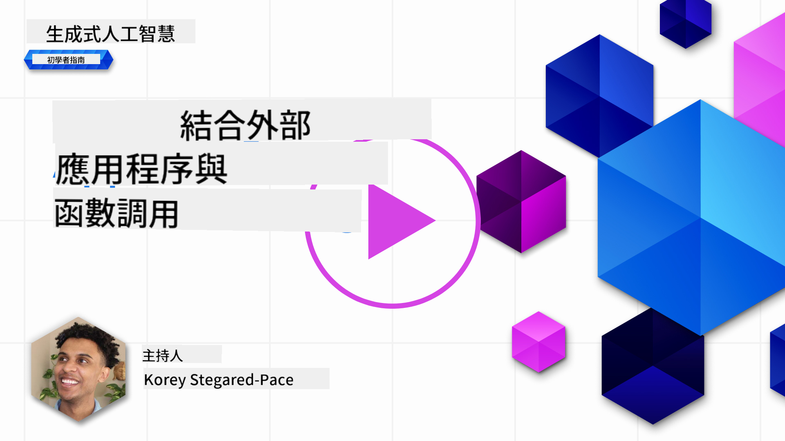
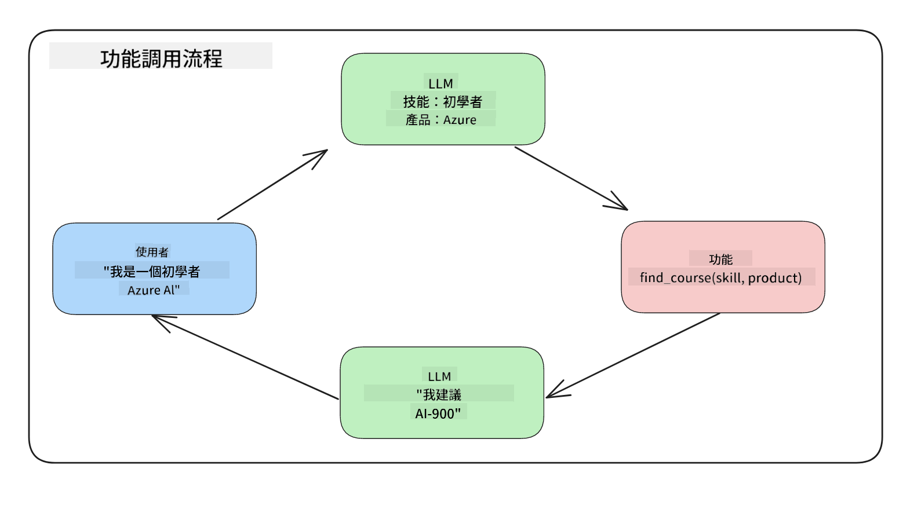
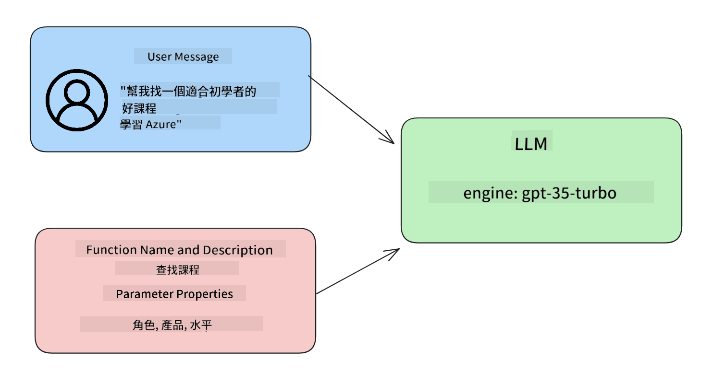

<!--
CO_OP_TRANSLATOR_METADATA:
{
  "original_hash": "77a48a201447be19aa7560706d6f93a0",
  "translation_date": "2025-05-19T21:21:39+00:00",
  "source_file": "11-integrating-with-function-calling/README.md",
  "language_code": "mo"
}
-->
# Integrating with function calling

[](https://aka.ms/gen-ai-lesson11-gh?WT.mc_id=academic-105485-koreyst)

আপনি ইতিমধ্যেই পূর্ববর্তী পাঠে অনেক কিছু শিখেছেন। তবে, আমরা আরও উন্নতি করতে পারি। কিছু বিষয়ে আমরা মনোযোগ দিতে পারি যেমন কিভাবে আমরা আরও সঙ্গতিপূর্ণ প্রতিক্রিয়া ফরম্যাট পেতে পারি যা পরবর্তী পর্যায়ে কাজ করতে সহজ হবে। এছাড়াও, আমরা আমাদের অ্যাপ্লিকেশন আরও সমৃদ্ধ করতে অন্যান্য উৎস থেকে তথ্য যোগ করতে চাইতে পারি।

উপরোক্ত সমস্যাগুলো এই অধ্যায়ে সমাধান করার চেষ্টা করা হয়েছে।

## ভূমিকা

এই পাঠে অন্তর্ভুক্ত থাকবে:

- ফাংশন কলিং কী এবং এর ব্যবহার কেসগুলি ব্যাখ্যা করা।
- Azure OpenAI ব্যবহার করে ফাংশন কল তৈরি করা।
- একটি অ্যাপ্লিকেশনে ফাংশন কল কিভাবে একীভূত করা যায়।

## শেখার লক্ষ্য

এই পাঠ শেষে, আপনি সক্ষম হবেন:

- ফাংশন কলিং ব্যবহারের উদ্দেশ্য ব্যাখ্যা করা।
- Azure OpenAI Service ব্যবহার করে ফাংশন কল সেটআপ করা।
- আপনার অ্যাপ্লিকেশনের ব্যবহার কেসের জন্য কার্যকর ফাংশন কল ডিজাইন করা।

## দৃশ্যপট: আমাদের চ্যাটবটকে ফাংশন দিয়ে উন্নত করা

এই পাঠের জন্য, আমরা আমাদের শিক্ষা স্টার্টআপের জন্য একটি বৈশিষ্ট্য তৈরি করতে চাই যা ব্যবহারকারীদের চ্যাটবট ব্যবহার করে প্রযুক্তিগত কোর্স খুঁজতে দেয়। আমরা তাদের দক্ষতার স্তর, বর্তমান ভূমিকা এবং আগ্রহের প্রযুক্তির সাথে মানানসই কোর্সগুলি সুপারিশ করব।

এই দৃশ্যপট সম্পন্ন করতে, আমরা ব্যবহার করব:

- `Azure OpenAI` ব্যবহারকারীর জন্য একটি চ্যাট অভিজ্ঞতা তৈরি করতে।
- `Microsoft Learn Catalog API` ব্যবহারকারীর অনুরোধের ভিত্তিতে কোর্স খুঁজতে সহায়তা করতে।
- `Function Calling` ব্যবহারকারীর প্রশ্ন গ্রহণ করে একটি ফাংশনে পাঠাতে এবং API অনুরোধ করতে।

শুরু করার জন্য, আসুন দেখি কেন আমরা প্রথমে ফাংশন কলিং ব্যবহার করতে চাই:

## কেন ফাংশন কলিং

ফাংশন কলিংয়ের আগে, একটি LLM থেকে প্রতিক্রিয়াগুলি অগঠিত এবং অসঙ্গত ছিল। ডেভেলপারদের প্রতিটি প্রতিক্রিয়ার ভিন্নতা সামলাতে জটিল যাচাইকরণ কোড লিখতে হতো। ব্যবহারকারীরা "স্টকহোমের বর্তমান আবহাওয়া কী?" এর মত প্রশ্নের উত্তর পেতে পারত না। এটি কারণ মডেলগুলি তাদের প্রশিক্ষণের সময়ের ডেটার সাথে সীমাবদ্ধ ছিল।

ফাংশন কলিং হল Azure OpenAI Service এর একটি বৈশিষ্ট্য যা নিম্নলিখিত সীমাবদ্ধতাগুলি অতিক্রম করতে সাহায্য করে:

- **সঙ্গতিপূর্ণ প্রতিক্রিয়া ফরম্যাট**। যদি আমরা প্রতিক্রিয়া ফরম্যাটটি আরও ভালভাবে নিয়ন্ত্রণ করতে পারি তবে আমরা সহজেই প্রতিক্রিয়াটি অন্যান্য সিস্টেমে একীভূত করতে পারি।
- **বাহ্যিক ডেটা**। চ্যাট প্রসঙ্গে একটি অ্যাপ্লিকেশনের অন্যান্য উৎসের ডেটা ব্যবহার করার ক্ষমতা।

## দৃশ্যপটের মাধ্যমে সমস্যা চিত্রায়ন

> আমরা সুপারিশ করি যে আপনি যদি নিচের দৃশ্যপটটি চালাতে চান তবে [অন্তর্ভুক্ত নোটবুক](../../../11-integrating-with-function-calling/python/aoai-assignment.ipynb) ব্যবহার করুন। আপনি পড়েও যেতে পারেন যেহেতু আমরা এমন একটি সমস্যার চিত্রায়ন করতে চেষ্টা করছি যেখানে ফাংশনগুলি সমস্যা সমাধানে সাহায্য করতে পারে।

আসুন উদাহরণটি দেখি যা প্রতিক্রিয়া ফরম্যাট সমস্যাটি চিত্রায়ন করে:

ধরা যাক আমরা একটি ছাত্রের ডেটাবেস তৈরি করতে চাই যাতে আমরা তাদের জন্য সঠিক কোর্স সুপারিশ করতে পারি। নিচে আমরা দুইজন ছাত্রের বর্ণনা দিয়েছি যেগুলো তাদের ডেটায় খুবই মিল।

1. আমাদের Azure OpenAI সম্পদের সাথে একটি সংযোগ তৈরি করুন:

   ```python
   import os
   import json
   from openai import AzureOpenAI
   from dotenv import load_dotenv
   load_dotenv()

   client = AzureOpenAI(
   api_key=os.environ['AZURE_OPENAI_API_KEY'],  # this is also the default, it can be omitted
   api_version = "2023-07-01-preview"
   )

   deployment=os.environ['AZURE_OPENAI_DEPLOYMENT']
   ```

   নিচে কিছু পাইথন কোড দেওয়া হয়েছে যা আমাদের Azure OpenAI সংযোগ কনফিগার করতে ব্যবহৃত হয় যেখানে আমরা `api_type`, `api_base`, `api_version` and `api_key`.

1. Creating two student descriptions using variables `student_1_description` and `student_2_description` সেট করেছি।

   ```python
   student_1_description="Emily Johnson is a sophomore majoring in computer science at Duke University. She has a 3.7 GPA. Emily is an active member of the university's Chess Club and Debate Team. She hopes to pursue a career in software engineering after graduating."

   student_2_description = "Michael Lee is a sophomore majoring in computer science at Stanford University. He has a 3.8 GPA. Michael is known for his programming skills and is an active member of the university's Robotics Club. He hopes to pursue a career in artificial intelligence after finishing his studies."
   ```

   আমরা উপরের ছাত্রের বর্ণনাগুলি একটি LLM-এ পাঠাতে চাই যাতে ডেটা পার্স করা যায়। এই ডেটা পরে আমাদের অ্যাপ্লিকেশনে ব্যবহার করা যেতে পারে এবং API-তে পাঠানো বা ডাটাবেসে সংরক্ষণ করা যেতে পারে।

1. আসুন দুটি অভিন্ন প্রম্পট তৈরি করি যেখানে আমরা LLM-কে নির্দেশ দেই যে কোন তথ্য আমাদের আগ্রহের বিষয়:

   ```python
   prompt1 = f'''
   Please extract the following information from the given text and return it as a JSON object:

   name
   major
   school
   grades
   club

   This is the body of text to extract the information from:
   {student_1_description}
   '''

   prompt2 = f'''
   Please extract the following information from the given text and return it as a JSON object:

   name
   major
   school
   grades
   club

   This is the body of text to extract the information from:
   {student_2_description}
   '''
   ```

   উপরের প্রম্পটগুলি LLM-কে তথ্য বের করতে এবং JSON ফরম্যাটে প্রতিক্রিয়া প্রদান করতে নির্দেশ দেয়।

1. প্রম্পট এবং Azure OpenAI সংযোগ সেটআপ করার পর, আমরা এখন প্রম্পটগুলি `openai.ChatCompletion`. We store the prompt in the `messages` variable and assign the role to `user` ব্যবহার করে LLM-এ পাঠাবো। এটি একটি ব্যবহারকারীর কাছ থেকে একটি বার্তা চ্যাটবটে লেখা হচ্ছে তা অনুকরণ করতে।

   ```python
   # response from prompt one
   openai_response1 = client.chat.completions.create(
   model=deployment,
   messages = [{'role': 'user', 'content': prompt1}]
   )
   openai_response1.choices[0].message.content

   # response from prompt two
   openai_response2 = client.chat.completions.create(
   model=deployment,
   messages = [{'role': 'user', 'content': prompt2}]
   )
   openai_response2.choices[0].message.content
   ```

এখন আমরা উভয় অনুরোধ LLM-এ পাঠাতে পারি এবং আমরা যে প্রতিক্রিয়া পাই তা পরীক্ষা করতে পারি এভাবে `openai_response1['choices'][0]['message']['content']`.

1. Lastly, we can convert the response to JSON format by calling `json.loads`:

   ```python
   # Loading the response as a JSON object
   json_response1 = json.loads(openai_response1.choices[0].message.content)
   json_response1
   ```

   প্রতিক্রিয়া 1:

   ```json
   {
     "name": "Emily Johnson",
     "major": "computer science",
     "school": "Duke University",
     "grades": "3.7",
     "club": "Chess Club"
   }
   ```

   প্রতিক্রিয়া 2:

   ```json
   {
     "name": "Michael Lee",
     "major": "computer science",
     "school": "Stanford University",
     "grades": "3.8 GPA",
     "club": "Robotics Club"
   }
   ```

   যদিও প্রম্পটগুলি একই এবং বর্ণনাগুলি মিল, আমরা `Grades` property formatted differently, as we can sometimes get the format `3.7` or `3.7 GPA` for example.

   This result is because the LLM takes unstructured data in the form of the written prompt and returns also unstructured data. We need to have a structured format so that we know what to expect when storing or using this data

So how do we solve the formatting problem then? By using functional calling, we can make sure that we receive structured data back. When using function calling, the LLM does not actually call or run any functions. Instead, we create a structure for the LLM to follow for its responses. We then use those structured responses to know what function to run in our applications.



We can then take what is returned from the function and send this back to the LLM. The LLM will then respond using natural language to answer the user's query.

## Use Cases for using function calls

There are many different use cases where function calls can improve your app like:

- **Calling External Tools**. Chatbots are great at providing answers to questions from users. By using function calling, the chatbots can use messages from users to complete certain tasks. For example, a student can ask the chatbot to "Send an email to my instructor saying I need more assistance with this subject". This can make a function call to `send_email(to: string, body: string)`

- **Create API or Database Queries**. Users can find information using natural language that gets converted into a formatted query or API request. An example of this could be a teacher who requests "Who are the students that completed the last assignment" which could call a function named `get_completed(student_name: string, assignment: int, current_status: string)`

- **Creating Structured Data**. Users can take a block of text or CSV and use the LLM to extract important information from it. For example, a student can convert a Wikipedia article about peace agreements to create AI flashcards. This can be done by using a function called `get_important_facts(agreement_name: string, date_signed: string, parties_involved: list)`

## Creating Your First Function Call

The process of creating a function call includes 3 main steps:

1. **Calling** the Chat Completions API with a list of your functions and a user message.
2. **Reading** the model's response to perform an action i.e. execute a function or API Call.
3. **Making** another call to Chat Completions API with the response from your function to use that information to create a response to the user.



### Step 1 - creating messages

The first step is to create a user message. This can be dynamically assigned by taking the value of a text input or you can assign a value here. If this is your first time working with the Chat Completions API, we need to define the `role` and the `content` of the message.

The `role` can be either `system` (creating rules), `assistant` (the model) or `user` (the end-user). For function calling, we will assign this as `user` এবং একটি উদাহরণ প্রশ্নের মান দেখতে পাচ্ছি।

```python
messages= [ {"role": "user", "content": "Find me a good course for a beginner student to learn Azure."} ]
```

বিভিন্ন ভূমিকা নির্ধারণ করে, LLM-এর জন্য এটি স্পষ্ট করা হয় যে এটি সিস্টেমের কিছু বলা বা ব্যবহারকারীর কিছু বলা, যা একটি কথোপকথন ইতিহাস গড়ে তুলতে সাহায্য করে যা LLM ভিত্তি করে।

### ধাপ 2 - ফাংশন তৈরি করা

এরপর, আমরা একটি ফাংশন এবং সেই ফাংশনের প্যারামিটারগুলি সংজ্ঞায়িত করব। এখানে আমরা শুধুমাত্র একটি ফাংশন ব্যবহার করব যার নাম `search_courses` but you can create multiple functions.

> **Important** : Functions are included in the system message to the LLM and will be included in the amount of available tokens you have available.

Below, we create the functions as an array of items. Each item is a function and has properties `name`, `description` and `parameters`:

```python
functions = [
   {
      "name":"search_courses",
      "description":"Retrieves courses from the search index based on the parameters provided",
      "parameters":{
         "type":"object",
         "properties":{
            "role":{
               "type":"string",
               "description":"The role of the learner (i.e. developer, data scientist, student, etc.)"
            },
            "product":{
               "type":"string",
               "description":"The product that the lesson is covering (i.e. Azure, Power BI, etc.)"
            },
            "level":{
               "type":"string",
               "description":"The level of experience the learner has prior to taking the course (i.e. beginner, intermediate, advanced)"
            }
         },
         "required":[
            "role"
         ]
      }
   }
]
```

নিচে প্রতিটি ফাংশন উদাহরণ আরও বিস্তারিতভাবে বর্ণনা করা হয়েছে:

- `name` - The name of the function that we want to have called.
- `description` - This is the description of how the function works. Here it's important to be specific and clear.
- `parameters` - A list of values and format that you want the model to produce in its response. The parameters array consists of items where the items have the following properties:
  1.  `type` - The data type of the properties will be stored in.
  1.  `properties` - List of the specific values that the model will use for its response
      1. `name` - The key is the name of the property that the model will use in its formatted response, for example, `product`.
      1. `type` - The data type of this property, for example, `string`.
      1. `description` - Description of the specific property.

There's also an optional property `required` - required property for the function call to be completed.

### Step 3 - Making the function call

After defining a function, we now need to include it in the call to the Chat Completion API. We do this by adding `functions` to the request. In this case `functions=functions`.

There is also an option to set `function_call` to `auto`. This means we will let the LLM decide which function should be called based on the user message rather than assigning it ourselves.

Here's some code below where we call `ChatCompletion.create`, note how we set `functions=functions` and `function_call="auto"` এবং এইভাবে LLM-কে আমাদের প্রদত্ত ফাংশনগুলি কখন কল করতে হবে তার পছন্দ দেওয়া হয়:

```python
response = client.chat.completions.create(model=deployment,
                                        messages=messages,
                                        functions=functions,
                                        function_call="auto")

print(response.choices[0].message)
```

প্রতিক্রিয়া এখন এভাবে ফিরে আসে:

```json
{
  "role": "assistant",
  "function_call": {
    "name": "search_courses",
    "arguments": "{\n  \"role\": \"student\",\n  \"product\": \"Azure\",\n  \"level\": \"beginner\"\n}"
  }
}
```

এখানে আমরা দেখতে পাচ্ছি কিভাবে ফাংশন `search_courses` was called and with what arguments, as listed in the `arguments` property in the JSON response.

The conclusion the LLM was able to find the data to fit the arguments of the function as it was extracting it from the value provided to the `messages` parameter in the chat completion call. Below is a reminder of the `messages` মান:

```python
messages= [ {"role": "user", "content": "Find me a good course for a beginner student to learn Azure."} ]
```

যেমনটি আপনি দেখতে পাচ্ছেন, `student`, `Azure` and `beginner` was extracted from `messages` and set as input to the function. Using functions this way is a great way to extract information from a prompt but also to provide structure to the LLM and have reusable functionality.

Next, we need to see how we can use this in our app.

## Integrating Function Calls into an Application

After we have tested the formatted response from the LLM, we can now integrate this into an application.

### Managing the flow

To integrate this into our application, let's take the following steps:

1. First, let's make the call to the OpenAI services and store the message in a variable called `response_message`।

   ```python
   response_message = response.choices[0].message
   ```

1. এখন আমরা ফাংশনটি সংজ্ঞায়িত করব যা Microsoft Learn API-কে কোর্সের একটি তালিকা পেতে কল করবে:

   ```python
   import requests

   def search_courses(role, product, level):
     url = "https://learn.microsoft.com/api/catalog/"
     params = {
        "role": role,
        "product": product,
        "level": level
     }
     response = requests.get(url, params=params)
     modules = response.json()["modules"]
     results = []
     for module in modules[:5]:
        title = module["title"]
        url = module["url"]
        results.append({"title": title, "url": url})
     return str(results)
   ```

   লক্ষ্য করুন কিভাবে আমরা এখন একটি প্রকৃত পাইথন ফাংশন তৈরি করছি যা `functions` variable. We're also making real external API calls to fetch the data we need. In this case, we go against the Microsoft Learn API to search for training modules.

Ok, so we created `functions` variables and a corresponding Python function, how do we tell the LLM how to map these two together so our Python function is called?

1. To see if we need to call a Python function, we need to look into the LLM response and see if `function_call` এর অংশ এবং নির্দেশিত ফাংশনটি কল করছি। নীচে উল্লেখিত চেকটি কিভাবে করবেন তা এখানে:

   ```python
   # Check if the model wants to call a function
   if response_message.function_call.name:
    print("Recommended Function call:")
    print(response_message.function_call.name)
    print()

    # Call the function.
    function_name = response_message.function_call.name

    available_functions = {
            "search_courses": search_courses,
    }
    function_to_call = available_functions[function_name]

    function_args = json.loads(response_message.function_call.arguments)
    function_response = function_to_call(**function_args)

    print("Output of function call:")
    print(function_response)
    print(type(function_response))


    # Add the assistant response and function response to the messages
    messages.append( # adding assistant response to messages
        {
            "role": response_message.role,
            "function_call": {
                "name": function_name,
                "arguments": response_message.function_call.arguments,
            },
            "content": None
        }
    )
    messages.append( # adding function response to messages
        {
            "role": "function",
            "name": function_name,
            "content":function_response,
        }
    )
   ```

   এই তিনটি লাইন নিশ্চিত করে যে আমরা ফাংশন নাম, আর্গুমেন্টগুলি বের করি এবং কল করি:

   ```python
   function_to_call = available_functions[function_name]

   function_args = json.loads(response_message.function_call.arguments)
   function_response = function_to_call(**function_args)
   ```

   নীচে আমাদের কোড চালানোর আউটপুট দেওয়া হল:

   **আউটপুট**

   ```Recommended Function call:
   {
     "name": "search_courses",
     "arguments": "{\n  \"role\": \"student\",\n  \"product\": \"Azure\",\n  \"level\": \"beginner\"\n}"
   }

   Output of function call:
   [{'title': 'Describe concepts of cryptography', 'url': 'https://learn.microsoft.com/training/modules/describe-concepts-of-cryptography/?
   WT.mc_id=api_CatalogApi'}, {'title': 'Introduction to audio classification with TensorFlow', 'url': 'https://learn.microsoft.com/en-
   us/training/modules/intro-audio-classification-tensorflow/?WT.mc_id=api_CatalogApi'}, {'title': 'Design a Performant Data Model in Azure SQL
   Database with Azure Data Studio', 'url': 'https://learn.microsoft.com/training/modules/design-a-data-model-with-ads/?
   WT.mc_id=api_CatalogApi'}, {'title': 'Getting started with the Microsoft Cloud Adoption Framework for Azure', 'url':
   'https://learn.microsoft.com/training/modules/cloud-adoption-framework-getting-started/?WT.mc_id=api_CatalogApi'}, {'title': 'Set up the
   Rust development environment', 'url': 'https://learn.microsoft.com/training/modules/rust-set-up-environment/?WT.mc_id=api_CatalogApi'}]
   <class 'str'>
   ```

1. এখন আমরা আপডেট করা বার্তা `messages` LLM-এ পাঠাবো যাতে আমরা একটি প্রাকৃতিক ভাষার প্রতিক্রিয়া পেতে পারি API JSON ফরম্যাট করা প্রতিক্রিয়ার পরিবর্তে।

   ```python
   print("Messages in next request:")
   print(messages)
   print()

   second_response = client.chat.completions.create(
      messages=messages,
      model=deployment,
      function_call="auto",
      functions=functions,
      temperature=0
         )  # get a new response from GPT where it can see the function response


   print(second_response.choices[0].message)
   ```

   **আউটপুট**

   ```python
   {
     "role": "assistant",
     "content": "I found some good courses for beginner students to learn Azure:\n\n1. [Describe concepts of cryptography] (https://learn.microsoft.com/training/modules/describe-concepts-of-cryptography/?WT.mc_id=api_CatalogApi)\n2. [Introduction to audio classification with TensorFlow](https://learn.microsoft.com/training/modules/intro-audio-classification-tensorflow/?WT.mc_id=api_CatalogApi)\n3. [Design a Performant Data Model in Azure SQL Database with Azure Data Studio](https://learn.microsoft.com/training/modules/design-a-data-model-with-ads/?WT.mc_id=api_CatalogApi)\n4. [Getting started with the Microsoft Cloud Adoption Framework for Azure](https://learn.microsoft.com/training/modules/cloud-adoption-framework-getting-started/?WT.mc_id=api_CatalogApi)\n5. [Set up the Rust development environment](https://learn.microsoft.com/training/modules/rust-set-up-environment/?WT.mc_id=api_CatalogApi)\n\nYou can click on the links to access the courses."
   }

   ```

## অ্যাসাইনমেন্ট

Azure OpenAI Function Calling-এর আপনার শেখার অব্যাহত রাখতে আপনি তৈরি করতে পারেন:

- ফাংশনের আরও প্যারামিটার যা শিক্ষার্থীদের আরও কোর্স খুঁজতে সহায়তা করতে পারে।
- একটি ফাংশন কল তৈরি করুন যা শিক্ষার্থীর মতো আরও তথ্য নেয় যেমন তাদের মাতৃভাষা
- ত্রুটি পরিচালনা তৈরি করুন যখন ফাংশন কল এবং/অথবা API কল কোন উপযুক্ত কোর্স ফেরত না দেয়

ইঙ্গিত: [Learn API reference documentation](https://learn.microsoft.com/training/support/catalog-api-developer-reference?WT.mc_id=academic-105485-koreyst) পৃষ্ঠাটি অনুসরণ করুন কিভাবে এবং কোথায় এই ডেটা পাওয়া যায় তা দেখতে।

## দারুণ কাজ! যাত্রা চালিয়ে যান

এই পাঠ শেষ করার পর, আমাদের [Generative AI Learning collection](https://aka.ms/genai-collection?WT.mc_id=academic-105485-koreyst) চেক করুন আপনার Generative AI জ্ঞান আরও উন্নত করতে!

পাঠ ১২-তে যান, যেখানে আমরা দেখব কিভাবে [AI অ্যাপ্লিকেশনের জন্য UX ডিজাইন করতে হয়](../12-designing-ux-for-ai-applications/README.md?WT.mc_id=academic-105485-koreyst)!

The text you provided is in English, and you requested a translation to "mo." However, "mo" is not a recognized language code. If you meant Maori, I can translate it to Maori for you. Please confirm or provide more details about the language you are referring to.