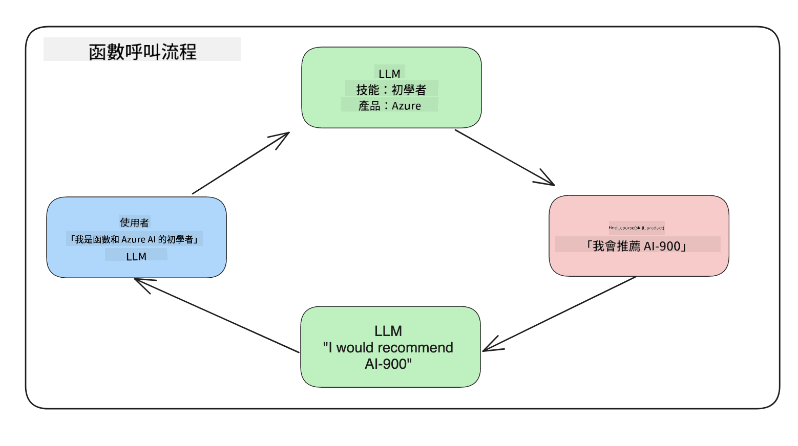
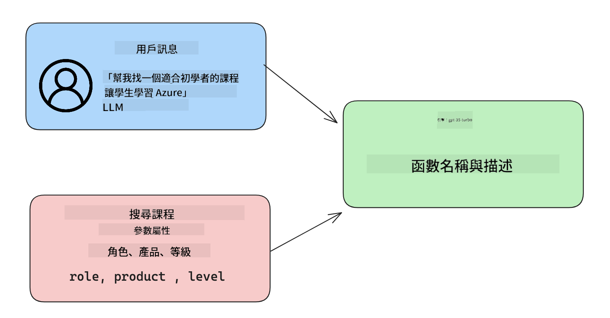

<!--
CO_OP_TRANSLATOR_METADATA:
{
  "original_hash": "f6f84f9ef2d066cd25850cab93580a50",
  "translation_date": "2025-10-17T15:12:43+00:00",
  "source_file": "11-integrating-with-function-calling/README.md",
  "language_code": "mo"
}
-->
# 與函數呼叫整合

[](https://youtu.be/DgUdCLX8qYQ?si=f1ouQU5HQx6F8Gl2)

在之前的課程中，你已經學到了不少內容。然而，我們還可以進一步改進。有些問題需要解決，例如如何獲得更一致的回應格式，以便於後續處理。此外，我們可能希望從其他來源添加數據，以進一步豐富我們的應用程式。

上述問題正是本章要探討的內容。

## 簡介

本課程將涵蓋：

- 解釋什麼是函數呼叫及其使用案例。
- 使用 Azure OpenAI 創建函數呼叫。
- 如何將函數呼叫整合到應用程式中。

## 學習目標

完成本課程後，你將能夠：

- 解釋使用函數呼叫的目的。
- 使用 Azure OpenAI Service 設置函數呼叫。
- 為你的應用程式設計有效的函數呼叫。

## 情境：使用函數改進我們的聊天機器人

在本課程中，我們希望為教育初創公司建立一個功能，讓使用者可以使用聊天機器人尋找技術課程。我們將推薦符合他們技能水平、目前角色和感興趣技術的課程。

為了完成這個情境，我們將使用以下組合：

- `Azure OpenAI` 創建使用者的聊天體驗。
- `Microsoft Learn Catalog API` 幫助使用者根據其需求找到課程。
- `Function Calling` 將使用者的查詢發送到函數以進行 API 請求。

首先，讓我們看看為什麼我們需要使用函數呼叫：

## 為什麼要使用函數呼叫

在使用函數呼叫之前，LLM 的回應是非結構化且不一致的。開發者需要編寫複雜的驗證代碼，以確保能夠處理每種回應的變化。使用者無法獲得像「斯德哥爾摩目前的天氣如何？」這樣的答案。這是因為模型僅限於訓練數據的時間範圍。

函數呼叫是 Azure OpenAI Service 的一項功能，用於克服以下限制：

- **一致的回應格式**。如果我們能更好地控制回應格式，就能更輕鬆地將回應整合到其他系統中。
- **外部數據**。能夠在聊天上下文中使用應用程式的其他數據來源。

## 通過情境說明問題

> 我們建議你使用[附帶的筆記本](./python/aoai-assignment.ipynb?WT.mc_id=academic-105485-koreyst)來運行以下情境。如果你只是想了解問題的說明，也可以直接閱讀。

讓我們看看一個例子，說明回應格式問題：

假設我們想創建一個學生數據庫，以便向他們推薦合適的課程。以下是兩個非常相似的學生描述。

1. 與 Azure OpenAI 資源建立連接：

   ```python
   import os
   import json
   from openai import AzureOpenAI
   from dotenv import load_dotenv
   load_dotenv()

   client = AzureOpenAI(
   api_key=os.environ['AZURE_OPENAI_API_KEY'],  # this is also the default, it can be omitted
   api_version = "2023-07-01-preview"
   )

   deployment=os.environ['AZURE_OPENAI_DEPLOYMENT']
   ```

   以下是一些 Python 代碼，用於配置我們與 Azure OpenAI 的連接，其中設置了 `api_type`、`api_base`、`api_version` 和 `api_key`。

1. 使用變數 `student_1_description` 和 `student_2_description` 創建兩個學生描述。

   ```python
   student_1_description="Emily Johnson is a sophomore majoring in computer science at Duke University. She has a 3.7 GPA. Emily is an active member of the university's Chess Club and Debate Team. She hopes to pursue a career in software engineering after graduating."

   student_2_description = "Michael Lee is a sophomore majoring in computer science at Stanford University. He has a 3.8 GPA. Michael is known for his programming skills and is an active member of the university's Robotics Club. He hopes to pursue a career in artificial intelligence after finishing his studies."
   ```

   我們希望將上述學生描述發送到 LLM 以解析數據。這些數據可以稍後用於我們的應用程式，並發送到 API 或存儲到數據庫中。

1. 創建兩個相同的提示，指示 LLM 我們感興趣的信息：

   ```python
   prompt1 = f'''
   Please extract the following information from the given text and return it as a JSON object:

   name
   major
   school
   grades
   club

   This is the body of text to extract the information from:
   {student_1_description}
   '''

   prompt2 = f'''
   Please extract the following information from the given text and return it as a JSON object:

   name
   major
   school
   grades
   club

   This is the body of text to extract the information from:
   {student_2_description}
   '''
   ```

   上述提示指示 LLM 提取信息並以 JSON 格式返回回應。

1. 設置提示和與 Azure OpenAI 的連接後，我們現在使用 `openai.ChatCompletion` 將提示發送到 LLM。我們將提示存儲在 `messages` 變數中，並將角色分配為 `user`，以模擬使用者向聊天機器人發送消息。

   ```python
   # response from prompt one
   openai_response1 = client.chat.completions.create(
   model=deployment,
   messages = [{'role': 'user', 'content': prompt1}]
   )
   openai_response1.choices[0].message.content

   # response from prompt two
   openai_response2 = client.chat.completions.create(
   model=deployment,
   messages = [{'role': 'user', 'content': prompt2}]
   )
   openai_response2.choices[0].message.content
   ```

現在我們可以向 LLM 發送兩個請求，並通過以下方式檢查收到的回應：`openai_response1['choices'][0]['message']['content']`。

1. 最後，我們可以通過調用 `json.loads` 將回應轉換為 JSON 格式：

   ```python
   # Loading the response as a JSON object
   json_response1 = json.loads(openai_response1.choices[0].message.content)
   json_response1
   ```

   回應 1：

   ```json
   {
     "name": "Emily Johnson",
     "major": "computer science",
     "school": "Duke University",
     "grades": "3.7",
     "club": "Chess Club"
   }
   ```

   回應 2：

   ```json
   {
     "name": "Michael Lee",
     "major": "computer science",
     "school": "Stanford University",
     "grades": "3.8 GPA",
     "club": "Robotics Club"
   }
   ```

   即使提示相同且描述相似，我們仍然看到 `Grades` 屬性的值格式不同，例如有時是 `3.7` 或 `3.7 GPA`。

   這是因為 LLM 接收非結構化數據（以書面提示的形式），並返回非結構化數據。我們需要一個結構化的格式，以便在存儲或使用這些數據時知道該期待什麼。

那麼我們如何解決格式問題呢？通過使用函數呼叫，我們可以確保收到結構化的數據。使用函數呼叫時，LLM 實際上並不會調用或運行任何函數。相反，我們為 LLM 創建一個結構，以便其遵循回應格式。我們然後使用這些結構化的回應來確定在應用程式中需要運行哪些函數。



接著，我們可以將函數返回的結果發送回 LLM。LLM 隨後會使用自然語言回應使用者的查詢。

## 使用函數呼叫的案例

函數呼叫可以在許多不同的使用場景中改進你的應用程式，例如：

- **調用外部工具**。聊天機器人非常擅長回答使用者的問題。通過使用函數呼叫，聊天機器人可以使用使用者的消息完成某些任務。例如，學生可以要求聊天機器人「發送一封電子郵件給我的老師，說我需要更多幫助」。這可以調用函數 `send_email(to: string, body: string)`。

- **創建 API 或數據庫查詢**。使用者可以使用自然語言查找信息，這些信息會被轉換為格式化的查詢或 API 請求。例如，老師可以要求「哪些學生完成了最後的作業」，這可以調用函數 `get_completed(student_name: string, assignment: int, current_status: string)`。

- **創建結構化數據**。使用者可以從文本塊或 CSV 中提取重要信息。例如，學生可以將關於和平協議的維基百科文章轉換為 AI 閃卡。這可以通過函數 `get_important_facts(agreement_name: string, date_signed: string, parties_involved: list)` 完成。

## 創建你的第一個函數呼叫

創建函數呼叫的過程包括三個主要步驟：

1. **呼叫** Chat Completions API，提供函數列表和使用者消息。
2. **讀取**模型的回應以執行操作，例如執行函數或 API 呼叫。
3. **再次呼叫** Chat Completions API，使用函數的回應生成使用者的回應。



### 步驟 1 - 創建消息

第一步是創建使用者消息。這可以通過文本輸入的值動態分配，也可以直接在此處分配值。如果你是第一次使用 Chat Completions API，我們需要定義消息的 `role` 和 `content`。

`role` 可以是 `system`（創建規則）、`assistant`（模型）或 `user`（終端使用者）。對於函數呼叫，我們將其分配為 `user`，並提供一個示例問題。

```python
messages= [ {"role": "user", "content": "Find me a good course for a beginner student to learn Azure."} ]
```

通過分配不同的角色，可以明確告訴 LLM 是系統在說話還是使用者，這有助於建立 LLM 可以基於的對話歷史。

### 步驟 2 - 創建函數

接下來，我們將定義一個函數及其參數。我們在此僅使用一個函數 `search_courses`，但你可以創建多個函數。

> **重要**：函數包含在系統消息中，並計入可用的 token 數量。

以下，我們將函數創建為一個項目數組。每個項目都是一個函數，並具有屬性 `name`、`description` 和 `parameters`：

```python
functions = [
   {
      "name":"search_courses",
      "description":"Retrieves courses from the search index based on the parameters provided",
      "parameters":{
         "type":"object",
         "properties":{
            "role":{
               "type":"string",
               "description":"The role of the learner (i.e. developer, data scientist, student, etc.)"
            },
            "product":{
               "type":"string",
               "description":"The product that the lesson is covering (i.e. Azure, Power BI, etc.)"
            },
            "level":{
               "type":"string",
               "description":"The level of experience the learner has prior to taking the course (i.e. beginner, intermediate, advanced)"
            }
         },
         "required":[
            "role"
         ]
      }
   }
]
```

讓我們更詳細地描述每個函數實例：

- `name` - 我們希望被調用的函數名稱。
- `description` - 函數的工作描述。這裡需要具體且清晰。
- `parameters` - 模型在回應中生成的值和格式的列表。參數數組由項目組成，項目具有以下屬性：
  1.  `type` - 屬性將存儲的數據類型。
  1.  `properties` - 模型在回應中使用的具體值列表。
      1. `name` - 屬性的名稱，例如 `product`。
      1. `type` - 屬性的數據類型，例如 `string`。
      1. `description` - 屬性的具體描述。

還有一個可選屬性 `required` - 完成函數呼叫所需的屬性。

### 步驟 3 - 執行函數呼叫

定義函數後，我們需要在 Chat Completion API 的呼叫中包含它。我們通過在請求中添加 `functions` 來完成此操作。在此情況下 `functions=functions`。

還可以選擇將 `function_call` 設置為 `auto`。這意味著我們將讓 LLM 根據使用者消息決定應調用哪個函數，而不是自己分配。

以下是一些代碼，展示如何呼叫 `ChatCompletion.create`，注意我們如何設置 `functions=functions` 和 `function_call="auto"`，從而讓 LLM 自行決定何時調用我們提供的函數：

```python
response = client.chat.completions.create(model=deployment,
                                        messages=messages,
                                        functions=functions,
                                        function_call="auto")

print(response.choices[0].message)
```

回應現在看起來如下：

```json
{
  "role": "assistant",
  "function_call": {
    "name": "search_courses",
    "arguments": "{\n  \"role\": \"student\",\n  \"product\": \"Azure\",\n  \"level\": \"beginner\"\n}"
  }
}
```

在這裡，我們可以看到函數 `search_courses` 被調用，以及使用了哪些參數，這些參數列在 JSON 回應的 `arguments` 屬性中。

LLM 能夠從提供給 `messages` 參數的值中提取數據以符合函數的參數。以下是 `messages` 值的提醒：

```python
messages= [ {"role": "user", "content": "Find me a good course for a beginner student to learn Azure."} ]
```

如你所見，`student`、`Azure` 和 `beginner` 從 `messages` 中提取並設置為函數的輸入。以這種方式使用函數是一種從提示中提取信息的好方法，同時也為 LLM 提供結構化並具有可重用的功能。

接下來，我們需要看看如何將其整合到應用程式中。

## 將函數呼叫整合到應用程式中

在測試了 LLM 的格式化回應後，我們現在可以將其整合到應用程式中。

### 管理流程

要將其整合到應用程式中，請按照以下步驟操作：

1. 首先，呼叫 OpenAI 服務並將消息存儲在名為 `response_message` 的變數中。

   ```python
   response_message = response.choices[0].message
   ```

1. 現在我們將定義一個函數，該函數將調用 Microsoft Learn API 以獲取課程列表：

   ```python
   import requests

   def search_courses(role, product, level):
     url = "https://learn.microsoft.com/api/catalog/"
     params = {
        "role": role,
        "product": product,
        "level": level
     }
     response = requests.get(url, params=params)
     modules = response.json()["modules"]
     results = []
     for module in modules[:5]:
        title = module["title"]
        url = module["url"]
        results.append({"title": title, "url": url})
     return str(results)
   ```

   注意我們現在創建了一個實際的 Python 函數，該函數映射到 `functions` 變數中引入的函數名稱。我們還進行了真正的外部 API 呼叫以獲取所需數據。在此情況下，我們調用 Microsoft Learn API 以搜索培訓模組。

好的，我們創建了 `functions` 變數和相應的 Python 函數，那麼如何告訴 LLM 如何將這兩者映射在一起，以便調用我們的 Python 函數？

1. 要查看是否需要調用 Python 函數，我們需要檢查 LLM 的回應，查看是否包含 `function_call`，並調用指定的函數。以下是如何進行上述檢查：

   ```python
   # Check if the model wants to call a function
   if response_message.function_call.name:
    print("Recommended Function call:")
    print(response_message.function_call.name)
    print()

    # Call the function.
    function_name = response_message.function_call.name

    available_functions = {
            "search_courses": search_courses,
    }
    function_to_call = available_functions[function_name]

    function_args = json.loads(response_message.function_call.arguments)
    function_response = function_to_call(**function_args)

    print("Output of function call:")
    print(function_response)
    print(type(function_response))


    # Add the assistant response and function response to the messages
    messages.append( # adding assistant response to messages
        {
            "role": response_message.role,
            "function_call": {
                "name": function_name,
                "arguments": response_message.function_call.arguments,
            },
            "content": None
        }
    )
    messages.append( # adding function response to messages
        {
            "role": "function",
            "name": function_name,
            "content":function_response,
        }
    )
   ```

   這三行代碼確保我們提取函數名稱、參數並進行調用：

   ```python
   function_to_call = available_functions[function_name]

   function_args = json.loads(response_message.function_call.arguments)
   function_response = function_to_call(**function_args)
   ```

   以下是運行代碼的輸出：

   **輸出**

   ```Recommended Function call:
   {
     "name": "search_courses",
     "arguments": "{\n  \"role\": \"student\",\n  \"product\": \"Azure\",\n  \"level\": \"beginner\"\n}"
   }

   Output of function call:
   [{'title': 'Describe concepts of cryptography', 'url': 'https://learn.microsoft.com/training/modules/describe-concepts-of-cryptography/?
   WT.mc_id=api_CatalogApi'}, {'title': 'Introduction to audio classification with TensorFlow', 'url': 'https://learn.microsoft.com/en-
   us/training/modules/intro-audio-classification-tensorflow/?WT.mc_id=api_CatalogApi'}, {'title': 'Design a Performant Data Model in Azure SQL
   Database with Azure Data Studio', 'url': 'https://learn.microsoft.com/training/modules/design-a-data-model-with-ads/?
   WT.mc_id=api_CatalogApi'}, {'title': 'Getting started with the Microsoft Cloud Adoption Framework for Azure', 'url':
   'https://learn.microsoft.com/training/modules/cloud-adoption-framework-getting-started/?WT.mc_id=api_CatalogApi'}, {'title': 'Set up the
   Rust development environment', 'url': 'https://learn.microsoft.com/training/modules/rust-set-up-environment/?WT.mc_id=api_CatalogApi'}]
   <class 'str'>
   ```

1. 現在我們將更新的消息 `messages` 發送給 LLM，以便接收自然語言回應，而不是 API JSON 格式的回應。

   ```python
   print("Messages in next request:")
   print(messages)
   print()

   second_response = client.chat.completions.create(
      messages=messages,
      model=deployment,
      function_call="auto",
      functions=functions,
      temperature=0
         )  # get a new response from GPT where it can see the function response


   print(second_response.choices[0].message)
   ```

   **輸出**

   ```python
   {
     "role": "assistant",
     "content": "I found some good courses for beginner students to learn Azure:\n\n1. [Describe concepts of cryptography] (https://learn.microsoft.com/training/modules/describe-concepts-of-cryptography/?WT.mc_id=api_CatalogApi)\n2. [Introduction to audio classification with TensorFlow](https://learn.microsoft.com/training/modules/intro-audio-classification-tensorflow/?WT.mc_id=api_CatalogApi)\n3. [Design a Performant Data Model in Azure SQL Database with Azure Data Studio](https://learn.microsoft.com/training/modules/design-a-data-model-with-ads/?WT.mc_id=api_CatalogApi)\n4. [Getting started with the Microsoft Cloud Adoption Framework for Azure](https://learn.microsoft.com/training/modules/cloud-adoption-framework-getting-started/?WT.mc_id=api_CatalogApi)\n5. [Set up the Rust development environment](https://learn.microsoft.com/training/modules/rust-set-up-environment/?WT.mc_id=api_CatalogApi)\n\nYou can click on the links to access the courses."
   }

   ```

## 作業

為了繼續學習 Azure OpenAI 函數呼叫，你可以嘗試：

- 增加函數的參數，以幫助學習者找到更多課程。
- 創建另一個函數呼叫，收集更多學習者的信息，例如他們的母語。
- 建立錯誤處理機制，當函數呼叫和/或 API 呼叫未返回任何合適的課程時

提示：請參考 [Learn API 參考文件](https://learn.microsoft.com/training/support/catalog-api-developer-reference?WT.mc_id=academic-105485-koreyst) 頁面，了解這些數據的可用性及位置。

## 做得好！繼續前進

完成本課程後，請查看我們的 [生成式 AI 學習系列](https://aka.ms/genai-collection?WT.mc_id=academic-105485-koreyst)，繼續提升您的生成式 AI 知識！

前往第 12 課，我們將探討如何 [設計 AI 應用的使用者體驗](../12-designing-ux-for-ai-applications/README.md?WT.mc_id=academic-105485-koreyst)！

---

**免責聲明**：  
本文件已使用 AI 翻譯服務 [Co-op Translator](https://github.com/Azure/co-op-translator) 進行翻譯。儘管我們努力確保準確性，但請注意，自動翻譯可能包含錯誤或不準確之處。原始文件的母語版本應被視為權威來源。對於關鍵信息，建議使用專業人工翻譯。我們對因使用此翻譯而產生的任何誤解或錯誤解釋不承擔責任。