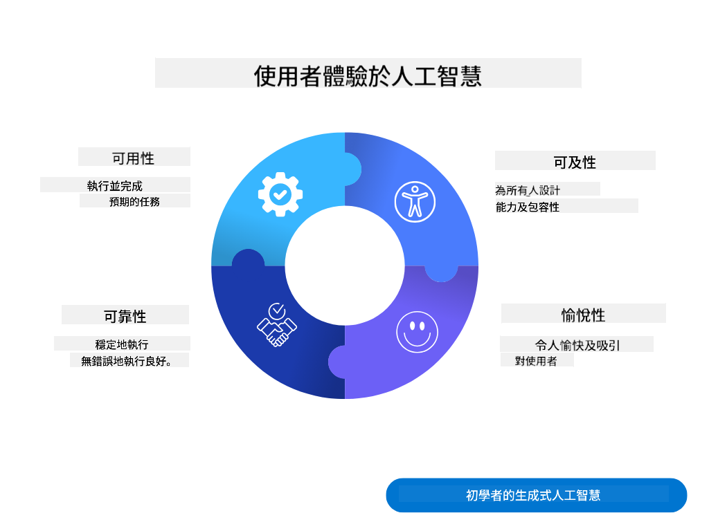
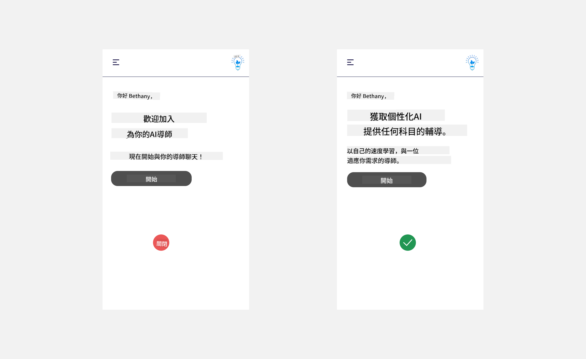
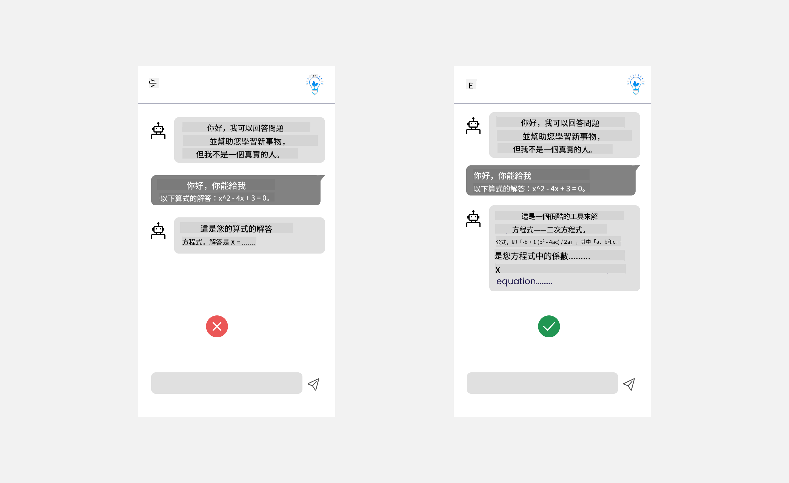
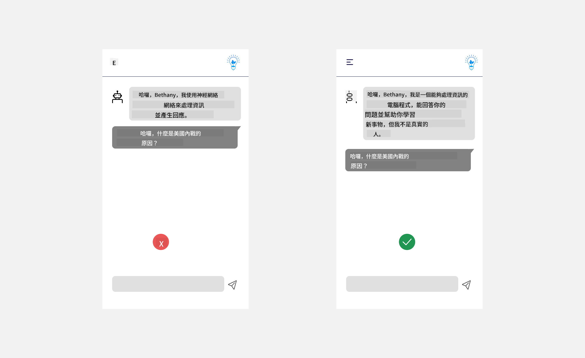
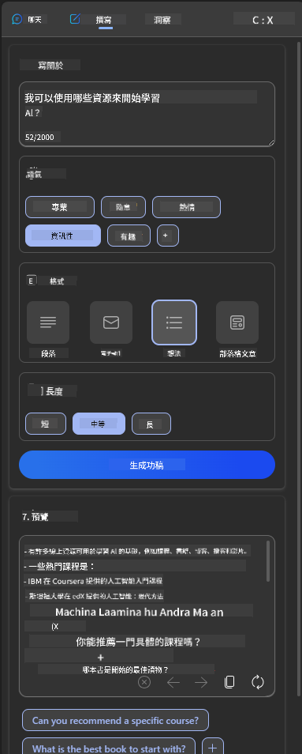
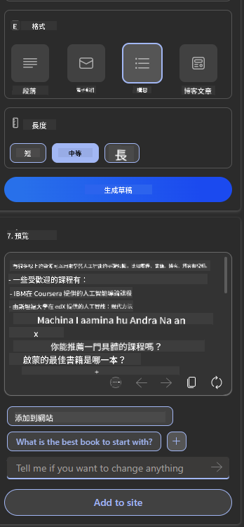
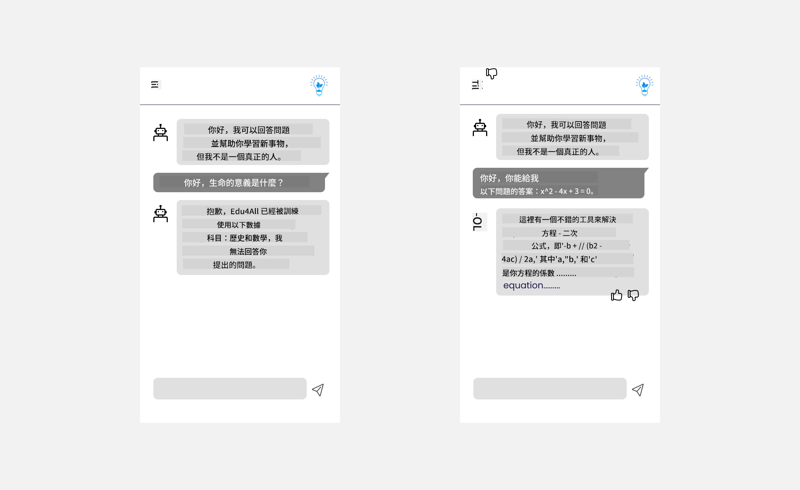

<!--
CO_OP_TRANSLATOR_METADATA:
{
  "original_hash": "ec385b41ee50579025d50cc03bfb3a25",
  "translation_date": "2025-06-25T20:12:34+00:00",
  "source_file": "12-designing-ux-for-ai-applications/README.md",
  "language_code": "mo"
}
-->
# 設計人工智慧應用的使用者體驗

使用者體驗是構建應用程式的一個非常重要的方面。使用者需要能夠有效地使用您的應用程式來執行任務。有效率是一回事，但您還需要設計應用程式，使每個人都能使用，讓它變得_可及_。本章將專注於這個領域，希望您最終能設計出人們能夠並且願意使用的應用程式。

## 介紹

使用者體驗是使用者如何與特定產品或服務互動和使用，不論是系統、工具或設計。在開發人工智慧應用程式時，開發者不僅要確保使用者體驗有效，還要確保其道德性。在本課程中，我們將探討如何構建滿足使用者需求的人工智慧（AI）應用程式。

本課程將涵蓋以下領域：

- 使用者體驗介紹及理解使用者需求
- 設計人工智慧應用以促進信任和透明度
- 設計人工智慧應用以促進合作和反饋

## 學習目標

完成本課程後，您將能夠：

- 理解如何構建滿足使用者需求的人工智慧應用程式。
- 設計促進信任和合作的人工智慧應用程式。

### 前置條件

花些時間閱讀更多關於[使用者體驗和設計思維](https://learn.microsoft.com/training/modules/ux-design?WT.mc_id=academic-105485-koreyst)。

## 使用者體驗介紹及理解使用者需求

在我們虛構的教育初創公司中，我們有兩個主要使用者，教師和學生。這兩個使用者都有獨特的需求。以使用者為中心的設計優先考慮使用者，確保產品對其目標使用者而言是相關且有益的。

應用程式應該是**有用、可靠、可及且愉悅**的，以提供良好的使用者體驗。

### 可用性

有用意味著應用程式具有符合其預期目的的功能，例如自動化評分過程或生成複習用的抽認卡。自動化評分過程的應用程式應能根據預定義標準準確且有效地給學生的作業分數。同樣，生成複習抽認卡的應用程式應能根據其資料創建相關且多樣化的問題。

### 可靠性

可靠意味著應用程式能夠一致且無錯誤地執行其任務。然而，人工智慧就像人類一樣並不完美，可能容易出錯。應用程式可能會遇到需要人工干預或修正的錯誤或意外情況。您如何處理錯誤？在本課程的最後一部分，我們將探討人工智慧系統和應用程式如何設計以促進合作和反饋。

### 可及性

可及意味著擴展使用者體驗至各種能力的使用者，包括殘障人士，確保沒有人被排除在外。遵循可及性指南和原則，人工智慧解決方案變得更加包容、可用且對所有使用者都有益。

### 愉悅

愉悅意味著應用程式使用起來令人愉快。一個吸引人的使用者體驗可以對使用者產生積極影響，鼓勵他們回到應用程式並增加業務收入。

並非所有挑戰都能用人工智慧解決。人工智慧進入以增強您的使用者體驗，不論是自動化手動任務，或是個性化使用者體驗。

## 設計人工智慧應用以促進信任和透明度

在設計人工智慧應用程式時，建立信任至關重要。信任確保使用者相信應用程式能夠完成工作，穩定地交付結果且結果符合使用者的需求。這方面的風險是不信任和過度信任。不信任發生在使用者對人工智慧系統幾乎沒有或沒有信任，這會導致使用者拒絕您的應用程式。過度信任發生在使用者高估人工智慧系統的能力，導致使用者過度信任人工智慧系統。例如，在過度信任的情況下，教師可能不會仔細檢查某些試卷，以確保評分系統運行良好。這可能導致學生的成績不公平或不準確，或錯過反饋和改進的機會。

確保信任成為設計中心的兩種方法是可解釋性和控制。

### 可解釋性

當人工智慧幫助做出決策，例如將知識傳授給下一代時，教師和家長了解人工智慧決策的方式至關重要。這就是可解釋性 - 理解人工智慧應用程式如何做出決策。設計可解釋性包括添加人工智慧應用程式可以做什麼的例子細節。例如，系統可以使用：“使用人工智慧總結您的筆記以便於複習”，而不是“開始使用人工智慧教師”。

另一個例子是人工智慧如何使用使用者和個人資料。例如，具有學生角色的使用者可能根據其角色有一些限制。人工智慧可能無法揭示問題的答案，但可以幫助引導使用者思考如何解決問題。

可解釋性的最後一個關鍵部分是簡化解釋。學生和教師可能不是人工智慧專家，因此應用程式能做什麼或不能做什麼的解釋應該簡化並易於理解。

### 控制

生成式人工智慧創造了人工智慧與使用者之間的合作，例如使用者可以修改提示以獲得不同的結果。此外，一旦生成了輸出，使用者應能夠修改結果，讓他們感受到控制。例如，使用 Bing 時，您可以根據格式、語氣和長度調整您的提示。此外，您可以對輸出進行更改並修改輸出，如下所示：

Bing 的另一個功能是允許使用者控制應用程式，即能夠選擇加入或退出人工智慧使用的資料。對於學校應用程式，學生可能希望使用自己的筆記以及教師的資源作為複習材料。

> 在設計人工智慧應用程式時，故意性是關鍵，確保使用者不過度信任，設置不切實際的期望。做到這一點的一種方法是在提示和結果之間創造摩擦。提醒使用者，這是人工智慧而不是一個同類人

## 設計人工智慧應用以促進合作和反饋

如前所述，生成式人工智慧創造了使用者與人工智慧之間的合作。大多數互動是使用者輸入提示，人工智慧生成輸出。如果輸出不正確呢？應用程式如何處理錯誤？人工智慧是否責怪使用者或花時間解釋錯誤？

人工智慧應用程式應該內建接收和提供反饋。這不僅幫助人工智慧系統改善，還能與使用者建立信任。設計中應包含反饋迴路，例子可以是輸出上的簡單的讚或踩。

另一種處理方式是明確溝通系統的能力和限制。當使用者要求超出人工智慧能力的內容時，應該有一種方式來處理，如下所示。

系統錯誤在應用程式中很常見，使用者可能需要超出人工智慧範圍的信息或應用程式可能限制使用者生成摘要的問題/主題數量。例如，僅接受歷史和數學資料訓練的人工智慧應用程式可能無法處理地理問題。為了減輕這一點，人工智慧系統可以回應：“抱歉，我們的產品已經接受以下主題的資料訓練……，我無法回答您所問的問題。”

人工智慧應用程式並不完美，因此，它們可能會犯錯誤。在設計您的應用程式時，您應確保創造使用者反饋和錯誤處理的空間，以簡單且易於解釋的方式進行。

## 作業

選擇您到目前為止構建的任何人工智慧應用程式，考慮在您的應用程式中實施以下步驟：

- **愉悅：** 考慮如何使您的應用程式更愉悅。您是否在各處添加了解釋？您是否鼓勵使用者探索？您如何措辭您的錯誤消息？

- **可用性：** 構建網頁應用程式。確保您的應用程式可以通過鼠標和鍵盤導航。

- **信任和透明度：** 不要完全信任人工智慧及其輸出，考慮如何將人類加入流程以驗證輸出。此外，考慮並實施其他方式以實現信任和透明度。

- **控制：** 讓使用者控制他們提供給應用程式的資料。在人工智慧應用程式中實施使用者可以選擇加入或退出資料收集的方法。

## 繼續學習！

完成本課程後，請查看我們的[生成式人工智慧學習系列](https://aka.ms/genai-collection?WT.mc_id=academic-105485-koreyst)以繼續提升您的生成式人工智慧知識！

前往第 13 課，我們將探討如何[保護人工智慧應用程式](../13-securing-ai-applications/README.md?WT.mc_id=academic-105485-koreyst)！

**免責聲明**：
本文檔已使用AI翻譯服務[Co-op Translator](https://github.com/Azure/co-op-translator)進行翻譯。我們努力追求準確性，但請注意，自動翻譯可能包含錯誤或不準確之處。應以原始語言的文件作為權威來源。對於關鍵信息，建議使用專業人工翻譯。對於使用此翻譯所產生的任何誤解或誤釋，我們不承擔責任。