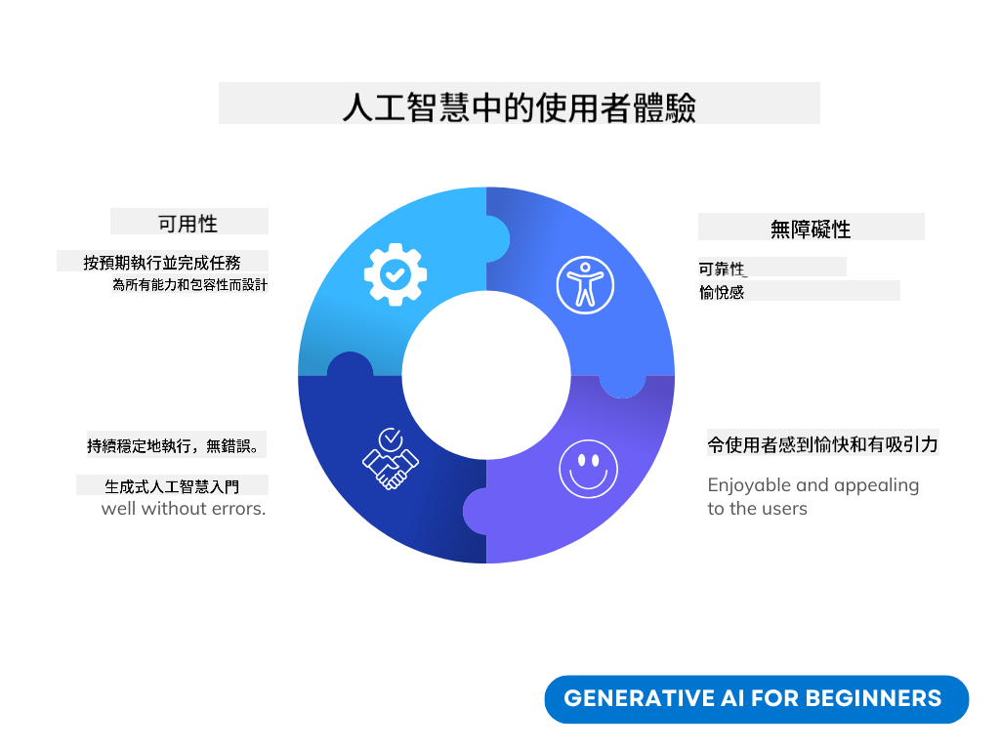
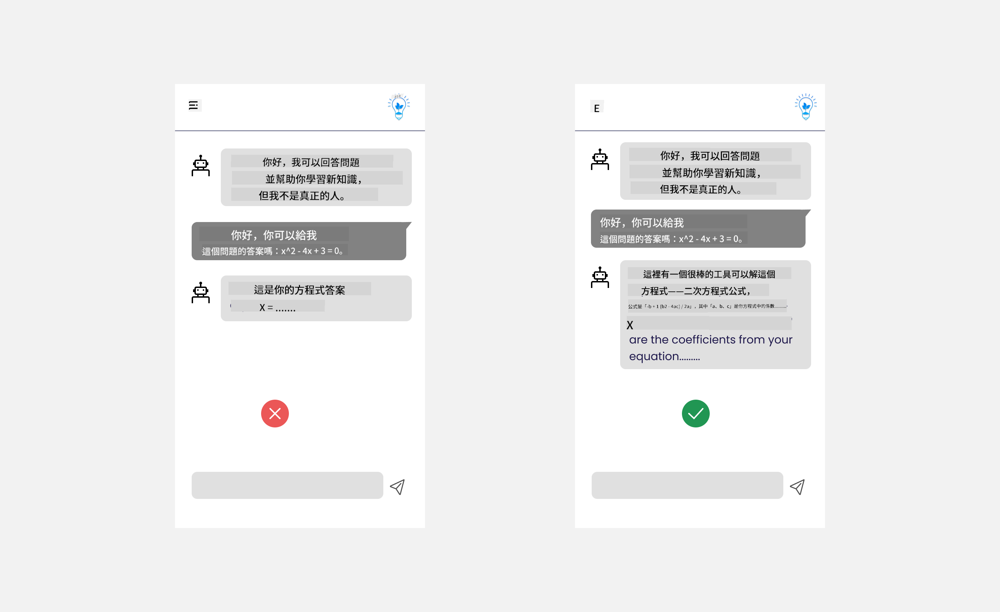
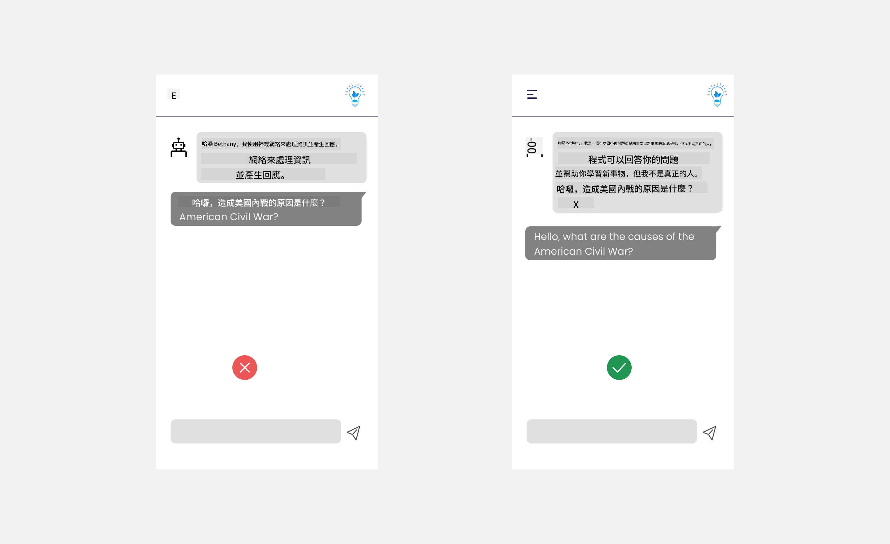
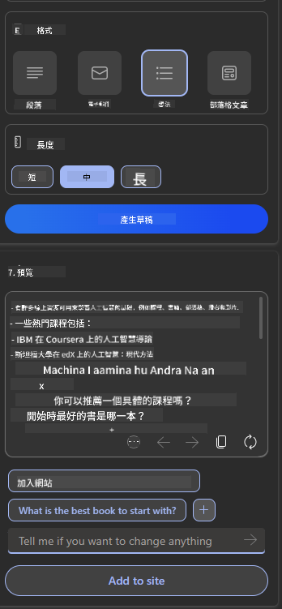

<!--
CO_OP_TRANSLATOR_METADATA:
{
  "original_hash": "ec385b41ee50579025d50cc03bfb3a25",
  "translation_date": "2025-07-09T14:51:03+00:00",
  "source_file": "12-designing-ux-for-ai-applications/README.md",
  "language_code": "mo"
}
-->
# 為 AI 應用設計使用者體驗

> _(點擊上方圖片觀看本課程影片)_

使用者體驗是開發應用程式時非常重要的一環。使用者需要能夠有效率地使用你的應用程式來完成任務。效率固然重要，但你也需要設計出人人都能使用的應用程式，讓它們具備「無障礙」特性。本章將聚焦於這個領域，希望你最終能設計出讓人願意且能夠使用的應用程式。

## 介紹

使用者體驗是指使用者如何與特定產品或服務互動並使用它，無論是系統、工具或設計。在開發 AI 應用時，開發者不僅關注使用者體驗的有效性，也重視其倫理性。本課程將介紹如何打造符合使用者需求的人工智慧（AI）應用。

本課程將涵蓋以下主題：

- 使用者體驗介紹與理解使用者需求
- 為信任與透明度設計 AI 應用
- 為協作與回饋設計 AI 應用

## 學習目標

完成本課程後，你將能夠：

- 了解如何打造符合使用者需求的 AI 應用。
- 設計促進信任與協作的 AI 應用。

### 先備知識

請花些時間閱讀更多關於[使用者體驗與設計思維](https://learn.microsoft.com/training/modules/ux-design?WT.mc_id=academic-105485-koreyst)的內容。

## 使用者體驗介紹與理解使用者需求

在我們虛構的教育新創公司中，有兩類主要使用者：教師與學生。這兩類使用者各有獨特需求。以使用者為中心的設計會優先考量使用者，確保產品對目標使用者是相關且有益的。

應用程式應該是**有用、可靠、無障礙且令人愉悅**，以提供良好的使用者體驗。

### 易用性

有用意味著應用程式的功能符合其預期目的，例如自動化評分流程或生成複習用的抽認卡。自動化評分的應用程式應能根據預先定義的標準，準確且有效率地為學生作業打分。類似地，生成複習抽認卡的應用程式應能根據資料創造相關且多樣的問題。

### 可靠性

可靠意味著應用程式能持續且無誤地執行任務。然而，AI 和人類一樣並非完美，可能會出錯。應用程式可能會遇到錯誤或意外狀況，需要人工介入或修正。你會如何處理錯誤？本課程最後一節將介紹如何設計 AI 系統與應用以促進協作與回饋。

### 無障礙

無障礙意味著將使用者體驗延伸至各種能力的使用者，包括身心障礙者，確保沒有人被排除在外。遵循無障礙指引與原則，AI 解決方案將更具包容性、易用性，並對所有使用者更有益。

### 愉悅感

愉悅感意味著應用程式使用起來令人愉快。吸引人的使用者體驗能正面影響使用者，鼓勵他們回訪應用程式，並提升商業收益。

並非所有挑戰都能靠 AI 解決。AI 是用來增強你的使用者體驗，無論是自動化手動任務，或是個人化使用者體驗。

## 為信任與透明度設計 AI 應用

建立信任在設計 AI 應用時至關重要。信任讓使用者有信心應用程式能完成工作、持續提供結果，且結果符合使用者需求。這方面的風險包括不信任與過度信任。不信任發生在使用者對 AI 系統幾乎沒有信任，導致拒絕使用你的應用程式。過度信任則是使用者高估 AI 系統能力，過度依賴 AI。例如，過度信任自動評分系統可能導致教師不再仔細審核部分試卷，造成學生獲得不公平或不準確的分數，或錯失回饋與改進的機會。

確保信任成為設計核心的兩種方法是「可解釋性」與「控制權」。

### 可解釋性

當 AI 幫助做出決策，例如傳授知識給未來世代時，教師與家長理解 AI 如何做出決策至關重要。這就是可解釋性——了解 AI 應用如何做決策。設計可解釋性包括加入 AI 應用能做什麼的範例細節。例如，系統可以用「使用 AI 幫助你整理筆記，輕鬆複習」來取代「開始使用 AI 教師」。

另一個例子是 AI 如何使用使用者與個人資料。例如，擁有學生角色的使用者可能會有角色限制。AI 可能無法直接揭示答案，但能引導使用者思考如何解決問題。

可解釋性的另一個關鍵是簡化說明。學生與教師可能不是 AI 專家，因此應用程式能做什麼或不能做什麼的說明應該簡單易懂。

### 控制權

生成式 AI 促成 AI 與使用者的協作，例如使用者可以修改提示詞以獲得不同結果。此外，產生結果後，使用者應能修改結果，讓他們感受到掌控感。例如，使用 Bing 時，你可以根據格式、語氣和長度調整提示詞，並且可以對輸出結果進行修改，如下圖所示：

Bing 另一項讓使用者掌控應用程式的功能是能選擇是否讓 AI 使用其資料。對於學校應用，學生可能想使用自己的筆記以及教師的資源作為複習材料。

> 設計 AI 應用時，刻意性是關鍵，確保使用者不會過度信任並對其能力抱持不切實際的期望。一種做法是在提示詞與結果之間製造摩擦，提醒使用者這是 AI，而非真人。

## 為協作與回饋設計 AI 應用

如前所述，生成式 AI 促成使用者與 AI 的協作。大多數互動是使用者輸入提示詞，AI 產生結果。如果結果錯誤，應用程式如何處理？AI 會責怪使用者，還是花時間解釋錯誤？

AI 應用應設計成能接收並給予回饋。這不僅有助於 AI 系統改進，也建立使用者信任。設計中應包含回饋迴路，例如對結果給予簡單的讚或踩。

另一種處理方式是清楚溝通系統的能力與限制。當使用者提出超出 AI 能力的請求時，也應有相應的處理方式，如下圖所示。

系統錯誤在應用程式中很常見，例如使用者可能需要 AI 範圍外的資訊，或應用程式限制使用者能生成摘要的問題數量或科目。例如，一個只訓練於歷史與數學資料的 AI 應用可能無法處理地理相關問題。為了緩解此問題，AI 系統可以回應：「抱歉，我們的產品只訓練於以下科目……，無法回答您提出的問題。」

AI 應用並非完美，必然會犯錯。設計應用時，應確保留有使用者回饋與錯誤處理的空間，且方式簡單且易於理解。

## 作業

請選擇你目前開發的任何 AI 應用，考慮在你的應用中實施以下步驟：

- **愉悅感：** 思考如何讓你的應用更令人愉快。你是否在各處加入說明？是否鼓勵使用者探索？你的錯誤訊息用詞如何？

- **易用性：** 建立網頁應用。確保你的應用能用滑鼠與鍵盤操作。

- **信任與透明度：** 不要完全信任 AI 及其輸出，思考如何加入人工驗證輸出。並考慮實施其他促進信任與透明度的方法。

- **控制權：** 讓使用者掌控他們提供給應用的資料。實作讓使用者能選擇是否同意 AI 應用收集資料的機制。

## 繼續學習！

完成本課程後，請參考我們的[生成式 AI 學習系列](https://aka.ms/genai-collection?WT.mc_id=academic-105485-koreyst)，持續提升你的生成式 AI 知識！

接著前往第 13 課，我們將探討如何[保護 AI 應用](../13-securing-ai-applications/README.md?WT.mc_id=academic-105485-koreyst)！

**免責聲明**：  
本文件係使用 AI 翻譯服務 [Co-op Translator](https://github.com/Azure/co-op-translator) 進行翻譯。雖然我們致力於確保準確性，但請注意，自動翻譯可能包含錯誤或不準確之處。原始文件的母語版本應視為權威來源。對於重要資訊，建議採用專業人工翻譯。我們不對因使用本翻譯而產生的任何誤解或誤釋承擔責任。