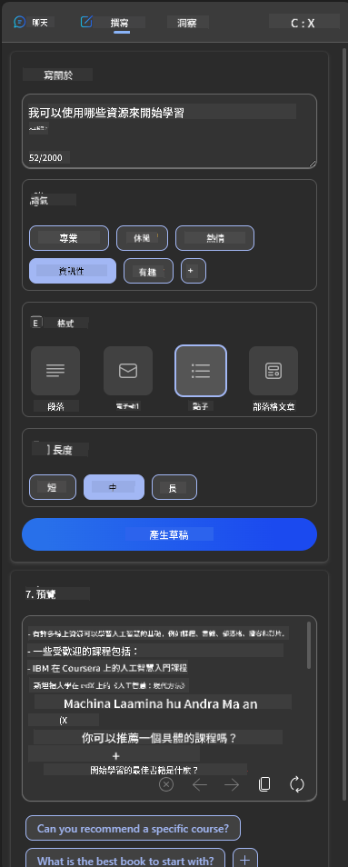
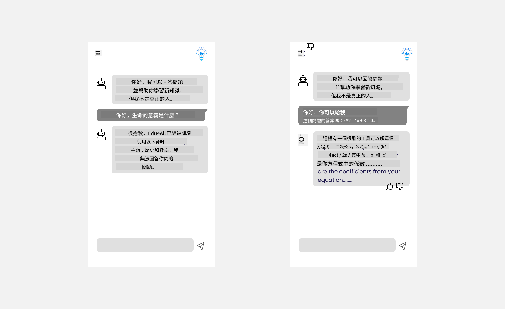

<!--
CO_OP_TRANSLATOR_METADATA:
{
  "original_hash": "747668e4c53d067369f06e9ec2e6313e",
  "translation_date": "2025-08-26T14:46:13+00:00",
  "source_file": "12-designing-ux-for-ai-applications/README.md",
  "language_code": "mo"
}
-->
# 為 AI 應用設計用戶體驗

> _(點擊上方圖片觀看本課程影片)_

用戶體驗是開發應用程式時非常重要的一環。用戶需要能夠有效率地使用你的應用來完成任務。除了效率之外，你還需要設計讓每個人都能使用的應用，也就是讓它具有_無障礙性_。本章會聚焦在這個主題，希望你最後能設計出大家都能且想要使用的應用程式。

## 前言

用戶體驗指的是用戶如何與特定產品或服務互動與使用，無論是系統、工具還是設計。在開發 AI 應用時，開發者不僅要確保用戶體驗有效，也要兼顧道德。本課程會介紹如何打造能滿足用戶需求的人工智慧（AI）應用。

本課程將涵蓋以下主題：

- 用戶體驗簡介與了解用戶需求
- 為信任與透明度設計 AI 應用
- 為協作與回饋設計 AI 應用

## 學習目標

完成本課程後，你將能夠：

- 了解如何打造符合用戶需求的 AI 應用。
- 設計能促進信任與協作的 AI 應用。

### 先備知識

花點時間閱讀更多關於[用戶體驗與設計思維](https://learn.microsoft.com/training/modules/ux-design?WT.mc_id=academic-105485-koreyst)。

## 用戶體驗簡介與了解用戶需求

在我們虛構的教育新創公司中，有兩個主要用戶：老師和學生。這兩種用戶各自有不同的需求。以用戶為中心的設計會優先考慮用戶，確保產品對目標對象有意義且有幫助。

應用程式應該要**實用、可靠、無障礙且令人愉悅**，才能帶來良好的用戶體驗。

### 實用性

實用代表應用程式的功能符合其預期用途，例如自動批改作業或產生複習用的抽認卡。一個自動批改的應用程式應該能根據預設標準，準確且有效率地為學生作業打分。同樣地，產生複習抽認卡的應用程式也應該能根據資料產生相關且多元的題目。

### 可靠性

可靠代表應用程式能持續且正確地執行任務。不過，AI 和人一樣並不完美，也可能出錯。應用程式可能會遇到錯誤或突發狀況，需要人工介入或修正。那要怎麼處理錯誤呢？在本課最後一節，我們會介紹 AI 系統與應用如何設計協作與回饋機制。

### 無障礙性

無障礙代表將用戶體驗擴展到各種能力的用戶，包括身心障礙者，確保沒有人被排除在外。遵循無障礙設計原則，能讓 AI 解決方案更具包容性、易用性，並對所有用戶都有幫助。

### 愉悅性

愉悅代表應用程式用起來令人開心。吸引人的用戶體驗能帶來正面影響，鼓勵用戶回流，進而提升業務收入。

不是每個問題都能用 AI 解決。AI 的角色是強化你的用戶體驗，無論是自動化重複性工作，還是個人化用戶體驗。

## 為信任與透明度設計 AI 應用

建立信任是設計 AI 應用時的關鍵。信任能讓用戶相信應用程式能完成工作、持續產出結果，且這些結果正是用戶所需。這方面的風險在於不信任與過度信任。不信任是指用戶對 AI 系統缺乏信心，導致拒絕使用你的應用。過度信任則是用戶高估 AI 系統的能力，對 AI 過於依賴。例如自動批改系統，若老師過度信任，可能就不會再檢查部分作業，這可能導致學生分數不公或不準確，或錯失回饋與改進的機會。

要把信任放在設計核心，有兩個方法：可解釋性與控制權。

### 可解釋性

當 AI 協助做出決策，例如傳授知識給下一代時，老師和家長必須了解 AI 是如何做出決定的。這就是可解釋性——理解 AI 應用如何做決策。設計可解釋性時，可以加入細節，說明 AI 如何產生結果。用戶必須知道這是 AI 產生的結果，而不是人類。例如，不要說「現在就開始和你的家教聊天吧」，而是說「使用能根據你需求調整、幫助你以自己步調學習的 AI 家教」。

另一個例子是 AI 如何使用用戶與個人資料。例如，學生這個角色可能有某些限制，AI 不能直接給答案，但可以引導用戶思考如何解決問題。

可解釋性的另一個重點是簡化說明。學生和老師未必是 AI 專家，因此應用能做什麼、不能做什麼的說明應該簡單易懂。

### 控制權

生成式 AI 讓 AI 與用戶之間產生協作，例如用戶可以修改提示詞來得到不同結果。此外，當結果產生後，用戶應該能修改結果，讓他們有掌控感。例如在 Bing 上，你可以根據格式、語氣和長度調整提示詞，也可以對結果進行修改，如下圖所示：

Bing 另一個讓用戶掌控應用的功能，是可以選擇是否讓 AI 使用自己的資料。對學校應用來說，學生可能想用自己的筆記和老師的教材作為複習素材。

> 在設計 AI 應用時，必須有意識地避免用戶過度信任，對 AI 能力產生不切實際的期待。可以在提示詞與結果之間設計一些「摩擦」，提醒用戶這是 AI，不是人類。

## 為協作與回饋設計 AI 應用

如前所述，生成式 AI 讓用戶與 AI 之間產生協作。大多數互動是用戶輸入提示詞，AI 產生結果。如果結果不正確怎麼辦？應用遇到錯誤時要怎麼處理？AI 會怪用戶，還是會花時間解釋錯誤？

AI 應用應該要能接收與給予回饋。這不僅有助於 AI 系統改進，也能建立用戶信任。設計時應加入回饋機制，例如對結果按讚或倒讚。

另一種做法是清楚溝通系統的能力與限制。當用戶要求超出 AI 能力範圍的東西時，也應該有處理方式，如下圖所示。

系統錯誤在應用中很常見，可能是用戶需要 AI 無法提供的資訊，或應用對用戶能產生摘要的題數/科目有限。例如，AI 應用只訓練了歷史和數學資料，可能無法回答地理相關問題。這時，AI 系統可以回應：「很抱歉，我們的產品只訓練了以下科目......，無法回答你問的問題。」

AI 應用並不完美，難免會犯錯。設計應用時，應確保有讓用戶回饋與錯誤處理的空間，而且方式要簡單、易於理解。

## 作業

請針對你目前開發的任何 AI 應用，思考並實作以下步驟：

- **愉悅性：** 思考如何讓你的應用更令人愉悅。你是否在各處加上說明？你是否鼓勵用戶探索？你的錯誤訊息怎麼寫的？

- **實用性：** 如果是網頁應用，請確保你的應用可以用滑鼠和鍵盤操作。

- **信任與透明度：** 不要完全信任 AI 及其結果，思考如何加入人工驗證流程。也請思考並實作其他建立信任與透明度的方法。

- **控制權：** 讓用戶能掌控他們提供給應用的資料。實作讓用戶可以選擇是否參與 AI 應用資料收集的方式。

## 持續學習！

完成本課程後，歡迎參考我們的[生成式 AI 學習資源](https://aka.ms/genai-collection?WT.mc_id=academic-105485-koreyst)，繼續提升你的生成式 AI 知識！

接下來請前往第 13 課，我們將探討[如何保護 AI 應用的安全](../13-securing-ai-applications/README.md?WT.mc_id=academic-105485-koreyst)！

---

**免責聲明**：  
本文件已使用 AI 翻譯服務 [Co-op Translator](https://github.com/Azure/co-op-translator) 進行翻譯。我們雖然力求準確，但請注意自動翻譯可能包含錯誤或不準確之處。原始語言的文件應視為最具權威性的來源。對於重要資訊，建議採用專業人工翻譯。因使用本翻譯而產生的任何誤解或錯誤，本公司概不負責。