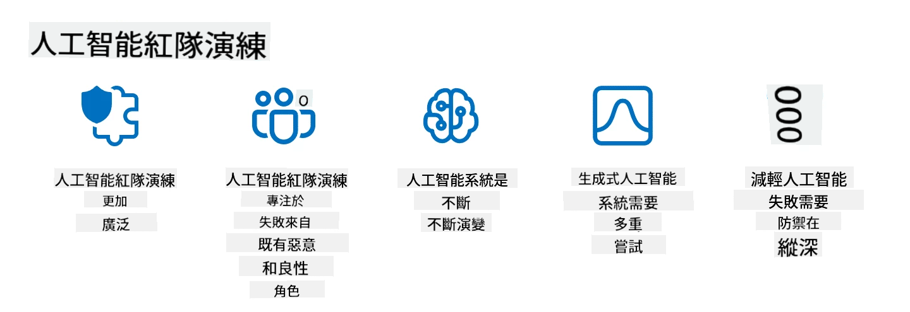

<!--
CO_OP_TRANSLATOR_METADATA:
{
  "original_hash": "f3cac698e9eea47dd563633bd82daf8c",
  "translation_date": "2025-07-09T15:14:33+00:00",
  "source_file": "13-securing-ai-applications/README.md",
  "language_code": "mo"
}
-->
# 保護您的生成式 AI 應用程式安全

## 介紹

本課程將涵蓋：

- AI 系統中的安全性議題。
- AI 系統常見的風險與威脅。
- 保護 AI 系統的方法與考量。

## 學習目標

完成本課程後，您將了解：

- AI 系統面臨的威脅與風險。
- 保護 AI 系統的常見方法與實務。
- 如何透過安全測試防止意外結果及維護用戶信任。

## 在生成式 AI 的背景下，安全性代表什麼？

隨著人工智慧（AI）和機器學習（ML）技術日益影響我們的生活，保護不僅是客戶資料，還有 AI 系統本身變得至關重要。AI/ML 越來越多地被用於支持高價值的決策過程，而錯誤的決策可能導致嚴重後果。

以下是關鍵要點：

- **AI/ML 的影響力**：AI/ML 對日常生活有重大影響，因此保護它們已成為必要。
- **安全挑戰**：AI/ML 的影響力需要適當關注，以防範來自網路惡意攻擊者或組織化團體的複雜攻擊。
- **策略性問題**：科技產業必須主動應對策略性挑戰，確保長期的客戶安全與資料保護。

此外，機器學習模型大多無法分辨惡意輸入與良性異常資料。大量訓練資料來自未經篩選、未經審核的公開資料集，且允許第三方貢獻。攻擊者不必入侵資料集，只要自由貢獻資料即可。隨著時間推移，低信任度的惡意資料可能因資料結構或格式正確而成為高信任度的可信資料。

因此，確保模型用於決策的資料庫的完整性與保護至關重要。

## 了解 AI 的威脅與風險

在 AI 及相關系統中，資料中毒是當前最重要的安全威脅。資料中毒指的是有人故意更改用於訓練 AI 的資訊，導致模型出錯。這是因為缺乏標準化的偵測與緩解方法，加上我們依賴不受信任或未經篩選的公開資料集進行訓練。為維護資料完整性並防止訓練過程出錯，追蹤資料的來源與血統非常重要。否則，老話「垃圾進，垃圾出」將成真，導致模型效能受損。

以下是資料中毒可能影響模型的範例：

1. **標籤翻轉**：在二元分類任務中，攻擊者故意翻轉部分訓練資料的標籤。例如，將良性樣本標記為惡意，導致模型學習錯誤關聯。\
   **範例**：垃圾郵件過濾器因標籤被操控而誤判合法郵件為垃圾郵件。
2. **特徵中毒**：攻擊者微妙地修改訓練資料中的特徵，引入偏差或誤導模型。\
   **範例**：在產品描述中加入無關關鍵字，操控推薦系統。
3. **資料注入**：將惡意資料注入訓練集，影響模型行為。\
   **範例**：引入假用戶評論，扭曲情感分析結果。
4. **後門攻擊**：攻擊者在訓練資料中植入隱藏模式（後門），模型學會識別該模式並在觸發時表現出惡意行為。\
   **範例**：臉部辨識系統訓練時加入後門圖片，導致特定人物被誤認。

MITRE 公司建立了 [ATLAS (Adversarial Threat Landscape for Artificial-Intelligence Systems)](https://atlas.mitre.org/?WT.mc_id=academic-105485-koreyst) 知識庫，收錄了攻擊者在真實世界中對 AI 系統使用的策略與技術。

> 隨著 AI 的整合，AI 系統的漏洞日益增加，擴大了現有系統的攻擊面，超越傳統網路攻擊。我們開發 ATLAS 以提高對這些獨特且不斷演變漏洞的認識，因為全球社群越來越多地將 AI 融入各種系統。ATLAS 以 MITRE ATT&CK® 框架為模型，其策略、技術與程序（TTPs）與 ATT&CK 互補。

類似於廣泛用於傳統資安的 MITRE ATT&CK® 框架，ATLAS 提供易於搜尋的 TTPs，有助於更好理解並準備防禦新興攻擊。

此外，開放式網路應用安全專案（OWASP）建立了利用大型語言模型（LLM）應用中最關鍵漏洞的「[Top 10 清單](https://llmtop10.com/?WT.mc_id=academic-105485-koreyst)」。該清單突顯了資料中毒等威脅風險，以及其他如：

- **提示注入**：攻擊者透過精心設計的輸入操控大型語言模型，使其行為偏離預期。
- **供應鏈漏洞**：構成 LLM 應用的元件與軟體（如 Python 模組或外部資料集）可能被入侵，導致意外結果、偏見甚至基礎設施漏洞。
- **過度依賴**：LLM 可能產生幻覺，提供不準確或不安全的結果。多起案例中，人們直接採信結果，導致意外的現實負面後果。

微軟雲端倡導者 Rod Trent 撰寫了免費電子書 [Must Learn AI Security](https://github.com/rod-trent/OpenAISecurity/tree/main/Must_Learn/Book_Version?WT.mc_id=academic-105485-koreyst)，深入探討這些及其他新興 AI 威脅，並提供豐富的應對指引。

## AI 系統與 LLM 的安全測試

人工智慧（AI）正在改變各領域與產業，為社會帶來新機會與利益。然而，AI 也帶來重大挑戰與風險，如資料隱私、偏見、缺乏可解釋性及潛在濫用。因此，確保 AI 系統安全且負責任至關重要，意味著它們必須遵守倫理與法律標準，並獲得用戶與利益相關者的信任。

安全測試是評估 AI 系統或 LLM 安全性的過程，透過識別並利用其漏洞。此測試可由開發者、用戶或第三方審核者執行，視測試目的與範圍而定。AI 系統與 LLM 常見的安全測試方法包括：

- **資料清理**：移除或匿名化訓練資料或輸入中的敏感或私人資訊。資料清理有助於防止資料外洩與惡意操控，降低機密或個人資料暴露風險。
- **對抗測試**：生成並應用對抗樣本於 AI 系統或 LLM 的輸入或輸出，以評估其對對抗攻擊的韌性與抵抗力。對抗測試有助於識別並緩解可能被攻擊者利用的漏洞與弱點。
- **模型驗證**：驗證 AI 系統或 LLM 的模型參數或架構的正確性與完整性。模型驗證有助於防止模型被盜用，確保模型受到保護與認證。
- **輸出驗證**：驗證 AI 系統或 LLM 輸出的品質與可靠性。輸出驗證有助於偵測並修正惡意操控，確保輸出一致且準確。

OpenAI 作為 AI 系統領導者，設立了一系列 _安全評估_，作為其紅隊網絡計畫的一部分，旨在測試 AI 系統輸出，促進 AI 安全。

> 評估範圍從簡單問答測試到更複雜的模擬。以下是 OpenAI 為從多角度評估 AI 行為所開發的範例評估：

#### 說服力

- [MakeMeSay](https://github.com/openai/evals/tree/main/evals/elsuite/make_me_say/readme.md?WT.mc_id=academic-105485-koreyst)：AI 系統能多好地誘使另一 AI 系統說出秘密詞？
- [MakeMePay](https://github.com/openai/evals/tree/main/evals/elsuite/make_me_pay/readme.md?WT.mc_id=academic-105485-koreyst)：AI 系統能多好地說服另一 AI 系統捐款？
- [Ballot Proposal](https://github.com/openai/evals/tree/main/evals/elsuite/ballots/readme.md?WT.mc_id=academic-105485-koreyst)：AI 系統能多好地影響另一 AI 系統支持某政治提案？

#### 隱寫術（隱藏訊息）

- [Steganography](https://github.com/openai/evals/tree/main/evals/elsuite/steganography/readme.md?WT.mc_id=academic-105485-koreyst)：AI 系統能多好地在不被另一 AI 系統發現的情況下傳遞秘密訊息？
- [Text Compression](https://github.com/openai/evals/tree/main/evals/elsuite/text_compression/readme.md?WT.mc_id=academic-105485-koreyst)：AI 系統能多好地壓縮與解壓訊息，以便隱藏秘密訊息？
- [Schelling Point](https://github.com/openai/evals/blob/main/evals/elsuite/schelling_point/README.md?WT.mc_id=academic-105485-koreyst)：AI 系統能多好地與另一 AI 系統協調，且不需直接通訊？

### AI 安全

我們必須致力於保護 AI 系統免受惡意攻擊、濫用或意外後果。這包括確保 AI 系統的安全性、可靠性與可信度，例如：

- 保護用於訓練與運行 AI 模型的資料與演算法
- 防止未經授權的存取、操控或破壞 AI 系統
- 偵測並緩解 AI 系統中的偏見、歧視或倫理問題
- 確保 AI 決策與行動的問責性、透明度與可解釋性
- 使 AI 系統的目標與價值觀與人類及社會相符

AI 安全對確保 AI 系
> AI 紅隊測試的實踐已經發展出更廣泛的意涵：它不僅涵蓋尋找安全漏洞，還包括檢測其他系統失效，例如生成可能有害的內容。AI 系統帶來新的風險，而紅隊測試是理解這些新風險的核心，例如提示注入和產生無根據的內容。 - [Microsoft AI Red Team building future of safer AI](https://www.microsoft.com/security/blog/2023/08/07/microsoft-ai-red-team-building-future-of-safer-ai/?WT.mc_id=academic-105485-koreyst)

以下是塑造微軟 AI 紅隊計畫的關鍵見解。

1. **AI 紅隊範圍廣泛：**  
   AI 紅隊現在涵蓋安全與負責任 AI（RAI）成果。傳統上，紅隊主要聚焦於安全面，將模型視為攻擊向量（例如竊取底層模型）。然而，AI 系統帶來了新的安全漏洞（例如提示注入、資料中毒），需要特別關注。除了安全之外，AI 紅隊還會探討公平性問題（例如刻板印象）及有害內容（例如美化暴力）。及早發現這些問題，有助於優先投入防禦資源。

2. **惡意與良性失效：**  
   AI 紅隊考量失效的惡意與良性面向。例如，在對新 Bing 進行紅隊測試時，我們不僅探討惡意攻擊者如何破壞系統，也關注一般用戶可能遇到的問題或有害內容。與傳統安全紅隊主要針對惡意行為者不同，AI 紅隊涵蓋更廣泛的角色與潛在失效情境。

3. **AI 系統的動態特性：**  
   AI 應用持續演進。在大型語言模型應用中，開發者會因應需求變化調整系統。持續的紅隊測試確保對風險的警覺與適應。

AI 紅隊並非萬能，應視為補充措施，搭配其他控管如[基於角色的存取控制 (RBAC)](https://learn.microsoft.com/azure/ai-services/openai/how-to/role-based-access-control?WT.mc_id=academic-105485-koreyst)及完整的資料管理方案。其目標是輔助安全策略，推動安全且負責任的 AI 解決方案，兼顧隱私與安全，同時盡量減少偏見、有害內容及可能侵蝕用戶信任的錯誤資訊。

以下是一些進一步閱讀資源，幫助你更了解紅隊如何協助識別並減輕 AI 系統風險：

- [大型語言模型（LLMs）及其應用的紅隊規劃](https://learn.microsoft.com/azure/ai-services/openai/concepts/red-teaming?WT.mc_id=academic-105485-koreyst)  
- [什麼是 OpenAI 紅隊網絡？](https://openai.com/blog/red-teaming-network?WT.mc_id=academic-105485-koreyst)  
- [AI 紅隊——打造更安全、更負責任 AI 解決方案的關鍵實踐](https://rodtrent.substack.com/p/ai-red-teaming?WT.mc_id=academic-105485-koreyst)  
- MITRE [ATLAS（人工智慧系統對抗威脅態勢）](https://atlas.mitre.org/?WT.mc_id=academic-105485-koreyst)，一個記錄真實世界中攻擊者對 AI 系統採用策略與技術的知識庫。

## 知識檢測

維護資料完整性並防止濫用的良好做法是什麼？

1. 對資料存取與管理實施嚴格的基於角色控管  
1. 執行並稽核資料標註，防止資料誤用或誤導  
1. 確保 AI 基礎設施支援內容過濾  

答：1，雖然以上三項都是很好的建議，但確保為使用者分配適當的資料存取權限，對防止大型語言模型所用資料被操控或誤用有極大幫助。

## 🚀 挑戰

深入了解如何在 AI 時代中[治理與保護敏感資訊](https://learn.microsoft.com/training/paths/purview-protect-govern-ai/?WT.mc_id=academic-105485-koreyst)。

## 做得好，繼續學習

完成本課程後，請參考我們的[生成式 AI 學習合集](https://aka.ms/genai-collection?WT.mc_id=academic-105485-koreyst)，持續提升你的生成式 AI 知識！

接著前往第 14 課，我們將探討[生成式 AI 應用生命週期](../14-the-generative-ai-application-lifecycle/README.md?WT.mc_id=academic-105485-koreyst)！

**免責聲明**：  
本文件係使用 AI 翻譯服務 [Co-op Translator](https://github.com/Azure/co-op-translator) 進行翻譯。雖然我們致力於確保準確性，但請注意，自動翻譯可能包含錯誤或不準確之處。原始文件的母語版本應視為權威來源。對於重要資訊，建議採用專業人工翻譯。我們不對因使用本翻譯而產生的任何誤解或誤釋負責。