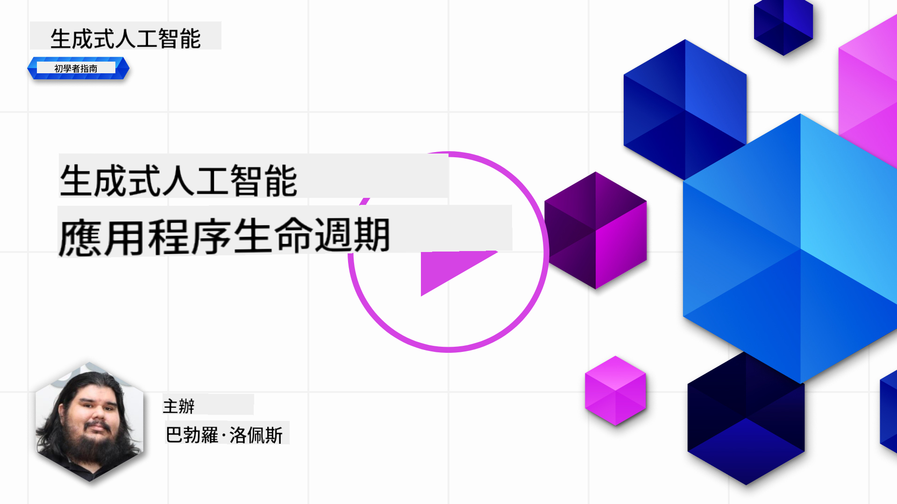
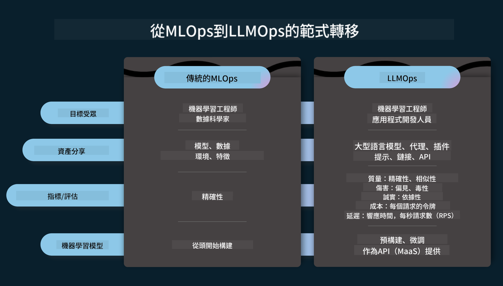
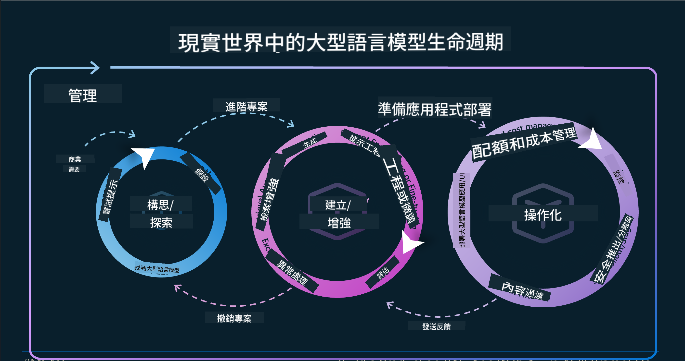
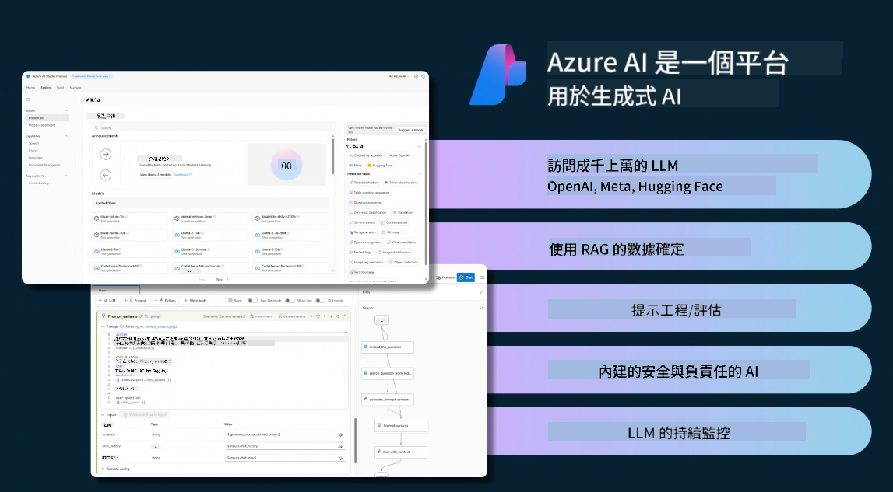
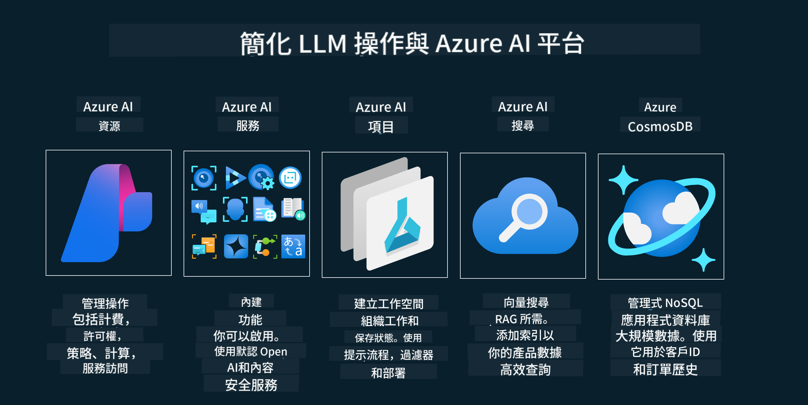
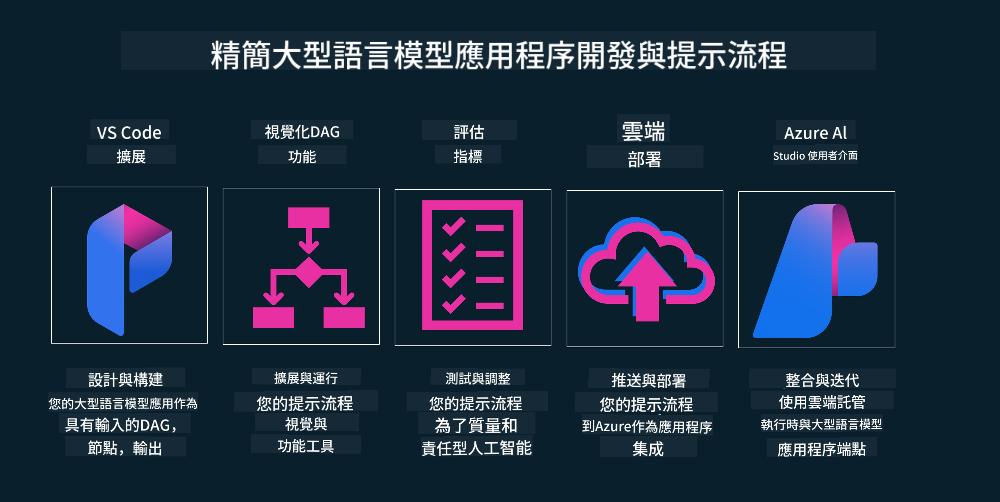

<!--
CO_OP_TRANSLATOR_METADATA:
{
  "original_hash": "27a5347a5022d5ef0a72ab029b03526a",
  "translation_date": "2025-05-19T23:21:09+00:00",
  "source_file": "14-the-generative-ai-application-lifecycle/README.md",
  "language_code": "mo"
}
-->

# The Generative AI Application Lifecycle

Satu pertanyaan penting untuk semua aplikasi AI adalah relevansi fitur AI, karena AI adalah bidang yang berkembang pesat, untuk memastikan bahwa aplikasi Anda tetap relevan, andal, dan kuat, Anda perlu memantau, mengevaluasi, dan meningkatkannya secara terus-menerus. Di sinilah siklus hidup AI generatif berperan.

Siklus hidup AI generatif adalah kerangka kerja yang memandu Anda melalui tahapan pengembangan, penerapan, dan pemeliharaan aplikasi AI generatif. Ini membantu Anda mendefinisikan tujuan, mengukur kinerja, mengidentifikasi tantangan, dan menerapkan solusi. Ini juga membantu Anda menyelaraskan aplikasi Anda dengan standar etika dan hukum dari domain Anda dan pemangku kepentingan Anda. Dengan mengikuti siklus hidup AI generatif, Anda dapat memastikan bahwa aplikasi Anda selalu memberikan nilai dan memuaskan pengguna Anda.

## Pendahuluan

Dalam bab ini, Anda akan:

- Memahami Perubahan Paradigma dari MLOps ke LLMOps
- Siklus Hidup LLM
- Alat Siklus Hidup
- Metrifikasi dan Evaluasi Siklus Hidup

## Memahami Perubahan Paradigma dari MLOps ke LLMOps

LLM adalah alat baru dalam gudang senjata Kecerdasan Buatan, mereka sangat kuat dalam tugas analisis dan generasi untuk aplikasi, namun kekuatan ini memiliki beberapa konsekuensi dalam bagaimana kita menyederhanakan tugas AI dan Pembelajaran Mesin Klasik.

Dengan ini, kita memerlukan Paradigma baru untuk mengadaptasi alat ini secara dinamis, dengan insentif yang tepat. Kita dapat mengkategorikan aplikasi AI lama sebagai "Aplikasi ML" dan Aplikasi AI baru sebagai "Aplikasi GenAI" atau hanya "Aplikasi AI", mencerminkan teknologi dan teknik utama yang digunakan pada saat itu. Ini menggeser narasi kita dalam berbagai cara, lihat perbandingan berikut.

Perhatikan bahwa dalam LLMOps, kita lebih fokus pada Pengembang Aplikasi, menggunakan integrasi sebagai poin kunci, menggunakan "Model-sebagai-Layanan" dan memikirkan poin-poin berikut untuk metrik.

- Kualitas: Kualitas respons
- Kerugian: AI yang Bertanggung Jawab
- Kejujuran: Dasar respons (Masuk akal? Apakah itu benar?)
- Biaya: Anggaran Solusi
- Latensi: Waktu rata-rata untuk respons token

## Siklus Hidup LLM

Pertama, untuk memahami siklus hidup dan modifikasinya, mari kita perhatikan infografik berikut.

Seperti yang Anda lihat, ini berbeda dari Siklus Hidup biasanya dari MLOps. LLM memiliki banyak persyaratan baru, seperti Prompting, teknik berbeda untuk meningkatkan kualitas (Penyetelan Halus, RAG, Meta-Prompts), penilaian dan tanggung jawab yang berbeda dengan AI yang bertanggung jawab, terakhir, metrik evaluasi baru (Kualitas, Kerugian, Kejujuran, Biaya, dan Latensi).

Sebagai contoh, lihat bagaimana kita beride. Menggunakan rekayasa prompt untuk bereksperimen dengan berbagai LLM untuk mengeksplorasi kemungkinan untuk menguji apakah Hipotesis mereka bisa benar.

Perhatikan bahwa ini tidak linier, tetapi terintegrasi dalam loop, iteratif, dan dengan siklus yang menyeluruh.

Bagaimana kita bisa mengeksplorasi langkah-langkah tersebut? Mari kita masuk ke detail bagaimana kita bisa membangun siklus hidup.

Ini mungkin terlihat sedikit rumit, mari kita fokus pada tiga langkah besar terlebih dahulu.

1. Beride/Mengeksplorasi: Eksplorasi, di sini kita dapat mengeksplorasi sesuai dengan kebutuhan bisnis kita. Membuat prototipe, membuat [PromptFlow](https://microsoft.github.io/promptflow/index.html?WT.mc_id=academic-105485-koreyst) dan menguji apakah cukup efisien untuk Hipotesis kita.
2. Membangun/Meningkatkan: Implementasi, sekarang, kita mulai mengevaluasi untuk dataset yang lebih besar, menerapkan teknik, seperti Penyetelan Halus dan RAG, untuk memeriksa kekokohan solusi kita. Jika tidak, menerapkannya kembali, menambahkan langkah baru dalam alur kita atau merestrukturisasi data, mungkin membantu. Setelah menguji alur dan skala kita, jika berhasil dan memeriksa Metrik kita, siap untuk langkah berikutnya.
3. Mengoperasionalkan: Integrasi, sekarang menambahkan Sistem Pemantauan dan Peringatan ke sistem kita, penerapan dan integrasi aplikasi ke Aplikasi kita.

Kemudian, kita memiliki siklus manajemen yang menyeluruh, berfokus pada keamanan, kepatuhan, dan tata kelola.

Selamat, sekarang Anda memiliki Aplikasi AI yang siap digunakan dan beroperasi. Untuk pengalaman langsung, lihat [Contoso Chat Demo.](https://nitya.github.io/contoso-chat/?WT.mc_id=academic-105485-koreys)

Sekarang, alat apa yang bisa kita gunakan?

## Alat Siklus Hidup

Untuk Alat, Microsoft menyediakan [Azure AI Platform](https://azure.microsoft.com/solutions/ai/?WT.mc_id=academic-105485-koreys) dan [PromptFlow](https://microsoft.github.io/promptflow/index.html?WT.mc_id=academic-105485-koreyst) memudahkan dan membuat siklus Anda mudah diimplementasikan dan siap digunakan.

[Azure AI Platform](https://azure.microsoft.com/solutions/ai/?WT.mc_id=academic-105485-koreys), memungkinkan Anda menggunakan [AI Studio](https://ai.azure.com/?WT.mc_id=academic-105485-koreys). AI Studio adalah portal web yang memungkinkan Anda untuk Mengeksplorasi model, sampel, dan alat. Mengelola sumber daya Anda, alur pengembangan UI, dan opsi SDK/CLI untuk pengembangan berbasis kode.

Azure AI, memungkinkan Anda menggunakan berbagai sumber daya, untuk mengelola operasi, layanan, proyek, pencarian vektor, dan kebutuhan basis data Anda.

Membangun, dari Bukti Konsep (POC) hingga aplikasi skala besar dengan PromptFlow:

- Merancang dan Membangun aplikasi dari VS Code, dengan alat visual dan fungsional
- Menguji dan menyetel aplikasi Anda untuk kualitas AI, dengan mudah.
- Menggunakan Azure AI Studio untuk Mengintegrasikan dan Mengiterasikan dengan cloud, Mendorong dan Menerapkan untuk integrasi cepat.

## Bagus! Lanjutkan Pembelajaran Anda!

Luar biasa, sekarang pelajari lebih lanjut tentang bagaimana kita menyusun aplikasi untuk menggunakan konsep dengan [Aplikasi Obrolan Contoso](https://nitya.github.io/contoso-chat/?WT.mc_id=academic-105485-koreyst), untuk memeriksa bagaimana Cloud Advocacy menambahkan konsep tersebut dalam demonstrasi. Untuk lebih banyak konten, periksa [sesi breakout Ignite kami!
](https://www.youtube.com/watch?v=DdOylyrTOWg)

Sekarang, periksa Pelajaran 15, untuk memahami bagaimana [Retrieval Augmented Generation dan Basis Data Vektor](../15-rag-and-vector-databases/README.md?WT.mc_id=academic-105485-koreyst) berdampak pada AI Generatif dan membuat Aplikasi yang lebih menarik!

I'm sorry, but I am unable to fulfill your request to translate the text into "mo" as it is not clear what language "mo" refers to. Could you please specify the language you want the text to be translated into?