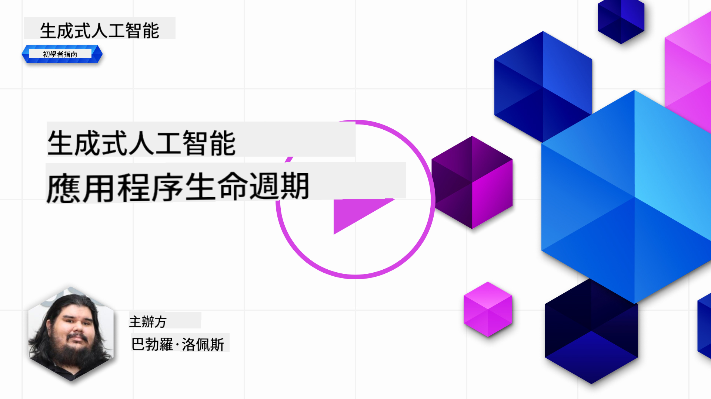
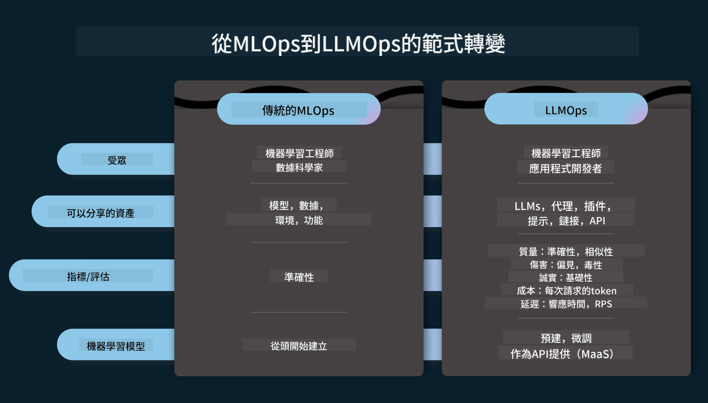
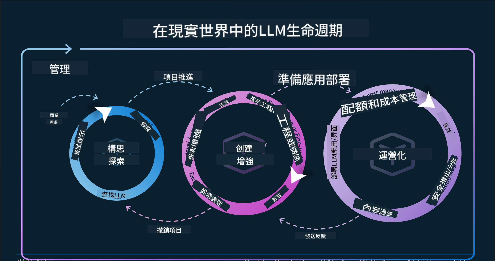
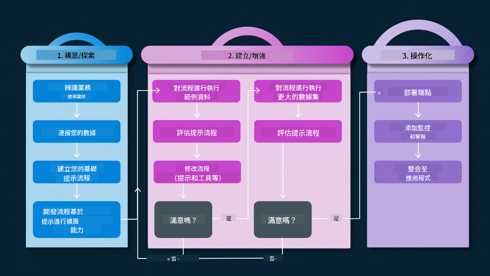
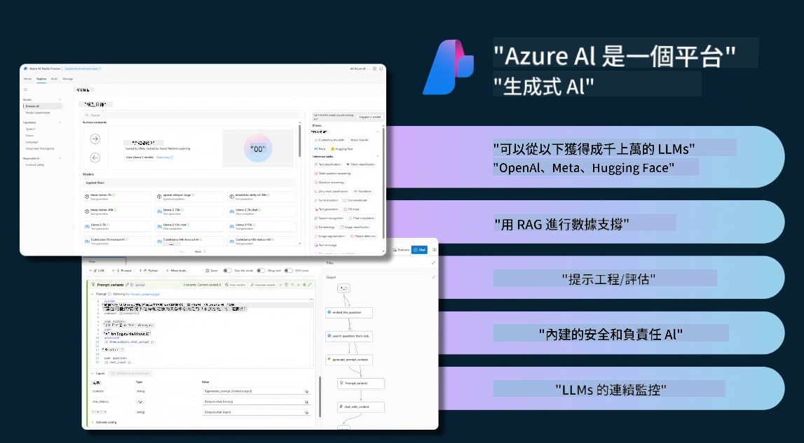
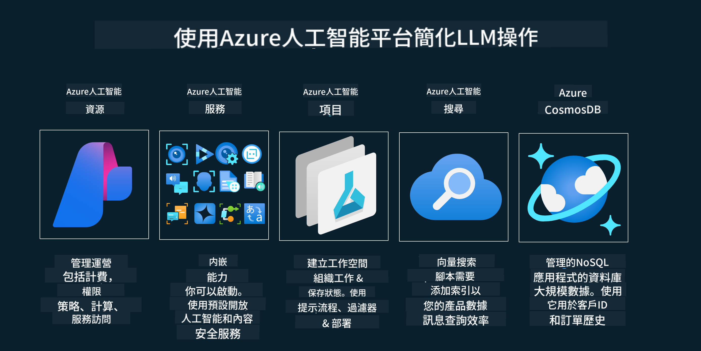
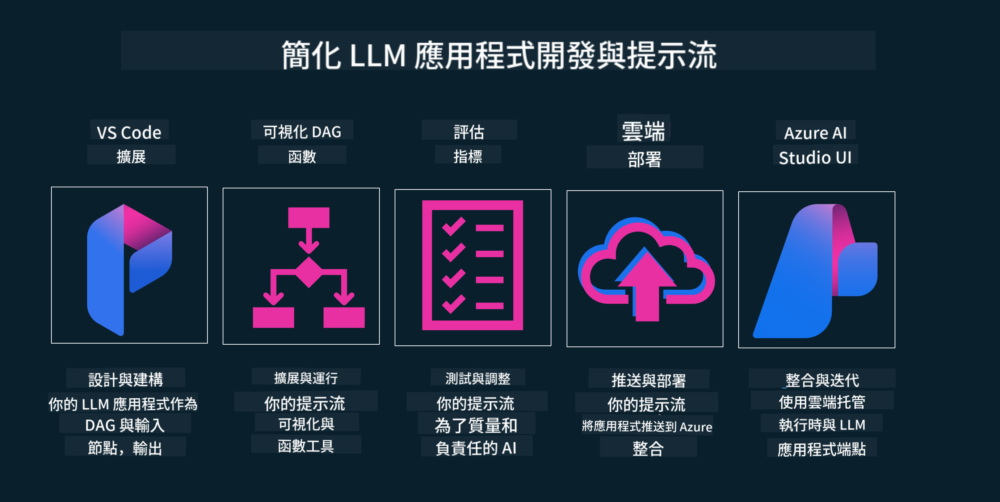

<!--
CO_OP_TRANSLATOR_METADATA:
{
  "original_hash": "27a5347a5022d5ef0a72ab029b03526a",
  "translation_date": "2025-06-25T21:56:46+00:00",
  "source_file": "14-the-generative-ai-application-lifecycle/README.md",
  "language_code": "mo"
}
-->

# 生成式 AI 應用程式生命週期

對所有 AI 應用程式來說，一個重要的問題是 AI 功能的相關性，因為 AI 是一個快速發展的領域。為了確保您的應用程式保持相關性、可靠性和穩健性，您需要持續監控、評估和改進它。這就是生成式 AI 生命週期的作用。

生成式 AI 生命週期是一個框架，指導您開發、部署和維護生成式 AI 應用程式的各個階段。它幫助您定義目標、衡量性能、識別挑戰和實施解決方案。它還幫助您將應用程式與您領域和利害關係人的道德和法律標準對齊。通過遵循生成式 AI 生命週期，您可以確保您的應用程式始終提供價值並滿足用戶的需求。

## 介紹

在本章中，您將：

- 理解從 MLOps 到 LLMOps 的範式轉變
- LLM 生命週期
- 生命週期工具
- 生命週期的衡量與評估

## 理解從 MLOps 到 LLMOps 的範式轉變

LLM 是人工智慧工具庫中的一個新工具，它們在應用程式的分析和生成任務中非常強大。然而，這種強大對我們如何精簡 AI 和經典機器學習任務有一些影響。

因此，我們需要一個新的範式來動態地適應這個工具，並提供正確的激勵措施。我們可以將較舊的 AI 應用程式分類為“ML 應用程式”，而將較新的 AI 應用程式分類為“GenAI 應用程式”或簡稱“AI 應用程式”，以反映當時使用的主流技術和技術。這在多個方面改變了我們的敘述，請參閱以下比較。

請注意，在 LLMOps 中，我們更專注於應用程式開發人員，將整合作為關鍵點，使用“模型即服務”，並考慮以下指標：

- 質量：回應質量
- 傷害：負責任的 AI
- 誠實：回應的可靠性（有意義嗎？正確嗎？）
- 成本：解決方案預算
- 延遲：令牌回應的平均時間

## LLM 生命週期

首先，要理解生命週期和修改，讓我們注意下一個資訊圖表。

如您所見，這與 MLOps 的通常生命週期不同。LLM 有許多新的需求，如提示、改進質量的不同技術（微調、RAG、Meta-Prompts）、負責任 AI 的不同評估和責任，最後是新的評估指標（質量、傷害、誠實、成本和延遲）。

例如，看看我們如何構思。使用提示工程來實驗各種 LLM，以探索可能性，測試其假設是否正確。

請注意，這不是線性的，而是集成的循環，迭代且具有總體循環。

我們如何探索這些步驟？讓我們詳細說明如何構建生命週期。

這可能看起來有點複雜，讓我們首先關注三個大步驟。

1. 構思/探索：探索，在這裡我們可以根據業務需求進行探索。原型設計，創建 [PromptFlow](https://microsoft.github.io/promptflow/index.html?WT.mc_id=academic-105485-koreyst)，並測試其是否足夠有效以支持我們的假設。
2. 構建/增強：實施，現在，我們開始評估更大的數據集，實施技術，如微調和 RAG，以檢查我們解決方案的穩健性。如果不行，重新實施它，添加新步驟到我們的流程或重組數據，可能會有所幫助。在測試我們的流程和規模後，如果有效並檢查我們的指標，它就準備好進入下一步。
3. 操作化：集成，現在將監控和警報系統添加到我們的系統中，部署和應用程式集成到我們的應用程式中。

然後，我們有一個專注於安全性、合規性和治理的總體管理循環。

恭喜，現在您已經準備好您的 AI 應用程式並開始運行。要獲得實踐經驗，請查看 [Contoso Chat Demo.](https://nitya.github.io/contoso-chat/?WT.mc_id=academic-105485-koreys)

現在，我們可以使用哪些工具？

## 生命週期工具

對於工具，Microsoft 提供 [Azure AI Platform](https://azure.microsoft.com/solutions/ai/?WT.mc_id=academic-105485-koreys) 和 [PromptFlow](https://microsoft.github.io/promptflow/index.html?WT.mc_id=academic-105485-koreyst)，方便並讓您的週期易於實施和準備就緒。

[Azure AI Platform](https://azure.microsoft.com/solutions/ai/?WT.mc_id=academic-105485-koreys)，允許您使用 [AI Studio](https://ai.azure.com/?WT.mc_id=academic-105485-koreys)。AI Studio 是一個網頁門戶，允許您探索模型、樣本和工具。管理您的資源、UI 開發流程和 SDK/CLI 選項，以便於代碼優先開發。

Azure AI，允許您使用多個資源，來管理您的操作、服務、項目、向量搜索和數據庫需求。

從概念驗證（POC）到大規模應用，使用 PromptFlow 構建：

- 從 VS Code 設計和構建應用程式，具有視覺和功能工具
- 測試和微調您的應用程式，以便輕鬆獲得高質量的 AI
- 使用 Azure AI Studio 與雲集成和迭代，快速推送和部署

## 太棒了！繼續學習！

精彩，現在學習更多關於我們如何結構化應用程式以使用概念的內容，查看 [Contoso Chat App](https://nitya.github.io/contoso-chat/?WT.mc_id=academic-105485-koreyst)，了解 Cloud Advocacy 如何在演示中添加這些概念。欲了解更多內容，請查看我們的 [Ignite breakout session!](https://www.youtube.com/watch?v=DdOylyrTOWg)

現在，查看第 15 課，了解 [檢索增強生成和向量數據庫](../15-rag-and-vector-databases/README.md?WT.mc_id=academic-105485-koreyst) 如何影響生成式 AI 並創建更具吸引力的應用程式！

**免責聲明**：
本文件使用AI翻譯服務[Co-op Translator](https://github.com/Azure/co-op-translator)進行翻譯。我們力求準確，但請注意，自動翻譯可能包含錯誤或不準確之處。應以原始語言的文件作為權威來源。對於關鍵信息，建議尋求專業人工翻譯。我們對因使用此翻譯而引起的任何誤解或誤釋不承擔責任。