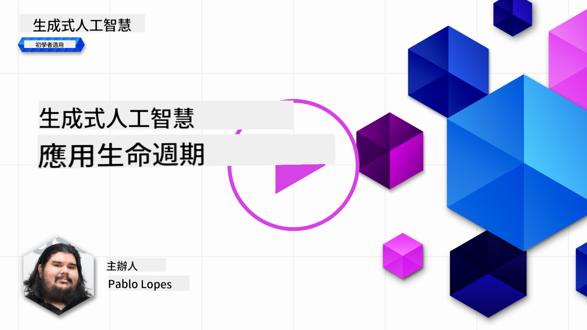
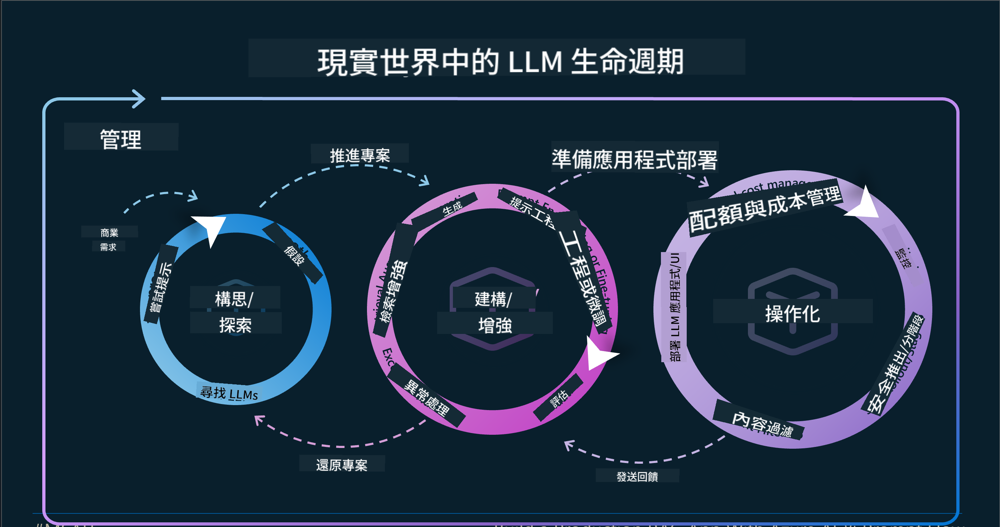
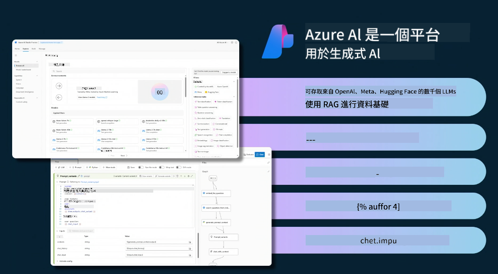
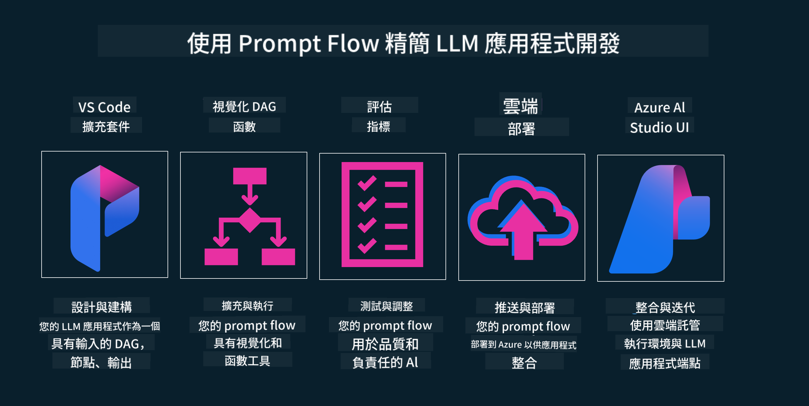

<!--
CO_OP_TRANSLATOR_METADATA:
{
  "original_hash": "b9d32511b27373a1b21b5789d4fda057",
  "translation_date": "2025-10-17T15:16:56+00:00",
  "source_file": "14-the-generative-ai-application-lifecycle/README.md",
  "language_code": "mo"
}
-->

# 生成式 AI 應用生命周期

對所有 AI 應用來說，一個重要的問題是 AI 功能的相關性。由於 AI 是一個快速演進的領域，為了確保您的應用保持相關性、可靠性和穩健性，您需要持續監控、評估並改進它。這就是生成式 AI 生命周期的作用所在。

生成式 AI 生命周期是一個框架，指導您完成開發、部署和維護生成式 AI 應用的各個階段。它幫助您定義目標、衡量性能、識別挑戰並實施解決方案。它還幫助您使應用符合您領域和利益相關者的倫理和法律標準。通過遵循生成式 AI 生命周期，您可以確保您的應用始終提供價值並滿足使用者需求。

## 介紹

在本章中，您將學習：

- 理解從 MLOps 到 LLMOps 的範式轉變
- LLM 生命周期
- 生命周期工具
- 生命周期的指標化與評估

## 理解從 MLOps 到 LLMOps 的範式轉變

LLM 是人工智慧工具庫中的新工具，它在應用的分析和生成任務中非常強大。然而，這種強大也對我們如何簡化 AI 和傳統機器學習任務產生了一些影響。

因此，我們需要一個新的範式來動態適應這個工具，並設置正確的激勵機制。我們可以將舊的 AI 應用分類為「ML 應用」，而新的 AI 應用則分類為「生成式 AI 應用」或簡稱「AI 應用」，以反映當時主流的技術和方法。這在多方面改變了我們的敘述方式，請看以下比較。

注意，在 LLMOps 中，我們更關注應用開發者，將整合作為關鍵點，使用「模型即服務」，並考慮以下指標：

- 質量：回應質量
- 傷害：負責任的 AI
- 誠實：回應的基礎性（是否合理？是否正確？）
- 成本：解決方案預算
- 延遲：每個 token 回應的平均時間

## LLM 生命周期

首先，為了理解生命周期及其修改，請注意以下資訊圖表。

如您所見，這與 MLOps 的常規生命周期不同。LLM 有許多新的需求，例如提示設計、改進質量的不同技術（微調、RAG、Meta-Prompts）、負責任 AI 的不同評估和責任，以及新的評估指標（質量、傷害、誠實、成本和延遲）。

例如，看看我們如何構思。使用提示工程來試驗各種 LLM，探索可能性並測試其假設是否正確。

請注意，這不是線性的，而是整合的迴圈，迭代且具有一個總體循環。

我們如何探索這些步驟？讓我們詳細了解如何構建生命周期。

這可能看起來有點複雜，先專注於三個主要步驟。

1. 構思/探索：探索階段，根據業務需求進行探索。原型設計，創建 [PromptFlow](https://microsoft.github.io/promptflow/index.html?WT.mc_id=academic-105485-koreyst)，並測試其是否足夠高效以支持假設。
2. 建構/增強：實施階段，開始評估更大的數據集，實施技術，例如微調和 RAG，檢查解決方案的穩健性。如果不夠穩健，重新實施，添加新步驟到流程或重構數據可能會有所幫助。測試流程和規模後，如果有效並檢查指標，則準備進入下一步。
3. 操作化：整合階段，現在添加監控和警報系統到系統，部署並將應用整合到您的應用中。

接著，我們有管理的總體循環，專注於安全性、合規性和治理。

恭喜您，現在您的 AI 應用已準備好運行並操作。想要實際操作體驗，請查看 [Contoso Chat Demo](https://nitya.github.io/contoso-chat/?WT.mc_id=academic-105485-koreys)。

那麼，我們可以使用哪些工具呢？

## 生命周期工具

在工具方面，Microsoft 提供了 [Azure AI 平台](https://azure.microsoft.com/solutions/ai/?WT.mc_id=academic-105485-koreys) 和 [PromptFlow](https://microsoft.github.io/promptflow/index.html?WT.mc_id=academic-105485-koreyst)，使您的生命周期更容易實施並準備好使用。

[Azure AI 平台](https://azure.microsoft.com/solutions/ai/?WT.mc_id=academic-105485-koreys) 允許您使用 [AI Studio](https://ai.azure.com/?WT.mc_id=academic-105485-koreys)。AI Studio 是一個網頁入口，讓您探索模型、範例和工具。管理您的資源、UI 開發流程以及 Code-First 開發的 SDK/CLI 選項。

Azure AI 允許您使用多種資源來管理您的操作、服務、項目、向量搜索和數據庫需求。

從概念驗證（POC）到大規模應用，使用 PromptFlow 構建：

- 從 VS Code 設計和構建應用，使用視覺化和功能性工具
- 測試並微調您的應用，以便輕鬆實現高質量 AI
- 使用 Azure AI Studio 與雲端整合和迭代，快速推送和部署進行整合

## 太棒了！繼續學習！

太棒了，現在學習更多關於如何結構化應用以使用這些概念，請查看 [Contoso Chat App](https://nitya.github.io/contoso-chat/?WT.mc_id=academic-105485-koreyst)，了解雲端倡導如何在演示中加入這些概念。更多內容請查看我們的 [Ignite 分組會議！](https://www.youtube.com/watch?v=DdOylyrTOWg)

接下來，查看第 15 課，了解 [檢索增強生成和向量數據庫](../15-rag-and-vector-databases/README.md?WT.mc_id=academic-105485-koreyst) 如何影響生成式 AI，並創建更具吸引力的應用！

---

**免責聲明**：  
本文件已使用 AI 翻譯服務 [Co-op Translator](https://github.com/Azure/co-op-translator) 進行翻譯。儘管我們致力於提供準確的翻譯，請注意自動翻譯可能包含錯誤或不準確之處。原始文件的母語版本應被視為權威來源。對於關鍵資訊，建議使用專業人工翻譯。我們對因使用此翻譯而引起的任何誤解或誤釋不承擔責任。