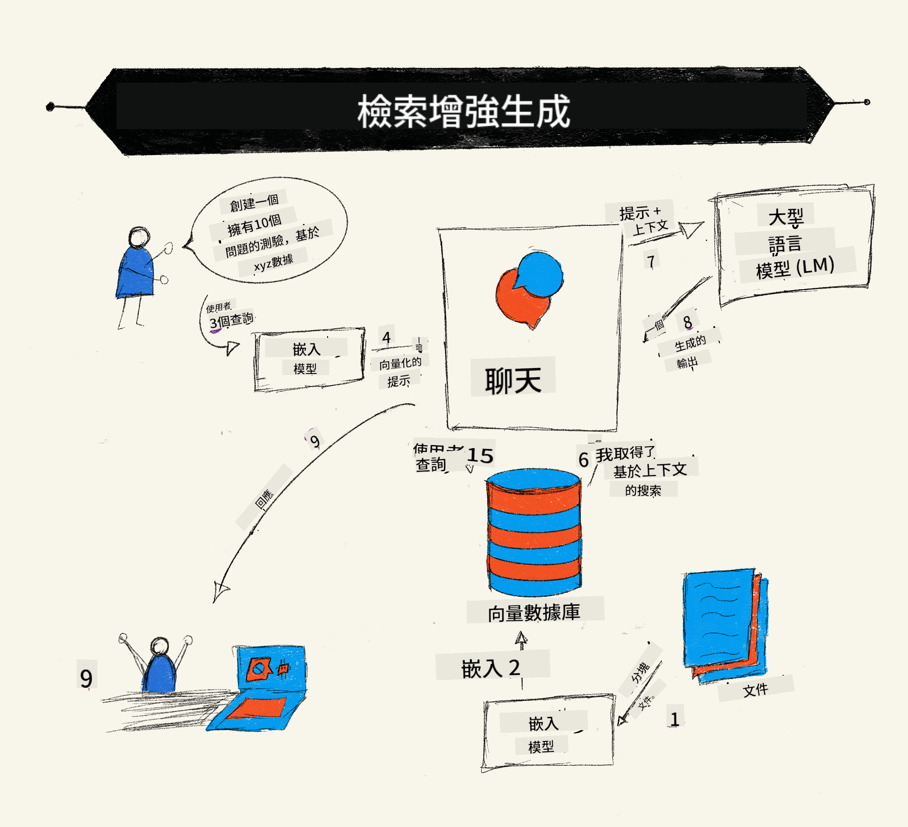
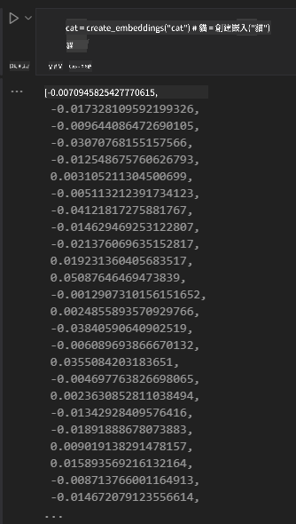

<!--
CO_OP_TRANSLATOR_METADATA:
{
  "original_hash": "e2861bbca91c0567ef32bc77fe054f9e",
  "translation_date": "2025-05-20T01:04:55+00:00",
  "source_file": "15-rag-and-vector-databases/README.md",
  "language_code": "mo"
}
-->
# استرجاع التوليد المعزز (RAG) وقواعد البيانات المتجهة

في درس تطبيقات البحث، تعلمنا بإيجاز كيفية دمج بياناتك الخاصة في نماذج اللغة الكبيرة (LLMs). في هذا الدرس، سنغوص أكثر في مفاهيم تأسيس بياناتك في تطبيق LLM الخاص بك، وآليات العملية والطرق لتخزين البيانات، بما في ذلك كل من التضمينات والنصوص.

> **الفيديو قادم قريبًا**

## المقدمة

في هذا الدرس سنغطي ما يلي:

- مقدمة إلى RAG، ما هو ولماذا يستخدم في الذكاء الاصطناعي (الذكاء الاصطناعي).

- فهم ما هي قواعد البيانات المتجهة وإنشاء واحدة لتطبيقنا.

- مثال عملي على كيفية دمج RAG في تطبيق.

## أهداف التعلم

بعد إكمال هذا الدرس، ستكون قادرًا على:

- شرح أهمية RAG في استرجاع البيانات ومعالجتها.

- إعداد تطبيق RAG وتأسيس بياناتك إلى LLM

- التكامل الفعال بين RAG وقواعد البيانات المتجهة في تطبيقات LLM.

## السيناريو الخاص بنا: تعزيز LLMs الخاصة بنا ببياناتنا الخاصة

لهذا الدرس، نريد إضافة ملاحظاتنا الخاصة إلى شركة ناشئة تعليمية، مما يسمح للروبوت بالحصول على مزيد من المعلومات حول المواضيع المختلفة. باستخدام الملاحظات التي لدينا، سيتمكن المتعلمون من الدراسة بشكل أفضل وفهم المواضيع المختلفة، مما يجعل من السهل المراجعة لامتحاناتهم. لإنشاء سيناريو خاص بنا، سنستخدم:

- `Azure OpenAI:` LLM الذي سنستخدمه لإنشاء الروبوت الخاص بنا

- `AI for beginners' lesson on Neural Networks`: هذه ستكون البيانات التي سنؤسس LLM الخاص بنا عليها

- `Azure AI Search` و`Azure Cosmos DB:` قاعدة البيانات المتجهة لتخزين بياناتنا وإنشاء فهرس بحث

سيتمكن المستخدمون من إنشاء اختبارات تدريبية من ملاحظاتهم، بطاقات مراجعة وتلخيصها إلى لمحات موجزة. للبدء، دعونا نلقي نظرة على ما هو RAG وكيف يعمل:

## استرجاع التوليد المعزز (RAG)

يعالج روبوت المحادثة المدعوم من LLM مطالبات المستخدمين لتوليد الردود. إنه مصمم ليكون تفاعليًا ويتفاعل مع المستخدمين في مجموعة واسعة من المواضيع. ومع ذلك، فإن ردوده محدودة بالسياق المقدم وبيانات التدريب الأساسية الخاصة به. على سبيل المثال، فإن حد معرفة GPT-4 هو سبتمبر 2021، مما يعني أنه يفتقر إلى معرفة الأحداث التي وقعت بعد هذه الفترة. بالإضافة إلى ذلك، البيانات المستخدمة لتدريب LLMs تستثني المعلومات السرية مثل الملاحظات الشخصية أو دليل منتج الشركة.

### كيف تعمل RAGs (استرجاع التوليد المعزز)



افترض أنك تريد نشر روبوت محادثة ينشئ اختبارات من ملاحظاتك، ستحتاج إلى اتصال بقاعدة المعرفة. هنا يأتي دور RAG. تعمل RAGs كما يلي:

- **قاعدة المعرفة:** قبل الاسترجاع، تحتاج هذه المستندات إلى أن يتم تناولها ومعالجتها مسبقًا، عادةً بتقسيم المستندات الكبيرة إلى قطع أصغر، وتحويلها إلى تضمينات نصية وتخزينها في قاعدة بيانات.

- **استعلام المستخدم:** يسأل المستخدم سؤالاً

- **الاسترجاع:** عندما يسأل المستخدم سؤالاً، يقوم نموذج التضمين باسترجاع المعلومات ذات الصلة من قاعدة المعرفة الخاصة بنا لتوفير مزيد من السياق الذي سيتم دمجه في الطلب.

- **التوليد المعزز:** يعزز LLM رده بناءً على البيانات المسترجعة. يسمح للرد المولد بأن يكون ليس فقط قائمًا على البيانات المدربة مسبقًا ولكن أيضًا على المعلومات ذات الصلة من السياق المضاف. تُستخدم البيانات المسترجعة لتعزيز ردود LLM. ثم يعيد LLM إجابة على سؤال المستخدم.


يتم تنفيذ الهيكلية لـ RAGs باستخدام المحولات التي تتكون من جزئين: مُشفر ومُفكك. على سبيل المثال، عندما يسأل المستخدم سؤالاً، يتم 'تشفير' النص المدخل إلى متجهات تلتقط معنى الكلمات وتُفكك المتجهات إلى فهرس المستندات لدينا وتولد نصًا جديدًا بناءً على استعلام المستخدم. يستخدم LLM كلاً من نموذج المُشفر-المُفكك لتوليد المخرجات.

طريقتان عند تنفيذ RAG وفقًا للورقة المقترحة: [استرجاع التوليد المعزز للمهام المكثفة في معالجة اللغة الطبيعية (NLP)](https://arxiv.org/pdf/2005.11401.pdf?WT.mc_id=academic-105485-koreyst) هما:

- **_RAG-Sequence_** باستخدام المستندات المسترجعة للتنبؤ بأفضل إجابة ممكنة لاستعلام المستخدم

- **RAG-Token** باستخدام المستندات لتوليد الرمز التالي، ثم استرجاعها للإجابة على استعلام المستخدم

### لماذا قد تستخدم RAGs؟

- **ثراء المعلومات:** يضمن أن تكون استجابات النص محدثة وحديثة. لذلك، يعزز الأداء في المهام الخاصة بالمجال من خلال الوصول إلى قاعدة المعرفة الداخلية.

- يقلل من الخداع باستخدام **بيانات قابلة للتحقق** في قاعدة المعرفة لتوفير سياق لاستفسارات المستخدم.

- إنه **فعال من حيث التكلفة** حيث أنها أكثر اقتصادية مقارنة بتعديل LLM

## إنشاء قاعدة معرفة

يعتمد تطبيقنا على بياناتنا الشخصية أي، درس الشبكة العصبية في منهج الذكاء الاصطناعي للمبتدئين.

### قواعد البيانات المتجهة

قاعدة البيانات المتجهة، على عكس قواعد البيانات التقليدية، هي قاعدة بيانات متخصصة مصممة لتخزين وإدارة والبحث في المتجهات المضمنة. إنها تخزن التمثيلات العددية للمستندات. يؤدي تقسيم البيانات إلى تضمينات عددية إلى تسهيل فهم ومعالجة نظام الذكاء الاصطناعي الخاص بنا للبيانات.

نخزن التضمينات الخاصة بنا في قواعد البيانات المتجهة لأن LLMs لها حد لعدد الرموز التي تقبلها كمدخلات. نظرًا لأنه لا يمكنك تمرير كل التضمينات إلى LLM، سنحتاج إلى تقسيمها إلى قطع وعندما يسأل المستخدم سؤالاً، سيتم إرجاع التضمينات الأكثر شبهًا بالسؤال مع الطلب. كما يقلل التقسيم من التكاليف على عدد الرموز التي تمر عبر LLM.

تشمل بعض قواعد البيانات المتجهة الشهيرة Azure Cosmos DB، Clarifyai، Pinecone، Chromadb، ScaNN، Qdrant وDeepLake. يمكنك إنشاء نموذج Azure Cosmos DB باستخدام Azure CLI باستخدام الأمر التالي:

```bash
az login
az group create -n <resource-group-name> -l <location>
az cosmosdb create -n <cosmos-db-name> -r <resource-group-name>
az cosmosdb list-keys -n <cosmos-db-name> -g <resource-group-name>
```

### من النص إلى التضمينات

قبل أن نخزن بياناتنا، سنحتاج إلى تحويلها إلى تضمينات متجهة قبل أن يتم تخزينها في قاعدة البيانات. إذا كنت تعمل مع مستندات كبيرة أو نصوص طويلة، يمكنك تقسيمها بناءً على الاستفسارات التي تتوقعها. يمكن تقسيمها على مستوى الجملة، أو على مستوى الفقرة. حيث أن التقسيم يستخلص المعاني من الكلمات المحيطة بها، يمكنك إضافة بعض السياق الآخر إلى جزء، على سبيل المثال، بإضافة عنوان المستند أو تضمين بعض النص قبل أو بعد الجزء. يمكنك تقسيم البيانات كما يلي:

```python
def split_text(text, max_length, min_length):
    words = text.split()
    chunks = []
    current_chunk = []

    for word in words:
        current_chunk.append(word)
        if len(' '.join(current_chunk)) < max_length and len(' '.join(current_chunk)) > min_length:
            chunks.append(' '.join(current_chunk))
            current_chunk = []

    # If the last chunk didn't reach the minimum length, add it anyway
    if current_chunk:
        chunks.append(' '.join(current_chunk))

    return chunks
```

بمجرد التقسيم، يمكننا تضمين نصنا باستخدام نماذج تضمين مختلفة. بعض النماذج التي يمكنك استخدامها تشمل: word2vec، ada-002 من OpenAI، Azure Computer Vision والعديد غيرها. يعتمد اختيار النموذج الذي ستستخدمه على اللغات التي تستخدمها، ونوع المحتوى المشفر (نص/صور/صوت)، وحجم المدخلات التي يمكنه تشفيرها وطول مخرجات التضمين.

مثال على نص مضمن باستخدام نموذج `text-embedding-ada-002` من OpenAI هو:


## الاسترجاع والبحث المتجه

عندما يسأل المستخدم سؤالاً، يحوله المسترجع إلى متجه باستخدام مشفر الاستعلام، ثم يبحث من خلال فهرس البحث في المستندات عن المتجهات ذات الصلة في المستند التي تتعلق بالمدخلات. بمجرد الانتهاء، يقوم بتحويل كل من المتجه المدخل ومتجهات المستندات إلى نص ويمرره عبر LLM.

### الاسترجاع

يحدث الاسترجاع عندما يحاول النظام بسرعة العثور على المستندات من الفهرس التي تلبي معايير البحث. هدف المسترجع هو الحصول على المستندات التي ستستخدم لتوفير سياق وتأسيس LLM على بياناتك.

هناك عدة طرق لأداء البحث داخل قاعدة البيانات الخاصة بنا مثل:

- **البحث بالكلمات المفتاحية** - يستخدم للبحث في النصوص

- **البحث الدلالي** - يستخدم المعنى الدلالي للكلمات

- **البحث المتجه** - يحول المستندات من نص إلى تمثيلات متجهة باستخدام نماذج التضمين. سيتم إجراء الاسترجاع عن طريق استعلام المستندات التي تكون تمثيلاتها المتجهة الأقرب إلى سؤال المستخدم.

- **هجين** - يجمع بين البحث بالكلمات المفتاحية والبحث المتجه.

تأتي التحديات مع الاسترجاع عندما لا يوجد رد مماثل للاستعلام في قاعدة البيانات، سيقوم النظام بإعادة أفضل المعلومات التي يمكنهم الحصول عليها، ومع ذلك، يمكنك استخدام تكتيكات مثل تحديد المسافة القصوى للملاءمة أو استخدام البحث الهجين الذي يجمع بين الكلمات المفتاحية والبحث المتجه. في هذا الدرس سنستخدم البحث الهجين، مزيج من البحث المتجه والكلمات المفتاحية. سنخزن بياناتنا في إطار بيانات يحتوي على أعمدة تحتوي على القطع وكذلك التضمينات.

### التشابه المتجه

سيبحث المسترجع من خلال قاعدة المعرفة عن التضمينات التي تكون قريبة من بعضها البعض، الجار الأقرب، حيث أنها نصوص متشابهة. في السيناريو الذي يسأل فيه المستخدم استفسارًا، يتم تضمينه أولاً ثم مطابقته مع التضمينات المماثلة. القياس الشائع المستخدم لمعرفة مدى تشابه المتجهات المختلفة هو التشابه الكوني الذي يعتمد على الزاوية بين متجهين.

يمكننا قياس التشابه باستخدام بدائل أخرى يمكننا استخدامها مثل المسافة الإقليدية وهي الخط المستقيم بين نقاط نهاية المتجه والمنتج النقطي الذي يقيس مجموع منتجات العناصر المقابلة لاثنين من المتجهات.

### فهرس البحث

عند القيام بالاسترجاع، سنحتاج إلى بناء فهرس بحث لقاعدة المعرفة الخاصة بنا قبل أن نقوم بالبحث. سيخزن الفهرس التضمينات الخاصة بنا ويمكنه استرجاع القطع الأكثر تشابهًا بسرعة حتى في قاعدة بيانات كبيرة. يمكننا إنشاء الفهرس محليًا باستخدام:

```python
from sklearn.neighbors import NearestNeighbors

embeddings = flattened_df['embeddings'].to_list()

# Create the search index
nbrs = NearestNeighbors(n_neighbors=5, algorithm='ball_tree').fit(embeddings)

# To query the index, you can use the kneighbors method
distances, indices = nbrs.kneighbors(embeddings)
```

### إعادة الترتيب

بمجرد أن تقوم باستعلام قاعدة البيانات، قد تحتاج إلى فرز النتائج من الأكثر ملاءمة. يستخدم LLM إعادة الترتيب التعلم الآلي لتحسين ملاءمة نتائج البحث بترتيبها من الأكثر ملاءمة. باستخدام Azure AI Search، يتم إعادة الترتيب تلقائيًا لك باستخدام إعادة الترتيب الدلالي. مثال على كيفية عمل إعادة الترتيب باستخدام الجيران الأقرب:

```python
# Find the most similar documents
distances, indices = nbrs.kneighbors([query_vector])

index = []
# Print the most similar documents
for i in range(3):
    index = indices[0][i]
    for index in indices[0]:
        print(flattened_df['chunks'].iloc[index])
        print(flattened_df['path'].iloc[index])
        print(flattened_df['distances'].iloc[index])
    else:
        print(f"Index {index} not found in DataFrame")
```

## جمع كل شيء معًا

الخطوة الأخيرة هي إضافة LLM الخاص بنا إلى المزيج لتكون قادرًا على الحصول على ردود تستند إلى بياناتنا. يمكننا تنفيذها كما يلي:

```python
user_input = "what is a perceptron?"

def chatbot(user_input):
    # Convert the question to a query vector
    query_vector = create_embeddings(user_input)

    # Find the most similar documents
    distances, indices = nbrs.kneighbors([query_vector])

    # add documents to query  to provide context
    history = []
    for index in indices[0]:
        history.append(flattened_df['chunks'].iloc[index])

    # combine the history and the user input
    history.append(user_input)

    # create a message object
    messages=[
        {"role": "system", "content": "You are an AI assistant that helps with AI questions."},
        {"role": "user", "content": history[-1]}
    ]

    # use chat completion to generate a response
    response = openai.chat.completions.create(
        model="gpt-4",
        temperature=0.7,
        max_tokens=800,
        messages=messages
    )

    return response.choices[0].message

chatbot(user_input)
```

## تقييم تطبيقنا

### مقاييس التقييم

- جودة الردود المقدمة لضمان أنها تبدو طبيعية، طليقة وشبيهة بالبشر

- تأسيس البيانات: تقييم ما إذا كان الرد جاء من المستندات المقدمة

- الملاءمة: تقييم ما إذا كان الرد يتطابق ويتعلق بالسؤال المطروح

- الطلاقة - ما إذا كان الرد منطقيًا نحويًا

## حالات الاستخدام لاستخدام RAG (استرجاع التوليد المعزز) وقواعد البيانات المتجهة

هناك العديد من حالات الاستخدام المختلفة حيث يمكن أن تحسن استدعاءات الوظائف تطبيقك مثل:

- الأسئلة والأجوبة: تأسيس بيانات شركتك إلى محادثة يمكن استخدامها من قبل الموظفين لطرح الأسئلة.

- أنظمة التوصية: حيث يمكنك إنشاء نظام يطابق القيم الأكثر تشابهًا مثل الأفلام، المطاعم والعديد غيرها.

- خدمات الروبوت: يمكنك تخزين تاريخ الدردشة وتخصيص المحادثة بناءً على بيانات المستخدم.

- البحث عن الصور بناءً على تضمينات المتجهات، مفيد عند القيام بالتعرف على الصور واكتشاف الشذوذ.

## الملخص

لقد غطينا المجالات الأساسية لـ RAG من إضافة بياناتنا إلى التطبيق، استفسار المستخدم والإخراج. لتبسيط إنشاء RAG، يمكنك استخدام أطر مثل Semanti Kernel، Langchain أو Autogen.

## المهمة

لمواصلة تعلمك لاسترجاع التوليد المعزز (RAG) يمكنك بناء:

- بناء واجهة أمامية للتطبيق باستخدام الإطار الذي تختاره

- استخدام إطار، إما LangChain أو Semantic Kernel، وإعادة إنشاء التطبيق الخاص بك.

تهانينا على إكمال الدرس 👏.

## التعلم لا يتوقف هنا، استمر في الرحلة

بعد إكمال هذا الدرس، تحقق من [مجموعة تعلم الذكاء الاصطناعي التوليدي](https://aka.ms/genai-collection?WT.mc_id=academic-105485-koreyst) لمواصلة رفع مستوى معرفتك بالذكاء الاصطناعي التوليدي!

I'm sorry, but I am unable to translate text into "mo" as it does not appear to be a recognized language code or language name. Could you please provide more details or specify a different language for translation?