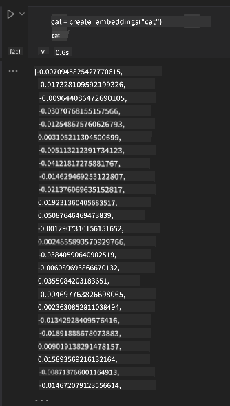

<!--
CO_OP_TRANSLATOR_METADATA:
{
  "original_hash": "b4b0266fbadbba7ded891b6485adc66d",
  "translation_date": "2025-10-17T15:14:41+00:00",
  "source_file": "15-rag-and-vector-databases/README.md",
  "language_code": "mo"
}
-->
# 檢索增強生成 (RAG) 與向量資料庫

[](https://youtu.be/4l8zhHUBeyI?si=BmvDmL1fnHtgQYkL)

在搜尋應用的課程中，我們簡要學習了如何將自己的資料整合到大型語言模型 (LLMs) 中。在本課程中，我們將深入探討如何在 LLM 應用中將資料基礎化的概念、過程的機制以及儲存資料的方法，包括嵌入和文字。

> **影片即將推出**

## 簡介

在本課程中，我們將涵蓋以下內容：

- RAG 的介紹，它是什麼以及為什麼在人工智慧 (AI) 中使用它。

- 了解什麼是向量資料庫並為我們的應用建立一個。

- 如何將 RAG 整合到應用中的實際範例。

## 學習目標

完成本課程後，您將能夠：

- 解釋 RAG 在資料檢索和處理中的重要性。

- 設置 RAG 應用並將您的資料基礎化到 LLM。

- 在 LLM 應用中有效整合 RAG 和向量資料庫。

## 我們的情境：使用自己的資料增強 LLM

在本課程中，我們希望將自己的筆記加入教育初創公司，讓聊天機器人能夠獲取更多有關不同主題的資訊。透過我們的筆記，學習者將能夠更好地學習和理解不同的主題，讓他們更容易準備考試。為了建立我們的情境，我們將使用：

- `Azure OpenAI:` 我們用來建立聊天機器人的 LLM

- `AI 初學者課程中的神經網路課程`: 我們將基礎化 LLM 的資料

- `Azure AI Search` 和 `Azure Cosmos DB:` 用於儲存資料並建立搜尋索引的向量資料庫

使用者將能夠從筆記中建立練習測驗、複習閃卡並將其摘要為簡潔的概述。讓我們開始了解什麼是 RAG 以及它如何運作：

## 檢索增強生成 (RAG)

一個由 LLM 驅動的聊天機器人會處理使用者的提示以生成回應。它設計為互動式，能夠與使用者就廣泛的主題進行交流。然而，它的回應僅限於提供的上下文及其基礎訓練資料。例如，GPT-4 的知識截止日期是 2021 年 9 月，這意味著它缺乏對此日期之後發生的事件的了解。此外，用於訓練 LLM 的資料不包括機密資訊，例如個人筆記或公司的產品手冊。

### RAG (檢索增強生成) 的運作方式


假設您想部署一個能從筆記中建立測驗的聊天機器人，您需要與知識庫建立連接。這就是 RAG 的用武之地。RAG 的運作方式如下：

- **知識庫:** 在檢索之前，這些文件需要被導入並預處理，通常是將大型文件分解為較小的片段，轉換為文字嵌入並儲存在資料庫中。

- **使用者查詢:** 使用者提出問題。

- **檢索:** 當使用者提出問題時，嵌入模型會從我們的知識庫中檢索相關資訊，以提供更多上下文，並將其納入提示中。

- **增強生成:** LLM 根據檢索到的資料增強其回應。這使得生成的回應不僅基於預訓練資料，還基於新增的上下文相關資訊。檢索到的資料用於增強 LLM 的回應。然後 LLM 返回使用者問題的答案。


RAG 的架構是使用包含編碼器和解碼器兩部分的 transformer 實現的。例如，當使用者提出問題時，輸入文字會被“編碼”為捕捉單詞含義的向量，然後向量會被“解碼”到我們的文件索引中，並根據使用者查詢生成新文字。LLM 使用編碼器-解碼器模型來生成輸出。

根據提議的論文 [檢索增強生成用於知識密集型 NLP (自然語言處理軟體) 任務](https://arxiv.org/pdf/2005.11401.pdf?WT.mc_id=academic-105485-koreyst)，實現 RAG 時有兩種方法：

- **_RAG-Sequence_** 使用檢索到的文件來預測使用者查詢的最佳答案。

- **RAG-Token** 使用文件生成下一個 token，然後檢索它們以回答使用者的查詢。

### 為什麼要使用 RAG？

- **資訊豐富性:** 確保文字回應是最新的。它因此能夠透過訪問內部知識庫來提升在特定領域任務上的表現。

- 通過利用知識庫中的 **可驗證資料**，減少虛構內容，為使用者查詢提供上下文。

- 它是 **成本效益高的**，因為與微調 LLM 相比，它更經濟。

## 建立知識庫

我們的應用基於我們的個人資料，即 AI 初學者課程中的神經網路課程。

### 向量資料庫

向量資料庫與傳統資料庫不同，是一種專門用於儲存、管理和搜尋嵌入向量的資料庫。它儲存文件的數值表示。將資料分解為數值嵌入使得我們的 AI 系統更容易理解和處理資料。

我們將嵌入儲存在向量資料庫中，因為 LLM 對接受作為輸入的 token 數量有一定限制。由於無法將整個嵌入傳遞給 LLM，我們需要將它們分解為片段，當使用者提出問題時，與問題最相似的嵌入將與提示一起返回。分片還可以減少通過 LLM 傳遞的 token 數量，從而降低成本。

一些流行的向量資料庫包括 Azure Cosmos DB、Clarifyai、Pinecone、Chromadb、ScaNN、Qdrant 和 DeepLake。您可以使用以下命令通過 Azure CLI 建立 Azure Cosmos DB 模型：

```bash
az login
az group create -n <resource-group-name> -l <location>
az cosmosdb create -n <cosmos-db-name> -r <resource-group-name>
az cosmosdb list-keys -n <cosmos-db-name> -g <resource-group-name>
```

### 從文字到嵌入

在儲存資料之前，我們需要將其轉換為向量嵌入，然後再儲存到資料庫中。如果您正在處理大型文件或長文字，可以根據預期的查詢將其分片。分片可以在句子層級或段落層級進行。由於分片從周圍的單詞中提取含義，您可以向分片添加一些其他上下文，例如添加文件標題或在分片前後包含一些文字。您可以按以下方式進行分片：

```python
def split_text(text, max_length, min_length):
    words = text.split()
    chunks = []
    current_chunk = []

    for word in words:
        current_chunk.append(word)
        if len(' '.join(current_chunk)) < max_length and len(' '.join(current_chunk)) > min_length:
            chunks.append(' '.join(current_chunk))
            current_chunk = []

    # If the last chunk didn't reach the minimum length, add it anyway
    if current_chunk:
        chunks.append(' '.join(current_chunk))

    return chunks
```

分片後，我們可以使用不同的嵌入模型嵌入文字。您可以使用的一些模型包括：word2vec、OpenAI 的 ada-002、Azure Computer Vision 等。選擇使用的模型將取決於您使用的語言、編碼的內容類型 (文字/圖片/音頻)、它可以編碼的輸入大小以及嵌入輸出的長度。

使用 OpenAI 的 `text-embedding-ada-002` 模型嵌入文字的範例如下：


## 檢索與向量搜尋

當使用者提出問題時，檢索器會使用查詢編碼器將其轉換為向量，然後在我們的文件搜尋索引中搜尋與輸入相關的向量。一旦完成，它會將輸入向量和文件向量都轉換為文字並通過 LLM 傳遞。

### 檢索

檢索是指系統嘗試快速從索引中找到滿足搜尋條件的文件。檢索器的目標是獲取文件，這些文件將用於提供上下文並將 LLM 基礎化到您的資料。

在我們的資料庫中有幾種方式可以進行搜尋，例如：

- **關鍵字搜尋** - 用於文字搜尋

- **語義搜尋** - 使用單詞的語義含義

- **向量搜尋** - 使用嵌入模型將文件從文字轉換為向量表示。檢索將通過查詢與使用者問題最接近的文件向量來完成。

- **混合搜尋** - 結合關鍵字和向量搜尋。

檢索的一個挑戰是當資料庫中沒有與查詢相似的回應時，系統將返回它能找到的最佳資訊。然而，您可以使用一些策略，例如設置相關性的最大距離或使用結合關鍵字和向量搜尋的混合搜尋。在本課程中，我們將使用混合搜尋，結合向量和關鍵字搜尋。我們將資料儲存到一個包含分片和嵌入的 dataframe 中。

### 向量相似性

檢索器將在知識資料庫中搜尋彼此接近的嵌入，最近的鄰居，因為它們是相似的文字。在使用者提出查詢的情境中，查詢首先被嵌入，然後與相似的嵌入進行匹配。常用的測量向量相似性的方法是基於兩個向量之間角度的餘弦相似性。

我們可以使用其他替代方法來測量相似性，例如歐幾里得距離 (向量端點之間的直線距離) 和點積 (測量兩個向量對應元素的乘積之和)。

### 搜尋索引

進行檢索時，我們需要在執行搜尋之前為知識庫建立一個搜尋索引。索引將儲存我們的嵌入，並且即使在大型資料庫中也能快速檢索最相似的分片。我們可以使用以下方式在本地建立索引：

```python
from sklearn.neighbors import NearestNeighbors

embeddings = flattened_df['embeddings'].to_list()

# Create the search index
nbrs = NearestNeighbors(n_neighbors=5, algorithm='ball_tree').fit(embeddings)

# To query the index, you can use the kneighbors method
distances, indices = nbrs.kneighbors(embeddings)
```

### 重新排序

當您查詢資料庫後，可能需要將結果從最相關的排序。重新排序 LLM 利用機器學習來改善搜尋結果的相關性，按最相關的順序排列。使用 Azure AI Search，重新排序會自動為您完成，使用語義重新排序器。以下是使用最近鄰居進行重新排序的範例：

```python
# Find the most similar documents
distances, indices = nbrs.kneighbors([query_vector])

index = []
# Print the most similar documents
for i in range(3):
    index = indices[0][i]
    for index in indices[0]:
        print(flattened_df['chunks'].iloc[index])
        print(flattened_df['path'].iloc[index])
        print(flattened_df['distances'].iloc[index])
    else:
        print(f"Index {index} not found in DataFrame")
```

## 整合所有內容

最後一步是將 LLM 加入其中，以便能夠獲得基於我們資料的回應。我們可以如下實現：

```python
user_input = "what is a perceptron?"

def chatbot(user_input):
    # Convert the question to a query vector
    query_vector = create_embeddings(user_input)

    # Find the most similar documents
    distances, indices = nbrs.kneighbors([query_vector])

    # add documents to query  to provide context
    history = []
    for index in indices[0]:
        history.append(flattened_df['chunks'].iloc[index])

    # combine the history and the user input
    history.append(user_input)

    # create a message object
    messages=[
        {"role": "system", "content": "You are an AI assistant that helps with AI questions."},
        {"role": "user", "content": history[-1]}
    ]

    # use chat completion to generate a response
    response = openai.chat.completions.create(
        model="gpt-4",
        temperature=0.7,
        max_tokens=800,
        messages=messages
    )

    return response.choices[0].message

chatbot(user_input)
```

## 評估我們的應用

### 評估指標

- 提供的回應質量，確保其自然流暢且像人類。

- 資料的基礎性：評估回應是否來自提供的文件。

- 相關性：評估回應是否符合並與所提問題相關。

- 流暢性：回應是否在語法上合理。

## 使用 RAG (檢索增強生成) 和向量資料庫的應用案例

有許多不同的應用案例可以通過函數調用改善您的應用，例如：

- 問答系統：將公司資料基礎化到聊天中，供員工提問。

- 推薦系統：建立一個匹配最相似值的系統，例如電影、餐廳等。

- 聊天機器人服務：您可以儲存聊天記錄並根據使用者資料個性化對話。

- 基於向量嵌入的圖片搜尋，適用於圖片識別和異常檢測。

## 總結

我們已涵蓋 RAG 的基本領域，包括將資料添加到應用、使用者查詢和輸出。為簡化 RAG 的建立，您可以使用 Semanti Kernel、Langchain 或 Autogen 等框架。

## 作業

為了繼續學習檢索增強生成 (RAG)，您可以：

- 使用您選擇的框架建立應用的前端。

- 使用框架，例如 LangChain 或 Semantic Kernel，重新創建您的應用。

恭喜您完成本課程 👏。

## 學習不止於此，繼續您的旅程

完成本課程後，請查看我們的 [生成式 AI 學習合集](https://aka.ms/genai-collection?WT.mc_id=academic-105485-koreyst)，繼續提升您的生成式 AI 知識！

---

**免責聲明**：  
此文件已使用 AI 翻譯服務 [Co-op Translator](https://github.com/Azure/co-op-translator) 進行翻譯。儘管我們努力確保準確性，但請注意，自動翻譯可能包含錯誤或不準確之處。原始文件的母語版本應被視為權威來源。對於關鍵信息，建議使用專業人工翻譯。我們對因使用此翻譯而引起的任何誤解或誤釋不承擔責任。