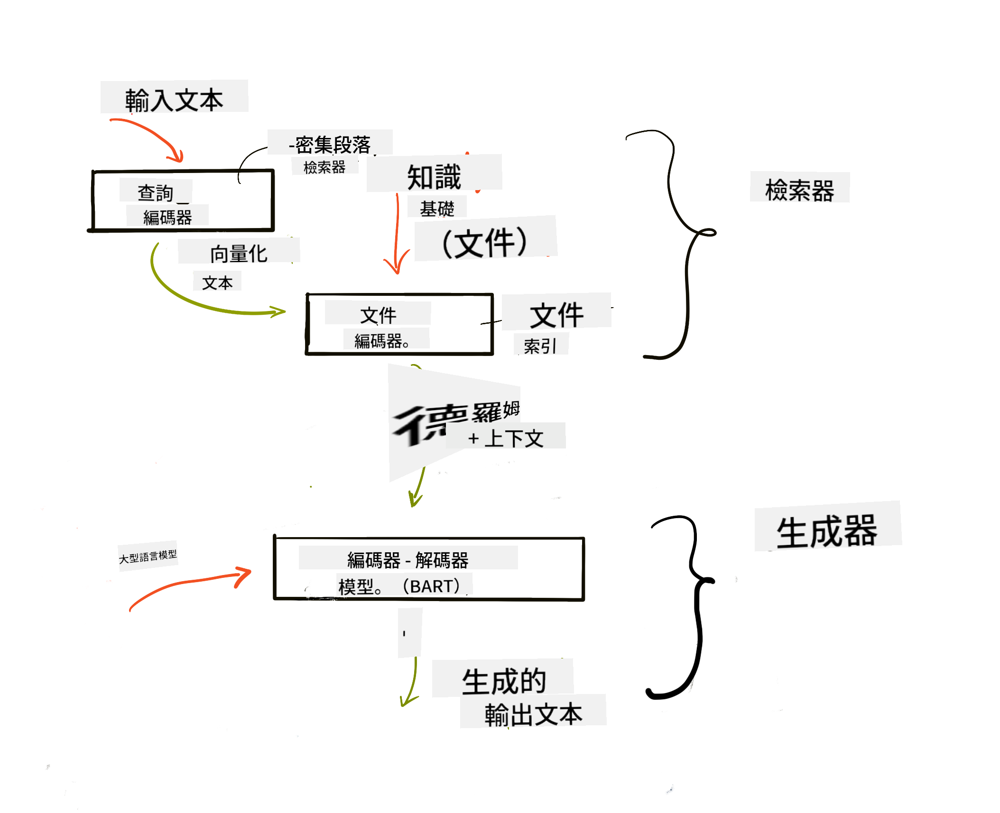

<!--
CO_OP_TRANSLATOR_METADATA:
{
  "original_hash": "e2861bbca91c0567ef32bc77fe054f9e",
  "translation_date": "2025-07-09T16:04:57+00:00",
  "source_file": "15-rag-and-vector-databases/README.md",
  "language_code": "mo"
}
-->
# Retrieval Augmented Generation (RAG) 與向量資料庫

[](https://aka.ms/gen-ai-lesson15-gh?WT.mc_id=academic-105485-koreyst)

在搜尋應用課程中，我們簡單了解了如何將自己的資料整合到大型語言模型（LLMs）中。本課程將更深入探討如何在 LLM 應用中紮根你的資料、過程的運作機制以及資料儲存的方法，包括向量嵌入和文字資料。

> **影片即將推出**

## 介紹

本課程將涵蓋以下內容：

- 介紹 RAG 是什麼，以及為什麼在人工智慧（AI）中會使用它。

- 了解向量資料庫的概念，並為我們的應用建立一個。

- 實作範例，示範如何將 RAG 整合到應用程式中。

## 學習目標

完成本課程後，你將能夠：

- 解釋 RAG 在資料檢索與處理中的重要性。

- 設定 RAG 應用並將資料紮根於 LLM。

- 有效整合 RAG 與向量資料庫於 LLM 應用中。

## 我們的情境：用自己的資料強化 LLM

本課程中，我們希望將自己的筆記加入教育新創平台，讓聊天機器人能取得更多不同主題的資訊。利用這些筆記，學習者能更有效地學習並理解各種主題，讓複習考試變得更輕鬆。為了建立此情境，我們將使用：

- `Azure OpenAI`：我們用來建立聊天機器人的 LLM。

- `AI for beginners' lesson on Neural Networks`：作為我們紮根 LLM 的資料。

- `Azure AI Search` 與 `Azure Cosmos DB`：用來儲存資料的向量資料庫並建立搜尋索引。

使用者將能從筆記中建立練習測驗、複習閃卡，並將內容摘要成簡潔的概覽。首先，讓我們了解什麼是 RAG 以及它的運作方式：

## Retrieval Augmented Generation (RAG)

由 LLM 驅動的聊天機器人會處理使用者的提示並生成回應。它設計為互動式，能與使用者討論各種主題。然而，它的回應受限於提供的上下文與基礎訓練資料。例如，GPT-4 的知識截止於 2021 年 9 月，代表它無法得知此後發生的事件。此外，訓練 LLM 所用的資料不包含機密資訊，如個人筆記或公司的產品手冊。

### RAG（Retrieval Augmented Generation）的運作方式


假設你想部署一個能從筆記中製作測驗的聊天機器人，你就需要連接知識庫。這時 RAG 就派上用場。RAG 的運作流程如下：

- **知識庫**：在檢索之前，文件需要被導入並預處理，通常會將大型文件拆分成較小的區塊，轉換成文字嵌入，並儲存在資料庫中。

- **使用者查詢**：使用者提出問題。

- **檢索**：當使用者提問時，嵌入模型會從知識庫中檢索相關資訊，提供更多上下文，並納入提示中。

- **增強生成**：LLM 根據檢索到的資料強化回應。這讓生成的回答不僅基於預訓練資料，也包含新增的相關資訊。檢索到的資料用來增強 LLM 的回應，LLM 最終回覆使用者的問題。



RAG 架構是利用 transformer 實作，包含兩個部分：編碼器與解碼器。例如，當使用者提問時，輸入文字會被「編碼」成向量，捕捉詞彙的意義，這些向量會被「解碼」到文件索引中，並根據使用者查詢生成新文字。LLM 使用編碼器-解碼器模型來產生輸出。

根據論文 [Retrieval-Augmented Generation for Knowledge intensive NLP (natural language processing software) Tasks](https://arxiv.org/pdf/2005.11401.pdf?WT.mc_id=academic-105485-koreyst)，實作 RAG 有兩種方法：

- **_RAG-Sequence_**：使用檢索到的文件來預測對使用者查詢的最佳答案。

- **RAG-Token**：使用文件來生成下一個詞元，然後再檢索以回答使用者問題。

### 為什麼要使用 RAG？

- **資訊豐富度**：確保文字回應是最新且即時的，透過存取內部知識庫提升特定領域任務的表現。

- 利用知識庫中的**可驗證資料**，減少虛構內容，為使用者查詢提供上下文。

- **成本效益高**，相較於微調 LLM，RAG 更經濟實惠。

## 建立知識庫

我們的應用基於個人資料，也就是 AI For Beginners 課程中的神經網路單元。

### 向量資料庫

向量資料庫與傳統資料庫不同，是專門用來儲存、管理和搜尋嵌入向量的資料庫。它儲存文件的數值表示。將資料拆解成數值嵌入，讓 AI 系統更容易理解與處理資料。

我們將嵌入儲存在向量資料庫中，因為 LLM 對輸入的 token 數量有限制。無法將整個嵌入直接傳入 LLM，因此需要將資料拆分成區塊，當使用者提問時，會回傳與問題最相關的嵌入及提示。拆分區塊也能降低傳入 LLM 的 token 數量，節省成本。

常見的向量資料庫包括 Azure Cosmos DB、Clarifyai、Pinecone、Chromadb、ScaNN、Qdrant 和 DeepLake。你可以使用 Azure CLI 建立 Azure Cosmos DB 模型，指令如下：

```bash
az login
az group create -n <resource-group-name> -l <location>
az cosmosdb create -n <cosmos-db-name> -r <resource-group-name>
az cosmosdb list-keys -n <cosmos-db-name> -g <resource-group-name>
```

### 從文字到嵌入向量

在儲存資料前，需要先將文字轉換成向量嵌入。如果處理大型文件或長文本，可以根據預期查詢將其拆分。拆分可以在句子層級或段落層級進行。由於拆分區塊的意義來自周圍文字，你也可以為區塊加入其他上下文，例如文件標題或區塊前後的文字。拆分方式如下：

```python
def split_text(text, max_length, min_length):
    words = text.split()
    chunks = []
    current_chunk = []

    for word in words:
        current_chunk.append(word)
        if len(' '.join(current_chunk)) < max_length and len(' '.join(current_chunk)) > min_length:
            chunks.append(' '.join(current_chunk))
            current_chunk = []

    # If the last chunk didn't reach the minimum length, add it anyway
    if current_chunk:
        chunks.append(' '.join(current_chunk))

    return chunks
```

拆分後，我們可以使用不同的嵌入模型將文字轉成向量。可用的模型包括 word2vec、OpenAI 的 ada-002、Azure Computer Vision 等。選擇模型會依據你使用的語言、編碼內容類型（文字/圖片/音訊）、可編碼的輸入大小及嵌入輸出長度而定。

以下是使用 OpenAI `text-embedding-ada-002` 模型嵌入文字的範例：


## 檢索與向量搜尋

當使用者提問時，檢索器會使用查詢編碼器將問題轉成向量，接著在文件搜尋索引中尋找與輸入相關的向量。完成後，將輸入向量與文件向量轉回文字，並傳入 LLM。

### 檢索

檢索是系統快速從索引中找到符合搜尋條件文件的過程。檢索器的目標是取得能提供上下文並紮根 LLM 的文件。

在資料庫中搜尋有多種方式：

- **關鍵字搜尋**：用於文字搜尋。

- **語意搜尋**：利用詞彙的語意意義。

- **向量搜尋**：將文件從文字轉成向量表示，透過嵌入模型。檢索時會查詢與使用者問題向量最接近的文件。

- **混合搜尋**：結合關鍵字與向量搜尋。

檢索的挑戰在於當資料庫中沒有相似回應時，系統會回傳最接近的資訊。你可以設定最大相關距離或使用混合搜尋來改善。在本課程中，我們將使用混合搜尋，結合向量與關鍵字搜尋。我們會將資料存入包含區塊與嵌入的資料框中。

### 向量相似度

檢索器會在知識庫中尋找彼此接近的嵌入，也就是最相似的鄰居。當使用者提問時，問題會先被嵌入，然後與相似的嵌入匹配。常用的相似度衡量是餘弦相似度，基於兩向量間的夾角。

其他可用的相似度衡量還有歐氏距離（向量端點間的直線距離）和點積（兩向量對應元素乘積的總和）。

### 搜尋索引

進行檢索前，我們需要為知識庫建立搜尋索引。索引會儲存嵌入，能在大型資料庫中快速找出最相似的區塊。我們可以在本地建立索引，指令如下：

```python
from sklearn.neighbors import NearestNeighbors

embeddings = flattened_df['embeddings'].to_list()

# Create the search index
nbrs = NearestNeighbors(n_neighbors=5, algorithm='ball_tree').fit(embeddings)

# To query the index, you can use the kneighbors method
distances, indices = nbrs.kneighbors(embeddings)
```

### 重新排序

查詢資料庫後，可能需要將結果依相關性排序。重新排序的 LLM 利用機器學習提升搜尋結果的相關性，將結果由最相關排序。使用 Azure AI Search 時，會自動使用語意重新排序器。以下是使用最近鄰重新排序的範例：

```python
# Find the most similar documents
distances, indices = nbrs.kneighbors([query_vector])

index = []
# Print the most similar documents
for i in range(3):
    index = indices[0][i]
    for index in indices[0]:
        print(flattened_df['chunks'].iloc[index])
        print(flattened_df['path'].iloc[index])
        print(flattened_df['distances'].iloc[index])
    else:
        print(f"Index {index} not found in DataFrame")
```

## 整合應用

最後一步是將 LLM 加入流程，讓回應能紮根於我們的資料。我們可以這樣實作：

```python
user_input = "what is a perceptron?"

def chatbot(user_input):
    # Convert the question to a query vector
    query_vector = create_embeddings(user_input)

    # Find the most similar documents
    distances, indices = nbrs.kneighbors([query_vector])

    # add documents to query  to provide context
    history = []
    for index in indices[0]:
        history.append(flattened_df['chunks'].iloc[index])

    # combine the history and the user input
    history.append(user_input)

    # create a message object
    messages=[
        {"role": "system", "content": "You are an AI assistant that helps with AI questions."},
        {"role": "user", "content": history[-1]}
    ]

    # use chat completion to generate a response
    response = openai.chat.completions.create(
        model="gpt-4",
        temperature=0.7,
        max_tokens=800,
        messages=messages
    )

    return response.choices[0].message

chatbot(user_input)
```

## 評估應用

### 評估指標

- 回應品質：確保回應自然、流暢且具人類風格。

- 資料紮根度：評估回應是否來自提供的文件。

- 相關性：評估回應是否符合並與提問相關。

- 流暢度：回應在語法上是否通順。

## RAG 與向量資料庫的應用場景

許多不同的應用場景中，函式呼叫能提升你的應用，例如：

- 問答系統：將公司資料紮根於聊天機器人，供員工提問。

- 推薦系統：建立系統匹配最相似的項目，如電影、餐廳等。

- 聊天機器人服務：儲存聊天紀錄，根據使用者資料個人化對話。

- 基於向量嵌入的圖片搜尋，適用於影像辨識與異常偵測。

## 總結

我們涵蓋了 RAG 的基本面，從加入資料、使用者查詢到輸出。為簡化 RAG 建置，你可以使用 Semanti Kernel、Langchain 或 Autogen 等框架。

## 作業

為了持續學習 Retrieval Augmented Generation (RAG)，你可以：

- 使用你選擇的框架建立應用的前端。

- 利用 LangChain 或 Semantic Kernel 框架，重新打造你的應用。

恭喜你完成本課程 👏。

## 學習不止於此，繼續前行

完成本課程後，歡迎瀏覽我們的 [Generative AI Learning collection](https://aka.ms/genai-collection?WT.mc_id=academic-105485-koreyst)，持續提升你的生成式 AI 知識！

**免責聲明**：  
本文件係使用 AI 翻譯服務 [Co-op Translator](https://github.com/Azure/co-op-translator) 進行翻譯。雖然我們致力於確保準確性，但請注意，自動翻譯可能包含錯誤或不準確之處。原始文件的母語版本應視為權威來源。對於重要資訊，建議採用專業人工翻譯。我們不對因使用本翻譯而產生的任何誤解或誤釋負責。