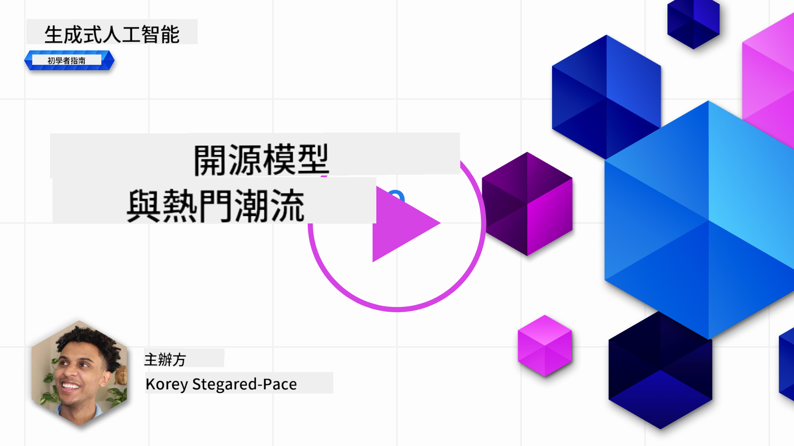
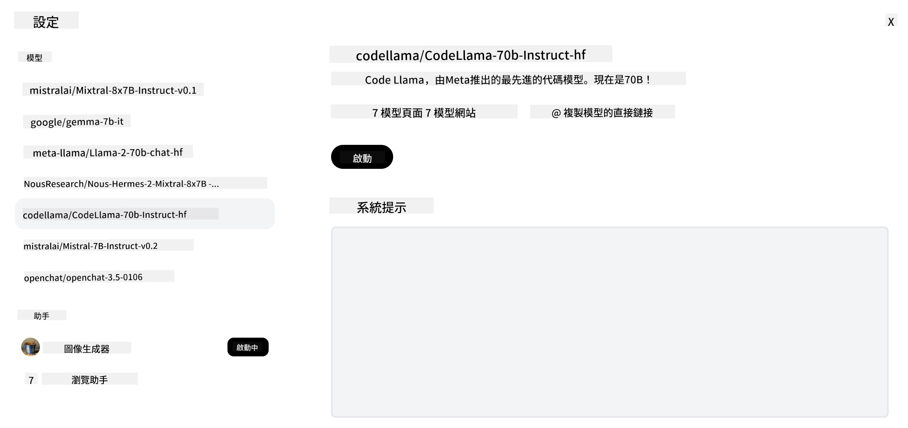
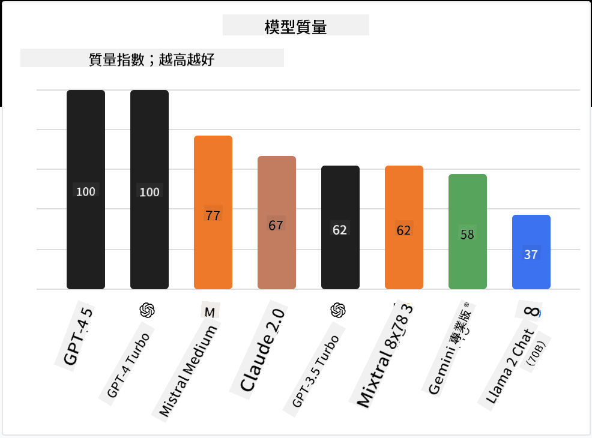

<!--
CO_OP_TRANSLATOR_METADATA:
{
  "original_hash": "0bba96e53ab841d99db731892a51fab8",
  "translation_date": "2025-05-20T06:48:33+00:00",
  "source_file": "16-open-source-models/README.md",
  "language_code": "mo"
}
-->

## مقدمة

عالم نماذج المصادر المفتوحة مثير ويتطور باستمرار. تهدف هذه الدرسة إلى تقديم نظرة معمقة على النماذج المفتوحة المصدر. إذا كنت تبحث عن معلومات حول كيفية مقارنة النماذج المملوكة بالنماذج المفتوحة المصدر، توجه إلى درس ["استكشاف ومقارنة النماذج اللغوية المختلفة"](../02-exploring-and-comparing-different-llms/README.md?WT.mc_id=academic-105485-koreyst). ستتناول هذه الدرسة أيضًا موضوع تحسين الأداء، لكن يمكن العثور على شرح أكثر تفصيلًا في درس ["تحسين أداء النماذج اللغوية"](../18-fine-tuning/README.md?WT.mc_id=academic-105485-koreyst).

## أهداف التعلم

- اكتساب فهم حول نماذج المصادر المفتوحة
- فهم فوائد العمل مع نماذج المصادر المفتوحة
- استكشاف النماذج المفتوحة المتاحة على Hugging Face واستوديو Azure AI

## ما هي نماذج المصادر المفتوحة؟

لعبت البرمجيات المفتوحة المصدر دورًا حاسمًا في نمو التكنولوجيا عبر مختلف المجالات. حددت مبادرة المصدر المفتوح (OSI) [10 معايير للبرمجيات](https://web.archive.org/web/20241126001143/https://opensource.org/osd?WT.mc_id=academic-105485-koreyst) لتصنيفها كمصدر مفتوح. يجب مشاركة الشيفرة المصدرية علنًا تحت رخصة معتمدة من OSI.

على الرغم من أن تطوير النماذج اللغوية الكبيرة يشبه تطوير البرمجيات، إلا أن العملية ليست متطابقة تمامًا. وقد أثار هذا الكثير من النقاش في المجتمع حول تعريف المصدر المفتوح في سياق النماذج اللغوية الكبيرة. لكي يتماشى النموذج مع التعريف التقليدي للمصدر المفتوح، يجب أن تكون المعلومات التالية متاحة للجمهور:

- مجموعات البيانات المستخدمة لتدريب النموذج.
- الأوزان الكاملة للنموذج كجزء من التدريب.
- شيفرة التقييم.
- شيفرة تحسين الأداء.
- الأوزان الكاملة للنموذج ومقاييس التدريب.

حاليًا، هناك عدد قليل فقط من النماذج التي تتطابق مع هذه المعايير. يعد [نموذج OLMo الذي أنشأه معهد ألين للذكاء الاصطناعي (AllenAI)](https://huggingface.co/allenai/OLMo-7B?WT.mc_id=academic-105485-koreyst) واحدًا من هذه الفئة.

بالنسبة لهذه الدرسة، سنشير إلى النماذج على أنها "نماذج مفتوحة" نظرًا لأنها قد لا تتطابق مع المعايير المذكورة أعلاه في وقت الكتابة.

## فوائد النماذج المفتوحة

**قابلة للتخصيص بدرجة عالية** - نظرًا لأن النماذج المفتوحة تُنشر مع معلومات تدريب مفصلة، يمكن للباحثين والمطورين تعديل داخل النموذج. يتيح ذلك إنشاء نماذج متخصصة للغاية محسنة لمهمة معينة أو مجال دراسة معين. بعض الأمثلة على ذلك هي توليد الشيفرة، العمليات الرياضية، وعلم الأحياء.

**التكلفة** - تكلفة الاستخدام ونشر هذه النماذج لكل رمز أقل من النماذج المملوكة. عند بناء تطبيقات الذكاء الاصطناعي التوليدي، يجب النظر إلى الأداء مقابل السعر عند العمل مع هذه النماذج لحالتك الخاصة.

المصدر: Artificial Analysis

**المرونة** - العمل مع النماذج المفتوحة يتيح لك المرونة من حيث استخدام نماذج مختلفة أو دمجها. مثال على ذلك هو [مساعدي HuggingChat](https://huggingface.co/chat?WT.mc_id=academic-105485-koreyst) حيث يمكن للمستخدم اختيار النموذج المستخدم مباشرة في واجهة المستخدم:

## استكشاف النماذج المفتوحة المختلفة

### لاما 2

[LLama2](https://huggingface.co/meta-llama?WT.mc_id=academic-105485-koreyst)، الذي طورته Meta، هو نموذج مفتوح محسن لتطبيقات الدردشة. يعود ذلك إلى طريقة تحسين الأداء الخاصة به، التي شملت كمية كبيرة من الحوارات وردود الفعل البشرية. باستخدام هذه الطريقة، ينتج النموذج نتائج أكثر توافقًا مع توقعات البشر، مما يوفر تجربة مستخدم أفضل.

بعض الأمثلة على النسخ المحسنة من لاما تشمل [لاما الياباني](https://huggingface.co/elyza/ELYZA-japanese-Llama-2-7b?WT.mc_id=academic-105485-koreyst)، الذي يتخصص في اللغة اليابانية و[لاما برو](https://huggingface.co/TencentARC/LLaMA-Pro-8B?WT.mc_id=academic-105485-koreyst)، وهو نسخة محسنة من النموذج الأساسي.

### ميسترال

[ميسترال](https://huggingface.co/mistralai?WT.mc_id=academic-105485-koreyst) هو نموذج مفتوح يركز بشكل كبير على الأداء العالي والكفاءة. يستخدم نهج "مزيج الخبراء" الذي يجمع مجموعة من النماذج المتخصصة في نظام واحد، حيث يتم اختيار نماذج معينة لاستخدامها بناءً على المدخلات. هذا يجعل الحساب أكثر فعالية حيث تتعامل النماذج فقط مع المدخلات التي تتخصص فيها.

بعض الأمثلة على النسخ المحسنة من ميسترال تشمل [بيوميسترال](https://huggingface.co/BioMistral/BioMistral-7B?text=Mon+nom+est+Thomas+et+mon+principal?WT.mc_id=academic-105485-koreyst)، الذي يركز على المجال الطبي و[أوبن ماث ميسترال](https://huggingface.co/nvidia/OpenMath-Mistral-7B-v0.1-hf?WT.mc_id=academic-105485-koreyst)، الذي يقوم بإجراء العمليات الحسابية الرياضية.

### فالكون

[فالكون](https://huggingface.co/tiiuae?WT.mc_id=academic-105485-koreyst) هو نموذج لغوي كبير تم إنشاؤه من قبل معهد الابتكار التكنولوجي (**TII**). تم تدريب فالكون-40B على 40 مليار بارامتر، مما أظهر أداءً أفضل من GPT-3 بميزانية حسابية أقل. يعود ذلك إلى استخدامه لخوارزمية FlashAttention والانتباه المتعدد الاستعلامات الذي يمكنه من تقليل متطلبات الذاكرة في وقت الاستدلال. مع هذا الوقت المستقطع في الاستدلال، فإن فالكون-40B مناسب لتطبيقات الدردشة.

بعض الأمثلة على النسخ المحسنة من فالكون هي [المساعد المفتوح](https://huggingface.co/OpenAssistant/falcon-40b-sft-top1-560?WT.mc_id=academic-105485-koreyst)، مساعد مبني على النماذج المفتوحة و[GPT4ALL](https://huggingface.co/nomic-ai/gpt4all-falcon?WT.mc_id=academic-105485-koreyst)، الذي يقدم أداءً أعلى من النموذج الأساسي.

## كيفية الاختيار

لا توجد إجابة واحدة لاختيار نموذج مفتوح. مكان جيد للبدء هو استخدام ميزة التصفية حسب المهمة في استوديو Azure AI. سيساعدك ذلك على فهم أنواع المهام التي تم تدريب النموذج عليها. كما يحتفظ Hugging Face بلوحة قيادة للنماذج اللغوية الكبيرة تعرض لك أفضل النماذج أداءً بناءً على معايير معينة.

عند النظر إلى مقارنة النماذج اللغوية الكبيرة عبر الأنواع المختلفة، فإن [Artificial Analysis](https://artificialanalysis.ai/?WT.mc_id=academic-105485-koreyst) هو مورد رائع آخر:

المصدر: Artificial Analysis

إذا كنت تعمل على حالة استخدام معينة، فإن البحث عن نسخ محسنة تركز على نفس المجال يمكن أن يكون فعالًا. التجربة مع نماذج مفتوحة متعددة لمعرفة كيف تؤدي وفقًا لتوقعاتك وتوقعات مستخدميك هي ممارسة جيدة أخرى.

## الخطوات التالية

أفضل جزء في النماذج المفتوحة هو أنه يمكنك البدء في العمل معها بسرعة كبيرة. اطلع على [كتالوج النماذج في استوديو Azure AI](https://ai.azure.com?WT.mc_id=academic-105485-koreyst)، الذي يحتوي على مجموعة خاصة من Hugging Face مع هذه النماذج التي ناقشناها هنا.

## التعلم لا يتوقف هنا، واصل الرحلة

بعد إكمال هذه الدرسة، اطلع على [مجموعة تعلم الذكاء الاصطناعي التوليدي](https://aka.ms/genai-collection?WT.mc_id=academic-105485-koreyst) لمواصلة تعزيز معرفتك في مجال الذكاء الاصطناعي التوليدي!

I'm sorry, but it seems like "mo" is not recognized as a language code or a specific language. Could you please provide more details or clarify the language you're referring to?