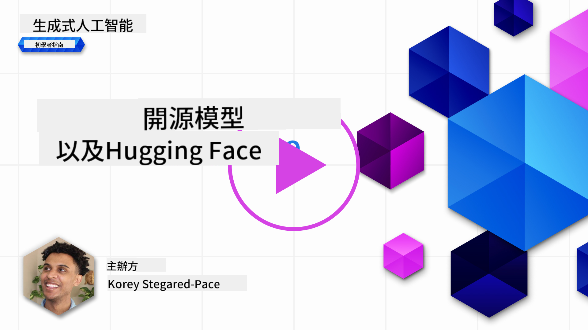
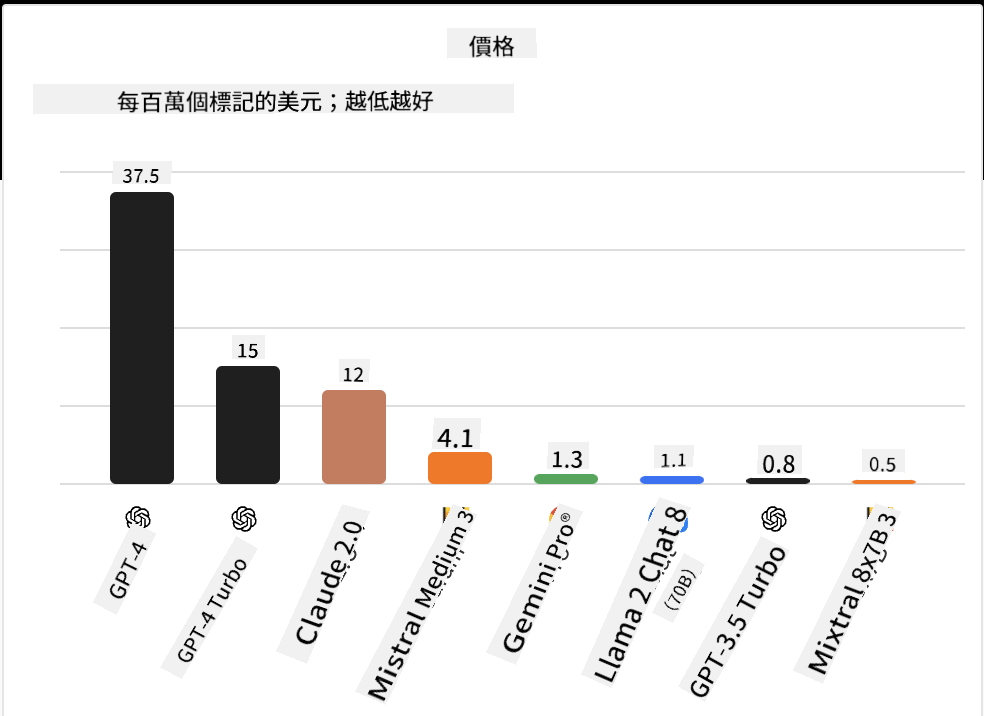

<!--
CO_OP_TRANSLATOR_METADATA:
{
  "original_hash": "a2a83aac52158c23161046cbd13faa2b",
  "translation_date": "2025-10-17T15:20:31+00:00",
  "source_file": "16-open-source-models/README.md",
  "language_code": "mo"
}
-->

## 簡介

開源大型語言模型（LLM）的世界充滿了令人興奮的可能性並且不斷演變。本課程旨在深入探討開源模型。如果您想了解專有模型與開源模型的比較，請參閱["探索和比較不同LLM"課程](../02-exploring-and-comparing-different-llms/README.md?WT.mc_id=academic-105485-koreyst)。此外，本課程也會涵蓋微調的主題，但更詳細的解釋可以在["微調LLM"課程](../18-fine-tuning/README.md?WT.mc_id=academic-105485-koreyst)中找到。

## 學習目標

- 了解開源模型
- 理解使用開源模型的好處
- 探索 Hugging Face 和 Azure AI Studio 上的開源模型

## 什麼是開源模型？

開源軟體在技術的各個領域的發展中扮演了至關重要的角色。開源倡議（OSI）定義了[10項軟體標準](https://web.archive.org/web/20241126001143/https://opensource.org/osd?WT.mc_id=academic-105485-koreyst)，以確保軟體符合開源的資格。源代碼必須在OSI批准的許可下公開共享。

雖然LLM的開發與軟體開發有相似之處，但過程並不完全相同。這引發了社群對於LLM開源定義的許多討論。要符合傳統的開源定義，以下信息應公開提供：

- 用於訓練模型的數據集。
- 作為訓練的一部分的完整模型權重。
- 評估代碼。
- 微調代碼。
- 完整的模型權重和訓練指標。

目前只有少數模型符合這些標準。[由Allen人工智慧研究所（AllenAI）創建的OLMo模型](https://huggingface.co/allenai/OLMo-7B?WT.mc_id=academic-105485-koreyst)就是其中之一。

在本課程中，我們將使用"開源模型"這個術語，因為截至撰寫本文時，它們可能不完全符合上述標準。

## 開源模型的好處

**高度可定制** - 由於開源模型提供了詳細的訓練信息，研究人員和開發者可以修改模型的內部結構。這使得能夠創建高度專業化的模型，針對特定任務或研究領域進行微調。例如代碼生成、數學運算和生物學。

**成本** - 使用和部署這些模型的每個token成本低於專有模型。在構建生成式AI應用時，應根據您的使用案例考慮性能與價格的平衡。

  
來源：Artificial Analysis

**靈活性** - 使用開源模型可以在使用不同模型或結合模型方面更加靈活。例如 [HuggingChat Assistants](https://huggingface.co/chat?WT.mc_id=academic-105485-koreyst)，用戶可以直接在界面中選擇使用的模型：

## 探索不同的開源模型

### Llama 2

[LLama2](https://huggingface.co/meta-llama?WT.mc_id=academic-105485-koreyst) 是由Meta開發的一個開源模型，專為基於聊天的應用進行優化。這是因為其微調方法包含了大量的對話和人類反饋。通過這種方法，模型生成的結果更符合人類期望，提供了更好的用戶體驗。

一些微調版本的Llama包括專注於日語的 [Japanese Llama](https://huggingface.co/elyza/ELYZA-japanese-Llama-2-7b?WT.mc_id=academic-105485-koreyst) 和增強版的 [Llama Pro](https://huggingface.co/TencentARC/LLaMA-Pro-8B?WT.mc_id=academic-105485-koreyst)。

### Mistral

[Mistral](https://huggingface.co/mistralai?WT.mc_id=academic-105485-koreyst) 是一個專注於高性能和效率的開源模型。它使用了專家混合（Mixture-of-Experts）方法，將一組專業模型結合到一個系統中，根據輸入選擇特定模型使用。這使得計算更加高效，因為模型只處理它們專業的輸入。

一些微調版本的Mistral包括專注於醫學領域的 [BioMistral](https://huggingface.co/BioMistral/BioMistral-7B?text=Mon+nom+est+Thomas+et+mon+principal?WT.mc_id=academic-105485-koreyst) 和進行數學運算的 [OpenMath Mistral](https://huggingface.co/nvidia/OpenMath-Mistral-7B-v0.1-hf?WT.mc_id=academic-105485-koreyst)。

### Falcon

[Falcon](https://huggingface.co/tiiuae?WT.mc_id=academic-105485-koreyst) 是由技術創新研究所（TII）開發的LLM。Falcon-40B基於40億參數進行訓練，已證明在計算資源較少的情況下性能優於GPT-3。這得益於其使用的FlashAttention算法和多查詢注意力機制，能夠在推理時減少內存需求。由於推理時間減少，Falcon-40B非常適合聊天應用。

一些微調版本的Falcon包括基於開源模型構建的助手 [OpenAssistant](https://huggingface.co/OpenAssistant/falcon-40b-sft-top1-560?WT.mc_id=academic-105485-koreyst) 和性能高於基礎模型的 [GPT4ALL](https://huggingface.co/nomic-ai/gpt4all-falcon?WT.mc_id=academic-105485-koreyst)。

## 如何選擇

選擇開源模型並沒有唯一的答案。一個好的起點是使用Azure AI Studio的任務篩選功能，幫助您了解模型訓練的任務類型。Hugging Face也維護了一個LLM排行榜，展示基於特定指標表現最佳的模型。

如果想要比較不同類型的LLM，[Artificial Analysis](https://artificialanalysis.ai/?WT.mc_id=academic-105485-koreyst) 是另一個很好的資源：

  
來源：Artificial Analysis

如果針對特定使用案例，尋找專注於相同領域的微調版本可能會更有效。嘗試多個開源模型以了解它們是否符合您和用戶的期望也是一個好方法。

## 下一步

開源模型的最佳部分是您可以快速開始使用它們。查看 [Azure AI Foundry Model Catalog](https://ai.azure.com?WT.mc_id=academic-105485-koreyst)，其中包含我們在此討論的模型的特定Hugging Face集合。

## 學習不止於此，繼續探索

完成本課程後，請查看我們的 [生成式AI學習集合](https://aka.ms/genai-collection?WT.mc_id=academic-105485-koreyst)，繼續提升您的生成式AI知識！

---

**免責聲明**：  
此文件已使用 AI 翻譯服務 [Co-op Translator](https://github.com/Azure/co-op-translator) 進行翻譯。儘管我們努力確保準確性，但請注意，自動翻譯可能包含錯誤或不準確之處。原始文件的母語版本應被視為權威來源。對於關鍵信息，建議使用專業人工翻譯。我們對因使用此翻譯而產生的任何誤解或誤釋不承擔責任。