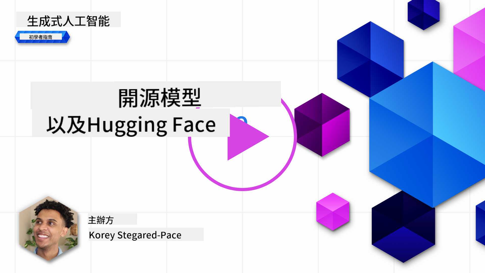
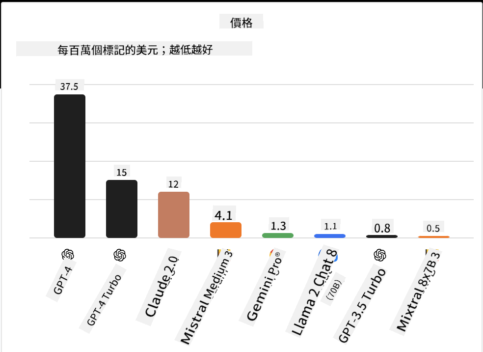
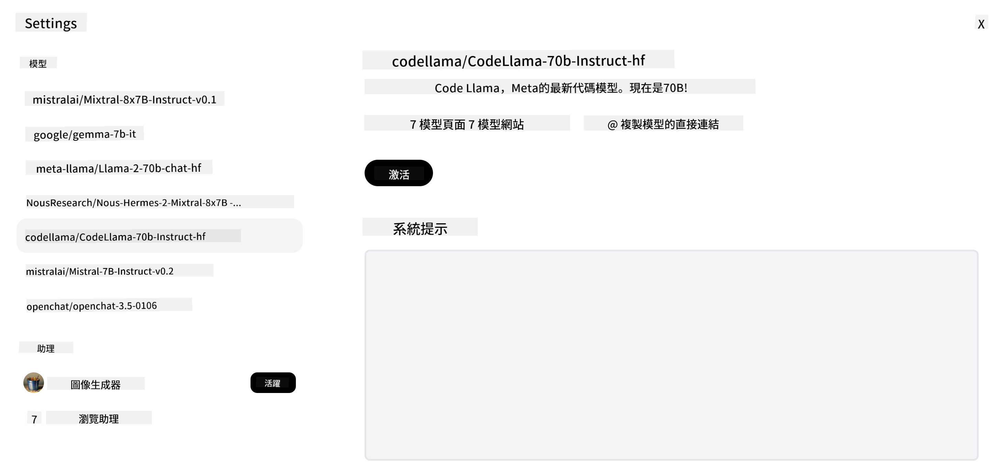
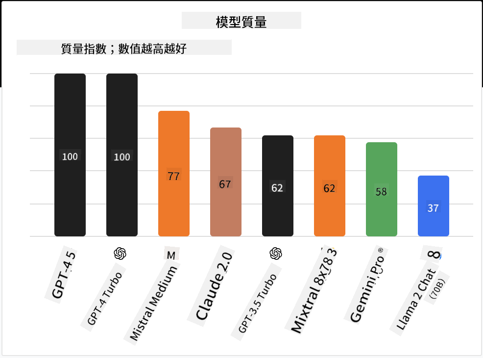

<!--
CO_OP_TRANSLATOR_METADATA:
{
  "original_hash": "0bba96e53ab841d99db731892a51fab8",
  "translation_date": "2025-06-25T23:50:24+00:00",
  "source_file": "16-open-source-models/README.md",
  "language_code": "mo"
}
-->

## 介紹

開源LLM的世界充滿了刺激和不斷演變。本課旨在深入了解開源模型。如果您正在尋找有關專有模型與開源模型比較的信息，請參閱["探索和比較不同LLM"課程](../02-exploring-and-comparing-different-llms/README.md?WT.mc_id=academic-105485-koreyst)。本課程還將涵蓋微調的主題，但更詳細的解釋可以在["微調LLM"課程](../18-fine-tuning/README.md?WT.mc_id=academic-105485-koreyst)中找到。

## 學習目標

- 了解開源模型
- 理解使用開源模型的好處
- 探索Hugging Face和Azure AI Studio上的開源模型

## 什麼是開源模型？

開源軟件在各個領域的技術發展中發揮了關鍵作用。開源倡議（OSI）已定義了[10個軟件標準](https://web.archive.org/web/20241126001143/https://opensource.org/osd?WT.mc_id=academic-105485-koreyst)以將其歸類為開源。源代碼必須在OSI批准的許可下公開共享。

雖然LLM的開發與軟件開發有相似的元素，但過程並不完全相同。這在社群中引發了許多關於在LLM背景下開源定義的討論。要使模型符合傳統的開源定義，以下信息應公開：

- 用於訓練模型的數據集。
- 作為訓練的一部分的完整模型權重。
- 評估代碼。
- 微調代碼。
- 完整的模型權重和訓練指標。

目前只有少數模型符合這些標準。由Allen Institute for Artificial Intelligence (AllenAI)創建的[OLMo模型](https://huggingface.co/allenai/OLMo-7B?WT.mc_id=academic-105485-koreyst)符合此類別。

在本課程中，我們將繼續將這些模型稱為"開放模型"，因為它們在撰寫本文時可能不符合上述標準。

## 開放模型的好處

**高度可定制** - 由於開放模型發布了詳細的訓練信息，研究人員和開發者可以修改模型的內部結構。這使得可以創建高度專門化的模型，這些模型針對特定任務或研究領域進行微調。一些例子包括代碼生成、數學運算和生物學。

**成本** - 使用和部署這些模型的每個令牌成本低於專有模型。在構建生成式AI應用程序時，應根據您的使用情況考慮性能與價格。

來源：人工分析

**靈活性** - 使用開放模型可以讓您在使用不同模型或結合它們方面具有靈活性。一個例子是[HuggingChat Assistants](https://huggingface.co/chat?WT.mc_id=academic-105485-koreyst)，用戶可以直接在用戶界面中選擇使用的模型：

## 探索不同的開放模型

### Llama 2

由Meta開發的[LLama2](https://huggingface.co/meta-llama?WT.mc_id=academic-105485-koreyst)是一個針對聊天應用程序優化的開放模型。這是由於其微調方法，包括大量對話和人類反饋。使用這種方法，模型生成的結果更符合人類期望，提供了更好的用戶體驗。

一些微調版本的Llama包括[Japanese Llama](https://huggingface.co/elyza/ELYZA-japanese-Llama-2-7b?WT.mc_id=academic-105485-koreyst)，專注於日語，[Llama Pro](https://huggingface.co/TencentARC/LLaMA-Pro-8B?WT.mc_id=academic-105485-koreyst)，是基礎模型的增強版本。

### Mistral

[Mistral](https://huggingface.co/mistralai?WT.mc_id=academic-105485-koreyst)是一個開放模型，強調高性能和效率。它使用專家混合方法，將一組專門的專家模型組合成一個系統，根據輸入選擇使用某些模型。這使得計算更加有效，因為模型僅處理它們專業的輸入。

一些微調版本的Mistral包括[BioMistral](https://huggingface.co/BioMistral/BioMistral-7B?text=Mon+nom+est+Thomas+et+mon+principal?WT.mc_id=academic-105485-koreyst)，專注於醫療領域，[OpenMath Mistral](https://huggingface.co/nvidia/OpenMath-Mistral-7B-v0.1-hf?WT.mc_id=academic-105485-koreyst)，進行數學運算。

### Falcon

[Falcon](https://huggingface.co/tiiuae?WT.mc_id=academic-105485-koreyst)是由技術創新研究所（**TII**）創建的LLM。Falcon-40B在400億個參數上進行了訓練，已顯示出在計算預算較少的情況下表現優於GPT-3。這是由於其使用了FlashAttention算法和多查詢注意力，能夠在推理時減少內存需求。由於推理時間減少，Falcon-40B適合聊天應用。

一些微調版本的Falcon包括[OpenAssistant](https://huggingface.co/OpenAssistant/falcon-40b-sft-top1-560?WT.mc_id=academic-105485-koreyst)，基於開放模型構建的助手，[GPT4ALL](https://huggingface.co/nomic-ai/gpt4all-falcon?WT.mc_id=academic-105485-koreyst)，提供比基礎模型更高的性能。

## 如何選擇

選擇開放模型沒有唯一的答案。可以從使用Azure AI Studio的任務篩選功能開始。這將幫助您了解模型已訓練的任務類型。Hugging Face還維護了一個LLM排行榜，顯示了基於某些指標的最佳表現模型。

在不同類型的LLM中進行比較時，[人工分析](https://artificialanalysis.ai/?WT.mc_id=academic-105485-koreyst)是另一個很好的資源：

來源：人工分析

如果在特定使用情況下工作，尋找專注於相同領域的微調版本可能是有效的。嘗試多個開放模型以查看它們根據您和您的用戶期望的表現是另一個良好做法。

## 下一步

開放模型的最佳部分是您可以快速開始使用它們。查看[Azure AI Studio模型目錄](https://ai.azure.com?WT.mc_id=academic-105485-koreyst)，其中包含我們在此處討論的模型的特定Hugging Face集合。

## 學習不止於此，繼續旅程

完成本課程後，查看我們的[生成式AI學習系列](https://aka.ms/genai-collection?WT.mc_id=academic-105485-koreyst)，繼續提升您的生成式AI知識！

**免責聲明**：
本文檔已使用AI翻譯服務[Co-op Translator](https://github.com/Azure/co-op-translator)進行翻譯。我們努力追求準確性，但請注意，自動翻譯可能包含錯誤或不準確之處。應將原始語言的文件視為權威來源。對於關鍵信息，建議使用專業人工翻譯。對於因使用此翻譯而引起的任何誤解或誤釋，我們不承擔責任。