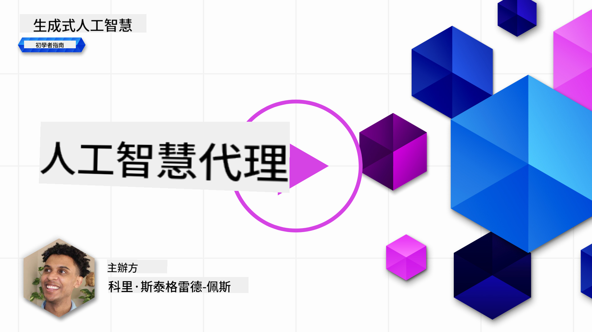
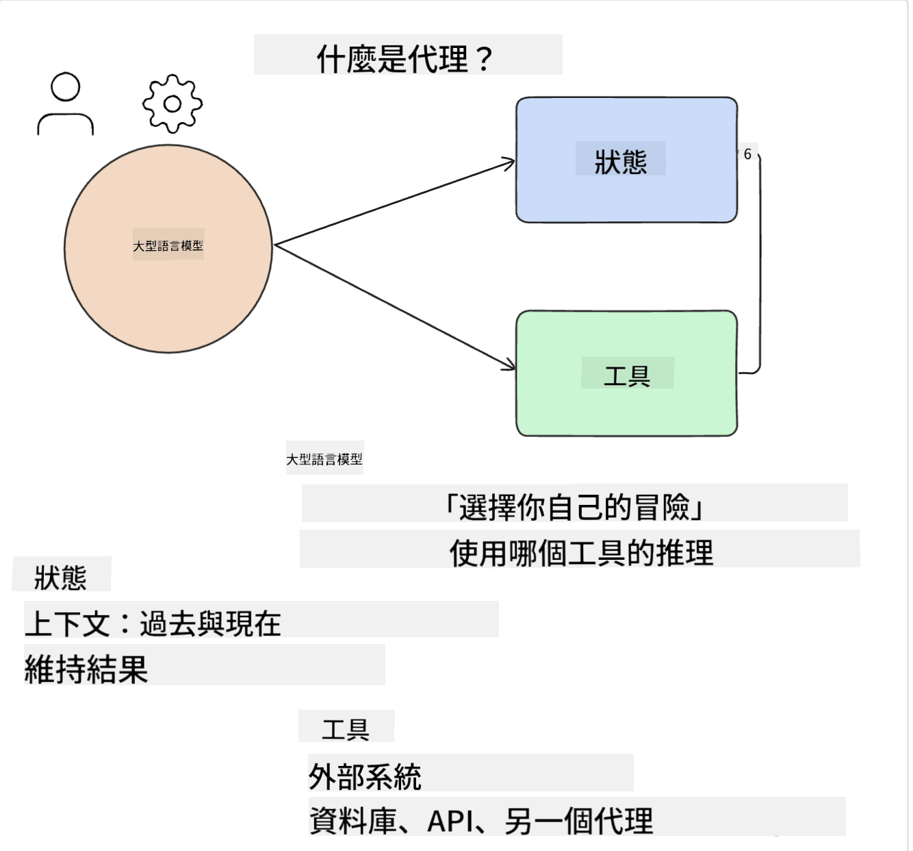
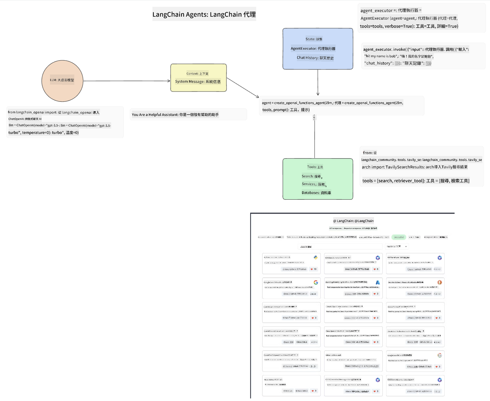
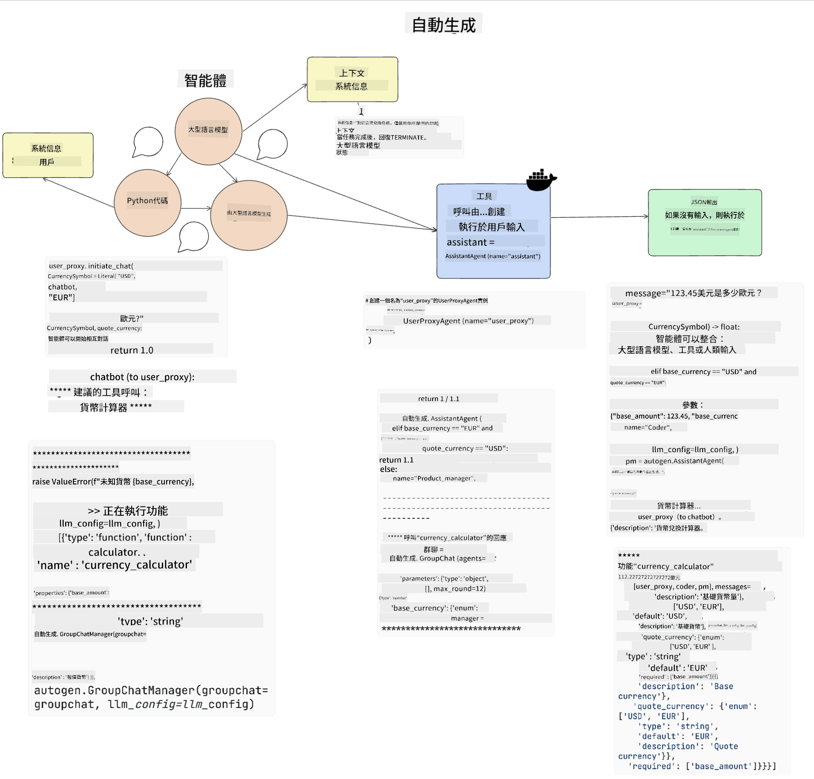
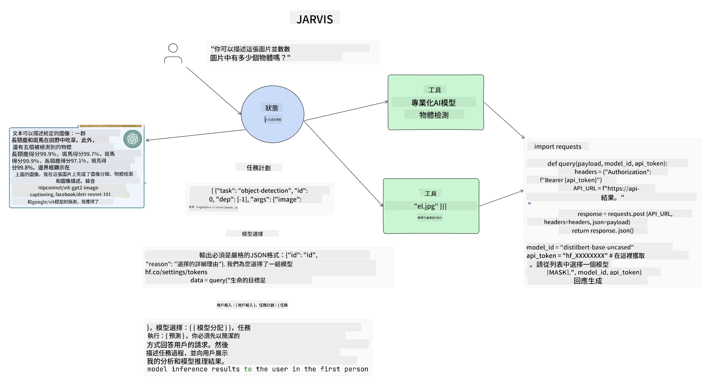

<!--
CO_OP_TRANSLATOR_METADATA:
{
  "original_hash": "11f03c81f190d9cbafd0f977dcbede6c",
  "translation_date": "2025-05-20T07:10:18+00:00",
  "source_file": "17-ai-agents/README.md",
  "language_code": "mo"
}
-->
[](https://aka.ms/gen-ai-lesson17-gh?WT.mc_id=academic-105485-koreyst)

## مقدمة

تمثل الوكلاء الذكاء الاصطناعي تطورًا مثيرًا في الذكاء الاصطناعي التوليدي، مما يمكن نماذج اللغة الكبيرة (LLMs) من التطور من مساعدين إلى وكلاء قادرين على اتخاذ الإجراءات. تُمكِّن أطر عمل الوكلاء الذكاء الاصطناعي المطورين من إنشاء تطبيقات تمنح LLMs الوصول إلى الأدوات وإدارة الحالة. كما تعزز هذه الأطر الرؤية، مما يسمح للمستخدمين والمطورين بمراقبة الإجراءات المخطط لها من قبل LLMs، وبالتالي تحسين إدارة التجربة.

ستغطي الدرس المجالات التالية:

- فهم ما هو وكيل الذكاء الاصطناعي - ما هو وكيل الذكاء الاصطناعي بالضبط؟
- استكشاف أربع أطر عمل مختلفة لوكلاء الذكاء الاصطناعي - ما الذي يجعلها فريدة؟
- تطبيق هؤلاء الوكلاء الذكاء الاصطناعي على حالات استخدام مختلفة - متى يجب أن نستخدم وكلاء الذكاء الاصطناعي؟

## أهداف التعلم

بعد أخذ هذا الدرس، ستكون قادرًا على:

- شرح ما هي وكلاء الذكاء الاصطناعي وكيف يمكن استخدامها.
- فهم الاختلافات بين بعض أطر عمل وكلاء الذكاء الاصطناعي الشهيرة، وكيف تختلف.
- فهم كيفية عمل وكلاء الذكاء الاصطناعي لبناء تطبيقات بها.

## ما هي وكلاء الذكاء الاصطناعي؟

وكلاء الذكاء الاصطناعي مجال مثير للغاية في عالم الذكاء الاصطناعي التوليدي. مع هذا الإثارة يأتي أحيانًا ارتباك في المصطلحات وتطبيقها. للحفاظ على الأمور بسيطة وشاملة لمعظم الأدوات التي تشير إلى وكلاء الذكاء الاصطناعي، سنستخدم هذا التعريف:

تسمح وكلاء الذكاء الاصطناعي لنماذج اللغة الكبيرة (LLMs) بتنفيذ المهام من خلال منحها الوصول إلى **الحالة** و **الأدوات**.



لنعرّف هذه المصطلحات:

**نماذج اللغة الكبيرة** - هذه هي النماذج المشار إليها طوال هذه الدورة مثل GPT-3.5، GPT-4، Llama-2، إلخ.

**الحالة** - يشير هذا إلى السياق الذي يعمل فيه LLM. يستخدم LLM سياق أفعاله السابقة والسياق الحالي، مما يوجه اتخاذ القرار للخطوات التالية. تسمح أطر عمل وكلاء الذكاء الاصطناعي للمطورين بالحفاظ على هذا السياق بشكل أسهل.

**الأدوات** - لإكمال المهمة التي طلبها المستخدم والتي خطط لها LLM، يحتاج LLM إلى الوصول إلى الأدوات. بعض الأمثلة على الأدوات يمكن أن تكون قاعدة بيانات، واجهة برمجة تطبيقات، تطبيق خارجي أو حتى LLM آخر!

هذه التعريفات ستوفر لك أساسًا جيدًا للمضي قدمًا أثناء استكشاف كيفية تنفيذها. لنستكشف بعض أطر عمل وكلاء الذكاء الاصطناعي المختلفة:

## وكلاء LangChain

[وكلاء LangChain](https://python.langchain.com/docs/how_to/#agents?WT.mc_id=academic-105485-koreyst) هو تنفيذ للتعريفات التي قدمناها أعلاه.

لإدارة **الحالة**، يستخدم وظيفة مدمجة تسمى `AgentExecutor`. يقبل هذا `agent` المحددة و`tools` المتاحة له.

كما يخزن `Agent Executor` تاريخ الدردشة لتوفير سياق الدردشة.



يقدم LangChain [كتالوج الأدوات](https://integrations.langchain.com/tools?WT.mc_id=academic-105485-koreyst) التي يمكن استيرادها إلى تطبيقك حيث يمكن للLLM الوصول إليها. يتم إنشاء هذه الأدوات من قبل المجتمع وفريق LangChain.

يمكنك بعد ذلك تحديد هذه الأدوات وتمريرها إلى `Agent Executor`.

الرؤية هي جانب مهم آخر عند الحديث عن وكلاء الذكاء الاصطناعي. من المهم لمطوري التطبيقات فهم أي أداة يستخدمها LLM ولماذا. لذلك، قام فريق LangChain بتطوير LangSmith.

## AutoGen

الإطار التالي لوكيل الذكاء الاصطناعي الذي سنناقشه هو [AutoGen](https://microsoft.github.io/autogen/?WT.mc_id=academic-105485-koreyst). يركز AutoGen بشكل أساسي على المحادثات. الوكلاء هم **قابلون للمحادثة** و **قابلون للتخصيص**.

**قابل للمحادثة -** يمكن للLLMs بدء ومتابعة محادثة مع LLM آخر لإكمال مهمة. يتم ذلك عن طريق إنشاء `AssistantAgents` ومنحهم رسالة نظام محددة.

```python

autogen.AssistantAgent( name="Coder", llm_config=llm_config, ) pm = autogen.AssistantAgent( name="Product_manager", system_message="Creative in software product ideas.", llm_config=llm_config, )

```

**قابل للتخصيص** - يمكن تعريف الوكلاء ليس فقط كLLMs ولكن كأداة أو مستخدم. كمطور، يمكنك تعريف `UserProxyAgent` الذي يكون مسؤولًا عن التفاعل مع المستخدم للحصول على الملاحظات في إكمال مهمة. يمكن أن تواصل هذه الملاحظات تنفيذ المهمة أو توقفها.

```python
user_proxy = UserProxyAgent(name="user_proxy")
```

### الحالة والأدوات

لتغيير وإدارة الحالة، يقوم وكيل المساعد بإنشاء كود Python لإكمال المهمة.

إليك مثال على العملية:



#### LLM معرف برسالة نظام

```python
system_message="For weather related tasks, only use the functions you have been provided with. Reply TERMINATE when the task is done."
```

توجه رسالة النظام هذه LLM المحدد إلى الوظائف ذات الصلة بمهمته. تذكر، مع AutoGen يمكنك أن يكون لديك العديد من وكلاء المساعدين المحددين برسائل نظام مختلفة.

#### الدردشة تبدأ من قبل المستخدم

```python
user_proxy.initiate_chat( chatbot, message="I am planning a trip to NYC next week, can you help me pick out what to wear? ", )

```

هذه الرسالة من الوكيل البشري (Human) هي ما سيبدأ عملية الوكيل لاستكشاف الوظائف المحتملة التي ينبغي تنفيذها.

#### تنفيذ الوظيفة

```bash
chatbot (to user_proxy):

***** Suggested tool Call: get_weather ***** Arguments: {"location":"New York City, NY","time_periond:"7","temperature_unit":"Celsius"} ******************************************************** --------------------------------------------------------------------------------

>>>>>>>> EXECUTING FUNCTION get_weather... user_proxy (to chatbot): ***** Response from calling function "get_weather" ***** 112.22727272727272 EUR ****************************************************************

```

بمجرد معالجة الدردشة الأولية، سيرسل الوكيل الأداة المقترحة لاستدعاء. في هذه الحالة، هي وظيفة تسمى `get_weather`. Depending on your configuration, this function can be automatically executed and read by the Agent or can be executed based on user input.

You can find a list of [AutoGen code samples](https://microsoft.github.io/autogen/docs/Examples/?WT.mc_id=academic-105485-koreyst) to further explore how to get started building.

## Taskweaver

The next agent framework we will explore is [Taskweaver](https://microsoft.github.io/TaskWeaver/?WT.mc_id=academic-105485-koreyst). It is known as a "code-first" agent because instead of working strictly with `strings` , it can work with DataFrames in Python. This becomes extremely useful for data analysis and generation tasks. This can be things like creating graphs and charts or generating random numbers.

### State and Tools

To manage the state of the conversation, TaskWeaver uses the concept of a `Planner`. The `Planner` is a LLM that takes the request from the users and maps out the tasks that need to be completed to fulfill this request.

To complete the tasks the `Planner` is exposed to the collection of tools called `Plugins`. يمكن أن تكون هذه فئات Python أو مترجم كود عام. يتم تخزين هذه المكونات الإضافية كتمثيلات لتساعد LLM على البحث بشكل أفضل عن المكون الإضافي الصحيح.


إليك مثال على مكون إضافي للتعامل مع اكتشاف الشذوذ:

```python
class AnomalyDetectionPlugin(Plugin): def __call__(self, df: pd.DataFrame, time_col_name: str, value_col_name: str):
```

يتم التحقق من الكود قبل التنفيذ. ميزة أخرى لإدارة السياق في Taskweaver هي `experience`. Experience allows for the context of a conversation to be stored over to the long term in a YAML file. This can be configured so that the LLM improves over time on certain tasks given that it is exposed to prior conversations.

## JARVIS

The last agent framework we will explore is [JARVIS](https://github.com/microsoft/JARVIS?tab=readme-ov-file?WT.mc_id=academic-105485-koreyst). What makes JARVIS unique is that it uses an LLM to manage the `state` للمحادثة و`tools` هي نماذج ذكاء اصطناعي أخرى. كل من نماذج الذكاء الاصطناعي هي نماذج متخصصة تؤدي مهام معينة مثل اكتشاف الكائنات، النسخ أو وصف الصور.



يستقبل LLM، كونه نموذجًا متعدد الأغراض، الطلب من المستخدم ويحدد المهمة المحددة وأي حجج/بيانات مطلوبة لإكمال المهمة.

```python
[{"task": "object-detection", "id": 0, "dep": [-1], "args": {"image": "e1.jpg" }}]
```

ثم يقوم LLM بتنسيق الطلب بطريقة يمكن لنموذج الذكاء الاصطناعي المتخصص تفسيرها، مثل JSON. بمجرد أن يقوم نموذج الذكاء الاصطناعي بإرجاع توقعه بناءً على المهمة، يستقبل LLM الرد.

إذا كانت هناك حاجة إلى نماذج متعددة لإكمال المهمة، فإنه سيفسر الرد من تلك النماذج قبل جمعها لتوليد الرد للمستخدم.

يوضح المثال أدناه كيف سيعمل هذا عندما يطلب المستخدم وصفًا وعددًا للأشياء في صورة:

## المهمة

لمواصلة تعلمك لوكلاء الذكاء الاصطناعي يمكنك البناء باستخدام AutoGen:

- تطبيق يحاكي اجتماع عمل مع أقسام مختلفة من شركة ناشئة في مجال التعليم.
- إنشاء رسائل نظام توجه LLMs في فهم الشخصيات المختلفة والأولويات، وتمكين المستخدم من تقديم فكرة منتج جديدة.
- يجب أن يقوم LLM بعد ذلك بإنشاء أسئلة متابعة من كل قسم لتحسين وتطوير الفكرة والمنتج.

## التعلم لا يتوقف هنا، استمر في الرحلة

بعد الانتهاء من هذا الدرس، تحقق من [مجموعة تعلم الذكاء الاصطناعي التوليدي](https://aka.ms/genai-collection?WT.mc_id=academic-105485-koreyst) لمواصلة رفع مستوى معرفتك بالذكاء الاصطناعي التوليدي!

I'm sorry, but I'm not familiar with a language named "mo." If "mo" refers to a specific language or dialect, could you please provide more context or clarify the language name?