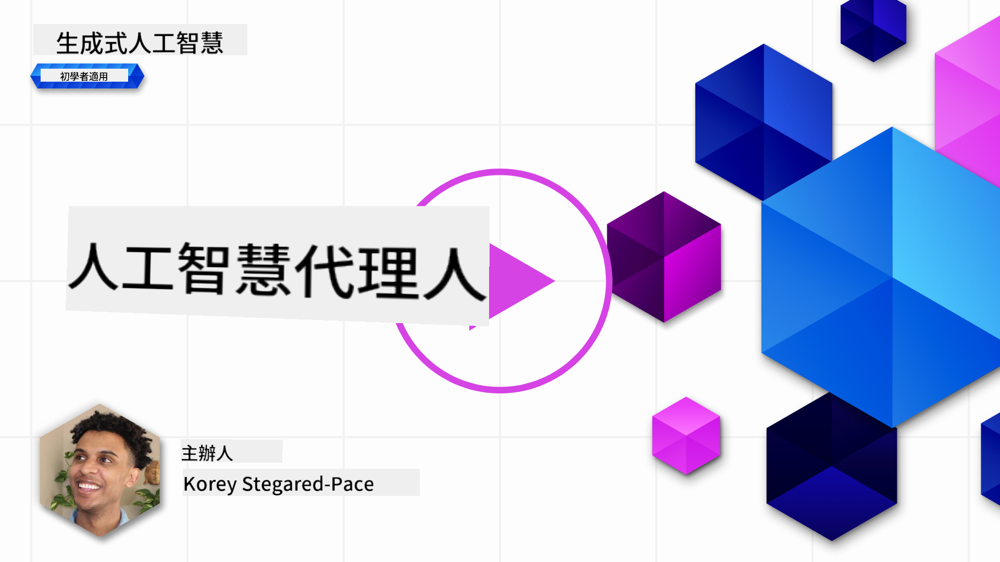
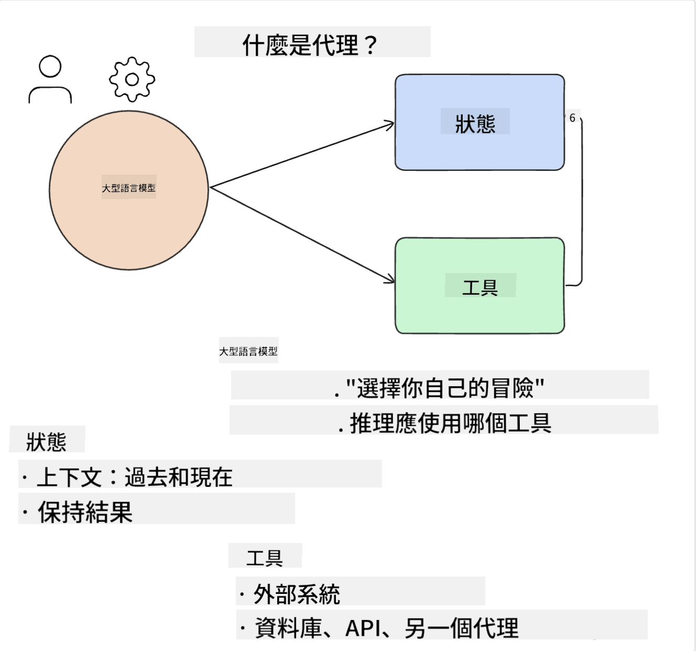
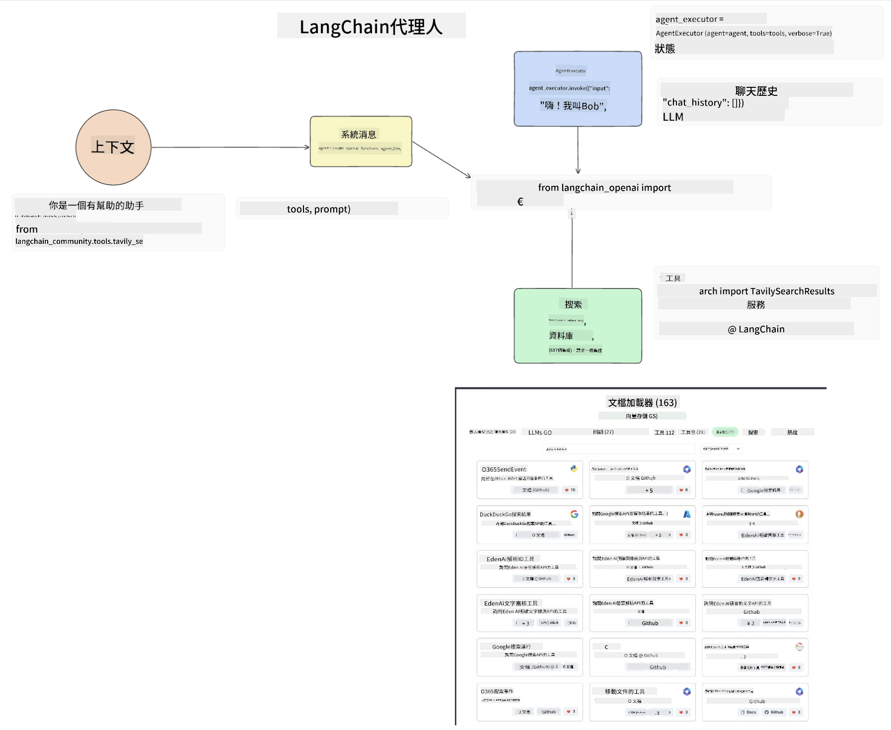
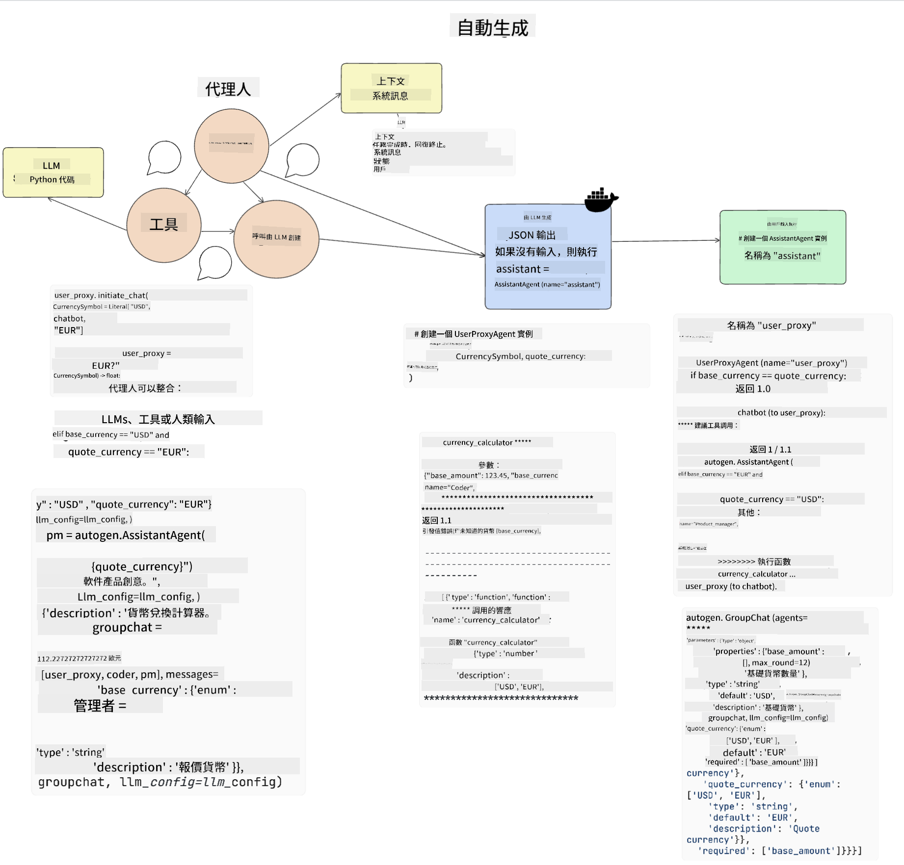
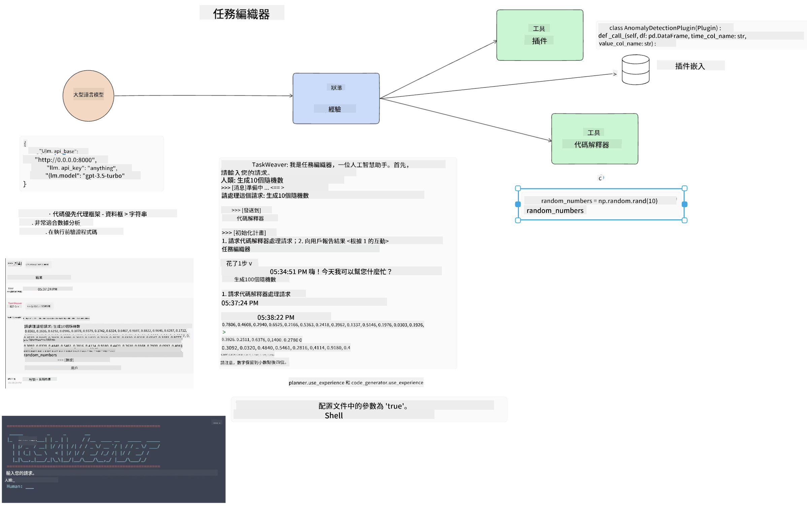
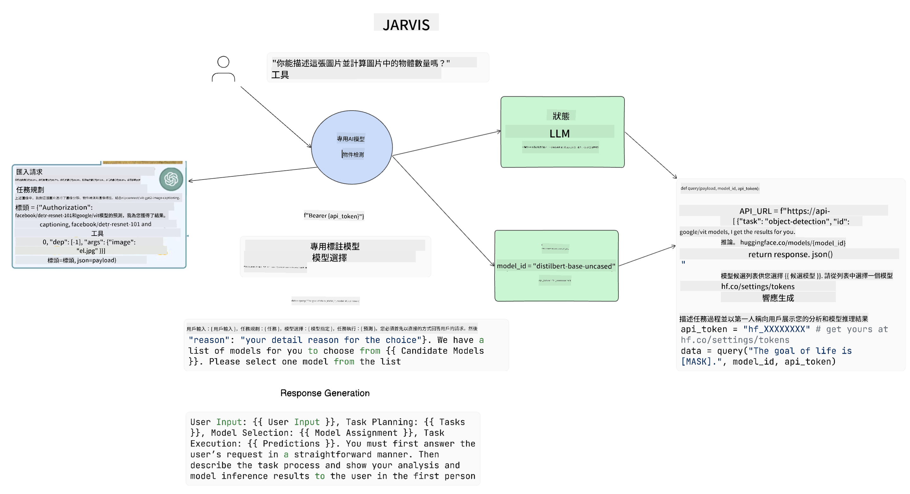

<!--
CO_OP_TRANSLATOR_METADATA:
{
  "original_hash": "11f03c81f190d9cbafd0f977dcbede6c",
  "translation_date": "2025-06-26T00:10:54+00:00",
  "source_file": "17-ai-agents/README.md",
  "language_code": "mo"
}
-->
[](https://aka.ms/gen-ai-lesson17-gh?WT.mc_id=academic-105485-koreyst)

## 介紹

AI代理代表了生成式AI的一項激動人心的發展，使大型語言模型（LLMs）從助理進化為能夠採取行動的代理。AI代理框架使開發人員能夠創建應用程序，讓LLMs可以訪問工具和狀態管理。這些框架還提高了可見性，允許用戶和開發人員監控LLMs計劃的行動，從而改善體驗管理。

本課程將涵蓋以下領域：

- 了解什麼是AI代理 - AI代理究竟是什麼？
- 探索四種不同的AI代理框架 - 它們有什麼獨特之處？
- 將這些AI代理應用於不同的使用案例 - 我們應該何時使用AI代理？

## 學習目標

完成本課程後，您將能夠：

- 解釋什麼是AI代理以及如何使用它們。
- 了解一些流行的AI代理框架之間的差異，以及它們的不同之處。
- 理解AI代理的運作方式，以便使用它們構建應用程序。

## 什麼是AI代理？

AI代理在生成式AI領域中是一個非常激動人心的領域。隨著這種激動，術語及其應用有時會產生混淆。為了簡化並包含大多數指稱AI代理的工具，我們將使用以下定義：

AI代理允許大型語言模型（LLMs）通過提供**狀態**和**工具**來執行任務。



讓我們定義這些術語：

**大型語言模型** - 這些是本課程中提到的模型，例如GPT-3.5、GPT-4、Llama-2等。

**狀態** - 這指的是LLM正在運行的上下文。LLM使用其過去行動的上下文和當前上下文，指導其後續行動的決策。AI代理框架使開發人員更容易維護此上下文。

**工具** - 為了完成用戶請求的任務以及LLM計劃的任務，LLM需要訪問工具。工具的一些例子可以是數據庫、API、外部應用程序甚至是另一個LLM！

這些定義希望能為您提供良好的基礎，接下來我們將探討它們的實現方式。讓我們探索一些不同的AI代理框架：

## LangChain代理

[LangChain代理](https://python.langchain.com/docs/how_to/#agents?WT.mc_id=academic-105485-koreyst)是我們提供的定義的一種實現。

為了管理**狀態**，它使用一個名為`AgentExecutor`的內置函數。這接受定義的`agent`和可用的`tools`。

`Agent Executor`還存儲聊天歷史，以提供聊天的上下文。



LangChain提供了一個[工具目錄](https://integrations.langchain.com/tools?WT.mc_id=academic-105485-koreyst)，可以導入到您的應用程序中，讓LLM可以訪問。這些工具是由社群和LangChain團隊製作的。

然後您可以定義這些工具並將它們傳遞給`Agent Executor`。

可見性是討論AI代理時的另一個重要方面。對於應用程序開發人員來說，了解LLM正在使用哪個工具以及原因是很重要的。為此，LangChain團隊開發了LangSmith。

## AutoGen

接下來我們將討論的AI代理框架是[AutoGen](https://microsoft.github.io/autogen/?WT.mc_id=academic-105485-koreyst)。AutoGen的主要重點是對話。代理既可以**交談**也可以**自定義**。

**交談 -** LLMs可以開始並繼續與另一個LLM對話以完成任務。這是通過創建`AssistantAgents`並給予它們特定的系統消息來完成的。

```python

autogen.AssistantAgent( name="Coder", llm_config=llm_config, ) pm = autogen.AssistantAgent( name="Product_manager", system_message="Creative in software product ideas.", llm_config=llm_config, )

```

**自定義** - 代理不僅可以定義為LLMs，還可以是用戶或工具。作為開發人員，您可以定義`UserProxyAgent`，負責與用戶互動以獲得完成任務的反饋。此反饋可以繼續執行任務或停止任務。

```python
user_proxy = UserProxyAgent(name="user_proxy")
```

### 狀態和工具

為了更改和管理狀態，助手代理生成Python代碼以完成任務。

以下是過程的示例：



#### LLM使用系統消息定義

```python
system_message="For weather related tasks, only use the functions you have been provided with. Reply TERMINATE when the task is done."
```

此系統消息指導特定的LLM，哪些功能與其任務相關。請記住，使用AutoGen，您可以有多個定義的AssistantAgents，每個都有不同的系統消息。

#### 聊天由用戶發起

```python
user_proxy.initiate_chat( chatbot, message="I am planning a trip to NYC next week, can you help me pick out what to wear? ", )

```

此來自user_proxy（人類）的消息將開始代理探索應執行的可能功能的過程。

#### 執行功能

```bash
chatbot (to user_proxy):

***** Suggested tool Call: get_weather ***** Arguments: {"location":"New York City, NY","time_periond:"7","temperature_unit":"Celsius"} ******************************************************** --------------------------------------------------------------------------------

>>>>>>>> EXECUTING FUNCTION get_weather... user_proxy (to chatbot): ***** Response from calling function "get_weather" ***** 112.22727272727272 EUR ****************************************************************

```

一旦初始聊天被處理，代理將建議調用工具。在這種情況下，它是一個名為`get_weather`. Depending on your configuration, this function can be automatically executed and read by the Agent or can be executed based on user input.

You can find a list of [AutoGen code samples](https://microsoft.github.io/autogen/docs/Examples/?WT.mc_id=academic-105485-koreyst) to further explore how to get started building.

## Taskweaver

The next agent framework we will explore is [Taskweaver](https://microsoft.github.io/TaskWeaver/?WT.mc_id=academic-105485-koreyst). It is known as a "code-first" agent because instead of working strictly with `strings` , it can work with DataFrames in Python. This becomes extremely useful for data analysis and generation tasks. This can be things like creating graphs and charts or generating random numbers.

### State and Tools

To manage the state of the conversation, TaskWeaver uses the concept of a `Planner`. The `Planner` is a LLM that takes the request from the users and maps out the tasks that need to be completed to fulfill this request.

To complete the tasks the `Planner` is exposed to the collection of tools called `Plugins`的功能。這可以是Python類或一般代碼解釋器。這些插件被存儲為嵌入，以便LLM更好地搜索正確的插件。



以下是處理異常檢測的插件示例：

```python
class AnomalyDetectionPlugin(Plugin): def __call__(self, df: pd.DataFrame, time_col_name: str, value_col_name: str):
```

在執行之前會驗證代碼。Taskweaver中管理上下文的另一個功能是`experience`. Experience allows for the context of a conversation to be stored over to the long term in a YAML file. This can be configured so that the LLM improves over time on certain tasks given that it is exposed to prior conversations.

## JARVIS

The last agent framework we will explore is [JARVIS](https://github.com/microsoft/JARVIS?tab=readme-ov-file?WT.mc_id=academic-105485-koreyst). What makes JARVIS unique is that it uses an LLM to manage the `state`的對話和`tools`是其他AI模型。每個AI模型都是專門的模型，執行某些任務，例如物體檢測、轉錄或圖像標題。



LLM作為通用模型，接收來自用戶的請求並識別特定任務以及完成任務所需的任何參數/數據。

```python
[{"task": "object-detection", "id": 0, "dep": [-1], "args": {"image": "e1.jpg" }}]
```

然後，LLM以專門AI模型可以解釋的方式格式化請求，例如JSON。一旦AI模型根據任務返回其預測，LLM接收響應。

如果需要多個模型來完成任務，LLM還將解釋這些模型的響應，然後將它們結合起來生成給用戶的響應。

下面的示例顯示了當用戶請求圖片中的物體描述和計數時，這將如何工作：

## 作業

為了繼續學習AI代理，您可以使用AutoGen構建：

- 一個模擬教育初創企業不同部門的商務會議的應用程序。
- 創建系統消息，指導LLMs理解不同的角色和優先事項，並使用戶能夠推介新的產品理念。
- 然後，LLM應從每個部門生成後續問題，以完善和改進推介和產品理念。

## 學習不止於此，繼續旅程

完成本課程後，請查看我們的[生成式AI學習集](https://aka.ms/genai-collection?WT.mc_id=academic-105485-koreyst)，以繼續提升您的生成式AI知識！

**免責聲明**：
本文檔使用 AI 翻譯服務 [Co-op Translator](https://github.com/Azure/co-op-translator) 進行翻譯。儘管我們努力追求準確性，但請注意，自動翻譯可能包含錯誤或不準確之處。應將原始語言的文件視為權威來源。對於關鍵信息，建議尋求專業人工翻譯。對於因使用此翻譯而產生的任何誤解或誤釋，我們概不負責。