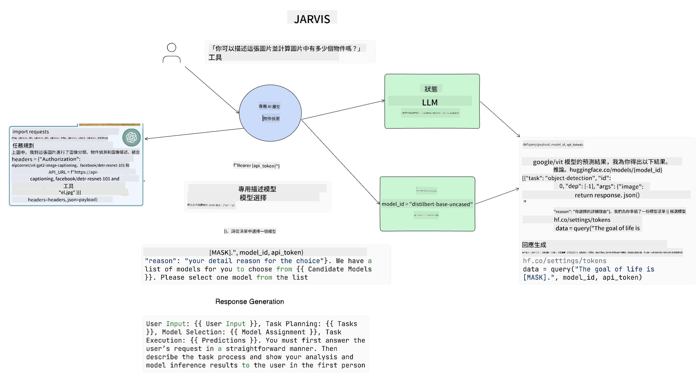

<!--
CO_OP_TRANSLATOR_METADATA:
{
  "original_hash": "8e8d1f6a63da606af7176a87ff8e92b6",
  "translation_date": "2025-10-17T15:20:12+00:00",
  "source_file": "17-ai-agents/README.md",
  "language_code": "mo"
}
-->
[](https://youtu.be/yAXVW-lUINc?si=bOtW9nL6jc3XJgOM)

## 簡介

AI代理是生成式AI的一項令人興奮的發展，讓大型語言模型（LLMs）從助理進化為能夠採取行動的代理。AI代理框架使開發者能夠創建應用程式，讓LLMs能夠使用工具並進行狀態管理。這些框架還提高了可見性，讓使用者和開發者能夠監控LLMs計劃的行動，從而改善體驗管理。

本課程將涵蓋以下內容：

- 了解什麼是AI代理——AI代理到底是什麼？
- 探索四種不同的AI代理框架——它們有什麼獨特之處？
- 將這些AI代理應用於不同的使用案例——什麼時候應該使用AI代理？

## 學習目標

完成本課程後，您將能夠：

- 解釋什麼是AI代理以及如何使用它們。
- 了解一些流行的AI代理框架之間的差異及其不同之處。
- 理解AI代理的運作方式，以便使用它們構建應用程式。

## 什麼是AI代理？

AI代理是生成式AI領域中非常令人興奮的一部分。隨著這種興奮，有時也會出現術語和應用上的混淆。為了簡化並涵蓋大多數提到AI代理的工具，我們將使用以下定義：

AI代理允許大型語言模型（LLMs）通過提供**狀態**和**工具**來執行任務。


讓我們定義這些術語：

**大型語言模型** - 本課程中提到的模型，例如GPT-3.5、GPT-4、Llama-2等。

**狀態** - 指LLM正在處理的上下文。LLM使用其過去行動的上下文和當前上下文，指導其後續行動的決策。AI代理框架使開發者更容易維護這些上下文。

**工具** - 為完成使用者請求的任務以及LLM計劃的任務，LLM需要使用工具。一些工具的例子包括資料庫、API、外部應用程式甚至其他LLM！

這些定義希望能為您提供良好的基礎，接下來我們將探討它們的實現方式。讓我們來看看幾個不同的AI代理框架：

## LangChain代理

[LangChain代理](https://python.langchain.com/docs/how_to/#agents?WT.mc_id=academic-105485-koreyst)是我們上述定義的一種實現。

為了管理**狀態**，它使用了一個內建函數`AgentExecutor`。該函數接受定義的`agent`以及可用的`tools`。

`AgentExecutor`還存儲聊天記錄，以提供聊天的上下文。


LangChain提供了一個[工具目錄](https://integrations.langchain.com/tools?WT.mc_id=academic-105485-koreyst)，可以導入到您的應用程式中，讓LLM能夠使用。這些工具由社群和LangChain團隊製作。

您可以定義這些工具並將它們傳遞給`AgentExecutor`。

在討論AI代理時，可見性是另一個重要方面。對於應用程式開發者來說，了解LLM正在使用哪個工具以及原因非常重要。為此，LangChain團隊開發了LangSmith。

## AutoGen

接下來我們將討論的AI代理框架是[AutoGen](https://microsoft.github.io/autogen/?WT.mc_id=academic-105485-koreyst)。AutoGen的主要重點是對話。代理既**可對話**又**可定制**。

**可對話** - LLM可以開始並繼續與另一個LLM的對話以完成任務。這是通過創建`AssistantAgents`並為其提供特定的系統消息來實現的。

```python

autogen.AssistantAgent( name="Coder", llm_config=llm_config, ) pm = autogen.AssistantAgent( name="Product_manager", system_message="Creative in software product ideas.", llm_config=llm_config, )

```

**可定制** - 代理不僅可以定義為LLM，還可以是使用者或工具。作為開發者，您可以定義一個`UserProxyAgent`，負責與使用者互動以獲得完成任務的反饋。這些反饋可以繼續執行任務或停止執行。

```python
user_proxy = UserProxyAgent(name="user_proxy")
```

### 狀態與工具

為了更改和管理狀態，Assistant Agent生成Python代碼來完成任務。

以下是過程的示例：


#### 使用系統消息定義的LLM

```python
system_message="For weather related tasks, only use the functions you have been provided with. Reply TERMINATE when the task is done."
```

此系統消息指導特定LLM了解哪些功能與其任務相關。請記住，使用AutoGen，您可以定義多個具有不同系統消息的AssistantAgents。

#### 使用者啟動聊天

```python
user_proxy.initiate_chat( chatbot, message="I am planning a trip to NYC next week, can you help me pick out what to wear? ", )

```

來自user_proxy（人類）的消息將啟動代理探索應執行的功能的過程。

#### 執行功能

```bash
chatbot (to user_proxy):

***** Suggested tool Call: get_weather ***** Arguments: {"location":"New York City, NY","time_periond:"7","temperature_unit":"Celsius"} ******************************************************** --------------------------------------------------------------------------------

>>>>>>>> EXECUTING FUNCTION get_weather... user_proxy (to chatbot): ***** Response from calling function "get_weather" ***** 112.22727272727272 EUR ****************************************************************

```

初始聊天處理完成後，代理將建議調用的工具。在此情況下，是一個名為`get_weather`的功能。根據您的配置，此功能可以由代理自動執行並讀取，也可以根據使用者輸入執行。

您可以查看[AutoGen代碼示例](https://microsoft.github.io/autogen/docs/Examples/?WT.mc_id=academic-105485-koreyst)，進一步探索如何開始構建。

## Taskweaver

接下來我們將探討的代理框架是[Taskweaver](https://microsoft.github.io/TaskWeaver/?WT.mc_id=academic-105485-koreyst)。它被稱為“代碼優先”代理，因為它不是僅僅處理`strings`，而是可以處理Python中的DataFrames。這對於資料分析和生成任務非常有用，例如創建圖表或生成隨機數。

### 狀態與工具

為了管理對話的狀態，TaskWeaver使用了`Planner`的概念。`Planner`是一個LLM，負責接收使用者的請求並規劃完成該請求所需的任務。

為了完成任務，`Planner`可以使用一組稱為`Plugins`的工具。這些工具可以是Python類或通用代碼解釋器。這些插件以嵌入的形式存儲，以便LLM能更好地搜索正確的插件。


以下是一個處理異常檢測的插件示例：

```python
class AnomalyDetectionPlugin(Plugin): def __call__(self, df: pd.DataFrame, time_col_name: str, value_col_name: str):
```

代碼在執行前會被驗證。Taskweaver管理上下文的另一個功能是`experience`。`experience`允許對話的上下文長期存儲在YAML文件中。這可以配置為使LLM在某些任務上隨著暴露於先前的對話而逐漸改進。

## JARVIS

最後我們將探討的代理框架是[JARVIS](https://github.com/microsoft/JARVIS?tab=readme-ov-file?WT.mc_id=academic-105485-koreyst)。JARVIS的獨特之處在於它使用LLM來管理對話的`狀態`，而`工具`則是其他AI模型。每個AI模型都是專門的模型，執行特定任務，例如物件檢測、轉錄或圖像標註。



LLM作為通用模型，接收使用者的請求並識別完成任務所需的特定任務及任何參數/資料。

```python
[{"task": "object-detection", "id": 0, "dep": [-1], "args": {"image": "e1.jpg" }}]
```

LLM然後以專門AI模型可以解讀的格式（例如JSON）來格式化請求。一旦AI模型根據任務返回其預測，LLM接收響應。

如果需要多個模型來完成任務，LLM還會解讀這些模型的響應，並將它們整合在一起生成給使用者的響應。

以下示例展示了當使用者請求描述和計算圖片中的物件時，這將如何運作：

## 作業

為了繼續學習AI代理，您可以使用AutoGen構建：

- 一個模擬教育初創公司不同部門商務會議的應用程式。
- 創建系統消息，指導LLMs理解不同角色和優先事項，並使使用者能夠提出新產品的想法。
- LLM應生成每個部門的後續問題，以完善和改進提案及產品想法。

## 學習不止於此，繼續您的旅程

完成本課程後，請查看我們的[生成式AI學習合集](https://aka.ms/genai-collection?WT.mc_id=academic-105485-koreyst)，繼續提升您的生成式AI知識！

---

**免責聲明**：  
本文件已使用 AI 翻譯服務 [Co-op Translator](https://github.com/Azure/co-op-translator) 進行翻譯。雖然我們致力於提供準確的翻譯，但請注意，機器翻譯可能包含錯誤或不準確之處。原始文件的母語版本應被視為權威來源。對於關鍵信息，建議使用專業人工翻譯。我們對因使用此翻譯而引起的任何誤解或誤釋不承擔責任。