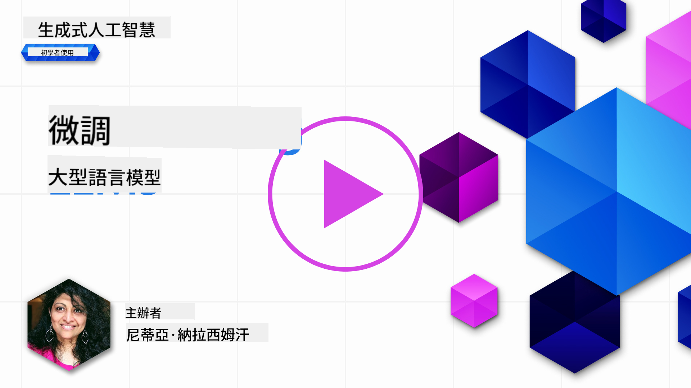
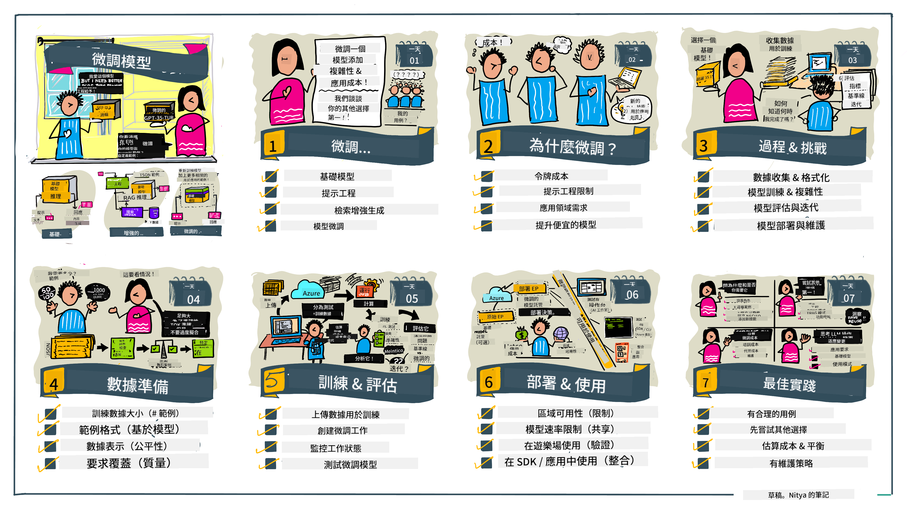

<!--
CO_OP_TRANSLATOR_METADATA:
{
  "original_hash": "68664f7e754a892ae1d8d5e2b7bd2081",
  "translation_date": "2025-05-20T07:38:49+00:00",
  "source_file": "18-fine-tuning/README.md",
  "language_code": "mo"
}
-->

# Tuning Model Language Wali

Kutumia mifano mikubwa ya lugha kujenga programu za AI zinazozalisha inakuja na changamoto mpya. Tatizo kuu ni kuhakikisha ubora wa majibu (usahihi na umuhimu) katika maudhui yanayozalishwa na modeli kwa ombi la mtumiaji. Katika masomo yaliyopita, tulijadili mbinu kama uhandisi wa maelekezo na kizazi kilichoongezwa na utafutaji ambavyo vinajaribu kutatua tatizo kwa _kubadilisha pembejeo ya maelekezo_ kwa modeli iliyopo.

Katika somo la leo, tunajadili mbinu ya tatu, **tuning**, ambayo inajaribu kushughulikia changamoto kwa _kufundisha upya modeli yenyewe_ na data ya ziada. Hebu tuingie katika maelezo.

## Malengo ya Kujifunza

Somo hili linaanzisha dhana ya tuning kwa mifano ya lugha iliyofunzwa tayari, linaangalia faida na changamoto za mbinu hii, na linatoa mwongozo wa wakati na jinsi ya kutumia tuning ili kuboresha utendaji wa mifano yako ya AI inayozalisha.

Mwisho wa somo hili, unapaswa kuwa na uwezo wa kujibu maswali yafuatayo:

- Tuning ya mifano ya lugha ni nini?
- Wakati gani, na kwa nini, tuning ni muhimu?
- Ninawezaje kutune modeli iliyofunzwa tayari?
- Je, tuning ina mipaka gani?

Tayari? Hebu tuanze.

## Mwongozo wa Picha

Unataka kupata picha kubwa ya kile tutakachofunika kabla ya kuingia ndani? Angalia mwongozo huu wa picha unaoelezea safari ya kujifunza kwa somo hili - kutoka kujifunza dhana kuu na motisha ya tuning, hadi kuelewa mchakato na mbinu bora za kutekeleza kazi ya tuning. Hili ni somo la kuvutia la uchunguzi, kwa hivyo usisahau kuangalia ukurasa wa [Rasilimali](./RESOURCES.md?WT.mc_id=academic-105485-koreyst) kwa viungo vya ziada vya kusaidia safari yako ya kujifunza kwa kujiongoza!

## Tuning ya Mifano ya Lugha ni nini?

Kwa ufafanuzi, mifano mikubwa ya lugha imefunzwa _tayari_ kwenye idadi kubwa ya maandiko yaliyotolewa kutoka vyanzo mbalimbali ikiwa ni pamoja na mtandao. Kama tulivyojifunza katika masomo yaliyopita, tunahitaji mbinu kama _uhandisi wa maelekezo_ na _kizazi kilichoongezwa na utafutaji_ ili kuboresha ubora wa majibu ya modeli kwa maswali ya mtumiaji ("maelekezo").

Mbinu maarufu ya uhandisi wa maelekezo inahusisha kutoa mwongozo zaidi kwa modeli juu ya kile kinachotarajiwa katika jibu aidha kwa kutoa _maelekezo_ (mwongozo wa wazi) au _kuipa mifano michache_ (mwongozo usio wazi). Hii inajulikana kama _ujifunzaji wa mifano michache_ lakini ina mipaka miwili:

- Vikomo vya tokeni vya modeli vinaweza kuzuia idadi ya mifano unayoweza kutoa, na kupunguza ufanisi.
- Gharama za tokeni za modeli zinaweza kufanya kuwa ghali kuongeza mifano kwa kila maelekezo, na kupunguza kubadilika.

Tuning ni mazoezi ya kawaida katika mifumo ya kujifunza kwa mashine ambapo tunachukua modeli iliyofunzwa tayari na kuifundisha upya na data mpya ili kuboresha utendaji wake kwenye kazi maalum. Katika muktadha wa mifano ya lugha, tunaweza kutune modeli iliyofunzwa tayari _na seti ya mifano iliyochaguliwa kwa kazi au eneo la programu_ ili kuunda modeli **maalum** ambayo inaweza kuwa sahihi zaidi na muhimu kwa kazi au eneo hilo maalum. Faida ya ziada ya tuning ni kwamba inaweza pia kupunguza idadi ya mifano inayohitajika kwa ujifunzaji wa mifano michache - kupunguza matumizi ya tokeni na gharama zinazohusiana.

## Wakati gani na kwa nini tunapaswa kutune modeli?

Katika _muktadha huu_, tunapozungumzia tuning, tunazungumzia tuning ya **kusimamiwa** ambapo kufundisha upya kunafanywa kwa **kuongeza data mpya** ambayo haikuwa sehemu ya seti ya data ya mafunzo ya awali. Hii ni tofauti na mbinu ya tuning isiyosimamiwa ambapo modeli inafundishwa upya kwenye data ya awali, lakini kwa vigezo tofauti vya hyper.

Jambo muhimu la kukumbuka ni kwamba tuning ni mbinu ya juu ambayo inahitaji kiwango fulani cha utaalamu ili kupata matokeo yanayotarajiwa. Ikiwa imefanywa vibaya, inaweza kutoa maboresho yanayotarajiwa, na inaweza hata kuharibu utendaji wa modeli kwa eneo lako lengwa.

Kwa hivyo, kabla ya kujifunza "jinsi" ya kutune mifano ya lugha, unahitaji kujua "kwa nini" unapaswa kuchukua njia hii, na "lini" kuanza mchakato wa tuning. Anza kwa kujiuliza maswali haya:

- **Matumizi**: Je, _matumizi_ yako ni yapi kwa tuning? Ni kipengele gani cha modeli ya sasa iliyofunzwa tayari unataka kuboresha?
- **Njia mbadala**: Je, umejaribu _mbinu nyingine_ ili kufikia matokeo yanayotakiwa? Tumia kuzalisha msingi wa kulinganisha.
  - Uhandisi wa maelekezo: Jaribu mbinu kama maelekezo ya mifano michache na mifano ya majibu ya maelekezo muhimu. Pima ubora wa majibu.
  - Kizazi kilichoongezwa na utafutaji: Jaribu kuongeza maelekezo na matokeo ya maswali yaliyopatikana kwa kutafuta data yako. Pima ubora wa majibu.
- **Gharama**: Je, umebaini gharama za tuning?
  - Uwezo wa kutune - je, modeli iliyofunzwa tayari inapatikana kwa tuning?
  - Juhudi - kwa kuandaa data ya mafunzo, kutathmini & kuboresha modeli.
  - Kompyuta - kwa kuendesha kazi za tuning, na kutuma modeli iliyotunzwa
  - Data - upatikanaji wa mifano ya ubora wa kutosha kwa athari ya tuning
- **Faida**: Je, umethibitisha faida za tuning?
  - Ubora - je, modeli iliyotunzwa ilizidi msingi?
  - Gharama - je, inapunguza matumizi ya tokeni kwa kurahisisha maelekezo?
  - Uwezo wa kupanua - je, unaweza kutumia tena modeli ya msingi kwa maeneo mapya?

Kwa kujibu maswali haya, unapaswa kuwa na uwezo wa kuamua ikiwa tuning ni mbinu sahihi kwa matumizi yako. Kimsingi, mbinu ni sahihi tu ikiwa faida zinazidi gharama. Mara unapochagua kuendelea, ni wakati wa kufikiria _jinsi_ unavyoweza kutune modeli iliyofunzwa tayari.

Unataka kupata maarifa zaidi juu ya mchakato wa kufanya maamuzi? Angalia [Kutune au kutotune](https://www.youtube.com/watch?v=0Jo-z-MFxJs)

## Tunawezaje kutune modeli iliyofunzwa tayari?

Ili kutune modeli iliyofunzwa tayari, unahitaji kuwa na:

- modeli iliyofunzwa tayari ya kutune
- seti ya data ya kutumia kwa tuning
- mazingira ya mafunzo ya kuendesha kazi ya tuning
- mazingira ya kutuma modeli iliyotunzwa

## Tuning Katika Vitendo

Rasilimali zifuatazo zinatoa mafunzo hatua kwa hatua ili kukutembeza kupitia mfano halisi kwa kutumia modeli iliyochaguliwa na seti ya data iliyochaguliwa. Ili kufanya kazi kupitia mafunzo haya, unahitaji akaunti kwenye mtoa huduma maalum, pamoja na upatikanaji wa modeli na seti za data husika.

| Mtoa huduma  | Mafunzo                                                                                                                                                                       | Maelezo                                                                                                                                                                                                                                                                                                                                                                                                                        |
| ------------ | ------------------------------------------------------------------------------------------------------------------------------------------------------------------------------ | ---------------------------------------------------------------------------------------------------------------------------------------------------------------------------------------------------------------------------------------------------------------------------------------------------------------------------------------------------------------------------------------------------------------------------------- |
| OpenAI       | [Jinsi ya kutune modeli za mazungumzo](https://github.com/openai/openai-cookbook/blob/main/examples/How_to_finetune_chat_models.ipynb?WT.mc_id=academic-105485-koreyst)                | Jifunze kutune `gpt-35-turbo` kwa eneo maalum ("msaidizi wa mapishi") kwa kuandaa data ya mafunzo, kuendesha kazi ya tuning, na kutumia modeli iliyotunzwa kwa uchambuzi.                                                                                                                                                                                                                                              |
| Azure OpenAI | [Mafunzo ya tuning ya GPT 3.5 Turbo](https://learn.microsoft.com/azure/ai-services/openai/tutorials/fine-tune?tabs=python-new%2Ccommand-line?WT.mc_id=academic-105485-koreyst) | Jifunze kutune `gpt-35-turbo-0613` **katika Azure** kwa kuchukua hatua za kuunda & kupakia data ya mafunzo, kuendesha kazi ya tuning. Tuma & tumia modeli mpya.                                                                                                                                                                                                                                                                 |
| Hugging Face | [Kutune LLMs na Hugging Face](https://www.philschmid.de/fine-tune-llms-in-2024-with-trl?WT.mc_id=academic-105485-koreyst)                                               | Chapisho hili la blogu linakutembeza kutune _LLM wazi_ (mfano: `CodeLlama 7B`) kwa kutumia maktaba ya [transformers](https://huggingface.co/docs/transformers/index?WT.mc_id=academic-105485-koreyst) & [Transformer Reinforcement Learning (TRL)](https://huggingface.co/docs/trl/index?WT.mc_id=academic-105485-koreyst]) na seti za data wazi [datasets](https://huggingface.co/docs/datasets/index?WT.mc_id=academic-105485-koreyst) kwenye Hugging Face. |
|              |                                                                                                                                                                                |                                                                                                                                                                                                                                                                                                                                                                                                                                    |
| 🤗 AutoTrain | [Kutune LLMs na AutoTrain](https://github.com/huggingface/autotrain-advanced/?WT.mc_id=academic-105485-koreyst)                                                         | AutoTrain (au AutoTrain Advanced) ni maktaba ya python iliyotengenezwa na Hugging Face inayoruhusu tuning kwa kazi nyingi tofauti ikiwa ni pamoja na tuning ya LLM. AutoTrain ni suluhisho lisilo na msimbo na tuning inaweza kufanywa katika wingu lako mwenyewe, kwenye Hugging Face Spaces au kwa ndani. Inasaidia GUI ya wavuti, CLI na mafunzo kupitia faili za usanidi za yaml.                                                                               |
|              |                                                                                                                                                                                |                                                                                                                                                                                                                                                                                                                                                                                                                                    |

## Kazi

Chagua moja ya mafunzo hapo juu na utembee kupitia. _Tunaweza kurudia toleo la mafunzo haya katika Notebooks za Jupyter katika repo hii kwa marejeleo tu. Tafadhali tumia vyanzo vya asili moja kwa moja kupata matoleo ya hivi karibuni_.

## Kazi Nzuri! Endelea Kujifunza Kwako.

Baada ya kukamilisha somo hili, angalia mkusanyiko wetu wa Kujifunza AI Inayozalisha [Generative AI Learning collection](https://aka.ms/genai-collection?WT.mc_id=academic-105485-koreyst) ili kuendelea kuimarisha maarifa yako ya AI Inayozalisha!

Hongera!! Umekamilisha somo la mwisho kutoka kwa mfululizo wa v2 kwa kozi hii! Usikome kujifunza na kujenga. \*\*Angalia ukurasa wa [Rasilimali](RESOURCES.md?WT.mc_id=academic-105485-koreyst) kwa orodha ya mapendekezo ya ziada kwa mada hii tu.

Mfululizo wetu wa v1 wa masomo pia umeboreshwa na kazi zaidi na dhana. Kwa hivyo chukua dakika kuboresha maarifa yako - na tafadhali [shiriki maswali na maoni yako](https://github.com/microsoft/generative-ai-for-beginners/issues?WT.mc_id=academic-105485-koreyst) ili kutusaidia kuboresha masomo haya kwa jamii.

I'm sorry, but I'm not sure what you mean by "mo." Could you please clarify the language you would like the text translated into?