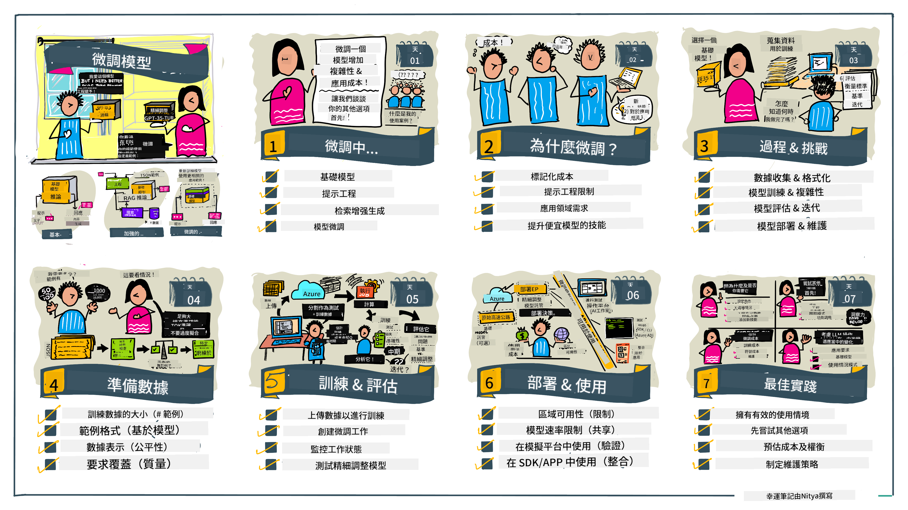

<!--
CO_OP_TRANSLATOR_METADATA:
{
  "original_hash": "68664f7e754a892ae1d8d5e2b7bd2081",
  "translation_date": "2025-06-26T00:33:19+00:00",
  "source_file": "18-fine-tuning/README.md",
  "language_code": "mo"
}
-->

# 微調您的大型語言模型

使用大型語言模型來建立生成式人工智能應用程式會帶來新的挑戰。一個關鍵問題是確保模型對給定用戶請求生成的內容的回應質量（準確性和相關性）。在之前的課程中，我們討論了提示工程和檢索增強生成等技術，這些技術試圖通過修改現有模型的提示輸入來解決問題。

在今天的課程中，我們討論第三種技術，**微調**，它試圖通過用額外的數據重新訓練模型本身來解決挑戰。讓我們深入了解細節。

## 學習目標

本課程介紹預訓練語言模型的微調概念，探討這種方法的優勢和挑戰，並提供何時以及如何使用微調來提高生成式人工智能模型性能的指導。

在本課程結束時，您應該能夠回答以下問題：

- 什麼是語言模型的微調？
- 何時以及為什麼微調有用？
- 我如何微調預訓練模型？
- 微調的限制是什麼？

準備好了嗎？讓我們開始吧。

## 圖解指南

想在深入了解之前掌握我們將涵蓋的整體概念嗎？查看這份圖解指南，它描述了本課程的學習旅程——從學習微調的核心概念和動機，到理解執行微調任務的過程和最佳實踐。這是一個引人入勝的探索主題，所以不要忘記查看[資源](./RESOURCES.md?WT.mc_id=academic-105485-koreyst)頁面以獲取更多支持自我導向學習的鏈接！

## 什麼是語言模型的微調？

按定義，大型語言模型是從包括互聯網在內的多個來源獲取的大量文本中預訓練的。正如我們在之前的課程中所學，我們需要像提示工程和檢索增強生成這樣的技術來提高模型對用戶問題（“提示”）的回應質量。

一種流行的提示工程技術涉及通過提供指令（明確指導）或提供一些例子（隱含指導）來給模型更多的指導，這被稱為少樣本學習，但它有兩個限制：

- 模型令牌限制可能會限制您能提供的示例數量，並限制效果。
- 模型令牌成本可能使每個提示添加示例變得昂貴，並限制靈活性。

微調是機器學習系統中的常見做法，我們採用預訓練模型並用新數據重新訓練以提高其在特定任務上的性能。在語言模型的背景下，我們可以用為特定任務或應用領域精心策劃的一組示例微調預訓練模型，以創建可能更準確和相關的**自定義模型**。微調的一個附帶好處是，它也可以減少少樣本學習所需的示例數量——減少令牌使用和相關成本。

## 何時以及為什麼應該微調模型？

在這個背景下，當我們談論微調時，我們指的是**監督**微調，其中重新訓練是通過**添加新數據**來完成的，這些數據不在原始訓練數據集中。這與無監督微調方法不同，後者是在原始數據上重新訓練模型，但使用不同的超參數。

關鍵是要記住微調是一種需要一定專業知識才能獲得預期結果的高級技術。如果操作不當，它可能無法提供預期的改進，甚至可能降低模型在目標領域的性能。

因此，在學習“如何”微調語言模型之前，您需要知道“為什麼”您應該選擇這條路徑，以及“何時”開始微調過程。首先問自己這些問題：

- **使用案例**：您的微調使用案例是什麼？您想改善當前預訓練模型的哪個方面？
- **替代方案**：您是否嘗試過其他技術來達到預期結果？使用它們創建基準以進行比較。
  - 提示工程：嘗試使用相關提示回應示例進行少樣本提示技術。評估回應質量。
  - 檢索增強生成：嘗試用搜索數據檢索的查詢結果增強提示。評估回應質量。
- **成本**：您是否識別了微調的成本？
  - 可調性——預訓練模型是否可用於微調？
  - 努力——準備訓練數據、評估和完善模型。
  - 計算——運行微調作業和部署微調模型的成本
  - 數據——是否有足夠的優質示例以影響微調
- **收益**：您是否確認了微調的收益？
  - 質量——微調模型是否超越了基準？
  - 成本——是否通過簡化提示減少令牌使用？
  - 可擴展性——您是否可以將基礎模型重新用於新領域？

通過回答這些問題，您應該能夠決定微調是否是您的使用案例的正確方法。理想情況下，只有當收益超過成本時，該方法才有效。一旦您決定繼續，就該考慮如何微調預訓練模型。

想獲得更多決策過程的見解？觀看[是否要進行微調](https://www.youtube.com/watch?v=0Jo-z-MFxJs)

## 我們如何微調預訓練模型？

要微調預訓練模型，您需要：

- 一個可供微調的預訓練模型
- 用於微調的數據集
- 運行微調作業的訓練環境
- 部署微調模型的託管環境

## 微調實踐

以下資源提供逐步教程，帶您通過使用精選模型和精心策劃的數據集的真實示例。要完成這些教程，您需要在特定提供商上擁有一個帳戶，並能訪問相關模型和數據集。

| 提供商       | 教程                                                                                                                                                                       | 描述                                                                                                                                                                                                                                                                                                                                                                                                                        |
| ------------ | ------------------------------------------------------------------------------------------------------------------------------------------------------------------------- | -------------------------------------------------------------------------------------------------------------------------------------------------------------------------------------------------------------------------------------------------------------------------------------------------------------------------------------------------------------------------------------------------------------------------- |
| OpenAI       | [如何微調聊天模型](https://github.com/openai/openai-cookbook/blob/main/examples/How_to_finetune_chat_models.ipynb?WT.mc_id=academic-105485-koreyst)                       | 學習微調`gpt-35-turbo`以特定領域（“食譜助手”）為例，準備訓練數據，運行微調作業，並使用微調模型進行推理。                                                                                                                                                                                                                                                                            |
| Azure OpenAI | [GPT 3.5 Turbo微調教程](https://learn.microsoft.com/azure/ai-services/openai/tutorials/fine-tune?tabs=python-new%2Ccommand-line?WT.mc_id=academic-105485-koreyst)         | 學習在**Azure**上微調`gpt-35-turbo-0613`模型，採取步驟創建和上傳訓練數據，運行微調作業。部署並使用新模型。                                                                                                                                                                                                                                                                             |
| Hugging Face | [使用Hugging Face微調LLM](https://www.philschmid.de/fine-tune-llms-in-2024-with-trl?WT.mc_id=academic-105485-koreyst)                                                     | 本博客文章帶您使用[transformers](https://huggingface.co/docs/transformers/index?WT.mc_id=academic-105485-koreyst)庫和[Transformer Reinforcement Learning (TRL)](https://huggingface.co/docs/trl/index?WT.mc_id=academic-105485-koreyst])以及Hugging Face上的開源[數據集](https://huggingface.co/docs/datasets/index?WT.mc_id=academic-105485-koreyst)微調開放LLM（例如`CodeLlama 7B`）。 |
|              |                                                                                                                                                                           |                                                                                                                                                                                                                                                                                                                                                                                                                            |
| 🤗 AutoTrain | [使用AutoTrain微調LLM](https://github.com/huggingface/autotrain-advanced/?WT.mc_id=academic-105485-koreyst)                                                               | AutoTrain（或AutoTrain Advanced）是由Hugging Face開發的Python庫，允許針對多種不同任務進行微調，包括LLM微調。AutoTrain是一種無代碼解決方案，微調可以在您的雲端、Hugging Face Spaces或本地完成。它支持基於網頁的GUI、CLI和通過yaml配置文件進行訓練。                                                                                       |
|              |                                                                                                                                                                           |                                                                                                                                                                                                                                                                                                                                                                                                                            |

## 作業

選擇上述教程之一並完成它們。我們可能會在此倉庫中使用Jupyter Notebooks複製這些教程的版本僅供參考。請直接使用原始來源以獲取最新版本。

## 幹得好！繼續您的學習。

完成本課程後，請查看我們的[生成式人工智能學習集合](https://aka.ms/genai-collection?WT.mc_id=academic-105485-koreyst)以繼續提升您的生成式人工智能知識！

恭喜您！！您已完成本課程的v2系列的最後一課！不要停止學習和建造。**查看[資源](RESOURCES.md?WT.mc_id=academic-105485-koreyst)頁面以獲取更多僅針對此主題的建議。

我們的v1系列課程也已更新了更多作業和概念。花點時間刷新您的知識——並請[分享您的問題和反饋](https://github.com/microsoft/generative-ai-for-beginners/issues?WT.mc_id=academic-105485-koreyst)以幫助我們改善這些課程以服務社群。

**免責聲明**：
本文件使用 AI 翻譯服務 [Co-op Translator](https://github.com/Azure/co-op-translator) 進行翻譯。我們努力確保準確性，但請注意，自動翻譯可能包含錯誤或不準確之處。應將原始語言的文件視為權威來源。對於關鍵信息，建議尋求專業人工翻譯。我們對因使用此翻譯而產生的任何誤解或誤譯不承擔責任。