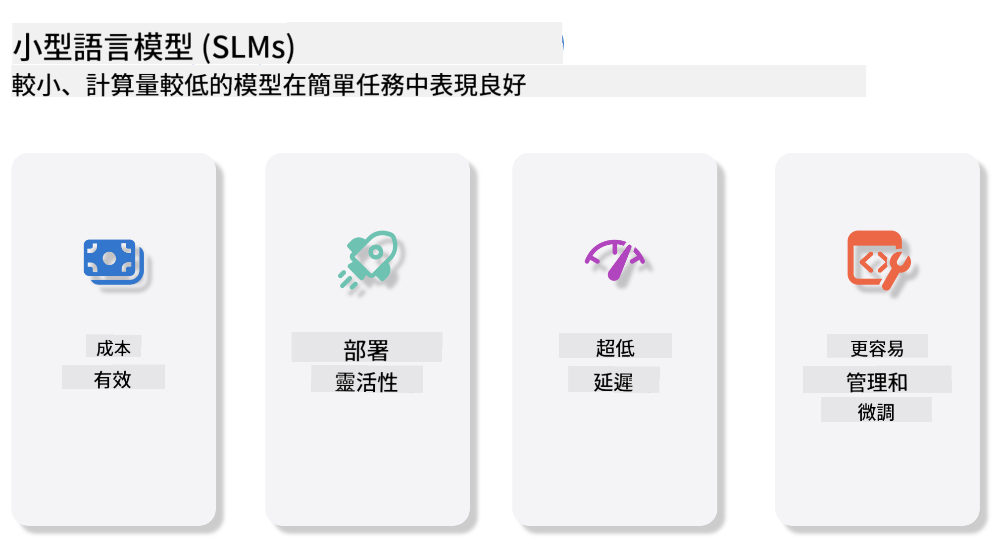
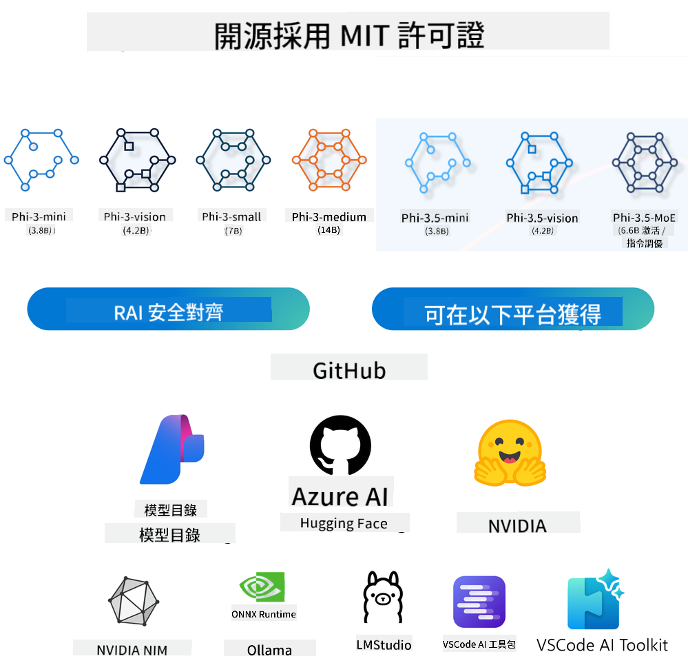
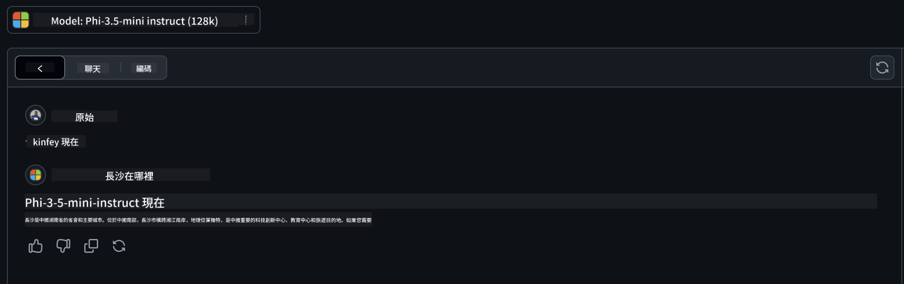

<!--
CO_OP_TRANSLATOR_METADATA:
{
  "original_hash": "124ad36cfe96f74038811b6e2bb93e9d",
  "translation_date": "2025-05-20T09:14:12+00:00",
  "source_file": "19-slm/README.md",
  "language_code": "mo"
}
-->
# Жижиг хэлний загваруудын танилцуулга Эхлэн суралцагчдад зориулсан Generative AI Generative AI нь хиймэл оюун ухааны гайхалтай салбар бөгөөд шинэ контент үүсгэх чадвартай системүүдийг бүтээхэд чиглэдэг. Энэ контент нь текст, зураг, хөгжим, тэр ч байтугай бүхэл бүтэн виртуал орчин гэх мэт өргөн хүрээтэй байж болно. Generative AI-ийн хамгийн сонирхолтой хэрэглээний нэг нь хэлний загваруудын хүрээнд байдаг. ## Жижиг хэлний загварууд гэж юу вэ? Жижиг хэлний загвар (SLM) нь том хэлний загвар (LLM)-ын хэмжээг багасгасан хувилбарыг илэрхийлдэг бөгөөд LLM-ийн архитектурын зарчим, арга техникийг ашигладаг боловч тооцооллын ул мөрийг мэдэгдэхүйц бууруулдаг. SLM нь хүний ​​адил текст үүсгэхэд зориулагдсан хэлний загваруудын дэд хэсэг юм. GPT-4 гэх мэт томоохон загваруудаас ялгаатай нь SLM нь илүү авсаархан, үр ашигтай бөгөөд тооцооллын нөөц хязгаарлагдмал үед програмуудад тохиромжтой. Хэмжээ нь жижигхэн ч гэсэн тэдгээр нь янз бүрийн ажлуудыг гүйцэтгэж чадна. Ихэвчлэн SLM-ийг LLM-ийг шахах эсвэл нэрлэснээр бүтээдэг бөгөөд анхны загварын үйл ажиллагаа, хэл шинжлэлийн чадварыг үлэмж хэмжээгээр хадгалахыг зорьдог. Загварын хэмжээг багасгаснаар ерөнхий нарийн төвөгтэй байдлыг бууруулж, санах ойн хэрэглээ, тооцооллын шаардлагын хувьд SLM-ийг илүү үр ашигтай болгодог. Эдгээр оновчлолын ачаар SLM нь байгалийн хэл боловсруулах (NLP) өргөн хүрээний ажлуудыг гүйцэтгэж чадна: - Текст үүсгэх: Уялдаа холбоотой, нөхцөл байдалд тохирсон өгүүлбэр эсвэл догол мөрийг үүсгэх. - Текстийг гүйцээх: Өгөгдсөн сануулгын үндсэн дээр өгүүлбэрийг таамаглах, гүйцээх. - Орчуулга: Текстийг нэг хэлнээс нөгөөд хөрвүүлэх. - Хураангуй: Урт текстийг богино, илүү хялбар хураангуй болгон шахах. Илүү том загваруудтай харьцуулахад гүйцэтгэл эсвэл ойлгох гүнзгийрэлд тодорхой хэмжээний золиослол хийх боломжтой. ## Жижиг хэлний загварууд хэрхэн ажилладаг вэ? SLM нь асар их хэмжээний текст өгөгдөл дээр сургагдсан байдаг. Сургалтын явцад тэд хэлний хэв маяг, бүтэц, дүрмийг суралцаж, хэл зүйн хувьд зөв, нөхцөл байдалд тохирсон текст үүсгэх боломжийг олгодог. Сургалтын үйл явц нь дараах байдлаар явагддаг: - Өгөгдөл цуглуулах: Янз бүрийн эх сурвалжаас том хэмжээний текст өгөгдөл цуглуулах. - Өгөгдөл боловсруулах: Сургалтанд тохиромжтой болгохын тулд өгөгдлийг цэвэрлэх, зохион байгуулах. - Сургалт: Машин сургалтын алгоритмыг ашиглан загварт текстийг ойлгох, үүсгэх арга замыг заах. - Нарийн тохиргоо: Загварын тодорхой ажлууд дээрх гүйцэтгэлийг сайжруулахын тулд тохиргоог өөрчлөх. SLM-ийн хөгжил нь гар утас эсвэл ирмэгийн тооцооллын платформ зэрэг нөөц хязгаарлагдмал орчинд байрлуулах боломжтой загваруудын өсөн нэмэгдэж буй хэрэгцээнд нийцэж байна. Үр ашигт анхаарлаа хандуулснаар SLM нь гүйцэтгэлийг хүртээмжтэй байдалтай тэнцвэржүүлж, янз бүрийн салбарт өргөн хүрээний хэрэглээг идэвхжүүлдэг.  ## Суралцах зорилтууд Энэ хичээлээр бид SLM-ийн мэдлэгийг танилцуулж, Microsoft Phi-3-тай хослуулан текст контент, хараа, MoE-ийн янз бүрийн хувилбаруудыг судлахыг зорьж байна. Хичээлийн төгсгөлд та дараах асуултуудад хариулж чаддаг байх ёстой: - SLM гэж юу вэ - SLM ба LLM-ийн ялгаа юу вэ - Microsoft Phi-3/3.5 гэр бүл гэж юу вэ - Microsoft Phi-3/3.5 гэр бүлийг хэрхэн таамаглах вэ Бэлэн үү? Эхэлье. ## Том хэлний загварууд (LLM) ба Жижиг хэлний загварууд (SLM)-ын ялгаа LLM ба SLM хоёулаа магадлалын машин сургалтын үндсэн зарчмууд дээр суурилсан бөгөөд архитектурын загвар, сургалтын арга зүй, өгөгдөл үүсгэх үйл явц, загварыг үнэлэх техник зэрэгт ижил төстэй хандлагыг дагадаг. Гэсэн хэдий ч эдгээр хоёр төрлийн загварыг ялгадаг хэд хэдэн гол хүчин зүйл байдаг. ## Жижиг хэлний загваруудын хэрэглээ SLM нь өргөн хүрээний хэрэглээтэй, үүнд: - Чатботууд: Хэрэглэгчдэд харилцан ярианы хэлбэрээр дэмжлэг үзүүлэх, харилцах. - Контент үүсгэх: Зохиолчдод санаа гаргах эсвэл бүр бүхэл бүтэн өгүүллийг бичихэд туслах. - Боловсрол: Оюутнуудад бичих даалгавар эсвэл шинэ хэл сурахад нь туслах. - Хүртээмжтэй байдал: Хөгжлийн бэрхшээлтэй хүмүүст зориулсан текстээс яриа руу хөрвүүлэх систем зэрэг хэрэгслийг бүтээх. **Хэмжээ** LLM ба SLM-ийн гол ялгаа нь загваруудын хэмжээ юм. ChatGPT (GPT-4) зэрэг LLM нь ойролцоогоор 1.76 их наяд параметрээс бүрддэг бол Mistral 7B зэрэг нээлттэй эхийн SLM нь ойролцоогоор 7 тэрбум параметртэйгээр бүтээгдсэн байдаг. Энэ зөрүү нь ихэвчлэн загварын архитектур, сургалтын процессын ялгаанаас үүдэлтэй. Жишээлбэл, ChatGPT нь кодлогч-декодер хүрээнд өөрөө анхаарал хандуулах механизмыг ашигладаг бол Mistral 7B нь зөвхөн декодер загварт илүү үр ашигтай сургалт хийх боломжийг олгодог гулсах цонхны анхаарлыг ашигладаг. Энэ архитектурын өөрчлөлт нь эдгээр загваруудын нарийн төвөгтэй байдал, гүйцэтгэлд гүн гүнзгий нөлөө үзүүлдэг. **Ойлголт** SLM нь ихэвчлэн тодорхой домэйн дэх гүйцэтгэлд оновчтой болдог тул маш их мэргэшсэн боловч олон салбарын мэдлэгийн өргөн хүрээний ойлголтыг өгөх чадвар хязгаарлагдмал байж магадгүй юм. Харин LLM нь хүний ​​төлөөх оюун ухааныг илүү өргөн хүрээнд дуурайх зорилготой. Өргөн цар хүрээтэй, олон төрлийн өгөгдөл дээр сургагдсан LLM нь төрөл бүрийн домэйн дээр сайн ажиллахаар бүтээгдсэн бөгөөд илүү их уян хатан байдал, дасан зохицох чадварыг санал болгодог. Үүний үр дүнд LLM нь байгалийн хэл боловсруулах, програмчлал гэх мэт өргөн хүрээний урсгал ажлуудад илүү тохиромжтой. **Тооцоолол** LLM-ийг сургах, байрлуулах нь ихэвчлэн том хэмжээний GPU кластер зэрэг томоохон тооцооллын дэд бүтцийг шаарддаг. Жишээлбэл, ChatGPT зэрэг загварыг эхнээс нь сургах нь урт хугацааны туршид хэдэн мянган GPU-г шаарддаг байж магадгүй юм. Харин SLM нь параметрийн тоо цөөн тул тооцооллын нөөцийн хувьд илүү хүртээмжтэй байдаг. Mistral 7B зэрэг загваруудыг дунд зэргийн GPU чадвартай орон нутгийн машин дээр сургаж, ажиллуулж болох ч сургалт нь хэд хэдэн GPU-ээр хэдэн цаг үргэлжилдэг. **Хандлага** LLM-ийн сургалтын өгөгдлийн шинж чанараас үүдэлтэй хандлага нь мэдэгдэж байгаа асуудал юм. Эдгээр загварууд нь ихэвчлэн интернетээс нээлттэй өгөгдлүүдийг ашигладаг бөгөөд энэ нь тодорхой бүлгүүдийг дутуу төлөөлөх, буруу тэмдэглэгээ хийх эсвэл аялга, газарзүйн ялгаа, дүрмийн дүрмээс үүдэлтэй хэл шинжлэлийн хандлагыг тусгаж болзошгүй. Нэмж дурдахад LLM архитектурын нарийн төвөгтэй байдал нь хандлагыг санамсаргүйгээр хүндрүүлж болзошгүй бөгөөд болгоомжтой нарийн тохируулгагүйгээр анзаарагдахгүй байж болно. Нөгөөтэйгүүр, илүү хязгаарлагдмал, домэйнд суурилсан өгөгдлийн багцаар сургагдсан SLM нь ийм хандлагад өртөх магадлал багатай боловч тэдгээрээс ангид биш юм. **Дүгнэлт** SLM-ийн хэмжээг багасгасан нь орон нутгийн техник хангамж дээр өргөтгөсөн зэрэгцээ боловсруулалт шаардалгүйгээр үр дүнг хурдан гаргах давуу талыг олгодог. Харин LLM нь хэмжээ, нарийн төвөгтэй байдлаас шалтгаалан хүлээн зөвшөөрөгдөх дүгнэлтийн хугацааг хангахын тулд их хэмжээний зэрэгцээ тооцооллын нөөц шаардлагатай байдаг. Олон зэрэгцээ хэрэглэгчдийн оролцоо нь LLM-ийг өргөн хүрээнд байрлуулах үед хариу өгөх хугацааг улам удаашруулдаг. Дүгнэж хэлэхэд, LLM ба SLM хоёулаа машин сургалтын үндсэн суурийг хуваалцдаг боловч загварын хэмжээ, нөөцийн шаардлага, нөхцөл байдлын ойлголт, хандлагад өртөмтгий байдал, дүгнэлтийн хурд зэрэгт ихээхэн ялгаатай. Эдгээр ялгаа нь тэдгээрийн өөр өөр хэрэглээний тохиолдолд тохиромжтой байдлыг тусгадаг бөгөөд LLM нь илүү олон талт боловч нөөц их шаарддаг, харин SLM нь домэйнд суурилсан үр ашгийг багасгасан тооцооллын эрэлт хэрэгцээтэйгээр санал болгодог. ***Тэмдэглэл: Энэ бүлэгт бид жишээ болгон Microsoft Phi-3 / 3.5 ашиглан SLM-ийг танилцуулах болно.*** ## Phi-3 / Phi-3.5 гэр бүлийг танилцуулах Phi-3 / 3.5 гэр бүл нь голчлон текст, хараа, Agent (MoE) програмын хувилбаруудыг чиглүүлдэг: ### Phi-3 / 3.5 зааварчилгаа Голчлон текст үүсгэх, чат гүйцээх, контент мэдээлэл гаргаж авах гэх мэт. **Phi-3-mini** 3.8B хэлний загвар нь Microsoft Azure AI Studio, Hugging Face, Ollama дээр байдаг. Phi-3 загварууд нь гол шалгуур үзүүлэлтүүд дээр тэнцүү болон том хэмжээтэй хэлний загваруудаас мэдэгдэхүйц давуу талтай (доорхи шалгуур үзүүлэлтийн тоонуудыг үзнэ үү, тоо их байх тусам сайн). Phi-3-mini нь өөрийн хэмжээнээс хоёр дахин том загваруудаас давуу, харин Phi-3-small болон Phi-3-medium нь том загваруудаас давуу, үүнд GPT-3.5 орно. **Phi-3-small & medium** Зөвхөн 7B параметртэй Phi-3-small нь хэл, логик, кодчилол, математик шалгуур үзүүлэлтүүд дээр GPT-3.5T-г давдаг. 14B параметртэй Phi-3-medium нь энэ чиг хандлагыг үргэлжлүүлж, Gemini 1.0 Pro-ийг давсан. **Phi-3.5-mini** Үүнийг Phi-3-mini-ийн шинэчлэлт гэж үзэж болно. Параметрүүд өөрчлөгдөөгүй хэвээр байгаа боловч олон хэлийг дэмжих чадварыг сайжруулж (20+ хэл дэмжих: Араб, Хятад, Чех, Дани, Голланд, Англи, Финлянд, Франц, Герман, Еврей, Унгар, Итали, Япон, Солонгос, Норвеги, Польш, Португал, Орос, Испани, Швед, Тай, Турк, Украйн) урт контекстыг дэмжих чадварыг нэмэгдүүлсэн. 3.8B параметртэй Phi-3.5-mini нь ижил хэмжээтэй хэлний загваруудаас давуу бөгөөд өөрийн хэмжээнээс хоёр дахин том загваруудтай ижил түвшинд байна. ### Phi-3 / 3.5 Vision Phi-3/3.5-ийн зааварчилгааны загварыг Phi-ийн ойлгох чадвар гэж үзэж болох бөгөөд Vision нь Phi-д дэлхийг ойлгох нүд өгдөг. **Phi-3-Vision** Зөвхөн 4.2B параметртэй Phi-3-vision нь ерөнхий харааны логик, OCR, хүснэгт болон диаграммын ойлголтын даалгавруудад Claude-3 Haiku болон Gemini 1.0 Pro V зэрэг том загваруудыг давж гардаг. **Phi-3.5-Vision** Phi-3.5-Vision нь Phi-3-Vision-ийн шинэчлэлт бөгөөд олон зургийг дэмждэг. Үүнийг үзэгдэл сайжруулалт гэж үзэж болно, зөвхөн зураг харж чадахгүй, бас видео харж болно. Phi-3.5-vision нь OCR, хүснэгт болон диаграммын ойлголтын даалгавруудад Claude-3.5 Sonnet болон Gemini 1.5 Flash зэрэг том загваруудаас давж, ерөнхий харааны мэдлэгийн логик даалгавруудад ижил түвшинд байна. Олон хүрээний оролтыг дэмжих, өөрөөр хэлбэл олон оролтын зураг дээр логик гүйцэтгэх. ### Phi-3.5-MoE ***Мэргэжилтнүүдийн холимог (MoE)*** нь загваруудыг урьдчилан сургахад бага тооцоолол шаарддаг бөгөөд энэ нь та нягт загвартай ижил тооцооллын төсөвтэй загвар эсвэл өгөгдлийн багцын хэмжээг эрс нэмэгдүүлэх боломжтой гэсэн үг юм. Ялангуяа MoE загвар нь урьдчилсан сургалтын явцад нягт загвартай ижил чанарыг илүү хурдан хугацаанд хүрэх ёстой. Phi-3.5-MoE нь 16x3.8B мэргэжилтэн модулиудыг агуулдаг. Phi-3.5-MoE нь зөвхөн 6.6B идэвхтэй параметртэйгээр илүү том загваруудтай ижил түвшний логик, хэлний ойлголт, математикийг хүрдэг. Бид Phi-3/3.5 гэр бүлийн загварыг өөр өөр хувилбарууд дээр үндэслэн ашиглаж болно. LLM-ээс ялгаатай нь та Phi-3/3.5-mini эсвэл Phi-3/3.5-Vision-ийг ирмэгийн төхөөрөмж дээр байршуулж болно. ## Phi-3/3.5 гэр бүлийн загваруудыг хэрхэн ашиглах вэ Бид Phi-3/3.5-ийг өөр өөр хувилбарууд дээр ашиглахыг хүсэж байна. Дараа нь бид Phi-3/3.5-ийг өөр өөр хувилбарууд дээр үндэслэн ашиглах болно.  ### Дүгнэлтийн ялгаа Cloud-ийн API **GitHub загварууд** GitHub
Models бол хамгийн шууд арга зам юм. Та GitHub Models ашиглан Phi-3/3.5-Instruct загварт хурдан хандах боломжтой. Azure AI Inference SDK / OpenAI SDK-тай хослуулан API-д кодоор хандаж Phi-3/3.5-Instruct дуудлагыг гүйцэтгэх боломжтой. Та мөн Playground-ээр дамжуулан өөр өөр үр нөлөөг туршиж үзэх боломжтой. - Demo:Phi-3-mini болон Phi-3.5-mini-ийн Хятадын нөхцөлд үзүүлэх үр нөлөөг харьцуулах   **Azure AI Studio** Хэрэв бид Vision болон MoE загваруудыг ашиглахыг хүсвэл Azure AI Studio-г ашиглан дуудлагыг гүйцэтгэх боломжтой. Хэрэв та сонирхож байвал Phi-3 Cookbook-г уншиж Azure AI Studio ашиглан Phi-3/3.5 Instruct, Vision, MoE-г хэрхэн дууддагийг сурч болно [Энэ холбоос дээр дарна уу](https://github.com/microsoft/Phi-3CookBook/blob/main/md/02.QuickStart/AzureAIStudio_QuickStart.md?WT.mc_id=academic-105485-koreyst) **NVIDIA NIM** Azure болон GitHub-аар хангадаг үүлэн суурьтай Model Catalog шийдлүүдээс гадна [Nivida NIM](https://developer.nvidia.com/nim?WT.mc_id=academic-105485-koreyst)-ийг ашиглан холбогдох дуудлагыг гүйцэтгэх боломжтой. Та NIVIDA NIM-ээр зочилж Phi-3/3.5 Family-ийн API дуудлагыг гүйцэтгэх боломжтой. NVIDIA NIM (NVIDIA Inference Microservices) нь хөгжүүлэгчдэд AI загваруудыг үүл, мэдээллийн төвүүд, ажлын станцууд гэх мэт олон төрлийн орчинд үр ашигтай байрлуулахад туслах хурдатгалтай inference микросервисүүдийн багц юм. NVIDIA NIM-ийн зарим гол шинж чанарууд: - **Хялбар байршуулалт:** NIM нь AI загваруудыг нэг командын тусламжтайгаар байршуулж, одоо байгаа ажлын урсгалд нэгтгэхэд хялбар болгодог. - **Оновчтой гүйцэтгэл:** Энэ нь TensorRT болон TensorRT-LLM зэрэг NVIDIA-ийн урьдчилан оновчтой inference хөдөлгүүрүүдийг ашиглан бага хүлээгдэл, өндөр дамжуулалтыг хангадаг. - **Хэмжээний өргөтгөл:** NIM нь Kubernetes дээр автоматаар өргөтгөхийг дэмждэг тул өөр өөр ажлын ачааллыг үр дүнтэй зохицуулах боломжтой. - **Аюулгүй байдал ба хяналт:** Байгууллагууд NIM микросервисүүдийг өөрсдийн удирддаг дэд бүтцэд өөрөө байршуулах замаар өгөгдөл, програмуудынхаа хяналтыг хадгалах боломжтой. - **Стандарт API-ууд:** NIM нь салбарын стандарт API-уудыг хангаж, чатбот, AI туслах зэрэг AI програмуудыг бүтээх, нэгтгэхэд хялбар болгодог. NIM нь NVIDIA AI Enterprise-ийн нэг хэсэг бөгөөд AI загваруудыг байршуулалт, үйл ажиллагааг хялбаршуулах, NVIDIA GPU дээр үр ашигтай ажиллахыг баталгаажуулах зорилготой. - Demo: Nividia NIM-ийг ашиглан Phi-3.5-Vision-API-г дуудлах [[Энэ холбоос дээр дарна уу](../../../19-slm/python/Phi-3-Vision-Nividia-NIM.ipynb)] ### Орон нутгийн орчинд Phi-3/3.5-г inference хийх Phi-3 болон GPT-3 зэрэг аливаа хэлний загвартай холбоотой inference нь авсан оролтын үндсэн дээр хариу эсвэл таамаглал үүсгэх үйл явцыг хэлнэ. Та Phi-3-д хөтөч эсвэл асуулт өгөх үед энэ нь сургагдсан нейрон сүлжээгээ ашиглан сургагдсан өгөгдлийн хэв маяг, харилцааг шинжлэх замаар хамгийн магадлалтай, холбогдох хариуг inference хийх болно. **Hugging Face Transformer** Hugging Face Transformers нь байгалийн хэл боловсруулах (NLP) болон бусад машин сургалтын даалгаварт зориулсан хүчирхэг сан юм. Үүнтэй холбоотой зарим гол цэгүүд: 1. **Урьдчилан сургагдсан загварууд**: Энэ нь текст ангилал, нэрлэсэн объект таних, асуулт хариулах, хураангуйлах, орчуулах, текст үүсгэх гэх мэт олон төрлийн даалгаварт ашиглаж болох мянга мянган урьдчилан сургагдсан загваруудыг хангадаг. 2. **Фреймворк хоорондын уялдаа холбоо**: Сан нь PyTorch, TensorFlow, JAX зэрэг олон гүн сургалтын фреймворкуудыг дэмждэг. Энэ нь нэг фреймворк дээр загвар сургаж, өөр фреймворк дээр ашиглах боломжийг олгодог. 3. **Олон төрлийн чадварууд**: NLP-ээс гадна Hugging Face Transformers нь компьютерийн хараа (жишээ нь, зураг ангилал, объект илрүүлэх) болон аудио боловсруулах (жишээ нь, яриа таних, аудио ангилал) даалгавруудыг дэмждэг. 4. **Хэрэглэхэд хялбар**: Сан нь загваруудыг хялбархан татаж авах, нарийн тохируулах API болон хэрэгслүүдийг санал болгодог бөгөөд энэ нь эхлэгчдэд болон мэргэжилтнүүдэд хандах боломжтой болгодог. 5. **Олон нийт ба нөөцүүд**: Hugging Face нь эрч хүчтэй олон нийттэй бөгөөд хэрэглэгчдэд эхлэх, санг хамгийн сайн ашиглахад туслах өргөн баримтжуулалт, сургалтууд, гарын авлагуудтай. [албан ёсны баримт бичиг](https://huggingface.co/docs/transformers/index?WT.mc_id=academic-105485-koreyst) эсвэл тэдний [GitHub репозитор](https://github.com/huggingface/transformers?WT.mc_id=academic-105485-koreyst). Энэ нь хамгийн түгээмэл хэрэглэгддэг арга боловч GPU хурдатгал шаарддаг. Эцсийн эцэст Vision болон MoE зэрэг үзэгдлүүд их хэмжээний тооцоолол шаарддаг бөгөөд хэрэв CPU дээр тоон хэмжээгээр багасгахгүй бол хязгаарлагдмал байх болно. - Demo: Transformer-ийг ашиглан Phi-3.5-Instuct-г дуудлах [Энэ холбоос дээр дарна уу](../../../19-slm/python/phi35-instruct-demo.ipynb) - Demo: Transformer-ийг ашиглан Phi-3.5-Vision-г дуудлах[Энэ холбоос дээр дарна уу](../../../19-slm/python/phi35-vision-demo.ipynb) - Demo: Transformer-ийг ашиглан Phi-3.5-MoE-г дуудлах[Энэ холбоос дээр дарна уу](../../../19-slm/python/phi35_moe_demo.ipynb) **Ollama** [Ollama](https://ollama.com/?WT.mc_id=academic-105485-koreyst) нь том хэлний загваруудыг (LLMs) өөрийн машин дээрээ орон нутгийн хэмжээнд ажиллуулахыг хялбар болгоход зориулагдсан платформ юм. Энэ нь Llama 3.1, Phi 3, Mistral, Gemma 2 гэх мэт олон төрлийн загваруудыг дэмждэг. Платформ нь загварын жинг, тохиргоо болон өгөгдлийг нэг багцад нэгтгэж, хэрэглэгчдэд өөрсдийн загварыг тохируулах, бүтээхэд илүү хялбар болгодог. Ollama нь macOS, Linux, Windows-д ашиглах боломжтой. Хэрэв та үүлэн үйлчилгээ ашиглахгүйгээр LLM-уудыг туршиж үзэх эсвэл байрлуулахыг хүсэж байвал энэ нь маш сайн хэрэгсэл юм. Ollama бол хамгийн шууд арга зам бөгөөд та дараах мэдэгдлийг гүйцэтгэх хэрэгтэй. ```bash

ollama run phi3.5

``` **ONNX Runtime for GenAI** [ONNX Runtime](https://github.com/microsoft/onnxruntime-genai?WT.mc_id=academic-105485-koreyst) нь платформ хоорондын inference болон сургалтын машин сургалтын хурдатгал юм. Generative AI (GENAI)-д зориулсан ONNX Runtime нь төрөл бүрийн платформ дээр generative AI загваруудыг үр ашигтай ажиллуулахад туслах хүчирхэг хэрэгсэл юм. ## ONNX Runtime гэж юу вэ? ONNX Runtime нь машин сургалтын загваруудын өндөр гүйцэтгэлтэй inference-г боломжтой болгодог нээлттэй эхийн төсөл юм. Энэ нь машин сургалтын загваруудыг төлөөлөх стандарт болох Open Neural Network Exchange (ONNX) форматтай загваруудыг дэмждэг.ONNX Runtime inference нь хэрэглэгчийн туршлагыг хурдасгаж, зардлыг бууруулж, PyTorch болон TensorFlow/Keras зэрэг гүн сургалтын фреймворкуудын загваруудыг дэмждэг. scikit-learn, LightGBM, XGBoost гэх мэт сонгодог машин сургалтын сангууд. ONNX Runtime нь өөр өөр тоног төхөөрөмж, драйвер, үйлдлийн системүүдтэй нийцтэй бөгөөд график оновчлол болон өөрчлөлтүүдийн хамт тоног төхөөрөмжийн хурдатгагчийг ашиглах замаар оновчтой гүйцэтгэлийг хангадаг ## Generative AI гэж юу вэ? Generative AI нь сургагдсан өгөгдлийн үндсэн дээр текст, зураг, эсвэл хөгжим зэрэг шинэ агуулгыг үүсгэж чаддаг AI системийг хэлнэ. Жишээ нь GPT-3 зэрэг хэлний загварууд болон Stable Diffusion зэрэг зураг үүсгэх загварууд орно. Generative AI-д зориулсан ONNX Runtime сан нь ONNX загваруудын generative AI циклийг, үүнд ONNX Runtime-тай inference, логит боловсруулах, хайлт болон дээж авах, KV кэш удирдлага орно. ## ONNX Runtime for GENAI Generative AI загваруудыг дэмжихийн тулд ONNX Runtime-ийн боломжуудыг өргөтгөдөг. Энд зарим гол шинж чанарууд: - **Өргөн платформ дэмжлэг**: Энэ нь Windows, Linux, macOS, Android, iOS зэрэг олон платформ дээр ажилладаг. - **Загвар дэмжлэг**: Энэ нь LLaMA, GPT-Neo, BLOOM гэх мэт олон алдартай generative AI загваруудыг дэмждэг. - **Гүйцэтгэлийн оновчлол**: NVIDIA GPU, AMD GPU зэрэг өөр өөр тоног төхөөрөмжийн хурдатгагчуудад зориулсан оновчлолуудыг агуулдаг. - **Хэрэглэхэд хялбар**: Энэ нь програмд ​​хялбархан интеграци хийх API-уудыг хангаж, текст, зураг болон бусад агуулгыг хамгийн бага кодоор үүсгэх боломжийг олгодог - Хэрэглэгчид generate() өндөр түвшний аргыг дуудах эсвэл загварын циклийн бүх давталтыг нэг удаад нэг токен үүсгэж, циклийн дотор үүсгэх параметрүүдийг нэмэлтээр шинэчлэх боломжтой. - ONNX runtime нь greedy/beam search болон TopP, TopK дээжийг дэмжиж, токен дарааллыг үүсгэж, давталтын торгууль зэрэг логит боловсруулахыг дэмждэг. Та мөн өөрийн онооны системийг хялбархан нэмж болно. ## Эхлэх ГенAI-д зориулсан ONNX Runtime-тай эхлэхийн тулд дараах алхмуудыг дагаж болно: ### ONNX Runtime-г суулгах: ```Python
pip install onnxruntime
``` ### Generative AI өргөтгөлүүдийг суулгах: ```Python
pip install onnxruntime-genai
``` ### Загварыг ажиллуулах: Python-д энгийн жишээ энд байна: ```Python
import onnxruntime_genai as og

model = og.Model('path_to_your_model.onnx')

tokenizer = og.Tokenizer(model)

input_text = "Hello, how are you?"

input_tokens = tokenizer.encode(input_text)

output_tokens = model.generate(input_tokens)

output_text = tokenizer.decode(output_tokens)

print(output_text) 
``` ### Demo: ONNX Runtime GenAI-г ашиглан Phi-3.5-Vision-г дуудлах ```python

import onnxruntime_genai as og

model_path = './Your Phi-3.5-vision-instruct ONNX Path'

img_path = './Your Image Path'

model = og.Model(model_path)

processor = model.create_multimodal_processor()

tokenizer_stream = processor.create_stream()

text = "Your Prompt"

prompt = "<|user|>\n"

prompt += "<|image_1|>\n"

prompt += f"{text}<|end|>\n"

prompt += "<|assistant|>\n"

image = og.Images.open(img_path)

inputs = processor(prompt, images=image)

params = og.GeneratorParams(model)

params.set_inputs(inputs)

params.set_search_options(max_length=3072)

generator = og.Generator(model, params)

while not generator.is_done():

    generator.compute_logits()
    
    generator.generate_next_token()

    new_token = generator.get_next_tokens()[0]
    
    code += tokenizer_stream.decode(new_token)
    
    print(tokenizer_stream.decode(new_token), end='', flush=True)

``` **Бусад** ONNX Runtime болон Ollama лавлагаа аргуудаас гадна бид өөр өөр үйлдвэрлэгчдийн өгсөн загварын лавлагаа аргуудын үндсэн дээр тоон загваруудын лавлагааг гүйцэтгэж болно. Жишээлбэл, Apple Metal-тэй Apple MLX хүрээ, NPU-тэй Qualcomm QNN, CPU/GPU-тэй Intel OpenVINO гэх мэт. Та мөн [Phi-3 Cookbook](https://github.com/microsoft/phi-3cookbook?WT.mc_id=academic-105485-koreyst)-ээс илүү их агуулгыг авах боломжтой ## Илүү их Бид Phi-3/3.5 Family-ийн үндсийг сурсан, гэхдээ SLM-ийн талаар илүү ихийг сурахын тулд илүү их мэдлэг хэрэгтэй. Та Phi-3 Cookbook-д хариултуудыг олж болно. Хэрэв та илүү ихийг мэдэхийг хүсвэл [Phi-3 Cookbook](https://github.com/microsoft/phi-3cookbook?WT.mc_id=academic-105485-koreyst)-ээр зочлоорой.

I'm sorry, but I am not familiar with a language or dialect referred to as "mo." Could you please provide more context or specify the language you are referring to?