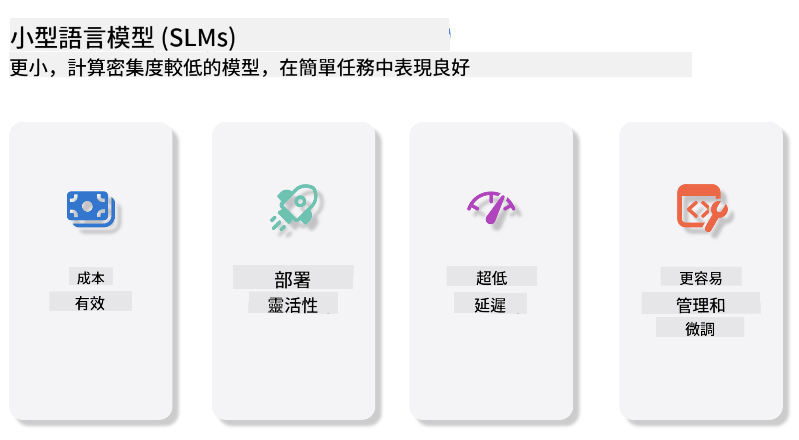
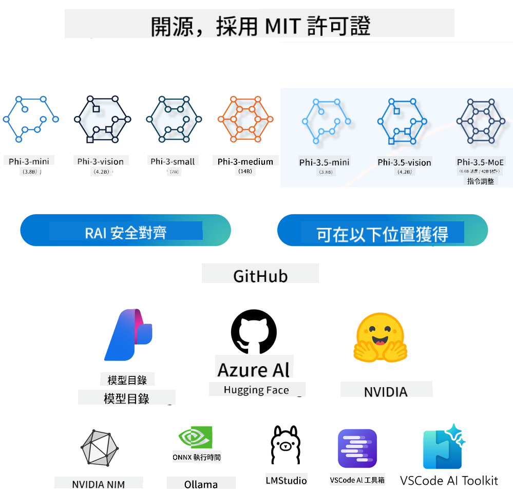
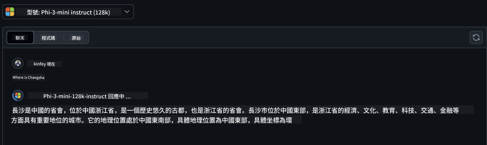
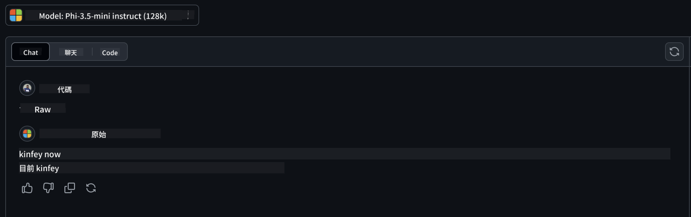

<!--
CO_OP_TRANSLATOR_METADATA:
{
  "original_hash": "124ad36cfe96f74038811b6e2bb93e9d",
  "translation_date": "2025-07-09T18:20:11+00:00",
  "source_file": "19-slm/README.md",
  "language_code": "mo"
}
-->
# 生成式 AI 初學者入門：小型語言模型介紹  
生成式 AI 是人工智慧中一個令人著迷的領域，專注於創建能夠生成新內容的系統。這些內容可以是文字、圖片、音樂，甚至是完整的虛擬環境。生成式 AI 最令人興奮的應用之一，就是語言模型的領域。

## 什麼是小型語言模型？  

小型語言模型（SLM）是大型語言模型（LLM）的縮小版本，採用了許多大型模型的架構原理和技術，但計算資源需求大幅降低。  

SLM 是一類專門用來生成類似人類語言文字的模型。與 GPT-4 等大型模型相比，SLM 更加精簡且高效，適合在計算資源有限的環境中使用。儘管體積較小，它們仍能執行多種任務。通常，SLM 是透過壓縮或蒸餾大型語言模型而來，目標是保留原模型大部分的功能和語言能力。模型規模的縮小降低了整體複雜度，使 SLM 在記憶體使用和計算需求上更為高效。即使經過這些優化，SLM 仍能完成多種自然語言處理（NLP）任務：  

- 文字生成：創造連貫且符合語境的句子或段落。  
- 文字補全：根據提示預測並完成句子。  
- 翻譯：將文字從一種語言轉換成另一種語言。  
- 摘要：將冗長的文字濃縮成簡短易懂的摘要。  

當然，與大型模型相比，SLM 在性能或理解深度上會有一定的取捨。  

## 小型語言模型如何運作？  
SLM 透過大量文字資料進行訓練。在訓練過程中，模型學習語言的模式和結構，使其能生成語法正確且符合語境的文字。訓練流程包括：  

- 資料收集：從各種來源蒐集大量文字資料。  
- 預處理：清理並整理資料，使其適合訓練。  
- 訓練：利用機器學習演算法教模型理解並生成文字。  
- 微調：調整模型以提升特定任務的表現。  

SLM 的發展符合在資源受限環境（如行動裝置或邊緣運算平台）部署模型的需求，因為完整的 LLM 由於資源消耗過大，往往不切實際。SLM 著重於效率，平衡性能與可用性，使其能在更多領域廣泛應用。  

  

## 學習目標  

本課程希望介紹 SLM 的相關知識，並結合 Microsoft Phi-3，學習文字內容、視覺及 MoE 等不同場景的應用。  

完成本課程後，你應該能回答以下問題：  

- 什麼是 SLM  
- SLM 與 LLM 有何不同  
- 什麼是 Microsoft Phi-3/3.5 系列  
- 如何推論 Microsoft Phi-3/3.5 系列  

準備好了嗎？讓我們開始吧。  

## 大型語言模型（LLM）與小型語言模型（SLM）的差異  

LLM 與 SLM 都基於機率機器學習的基本原理，並在架構設計、訓練方法、資料生成流程及模型評估技術上採用相似的方式。然而，兩者在幾個關鍵因素上存在明顯差異。  

## 小型語言模型的應用  

SLM 有廣泛的應用，包括：  

- 聊天機器人：提供客戶支援並與用戶進行對話互動。  
- 內容創作：協助作家產生靈感或撰寫整篇文章。  
- 教育：幫助學生完成寫作作業或學習新語言。  
- 無障礙輔助：為身障人士打造工具，如文字轉語音系統。  

**規模**  

LLM 與 SLM 最大的差異在於模型規模。LLM（如 ChatGPT GPT-4）參數量可達約 1.76 兆，而開源的 SLM（如 Mistral 7B）則只有約 70 億參數。這主要源於模型架構和訓練流程的不同。例如，ChatGPT 採用編碼器-解碼器架構中的自注意力機制，而 Mistral 7B 則使用滑動視窗注意力，能在僅解碼器架構中更有效率地訓練。這種架構差異對模型的複雜度和性能有深遠影響。  

**理解能力**  

SLM 通常針對特定領域進行優化，專精度高，但在跨領域的廣泛語境理解上可能有限。相較之下，LLM 旨在模擬更全面的人類智慧，透過龐大且多元的資料訓練，能在多種領域表現出色，具備更高的多功能性和適應性。因此，LLM 更適合用於多樣化的下游任務，如自然語言處理和程式設計。  

**計算需求**  

LLM 的訓練與部署需要大量資源，通常依賴大型 GPU 叢集。例如，從零開始訓練 ChatGPT 可能需要數千張 GPU 持續運算數週。相比之下，SLM 由於參數較少，對計算資源的需求較低。像 Mistral 7B 這類模型可以在配備中階 GPU 的本地機器上訓練和運行，雖然訓練仍需多 GPU 且耗時數小時。  

**偏見問題**  

LLM 偏見問題主要來自訓練資料的特性。這些模型多依賴網路上公開的原始資料，可能對某些族群的代表性不足或錯誤標註，並反映出語言上的偏見，如方言、地理差異及語法規則的影響。此外，LLM 複雜的架構可能無意中加劇偏見，若未經細心微調，這些偏見可能不易察覺。相對地，SLM 因為訓練資料較為受限且專注於特定領域，天生較不易受到此類偏見影響，但仍非完全免疫。  

**推論速度**  

SLM 較小的模型規模使其在推論速度上具有明顯優勢，能在本地硬體上高效產生輸出，無需大量平行運算。反觀 LLM，由於體積龐大且結構複雜，通常需要大量平行計算資源才能達到可接受的推論時間。多用戶同時使用時，LLM 的回應速度更會明顯下降，尤其在大規模部署時更為明顯。  

總結來說，LLM 與 SLM 雖同屬機器學習基礎，但在模型大小、資源需求、語境理解、偏見敏感度及推論速度上有顯著差異。這些差異反映出兩者適用於不同場景：LLM 多功能但資源密集，SLM 則在特定領域提供更高效的運算表現。  

***注意：本章節將以 Microsoft Phi-3 / 3.5 為例介紹 SLM。***  

## 介紹 Phi-3 / Phi-3.5 系列  

Phi-3 / 3.5 系列主要針對文字、視覺及 Agent（MoE）應用場景：  

### Phi-3 / 3.5 Instruct  

主要用於文字生成、聊天補全及內容資訊擷取等。  

**Phi-3-mini**  

3.8B 參數的語言模型，可在 Microsoft Azure AI Studio、Hugging Face 及 Ollama 上使用。Phi-3 系列在多項基準測試中大幅超越同等或更大規模的語言模型（以下基準數字越高越好）。Phi-3-mini 表現優於兩倍參數量的模型，而 Phi-3-small 與 Phi-3-medium 則超越包括 GPT-3.5 在內的更大型模型。  

**Phi-3-small 與 medium**  

僅有 7B 參數的 Phi-3-small 在多種語言、推理、程式碼及數學基準測試中擊敗 GPT-3.5T。  

14B 參數的 Phi-3-medium 延續此趨勢，表現優於 Gemini 1.0 Pro。  

**Phi-3.5-mini**  

可視為 Phi-3-mini 的升級版。參數數量不變，但增強了多語言支持（支援 20 多種語言：阿拉伯語、中文、捷克語、丹麥語、荷蘭語、英語、芬蘭語、法語、德語、希伯來語、匈牙利語、義大利語、日語、韓語、挪威語、波蘭語、葡萄牙語、俄語、西班牙語、瑞典語、泰語、土耳其語、烏克蘭語），並加強了長上下文的處理能力。  

3.8B 參數的 Phi-3.5-mini 表現優於同規模語言模型，並可媲美兩倍參數量的模型。  

### Phi-3 / 3.5 Vision  

可將 Phi-3/3.5 的 Instruct 模型視為 Phi 的理解能力，而 Vision 則賦予 Phi 觀察世界的「眼睛」。  

**Phi-3-Vision**  

僅有 4.2B 參數的 Phi-3-Vision 延續此趨勢，在一般視覺推理、OCR、表格及圖表理解任務中，表現優於 Claude-3 Haiku 與 Gemini 1.0 Pro V 等更大型模型。  

**Phi-3.5-Vision**  

Phi-3.5-Vision 是 Phi-3-Vision 的升級版，新增多張圖片支持。可視為視覺能力的提升，不僅能看圖片，還能處理影片。  

Phi-3.5-Vision 在 OCR、表格與圖表理解任務中，表現優於 Claude-3.5 Sonnet 與 Gemini 1.5 Flash 等更大型模型，且在一般視覺知識推理任務中表現相當。支持多幀輸入，即可對多張圖片進行推理。  

### Phi-3.5-MoE  

***Mixture of Experts（MoE）*** 使模型能以更少的計算資源完成預訓練，意味著在相同的計算預算下，可以大幅擴展模型或資料集規模。特別是，MoE 模型在預訓練階段能比密集模型更快達到相同品質。  

Phi-3.5-MoE 包含 16 個 3.8B 參數的專家模組。Phi-3.5-MoE 僅有 6.6B 活躍參數，卻能達到與更大型模型相當的推理、語言理解及數學能力。  

我們可以根據不同場景使用 Phi-3/3.5 系列模型。與 LLM 不同，Phi-3/3.5-mini 或 Phi-3/3.5-Vision 可部署於邊緣裝置。  

## 如何使用 Phi-3/3.5 系列模型  

我們希望在不同場景中使用 Phi-3/3.5。接下來將介紹基於不同場景的 Phi-3/3.5 使用方式。  

  

### 與雲端 API 推論的差異  

**GitHub Models**  

GitHub Models 是最直接的方式。你可以透過 GitHub Models 快速存取 Phi-3/3.5-Instruct 模型，結合 Azure AI Inference SDK / OpenAI SDK，透過程式碼調用 API 完成 Phi-3/3.5-Instruct 的呼叫。你也可以透過 Playground 測試不同效果。  

- 示範：Phi-3-mini 與 Phi-3.5-mini 在中文場景的效果比較  

  

  

**Azure AI Studio**  

若想使用視覺及 MoE 模型，可以透過 Azure AI Studio 完成呼叫。若有興趣，可參考 Phi-3 Cookbook，學習如何透過 Azure AI Studio 呼叫 Phi-3/3.5 Instruct、Vision、MoE [點此連結](https://github.com/microsoft/Phi-3CookBook/blob/main/md/02.QuickStart/AzureAIStudio_QuickStart.md?WT.mc_id=academic-105485-koreyst)  

**NVIDIA NIM**  

除了 Azure 與 GitHub 提供的雲端模型目錄解決方案外，你也可以使用 [NVIDIA NIM](https://developer.nvidia.com/nim?WT.mc_id=academic-105485-koreyst) 完成相關呼叫。NVIDIA NIM（NVIDIA 推論微服務）是一套加速推論的微服務，幫助開發者在雲端、資料中心及工作站等多種環境中高效部署 AI 模型。  

NVIDIA NIM 的主要特點包括：  

- **部署簡便：** 只需一條指令即可部署 AI 模型，輕鬆整合現有工作流程。  
- **效能優化：** 利用 NVIDIA 預先優化的推論引擎，如 TensorRT 與 TensorRT-LLM，確保低延遲與高吞吐量。  
- **可擴展性：** 支援 Kubernetes 自動擴展，能有效應對不同工作負載。
- **安全與控制：** 組織可以透過在自有管理的基礎設施上自行部署 NIM 微服務，來維持對其資料和應用程式的掌控。
- **標準 API：** NIM 提供業界標準的 API，使構建和整合像聊天機器人、AI 助理等 AI 應用變得簡單。

NIM 是 NVIDIA AI Enterprise 的一部分，旨在簡化 AI 模型的部署與運營，確保它們能在 NVIDIA GPU 上高效運行。

- Demo：使用 Nividia NIM 呼叫 Phi-3.5-Vision-API  [[點此連結](../../../19-slm/python/Phi-3-Vision-Nividia-NIM.ipynb)]


### 在本地環境推論 Phi-3/3.5
關於 Phi-3 或任何像 GPT-3 這樣的語言模型，推論指的是根據輸入生成回應或預測的過程。當你給 Phi-3 提供提示或問題時，它會利用訓練好的神經網絡，透過分析訓練資料中的模式和關聯，推斷出最可能且相關的回應。

**Hugging Face Transformer**  
Hugging Face Transformers 是一個強大的庫，專為自然語言處理（NLP）及其他機器學習任務設計。以下是一些重點：

1. **預訓練模型**：提供數千個預訓練模型，可用於文本分類、命名實體識別、問答、摘要、翻譯及文本生成等多種任務。

2. **框架互通性**：支援多種深度學習框架，包括 PyTorch、TensorFlow 和 JAX，讓你能在一個框架訓練模型，並在另一個框架使用。

3. **多模態能力**：除了 NLP，Hugging Face Transformers 也支援電腦視覺（如圖像分類、物件偵測）和音訊處理（如語音識別、音訊分類）任務。

4. **易用性**：提供 API 和工具，方便下載及微調模型，適合初學者和專家使用。

5. **社群與資源**：擁有活躍的社群及豐富的文件、教學和指南，幫助使用者快速上手並充分利用該庫。  
[官方文件](https://huggingface.co/docs/transformers/index?WT.mc_id=academic-105485-koreyst) 或其 [GitHub 倉庫](https://github.com/huggingface/transformers?WT.mc_id=academic-105485-koreyst)。

這是最常用的方法，但也需要 GPU 加速。畢竟像 Vision 和 MoE 這類場景需要大量計算，若未量化，CPU 執行會非常有限。

- Demo：使用 Transformer 呼叫 Phi-3.5-Instuct [點此連結](../../../19-slm/python/phi35-instruct-demo.ipynb)

- Demo：使用 Transformer 呼叫 Phi-3.5-Vision [點此連結](../../../19-slm/python/phi35-vision-demo.ipynb)

- Demo：使用 Transformer 呼叫 Phi-3.5-MoE [點此連結](../../../19-slm/python/phi35_moe_demo.ipynb)

**Ollama**  
[Ollama](https://ollama.com/?WT.mc_id=academic-105485-koreyst) 是一個讓你更輕鬆在本機運行大型語言模型（LLM）的平台。它支援多種模型，如 Llama 3.1、Phi 3、Mistral 和 Gemma 2 等。該平台將模型權重、配置和資料打包成一個整合包，讓用戶更容易自訂和建立自己的模型。Ollama 支援 macOS、Linux 和 Windows。如果你想在不依賴雲端服務的情況下嘗試或部署 LLM，這是個很棒的工具。Ollama 是最直接的方式，你只需執行以下語句。

```bash

ollama run phi3.5

```


**ONNX Runtime for GenAI**

[ONNX Runtime](https://github.com/microsoft/onnxruntime-genai?WT.mc_id=academic-105485-koreyst) 是一個跨平台的機器學習推論與訓練加速器。ONNX Runtime for Generative AI (GENAI) 是一個強大的工具，幫助你在多種平台上高效運行生成式 AI 模型。

## 什麼是 ONNX Runtime？  
ONNX Runtime 是一個開源專案，能夠高效推論機器學習模型。它支援 Open Neural Network Exchange (ONNX) 格式的模型，這是機器學習模型的標準格式。ONNX Runtime 推論能加速用戶體驗並降低成本，支援來自深度學習框架如 PyTorch、TensorFlow/Keras 以及經典機器學習庫如 scikit-learn、LightGBM、XGBoost 等的模型。ONNX Runtime 相容於不同硬體、驅動和作業系統，並透過硬體加速器、圖優化和轉換提供最佳效能。

## 什麼是生成式 AI？  
生成式 AI 指的是能根據訓練資料生成新內容的 AI 系統，如文本、圖像或音樂。例子包括 GPT-3 這類語言模型和 Stable Diffusion 這類圖像生成模型。ONNX Runtime for GenAI 庫提供 ONNX 模型的生成式 AI 流程，包括使用 ONNX Runtime 進行推論、logits 處理、搜尋與採樣，以及 KV 快取管理。

## ONNX Runtime for GENAI  
ONNX Runtime for GENAI 擴展了 ONNX Runtime 的功能，以支援生成式 AI 模型。主要特點包括：

- **廣泛的平台支援：** 適用於 Windows、Linux、macOS、Android 和 iOS 等多種平台。
- **模型支援：** 支援多種熱門生成式 AI 模型，如 LLaMA、GPT-Neo、BLOOM 等。
- **效能優化：** 包含針對 NVIDIA GPU、AMD GPU 等硬體加速器的優化。
- **易用性：** 提供 API，方便整合到應用程式中，讓你能以最少程式碼生成文本、圖像及其他內容。
- 使用者可以呼叫高階的 generate() 方法，或在迴圈中逐步執行模型，每次生成一個 token，並可在迴圈中選擇性更新生成參數。
- ONNX Runtime 也支援貪婪搜尋、beam 搜尋及 TopP、TopK 採樣來生成 token 序列，並內建重複懲罰等 logits 處理。你也可以輕鬆加入自訂評分。

## 快速開始  
要開始使用 ONNX Runtime for GENAI，可以依照以下步驟：

### 安裝 ONNX Runtime：  
```Python
pip install onnxruntime
```  
### 安裝生成式 AI 擴充套件：  
```Python
pip install onnxruntime-genai
```

### 執行模型：以下是 Python 的簡單範例：  
```Python
import onnxruntime_genai as og

model = og.Model('path_to_your_model.onnx')

tokenizer = og.Tokenizer(model)

input_text = "Hello, how are you?"

input_tokens = tokenizer.encode(input_text)

output_tokens = model.generate(input_tokens)

output_text = tokenizer.decode(output_tokens)

print(output_text) 
```  
### Demo：使用 ONNX Runtime GenAI 呼叫 Phi-3.5-Vision

```python

import onnxruntime_genai as og

model_path = './Your Phi-3.5-vision-instruct ONNX Path'

img_path = './Your Image Path'

model = og.Model(model_path)

processor = model.create_multimodal_processor()

tokenizer_stream = processor.create_stream()

text = "Your Prompt"

prompt = "<|user|>\n"

prompt += "<|image_1|>\n"

prompt += f"{text}<|end|>\n"

prompt += "<|assistant|>\n"

image = og.Images.open(img_path)

inputs = processor(prompt, images=image)

params = og.GeneratorParams(model)

params.set_inputs(inputs)

params.set_search_options(max_length=3072)

generator = og.Generator(model, params)

while not generator.is_done():

    generator.compute_logits()
    
    generator.generate_next_token()

    new_token = generator.get_next_tokens()[0]
    
    code += tokenizer_stream.decode(new_token)
    
    print(tokenizer_stream.decode(new_token), end='', flush=True)

```


**其他**

除了 ONNX Runtime 和 Ollama 參考方法外，我們也可以根據不同廠商提供的模型參考方法，完成量化模型的參考。例如 Apple MLX 框架搭配 Apple Metal、Qualcomm QNN 搭配 NPU、Intel OpenVINO 搭配 CPU/GPU 等。你也可以從 [Phi-3 Cookbook](https://github.com/microsoft/phi-3cookbook?WT.mc_id=academic-105485-koreyst) 獲得更多內容。


## 更多

我們已經了解了 Phi-3/3.5 家族的基礎，但若想深入學習 SLM，還需要更多知識。你可以在 Phi-3 Cookbook 中找到答案。若想進一步學習，請造訪 [Phi-3 Cookbook](https://github.com/microsoft/phi-3cookbook?WT.mc_id=academic-105485-koreyst)。

**免責聲明**：  
本文件係使用 AI 翻譯服務 [Co-op Translator](https://github.com/Azure/co-op-translator) 進行翻譯。雖然我們致力於確保準確性，但請注意，自動翻譯可能包含錯誤或不準確之處。原始文件的母語版本應視為權威來源。對於重要資訊，建議採用專業人工翻譯。我們不對因使用本翻譯而產生的任何誤解或誤釋負責。