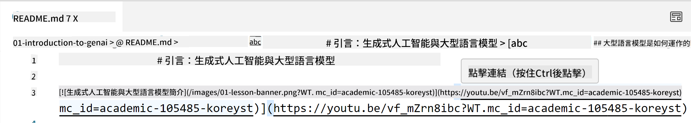
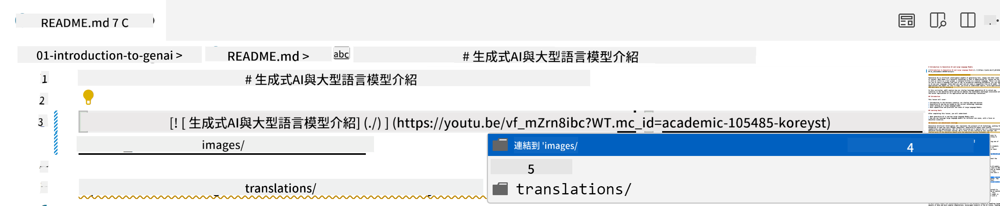
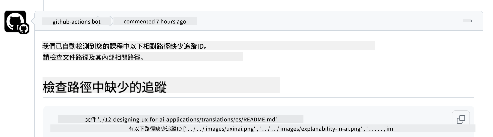
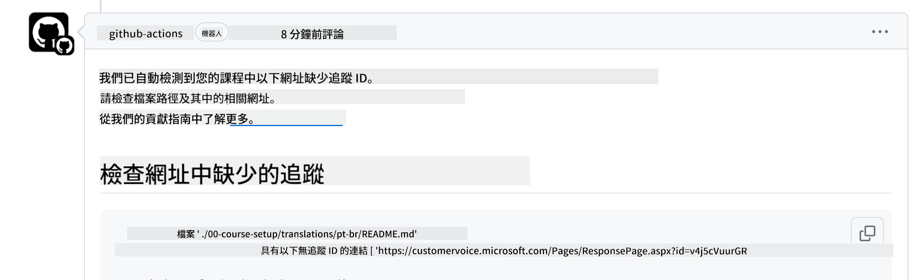
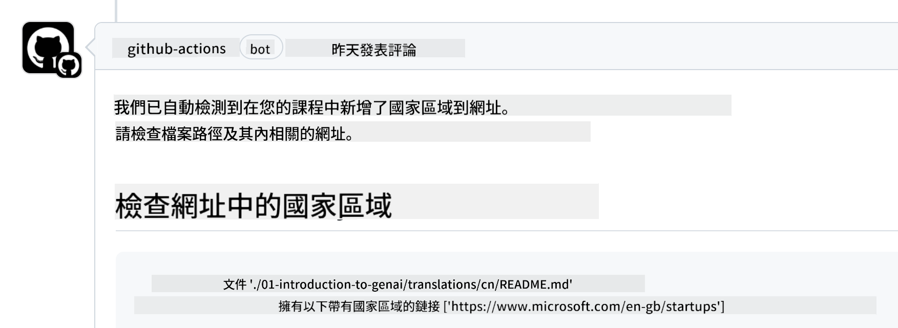

<!--
CO_OP_TRANSLATOR_METADATA:
{
  "original_hash": "57c41f2af71001a2cff9d8eb797cb843",
  "translation_date": "2025-06-25T07:02:31+00:00",
  "source_file": "CONTRIBUTING.md",
  "language_code": "mo"
}
-->
# 貢獻

此專案歡迎貢獻和建議。大多數貢獻需要您同意貢獻者許可協議 (CLA)，聲明您有權並實際授予我們使用您貢獻的權利。詳情請訪問 <https://cla.microsoft.com>。

> 重要：在翻譯此儲存庫中的文字時，請確保不使用機器翻譯。我們將通過社群驗證翻譯，因此請僅自願翻譯您精通的語言。

當您提交 pull request 時，CLA-bot 將自動確定您是否需要提供 CLA 並適當標記 PR（例如，標籤、評論）。只需按照機器人的指示進行操作。您只需在所有使用我們 CLA 的儲存庫中執行一次此操作。

## 行為準則

此專案採用了 [Microsoft 開源行為準則](https://opensource.microsoft.com/codeofconduct/?WT.mc_id=academic-105485-koreyst)。如需更多資訊，請閱讀 [行為準則 FAQ](https://opensource.microsoft.com/codeofconduct/faq/?WT.mc_id=academic-105485-koreyst) 或聯繫 [opencode@microsoft.com](mailto:opencode@microsoft.com) 提出其他問題或評論。

## 問題或疑問？

請不要為一般支持問題開 GitHub 問題，因為 GitHub 列表應用於功能請求和錯誤報告。這樣我們可以更輕鬆地追蹤實際問題或程式碼中的錯誤，並將一般討論與實際程式碼分開。

## 錯字、問題、錯誤和貢獻

每當您提交任何更改到 Generative AI for Beginners 儲存庫時，請遵循以下建議。

* 在進行修改之前，始終將儲存庫 fork 到您自己的帳戶
* 不要將多個更改合併到一個 pull request 中。例如，提交任何錯誤修復和文件更新時，請使用單獨的 PR
* 如果您的 pull request 顯示合併衝突，請確保在進行修改之前更新您本地的 main 以鏡像主儲存庫中的內容
* 如果您提交的是翻譯，請為所有翻譯的文件創建一個 PR，因為我們不接受內容的部分翻譯
* 如果您提交的是錯字或文件修復，您可以在合適的地方將修改合併到單個 PR

## 撰寫的一般指導

- 確保所有的 URL 都用方括號包裹，後跟括號，括號內外沒有多餘的空格 ``。
- 確保任何相對連結（即儲存庫中其他文件和資料夾的連結）以 `./` 開頭，指向當前工作目錄中的文件或資料夾，或者以 `../` 開頭，指向父工作目錄中的文件或資料夾。
- 確保任何相對連結（即儲存庫中其他文件和資料夾的連結）在末尾有一個追蹤 ID（即 `?` 或 `&`，然後是 `wt.mc_id=` 或 `WT.mc_id=`）。
- 確保以下域名的任何 URL _github.com, microsoft.com, visualstudio.com, aka.ms, 和 azure.com_ 在末尾有一個追蹤 ID（即 `?` 或 `&`，然後是 `wt.mc_id=` 或 `WT.mc_id=`）。
- 確保您的連結中沒有特定國家的語言區域（即 `/en-us/` 或 `/en/`）。
- 確保所有圖片都存儲在 `./images` 資料夾中。
- 確保圖片使用描述性的名稱，名稱中使用英文字符、數字和短橫線。

## GitHub 工作流程

當您提交 pull request 時，將觸發四種不同的工作流程以驗證之前的規則。只需按照此處列出的指示即可通過工作流程檢查。

- [檢查損壞的相對路徑](../..)
- [檢查路徑是否有追蹤](../..)
- [檢查 URL 是否有追蹤](../..)
- [檢查 URL 是否沒有區域](../..)

### 檢查損壞的相對路徑

此工作流程確保文件中的任何相對路徑都有效。此儲存庫部署到 GitHub 頁面，因此在鍵入將所有內容粘合在一起的連結時需要非常小心，以免將任何人引導到錯誤的地方。

為確保您的連結正常工作，只需使用 VS code 檢查即可。

例如，當您將滑鼠懸停在文件中的任何連結上時，系統會提示您按 **ctrl + click** 以跟隨連結。

如果您點擊連結並且它在本地不起作用，那麼它肯定會觸發工作流程並且在 GitHub 上也不起作用。

要修復此問題，請嘗試在 VS code 的幫助下鍵入連結。

當您鍵入 `./` 或 `../` 時，VS code 會提示您根據您鍵入的內容從可用選項中選擇。

通過點擊所需的文件或資料夾來跟隨路徑，您可以確保路徑沒有損壞。

一旦您添加了正確的相對路徑，保存並推送更改，工作流程將再次觸發以驗證您的更改。如果您通過了檢查，那麼您就可以繼續了。

### 檢查路徑是否有追蹤

此工作流程確保任何相對路徑中都有追蹤。此儲存庫部署到 GitHub 頁面，因此我們需要追蹤不同文件和資料夾之間的移動。

為確保您的相對路徑中有追蹤，只需檢查路徑末尾的以下文字 `?wt.mc_id=`。如果它被附加到您的相對路徑中，那麼您將通過此檢查。

如果沒有，您可能會收到以下錯誤。

要修復此問題，請嘗試打開工作流程突出顯示的文件路徑，並在相對路徑的末尾添加追蹤 ID。

一旦您添加了追蹤 ID，保存並推送更改，工作流程將再次觸發以驗證您的更改。如果您通過了檢查，那麼您就可以繼續了。

### 檢查 URL 是否有追蹤

此工作流程確保任何網絡 URL 中都有追蹤。此儲存庫對所有人開放，因此您需要確保追蹤訪問，以了解流量的來源。

為確保您的 URL 中有追蹤，只需檢查 URL 末尾的以下文字 `?wt.mc_id=`。如果它被附加到您的 URL 中，那麼您將通過此檢查。

如果沒有，您可能會收到以下錯誤。

要修復此問題，請嘗試打開工作流程突出顯示的文件路徑，並在 URL 的末尾添加追蹤 ID。

一旦您添加了追蹤 ID，保存並推送更改，工作流程將再次觸發以驗證您的更改。如果您通過了檢查，那麼您就可以繼續了。

### 檢查 URL 是否沒有區域

此工作流程確保任何網絡 URL 中沒有特定國家的區域。此儲存庫對全球所有人開放，因此您需要確保不在 URL 中包含您國家的區域。

為確保您的 URL 中沒有國家區域，只需檢查 URL 中是否有以下文字 `/en-us/` 或 `/en/` 或任何其他語言區域。如果它不存在於您的 URL 中，那麼您將通過此檢查。

如果沒有，您可能會收到以下錯誤。

要修復此問題，請嘗試打開工作流程突出顯示的文件路徑，並從 URL 中刪除國家區域。

一旦您刪除了國家區域，保存並推送更改，工作流程將再次觸發以驗證您的更改。如果您通過了檢查，那麼您就可以繼續了。

恭喜！我們將盡快給您反饋您的貢獻。

**免責聲明**：  
本文件已使用AI翻譯服務[Co-op Translator](https://github.com/Azure/co-op-translator)進行翻譯。我們努力追求準確性，但請注意，自動翻譯可能包含錯誤或不準確之處。應將原始語言的文件視為權威來源。對於關鍵信息，建議使用專業人工翻譯。對於因使用此翻譯而產生的任何誤解或誤釋，我們概不負責。