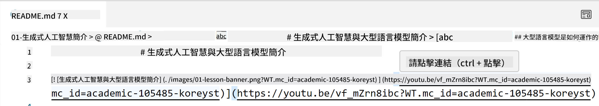
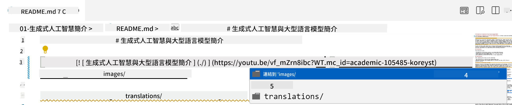
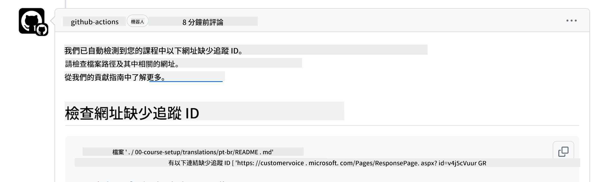
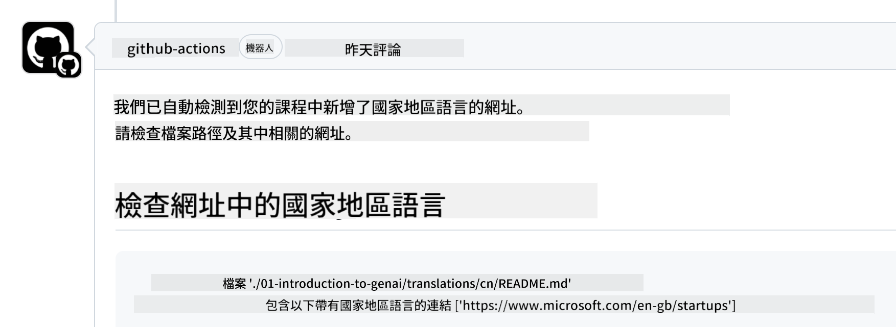

<!--
CO_OP_TRANSLATOR_METADATA:
{
  "original_hash": "57c41f2af71001a2cff9d8eb797cb843",
  "translation_date": "2025-07-09T05:49:49+00:00",
  "source_file": "CONTRIBUTING.md",
  "language_code": "mo"
}
-->
# Contributing

本專案歡迎您的貢獻與建議。大多數貢獻都需要您同意一份貢獻者授權協議（CLA），聲明您有權利且確實授權我們使用您的貢獻。詳細資訊請參閱  
<https://cla.microsoft.com>。

> 重要提示：在翻譯本倉庫中的文字時，請務必避免使用機器翻譯。我們會透過社群驗證翻譯品質，因此請只在您熟悉的語言中自願參與翻譯。

當您提交拉取請求時，CLA-bot 會自動判斷您是否需要提供 CLA，並適當標註 PR（例如標籤、評論）。只需依照機器人的指示操作即可。您在所有使用我們 CLA 的倉庫中只需完成一次此程序。

## Code of Conduct

本專案已採用 [Microsoft Open Source Code of Conduct](https://opensource.microsoft.com/codeofconduct/?WT.mc_id=academic-105485-koreyst)。  
欲了解更多資訊，請閱讀 [Code of Conduct FAQ](https://opensource.microsoft.com/codeofconduct/faq/?WT.mc_id=academic-105485-koreyst)，或透過 [opencode@microsoft.com](mailto:opencode@microsoft.com) 聯絡我們，提出任何額外問題或意見。

## Question or Problem?

請勿針對一般支援問題開啟 GitHub issue，因為 GitHub 問題列表應用於功能請求和錯誤回報。如此一來，我們能更有效追蹤程式碼中的實際問題或錯誤，並將一般討論與程式碼問題分開。

## Typos, Issues, Bugs and contributions

每當您對 Generative AI for Beginners 倉庫提交任何更動時，請遵循以下建議：

* 請先將倉庫 fork 到您自己的帳號，再進行修改
* 不要將多個更動合併到同一個拉取請求。例如，錯誤修正與文件更新請分別提交不同的 PR
* 若您的拉取請求出現合併衝突，請先將本地的 main 分支更新為主倉庫的最新狀態，再進行修改
* 若您提交的是翻譯，請將所有翻譯檔案合併成一個 PR，我們不接受部分內容的翻譯
* 若您提交的是錯字或文件修正，適當時可將多項修改合併成單一 PR

## General Guidance for writing

- 確保所有 URL 都用中括號包住，後面緊接著小括號，且中括號與小括號內外都沒有多餘空格 ``。
- 確保任何相對連結（即指向倉庫中其他檔案或資料夾的連結）都以 `./` 開頭，表示目前工作目錄中的檔案或資料夾，或以 `../` 開頭，表示上層工作目錄中的檔案或資料夾。
- 確保任何相對連結的結尾都帶有追蹤 ID（即 `?` 或 `&` 後接 `wt.mc_id=` 或 `WT.mc_id=`）。
- 確保來自以下網域的 URL _github.com、microsoft.com、visualstudio.com、aka.ms 及 azure.com_ 都帶有追蹤 ID（即 `?` 或 `&` 後接 `wt.mc_id=` 或 `WT.mc_id=`）。
- 確保您的連結中不包含特定國家地區語系（例如 `/en-us/` 或 `/en/`）。
- 確保所有圖片都存放在 `./images` 資料夾中。
- 確保圖片檔名具描述性，且使用英文字母、數字及連字號。

## GitHub Workflows

當您提交拉取請求時，會觸發四個不同的工作流程來驗證上述規則。  
只要依照這裡列出的指示操作，即可通過工作流程檢查。

- [Check Broken Relative Paths](../..)
- [Check Paths Have Tracking](../..)
- [Check URLs Have Tracking](../..)
- [Check URLs Don't Have Locale](../..)

### Check Broken Relative Paths

此工作流程確保您檔案中的相對路徑有效。  
本倉庫部署於 GitHub Pages，因此您在輸入連結時必須非常小心，避免導向錯誤位置。

要確認連結是否正常，您可以使用 VS Code 來檢查。

例如，當您將滑鼠移到檔案中的連結上時，會提示您按 **ctrl + click** 來跟隨連結。

如果您點擊連結後在本地無法正常開啟，工作流程也會因此失敗，連結在 GitHub 上同樣無法使用。

要修正此問題，請嘗試在 VS Code 的協助下輸入連結。

當您輸入 `./` 或 `../` 時，VS Code 會根據您輸入的內容，提示您從可用選項中選擇。

點擊想要的檔案或資料夾，即可確保路徑不會斷裂。

輸入正確的相對路徑後，儲存並推送您的更動，工作流程會再次啟動以驗證您的修改。  
通過檢查後，即可繼續進行。

### Check Paths Have Tracking

此工作流程確保所有相對路徑都帶有追蹤碼。  
本倉庫部署於 GitHub Pages，因此我們需要追蹤不同檔案與資料夾間的流量。

要確認相對路徑是否帶有追蹤碼，請檢查路徑結尾是否有 `?wt.mc_id=`。  
若有附加此字串，即可通過檢查。

若沒有，您可能會看到以下錯誤訊息。

要修正此問題，請打開工作流程標示的檔案路徑，並在相對路徑結尾加上追蹤碼。

加入追蹤碼後，儲存並推送您的更動，工作流程會再次啟動以驗證您的修改。  
通過檢查後，即可繼續進行。

### Check URLs Have Tracking

此工作流程確保所有網頁 URL 都帶有追蹤碼。  
本倉庫對所有人開放，因此您必須確保追蹤訪問來源。

要確認 URL 是否帶有追蹤碼，請檢查 URL 結尾是否有 `?wt.mc_id=`。  
若有附加此字串，即可通過檢查。

若沒有，您可能會看到以下錯誤訊息。

要修正此問題，請打開工作流程標示的檔案路徑，並在 URL 結尾加上追蹤碼。

加入追蹤碼後，儲存並推送您的更動，工作流程會再次啟動以驗證您的修改。  
通過檢查後，即可繼續進行。

### Check URLs Don't Have Locale

此工作流程確保所有網頁 URL 不包含特定國家地區語系。  
本倉庫對全球使用者開放，因此您必須避免在 URL 中加入您所在國家的語系。

要確認 URL 中是否含有國家語系，請檢查 URL 是否包含 `/en-us/`、`/en/` 或其他語言代碼。  
若未出現此類字串，即可通過檢查。

若有，您可能會看到以下錯誤訊息。

要修正此問題，請打開工作流程標示的檔案路徑，並移除 URL 中的國家語系。

移除後，儲存並推送您的更動，工作流程會再次啟動以驗證您的修改。  
通過檢查後，即可繼續進行。

恭喜！我們會盡快回覆您對貢獻的反饋。

**免責聲明**：  
本文件係使用 AI 翻譯服務 [Co-op Translator](https://github.com/Azure/co-op-translator) 進行翻譯。雖然我們致力於確保準確性，但請注意，自動翻譯可能包含錯誤或不準確之處。原始文件的母語版本應視為權威來源。對於重要資訊，建議採用專業人工翻譯。我們不對因使用本翻譯而產生的任何誤解或誤釋負責。