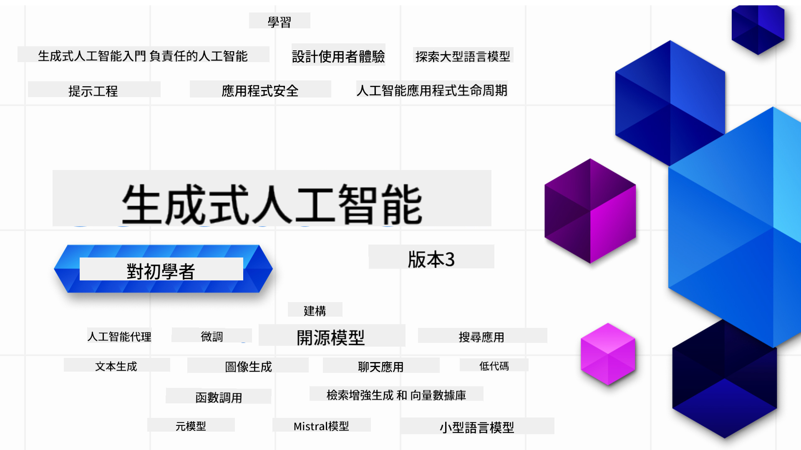

<!--
CO_OP_TRANSLATOR_METADATA:
{
  "original_hash": "5740c9b7fcb6919da1ea4df93475f331",
  "translation_date": "2025-07-09T06:21:43+00:00",
  "source_file": "README.md",
  "language_code": "mo"
}
-->

### 21堂課教你從零開始打造生成式AI應用所需的所有知識

### 🌐 多語言支援

#### 透過 GitHub Action 支援（自動且持續更新）

[French](../fr/README.md) | [Spanish](../es/README.md) | [German](../de/README.md) | [Russian](../ru/README.md) | [Arabic](../ar/README.md) | [Persian (Farsi)](../fa/README.md) | [Urdu](../ur/README.md) | [Chinese (Simplified)](../zh/README.md) | [Chinese (Traditional, Macau)](./README.md) | [Chinese (Traditional, Hong Kong)](../hk/README.md) | [Chinese (Traditional, Taiwan)](../tw/README.md) | [Japanese](../ja/README.md) | [Korean](../ko/README.md) | [Hindi](../hi/README.md) | [Bengali](../bn/README.md) | [Marathi](../mr/README.md) | [Nepali](../ne/README.md) | [Punjabi (Gurmukhi)](../pa/README.md) | [Portuguese (Portugal)](../pt/README.md) | [Portuguese (Brazil)](../br/README.md) | [Italian](../it/README.md) | [Polish](../pl/README.md) | [Turkish](../tr/README.md) | [Greek](../el/README.md) | [Thai](../th/README.md) | [Swedish](../sv/README.md) | [Danish](../da/README.md) | [Norwegian](../no/README.md) | [Finnish](../fi/README.md) | [Dutch](../nl/README.md) | [Hebrew](../he/README.md) | [Vietnamese](../vi/README.md) | [Indonesian](../id/README.md) | [Malay](../ms/README.md) | [Tagalog (Filipino)](../tl/README.md) | [Swahili](../sw/README.md) | [Hungarian](../hu/README.md) | [Czech](../cs/README.md) | [Slovak](../sk/README.md) | [Romanian](../ro/README.md) | [Bulgarian](../bg/README.md) | [Serbian (Cyrillic)](../sr/README.md) | [Croatian](../hr/README.md) | [Slovenian](../sl/README.md) | [Ukrainian](../uk/README.md) | [Burmese (Myanmar)](../my/README.md)

# Generative AI for Beginners (版本3) - 一門課程

透過微軟雲端推廣大使的21堂完整課程，學習打造生成式AI應用的基礎知識。

## 🌱 開始學習

本課程共21堂課，每堂課涵蓋不同主題，您可以從任何一堂開始！

課程分為「Learn」課程，解釋生成式AI的概念；以及「Build」課程，除了說明概念外，還會提供 **Python** 和 **TypeScript** 的程式碼範例（視情況而定）。

.NET 開發者請參考 [Generative AI for Beginners (.NET Edition)](https://github.com/microsoft/Generative-AI-for-beginners-dotnet?WT.mc_id=academic-105485-koreyst)！

每堂課還包含「持續學習」單元，提供額外的學習資源。

## 您需要準備什麼
### 執行本課程程式碼，您可以使用以下任一服務：
 - [Azure OpenAI Service](https://aka.ms/genai-beginners/azure-open-ai?WT.mc_id=academic-105485-koreyst) - **適用課程：** "aoai-assignment"
 - [GitHub Marketplace Model Catalog](https://aka.ms/genai-beginners/gh-models?WT.mc_id=academic-105485-koreyst) - **適用課程：** "githubmodels"
 - [OpenAI API](https://aka.ms/genai-beginners/open-ai?WT.mc_id=academic-105485-koreyst) - **適用課程：** "oai-assignment" 
   
- 具備基本的 Python 或 TypeScript 知識會更有幫助 - \*初學者可參考這些 [Python](https://aka.ms/genai-beginners/python?WT.mc_id=academic-105485-koreyst) 和 [TypeScript](https://aka.ms/genai-beginners/typescript?WT.mc_id=academic-105485-koreyst) 課程
- 一個 GitHub 帳號，方便您[將整個專案庫 fork 到自己的帳號](https://aka.ms/genai-beginners/github?WT.mc_id=academic-105485-koreyst)

我們也準備了 **[課程環境設定](./00-course-setup/README.md?WT.mc_id=academic-105485-koreyst)** 課程，協助您完成開發環境的設定。

別忘了[為此專案庫加星 (🌟)](https://docs.github.com/en/get-started/exploring-projects-on-github/saving-repositories-with-stars?WT.mc_id=academic-105485-koreyst)，方便日後快速找到。

## 🧠 準備好部署了嗎？

如果您想要更進階的程式碼範例，請參考我們的[生成式AI程式碼範例集](https://aka.ms/genai-beg-code?WT.mc_id=academic-105485-koreyst)，提供 **Python** 和 **TypeScript** 版本。

## 🗣️ 與其他學員交流、獲得支援

加入我們的[官方 Azure AI Foundry Discord 伺服器](https://aka.ms/genai-discord?WT.mc_id=academic-105485-koreyst)，與其他學員交流並獲得支援。

也可以在我們的 [Azure AI Foundry 開發者論壇](https://aka.ms/azureaifoundry/forum)（GitHub）提問或分享產品回饋。

## 🚀 想創業？

註冊 [Microsoft for Startups Founders Hub](https://aka.ms/genai-foundershub?WT.mc_id=academic-105485-koreyst)，即可獲得 **免費 OpenAI 點數** 及最高 **15萬美元 Azure 點數補助**，用於透過 Azure OpenAI 服務存取 OpenAI 模型。

## 🙏 想幫忙？

有建議或發現拼字、程式碼錯誤嗎？請[提出議題](https://github.com/microsoft/generative-ai-for-beginners/issues?WT.mc_id=academic-105485-koreyst)或[送出 Pull Request](https://github.com/microsoft/generative-ai-for-beginners/pulls?WT.mc_id=academic-105485-koreyst)。

## 📂 每堂課包含：

- 主題的短影片介紹
- 位於 README 的書面課程內容
- 支援 Azure OpenAI 與 OpenAI API 的 Python 和 TypeScript 程式碼範例
- 延伸學習資源連結

## 🗃️ 課程列表

| #   | **課程連結**                                                                                                                              | **說明**                                                                                     | **影片**                                                                   | **額外學習資源**                                                             |
| --- | -------------------------------------------------------------------------------------------------------------------------------------------- | --------------------------------------------------------------------------------------------- | --------------------------------------------------------------------------- | ------------------------------------------------------------------------------ |
| 00  | [課程環境設定](./00-course-setup/README.md?WT.mc_id=academic-105485-koreyst)                                                                 | **學習：** 如何設定您的開發環境                                                              | 影片即將推出                                                                 | [了解更多](https://aka.ms/genai-collection?WT.mc_id=academic-105485-koreyst) |
| 01  | [生成式AI與大型語言模型介紹](./01-introduction-to-genai/README.md?WT.mc_id=academic-105485-koreyst)                                            | **學習：** 了解什麼是生成式AI以及大型語言模型（LLMs）的運作原理                              | [影片](https://aka.ms/gen-ai-lesson-1-gh?WT.mc_id=academic-105485-koreyst) | [了解更多](https://aka.ms/genai-collection?WT.mc_id=academic-105485-koreyst) |
| 02  | [探索與比較不同的LLMs](./02-exploring-and-comparing-different-llms/README.md?WT.mc_id=academic-105485-koreyst)                                 | **學習：** 如何為您的使用案例選擇合適的模型                                                  | [影片](https://aka.ms/gen-ai-lesson2-gh?WT.mc_id=academic-105485-koreyst)  | [了解更多](https://aka.ms/genai-collection?WT.mc_id=academic-105485-koreyst) |
| 03  | [負責任地使用生成式AI](./03-using-generative-ai-responsibly/README.md?WT.mc_id=academic-105485-koreyst)                                         | **學習：** 如何負責任地打造生成式AI應用                                                      | [影片](https://aka.ms/gen-ai-lesson3-gh?WT.mc_id=academic-105485-koreyst)  | [了解更多](https://aka.ms/genai-collection?WT.mc_id=academic-105485-koreyst) |
| 04  | [理解提示工程基礎](./04-prompt-engineering-fundamentals/README.md?WT.mc_id=academic-105485-koreyst)                                             | **學習：** 實作提示工程最佳實務                                                              | [影片](https://aka.ms/gen-ai-lesson4-gh?WT.mc_id=academic-105485-koreyst)  | [了解更多](https://aka.ms/genai-collection?WT.mc_id=academic-105485-koreyst) |
| 05  | [創建進階提示](./05-advanced-prompts/README.md?WT.mc_id=academic-105485-koreyst)                                                               | **學習：** 如何運用提示工程技巧提升提示效果                                                  | [影片](https://aka.ms/gen-ai-lesson5-gh?WT.mc_id=academic-105485-koreyst)  | [了解更多](https://aka.ms/genai-collection?WT.mc_id=academic-105485-koreyst) |
| 06  | [建立文字生成應用程式](./06-text-generation-apps/README.md?WT.mc_id=academic-105485-koreyst)                                | **建立：** 使用 Azure OpenAI / OpenAI API 建立文字生成應用程式                                | [影片](https://aka.ms/gen-ai-lesson6-gh?WT.mc_id=academic-105485-koreyst)  | [了解更多](https://aka.ms/genai-collection?WT.mc_id=academic-105485-koreyst) |
| 07  | [建立聊天應用程式](./07-building-chat-applications/README.md?WT.mc_id=academic-105485-koreyst)                                     | **建立：** 高效構建與整合聊天應用程式的技巧               | [影片](https://aka.ms/gen-ai-lessons7-gh?WT.mc_id=academic-105485-koreyst) | [了解更多](https://aka.ms/genai-collection?WT.mc_id=academic-105485-koreyst) |
| 08  | [建立搜尋應用程式與向量資料庫](./08-building-search-applications/README.md?WT.mc_id=academic-105485-koreyst)                        | **建立：** 使用 Embeddings 進行資料搜尋的搜尋應用程式                        | [影片](https://aka.ms/gen-ai-lesson8-gh?WT.mc_id=academic-105485-koreyst)  | [了解更多](https://aka.ms/genai-collection?WT.mc_id=academic-105485-koreyst) |
| 09  | [建立影像生成應用程式](./09-building-image-applications/README.md?WT.mc_id=academic-105485-koreyst)                        | **建立：** 影像生成應用程式                                                       | [影片](https://aka.ms/gen-ai-lesson9-gh?WT.mc_id=academic-105485-koreyst)  | [了解更多](https://aka.ms/genai-collection?WT.mc_id=academic-105485-koreyst) |
| 10  | [建立低程式碼 AI 應用程式](./10-building-low-code-ai-applications/README.md?WT.mc_id=academic-105485-koreyst)                       | **建立：** 使用低程式碼工具打造生成式 AI 應用程式                                     | [影片](https://aka.ms/gen-ai-lesson10-gh?WT.mc_id=academic-105485-koreyst) | [了解更多](https://aka.ms/genai-collection?WT.mc_id=academic-105485-koreyst) |
| 11  | [使用 Function Calling 整合外部應用程式](./11-integrating-with-function-calling/README.md?WT.mc_id=academic-105485-koreyst) | **建立：** 什麼是 function calling 及其在應用程式中的使用場景                          | [影片](https://aka.ms/gen-ai-lesson11-gh?WT.mc_id=academic-105485-koreyst) | [了解更多](https://aka.ms/genai-collection?WT.mc_id=academic-105485-koreyst) |
| 12  | [為 AI 應用程式設計使用者體驗](./12-designing-ux-for-ai-applications/README.md?WT.mc_id=academic-105485-koreyst)                         | **學習：** 在開發生成式 AI 應用程式時如何應用 UX 設計原則         | [影片](https://aka.ms/gen-ai-lesson12-gh?WT.mc_id=academic-105485-koreyst) | [了解更多](https://aka.ms/genai-collection?WT.mc_id=academic-105485-koreyst) |
| 13  | [保護您的生成式 AI 應用程式](./13-securing-ai-applications/README.md?WT.mc_id=academic-105485-koreyst)                         | **學習：** AI 系統面臨的威脅與風險，以及保護這些系統的方法             | [影片](https://aka.ms/gen-ai-lesson13-gh?WT.mc_id=academic-105485-koreyst) | [了解更多](https://aka.ms/genai-collection?WT.mc_id=academic-105485-koreyst) |
| 14  | [生成式 AI 應用程式的生命週期](./14-the-generative-ai-application-lifecycle/README.md?WT.mc_id=academic-105485-koreyst)           | **學習：** 管理 LLM 生命週期與 LLMOps 的工具與指標                         | [影片](https://aka.ms/gen-ai-lesson14-gh?WT.mc_id=academic-105485-koreyst) | [了解更多](https://aka.ms/genai-collection?WT.mc_id=academic-105485-koreyst) |
| 15  | [檢索增強生成 (RAG) 與向量資料庫](./15-rag-and-vector-databases/README.md?WT.mc_id=academic-105485-koreyst)        | **建立：** 使用 RAG 框架從向量資料庫檢索 embeddings 的應用程式  | [影片](https://aka.ms/gen-ai-lesson15-gh?WT.mc_id=academic-105485-koreyst) | [了解更多](https://aka.ms/genai-collection?WT.mc_id=academic-105485-koreyst) |
| 16  | [開源模型與 Hugging Face](./16-open-source-models/README.md?WT.mc_id=academic-105485-koreyst)                                    | **建立：** 使用 Hugging Face 上的開源模型打造應用程式                    | [影片](https://aka.ms/gen-ai-lesson16-gh?WT.mc_id=academic-105485-koreyst) | [了解更多](https://aka.ms/genai-collection?WT.mc_id=academic-105485-koreyst) |
| 17  | [AI 代理人](./17-ai-agents/README.md?WT.mc_id=academic-105485-koreyst)                                                                       | **建立：** 使用 AI 代理人框架的應用程式                                           | [影片](https://aka.ms/gen-ai-lesson17-gh?WT.mc_id=academic-105485-koreyst) | [了解更多](https://aka.ms/genai-collection?WT.mc_id=academic-105485-koreyst) |
| 18  | [微調大型語言模型 (LLMs)](./18-fine-tuning/README.md?WT.mc_id=academic-105485-koreyst)                                                              | **學習：** 什麼是微調大型語言模型、為何要微調以及如何微調                                            | [影片](https://aka.ms/gen-ai-lesson18-gh?WT.mc_id=academic-105485-koreyst) | [了解更多](https://aka.ms/genai-collection?WT.mc_id=academic-105485-koreyst) |
| 19  | [使用小型語言模型 (SLMs) 建構](./19-slm/README.md?WT.mc_id=academic-105485-koreyst)                                                              | **學習：** 使用小型語言模型建構的優勢                                            | 影片即將推出 | [了解更多](https://aka.ms/genai-collection?WT.mc_id=academic-105485-koreyst) |
| 20  | [使用 Mistral 模型建構](./20-mistral/README.md?WT.mc_id=academic-105485-koreyst)                                                              | **學習：** Mistral 系列模型的特色與差異                                           | 影片即將推出 | [了解更多](https://aka.ms/genai-collection?WT.mc_id=academic-105485-koreyst) |
| 21  | [使用 Meta 模型建構](./21-meta/README.md?WT.mc_id=academic-105485-koreyst)                                                              | **學習：** Meta 系列模型的特色與差異                                           | 影片即將推出 | [了解更多](https://aka.ms/genai-collection?WT.mc_id=academic-105485-koreyst) |

### 🌟 特別感謝

特別感謝 [**John Aziz**](https://www.linkedin.com/in/john0isaac/) 創建所有 GitHub Actions 和工作流程

[**Bernhard Merkle**](https://www.linkedin.com/in/bernhard-merkle-738b73/) 對每堂課程做出關鍵貢獻，提升學習者與程式碼體驗。

## 🎒 其他課程

我們團隊還製作了其他課程！歡迎參考：

- [**全新** 初學者模型上下文協定](https://github.com/microsoft/mcp-for-beginners?WT.mc_id=academic-105485-koreyst)
- [初學者 AI 代理人](https://github.com/microsoft/ai-agents-for-beginners?WT.mc_id=academic-105485-koreyst)
- [使用 .NET 的生成式 AI 初學者課程](https://github.com/microsoft/Generative-AI-for-beginners-dotnet?WT.mc_id=academic-105485-koreyst)
- [使用 JavaScript 的生成式 AI 初學者課程](https://aka.ms/genai-js-course?WT.mc_id=academic-105485-koreyst)
- [機器學習初學者](https://aka.ms/ml-beginners?WT.mc_id=academic-105485-koreyst)
- [資料科學初學者](https://aka.ms/datascience-beginners?WT.mc_id=academic-105485-koreyst)
- [AI 初學者](https://aka.ms/ai-beginners?WT.mc_id=academic-105485-koreyst)
- [資安初學者](https://github.com/microsoft/Security-101??WT.mc_id=academic-96948-sayoung)
- [網頁開發初學者](https://aka.ms/webdev-beginners?WT.mc_id=academic-105485-koreyst)
- [物聯網初學者](https://aka.ms/iot-beginners?WT.mc_id=academic-105485-koreyst)
- [XR 開發初學者](https://github.com/microsoft/xr-development-for-beginners?WT.mc_id=academic-105485-koreyst)
- [精通 GitHub Copilot 進行 AI 配對程式設計](https://aka.ms/GitHubCopilotAI?WT.mc_id=academic-105485-koreyst)
- [精通 GitHub Copilot 針對 C#/.NET 開發者](https://github.com/microsoft/mastering-github-copilot-for-dotnet-csharp-developers?WT.mc_id=academic-105485-koreyst)
- [選擇你自己的 Copilot 冒險](https://github.com/microsoft/CopilotAdventures?WT.mc_id=academic-105485-koreyst)

**免責聲明**：  
本文件係使用 AI 翻譯服務 [Co-op Translator](https://github.com/Azure/co-op-translator) 進行翻譯。雖然我們致力於確保準確性，但請注意，自動翻譯可能包含錯誤或不準確之處。原始文件的母語版本應視為權威來源。對於重要資訊，建議採用專業人工翻譯。我們不對因使用本翻譯而產生的任何誤解或誤釋負責。