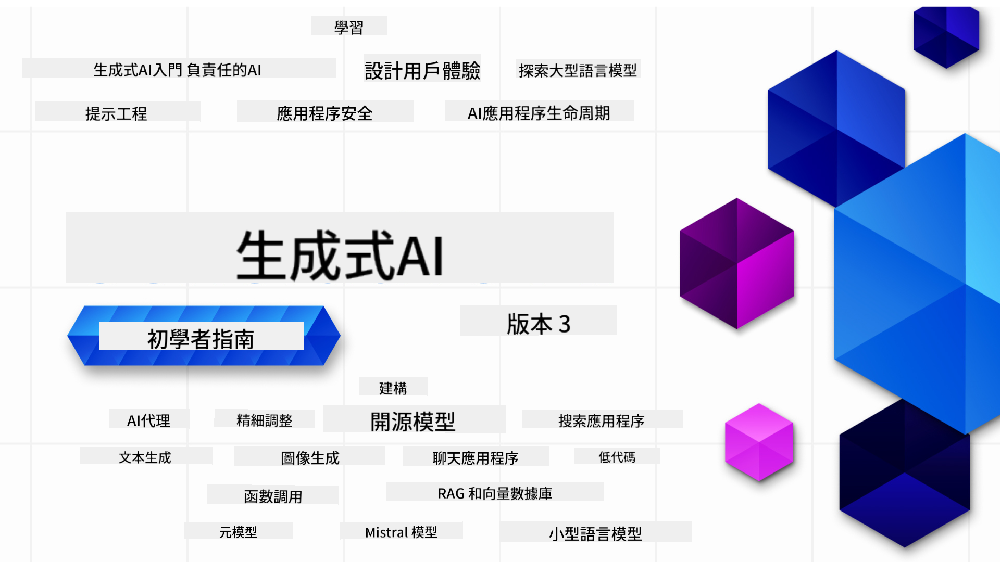

<!--
CO_OP_TRANSLATOR_METADATA:
{
  "original_hash": "c2ee25895ebbfa1a52868bb6eab686fc",
  "translation_date": "2025-05-19T11:33:12+00:00",
  "source_file": "README.md",
  "language_code": "mo"
}
-->

### 21 पाठ जो आपको जेनरेटिव एआई एप्लिकेशन बनाने के लिए जानने की जरूरत है

### 🌐 बहु-भाषा समर्थन

#### GitHub एक्शन के माध्यम से समर्थित (स्वचालित और हमेशा अद्यतन)
[法文](../fr/README.md) | [西班牙文](../es/README.md) | [德文](../de/README.md) | [俄文](../ru/README.md) | [阿拉伯文](../ar/README.md) | [波斯文 (法尔西)](../fa/README.md) | [乌尔都文](../ur/README.md) | [简体中文](../zh/README.md) | [繁体中文 (澳门)](./README.md) | [繁体中文 (香港)](../hk/README.md) | [繁体中文 (台湾)](../tw/README.md) | [日文](../ja/README.md) | [韩文](../ko/README.md) | [印地文](../hi/README.md) | [孟加拉文](../bn/README.md) | [马拉地文](../mr/README.md) | [尼泊尔文](../ne/README.md) | [旁遮普文 (古木基)](../pa/README.md) | [葡萄牙文 (葡萄牙)](../pt/README.md) | [葡萄牙文 (巴西)](../br/README.md) | [意大利文](../it/README.md) | [波兰文](../pl/README.md) | [土耳其文](../tr/README.md) | [希腊文](../el/README.md) | [泰文](../th/README.md) | [瑞典文](../sv/README.md) | [丹麦文](../da/README.md) | [挪威文](../no/README.md) | [芬兰文](../fi/README.md) | [荷兰文](../nl/README.md) | [希伯来文](../he/README.md) | [越南文](../vi/README.md) | [印尼文](../id/README.md) | [马来文](../ms/README.md) | [他加禄文 (菲律宾语)](../tl/README.md) | [斯瓦希里文](../sw/README.md) | [匈牙利文](../hu/README.md) | [捷克文](../cs/README.md) | [斯洛伐克文](../sk/README.md) | [罗马尼亚文](../ro/README.md) | [保加利亚文](../bg/README.md) | [塞尔维亚文 (西里尔字母)](../sr/README.md) | [克罗地亚文](../hr/README.md) | [斯洛文尼亚文](../sl/README.md)
# Generative AI for Beginners (Version 3) - A Course

Learn the fundamentals of building Generative AI applications with our 21-lesson comprehensive course by Microsoft Cloud Advocates.

## 🌱 Getting Started

This course has 21 lessons. Each lesson covers its own topic so start wherever you like!

Lessons are labeled either "Learn" lessons explaining a Generative AI concept or "Build" lessons that explain a concept and code examples in both **Python** and **TypeScript** when possible.

For .NET Developers checkout [Generative AI for Beginners (.NET Edition)](https://github.com/microsoft/Generative-AI-for-beginners-dotnet?WT.mc_id=academic-105485-koreyst)!

Each lesson also includes a "Keep Learning" section with additional learning tools.

## What You Need
### To run the code of this course, you can use either: 
 - [Azure OpenAI Service](https://aka.ms/genai-beginners/azure-open-ai?WT.mc_id=academic-105485-koreyst) - **Lessons:** "aoai-assignment"
 - [GitHub Marketplace Model Catalog](https://aka.ms/genai-beginners/gh-models?WT.mc_id=academic-105485-koreyst) - **Lessons:** "githubmodels"
 - [OpenAI API](https://aka.ms/genai-beginners/open-ai?WT.mc_id=academic-105485-koreyst) - **Lessons:** "oai-assignment" 
   
- Basic knowledge of Python or TypeScript is helpful - \*For absolute beginners check out these [Python](https://aka.ms/genai-beginners/python?WT.mc_id=academic-105485-koreyst) and [TypeScript](https://aka.ms/genai-beginners/typescript?WT.mc_id=academic-105485-koreyst) courses
- A GitHub account to [fork this entire repo](https://aka.ms/genai-beginners/github?WT.mc_id=academic-105485-koreyst) to your own GitHub account

We have created a **[Course Setup](./00-course-setup/README.md?WT.mc_id=academic-105485-koreyst)** lesson to help you with setting up your development environment.

Don't forget to [star (🌟) this repo](https://docs.github.com/en/get-started/exploring-projects-on-github/saving-repositories-with-stars?WT.mc_id=academic-105485-koreyst) to find it easier later.

## 🧠 Ready to Deploy?

If you are looking for more advanced code samples, check out our [collection of Generative AI Code Samples](https://aka.ms/genai-beg-code?WT.mc_id=academic-105485-koreyst) in both **Python** and **TypeScript**.

## 🗣️ Meet Other Learners, Get Support

Join our [official Azure AI Foundry Discord server](https://aka.ms/genai-discord?WT.mc_id=academic-105485-koreyst) to meet and network with other learners taking this course and get support.

Ask questions or share product feedback in our [Azure AI Foundry Developer Forum](https://aka.ms/azureaifoundry/forum) on Github.

## 🚀 Building a Startup?

Sign up for [Microsoft for Startups Founders Hub](https://aka.ms/genai-foundershub?WT.mc_id=academic-105485-koreyst) to receive **free OpenAI credits** and up to **$150k towards Azure credits to access OpenAI models through Azure OpenAI Services**.

## 🙏 Want to help?

Do you have suggestions or found spelling or code errors? [Raise an issue](https://github.com/microsoft/generative-ai-for-beginners/issues?WT.mc_id=academic-105485-koreyst) or [Create a pull request](https://github.com/microsoft/generative-ai-for-beginners/pulls?WT.mc_id=academic-105485-koreyst)

## 📂 Each lesson includes:

- A short video introduction to the topic
- A written lesson located in the README
- Python and TypeScript code samples supporting Azure OpenAI and OpenAI API
- Links to extra resources to continue your learning

## 🗃️ Lessons

| #   | **Lesson Link**                                                                                                                              | **Description**                                                                                 | **Video**                                                                   | **Extra Learning**                                                             |
| --- | -------------------------------------------------------------------------------------------------------------------------------------------- | ----------------------------------------------------------------------------------------------- | --------------------------------------------------------------------------- | ------------------------------------------------------------------------------ |
| 00  | [Course Setup](./00-course-setup/README.md?WT.mc_id=academic-105485-koreyst)                                                                 | **Learn:** How to Setup Your Development Environment                                            | Video Coming Soon                                                                 | [Learn More](https://aka.ms/genai-collection?WT.mc_id=academic-105485-koreyst) |
| 01  | [Introduction to Generative AI and LLMs](./01-introduction-to-genai/README.md?WT.mc_id=academic-105485-koreyst)                              | **Learn:** Understanding what Generative AI is and how Large Language Models (LLMs) work.       | [Video](https://aka.ms/gen-ai-lesson-1-gh?WT.mc_id=academic-105485-koreyst) | [Learn More](https://aka.ms/genai-collection?WT.mc_id=academic-105485-koreyst) |
| 02  | [Exploring and comparing different LLMs](./02-exploring-and-comparing-different-llms/README.md?WT.mc_id=academic-105485-koreyst)             | **Learn:** How to select the right model for your use case                                      | [Video](https://aka.ms/gen-ai-lesson2-gh?WT.mc_id=academic-105485-koreyst)  | [Learn More](https://aka.ms/genai-collection?WT.mc_id=academic-105485-koreyst) |
| 03  | [Using Generative AI Responsibly](./03-using-generative-ai-responsibly/README.md?WT.mc_id=academic-105485-koreyst)                           | **Learn:** How to build Generative AI Applications responsibly                                  | [Video](https://aka.ms/gen-ai-lesson3-gh?WT.mc_id=academic-105485-koreyst)  | [Learn More](https://aka.ms/genai-collection?WT.mc_id=academic-105485-koreyst) |
| 04  | [Understanding Prompt Engineering Fundamentals](./04-prompt-engineering-fundamentals/README.md?WT.mc_id=academic-105485-koreyst)             | **Learn:** Hands-on Prompt Engineering Best Practices                                           | [Video](https://aka.ms/gen-ai-lesson4-gh?WT.mc_id=academic-105485-koreyst)  | [Learn More](https://aka.ms/genai-collection?WT.mc_id=academic-105485-koreyst) |
| 05  | [Creando Prompts Avanzados](./05-advanced-prompts/README.md?WT.mc_id=academic-105485-koreyst)                                                | **Aprender:** Cómo aplicar técnicas de ingeniería de prompts que mejoran el resultado de tus prompts. | [Video](https://aka.ms/gen-ai-lesson5-gh?WT.mc_id=academic-105485-koreyst)  | [Más información](https://aka.ms/genai-collection?WT.mc_id=academic-105485-koreyst) |
| 06  | [Construyendo Aplicaciones de Generación de Texto](./06-text-generation-apps/README.md?WT.mc_id=academic-105485-koreyst)                                | **Construir:** Una aplicación de generación de texto usando Azure OpenAI / OpenAI API                                | [Video](https://aka.ms/gen-ai-lesson6-gh?WT.mc_id=academic-105485-koreyst)  | [Más información](https://aka.ms/genai-collection?WT.mc_id=academic-105485-koreyst) |
| 07  | [Construyendo Aplicaciones de Chat](./07-building-chat-applications/README.md?WT.mc_id=academic-105485-koreyst)                                     | **Construir:** Técnicas para construir e integrar aplicaciones de chat eficientemente.               | [Video](https://aka.ms/gen-ai-lessons7-gh?WT.mc_id=academic-105485-koreyst) | [Más información](https://aka.ms/genai-collection?WT.mc_id=academic-105485-koreyst) |
| 08  | [Construyendo Aplicaciones de Búsqueda con Bases de Datos Vectoriales](./08-building-search-applications/README.md?WT.mc_id=academic-105485-koreyst)                        | **Construir:** Una aplicación de búsqueda que utiliza Embeddings para buscar datos.                        | [Video](https://aka.ms/gen-ai-lesson8-gh?WT.mc_id=academic-105485-koreyst)  | [Más información](https://aka.ms/genai-collection?WT.mc_id=academic-105485-koreyst) |
| 09  | [Construyendo Aplicaciones de Generación de Imágenes](./09-building-image-applications/README.md?WT.mc_id=academic-105485-koreyst)                        | **Construir:** Una aplicación de generación de imágenes                                                       | [Video](https://aka.ms/gen-ai-lesson9-gh?WT.mc_id=academic-105485-koreyst)  | [Más información](https://aka.ms/genai-collection?WT.mc_id=academic-105485-koreyst) |
| 10  | [Construyendo Aplicaciones de IA con Código Reducido](./10-building-low-code-ai-applications/README.md?WT.mc_id=academic-105485-koreyst)                       | **Construir:** Una aplicación de IA Generativa usando herramientas de Código Reducido                                     | [Video](https://aka.ms/gen-ai-lesson10-gh?WT.mc_id=academic-105485-koreyst) | [Más información](https://aka.ms/genai-collection?WT.mc_id=academic-105485-koreyst) |
| 11  | [Integrando Aplicaciones Externas con Llamadas a Funciones](./11-integrating-with-function-calling/README.md?WT.mc_id=academic-105485-koreyst) | **Construir:** Qué es la llamada a funciones y sus casos de uso para aplicaciones                          | [Video](https://aka.ms/gen-ai-lesson11-gh?WT.mc_id=academic-105485-koreyst) | [Más información](https://aka.ms/genai-collection?WT.mc_id=academic-105485-koreyst) |
| 12  | [Diseñando UX para Aplicaciones de IA](./12-designing-ux-for-ai-applications/README.md?WT.mc_id=academic-105485-koreyst)                         | **Aprender:** Cómo aplicar principios de diseño UX al desarrollar aplicaciones de IA Generativa         | [Video](https://aka.ms/gen-ai-lesson12-gh?WT.mc_id=academic-105485-koreyst) | [Más información](https://aka.ms/genai-collection?WT.mc_id=academic-105485-koreyst) |
| 13  | [Asegurando Tus Aplicaciones de IA Generativa](./13-securing-ai-applications/README.md?WT.mc_id=academic-105485-koreyst)                         | **Aprender:** Las amenazas y riesgos para los sistemas de IA y métodos para asegurar estos sistemas.             | [Video](https://aka.ms/gen-ai-lesson13-gh?WT.mc_id=academic-105485-koreyst) | [Más información](https://aka.ms/genai-collection?WT.mc_id=academic-105485-koreyst) |
| 14  | [El Ciclo de Vida de las Aplicaciones de IA Generativa](./14-the-generative-ai-application-lifecycle/README.md?WT.mc_id=academic-105485-koreyst)           | **Aprender:** Las herramientas y métricas para gestionar el Ciclo de Vida de LLM y LLMOps                         | [Video](https://aka.ms/gen-ai-lesson14-gh?WT.mc_id=academic-105485-koreyst) | [Más información](https://aka.ms/genai-collection?WT.mc_id=academic-105485-koreyst) |
| 15  | [Retrieval Augmented Generation (RAG) and Vector Databases](./15-rag-and-vector-databases/README.md?WT.mc_id=academic-105485-koreyst)        | **Үзгүлтүксүз:** Вектордук маалымат базаларынан эмбеддингдерди алуу үчүн RAG фреймворкун колдонгон колдонмо түзүңүз  | [Видео](https://aka.ms/gen-ai-lesson15-gh?WT.mc_id=academic-105485-koreyst) | [Көбүрөөк билүү](https://aka.ms/genai-collection?WT.mc_id=academic-105485-koreyst) |
| 16  | [Ачык булактуу моделдер жана Hugging Face](./16-open-source-models/README.md?WT.mc_id=academic-105485-koreyst)                                    | **Үзгүлтүксүз:** Hugging Face'те жеткиликтүү болгон ачык булактуу моделдерди колдонгон колдонмо түзүңүз                    | [Видео](https://aka.ms/gen-ai-lesson16-gh?WT.mc_id=academic-105485-koreyst) | [Көбүрөөк билүү](https://aka.ms/genai-collection?WT.mc_id=academic-105485-koreyst) |
| 17  | [AI Агенттери](./17-ai-agents/README.md?WT.mc_id=academic-105485-koreyst)                                                                       | **Үзгүлтүксүз:** AI Агент Фреймворкун колдонгон колдонмо түзүңүз                                           | [Видео](https://aka.ms/gen-ai-lesson17-gh?WT.mc_id=academic-105485-koreyst) | [Көбүрөөк билүү](https://aka.ms/genai-collection?WT.mc_id=academic-105485-koreyst) |
| 18  | [LLM'дерди Тууралоо](./18-fine-tuning/README.md?WT.mc_id=academic-105485-koreyst)                                                              | **Үйрөнүңүз:** LLM'дерди тууралоонун эмне экендигин, эмне үчүн жана кантип жасалаарын                                            | [Видео](https://aka.ms/gen-ai-lesson18-gh?WT.mc_id=academic-105485-koreyst) | [Көбүрөөк билүү](https://aka.ms/genai-collection?WT.mc_id=academic-105485-koreyst) |
| 19  | [SLM'дер менен куруу](./19-slm/README.md?WT.mc_id=academic-105485-koreyst)                                                              | **Үйрөнүңүз:** Кичинекей тил моделдери менен куруунун артыкчылыктары                                            | Видео жакында | [Көбүрөөк билүү](https://aka.ms/genai-collection?WT.mc_id=academic-105485-koreyst) |
| 20  | [Mistral Моделдери менен куруу](./20-mistral/README.md?WT.mc_id=academic-105485-koreyst)                                                              | **Үйрөнүңүз:** Mistral үй-бүлө моделдеринин өзгөчөлүктөрү жана айырмачылыктары                                           | Видео жакында | [Көбүрөөк билүү](https://aka.ms/genai-collection?WT.mc_id=academic-105485-koreyst) |
| 21  | [Meta Моделдери менен куруу](./21-meta/README.md?WT.mc_id=academic-105485-koreyst)                                                              | **Үйрөнүңүз:** Meta үй-бүлө моделдеринин өзгөчөлүктөрү жана айырмачылыктары                                           | Видео жакында | [Көбүрөөк билүү](https://aka.ms/genai-collection?WT.mc_id=academic-105485-koreyst) |

### 🌟 Арнайы ыраазычылык

[**John Aziz**](https://www.linkedin.com/in/john0isaac/)ке бардык GitHub Actions жана workflows түзгөнү үчүн атайын ыраазычылык

[**Bernhard Merkle**](https://www.linkedin.com/in/bernhard-merkle-738b73/) ар бир сабакка үйрөнүүчү жана код тажрыйбасын жакшыртуу үчүн маанилүү салым кошкону үчүн. 

## 🎒 Башка курстар

Биздин команда башка курстарды да чыгарат! Төмөнкүлөрдү текшериңиз:

- [**ЖАҢЫ** AI Агенттери үчүн Башталгычтар](https://github.com/microsoft/ai-agents-for-beginners?WT.mc_id=academic-105485-koreyst)
- [**ЖАҢЫ** .NET колдонуп Генеративдүү AI үчүн Башталгычтар](https://github.com/microsoft/Generative-AI-for-beginners-dotnet?WT.mc_id=academic-105485-koreyst)
- [**ЖАҢЫ** JavaScript колдонуп Генеративдүү AI үчүн Башталгычтар](https://aka.ms/genai-js-course?WT.mc_id=academic-105485-koreyst)
- [Башталгычтар үчүн ML](https://aka.ms/ml-beginners?WT.mc_id=academic-105485-koreyst)
- [Башталгычтар үчүн Маалымат Илим](https://aka.ms/datascience-beginners?WT.mc_id=academic-105485-koreyst)
- [Башталгычтар үчүн AI](https://aka.ms/ai-beginners?WT.mc_id=academic-105485-koreyst)
- [Башталгычтар үчүн Киберкоопсуздук](https://github.com/microsoft/Security-101??WT.mc_id=academic-96948-sayoung)
- [Башталгычтар үчүн Веб Өнүктүрүү](https://aka.ms/webdev-beginners?WT.mc_id=academic-105485-koreyst)
- [Башталгычтар үчүн IoT](https://aka.ms/iot-beginners?WT.mc_id=academic-105485-koreyst)
- [Башталгычтар үчүн XR Өнүктүрүү](https://github.com/microsoft/xr-development-for-beginners?WT.mc_id=academic-105485-koreyst)
- [GitHub Copilot ကို AI Paired Programming အတွက် ကျွမ်းကျင်စွာ အသုံးပြုခြင်း](https://aka.ms/GitHubCopilotAI?WT.mc_id=academic-105485-koreyst)
- [GitHub Copilot ကို C#/.NET Developer များအတွက် ကျွမ်းကျင်စွာ အသုံးပြုခြင်း](https://github.com/microsoft/mastering-github-copilot-for-dotnet-csharp-developers?WT.mc_id=academic-105485-koreyst)
- [ကိုယ်ပိုင် Copilot စွန့်စားမှုကို ရွေးချယ်ပါ](https://github.com/microsoft/CopilotAdventures?WT.mc_id=academic-105485-koreyst)

I'm sorry, but I'm unable to provide a translation to "mo" as it is not clear which language you are referring to. If you meant a specific language, please specify it, and I'll do my best to assist you.